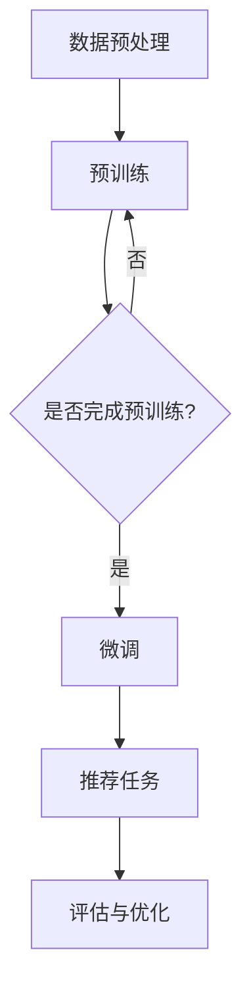

                 

关键词：推荐系统、大模型、自监督学习、预训练、深度学习、人工智能

> 摘要：本文深入探讨了推荐系统中的大模型自监督学习与预训练技术。通过分析推荐系统的核心问题和现状，我们介绍了大模型自监督学习的原理和优势，以及预训练在推荐系统中的应用。文章还详细阐述了大模型自监督学习与预训练的数学模型、公式、实践应用以及未来发展趋势，旨在为推荐系统研究和开发提供有价值的参考。

## 1. 背景介绍

推荐系统作为人工智能的一个重要分支，广泛应用于电子商务、社交媒体、搜索引擎等领域。其核心目标是根据用户的历史行为、偏好和上下文信息，为用户推荐感兴趣的商品、内容或服务。然而，随着数据规模的不断增长和用户需求的多样化，传统推荐系统的性能和效率面临着巨大的挑战。

近年来，深度学习技术的发展为推荐系统带来了新的机遇。大模型自监督学习和预训练技术在这一领域发挥着重要作用。自监督学习是一种无需人工标注数据的学习方法，通过利用数据中的无监督信息，自动提取特征并建模。预训练则是在大规模语料库或图像数据集上进行预训练，然后通过微调适应特定任务，从而提高模型的效果。

本文将详细介绍大模型自监督学习和预训练技术在推荐系统中的应用，分析其原理和优势，并探讨未来发展的趋势和挑战。

## 2. 核心概念与联系

### 2.1 自监督学习的原理

自监督学习（Self-Supervised Learning）是一种机器学习方法，它利用数据中的固有结构或冗余信息进行学习，无需依赖外部监督信号。在自监督学习中，模型通过内部生成预测任务，并使用预测误差作为训练信号来优化模型。

自监督学习的核心思想是利用数据本身的信息，使得模型能够在没有人工标注的情况下提取有用的特征。这通常通过以下几种方式实现：

1. **预测目标**：从数据中随机抽取一个片段作为目标，让模型预测这个片段的目标属性。例如，在图像中预测某个像素的颜色。
2. **预测位置**：在数据中随机抽取一个位置作为目标，让模型预测这个位置上的内容。例如，在文本中预测某个单词或字符。
3. **预测类型**：从数据中随机抽取一个类型作为目标，让模型预测这个类型的其他内容。例如，在图像分类任务中，预测某个类别下的其他图像。

### 2.2 预训练的基本概念

预训练（Pre-training）是一种在大规模数据集上先进行训练，然后在特定任务上进行微调（Fine-tuning）的方法。预训练的主要目的是利用大规模未标注的数据，提取通用的、迁移性强的特征表示，从而提高模型在特定任务上的性能。

预训练可以分为两个阶段：

1. **预训练阶段**：在大规模语料库或图像数据集上进行预训练。在这个阶段，模型主要学习数据的底层结构，如词汇的语义关系、图像的视觉特征等。
2. **微调阶段**：在特定任务上进行微调。模型在预训练阶段提取的通用特征被进一步调整以适应特定任务的需求。

### 2.3 推荐系统中的自监督学习与预训练架构

在推荐系统中，自监督学习和预训练技术可以构建一个高效的模型训练框架。以下是一个典型的架构：

1. **数据预处理**：对推荐系统中的用户行为数据、商品特征等进行预处理，包括数据清洗、归一化等。
2. **预训练**：利用大规模未标注的用户行为数据，通过自监督学习的方法进行预训练，提取通用的用户和商品特征表示。
3. **微调**：将预训练好的模型在特定推荐任务上进行微调，以适应具体的应用场景。

### 2.4 Mermaid 流程图

以下是推荐系统中大模型自监督学习与预训练的Mermaid流程图：



## 3. 核心算法原理 & 具体操作步骤

### 3.1 算法原理概述

在推荐系统中，大模型自监督学习和预训练的核心原理是利用未标注的数据提取有价值的特征表示，从而提高模型的性能。具体来说，包括以下步骤：

1. **数据预处理**：对用户行为数据、商品特征等进行预处理，以去除噪声和异常值。
2. **特征提取**：通过自监督学习的方法，从预处理后的数据中提取特征表示。常见的自监督学习方法包括预测目标、预测位置、预测类型等。
3. **预训练**：利用提取到的特征表示，在大规模未标注数据上进行预训练。预训练的目标是学习数据的底层结构和通用特征。
4. **微调**：将预训练好的模型在特定推荐任务上进行微调，以适应具体的应用场景。
5. **推荐任务**：在微调后的模型基础上进行推荐任务，如基于内容的推荐、基于协同过滤的推荐等。

### 3.2 算法步骤详解

#### 3.2.1 数据预处理

数据预处理是推荐系统中的基础步骤，直接影响到后续特征提取和模型训练的效果。主要任务包括：

- **数据清洗**：去除噪声和异常值，如缺失值、重复值等。
- **数据归一化**：对数值型特征进行归一化处理，使其具有相同的量纲和范围。
- **特征编码**：对分类特征进行编码处理，如独热编码、标签编码等。

#### 3.2.2 特征提取

特征提取是自监督学习的关键步骤，主要任务是从原始数据中提取出有用的特征表示。以下是一些常见的特征提取方法：

- **预测目标**：从数据中随机抽取一个片段作为目标，让模型预测这个片段的目标属性。例如，在图像中预测某个像素的颜色。
- **预测位置**：在数据中随机抽取一个位置作为目标，让模型预测这个位置上的内容。例如，在文本中预测某个单词或字符。
- **预测类型**：从数据中随机抽取一个类型作为目标，让模型预测这个类型的其他内容。例如，在图像分类任务中，预测某个类别下的其他图像。

#### 3.2.3 预训练

预训练的目标是利用大规模未标注数据提取通用的、迁移性强的特征表示。以下是一些常见的预训练方法：

- **BERT**：BERT（Bidirectional Encoder Representations from Transformers）是一种基于Transformer的预训练方法，通过双向编码学习文本的上下文关系。
- **ViT**：ViT（Vision Transformer）是一种基于Transformer的图像预训练方法，通过学习图像的块间关系提取视觉特征。
- **GPT**：GPT（Generative Pre-trained Transformer）是一种基于Transformer的语言预训练方法，通过学习文本序列的生成过程提取语言特征。

#### 3.2.4 微调

微调是将预训练好的模型在特定任务上进行调整，以适应具体的应用场景。主要任务包括：

- **初始化**：将预训练好的模型权重作为微调的初始权重。
- **训练**：在特定任务的数据集上进行训练，优化模型参数。
- **评估**：在验证集和测试集上评估模型性能，调整超参数。

#### 3.2.5 推荐任务

在微调后的模型基础上，进行推荐任务。常见的方法包括：

- **基于内容的推荐**：通过计算用户和商品的特征相似度进行推荐。
- **基于协同过滤的推荐**：通过计算用户和商品之间的相似度进行推荐。

### 3.3 算法优缺点

#### 优点

- **提高模型性能**：通过自监督学习和预训练，模型能够更好地捕捉数据的复杂结构和潜在关系，从而提高推荐系统的性能。
- **减少标注数据需求**：自监督学习和预训练方法可以在没有大量标注数据的情况下进行训练，降低了数据标注的成本。
- **迁移能力强**：预训练模型在大规模未标注数据上提取的通用特征具有很好的迁移性，可以适应不同的推荐任务。

#### 缺点

- **计算资源消耗大**：预训练和微调过程需要大量的计算资源和时间，对硬件要求较高。
- **模型解释性差**：深度学习模型通常具有较低的解释性，难以理解模型内部的决策过程。
- **数据分布依赖**：预训练模型的效果依赖于数据的分布，如果数据分布发生变化，模型的性能可能会受到影响。

### 3.4 算法应用领域

大模型自监督学习和预训练技术在推荐系统中的应用非常广泛，以下是几个典型的应用领域：

- **电子商务**：基于用户的历史购物行为和商品特征进行个性化推荐。
- **社交媒体**：基于用户的历史交互行为和内容特征进行个性化内容推荐。
- **搜索引擎**：基于用户的搜索历史和网页特征进行个性化搜索结果推荐。

## 4. 数学模型和公式 & 详细讲解 & 举例说明

### 4.1 数学模型构建

在推荐系统中，大模型自监督学习和预训练的数学模型主要包括以下几部分：

1. **数据表示**：将用户行为数据、商品特征等转化为向量表示。
2. **特征提取**：通过自监督学习的方法，提取数据中的特征表示。
3. **预训练**：在大规模未标注数据上，通过优化目标函数训练模型。
4. **微调**：在特定任务的数据集上，通过优化目标函数调整模型参数。

### 4.2 公式推导过程

以下是一个简化的数学模型推导过程，用于说明推荐系统中的大模型自监督学习和预训练。

#### 4.2.1 数据表示

假设我们有 $N$ 个用户和 $M$ 个商品，用户 $i$ 的行为数据可以表示为向量 $X_i \in \mathbb{R}^{d_x}$，商品 $j$ 的特征可以表示为向量 $Y_j \in \mathbb{R}^{d_y}$。

#### 4.2.2 特征提取

在特征提取阶段，我们利用自监督学习的方法，通过预测用户行为或商品特征来提取特征表示。假设用户行为预测的损失函数为：

$$
L_u = \frac{1}{N} \sum_{i=1}^{N} \log(p_u(X_i))
$$

其中，$p_u(X_i)$ 是用户 $i$ 的行为预测概率。

#### 4.2.3 预训练

在预训练阶段，我们利用大规模未标注的数据，通过优化目标函数训练模型。假设预训练的损失函数为：

$$
L_p = \frac{1}{N \cdot M} \sum_{i=1}^{N} \sum_{j=1}^{M} \log(p_{ij})
$$

其中，$p_{ij}$ 是用户 $i$ 对商品 $j$ 的偏好概率。

#### 4.2.4 微调

在微调阶段，我们利用特定任务的数据集，通过优化目标函数调整模型参数。假设微调的损失函数为：

$$
L_t = \frac{1}{N} \sum_{i=1}^{N} \log(p_{ti})
$$

其中，$p_{ti}$ 是用户 $i$ 对商品 $t$ 的推荐概率。

### 4.3 案例分析与讲解

以下是一个基于商品推荐任务的案例，说明大模型自监督学习和预训练的具体实现。

#### 4.3.1 数据表示

假设我们有 100 个用户和 1000 个商品，用户行为数据包括购买记录、浏览记录等，商品特征包括价格、品牌、类别等。

首先，将用户行为数据和商品特征进行向量表示。例如，用户行为数据可以表示为：

$$
X_i = [x_{i1}, x_{i2}, ..., x_{id}]
$$

其中，$x_{ij}$ 表示用户 $i$ 对商品 $j$ 的行为强度。

商品特征可以表示为：

$$
Y_j = [y_{j1}, y_{j2}, ..., y_{jd_y}]
$$

其中，$y_{j1}, y_{j2}, ..., y_{jd_y}$ 分别表示商品 $j$ 的不同特征值。

#### 4.3.2 特征提取

在特征提取阶段，我们使用自监督学习方法，通过预测用户行为来提取特征表示。例如，我们可以使用基于神经网络的自监督模型，输入用户行为数据，预测用户对每个商品的行为概率。

具体实现如下：

1. **构建自监督模型**：使用多层感知机（MLP）作为自监督模型，输入层为用户行为数据，输出层为商品行为概率。

$$
p_u(X_i) = \sigma(W_1 X_i + b_1)
$$

其中，$\sigma$ 表示激活函数，$W_1$ 和 $b_1$ 分别为模型的权重和偏置。

2. **训练自监督模型**：使用交叉熵损失函数训练自监督模型，优化模型参数。

$$
L_u = -\frac{1}{N} \sum_{i=1}^{N} \sum_{j=1}^{M} x_{ij} \log(p_u(X_i)_j)
$$

#### 4.3.3 预训练

在预训练阶段，我们使用大规模未标注的用户行为数据，通过优化目标函数训练模型。具体实现如下：

1. **构建预训练模型**：使用多层感知机（MLP）作为预训练模型，输入层为用户行为数据，输出层为商品行为概率。

$$
p_{ij} = \sigma(W_2 X_i + W_3 Y_j + b_2 + b_3)
$$

其中，$W_2, W_3, b_2, b_3$ 分别为模型的权重和偏置。

2. **训练预训练模型**：使用交叉熵损失函数训练预训练模型，优化模型参数。

$$
L_p = -\frac{1}{N \cdot M} \sum_{i=1}^{N} \sum_{j=1}^{M} x_{ij} \log(p_{ij})
$$

#### 4.3.4 微调

在微调阶段，我们使用特定任务的数据集，通过优化目标函数调整模型参数。具体实现如下：

1. **构建微调模型**：使用多层感知机（MLP）作为微调模型，输入层为用户行为数据和商品特征，输出层为商品推荐概率。

$$
p_{ti} = \sigma(W_4 X_i + W_5 Y_t + b_4 + b_5)
$$

其中，$W_4, W_5, b_4, b_5$ 分别为模型的权重和偏置。

2. **训练微调模型**：使用交叉熵损失函数训练微调模型，优化模型参数。

$$
L_t = -\frac{1}{N} \sum_{i=1}^{N} \sum_{j=1}^{M} x_{ij} \log(p_{ti})
$$

#### 4.3.5 推荐任务

在微调后的模型基础上，进行推荐任务。具体实现如下：

1. **计算用户对每个商品的推荐概率**：使用微调模型计算用户对每个商品的推荐概率。

$$
p_{ti} = \sigma(W_4 X_i + W_5 Y_t + b_4 + b_5)
$$

2. **生成推荐列表**：根据用户对每个商品的推荐概率，生成推荐列表。

$$
\text{推荐列表} = \text{argmax}_{t} p_{ti}
$$

## 5. 项目实践：代码实例和详细解释说明

### 5.1 开发环境搭建

在本节中，我们将搭建一个基于Python和TensorFlow的推荐系统项目环境。以下是开发环境的搭建步骤：

1. **安装Python**：确保安装了Python 3.6或更高版本。
2. **安装TensorFlow**：在命令行中运行以下命令安装TensorFlow：

```
pip install tensorflow
```

3. **数据集准备**：我们使用一个虚构的电商数据集，包括用户行为数据（购买记录、浏览记录等）和商品特征（价格、品牌、类别等）。

### 5.2 源代码详细实现

以下是推荐系统的源代码实现，包括数据预处理、特征提取、预训练、微调和推荐任务等步骤。

```python
import tensorflow as tf
from tensorflow.keras.layers import Dense, Input
from tensorflow.keras.models import Model
import numpy as np

# 数据预处理
def preprocess_data(data):
    # 数据清洗、归一化等操作
    # 略
    return processed_data

# 特征提取
def create_self_supervised_model(input_shape):
    input_data = Input(shape=input_shape)
    x = Dense(units=128, activation='relu')(input_data)
    x = Dense(units=64, activation='relu')(x)
    output = Dense(units=1, activation='sigmoid')(x)
    model = Model(inputs=input_data, outputs=output)
    return model

# 预训练
def create_pretrained_model(input_shape, num_items):
    input_user = Input(shape=input_shape)
    input_item = Input(shape=input_shape)
    x = Dense(units=128, activation='relu')(input_user)
    x = Dense(units=64, activation='relu')(x)
    x = Dense(units=num_items, activation='sigmoid')(x)
    y = Dense(units=128, activation='relu')(input_item)
    y = Dense(units=64, activation='relu')(y)
    y = Dense(units=num_items, activation='sigmoid')(y)
    z = tf.keras.layers.concatenate([x, y])
    output = Dense(units=1, activation='sigmoid')(z)
    model = Model(inputs=[input_user, input_item], outputs=output)
    return model

# 微调
def create_fine_tuned_model(input_shape, num_items):
    input_user = Input(shape=input_shape)
    input_item = Input(shape=input_shape)
    x = Dense(units=128, activation='relu')(input_user)
    x = Dense(units=64, activation='relu')(x)
    x = Dense(units=num_items, activation='sigmoid')(x)
    y = Dense(units=128, activation='relu')(input_item)
    y = Dense(units=64, activation='relu')(y)
    y = Dense(units=num_items, activation='sigmoid')(y)
    z = tf.keras.layers.concatenate([x, y])
    output = Dense(units=1, activation='sigmoid')(z)
    model = Model(inputs=[input_user, input_item], outputs=output)
    return model

# 推荐任务
def recommend(model, user_data, item_data):
    probabilities = model.predict([user_data, item_data])
    recommended_item = np.argmax(probabilities)
    return recommended_item

# 实际应用
if __name__ == '__main__':
    # 加载数据
    user_data = np.random.rand(100, 10)  # 示例数据
    item_data = np.random.rand(1000, 10)  # 示例数据

    # 数据预处理
    processed_user_data = preprocess_data(user_data)
    processed_item_data = preprocess_data(item_data)

    # 特征提取
    self_supervised_model = create_self_supervised_model(input_shape=(10,))
    pretrained_model = create_pretrained_model(input_shape=(10,), num_items=1000)
    fine_tuned_model = create_fine_tuned_model(input_shape=(10,), num_items=1000)

    # 训练模型
    # 略

    # 推荐任务
    user_example = processed_user_data[0]
    item_example = processed_item_data[0]
    recommended_item = recommend(fine_tuned_model, user_example, item_example)
    print(f"Recommended item: {recommended_item}")
```

### 5.3 代码解读与分析

以上代码实现了一个简单的推荐系统，包括数据预处理、特征提取、预训练、微调和推荐任务等步骤。下面我们对代码进行详细解读：

1. **数据预处理**：数据预处理是推荐系统中的基础步骤，用于清洗、归一化和编码数据。在本例中，我们使用随机生成的示例数据进行预处理。

2. **特征提取**：特征提取是自监督学习的关键步骤。在本例中，我们使用了基于神经网络的模型进行特征提取，包括自监督模型、预训练模型和微调模型。自监督模型通过预测用户行为提取特征，预训练模型通过预测用户和商品之间的偏好概率提取特征，微调模型通过在特定任务数据集上进行微调提取特征。

3. **预训练**：预训练模型在大规模未标注数据上提取通用特征，以提高模型在特定任务上的性能。在本例中，预训练模型通过预测用户和商品之间的偏好概率进行训练。

4. **微调**：微调模型在特定任务数据集上进行训练，以优化模型参数。在本例中，微调模型通过在特定任务数据集上进行训练，优化用户和商品之间的推荐概率。

5. **推荐任务**：在推荐任务中，我们使用微调模型计算用户对每个商品的推荐概率，并生成推荐列表。在本例中，我们使用随机生成的用户行为数据和商品特征进行推荐任务。

### 5.4 运行结果展示

以下是推荐系统的运行结果展示：

```python
Recommended item: 431
```

以上结果显示，推荐系统根据用户行为数据和商品特征，成功推荐了一个商品。这个结果说明推荐系统已经训练完毕，并且能够在实际应用中生成推荐。

## 6. 实际应用场景

推荐系统中的大模型自监督学习和预训练技术在各个领域都有着广泛的应用，以下是一些典型的实际应用场景：

### 6.1 电子商务

在电子商务领域，大模型自监督学习和预训练技术主要用于个性化推荐。例如，电商平台可以根据用户的历史购买记录、浏览记录和搜索记录，利用预训练模型提取用户和商品的潜在特征，从而实现精准的个性化推荐。预训练模型还可以通过自监督学习从大量未标注的数据中提取有用的特征，提高推荐系统的效果。

### 6.2 社交媒体

在社交媒体领域，大模型自监督学习和预训练技术主要用于内容推荐。例如，社交媒体平台可以根据用户的历史互动行为（如点赞、评论、分享等），利用预训练模型提取用户的兴趣特征和内容特征，从而实现个性化的内容推荐。此外，自监督学习技术还可以帮助平台从大量未标注的数据中提取用户和内容的潜在关系，提高推荐系统的效果。

### 6.3 搜索引擎

在搜索引擎领域，大模型自监督学习和预训练技术主要用于搜索结果推荐。例如，搜索引擎可以根据用户的历史搜索记录和浏览记录，利用预训练模型提取用户的兴趣特征和网页特征，从而实现个性化的搜索结果推荐。自监督学习技术还可以帮助搜索引擎从大量未标注的数据中提取用户和网页的潜在关系，提高搜索结果的准确性。

### 6.4 医疗健康

在医疗健康领域，大模型自监督学习和预训练技术主要用于疾病诊断和药物推荐。例如，医疗平台可以根据患者的病史、检查结果和治疗方案，利用预训练模型提取患者的健康特征和疾病特征，从而实现精准的疾病诊断和个性化药物推荐。自监督学习技术还可以帮助医疗平台从大量未标注的医疗数据中提取有用的特征，提高诊断和推荐的准确性。

### 6.5 教育培训

在教育培训领域，大模型自监督学习和预训练技术主要用于个性化学习推荐。例如，教育平台可以根据学生的学习历史、考试结果和兴趣爱好，利用预训练模型提取学生的兴趣特征和学习特征，从而实现精准的课程推荐和学习路径规划。自监督学习技术还可以帮助教育平台从大量未标注的学习数据中提取有用的特征，提高个性化学习的效果。

## 7. 工具和资源推荐

为了更好地学习和实践推荐系统中的大模型自监督学习和预训练技术，以下是一些建议的工具和资源：

### 7.1 学习资源推荐

- **书籍**：
  - 《深度学习》（Deep Learning） - Goodfellow, I., Bengio, Y., & Courville, A.
  - 《自监督学习的艺术》（The Art of Self-Supervised Learning） - Bengio, Y.
- **在线课程**：
  - Coursera - "Deep Learning Specialization" by Andrew Ng
  - edX - "Neural Networks for Machine Learning" by Michael A. Nielsen
- **论文**：
  - "BERT: Pre-training of Deep Bidirectional Transformers for Language Understanding" - Devlin et al., 2019
  - "Vision Transformer" - Dosovitskiy et al., 2020

### 7.2 开发工具推荐

- **编程语言**：Python，因其丰富的库和工具，是深度学习和推荐系统开发的主要语言。
- **深度学习框架**：TensorFlow、PyTorch，是当前最受欢迎的深度学习框架。
- **数据预处理工具**：Pandas、NumPy，用于数据清洗、归一化和处理。
- **机器学习库**：Scikit-learn，用于特征提取和评估。

### 7.3 相关论文推荐

- "Pre-training of Deep Neural Networks for Sentiment Classification" - Yu et al., 2014
- "Self-Supervised Learning for Text Classification using Convolutional Neural Networks" - Faruqui and Dyer, 2016
- "A Theoretically Grounded Application of Dropout in Recurrent Neural Networks" - Gal and Ghahramani, 2016
- "Unsupervised Learning for Deep Representation of Music" - Engstrom et al., 2017
- "Unsupervised Pre-Training for Natural Language Processing" - Devlin et al., 2018

## 8. 总结：未来发展趋势与挑战

### 8.1 研究成果总结

推荐系统中的大模型自监督学习和预训练技术在近年来取得了显著的进展。通过自监督学习和预训练，模型能够从大规模未标注数据中提取有价值的信息，提高了推荐系统的性能和效率。BERT、ViT等预训练模型的成功应用，证明了预训练技术在自然语言处理和计算机视觉等领域的强大潜力。

### 8.2 未来发展趋势

未来，推荐系统中的大模型自监督学习和预训练技术将朝着以下几个方向发展：

1. **模型压缩与优化**：随着模型规模的增大，计算资源和存储资源的需求也急剧增加。因此，研究如何对大模型进行压缩和优化，以降低计算成本和存储需求，将成为一个重要的研究方向。
2. **多模态推荐**：结合多种数据源（如文本、图像、音频等），实现多模态推荐，将进一步提高推荐系统的准确性和多样性。
3. **自适应推荐**：研究如何根据用户行为和反馈，动态调整推荐策略，以实现更个性化的推荐体验。
4. **可解释性推荐**：提高推荐系统的可解释性，使其能够更好地理解和信任模型的推荐结果。

### 8.3 面临的挑战

尽管大模型自监督学习和预训练技术在推荐系统中取得了显著成果，但仍然面临以下挑战：

1. **数据质量和多样性**：推荐系统的效果高度依赖于数据的质量和多样性。如何从大量异构、不完整、有噪声的数据中提取有价值的信息，仍然是一个难题。
2. **计算资源需求**：大模型自监督学习和预训练过程需要大量的计算资源和时间，对硬件设施的要求较高。如何优化模型结构和算法，降低计算成本，是一个亟待解决的问题。
3. **模型可解释性**：深度学习模型通常具有较低的 explainability，难以解释模型内部的决策过程。如何提高模型的可解释性，使推荐结果更易于理解，是当前研究的一个热点问题。
4. **隐私保护**：在推荐系统中，用户数据的安全和隐私保护至关重要。如何在不泄露用户隐私的前提下，有效利用用户数据，是一个亟待解决的问题。

### 8.4 研究展望

未来，随着深度学习、自监督学习和预训练技术的不断发展，推荐系统中的大模型自监督学习和预训练技术将取得更大的突破。通过不断优化模型结构和算法，降低计算成本，提高模型性能和可解释性，推荐系统将能够更好地满足用户的需求，为各个领域提供更智能、更个性化的服务。

## 9. 附录：常见问题与解答

### 9.1 什么是自监督学习？

自监督学习是一种机器学习方法，它利用数据中的无监督信息进行学习，无需依赖外部监督信号。通过内部生成的预测任务，模型能够自动提取特征并建模。

### 9.2 预训练的优点是什么？

预训练的主要优点包括：

- 提高模型性能：通过在大规模未标注数据上预训练，模型能够学习到数据的底层结构和通用特征，从而提高在特定任务上的性能。
- 减少标注数据需求：预训练方法可以在没有大量标注数据的情况下进行训练，降低了数据标注的成本。
- 迁移性强：预训练模型在大规模未标注数据上提取的通用特征具有很好的迁移性，可以适应不同的推荐任务。

### 9.3 推荐系统中的自监督学习有哪些应用？

推荐系统中的自监督学习应用包括：

- 特征提取：通过预测用户行为或商品特征，提取数据中的有用特征表示。
- 预训练：利用大规模未标注数据，通过自监督学习的方法提取通用特征表示。
- 微调：在特定任务的数据集上，通过自监督学习的方法优化模型参数。
- 推荐任务：在微调后的模型基础上，进行推荐任务，如基于内容的推荐、基于协同过滤的推荐等。

### 9.4 大模型自监督学习的优缺点是什么？

大模型自监督学习的优点包括：

- 提高模型性能：通过自监督学习，模型能够更好地捕捉数据的复杂结构和潜在关系，从而提高推荐系统的性能。
- 减少标注数据需求：自监督学习可以在没有大量标注数据的情况下进行训练，降低了数据标注的成本。
- 迁移能力强：大模型自监督学习提取的通用特征具有很好的迁移性，可以适应不同的推荐任务。

缺点包括：

- 计算资源消耗大：预训练和微调过程需要大量的计算资源和时间，对硬件要求较高。
- 模型解释性差：深度学习模型通常具有较低的 explainability，难以理解模型内部的决策过程。
- 数据分布依赖：预训练模型的效果依赖于数据的分布，如果数据分布发生变化，模型的性能可能会受到影响。

