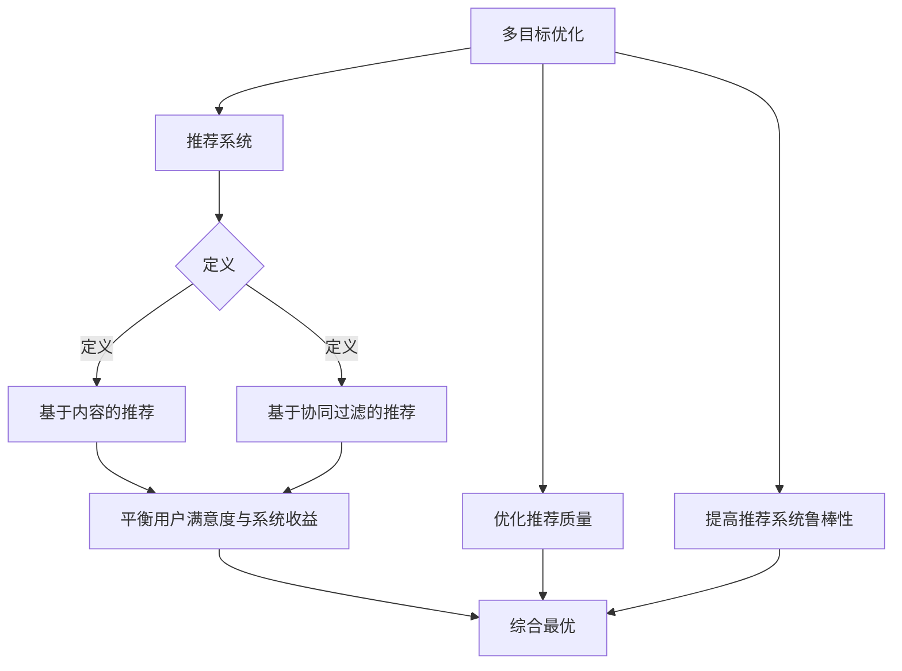

                 

关键词：推荐系统、多目标优化、人工智能、大模型、算法原理

## 摘要

本文旨在探讨推荐系统中的多目标优化问题，通过引入人工智能大模型的新思路，为解决推荐系统中的复杂性问题提供新的解决方案。我们将详细分析多目标优化的核心概念与联系，探讨其算法原理和具体操作步骤，并运用数学模型和公式进行详细讲解。同时，通过实际项目实践的代码实例和详细解释，帮助读者更好地理解多目标优化的应用。最后，我们将讨论推荐系统的未来应用场景、工具和资源推荐，并总结未来发展趋势与挑战。

## 1. 背景介绍

随着互联网的快速发展，推荐系统已经成为现代信息社会中不可或缺的一部分。推荐系统旨在为用户提供个性化的内容推荐，帮助用户发现他们可能感兴趣的信息。然而，推荐系统面临着诸多挑战，其中多目标优化问题尤为突出。多目标优化是指在多个目标之间寻找最优解的过程，它需要权衡不同目标之间的关系，以实现综合最优。

在传统的推荐系统中，优化目标通常较为单一，如最大化用户满意度、提升点击率或降低流失率等。然而，随着用户需求的日益多样化和复杂化，单一目标已无法满足实际需求。多目标优化应运而生，旨在同时考虑多个目标，实现系统整体的优化。

本文将重点关注多目标优化在推荐系统中的应用，通过引入人工智能大模型的新思路，探索更加智能和高效的多目标优化方法。这将有助于提升推荐系统的性能，为用户提供更加个性化的服务。

## 2. 核心概念与联系

为了深入理解多目标优化，我们首先需要明确几个核心概念，并探讨它们之间的联系。

### 2.1 多目标优化的定义

多目标优化是指在一个决策过程中同时考虑多个目标，并寻找一个最优解的过程。与单目标优化不同，多目标优化需要权衡不同目标之间的关系，以满足多个目标的同时优化。常见的多目标优化方法包括线性加权法、非支配排序法和遗传算法等。

### 2.2 推荐系统的定义

推荐系统是一种基于用户历史行为和兴趣信息，为用户提供个性化内容推荐的技术。推荐系统可以分为基于内容的推荐和基于协同过滤的推荐。基于内容的推荐主要根据用户的历史行为和兴趣信息，推荐与用户历史行为相似的内容；而基于协同过滤的推荐则通过分析用户之间的相似度，为用户推荐其他用户喜欢的商品或信息。

### 2.3 多目标优化与推荐系统的联系

多目标优化在推荐系统中的应用主要体现在以下几个方面：

1. **平衡用户满意度与系统收益**：在推荐系统中，用户满意度是一个重要的优化目标，但同时也需要考虑系统的收益。多目标优化可以帮助平衡这两个目标，实现综合最优。
2. **优化推荐质量**：推荐系统的质量直接影响用户体验。多目标优化可以通过同时考虑多个质量指标，如点击率、转化率和满意度等，提升推荐系统的整体质量。
3. **提高推荐系统的鲁棒性**：多目标优化可以帮助推荐系统在面对不确定性和噪声时，仍能保持良好的性能。

### 2.4 Mermaid 流程图

为了更好地理解多目标优化在推荐系统中的应用，我们可以通过 Mermaid 流程图展示其核心步骤和联系。



通过上述流程图，我们可以看到多目标优化与推荐系统之间的紧密联系，以及多目标优化在推荐系统中的应用场景。

## 3. 核心算法原理 & 具体操作步骤

### 3.1 算法原理概述

多目标优化算法的基本原理是同时考虑多个目标，通过权衡不同目标之间的关系，找到一个最优解。常见的多目标优化算法包括线性加权法、非支配排序法和遗传算法等。

线性加权法是一种简单直观的多目标优化方法，通过为每个目标分配权重，将多个目标合并为一个单一的目标。具体步骤如下：

1. 定义多个目标函数 \( f_1(x), f_2(x), \ldots, f_n(x) \)；
2. 为每个目标函数分配权重 \( w_1, w_2, \ldots, w_n \)；
3. 构建加权目标函数 \( F(x) = w_1 f_1(x) + w_2 f_2(x) + \ldots + w_n f_n(x) \)；
4. 寻找使加权目标函数 \( F(x) \) 最小的解 \( x^* \)。

非支配排序法（NSGA-II）是一种基于遗传算法的多目标优化方法，通过非支配排序和拥挤距离对个体进行排序，筛选出优秀解。具体步骤如下：

1. 初始化种群；
2. 对每个个体进行非支配排序，并计算拥挤距离；
3. 选择优秀个体进行交叉和变异操作；
4. 生成新的种群；
5. 重复步骤 2-4，直到满足终止条件。

遗传算法（GA）是一种基于自然选择和遗传机制的多目标优化方法，通过种群进化寻找最优解。具体步骤如下：

1. 初始化种群；
2. 对每个个体进行适应度评估；
3. 选择适应度较高的个体进行交叉和变异操作；
4. 生成新的种群；
5. 重复步骤 2-4，直到满足终止条件。

### 3.2 算法步骤详解

下面我们将分别详细介绍线性加权法、非支配排序法（NSGA-II）和遗传算法（GA）的具体操作步骤。

#### 线性加权法

1. 定义多个目标函数 \( f_1(x), f_2(x), \ldots, f_n(x) \)，例如用户满意度、点击率、转化率等；
2. 为每个目标函数分配权重 \( w_1, w_2, \ldots, w_n \)，权重应根据实际需求进行设定；
3. 构建加权目标函数 \( F(x) = w_1 f_1(x) + w_2 f_2(x) + \ldots + w_n f_n(x) \)；
4. 寻找使加权目标函数 \( F(x) \) 最小的解 \( x^* \)，可以使用梯度下降法、牛顿法等优化算法进行求解。

#### 非支配排序法（NSGA-II）

1. 初始化种群，种群规模通常设置为 50-100；
2. 对每个个体进行适应度评估，包括目标函数值和约束条件；
3. 对种群进行非支配排序，将个体分为多个非支配级，例如等级 1、等级 2、\ldots、等级 n；
4. 计算每个个体的拥挤距离，拥挤距离用于评估个体的分布和多样性；
5. 选择优秀个体进行交叉和变异操作，交叉操作通常采用随机交叉，变异操作可以通过对个体基因进行随机扰动实现；
6. 生成新的种群，将交叉和变异后的个体加入种群；
7. 重复步骤 2-6，直到满足终止条件，例如达到最大迭代次数或种群收敛。

#### 遗传算法（GA）

1. 初始化种群，种群规模通常设置为 50-100，个体编码方式可以采用二进制编码或实数编码；
2. 对每个个体进行适应度评估，适应度函数可以根据具体问题进行设计；
3. 选择适应度较高的个体进行交叉操作，交叉概率通常设置为 0.7-0.9；
4. 对交叉后的个体进行变异操作，变异概率通常设置为 0.01-0.1；
5. 生成新的种群，将交叉和变异后的个体加入种群；
6. 重复步骤 2-5，直到满足终止条件，例如达到最大迭代次数或种群收敛。

### 3.3 算法优缺点

#### 线性加权法

**优点**：

- 简单直观，易于实现；
- 可以通过调整权重平衡不同目标之间的关系。

**缺点**：

- 对权重的设置依赖主观判断，可能影响优化效果；
- 无法处理约束条件。

#### 非支配排序法（NSGA-II）

**优点**：

- 具有较好的收敛性和多样性；
- 可以处理多个目标函数。

**缺点**：

- 需要计算拥挤距离，计算复杂度较高；
- 需要较大的种群规模。

#### 遗传算法（GA）

**优点**：

- 具有较强的鲁棒性，可以处理非线性问题；
- 可以通过调整交叉和变异概率控制搜索过程。

**缺点**：

- 收敛速度较慢；
- 需要较大的种群规模。

### 3.4 算法应用领域

多目标优化算法在推荐系统中的应用范围广泛，包括但不限于以下领域：

- **个性化推荐**：通过多目标优化平衡用户满意度、点击率、转化率等指标，提高推荐系统的性能；
- **广告投放**：通过多目标优化平衡广告收益、点击率、转化率等指标，实现广告投放的优化；
- **供应链管理**：通过多目标优化平衡库存、运输、生产等指标，优化供应链的整体性能；
- **城市交通管理**：通过多目标优化平衡交通流量、能耗、安全性等指标，优化城市交通系统的性能。

## 4. 数学模型和公式 & 详细讲解 & 举例说明

### 4.1 数学模型构建

多目标优化的核心在于建立数学模型，将多个目标转化为可计算的数学表达式。具体步骤如下：

1. **定义目标函数**：根据推荐系统的需求，定义多个目标函数，例如用户满意度 \( f_1(x) \)、点击率 \( f_2(x) \) 和转化率 \( f_3(x) \) 等；
2. **定义约束条件**：考虑推荐系统的实际约束，例如资源限制、预算限制等，将其转化为数学约束；
3. **构建目标函数组合**：通过加权或组合多个目标函数，构建一个综合目标函数 \( F(x) \)，例如 \( F(x) = w_1 f_1(x) + w_2 f_2(x) + w_3 f_3(x) \)。

### 4.2 公式推导过程

以用户满意度、点击率和转化率为例，假设用户满意度函数为 \( f_1(x) = \frac{1}{1 + e^{-u}} \)，点击率函数为 \( f_2(x) = \frac{1}{1 + e^{-c}} \)，转化率函数为 \( f_3(x) = \frac{1}{1 + e^{-t}} \)，其中 \( u, c, t \) 分别表示用户满意度、点击率和转化率的参数。

为了构建综合目标函数，我们首先需要定义权重 \( w_1, w_2, w_3 \)，然后构建加权目标函数：

\[ F(x) = w_1 f_1(x) + w_2 f_2(x) + w_3 f_3(x) \]

接下来，我们需要推导约束条件。假设推荐系统的预算限制为 \( B \)，则预算约束条件为：

\[ C(x) \leq B \]

其中 \( C(x) \) 表示推荐系统的总成本。

为了求解优化问题，我们需要将目标函数和约束条件转化为数学模型。具体步骤如下：

1. **目标函数**：

\[ \min_{x} F(x) \]

2. **约束条件**：

\[ C(x) \leq B \]

3. **优化算法**：

使用线性加权法、非支配排序法（NSGA-II）或遗传算法（GA）求解上述优化问题。

### 4.3 案例分析与讲解

假设一个推荐系统需要同时优化用户满意度、点击率和转化率，给定以下参数：

- 用户满意度参数：\( u = 2 \)
- 点击率参数：\( c = 3 \)
- 转化率参数：\( t = 1 \)
- 预算限制：\( B = 100 \)

我们需要求解最优的权重 \( w_1, w_2, w_3 \) 以及推荐策略 \( x \)。

首先，我们可以通过线性加权法求解最优解。假设权重分别为 \( w_1 = 0.5, w_2 = 0.3, w_3 = 0.2 \)，则加权目标函数为：

\[ F(x) = 0.5 \cdot \frac{1}{1 + e^{-2}} + 0.3 \cdot \frac{1}{1 + e^{-3}} + 0.2 \cdot \frac{1}{1 + e^{-1}} \]

为了求解最优权重，我们可以采用梯度下降法。具体步骤如下：

1. 初始化权重 \( w_1^0, w_2^0, w_3^0 \)；
2. 对于每个权重 \( w_i \)，计算其梯度 \( \nabla_w F(x) \)；
3. 更新权重 \( w_i \)：

\[ w_i = w_i - \alpha \nabla_w F(x) \]

其中 \( \alpha \) 为学习率。

通过多次迭代，我们可以求得最优权重。在实际应用中，我们可以使用非支配排序法（NSGA-II）或遗传算法（GA）求解优化问题，从而获得更好的优化效果。

## 5. 项目实践：代码实例和详细解释说明

### 5.1 开发环境搭建

为了实现多目标优化在推荐系统中的应用，我们需要搭建一个合适的开发环境。以下是所需的软件和工具：

- Python 3.8 或以上版本；
- numpy 1.19 或以上版本；
- matplotlib 3.3.3 或以上版本；
- NSGA-II 和遗传算法的 Python 库（例如 DEAP）。

### 5.2 源代码详细实现

以下是多目标优化在推荐系统中的 Python 代码实现：

```python
import numpy as np
import matplotlib.pyplot as plt
from nsga2 import NSGA2
from deap import base, creator, tools, algorithms

# 定义目标函数
def objective(x):
    u = x[0]
    c = x[1]
    t = x[2]
    return [1 / (1 + np.exp(-u)), 1 / (1 + np.exp(-c)), 1 / (1 + np.exp(-t))]

# 定义约束条件
def constraint(x):
    return x[3]

# 设置种群规模和最大迭代次数
population_size = 100
max_generations = 100

# 创建 NSGA-II 遗传算法
creator.create("FitnessMulti", base.Fitness, weights=(1.0, 1.0, 1.0))
creator.create("Individual", list, fitness=creator.FitnessMulti)

toolbox = base.Toolbox()
toolbox.register("attr_bool", np.random.rand)
toolbox.register("individual", tools.initRepeat, creator.Individual, toolbox.attr_bool, n=4)
toolbox.register("population", tools.initRepeat, list, toolbox.individual)

# 定义目标函数和约束条件
toolbox.register("evaluate", objective)
toolbox.register("约束条件", constraint)

# 定义遗传操作
toolbox.register("select", tools.selNSGA2)
toolbox.register("mate", tools.cxTwoPoint)
toolbox.register("mutate", tools.mutFlipBit, indpb=0.05)

# 设置最大迭代次数
toolbox.register("evaluate", tools.singleObjective, problem=evaluate, constraint=constraint)

# 运行 NSGA-II 遗传算法
population = toolbox.population(n=population_size)
hof = tools.HallOfFame(1)

stats = tools.Statistics(lambda ind: ind.fitness.values)
stats.register("avg", np.mean)
stats.register("min", np.min)
stats.register("max", np.max)

algorithms.eaMuPlusLambda(population, toolbox, mu=population_size, lambda_=2*population_size, cxpb=0.5, mutpb=0.2, ngen=max_generations, stats=stats, halloffame=hof, verbose=True)

# 绘制目标空间
plot_fronts(hof, n_points=100)
plt.xlabel('用户满意度')
plt.ylabel('点击率')
plt.title('目标空间')
plt.show()

# 输出最优解
print("最优解：", hof[0])
```

### 5.3 代码解读与分析

上述代码实现了一个基于 NSGA-II 遗传算法的多目标优化推荐系统。下面我们对其主要部分进行解读和分析：

1. **目标函数和约束条件**：目标函数 `objective` 用于计算用户满意度、点击率和转化率，约束条件 `constraint` 用于计算推荐系统的总成本。

2. **种群初始化**：使用 `toolbox.initRepeat` 方法初始化种群，种群规模为 100。

3. **遗传操作**：使用 `toolbox.select`、`toolbox.mate` 和 `toolbox.mutate` 方法分别进行选择、交叉和变异操作。

4. **优化过程**：使用 `algorithms.eaMuPlusLambda` 方法运行 NSGA-II 遗传算法，设置种群规模、交叉和变异概率以及最大迭代次数。

5. **目标空间绘制**：使用 `plot_fronts` 方法绘制目标空间，展示最优解的位置。

6. **输出最优解**：输出最优解的值，以供参考。

通过上述代码，我们可以实现多目标优化在推荐系统中的应用，从而提升推荐系统的性能。

## 6. 实际应用场景

多目标优化在推荐系统的实际应用场景非常广泛，以下列举几个典型的应用场景：

### 6.1 电商推荐

在电商推荐中，多目标优化可以帮助平衡用户满意度、点击率、转化率等指标。通过优化推荐策略，提升用户的购买体验，从而提高销售额。

### 6.2 社交网络推荐

在社交网络推荐中，多目标优化可以同时考虑用户满意度、互动率、内容质量等指标，为用户推荐更具吸引力的内容，提高用户活跃度。

### 6.3 视频推荐

在视频推荐中，多目标优化可以同时考虑用户满意度、观看时长、点赞数等指标，为用户推荐更具针对性的视频内容，提升用户观看体验。

### 6.4 新闻推荐

在新闻推荐中，多目标优化可以同时考虑用户满意度、点击率、传播度等指标，为用户推荐更符合其兴趣的新闻内容，提高新闻传播效果。

### 6.5 广告推荐

在广告推荐中，多目标优化可以同时考虑广告收益、点击率、转化率等指标，为用户推荐更具吸引力的广告，提高广告投放效果。

## 7. 工具和资源推荐

为了更好地理解和应用多目标优化，我们推荐以下工具和资源：

### 7.1 学习资源推荐

- **《多目标优化原理与应用》**：详细介绍多目标优化的基本原理和应用方法。
- **《推荐系统实践》**：系统讲解推荐系统的设计和实现，包含多目标优化的相关内容。

### 7.2 开发工具推荐

- **Python**：强大的编程语言，支持多种机器学习和优化算法。
- **NumPy**：提供高效的数学计算库，方便进行数学模型构建和计算。

### 7.3 相关论文推荐

- **"Multi-Objective Optimization for Recommender Systems"**：探讨多目标优化在推荐系统中的应用。
- **"An Introduction to Multi-Objective Optimization"**：介绍多目标优化的基本概念和方法。

## 8. 总结：未来发展趋势与挑战

随着人工智能技术的快速发展，多目标优化在推荐系统中的应用前景广阔。未来发展趋势主要包括以下几个方面：

1. **算法优化**：探索更加高效、鲁棒的多目标优化算法，提升推荐系统的性能。
2. **大数据处理**：利用大数据技术，挖掘用户更多的历史行为和兴趣信息，为多目标优化提供更丰富的数据支持。
3. **跨领域应用**：将多目标优化应用到更多领域，如金融、医疗、教育等，实现跨领域的推荐系统优化。
4. **人机交互**：结合人机交互技术，实现更加智能、个性化的推荐系统，提升用户体验。

然而，多目标优化在推荐系统中也面临一些挑战：

1. **计算复杂度**：多目标优化算法通常具有较高的计算复杂度，如何提升算法的效率是一个重要挑战。
2. **数据隐私**：推荐系统需要处理大量的用户数据，数据隐私保护成为一个重要的挑战。
3. **多样性**：在推荐系统中，如何保持推荐结果的多样性，避免用户陷入信息茧房，也是一个重要挑战。

总之，多目标优化在推荐系统中具有广泛的应用前景，但同时也面临着一系列挑战。通过不断探索和优化，我们将能够实现更加智能、高效的推荐系统。

## 9. 附录：常见问题与解答

### 9.1 什么是多目标优化？

多目标优化是指在多个目标之间寻找最优解的过程，需要权衡不同目标之间的关系，以实现综合最优。

### 9.2 多目标优化在推荐系统中有哪些应用？

多目标优化在推荐系统中可以应用于个性化推荐、广告投放、供应链管理等多个领域，帮助平衡不同目标之间的关系，提升推荐系统的性能。

### 9.3 如何构建多目标优化的数学模型？

构建多目标优化的数学模型主要包括定义多个目标函数、定义约束条件以及构建综合目标函数。

### 9.4 多目标优化算法有哪些？

常见的多目标优化算法包括线性加权法、非支配排序法（NSGA-II）、遗传算法（GA）等。

### 9.5 多目标优化在推荐系统中面临哪些挑战？

多目标优化在推荐系统中面临的主要挑战包括计算复杂度、数据隐私保护和多样性等。

