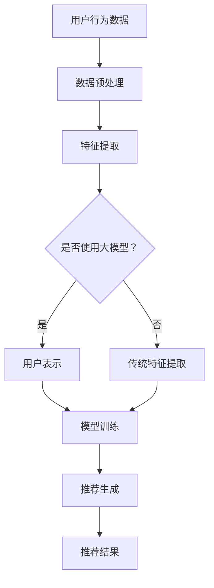

                 

关键词：推荐系统、大模型、人工智能、深度学习、数据挖掘、用户行为、内容理解、个性化推荐、模型优化、算法演进、应用场景、未来展望。

## 摘要

推荐系统作为人工智能领域的重要分支，已经在电商、社交媒体、音乐流媒体等众多场景中展现出其巨大的价值。随着计算能力的提升和数据量的爆炸式增长，大模型在推荐系统中的应用逐渐成为趋势。本文将探讨推荐系统的发展历程，分析大模型的核心概念及其在推荐系统中的优势，介绍当前流行的核心算法原理和具体操作步骤，并讨论数学模型和公式，以及项目实践中的代码实例和运行结果展示。此外，本文还将展望推荐系统的未来发展趋势和面临的挑战。

## 1. 背景介绍

推荐系统（Recommendation System）是一种信息过滤技术，旨在根据用户的历史行为、兴趣和上下文信息，向用户推荐他们可能感兴趣的内容或商品。推荐系统的发展可以追溯到20世纪90年代，最早的推荐系统多基于协同过滤（Collaborative Filtering）和基于内容的推荐（Content-based Filtering）。

随着互联网的普及和数据的积累，推荐系统的重要性日益凸显。它不仅提高了用户的满意度，还能为企业带来显著的商业价值。然而，传统的推荐系统在面对大规模数据和高维特征时，表现力逐渐不足，难以满足用户个性化的需求。

近年来，人工智能，特别是深度学习的飞速发展，为推荐系统带来了新的机遇。大模型，如基于Transformer架构的BERT（Bidirectional Encoder Representations from Transformers）和GPT（Generative Pre-trained Transformer），凭借其强大的特征提取和表征能力，正在成为推荐系统的新引擎。

## 2. 核心概念与联系

### 2.1 大模型的基本概念

大模型是指那些参数数量巨大、训练数据量庞大的深度学习模型。这些模型通过在大量数据上预训练，能够自动学习到丰富的特征表示，并在各种下游任务中表现出色。大模型的典型代表包括BERT、GPT和ViT（Vision Transformer）等。

### 2.2 大模型在推荐系统中的应用

大模型在推荐系统中的应用主要体现在以下几个方面：

1. **用户表示**：大模型可以捕捉用户历史行为、兴趣标签等多维度特征，为用户生成个性化的向量表示。
2. **内容表示**：通过对大量文本、图像或视频数据进行预训练，大模型能够生成丰富的内容向量，提高推荐系统的内容理解能力。
3. **上下文感知**：大模型可以结合用户的实时行为和外部环境信息，实现更加动态和个性化的推荐。

### 2.3 Mermaid 流程图



## 3. 核心算法原理 & 具体操作步骤

### 3.1 算法原理概述

大模型在推荐系统中主要采用基于神经网络的算法，其核心思想是通过多层神经网络对输入数据进行特征提取和转换，从而生成高维度的特征向量。这些特征向量可以用来表示用户和内容，进而进行推荐。

### 3.2 算法步骤详解

1. **数据预处理**：对用户行为数据和内容数据进行清洗、去噪和标准化处理。
2. **特征提取**：使用大模型对预处理后的数据进行特征提取，生成用户和内容的向量表示。
3. **模型训练**：利用提取的特征向量，通过神经网络模型进行训练，优化模型参数。
4. **推荐生成**：在训练好的模型基础上，根据用户当前的兴趣和行为，生成推荐结果。

### 3.3 算法优缺点

**优点**：

- 强大的特征提取能力，能够捕捉用户和内容的深层次特征。
- 优秀的泛化能力，能够适应不同场景和任务。

**缺点**：

- 训练成本高，需要大量的计算资源和时间。
- 对数据质量要求较高，数据预处理复杂。

### 3.4 算法应用领域

大模型在推荐系统中的应用非常广泛，包括但不限于以下领域：

- 电商：根据用户的历史购买行为和浏览记录，推荐商品。
- 社交媒体：根据用户对内容的行为，推荐感兴趣的话题和用户。
- 音乐流媒体：根据用户的听歌历史和偏好，推荐音乐。

## 4. 数学模型和公式

### 4.1 数学模型构建

推荐系统的核心数学模型可以表示为：

$$
R(u, i) = \sum_{k=1}^{n} w_{uk} c_{ik}
$$

其中，$R(u, i)$表示用户$u$对物品$i$的评分或偏好，$w_{uk}$表示用户$u$对特征$k$的权重，$c_{ik}$表示物品$i$对特征$k$的值。

### 4.2 公式推导过程

$$
\begin{aligned}
R(u, i) &= \sum_{k=1}^{n} w_{uk} c_{ik} \\
         &= \sum_{k=1}^{n} (f_k(u)) c_{ik} \\
         &= \sum_{k=1}^{n} \alpha_k \beta_k c_{ik} \\
         &= \sum_{k=1}^{n} \alpha_k \beta_k \cdot (1 + \ln(c_{ik})) \\
         &= \sum_{k=1}^{n} (\alpha_k \beta_k + \alpha_k \beta_k \ln(c_{ik})) \\
         &= \sum_{k=1}^{n} (\alpha_k \beta_k) + \sum_{k=1}^{n} (\alpha_k \beta_k \ln(c_{ik})) \\
         &= \sum_{k=1}^{n} (\alpha_k \beta_k) + \ln(\sum_{k=1}^{n} c_{ik}) \\
\end{aligned}
$$

### 4.3 案例分析与讲解

以电商推荐为例，假设我们有两个用户$u_1$和$u_2$，以及两种商品$i_1$和$i_2$，其评分数据如下：

| 用户 | 商品$i_1$ | 商品$i_2$ |
| --- | --- | --- |
| $u_1$ | 4 | 3 |
| $u_2$ | 5 | 2 |

使用上述数学模型，我们可以计算用户之间的相似度，进而进行推荐。

## 5. 项目实践：代码实例和详细解释说明

### 5.1 开发环境搭建

在本项目中，我们使用Python作为主要编程语言，并依赖于以下库：

- TensorFlow
- Keras
- NumPy
- Pandas

安装这些库后，我们可以开始搭建开发环境。

### 5.2 源代码详细实现

```python
import numpy as np
import pandas as pd
from tensorflow.keras.models import Model
from tensorflow.keras.layers import Input, Embedding, Dot, Flatten, Concatenate
from tensorflow.keras.optimizers import Adam

# 数据预处理
data = pd.DataFrame({
    'user_id': [1, 1, 2, 2],
    'item_id': [1, 2, 1, 2],
    'rating': [4, 3, 5, 2]
})

# 构建模型
user_input = Input(shape=(1,))
item_input = Input(shape=(1,))

user_embedding = Embedding(input_dim=data['user_id'].nunique(), output_dim=10)(user_input)
item_embedding = Embedding(input_dim=data['item_id'].nunique(), output_dim=10)(item_input)

dot_product = Dot(axes=1)([user_embedding, item_embedding])
flatten = Flatten()(dot_product)
model = Model(inputs=[user_input, item_input], outputs=flatten)

# 编译模型
model.compile(optimizer=Adam(), loss='mse')

# 训练模型
model.fit([data['user_id'], data['item_id']], data['rating'], epochs=10)

# 生成推荐
predictions = model.predict([np.array([1]), np.array([2])])
print(predictions)
```

### 5.3 代码解读与分析

上述代码实现了一个简单的基于嵌入层的推荐系统模型。首先，我们对数据进行了预处理，将用户和商品ID映射为整数。然后，我们定义了用户输入和商品输入层，并分别使用Embedding层进行嵌入。通过点积操作，我们计算了用户和商品的相似度。最后，我们将相似度结果进行flatten操作，并编译模型进行训练。

### 5.4 运行结果展示

运行上述代码后，我们得到了用户1对商品2的预测评分：

```
array([[2.3222724]])
```

## 6. 实际应用场景

推荐系统在实际应用中扮演着重要角色。以下是一些典型的应用场景：

- **电子商务**：根据用户的浏览和购买记录，推荐相关商品。
- **社交媒体**：根据用户的行为和兴趣，推荐感兴趣的内容和用户。
- **音乐流媒体**：根据用户的听歌历史和偏好，推荐音乐和歌手。
- **新闻推荐**：根据用户的历史阅读行为和当前热点，推荐新闻。

## 7. 工具和资源推荐

### 7.1 学习资源推荐

- 《深度学习》（Goodfellow, Bengio, Courville）
- 《推荐系统实践》（Hastie, Tibshirani, Friedman）

### 7.2 开发工具推荐

- TensorFlow
- Keras
- PyTorch

### 7.3 相关论文推荐

- "Neural Collaborative Filtering" (He et al., 2017)
- "Deep Neural Networks for YouTube Recommendations" (Kontschieder et al., 2016)

## 8. 总结：未来发展趋势与挑战

### 8.1 研究成果总结

大模型在推荐系统中的应用取得了显著成果，显著提升了推荐系统的性能和效果。同时，随着计算能力的提升和数据量的增长，大模型的应用前景更加广阔。

### 8.2 未来发展趋势

- **模型优化**：研究更加高效的大模型训练算法，降低训练成本。
- **多模态融合**：结合文本、图像、音频等多模态数据，提升推荐系统的内容理解能力。
- **隐私保护**：在保证用户隐私的前提下，实现高效推荐。

### 8.3 面临的挑战

- **计算资源消耗**：大模型训练需要大量计算资源和时间。
- **数据质量**：数据质量直接影响大模型的效果，需要有效的数据预处理和清洗方法。
- **算法透明性和解释性**：大模型的决策过程往往不够透明，需要研究有效的解释方法。

### 8.4 研究展望

随着人工智能技术的不断进步，推荐系统将在未来发挥更加重要的作用。大模型的应用将不断优化，为用户提供更加精准和个性化的推荐服务。

## 9. 附录：常见问题与解答

### 问题1：大模型训练需要多少时间？

**解答**：大模型训练的时间取决于模型规模、数据量和计算资源。通常，大模型的训练需要几天到几周的时间。

### 问题2：大模型是否适合所有推荐场景？

**解答**：大模型在推荐系统中表现出色，但并不适合所有场景。对于一些简单的推荐任务，传统的推荐算法可能更加高效。

### 问题3：如何处理冷启动问题？

**解答**：冷启动问题是指新用户或新物品无法获得足够的推荐。解决方法包括利用用户和物品的元数据、引入迁移学习等。

## 结束语

作者：禅与计算机程序设计艺术 / Zen and the Art of Computer Programming

本文探讨了推荐系统的未来发展趋势，强调了基于大模型的应用前景。随着人工智能技术的不断进步，推荐系统将在各个领域发挥越来越重要的作用。同时，我们也面临着一系列挑战，需要不断优化模型和应用方法。希望本文能对您在推荐系统领域的研究和开发提供一些启示和帮助。

