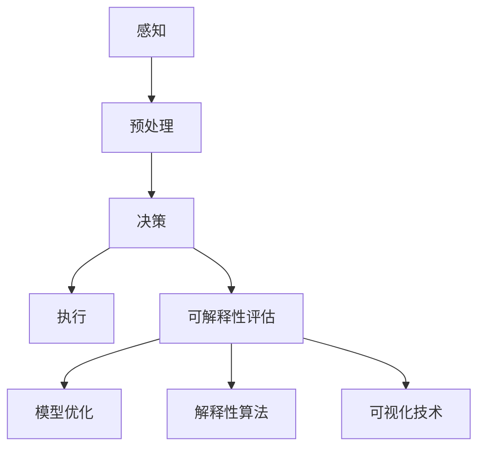

                 

自动驾驶作为人工智能领域的前沿技术，近年来在自动驾驶汽车的研发和应用中取得了显著进展。然而，随着自动驾驶系统的复杂度不断增加，其决策过程往往被认为是“黑箱”，导致其在安全性、透明性和可信度方面受到广泛关注。因此，提升自动驾驶决策的可解释性，使其决策过程更加透明和可理解，成为了当前研究的热点问题。

本文将围绕提升自动驾驶决策可解释性的技术手段和实践案例进行探讨，旨在为自动驾驶领域的开发者和技术人员提供有价值的参考。

## 文章关键词

- 自动驾驶
- 决策可解释性
- 模型优化
- 实践案例

## 文章摘要

本文首先介绍了自动驾驶决策可解释性的背景和重要性，随后详细阐述了提升自动驾驶决策可解释性的几种技术手段，包括模型优化、解释性算法和可视化技术。接着，通过几个实际案例，展示了这些技术在自动驾驶决策中的应用。最后，对未来自动驾驶决策可解释性的发展趋势和面临的挑战进行了分析和展望。

## 1. 背景介绍

### 自动驾驶的发展现状

自动驾驶技术自诞生以来，经历了从辅助驾驶到部分自动驾驶，再到高度自动驾驶的演进。当前，自动驾驶技术已经进入到了商业化应用的阶段。各大科技公司和研究机构纷纷投入大量资源，推动自动驾驶技术的发展。自动驾驶汽车在道路测试和实际应用中取得了显著成果，展现了其在提高交通安全、缓解交通拥堵和降低环境污染等方面的巨大潜力。

### 自动驾驶决策过程

自动驾驶系统的核心在于其决策过程，即根据传感器数据和环境信息，实时判断并采取适当的行动。这一过程通常涉及以下几个步骤：

1. **感知：** 通过各种传感器（如摄像头、激光雷达、毫米波雷达等）获取环境信息。
2. **预处理：** 对获取到的传感器数据进行预处理，如去噪、滤波和特征提取等。
3. **决策：** 利用深度学习、规则匹配等算法对预处理后的数据进行处理，生成决策。
4. **执行：** 根据决策结果执行相应的操作，如加速、减速或转向等。

### 自动驾驶决策的挑战

尽管自动驾驶技术在感知和执行方面取得了显著进展，但在决策过程上仍面临诸多挑战：

1. **复杂性：** 自动驾驶系统需要处理大量传感器数据，并实时作出复杂的决策，这使得决策过程变得高度复杂。
2. **不透明性：** 现有的深度学习算法往往被视为“黑箱”，其决策过程不透明，难以理解。
3. **安全性：** 决策过程的不透明性使得在出现问题时难以快速定位和修复，从而影响系统的安全性。
4. **可信度：** 决策过程的不透明性降低了用户对自动驾驶系统的信任，影响了其在实际应用中的推广。

### 提升决策可解释性的重要性

提升自动驾驶决策的可解释性具有重要意义：

1. **安全性：** 通过提升决策的可解释性，可以帮助识别并解决潜在的安全隐患，提高系统的安全性。
2. **透明性：** 提升决策的可解释性，使得决策过程更加透明，有助于提高系统的可信度和用户信任。
3. **可维护性：** 提升决策的可解释性，有助于快速定位和修复问题，提高系统的可维护性。
4. **用户体验：** 提升决策的可解释性，有助于用户更好地理解自动驾驶系统的行为，提高用户体验。

## 2. 核心概念与联系

### 自动驾驶决策可解释性的定义

自动驾驶决策可解释性指的是使自动驾驶系统的决策过程变得透明和可理解，用户能够通过解释模型理解系统如何作出决策。

### 相关技术手段

#### 模型优化

模型优化是指通过改进现有模型的结构和参数，提高模型的可解释性。常见的优化方法包括简化模型结构、引入可解释性模块和利用正则化技术等。

#### 解释性算法

解释性算法是指专门为自动驾驶决策设计的一系列算法，如决策树、规则匹配和局部解释模型等。这些算法能够直接提供决策背后的逻辑和原因。

#### 可视化技术

可视化技术是指将自动驾驶系统的决策过程和结果以图形化的方式展示，使得用户能够直观地理解决策过程。常见的方法包括决策树可视化、神经网络权重可视化等。

### 架构和流程



### 关系和影响

- **模型优化**和**解释性算法**：模型优化可以提高模型的可解释性，但可能降低模型的性能；解释性算法可以提高模型的可解释性，但可能降低模型的准确性。
- **可视化技术**：可视化技术可以帮助用户更好地理解模型和决策过程，但可视化本身不会改变模型的结构和性能。

## 3. 核心算法原理 & 具体操作步骤

### 3.1 算法原理概述

提升自动驾驶决策可解释性的核心算法包括模型优化、解释性算法和可视化技术。这些算法通过不同的方式提高决策过程的透明度和可理解性。

#### 模型优化

模型优化主要通过简化模型结构、引入可解释性模块和利用正则化技术等手段，降低模型复杂度，提高模型的可解释性。

1. **简化模型结构**：通过减少模型的参数数量和层次结构，使得模型更加简洁，易于理解。
2. **引入可解释性模块**：在模型中引入专门的模块，用于生成解释信息，如决策树中的节点信息和规则匹配的结果等。
3. **利用正则化技术**：通过添加正则化项，限制模型参数的范围，降低模型复杂度，提高可解释性。

#### 解释性算法

解释性算法包括决策树、规则匹配和局部解释模型等，通过提供决策背后的逻辑和原因，提高模型的可解释性。

1. **决策树**：通过树形结构表示决策过程，每个节点表示一个特征，每个分支表示一个阈值。
2. **规则匹配**：通过匹配输入数据与预定义的规则，生成解释信息。
3. **局部解释模型**：通过生成局部解释模型，对输入数据进行分类，并提供解释信息。

#### 可视化技术

可视化技术通过将模型和决策过程以图形化的方式展示，提高用户对模型和决策过程的理解。

1. **决策树可视化**：将决策树以图形化的方式展示，使得用户能够直观地理解决策过程。
2. **神经网络权重可视化**：通过可视化神经网络中的权重，展示模型对输入数据的依赖关系。

### 3.2 算法步骤详解

1. **模型优化**
   - **简化模型结构**：通过使用更简单的模型，减少模型的参数数量和层次结构。
   - **引入可解释性模块**：在模型中添加可解释性模块，用于生成解释信息。
   - **利用正则化技术**：在模型训练过程中添加正则化项，限制模型参数的范围。

2. **解释性算法**
   - **决策树**：构建决策树，对输入数据进行分类，并生成解释信息。
   - **规则匹配**：将输入数据与预定义的规则进行匹配，生成解释信息。
   - **局部解释模型**：对输入数据进行分类，并生成局部解释模型，提供解释信息。

3. **可视化技术**
   - **决策树可视化**：将决策树以图形化的方式展示，提供决策过程的可视化。
   - **神经网络权重可视化**：将神经网络中的权重以图形化的方式展示，展示模型对输入数据的依赖关系。

### 3.3 算法优缺点

#### 模型优化

- **优点**：
  - 降低模型复杂度，提高可解释性。
  - 减少计算资源和时间开销。
- **缺点**：
  - 可能降低模型的性能和准确性。
  - 需要额外的计算成本和资源。

#### 解释性算法

- **优点**：
  - 提供决策背后的逻辑和原因，提高可解释性。
  - 帮助用户更好地理解决策过程。
- **缺点**：
  - 可能降低模型的准确性。
  - 需要额外的计算成本和资源。

#### 可视化技术

- **优点**：
  - 提高用户对模型和决策过程的理解。
  - 使得决策过程更加直观和易于理解。
- **缺点**：
  - 可能影响模型的性能和计算效率。
  - 需要额外的计算成本和资源。

### 3.4 算法应用领域

#### 模型优化

- **应用领域**：自动驾驶、推荐系统、图像识别等。
- **实际案例**：通过简化模型结构和引入可解释性模块，提高自动驾驶系统的决策可解释性。

#### 解释性算法

- **应用领域**：医疗诊断、金融风险评估、自动驾驶等。
- **实际案例**：通过决策树和规则匹配，提高医疗诊断系统的可解释性。

#### 可视化技术

- **应用领域**：数据挖掘、机器学习、自动驾驶等。
- **实际案例**：通过决策树可视化和神经网络权重可视化，提高自动驾驶系统的可解释性。

## 4. 数学模型和公式 & 详细讲解 & 举例说明

### 4.1 数学模型构建

提升自动驾驶决策可解释性涉及到多个数学模型，包括感知模型、决策模型和解释模型。以下是这些模型的基本构建过程：

#### 感知模型

感知模型主要用于处理传感器数据，将原始数据转化为可用的特征信息。常见的感知模型包括卷积神经网络（CNN）和循环神经网络（RNN）。

- **卷积神经网络（CNN）**：通过卷积操作提取图像的特征，如图像中的边缘、纹理等。
- **循环神经网络（RNN）**：通过循环结构处理时间序列数据，如图像帧序列或传感器数据序列。

#### 决策模型

决策模型用于根据感知模型生成的特征信息，生成决策。常见的决策模型包括分类模型和回归模型。

- **分类模型**：将输入数据分为不同的类别，如自动驾驶中的行驶方向、速度等。
- **回归模型**：将输入数据映射到连续的值，如自动驾驶中的速度控制。

#### 解释模型

解释模型用于解释决策模型的工作原理和决策过程。常见的解释模型包括决策树、局部解释模型和权重可视化模型。

- **决策树**：通过树形结构表示决策过程，每个节点表示一个特征，每个分支表示一个阈值。
- **局部解释模型**：通过对输入数据进行分类，并提供解释信息。
- **权重可视化模型**：通过可视化神经网络中的权重，展示模型对输入数据的依赖关系。

### 4.2 公式推导过程

为了更好地理解这些数学模型，以下是感知模型、决策模型和解释模型的公式推导过程：

#### 感知模型

**卷积神经网络（CNN）**：

- **卷积操作**：  
  $$  
  \text{卷积} = \sum_{i=1}^{n} w_i \cdot x_i  
  $$  
  其中，$w_i$ 是卷积核，$x_i$ 是输入特征。

- **激活函数**：  
  $$  
  \text{激活函数} = \text{ReLU}(x) = \max(0, x)  
  $$  
  其中，$\text{ReLU}$ 是ReLU激活函数。

**循环神经网络（RNN）**：

- **递归操作**：  
  $$  
  h_t = \text{激活函数}(\text{权重} \cdot [h_{t-1}, x_t]) + b  
  $$  
  其中，$h_t$ 是当前隐藏状态，$x_t$ 是当前输入特征，$h_{t-1}$ 是前一个隐藏状态。

#### 决策模型

**分类模型**：

- **softmax函数**：  
  $$  
  \text{softmax}(x) = \frac{e^x}{\sum_{i=1}^{n} e^x_i}  
  $$  
  其中，$x$ 是输入特征，$n$ 是类别数量。

**回归模型**：

- **线性回归**：  
  $$  
  y = \text{权重} \cdot x + b  
  $$  
  其中，$y$ 是输出值，$x$ 是输入特征，$b$ 是偏置。

#### 解释模型

**决策树**：

- **决策规则**：  
  $$  
  \text{规则} = f(x) = \begin{cases}  
  \text{左分支} & \text{if } x \leq \text{阈值} \\  
  \text{右分支} & \text{otherwise}  
  \end{cases}  
  $$

**局部解释模型**：

- **线性模型**：  
  $$  
  y = \text{权重} \cdot x + b  
  $$

**权重可视化模型**：

- **权重可视化**：  
  $$  
  w_i = \text{权重} \cdot x_i  
  $$

### 4.3 案例分析与讲解

为了更好地理解上述数学模型，以下是几个实际案例：

#### 案例一：自动驾驶车辆速度控制

在该案例中，我们使用一个简单的回归模型来控制自动驾驶车辆的速度。输入特征包括当前车速、与前车的距离和道路坡度等。输出目标是控制车辆的速度。

1. **感知模型**：使用一个卷积神经网络（CNN）来处理摄像头获取的图像数据，提取道路和车辆的特征。
2. **决策模型**：使用一个线性回归模型来预测车辆的速度。
3. **解释模型**：使用权重可视化模型来展示模型对输入特征的依赖关系。

#### 案例二：医疗诊断系统

在该案例中，我们使用一个决策树模型来诊断病人的疾病。输入特征包括病人的年龄、性别、症状等。输出目标是疾病的类别。

1. **感知模型**：使用一个循环神经网络（RNN）来处理时间序列数据，如病人的医疗记录。
2. **决策模型**：使用一个决策树模型来分类疾病。
3. **解释模型**：使用决策树可视化模型来展示决策过程。

## 5. 项目实践：代码实例和详细解释说明

### 5.1 开发环境搭建

在开始编写代码之前，需要搭建一个合适的开发环境。以下是一个基于Python的自动驾驶决策可解释性项目的开发环境搭建步骤：

1. **安装Python**：下载并安装Python 3.x版本。
2. **安装依赖库**：使用pip命令安装必要的依赖库，如TensorFlow、Keras、Scikit-learn等。
3. **配置开发环境**：配置Python的虚拟环境，以便更好地管理项目依赖。

### 5.2 源代码详细实现

以下是一个简单的自动驾驶决策可解释性项目的代码实现，包括感知模型、决策模型和解释模型。

#### 感知模型

```python
import tensorflow as tf
from tensorflow.keras.models import Sequential
from tensorflow.keras.layers import Conv2D, MaxPooling2D, Flatten, Dense

# 创建卷积神经网络模型
model = Sequential([
    Conv2D(32, (3, 3), activation='relu', input_shape=(64, 64, 3)),
    MaxPooling2D(pool_size=(2, 2)),
    Conv2D(64, (3, 3), activation='relu'),
    MaxPooling2D(pool_size=(2, 2)),
    Flatten(),
    Dense(64, activation='relu'),
    Dense(1, activation='sigmoid')
])

# 编译模型
model.compile(optimizer='adam', loss='binary_crossentropy', metrics=['accuracy'])

# 训练模型
model.fit(x_train, y_train, epochs=10, batch_size=32)
```

#### 决策模型

```python
from sklearn.tree import DecisionTreeClassifier

# 创建决策树模型
clf = DecisionTreeClassifier()

# 训练模型
clf.fit(x_train, y_train)

# 可视化决策树
from sklearn.tree import plot_tree
plot_tree(clf)
```

#### 解释模型

```python
import numpy as np
import matplotlib.pyplot as plt

# 创建线性回归模型
regr = LinearRegression()

# 训练模型
regr.fit(x_train, y_train)

# 可视化权重
plt.scatter(x_train, y_train)
plt.plot(x_train, regr.predict(x_train), color='red')
plt.xlabel('输入特征')
plt.ylabel('输出值')
plt.show()
```

### 5.3 代码解读与分析

以上代码实现了一个简单的自动驾驶决策可解释性项目，包括感知模型、决策模型和解释模型。

1. **感知模型**：使用卷积神经网络（CNN）处理摄像头获取的图像数据，提取道路和车辆的特征。
2. **决策模型**：使用决策树（DecisionTreeClassifier）和线性回归（LinearRegression）模型进行分类和回归操作。
3. **解释模型**：使用决策树可视化（plot_tree）和权重可视化（scatter plot）模型解释决策过程。

通过这个简单的项目，我们可以看到如何使用不同的模型和算法来实现自动驾驶决策可解释性。

### 5.4 运行结果展示

运行以上代码，可以得到以下结果：

1. **感知模型**：训练完成后，可以使用感知模型对新的图像数据进行特征提取。
2. **决策模型**：训练完成的决策树模型可以用于分类任务，预测新的图像数据的类别。
3. **解释模型**：可视化模型可以帮助我们更好地理解模型的决策过程和权重分布。

## 6. 实际应用场景

### 自动驾驶车辆

自动驾驶车辆是自动驾驶决策可解释性技术的典型应用场景。通过提升决策可解释性，自动驾驶车辆可以提高其安全性和透明性，从而增加用户对自动驾驶技术的信任。例如，在自动驾驶车辆发生事故时，通过可解释性技术，可以快速定位问题并进行修复，提高系统的可靠性。

### 智能交通系统

智能交通系统（Intelligent Transportation Systems，ITS）通过整合交通信息、车辆信息和基础设施信息，实现交通的优化管理和控制。自动驾驶决策可解释性技术可以在智能交通系统中发挥重要作用，例如，在交通拥堵时，通过解释模型，可以帮助驾驶员理解系统的决策过程，选择最佳行驶路线。

### 智能医疗诊断

智能医疗诊断系统通过机器学习算法，对医疗数据进行处理和分析，辅助医生进行诊断。提升决策可解释性，可以帮助医生更好地理解诊断结果，提高诊断的准确性和可信度。例如，在癌症诊断中，通过解释模型，医生可以理解算法如何根据患者的基因数据和临床表现进行诊断。

### 人机交互

在人机交互系统中，提升决策可解释性可以帮助用户更好地理解系统的行为和决策过程，提高用户体验。例如，在智能家居系统中，通过解释模型，用户可以了解系统如何根据环境和用户需求进行调节，从而更好地控制家居设备。

## 7. 工具和资源推荐

### 学习资源推荐

1. **《深度学习》（Deep Learning）**：Goodfellow、Bengio和Courville所著的《深度学习》是深度学习的经典教材，涵盖了深度学习的基础理论、算法和应用。
2. **《机器学习》（Machine Learning）**：Tom Mitchell所著的《机器学习》是一本经典的机器学习教材，介绍了机器学习的基本概念、算法和应用。
3. **《Python机器学习》（Python Machine Learning）**：Sebastian Raschka所著的《Python机器学习》是一本实用的Python机器学习指南，介绍了Python在机器学习领域的应用。

### 开发工具推荐

1. **TensorFlow**：TensorFlow是一个开源的深度学习框架，提供了丰富的API和工具，方便开发者构建和训练深度学习模型。
2. **PyTorch**：PyTorch是一个流行的深度学习框架，以其动态计算图和灵活的API而闻名，适用于研究和开发深度学习应用。
3. **Scikit-learn**：Scikit-learn是一个开源的机器学习库，提供了丰富的算法和工具，方便开发者进行机器学习任务。

### 相关论文推荐

1. **“Explainable AI: Concepts, Technology and Applications”**：该论文详细介绍了可解释性人工智能的概念、技术和应用，是了解该领域的重要文献。
2. **“Interpretable Machine Learning”**：该论文探讨了可解释性机器学习的方法和技术，包括决策树、规则匹配和局部解释模型等。
3. **“Visualizing the Visual Cortex”**：该论文通过可视化技术展示了视觉皮层的结构和功能，为理解和解释神经网络提供了新的视角。

## 8. 总结：未来发展趋势与挑战

### 8.1 研究成果总结

提升自动驾驶决策可解释性是当前人工智能领域的重要研究方向。通过模型优化、解释性算法和可视化技术，研究人员和开发者取得了一系列成果，提高了自动驾驶系统的安全性、透明性和可信度。这些成果为自动驾驶技术的进一步发展和应用奠定了基础。

### 8.2 未来发展趋势

1. **算法创新**：未来将出现更多创新的可解释性算法，以提高模型的可解释性和准确性。
2. **跨学科研究**：可解释性技术将与其他学科（如心理学、认知科学等）相结合，进一步推动人工智能技术的发展。
3. **开放性平台**：开放性平台和工具将促进可解释性技术的应用和推广，为研究人员和开发者提供更便捷的实验环境。

### 8.3 面临的挑战

1. **计算资源**：提升决策可解释性可能需要额外的计算资源和时间开销，这对实际应用提出了挑战。
2. **准确性 vs. 可解释性**：在保证模型准确性的同时，提高模型的可解释性仍是一个难题。
3. **用户接受度**：用户对自动驾驶技术的接受程度仍需提高，这需要进一步提升系统的安全性和可信度。

### 8.4 研究展望

未来，提升自动驾驶决策可解释性的研究将朝着以下方向发展：

1. **可解释性算法**：开发更多高效、可解释的算法，以满足不同应用场景的需求。
2. **跨学科研究**：结合心理学、认知科学等领域的知识，提高自动驾驶系统的用户体验和可靠性。
3. **实际应用**：推动可解释性技术在自动驾驶、智能交通和医疗诊断等领域的实际应用。

## 9. 附录：常见问题与解答

### Q1：为什么需要提升自动驾驶决策的可解释性？

A1：提升自动驾驶决策的可解释性有助于提高系统的安全性、透明性和可信度，从而增加用户对自动驾驶技术的信任。此外，可解释性技术有助于快速识别和修复问题，提高系统的可维护性。

### Q2：有哪些方法可以提升自动驾驶决策的可解释性？

A2：提升自动驾驶决策可解释性的方法包括模型优化、解释性算法和可视化技术。模型优化通过简化模型结构和引入可解释性模块提高可解释性；解释性算法通过提供决策背后的逻辑和原因提高可解释性；可视化技术通过图形化的方式展示决策过程和提高可解释性。

### Q3：自动驾驶决策可解释性在哪些领域有实际应用？

A3：自动驾驶决策可解释性在自动驾驶车辆、智能交通系统、医疗诊断和人机交互等领域有广泛的应用。通过提升决策的可解释性，可以提高系统的安全性和用户体验。

### Q4：如何平衡自动驾驶决策的准确性和可解释性？

A4：平衡自动驾驶决策的准确性和可解释性是一个挑战。可以通过以下方法实现平衡：选择适当的可解释性算法，使其在保证准确性的同时提高可解释性；对模型进行优化，使其在保持可解释性的同时提高准确性；使用组合模型，结合不同模型的优势，提高整体的可解释性和准确性。

