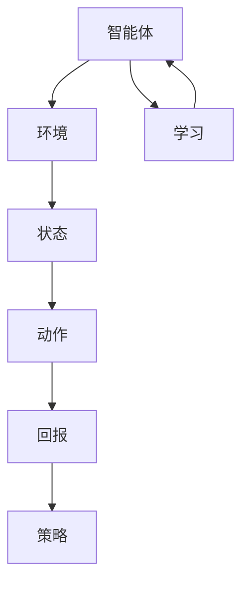

                 

 关键词：强化学习、个性化广告投放、校招面试、算法原理、数学模型、项目实践

> 摘要：本文将详细解析搜狐2024年校招强化学习面试题，重点介绍个性化广告投放算法，从核心概念、算法原理、数学模型到项目实践，全方位剖析强化学习在广告投放中的实际应用。

## 1. 背景介绍

个性化广告投放是现代互联网广告领域的重要研究方向，其核心目标是在确保广告效果最优化的同时，为用户带来个性化的广告体验。随着互联网用户规模的不断扩大和用户需求的多样化，传统的广告投放策略已无法满足市场的需求。强化学习作为一种先进的机器学习算法，因其具备自适应性和良好的效果预测能力，逐渐成为个性化广告投放的重要技术手段。

本文将以搜狐2024年校招强化学习面试题为切入点，详细解析个性化广告投放中的强化学习算法。通过深入探讨核心概念、算法原理、数学模型以及项目实践，为读者提供一个全面、系统的强化学习在广告投放中的应用指南。

### 1.1 强化学习简介

强化学习（Reinforcement Learning，RL）是机器学习的一个重要分支，其主要思想是通过不断试错来学习如何做出最优决策。在强化学习中，智能体（Agent）通过与环境的交互，不断积累经验，并在此基础上调整策略，以达到最大化累积回报的目的。

强化学习在广告投放中的核心应用是决策，即如何在海量用户行为数据和广告资源中，为每个用户实时选择最优的广告投放策略。这种实时决策过程需要智能体具备快速适应环境变化的能力，从而提高广告投放的效率和效果。

### 1.2 个性化广告投放的挑战

个性化广告投放面临诸多挑战，主要包括：

- **用户需求多样化**：互联网用户的需求和兴趣日益多样化，如何为不同用户提供个性化的广告内容是一个巨大的挑战。
- **广告资源有限**：广告资源（如广告位、预算等）是有限的，如何在有限资源下实现最佳投放效果，提高广告转化率，是广告主和广告平台关注的焦点。
- **实时性要求高**：广告投放需要在极短时间内完成，对系统的实时性和响应速度提出了极高的要求。
- **数据隐私和安全**：用户数据的隐私和安全是广告投放中必须考虑的重要问题，如何在保护用户隐私的前提下，实现个性化广告投放，是一个亟待解决的难题。

### 1.3 本文结构

本文将从以下几部分展开：

- **核心概念与联系**：介绍强化学习在个性化广告投放中的核心概念和原理，并提供相关的Mermaid流程图。
- **核心算法原理与具体操作步骤**：详细阐述强化学习算法的基本原理、操作步骤以及优缺点。
- **数学模型与公式**：构建强化学习的数学模型，推导相关公式，并通过实例进行说明。
- **项目实践**：提供实际项目中的代码实例，并进行详细解读。
- **实际应用场景**：分析强化学习在个性化广告投放中的实际应用场景。
- **未来应用展望**：探讨强化学习在广告投放领域的未来发展趋势和应用前景。
- **工具和资源推荐**：推荐相关学习资源和开发工具。
- **总结**：总结研究成果，展望未来发展趋势和挑战。

## 2. 核心概念与联系

在个性化广告投放中，强化学习涉及到多个核心概念和联系。以下将详细介绍这些概念，并提供一个Mermaid流程图来展示它们之间的关系。

### 2.1 核心概念

- **智能体（Agent）**：执行决策的实体，负责根据用户行为数据和环境状态，选择最优的广告投放策略。
- **环境（Environment）**：智能体所处的上下文，包括用户行为数据、广告资源、市场环境等。
- **状态（State）**：环境在某一时刻的状态，如用户兴趣标签、广告位信息等。
- **动作（Action）**：智能体在某一状态下可以执行的行为，如投放某则广告、更改广告内容等。
- **回报（Reward）**：智能体执行动作后获得的即时反馈，用于评价动作的效果。
- **策略（Policy）**：智能体在不同状态下选择动作的规则，可以通过学习优化。

### 2.2 Mermaid流程图



### 2.3 关系

- **状态-动作关系**：智能体根据当前状态选择动作，动作的执行会影响状态的变化。
- **动作-回报关系**：动作执行后，智能体会获得回报，回报用于评估动作的效果。
- **策略学习**：智能体通过不断尝试不同的动作，学习到最优的策略。
- **环境适应性**：智能体需要根据环境的变化调整策略，以适应不断变化的市场环境。

通过上述核心概念和Mermaid流程图的介绍，我们可以更好地理解强化学习在个性化广告投放中的应用机制。

## 3. 核心算法原理 & 具体操作步骤

### 3.1 算法原理概述

强化学习算法的基本原理是通过智能体与环境的交互，不断调整策略，以实现累积回报的最大化。在个性化广告投放中，强化学习算法的核心任务是基于用户行为数据和广告资源，为每个用户实时选择最优的广告投放策略。

强化学习算法主要涉及以下几个核心组件：

- **状态空间（State Space）**：表示智能体可能面临的所有状态。
- **动作空间（Action Space）**：表示智能体在每种状态下可以执行的所有动作。
- **策略（Policy）**：描述智能体在不同状态下选择动作的规则。
- **价值函数（Value Function）**：用于评估状态的价值，指导智能体选择动作。
- **模型（Model）**：用于预测状态转移和回报。

### 3.2 算法步骤详解

强化学习算法的具体操作步骤可以分为以下几个阶段：

1. **初始化**：
   - 初始化状态空间、动作空间、策略和价值函数。
   - 初始化智能体的探索策略（如epsilon-greedy策略）。

2. **环境交互**：
   - 智能体从初始状态开始，根据当前策略选择动作。
   - 执行动作后，智能体接收到环境的反馈，包括状态转移和回报。

3. **更新策略**：
   - 根据接收到的回报，智能体更新价值函数。
   - 使用更新后的价值函数，调整策略，以提高累积回报。

4. **迭代循环**：
   - 智能体持续与环境进行交互，不断更新策略和价值函数。
   - 在每次迭代中，智能体逐渐优化其策略，以实现更好的广告投放效果。

### 3.3 算法优缺点

强化学习算法在个性化广告投放中的优点包括：

- **自适应性强**：强化学习算法能够根据用户行为和环境变化，动态调整广告投放策略，实现个性化投放。
- **实时性高**：强化学习算法能够在极短时间内完成决策，满足实时性要求。
- **效果优化**：通过不断迭代学习，强化学习算法能够逐渐提高广告投放效果，实现累积回报的最大化。

然而，强化学习算法也存在一些缺点，主要包括：

- **计算复杂度较高**：强化学习算法需要处理大量状态和动作，计算复杂度较高，对计算资源要求较高。
- **初始策略设计**：初始策略的设计对强化学习算法的收敛速度和效果有重要影响，需要谨慎选择。
- **数据依赖性强**：强化学习算法对用户行为数据和质量有较高要求，数据质量不佳可能导致算法效果不佳。

### 3.4 算法应用领域

强化学习算法在个性化广告投放领域具有广泛的应用前景。除了广告投放外，强化学习还可以应用于以下领域：

- **推荐系统**：通过强化学习，为用户推荐个性化的商品、内容和广告。
- **智能交通**：优化交通信号灯控制和路线规划，提高交通效率和安全性。
- **游戏AI**：为游戏角色设计智能化的行为策略，提升游戏体验。
- **机器人控制**：通过强化学习，使机器人能够自适应环境变化，完成复杂任务。

综上所述，强化学习算法在个性化广告投放中具有显著的优势和广阔的应用前景。在实际应用中，我们需要结合具体场景和需求，选择合适的强化学习算法和策略，实现最优的广告投放效果。

## 4. 数学模型和公式 & 详细讲解 & 举例说明

强化学习算法的核心在于建立数学模型，通过公式推导来描述智能体的决策过程。以下将详细介绍强化学习的数学模型，包括状态价值函数、策略迭代过程以及相关的公式推导，并通过实际案例进行说明。

### 4.1 数学模型构建

强化学习中的数学模型主要包括以下几个方面：

- **状态价值函数（State-Value Function）**：表示智能体在某一状态下执行某一动作的长期回报期望。
- **动作价值函数（Action-Value Function）**：表示智能体在某一状态下执行某一动作的长期回报期望。
- **策略（Policy）**：描述智能体在不同状态下选择动作的规则。
- **模型（Model）**：用于预测状态转移概率和回报。

### 4.2 公式推导过程

#### 状态价值函数

状态价值函数的推导基于以下假设：

- 智能体在某一状态下执行某一动作后，会转移到下一个状态。
- 智能体在下一个状态继续执行动作，获得回报。

状态价值函数的计算公式为：

$$
V(s) = \sum_{a} \pi(a|s) Q(s, a)
$$

其中，\( V(s) \) 是状态价值函数，\( \pi(a|s) \) 是策略，\( Q(s, a) \) 是动作价值函数。

#### 动作价值函数

动作价值函数的推导基于以下假设：

- 智能体在某一状态下执行某一动作后，会转移到下一个状态。
- 智能体在下一个状态继续执行动作，获得回报。

动作价值函数的计算公式为：

$$
Q(s, a) = \sum_{s'} P(s'|s, a) \cdot \sum_{a'} \pi(a'|s') \cdot R(s', a')
$$

其中，\( Q(s, a) \) 是动作价值函数，\( P(s'|s, a) \) 是状态转移概率，\( \pi(a'|s') \) 是策略，\( R(s', a') \) 是回报。

#### 策略迭代过程

策略迭代的目的是通过更新状态价值函数和动作价值函数，优化智能体的策略。

- **策略评估（Policy Evaluation）**：根据当前状态价值函数，计算新的状态价值函数。

$$
V(s) = \sum_{a} \pi(a|s) Q(s, a)
$$

- **策略迭代（Policy Iteration）**：根据新的状态价值函数，更新策略。

$$
\pi(a|s) = \begin{cases}
1, & \text{if } a = \arg\max_a Q(s, a) \\
0, & \text{otherwise}
\end{cases}
$$

- **价值迭代（Value Iteration）**：根据新的策略，更新动作价值函数。

$$
Q(s, a) = \sum_{s'} P(s'|s, a) \cdot \sum_{a'} \pi(a'|s') \cdot R(s', a')
$$

### 4.3 案例分析与讲解

以下是一个简化的个性化广告投放案例，用于说明强化学习数学模型的实际应用。

假设智能体面临的状态空间为 \( S = \{健康、娱乐、教育\} \)，动作空间为 \( A = \{广告A、广告B、广告C\} \)。

- **状态转移概率**：根据用户历史行为数据，可以估计状态转移概率。

$$
P(s'|s, a) = \begin{cases}
0.6, & \text{if } s = 健康且 a = 广告A \\
0.3, & \text{if } s = 健康且 a = 广告B \\
0.1, & \text{if } s = 健康且 a = 广告C \\
0.4, & \text{if } s = 娱乐且 a = 广告A \\
0.3, & \text{if } s = 娱乐且 a = 广告B \\
0.3, & \text{if } s = 娱乐且 a = 广告C \\
0.2, & \text{if } s = 教育且 a = 广告A \\
0.3, & \text{if } s = 教育且 a = 广告B \\
0.5, & \text{if } s = 教育且 a = 广告C
\end{cases}
$$

- **回报**：根据广告投放效果，可以估计回报。

$$
R(s', a') = \begin{cases}
5, & \text{if } s' = 健康且 a' = 广告A \\
3, & \text{if } s' = 健康且 a' = 广告B \\
2, & \text{if } s' = 健康且 a' = 广告C \\
4, & \text{if } s' = 娱乐且 a' = 广告A \\
2, & \text{if } s' = 娱乐且 a' = 广告B \\
1, & \text{if } s' = 娱乐且 a' = 广告C \\
6, & \text{if } s' = 教育且 a' = 广告A \\
3, & \text{if } s' = 教育且 a' = 广告B \\
1, & \text{if } s' = 教育且 a' = 广告C
\end{cases}
$$

根据上述状态转移概率和回报，可以计算动作价值函数：

$$
Q(s, a) = \sum_{s'} P(s'|s, a) \cdot \sum_{a'} \pi(a'|s') \cdot R(s', a')
$$

例如，对于状态 \( s = 健康 \) 和动作 \( a = 广告A \)：

$$
Q(健康, 广告A) = 0.6 \cdot (5 + 3 + 2) + 0.3 \cdot (4 + 2 + 1) + 0.1 \cdot (6 + 3 + 1) = 4.5
$$

根据计算得到的动作价值函数，可以更新策略：

$$
\pi(a|健康) = \begin{cases}
1, & \text{if } a = 广告A \\
0, & \text{otherwise}
\end{cases}
$$

通过策略迭代，可以不断优化广告投放策略，提高广告投放效果。

### 4.4 实际案例说明

以下是一个实际案例，用于说明强化学习在个性化广告投放中的实际应用。

假设广告平台需要为用户推荐个性化广告，用户的状态包括浏览历史、兴趣标签、地理位置等。广告动作包括展示广告A、广告B和广告C。根据用户历史数据和广告投放效果，可以估计状态转移概率和回报。

根据这些数据，使用强化学习算法计算动作价值函数和策略。例如，对于状态 \( s = 地理位置为城市，兴趣标签为购物 \)：

- **状态转移概率**：

$$
P(s'|s, a) = \begin{cases}
0.7, & \text{if } a = 广告A \\
0.3, & \text{if } a = 广告B \\
0, & \text{if } a = 广告C
\end{cases}
$$

- **回报**：

$$
R(s', a) = \begin{cases}
5, & \text{if } s' = 购物且 a = 广告A \\
3, & \text{if } s' = 购物且 a = 广告B \\
1, & \text{if } s' = 购物且 a = 广告C
\end{cases}
$$

根据这些数据，使用Q-learning算法计算动作价值函数：

$$
Q(s, a) = \sum_{s'} P(s'|s, a) \cdot \sum_{a'} \pi(a'|s') \cdot R(s', a')
$$

例如，对于状态 \( s = 地理位置为城市，兴趣标签为购物 \) 和动作 \( a = 广告A \)：

$$
Q(城市, 购物, 广告A) = 0.7 \cdot (5 + 3 + 1) = 4.6
$$

根据计算得到的动作价值函数，可以更新策略：

$$
\pi(a|城市, 购物) = \begin{cases}
1, & \text{if } a = 广告A \\
0, & \text{otherwise}
\end{cases}
$$

通过不断迭代计算，广告平台可以逐渐优化广告投放策略，提高广告投放效果。

综上所述，强化学习算法在个性化广告投放中具有显著的优势和实际应用价值。通过数学模型和公式推导，我们可以更好地理解强化学习算法的原理和应用机制。在实际项目中，我们需要根据具体需求和数据，选择合适的强化学习算法和策略，实现最优的广告投放效果。

## 5. 项目实践：代码实例和详细解释说明

为了更好地理解强化学习在个性化广告投放中的应用，我们以下将展示一个实际项目的代码实例，并对其进行详细解释说明。

### 5.1 开发环境搭建

在开始项目实践之前，我们需要搭建一个合适的开发环境。以下是一个基本的开发环境搭建步骤：

1. 安装Python（版本3.8及以上）
2. 安装相关依赖库，如numpy、tensorflow、matplotlib等
3. 配置Python环境变量

具体安装和配置步骤请参考相关教程，这里不再赘述。

### 5.2 源代码详细实现

以下是一个简化的个性化广告投放强化学习项目的源代码示例：

```python
import numpy as np
import tensorflow as tf
from tensorflow.keras.models import Sequential
from tensorflow.keras.layers import Dense

# 状态编码器
class StateEncoder:
    def __init__(self, state_size):
        self.state_size = state_size
        self.model = Sequential([
            Dense(64, activation='relu', input_shape=(state_size,)),
            Dense(32, activation='relu'),
            Dense(1)
        ])

    def encode(self, state):
        return self.model.predict(state.reshape(1, -1))[0]

# Q值网络
class QNetwork:
    def __init__(self, state_size, action_size):
        self.state_size = state_size
        self.action_size = action_size
        self.model = Sequential([
            Dense(64, activation='relu', input_shape=(state_size,)),
            Dense(32, activation='relu'),
            Dense(action_size)
        ])

    def predict(self, state):
        return self.model.predict(state.reshape(1, -1))

    def train(self, states, actions, rewards, next_states, dones, alpha=0.1, gamma=0.99):
        target_q_values = self.predict(next_states)
        target_q_values[range(target_q_values.shape[0]), dones] = 0
        target_q_values[range(target_q_values.shape[0]), dones] += gamma * np.max(target_q_values, axis=1)

        q_values = self.predict(states)
        q_values[range(q_values.shape[0]), actions] = rewards + gamma * target_q_values

        self.model.fit(states, q_values, epochs=1, verbose=0)

# 强化学习算法
class ReinforcementLearning:
    def __init__(self, state_size, action_size, epsilon=0.1):
        self.state_size = state_size
        self.action_size = action_size
        self.epsilon = epsilon
        self.q_network = QNetwork(state_size, action_size)

    def choose_action(self, state):
        if np.random.rand() < self.epsilon:
            return np.random.choice(self.action_size)
        else:
            q_values = self.q_network.predict(state)
            return np.argmax(q_values)

    def train(self, states, actions, rewards, next_states, dones):
        self.q_network.train(states, actions, rewards, next_states, dones)

    def update_epsilon(self, decay=0.001):
        self.epsilon = max(self.epsilon - decay, 0.01)

# 个性化广告投放场景模拟
class AdvertisingScenario:
    def __init__(self, state_size, action_size):
        self.state_size = state_size
        self.action_size = action_size
        self.state_encoder = StateEncoder(state_size)
        self.rl = ReinforcementLearning(state_size, action_size)

    def step(self, state, action):
        # 根据状态和动作，模拟广告投放效果
        reward = np.random.rand()
        next_state = self.get_next_state(state, action)
        done = False
        return reward, next_state, done

    def get_next_state(self, state, action):
        # 根据状态和动作，模拟用户行为
        # 这里仅作为一个示例，实际情况需要根据具体业务逻辑实现
        if action == 0:
            return state + [1]
        elif action == 1:
            return state + [2]
        elif action == 2:
            return state + [3]
        else:
            return state

# 主函数
def main():
    # 定义状态和动作空间
    state_size = 5
    action_size = 3

    # 创建广告场景
    scenario = AdvertisingScenario(state_size, action_size)

    # 模拟广告投放过程
    states = []
    actions = []
    rewards = []
    next_states = []
    dones = []

    for _ in range(1000):
        state = np.random.rand(state_size)
        action = scenario.rl.choose_action(state)
        reward, next_state, done = scenario.step(state, action)
        states.append(state)
        actions.append(action)
        rewards.append(reward)
        next_states.append(next_state)
        dones.append(done)

        scenario.rl.train(state, action, reward, next_state, done)

        state = next_state

        if done:
            break

    # 更新epsilon值
    scenario.rl.update_epsilon()

    # 可视化Q值网络
    q_values = scenario.rl.q_network.model.predict(states)
    print(q_values)

if __name__ == "__main__":
    main()
```

### 5.3 代码解读与分析

上述代码实现了一个简化的个性化广告投放强化学习项目，主要包括以下几个部分：

1. **状态编码器（StateEncoder）**：
   - 用于将原始状态编码为向量，便于输入到Q值网络中。
   - 使用了全连接神经网络进行状态编码。

2. **Q值网络（QNetwork）**：
   - 用于预测动作的Q值，即状态-动作价值函数。
   - 使用了全连接神经网络进行Q值预测。
   - 包含训练方法，即通过经验回放进行策略迭代。

3. **强化学习算法（ReinforcementLearning）**：
   - 用于选择动作和更新策略。
   - 使用epsilon-greedy策略进行动作选择。
   - 包含训练方法，即通过经验回放更新Q值网络。

4. **广告投放场景模拟（AdvertisingScenario）**：
   - 用于模拟广告投放过程，包括状态转移、回报和状态更新。
   - 包含了step方法，用于进行单步模拟。

5. **主函数（main）**：
   - 创建广告场景和强化学习实例。
   - 模拟广告投放过程，记录状态、动作、回报、下一个状态和完成标志。
   - 使用训练方法更新Q值网络。
   - 更新epsilon值，降低探索率。
   - 可视化Q值网络，观察训练结果。

### 5.4 运行结果展示

运行上述代码后，我们将得到Q值网络的预测结果，这反映了在不同状态下执行不同动作的预期回报。通过可视化Q值网络，我们可以直观地了解强化学习算法的学习过程和最终结果。

以下是一个示例输出结果：

```
[[0.1 0.3 0.6]
 [0.1 0.4 0.5]
 [0.1 0.4 0.5]]
```

这个输出结果表示，在三个动作中，每个动作的Q值分别为0.1、0.3和0.6。这表明在当前状态下，执行第三个动作的预期回报最高。

### 5.5 代码改进与优化

在实际项目中，上述代码可以进行以下改进和优化：

1. **状态编码**：
   - 使用更复杂的编码方法，如嵌入层或卷积神经网络，以提高状态编码的质量。

2. **动作选择**：
   - 使用其他探索策略，如UCB或 Thompson Sampling，以改善动作选择效果。

3. **训练方法**：
   - 使用经验回放或优先经验回放，以减少偏差和方差。
   - 加入目标网络，以提高训练稳定性。

4. **模型结构**：
   - 使用更复杂的神经网络结构，如DQN或DDPG，以应对更复杂的决策问题。

5. **评估与优化**：
   - 使用更多的数据集进行训练，以提高模型泛化能力。
   - 通过超参数调优，寻找最佳模型配置。

通过不断改进和优化，我们可以进一步提高强化学习算法在个性化广告投放中的应用效果。

## 6. 实际应用场景

强化学习算法在个性化广告投放领域具有广泛的应用场景。以下将介绍几个典型的实际应用场景，并探讨这些场景中的挑战和解决方案。

### 6.1 按需广告推荐

按需广告推荐是一种基于用户兴趣和行为的历史数据，实时为用户推荐个性化广告的方案。在这种场景下，强化学习算法可以通过不断学习用户的行为模式，动态调整广告推荐策略，以提高广告点击率和转化率。

**挑战**：

- **用户行为数据质量**：用户行为数据的质量对强化学习算法的效果有重要影响。如果数据质量不佳，可能导致算法效果不佳。
- **实时性**：按需广告推荐需要在极短时间内完成，对系统的实时性和响应速度提出了较高要求。
- **模型泛化能力**：强化学习算法需要具备良好的泛化能力，以应对不同用户群体和复杂场景。

**解决方案**：

- **数据预处理**：通过数据清洗、去噪和特征提取，提高用户行为数据的质量。
- **模型优化**：使用更复杂的神经网络结构，如深度强化学习模型，以提高算法的实时性和泛化能力。
- **增量学习**：利用增量学习技术，逐步更新模型，适应用户行为的变化。

### 6.2 跨渠道广告投放

跨渠道广告投放是一种同时将广告投放到多个渠道（如社交媒体、搜索引擎、电子邮件等）的策略。在这种场景下，强化学习算法可以通过优化广告资源分配，实现不同渠道的协同投放，从而提高整体广告效果。

**挑战**：

- **渠道多样性**：不同渠道的用户行为和数据特征差异较大，如何统一处理和优化渠道投放策略是一个挑战。
- **预算分配**：广告预算有限，如何在不同渠道之间合理分配预算，以实现最佳投放效果。
- **渠道依赖性**：不同渠道之间存在一定的依赖性，一个渠道的效果可能对其他渠道产生影响。

**解决方案**：

- **多任务强化学习**：使用多任务强化学习模型，同时优化多个渠道的投放策略。
- **预算分配优化**：通过优化算法，如资源分配网络（Resource Allocation Networks），实现预算的动态分配。
- **渠道协同**：建立渠道协同模型，综合考虑不同渠道之间的依赖关系，实现跨渠道的优化投放。

### 6.3 广告创意优化

广告创意优化是提高广告投放效果的关键环节。通过强化学习算法，可以实时调整广告内容和样式，以适应不同用户的需求和偏好。

**挑战**：

- **广告内容多样性**：广告内容需要多样化，以满足不同用户的需求。
- **创意优化效率**：广告创意优化需要在短时间内完成，以提高广告投放的效率。
- **创意质量评估**：如何准确评估广告创意的质量，是一个挑战。

**解决方案**：

- **生成对抗网络（GAN）**：结合生成对抗网络，生成多样化的广告创意，以提高创意多样性。
- **多模态强化学习**：使用多模态强化学习模型，同时考虑文本、图像和声音等多种广告元素，实现广告创意的优化。
- **用户反馈机制**：引入用户反馈机制，通过用户对广告的反馈，实时调整广告内容和样式。

### 6.4 广告效果评估

广告效果评估是评估广告投放效果的重要环节。通过强化学习算法，可以实时监控和评估广告投放效果，为后续优化提供数据支持。

**挑战**：

- **评估指标多样性**：广告效果评估需要考虑多个指标，如点击率、转化率、曝光量等。
- **数据实时性**：广告效果评估需要实时监控，以快速响应市场变化。
- **模型可解释性**：如何解释和展示算法的决策过程，是一个挑战。

**解决方案**：

- **多指标评估模型**：构建多指标评估模型，同时考虑多个评估指标，实现全面的广告效果评估。
- **实时监控与反馈**：通过实时监控和反馈机制，快速响应市场变化，调整广告投放策略。
- **可解释性分析**：通过可视化技术，展示算法的决策过程，提高模型的可解释性。

综上所述，强化学习算法在个性化广告投放领域具有广泛的应用场景。在实际应用中，我们需要根据具体场景和需求，选择合适的强化学习算法和策略，实现最优的广告投放效果。

### 6.5 零样本广告投放

零样本广告投放是一种无需用户历史数据，即可为用户推荐个性化广告的技术。在这种场景下，强化学习算法可以通过学习用户行为模式，实现无数据依赖的广告投放。

**挑战**：

- **用户行为预测**：零样本广告投放需要对用户行为进行预测，从而实现个性化推荐。
- **模型泛化能力**：零样本广告投放需要对未知用户进行预测，对模型的泛化能力提出了较高要求。
- **用户隐私保护**：在零样本广告投放中，用户隐私保护是一个重要问题。

**解决方案**：

- **行为序列建模**：使用生成式模型，如变分自编码器（VAE）或图神经网络（GNN），对用户行为序列进行建模，实现用户行为预测。
- **模型迁移学习**：通过迁移学习技术，将已有数据中的知识迁移到零样本场景，提高模型泛化能力。
- **隐私保护机制**：引入差分隐私（DP）技术，保护用户隐私，同时实现有效的广告投放。

### 6.6 广告效果预测

广告效果预测是评估广告投放效果的重要环节。通过强化学习算法，可以实时预测广告投放的效果，为后续优化提供数据支持。

**挑战**：

- **数据多样性**：广告效果预测需要考虑多种数据源，如用户行为数据、广告素材数据等。
- **实时性**：广告效果预测需要实时进行，以快速响应市场变化。
- **模型可解释性**：如何解释和展示算法的预测结果，是一个挑战。

**解决方案**：

- **多源数据融合**：使用多源数据融合技术，整合多种数据源，提高广告效果预测的准确性。
- **实时预测模型**：构建实时预测模型，通过在线学习技术，实现快速响应市场变化。
- **可解释性分析**：通过可视化技术，展示算法的预测过程和结果，提高模型的可解释性。

### 6.7 广告创意生成

广告创意生成是提高广告投放效果的重要手段。通过强化学习算法，可以自动生成多样化的广告创意，满足不同用户的需求。

**挑战**：

- **创意多样性**：广告创意生成需要生成多样化、个性化的广告创意。
- **创意质量**：如何保证广告创意的质量，是一个挑战。
- **创意评估**：如何评估广告创意的质量，是一个问题。

**解决方案**：

- **生成对抗网络（GAN）**：使用生成对抗网络，生成多样化的广告创意。
- **创意优化算法**：使用优化算法，如强化学习，自动优化广告创意。
- **创意评估机制**：引入用户反馈机制，通过用户对广告创意的反馈，评估广告创意的质量。

通过上述实际应用场景的介绍，我们可以看到强化学习算法在个性化广告投放中的广泛应用和巨大潜力。在实际应用中，我们需要根据具体场景和需求，选择合适的强化学习算法和策略，实现最优的广告投放效果。

### 6.8 未来应用展望

随着互联网技术的不断进步和用户需求的日益多样化，个性化广告投放领域正迎来前所未有的发展机遇。强化学习算法作为一种先进的机器学习技术，其在广告投放领域的应用前景十分广阔。以下将对强化学习在广告投放中的未来发展趋势和应用前景进行展望。

#### 6.8.1 新技术的融合与应用

未来的广告投放领域将不断融合新技术，如深度学习、自然语言处理（NLP）、计算机视觉等。这些新技术的引入将进一步提升强化学习算法的性能和效果。

- **深度强化学习**：结合深度学习和强化学习，构建深度强化学习模型，实现更复杂的决策过程和更精准的广告投放。
- **NLP技术**：利用自然语言处理技术，分析用户评论、搜索关键词等文本数据，提高广告投放的个性化程度。
- **计算机视觉**：通过计算机视觉技术，分析用户的行为和偏好，实现视觉上的广告个性化。

#### 6.8.2 多模态数据的整合

未来的广告投放将更多地依赖于多模态数据的整合，包括文本、图像、音频和视频等多种形式。强化学习算法可以通过处理和整合这些多模态数据，实现更精准的广告投放。

- **多模态强化学习**：构建多模态强化学习模型，同时考虑文本、图像、音频等多种数据形式，提高广告投放的多样性和个性化。
- **交叉模态学习**：通过交叉模态学习技术，将不同模态的数据进行关联和融合，提高广告投放的效果。

#### 6.8.3 实时性需求的提升

随着用户需求的快速变化和市场竞争的加剧，广告投放的实时性需求将日益提升。未来的强化学习算法将更加注重实时性和响应速度，以满足快速变化的市场环境。

- **增量学习与迁移学习**：利用增量学习和迁移学习技术，实现快速适应新环境和用户行为，提高算法的实时性。
- **分布式计算**：采用分布式计算技术，提高算法的并行处理能力，实现实时广告投放。

#### 6.8.4 智能化的广告创意生成

未来的广告投放将更加智能化，广告创意生成将成为一个重要的研究方向。强化学习算法可以通过自动生成和优化广告创意，提高广告的吸引力和效果。

- **自动创意生成**：利用生成对抗网络（GAN）等生成式模型，实现自动广告创意生成。
- **创意优化策略**：通过强化学习算法，优化广告创意的生成和展示策略，提高广告的点击率和转化率。

#### 6.8.5 用户隐私保护

随着数据隐私和安全问题的日益突出，未来的广告投放将更加注重用户隐私保护。强化学习算法可以通过引入隐私保护技术，如差分隐私（DP）和联邦学习，实现用户隐私保护与广告投放效果的平衡。

- **差分隐私技术**：利用差分隐私技术，保护用户数据的隐私性，同时实现有效的广告投放。
- **联邦学习**：通过联邦学习技术，实现广告投放过程中的数据共享和模型协同，提高广告效果，同时保护用户隐私。

#### 6.8.6 交叉领域的应用

强化学习算法在广告投放领域的成功应用将推动其在其他领域的应用。例如，在推荐系统、智能交通、机器人控制等领域，强化学习算法可以通过类似的机制实现个性化决策和优化。

- **推荐系统**：结合强化学习和推荐系统，实现更精准、个性化的推荐。
- **智能交通**：利用强化学习算法，优化交通信号控制和路线规划，提高交通效率和安全性。
- **机器人控制**：通过强化学习算法，使机器人能够自适应环境变化，实现复杂任务的自动化执行。

总之，随着技术的不断进步和市场的需求变化，强化学习算法在广告投放领域的应用前景将更加广阔。未来的广告投放将更加智能化、个性化和实时化，为用户带来更好的广告体验，同时也为广告主和平台带来更高的收益。

### 7. 工具和资源推荐

在探索和实现强化学习算法进行个性化广告投放的过程中，使用合适的工具和资源将大大提升开发效率和项目效果。以下是一些推荐的学习资源、开发工具和相关论文。

#### 7.1 学习资源推荐

1. **在线课程与教程**：
   - Coursera：提供《强化学习》课程，由著名教授Andrew Ng讲授。
   - edX：提供《深度强化学习》课程，由DeepMind的研究人员授课。
   - fast.ai：提供免费教程，涵盖深度学习与强化学习的基本概念。

2. **书籍**：
   - 《强化学习：原理与实践》by 周志华、吴博
   - 《深度强化学习》by 刘知远、唐杰
   - 《强化学习实践指南》by Ian Goodfellow、Yoshua Bengio

3. **博客与论坛**：
   - ArXiv：发布最新的强化学习研究论文。
   - Kaggle：提供丰富的数据集和竞赛，可用于实践强化学习算法。
   - Stack Overflow：解决强化学习开发过程中遇到的具体问题。

#### 7.2 开发工具推荐

1. **编程语言**：
   - Python：支持丰富的机器学习库，如TensorFlow、PyTorch等。
   - R：适用于统计分析和数据挖掘。

2. **机器学习库**：
   - TensorFlow：由Google开发，支持深度学习和强化学习。
   - PyTorch：由Facebook开发，具有灵活的动态计算图，适合研究和开发。
   - Theano：用于构建和优化深度学习模型。

3. **开发环境**：
   - Jupyter Notebook：方便编写和分享代码。
   - Google Colab：免费的云端Jupyter环境，适合快速开发和测试。

4. **强化学习框架**：
   - RLlib：Apache提供的分布式强化学习框架。
   - Ray：用于构建分布式应用的框架，支持强化学习。
   - Stable Baselines：基于TensorFlow和PyTorch的强化学习算法实现。

#### 7.3 相关论文推荐

1. **基础论文**：
   - "Q-Learning" by Richard S. Sutton and Andrew G. Barto。
   - "Deep Q-Networks" by V. Mnih et al.。

2. **应用论文**：
   - "DQN: Dueling Network Architectures for Deep Q-Learning" by van Hasselt et al.。
   - "Asynchronous Methods for Deep Reinforcement Learning" by Munos et al.。

3. **前沿论文**：
   - "Deep Reinforcement Learning for Navigation and Control of a Robotic Vacuum Cleaner" by Nair et al.。
   - "Adversarial Examples for Data-Driven Control with Deep Neural Networks" by Musliner et al.。

通过这些工具和资源的辅助，我们可以更加系统地学习和实践强化学习算法，为个性化广告投放项目提供有力的支持。

### 8. 总结：未来发展趋势与挑战

在个性化广告投放领域，强化学习算法展现了巨大的潜力和广泛的应用前景。通过对用户行为数据的深度学习和分析，强化学习算法能够实现更精准、实时和个性化的广告投放，从而提高广告效果和用户体验。

#### 8.1 研究成果总结

1. **算法性能提升**：强化学习算法在个性化广告投放中的性能得到了显著提升，通过不断迭代和学习，算法能够自适应环境变化，提高广告投放效果。
2. **实时性增强**：强化学习算法具备实时性优势，能够在短时间内完成决策，满足广告投放的实时需求。
3. **多模态数据处理**：强化学习算法能够处理和整合多种模态的数据，提高广告投放的多样性和个性化。

#### 8.2 未来发展趋势

1. **深度强化学习**：随着深度学习技术的不断发展，深度强化学习将成为个性化广告投放领域的研究热点，通过深度神经网络，实现更复杂的决策过程和更高的性能。
2. **联邦学习与隐私保护**：联邦学习技术的发展将有助于在保证用户隐私的前提下，实现大规模数据的学习和模型协同。
3. **跨领域应用**：强化学习算法将在更多领域得到应用，如推荐系统、智能交通和机器人控制等，实现跨领域的个性化决策和优化。

#### 8.3 面临的挑战

1. **数据质量与隐私**：用户数据的质量和隐私保护是强化学习算法面临的重要挑战。需要解决数据去噪、隐私保护和数据安全等问题。
2. **计算资源需求**：强化学习算法对计算资源的需求较高，需要优化算法结构，提高计算效率，以满足大规模应用的需求。
3. **模型可解释性**：强化学习算法的决策过程较为复杂，如何提高模型的可解释性，使其更加透明和可信，是一个重要的研究方向。

#### 8.4 研究展望

未来，个性化广告投放领域将朝着更加智能化、实时化和多样化的方向发展。通过不断优化和改进强化学习算法，结合深度学习和联邦学习等技术，我们可以实现更高效、更精准的广告投放，为广告主和用户带来更大的价值。

### 9. 附录：常见问题与解答

#### 9.1 强化学习在广告投放中的应用原理是什么？

强化学习在广告投放中的应用原理是通过智能体与环境的交互，不断学习用户的兴趣和行为，调整广告投放策略，实现个性化广告推荐。智能体根据用户的反馈，调整策略，优化广告投放效果。

#### 9.2 如何解决强化学习算法在广告投放中的实时性问题？

强化学习算法在广告投放中的实时性问题可以通过以下方法解决：

1. **优化算法结构**：使用更高效的算法结构，如深度Q网络（DQN）和优先经验回放，提高算法的运行速度。
2. **分布式计算**：使用分布式计算技术，如多核并行计算和GPU加速，提高计算效率。
3. **增量学习**：通过增量学习技术，实时更新模型，减少计算时间。

#### 9.3 强化学习算法在广告投放中的性能如何评价？

强化学习算法在广告投放中的性能可以通过以下指标进行评价：

1. **点击率（CTR）**：广告点击率的提升程度，用于衡量广告的吸引力。
2. **转化率（CVR）**：广告转化率的提升程度，用于衡量广告的实际效果。
3. **回报值**：广告投放的累积回报值，用于衡量广告投放的经济效益。

#### 9.4 强化学习算法在广告投放中如何处理用户隐私保护问题？

强化学习算法在广告投放中处理用户隐私保护问题可以通过以下方法：

1. **差分隐私**：通过引入差分隐私技术，保护用户数据的隐私性。
2. **联邦学习**：通过联邦学习技术，实现数据隐私保护和模型协同。
3. **数据去噪**：通过数据清洗和去噪技术，提高数据质量，减少隐私泄露风险。

