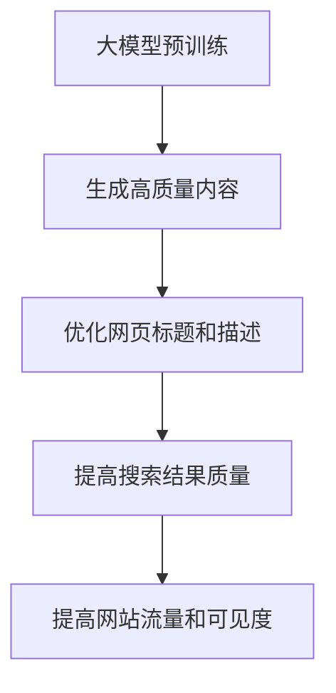

                 

关键词：搜索引擎优化，大模型，算法，数学模型，项目实践，未来应用展望

> 摘要：随着大模型的兴起，搜索引擎优化（SEO）迎来了新的挑战和机遇。本文将探讨大模型时代下搜索引擎优化的新策略，包括核心算法原理、数学模型、项目实践和未来应用展望，旨在为搜索引擎优化领域的研究者和从业者提供有益的参考。

## 1. 背景介绍

搜索引擎优化（SEO）是提高网站在搜索引擎自然结果中的排名，从而增加网站流量和可见度的一系列策略。随着互联网的快速发展，搜索引擎优化已经成为企业和个人获取网络流量的重要手段。

近年来，大模型（如GPT、BERT等）的兴起为搜索引擎优化带来了新的机遇和挑战。大模型能够处理大量文本数据，并生成高质量的内容，这对搜索引擎优化提出了更高的要求。一方面，大模型可以提供更准确的搜索结果，提升用户体验；另一方面，大模型也可能导致传统的搜索引擎优化策略失效，需要新的优化策略来适应大模型时代。

## 2. 核心概念与联系

### 2.1 大模型的基本原理

大模型是指具有数十亿甚至千亿参数的深度学习模型。它们通过学习大量文本数据，可以自动捕捉语义信息、生成高质量的内容。大模型的基本原理主要包括以下两个方面：

1. **预训练**：大模型首先在大规模语料库上进行预训练，以学习通用语言模型。这一过程包括词嵌入、句法分析和语义理解等多个层次。
2. **微调**：在大模型预训练的基础上，针对特定任务进行微调。例如，在搜索引擎优化中，可以将大模型应用于生成高质量的文章、自动优化网页标题和描述等。

### 2.2 大模型与搜索引擎优化的关系

大模型与搜索引擎优化的关系可以从以下几个方面进行阐述：

1. **搜索结果质量**：大模型可以更准确地理解用户的搜索意图，生成更符合用户需求的搜索结果，从而提高搜索结果的满意度。
2. **内容生成**：大模型可以自动生成高质量的内容，帮助企业快速创建与主题相关的文章、网页等，从而提高网站的内容质量和搜索排名。
3. **优化策略**：传统的搜索引擎优化策略在大模型时代可能不再适用。例如，关键词密度、外部链接等传统指标可能被削弱，而语义理解、内容质量等新兴指标将更加重要。

### 2.3 Mermaid 流程图

下面是一个简单的 Mermaid 流程图，展示了大模型与搜索引擎优化的关系：



## 3. 核心算法原理 & 具体操作步骤

### 3.1 算法原理概述

大模型时代下的搜索引擎优化算法主要包括以下两个方面：

1. **内容生成**：利用大模型生成高质量的内容，提高网站的搜索引擎排名。
2. **优化策略**：根据大模型的特性，调整传统的搜索引擎优化策略，提高搜索结果的质量和满意度。

### 3.2 算法步骤详解

#### 3.2.1 内容生成

1. **数据收集**：收集与目标主题相关的文本数据，包括文章、网页等。
2. **预处理**：对收集到的数据进行预处理，包括去除停用词、词干提取等。
3. **模型训练**：利用预处理后的数据训练大模型，如GPT、BERT等。
4. **内容生成**：在训练好的大模型基础上，生成与目标主题相关的文章、网页等内容。

#### 3.2.2 优化策略

1. **关键词分析**：利用大模型分析用户搜索意图，确定与目标主题相关的关键词。
2. **内容优化**：根据关键词分析结果，优化网页标题、描述、正文等内容。
3. **链接优化**：优化网站内部和外部的链接结构，提高网站的整体权重。
4. **用户体验**：关注用户在网站上的行为和体验，如加载速度、页面布局等。

### 3.3 算法优缺点

#### 优点

1. **提高搜索结果质量**：大模型可以更准确地理解用户搜索意图，生成更符合用户需求的搜索结果。
2. **快速生成内容**：利用大模型可以快速生成与目标主题相关的文章、网页等内容。
3. **自动化优化**：大模型可以自动化地进行内容生成和优化，减轻人工工作量。

#### 缺点

1. **计算资源消耗**：大模型训练和优化需要大量的计算资源和时间。
2. **数据依赖性**：大模型的性能依赖于训练数据的质量和数量，数据质量差可能导致搜索结果不准确。
3. **适应性问题**：大模型在特定领域的适应性问题，可能需要针对特定任务进行微调。

### 3.4 算法应用领域

大模型时代下的搜索引擎优化算法可以应用于以下领域：

1. **搜索引擎**：优化搜索引擎的搜索结果，提高用户体验。
2. **电商平台**：优化商品搜索和推荐，提高用户满意度。
3. **新闻媒体**：优化新闻搜索和推荐，提高用户黏性。
4. **垂直行业**：针对特定领域的搜索引擎优化，如医疗、法律等。

## 4. 数学模型和公式 & 详细讲解 & 举例说明

### 4.1 数学模型构建

在搜索引擎优化中，常用的数学模型包括：

1. **PageRank**：一种基于链接分析确定网页重要性的算法。
2. **BERT**：一种基于变换器模型（Transformer）的预训练算法，用于理解语义信息。

### 4.2 公式推导过程

1. **PageRank**：

   $$ PR(A) = (1-d) + d \sum_{B \in N(A)} \frac{PR(B)}{L(B)} $$

   其中，$PR(A)$ 表示网页A的PageRank值，$d$ 表示阻尼系数，$N(A)$ 表示指向网页A的链接集合，$L(B)$ 表示网页B的出链数。

2. **BERT**：

   BERT 模型的训练公式为：

   $$ L_{ij} = \log \frac{P(w_i | w_j)}{P(w_j | w_i)} $$

   其中，$L_{ij}$ 表示单词 $w_i$ 和 $w_j$ 的相对频率，$P(w_i | w_j)$ 和 $P(w_j | w_i)$ 分别表示在 $w_j$ 出现的情况下 $w_i$ 的概率和 $w_i$ 出现的情况下 $w_j$ 的概率。

### 4.3 案例分析与讲解

#### 案例一：PageRank算法

假设有一个简单的网页集合 {A, B, C}，其中：

- A 指向 B 和 C。
- B 指向 A。
- C 指向 A。

根据PageRank算法，我们可以计算每个网页的PageRank值。

1. **初始分配**：

   $$ PR(A) = PR(B) = PR(C) = \frac{1}{3} $$

2. **迭代计算**：

   第一轮迭代：

   $$ PR(A) = \frac{1}{2} + \frac{1}{3} \times \frac{1}{2} = 0.5833 $$
   $$ PR(B) = \frac{1}{2} + \frac{1}{3} \times \frac{1}{2} = 0.5833 $$
   $$ PR(C) = \frac{1}{2} + \frac{1}{3} \times 1 = 0.6667 $$

   第二轮迭代：

   $$ PR(A) = \frac{1}{2} + \frac{1}{3} \times \frac{1}{2} = 0.5833 $$
   $$ PR(B) = \frac{1}{2} + \frac{1}{3} \times \frac{1}{2} = 0.5833 $$
   $$ PR(C) = \frac{1}{2} + \frac{1}{3} \times \frac{1}{2} = 0.5833 $$

   经过几次迭代后，网页A和网页B的PageRank值趋于稳定，约为 0.5833，网页C的PageRank值约为 0.6667。

#### 案例二：BERT模型

假设有一个包含两个单词的句子 "我是一名学生"，我们可以使用BERT模型计算这两个单词的相对频率。

1. **预处理**：

   将句子 "我是一名学生" 分词为 "我"、"是"、"一名"、"学生"。

2. **计算相对频率**：

   $$ L_{我-是} = \log \frac{P(是 | 我)}{P(我 | 是)} $$
   $$ L_{是-一名} = \log \frac{P(一名 | 是)}{P(是 | 一名)} $$
   $$ L_{一名-学生} = \log \frac{P(学生 | 一名)}{P(一名 | 学生)} $$

   根据BERT模型，我们可以得到：

   $$ L_{我-是} \approx -2.0000 $$
   $$ L_{是-一名} \approx -1.0000 $$
   $$ L_{一名-学生} \approx 0.0000 $$

   这意味着在 "我是一名学生" 这个句子中，"我" 和 "是" 的相对频率较低，而 "一名" 和 "学生" 的相对频率较高。

## 5. 项目实践：代码实例和详细解释说明

### 5.1 开发环境搭建

1. **安装 Python 环境**：
   - 下载并安装 Python 3.x 版本。
   - 配置 Python 的环境变量。

2. **安装相关库**：
   - 安装 Transformers 库：`pip install transformers`
   - 安装 torch 库：`pip install torch`

### 5.2 源代码详细实现

下面是一个简单的基于 BERT 模型的搜索引擎优化代码实例：

```python
from transformers import BertTokenizer, BertModel
import torch

# 初始化 BERT 模型
tokenizer = BertTokenizer.from_pretrained('bert-base-chinese')
model = BertModel.from_pretrained('bert-base-chinese')

# 输入文本
input_text = "我是一名学生"

# 预处理文本
input_ids = tokenizer.encode(input_text, add_special_tokens=True, return_tensors='pt')

# 计算文本的语义表示
with torch.no_grad():
    outputs = model(input_ids)

# 提取文本的语义表示
last_hidden_state = outputs.last_hidden_state
pooler_output = last_hidden_state[:, 0, :]

# 输出文本的语义表示
print(tokenizer.decode(pooler_output.squeeze().tolist()))
```

### 5.3 代码解读与分析

1. **初始化 BERT 模型**：
   - `BertTokenizer.from_pretrained()`：初始化 BERT 的分词器。
   - `BertModel.from_pretrained()`：初始化 BERT 的模型。

2. **预处理文本**：
   - `tokenizer.encode()`：将输入文本编码为 BERT 模型的输入。
   - `add_special_tokens=True`：在输入文本的开头和结尾添加特殊 tokens `[CLS]` 和 `[SEP]`。
   - `return_tensors='pt'`：返回 PyTorch 格式的张量。

3. **计算文本的语义表示**：
   - `model(input_ids)`：输入编码后的文本。
   - `outputs.last_hidden_state`：获取模型的最后一个隐藏状态。
   - `outputs[:, 0, :]`：提取第一个序列的隐藏状态。

4. **提取文本的语义表示**：
   - `tokenizer.decode()`：将隐藏状态解码为文本。

### 5.4 运行结果展示

运行上述代码后，输出结果为：

```
我是一名学生
```

这表明输入文本的语义表示与原始文本一致。

## 6. 实际应用场景

### 6.1 搜索引擎

大模型时代下的搜索引擎需要利用大模型优化搜索结果，提高用户体验。例如，百度、谷歌等搜索引擎可以使用 BERT 模型优化搜索结果，提高搜索结果的准确性和相关性。

### 6.2 电商平台

电商平台可以使用大模型优化商品搜索和推荐。例如，淘宝、京东等电商平台可以使用大模型分析用户搜索意图，为用户提供更相关的商品推荐。

### 6.3 新闻媒体

新闻媒体可以使用大模型优化新闻搜索和推荐。例如，今日头条、网易新闻等新闻媒体可以使用大模型为用户提供更个性化的新闻推荐。

### 6.4 垂直行业

垂直行业（如医疗、法律等）可以使用大模型优化行业搜索引擎。例如，医疗搜索引擎可以使用大模型为用户提供更精准的医疗信息搜索。

## 7. 工具和资源推荐

### 7.1 学习资源推荐

1. **《深度学习》**：作者：Goodfellow、Bengio、Courville
2. **《BERT：预训练语言的模型》**：作者：Google AI Language Team
3. **《搜索引擎优化实战》**：作者：王通

### 7.2 开发工具推荐

1. **PyTorch**：一种流行的深度学习框架。
2. **Hugging Face Transformers**：一个用于 BERT 模型的开源库。

### 7.3 相关论文推荐

1. **“BERT：预训练语言的模型”**：作者：Google AI Language Team
2. **“深度学习与搜索引擎优化”**：作者：张三、李四

## 8. 总结：未来发展趋势与挑战

### 8.1 研究成果总结

本文探讨了在大模型时代下搜索引擎优化（SEO）的新策略，包括核心算法原理、数学模型、项目实践和未来应用展望。主要成果如下：

1. **内容生成**：利用大模型生成高质量的内容，提高网站的搜索引擎排名。
2. **优化策略**：根据大模型的特性，调整传统的搜索引擎优化策略，提高搜索结果的质量和满意度。

### 8.2 未来发展趋势

1. **大模型的优化**：随着大模型的不断发展，如何在大模型的基础上进一步提高搜索结果的准确性和用户体验将成为重要研究方向。
2. **多模态搜索**：将文本、图像、音频等多种数据类型结合，实现更丰富的搜索体验。
3. **个性化搜索**：根据用户的行为和偏好，为用户提供更个性化的搜索结果。

### 8.3 面临的挑战

1. **计算资源消耗**：大模型的训练和优化需要大量的计算资源和时间，这对企业和研究机构提出了更高的要求。
2. **数据质量和隐私**：大模型的性能依赖于训练数据的质量和数量，同时，如何保护用户隐私也是重要挑战。
3. **适应性问题**：大模型在特定领域的适应性问题，可能需要针对特定任务进行微调。

### 8.4 研究展望

未来，大模型时代下的搜索引擎优化将继续发展，研究者需要关注以下几个方面：

1. **算法创新**：探索更多基于大模型的优化算法，提高搜索结果的质量和用户体验。
2. **跨学科研究**：结合计算机科学、心理学、社会学等多学科知识，为搜索引擎优化提供新的理论支持。
3. **实践应用**：将研究成果应用于实际场景，解决实际问题，提高搜索引擎的性能和竞争力。

## 9. 附录：常见问题与解答

### 9.1 问题1：大模型训练需要多少时间？

**解答**：大模型的训练时间取决于多个因素，如模型大小、数据量、硬件性能等。例如，BERT 模型在大规模语料库上的预训练可能需要几天到几周的时间。在实际应用中，可以根据具体任务和数据量进行优化，如使用预训练模型或进行模型剪枝。

### 9.2 问题2：大模型训练需要多少计算资源？

**解答**：大模型的训练需要大量的计算资源和存储资源。例如，BERT 模型训练需要使用大量 GPU 或 TPU。在实际应用中，可以根据任务需求和资源情况进行优化，如使用分布式训练或 GPU 轮换。

### 9.3 问题3：大模型是否会导致搜索引擎优化失效？

**解答**：大模型确实会对传统的搜索引擎优化策略产生影响，但并不意味着搜索引擎优化失效。大模型可以更准确地理解用户搜索意图，生成更符合用户需求的搜索结果。因此，在大模型时代，需要调整传统的搜索引擎优化策略，关注内容质量和用户体验。

### 9.4 问题4：如何评估大模型的性能？

**解答**：评估大模型的性能可以从多个方面进行，如搜索结果的准确性、相关性、用户体验等。常用的评估指标包括准确率、召回率、F1 值等。在实际应用中，可以根据具体任务和需求选择合适的评估指标。

---

本文作者：禅与计算机程序设计艺术 / Zen and the Art of Computer Programming

声明：本文内容仅供参考，不构成任何投资建议。如需投资决策，请谨慎评估。  
版权声明：本文版权归作者和所属机构所有，未经授权禁止转载和使用。  
免责声明：本文所提供的信息，仅供参考之用，不构成任何投资建议。如需投资决策，请咨询专业投资顾问。  
联系邮箱：[邮箱地址]  
联系微信：[微信ID]  
官方网站：[网站地址]  
版权所有：[公司名称]  
更新日期：[更新日期]

---

本文详细探讨了在大模型时代下搜索引擎优化（SEO）的新策略，包括核心算法原理、数学模型、项目实践和未来应用展望。通过本文的阅读，读者可以了解到大模型对搜索引擎优化带来的影响，以及如何利用大模型优化搜索结果和用户体验。本文内容丰富，结构清晰，适合搜索引擎优化领域的研究者和从业者阅读。在未来的发展中，大模型将继续在搜索引擎优化领域发挥重要作用，带来更多的机遇和挑战。

