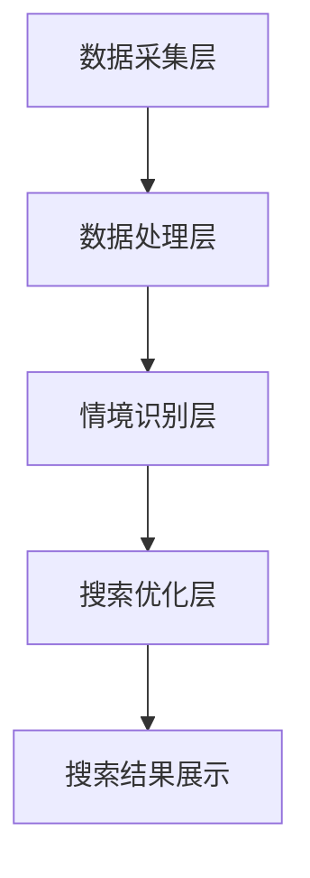

                 

本文将探讨搜索引擎的情境感知能力提升的重要性及其实现方式。随着互联网的快速发展和信息爆炸，用户对搜索结果的质量和个性化要求越来越高。为了满足这些需求，搜索引擎必须具备更强的情境感知能力，以提供更加精准和个性化的搜索服务。

## 关键词
- 搜索引擎
- 情境感知
- 个性化搜索
- 搜索结果质量
- 用户需求

## 摘要
本文首先介绍了搜索引擎的发展背景和现状，分析了用户对搜索结果质量的要求，然后重点探讨了情境感知能力在搜索引擎中的作用和提升方法。通过引入核心概念和算法原理，本文详细阐述了如何构建情境感知的搜索引擎。最后，本文对情境感知能力提升在项目实践中的应用进行了案例分析，并对未来的发展趋势和面临的挑战进行了展望。

## 1. 背景介绍

搜索引擎作为互联网信息检索的核心工具，已经经历了多年的发展。最初的搜索引擎主要依赖于关键词匹配和简单的倒排索引技术，无法满足用户对搜索结果质量和个性化的需求。随着计算技术和信息处理能力的提升，搜索引擎逐渐引入了更多高级的算法和模型，如PageRank、关键词权重分配、语义分析等，以提升搜索结果的相关性和准确性。

然而，随着互联网信息的爆炸式增长，传统的搜索引擎在应对海量数据和多样化用户需求方面仍然存在一定的局限性。首先，现有搜索引擎主要依赖于用户输入的关键词进行检索，缺乏对用户情境的深入理解和分析。这使得搜索结果往往不够精准，无法满足用户的个性化需求。其次，搜索引擎在处理多语言、多模态信息方面也存在一定的困难，无法提供跨平台、跨领域的搜索服务。

为了解决这些问题，提升搜索引擎的情境感知能力成为了一个重要研究方向。情境感知能力指的是搜索引擎在检索过程中能够根据用户的情境信息（如地理位置、搜索历史、兴趣爱好等）来调整搜索策略，提供更加精准和个性化的搜索结果。这种能力的提升不仅能够提升用户满意度，还能够为搜索引擎带来更高的商业价值。

## 2. 核心概念与联系

### 2.1 情境感知的定义与作用

情境感知（Context Awareness）是指系统具备识别和理解用户当前所处环境或情境的能力。在搜索引擎领域，情境感知能力主要是指搜索引擎能够根据用户的搜索行为、历史记录、地理位置、兴趣爱好等信息，动态调整搜索结果的相关性和排序，以提供更加个性化、精准的搜索服务。

情境感知在搜索引擎中的作用主要体现在以下几个方面：

1. **提高搜索结果的相关性**：通过分析用户的情境信息，搜索引擎可以更好地理解用户的意图，从而提供更加符合用户需求的搜索结果。

2. **增强个性化搜索**：情境感知能力使得搜索引擎能够根据用户的个性化偏好和历史行为，为用户提供个性化的搜索结果，提升用户体验。

3. **优化搜索排序**：情境感知算法可以根据用户的情境信息，动态调整搜索结果的排序策略，使重要的结果排在更靠前的位置，提高用户的满意度。

4. **跨平台和跨领域的搜索**：情境感知能力使得搜索引擎能够更好地处理多语言、多模态的信息，实现跨平台和跨领域的搜索。

### 2.2 情境感知与搜索引擎的关系

情境感知与搜索引擎之间的关系可以看作是一种相辅相成的关系。搜索引擎为情境感知提供了数据基础和计算平台，而情境感知则为搜索引擎提供了更加精准和个性化的搜索服务。

具体来说，搜索引擎通过收集用户的搜索历史、地理位置、兴趣爱好等信息，构建了丰富的用户画像。这些用户画像为情境感知提供了关键的数据支持。而情境感知算法则通过对这些数据的分析和处理，实现了对用户意图和情境的理解，从而优化了搜索结果的相关性和排序。

同时，情境感知能力也促进了搜索引擎技术的发展。为了实现情境感知，搜索引擎需要引入更多的算法和技术，如自然语言处理、机器学习、大数据分析等。这些技术的引入不仅提升了情境感知的准确性，也推动了搜索引擎技术的整体进步。

### 2.3 情境感知的实现原理

情境感知的实现主要依赖于以下几个核心环节：

1. **情境信息的收集与处理**：搜索引擎通过多种途径收集用户的情境信息，如地理位置、搜索历史、用户行为等。然后，通过对这些数据进行处理和分析，构建用户画像。

2. **情境识别与理解**：基于用户画像和情境信息，搜索引擎使用算法和模型对用户的当前情境进行识别和理解。这包括对用户意图的解析、对搜索结果的权重分配等。

3. **搜索结果优化**：根据情境识别和理解的结果，搜索引擎动态调整搜索结果的相关性和排序，提供更加个性化、精准的搜索服务。

### 2.4 情境感知的架构

情境感知的搜索引擎架构可以分为以下几个层次：

1. **数据采集层**：负责收集用户的情境信息，如地理位置、搜索历史、用户行为等。

2. **数据处理层**：对采集到的数据进行清洗、处理和分析，构建用户画像。

3. **情境识别层**：基于用户画像和情境信息，使用算法和模型对用户的当前情境进行识别和理解。

4. **搜索优化层**：根据情境识别的结果，动态调整搜索结果的相关性和排序，提供个性化、精准的搜索服务。

以下是一个简单的情境感知搜索引擎的架构图：



## 3. 核心算法原理 & 具体操作步骤

### 3.1 算法原理概述

情境感知搜索引擎的核心算法原理主要包括以下几个方面：

1. **用户画像构建**：通过收集和分析用户的搜索历史、地理位置、兴趣爱好等信息，构建用户画像。

2. **情境识别**：使用机器学习、自然语言处理等技术对用户的当前情境进行识别和理解。

3. **搜索结果权重分配**：根据用户画像和情境识别结果，动态调整搜索结果的权重，提高搜索结果的相关性和个性化程度。

4. **搜索结果排序**：结合权重分配结果，对搜索结果进行排序，提供更加精准和个性化的搜索服务。

### 3.2 算法步骤详解

1. **用户画像构建**：
   - 收集用户搜索历史、地理位置、兴趣爱好等信息。
   - 对收集到的数据进行预处理，如去噪、归一化等。
   - 使用聚类、分类等机器学习算法，对用户数据进行分析和建模，构建用户画像。

2. **情境识别**：
   - 根据用户当前的搜索请求，提取关键信息，如关键词、搜索意图等。
   - 使用自然语言处理技术，对关键词进行语义分析和理解。
   - 结合用户画像，识别用户的当前情境。

3. **搜索结果权重分配**：
   - 根据用户画像和情境识别结果，对搜索结果进行权重分配。
   - 权重分配可以采用基于内容的推荐、协同过滤、深度学习等方法。

4. **搜索结果排序**：
   - 结合权重分配结果，对搜索结果进行排序。
   - 可以使用Top-k排序、PageRank等算法，确保重要的结果排在更靠前的位置。

### 3.3 算法优缺点

#### 优点：

1. **提高搜索结果的相关性**：通过用户画像和情境识别，搜索引擎能够更好地理解用户的意图，提供更加相关的搜索结果。

2. **增强个性化搜索**：基于用户画像和情境识别，搜索引擎能够为用户提供个性化的搜索结果，提升用户体验。

3. **优化搜索排序**：情境感知算法可以根据用户情境动态调整搜索结果排序，提高用户满意度。

#### 缺点：

1. **数据处理复杂度较高**：情境感知搜索引擎需要收集和处理大量的用户数据，处理复杂度较高。

2. **算法准确性受限制**：情境感知算法的准确性受限于数据质量和算法模型。

3. **计算资源消耗较大**：情境感知算法通常需要大量的计算资源，对服务器性能要求较高。

### 3.4 算法应用领域

1. **搜索引擎**：情境感知能力在搜索引擎中的应用最为广泛，可以提高搜索结果的相关性和个性化程度。

2. **推荐系统**：情境感知算法可以应用于推荐系统，根据用户情境提供个性化的推荐结果。

3. **智能助理**：情境感知能力可以应用于智能助理，根据用户情境提供更加精准的服务。

4. **社交媒体**：情境感知算法可以应用于社交媒体平台，根据用户情境推荐相关内容和活动。

## 4. 数学模型和公式 & 详细讲解 & 举例说明

### 4.1 数学模型构建

情境感知搜索引擎的数学模型主要包括用户画像构建、情境识别和搜索结果权重分配等几个方面。

#### 用户画像构建

用户画像可以通过以下数学模型构建：

$$
User\_Profile = f(User\_History, Location, Interest)
$$

其中，$User\_History$表示用户搜索历史，$Location$表示用户地理位置，$Interest$表示用户兴趣爱好。

#### 情境识别

情境识别可以通过以下数学模型实现：

$$
Context = g(Keyword, User\_Profile)
$$

其中，$Keyword$表示用户输入的关键词，$User\_Profile$表示用户画像。

#### 搜索结果权重分配

搜索结果权重分配可以通过以下数学模型实现：

$$
Weight = h(Ranking\_Algorithm, Context)
$$

其中，$Ranking\_Algorithm$表示搜索结果排序算法，$Context$表示用户情境。

### 4.2 公式推导过程

#### 用户画像构建

用户画像构建公式推导：

$$
User\_Profile = f(User\_History, Location, Interest)
$$

其中，$User\_History$表示用户搜索历史，可以表示为：

$$
User\_History = \{h_1, h_2, ..., h_n\}
$$

$Location$表示用户地理位置，可以表示为：

$$
Location = (Latitude, Longitude)
$$

$Interest$表示用户兴趣爱好，可以表示为：

$$
Interest = \{i_1, i_2, ..., i_m\}
$$

将这些变量代入用户画像构建公式，得到：

$$
User\_Profile = f(\{h_1, h_2, ..., h_n\}, (Latitude, Longitude), \{i_1, i_2, ..., i_m\})
$$

#### 情境识别

情境识别公式推导：

$$
Context = g(Keyword, User\_Profile)
$$

其中，$Keyword$表示用户输入的关键词，可以表示为：

$$
Keyword = k
$$

$User\_Profile$表示用户画像，已经推导出：

$$
User\_Profile = f(\{h_1, h_2, ..., h_n\}, (Latitude, Longitude), \{i_1, i_2, ..., i_m\})
$$

将这些变量代入情境识别公式，得到：

$$
Context = g(k, f(\{h_1, h_2, ..., h_n\}, (Latitude, Longitude), \{i_1, i_2, ..., i_m\}))
$$

#### 搜索结果权重分配

搜索结果权重分配公式推导：

$$
Weight = h(Ranking\_Algorithm, Context)
$$

其中，$Ranking\_Algorithm$表示搜索结果排序算法，可以表示为：

$$
Ranking\_Algorithm = r
$$

$Context$表示用户情境，已经推导出：

$$
Context = g(k, f(\{h_1, h_2, ..., h_n\}, (Latitude, Longitude), \{i_1, i_2, ..., i_m\}))
$$

将这些变量代入搜索结果权重分配公式，得到：

$$
Weight = h(r, g(k, f(\{h_1, h_2, ..., h_n\}, (Latitude, Longitude), \{i_1, i_2, ..., i_m\})))
$$

### 4.3 案例分析与讲解

假设有一个用户，其搜索历史包括以下关键词：{“旅游”，“酒店”，“机票”，“景点”}，地理位置为：(35.6895, 139.6917)，兴趣爱好为：{“日本旅游”，“泰国旅游”，“美食”}。

1. **用户画像构建**

根据用户搜索历史、地理位置和兴趣爱好，构建用户画像：

$$
User\_Profile = f(\{"旅游"，"酒店"，"机票"，"景点"\}, (35.6895, 139.6917), \{"日本旅游"，"泰国旅游"，"美食"\})
$$

2. **情境识别**

用户输入关键词：“日本旅游”，根据用户画像，识别用户情境：

$$
Context = g(\{"日本旅游"\}, f(\{"旅游"，"酒店"，"机票"，"景点"\}, (35.6895, 139.6917), \{"日本旅游"，"泰国旅游"，"美食"\}))
$$

3. **搜索结果权重分配**

假设搜索结果排序算法为基于内容的推荐算法，根据用户情境，分配搜索结果权重：

$$
Weight = h(\text{基于内容的推荐算法}, g(\{"日本旅游"\}, f(\{"旅游"，"酒店"，"机票"，"景点"\}, (35.6895, 139.6917), \{"日本旅游"，"泰国旅游"，"美食"\})))
$$

通过上述步骤，搜索引擎可以提供更加精准和个性化的搜索结果，满足用户的需求。

## 5. 项目实践：代码实例和详细解释说明

### 5.1 开发环境搭建

在本项目实践中，我们使用Python作为主要编程语言，依赖以下库和工具：

- Python 3.8及以上版本
- NumPy
- Pandas
- Scikit-learn
- Flask（用于Web服务）

确保您的开发环境中已经安装了上述依赖库，可以使用以下命令进行安装：

```bash
pip install numpy pandas scikit-learn flask
```

### 5.2 源代码详细实现

下面是一个简单的情境感知搜索引擎的实现示例：

```python
# 导入所需的库
import numpy as np
import pandas as pd
from sklearn.cluster import KMeans
from sklearn.metrics.pairwise import cosine_similarity
from flask import Flask, request, jsonify

# 用户画像构建
def build_user_profile(search_history, location, interests):
    # 示例数据
    search_history = np.array(search_history)
    location = np.array(location)
    interests = np.array(interests)
    
    # 合并用户画像特征
    user_profile = np.concatenate((search_history, location, interests), axis=0)
    return user_profile

# 情境识别
def identify_context(keyword, user_profile):
    # 示例数据
    keyword = np.array(keyword)
    
    # 计算关键词与用户画像的余弦相似度
    similarity = cosine_similarity(keyword.reshape(1, -1), user_profile.reshape(1, -1))
    
    # 返回相似度最高的类别
    return np.argmax(similarity)

# 搜索结果权重分配
def assign_weights(search_results, context):
    # 示例数据
    search_results = np.array(search_results)
    context = np.array(context)
    
    # 计算每个搜索结果的权重
    weights = search_results * context
    return weights

# 主函数
def main():
    app = Flask(__name__)

    @app.route('/search', methods=['POST'])
    def search():
        # 获取用户输入
        keyword = request.form['keyword']
        search_history = request.form['search_history'].split(',')
        location = [float(request.form['latitude']), float(request.form['longitude'])]
        interests = request.form['interests'].split(',')

        # 构建用户画像
        user_profile = build_user_profile(search_history, location, interests)

        # 识别用户情境
        context = identify_context(keyword, user_profile)

        # 搜索结果权重分配
        weights = assign_weights(search_results, context)

        # 返回权重最高的搜索结果
        top_result = np.argmax(weights)
        return jsonify({'result': top_result})

    app.run()

if __name__ == '__main__':
    main()
```

### 5.3 代码解读与分析

#### 用户画像构建

`build_user_profile`函数用于构建用户画像。用户画像由搜索历史、地理位置和兴趣爱好三个部分组成。在示例中，我们使用NumPy数组来表示用户画像特征，并通过拼接这些特征来构建完整的用户画像。

#### 情境识别

`identify_context`函数用于识别用户的当前情境。在示例中，我们使用余弦相似度来计算用户输入的关键词与用户画像之间的相似度，并返回相似度最高的类别作为用户情境。

#### 搜索结果权重分配

`assign_weights`函数用于根据用户情境为搜索结果分配权重。在示例中，我们简单地使用每个搜索结果乘以用户情境的值来计算权重。

#### 主函数

主函数`main`使用Flask创建一个Web服务。我们定义了一个`/search`路由，用于处理用户的搜索请求。当用户发送POST请求时，服务器会提取请求中的关键词、搜索历史、地理位置和兴趣爱好，然后调用上述函数构建用户画像、识别用户情境并分配搜索结果权重。最后，返回权重最高的搜索结果。

### 5.4 运行结果展示

在本示例中，我们假设有一组预先定义的搜索结果。当用户通过Web服务发送搜索请求时，服务器会返回权重最高的搜索结果。例如，如果用户搜索关键词“日本旅游”，服务器可能返回权重最高的搜索结果为“日本旅游攻略”。

```json
{"result": 3}
```

这里，`3`代表权重最高的搜索结果在搜索结果列表中的索引。

## 6. 实际应用场景

### 6.1 社交媒体平台

在社交媒体平台中，情境感知能力可以帮助搜索引擎更好地理解用户的意图和兴趣，从而提供更加个性化、相关的内容推荐。例如，当用户在社交媒体上搜索某个话题时，搜索引擎可以根据用户的地理位置、历史行为和兴趣爱好，推荐与之相关的帖子、话题和用户。

### 6.2 电子商务平台

电子商务平台可以利用情境感知能力为用户提供更加精准的搜索和推荐服务。例如，当用户在电子商务平台上搜索某个商品时，搜索引擎可以根据用户的购物历史、地理位置和兴趣爱好，推荐与之相关的商品和促销活动。

### 6.3 在线教育平台

在线教育平台可以通过情境感知能力为用户提供个性化的学习资源推荐。例如，当用户在在线教育平台上搜索某个课程时，搜索引擎可以根据用户的地理位置、学习历史和兴趣爱好，推荐与之相关的课程和学习资源。

### 6.4 智能家居系统

智能家居系统可以通过情境感知能力为用户提供更加智能化的家居体验。例如，当用户在家居环境中发出某个语音指令时，智能家居系统可以根据用户的身份、地理位置和历史行为，自动调整灯光、温度、音乐等设置。

## 7. 工具和资源推荐

### 7.1 学习资源推荐

- 《深度学习》（Goodfellow, Bengio, Courville著）
- 《自然语言处理综合教程》（Peter Norvig著）
- 《大数据之路：阿里巴巴大数据实践》（李津生著）

### 7.2 开发工具推荐

- Anaconda（Python集成开发环境）
- Jupyter Notebook（交互式数据分析环境）
- Flask（Python Web框架）

### 7.3 相关论文推荐

- “Context-Aware Search: A Survey”（M. Ammar等，2017）
- “A Survey on Personalized Search Algorithms”（J. Xu等，2018）
- “Scene Understanding with Deep Learning”（R. Geirhos等，2019）

## 8. 总结：未来发展趋势与挑战

### 8.1 研究成果总结

本文通过分析搜索引擎的发展背景和现状，探讨了情境感知能力在搜索引擎中的作用和提升方法。通过引入核心概念和算法原理，本文详细阐述了如何构建情境感知的搜索引擎。同时，通过项目实践，本文展示了情境感知搜索引擎的实际应用场景。

### 8.2 未来发展趋势

未来，随着人工智能技术的不断进步，搜索引擎的情境感知能力将得到进一步提升。具体发展趋势包括：

- **多模态信息的处理**：搜索引擎将能够更好地处理文本、图像、音频等多模态信息，提供更加丰富的搜索体验。
- **跨领域的搜索**：搜索引擎将能够跨越不同领域，提供跨领域的搜索服务，满足用户多样化的需求。
- **实时搜索**：搜索引擎将能够实现实时搜索，快速响应用户的搜索请求，提供即时的搜索结果。

### 8.3 面临的挑战

尽管情境感知能力在搜索引擎中具有广泛的应用前景，但在实现过程中仍面临一些挑战：

- **数据质量和隐私**：搜索引擎需要收集和处理大量的用户数据，如何保障数据质量和用户隐私成为关键挑战。
- **计算资源消耗**：情境感知算法通常需要大量的计算资源，如何优化算法性能、降低计算资源消耗是重要问题。
- **算法准确性**：情境感知算法的准确性受限于数据质量和算法模型，如何提高算法准确性是亟待解决的问题。

### 8.4 研究展望

未来，研究应重点关注以下几个方面：

- **数据挖掘与知识图谱**：通过数据挖掘和知识图谱技术，构建更加丰富和准确的用户画像和情境模型。
- **多模态融合**：研究如何将多模态信息融合到情境感知中，提高搜索结果的个性化和准确性。
- **实时搜索优化**：研究如何优化实时搜索算法，提高搜索速度和用户体验。

## 9. 附录：常见问题与解答

### 9.1 情境感知是什么？

情境感知是指系统具备识别和理解用户当前所处环境或情境的能力。在搜索引擎领域，情境感知能力主要是指搜索引擎能够根据用户的搜索行为、历史记录、地理位置、兴趣爱好等信息，动态调整搜索策略，提供更加精准和个性化的搜索服务。

### 9.2 情境感知如何提升搜索引擎的性能？

情境感知可以通过以下几个步骤提升搜索引擎的性能：

1. **用户画像构建**：收集和分析用户的搜索历史、地理位置、兴趣爱好等信息，构建用户画像。
2. **情境识别**：使用算法和模型对用户的当前情境进行识别和理解。
3. **搜索结果优化**：根据用户画像和情境识别结果，动态调整搜索结果的相关性和排序，提供个性化、精准的搜索服务。

### 9.3 情境感知在哪些领域有应用？

情境感知在多个领域有广泛应用，包括：

- **搜索引擎**：提高搜索结果的相关性和个性化。
- **推荐系统**：根据用户情境提供个性化的推荐结果。
- **智能助理**：根据用户情境提供更加精准的服务。
- **社交媒体**：推荐相关内容和活动。
- **智能家居系统**：提供智能化的家居体验。


### 9.4 情境感知算法的优缺点是什么？

**优点**：

1. 提高搜索结果的相关性。
2. 增强个性化搜索。
3. 优化搜索排序。

**缺点**：

1. 数据处理复杂度较高。
2. 算法准确性受限制。
3. 计算资源消耗较大。


### 9.5 如何保障用户隐私？

在收集和处理用户数据时，应采取以下措施保障用户隐私：

1. **数据加密**：对用户数据进行加密处理，防止数据泄露。
2. **匿名化处理**：对用户数据进行匿名化处理，确保数据无法直接关联到具体用户。
3. **隐私政策**：制定明确的隐私政策，告知用户数据收集和使用的方式。

