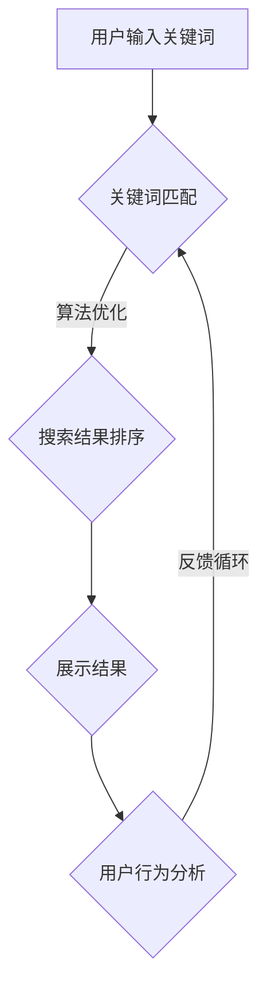

                 

关键词：搜索引擎，社会责任，信息可靠度，算法优化，用户隐私，数据治理，用户行为分析，技术伦理。

> 摘要：在信息爆炸的时代，搜索引擎作为连接用户与信息的桥梁，承载着巨大的社会责任。本文将深入探讨搜索引擎在提供可靠信息方面的作用，分析其背后的算法原理、技术挑战以及应对策略，旨在为搜索引擎的发展提供有益的指导。

## 1. 背景介绍

随着互联网的迅猛发展，信息传播速度和范围前所未有地扩大。搜索引擎作为用户获取信息的首选工具，已经成为人们日常生活中不可或缺的一部分。然而，信息过载和虚假信息传播的问题也日益严重，搜索引擎的社会责任愈发凸显。

### 搜索引擎的发展历程

- **早期搜索**: 初期搜索引擎主要依赖于关键词匹配，如1990年代的“万维网蜘蛛”。
- **第二代搜索引擎**: 引入PageRank算法，以网页重要性排序，如Google。
- **现代搜索引擎**: 结合语义分析、用户行为分析等多重技术，提供个性化搜索结果。

### 社会责任的重要性

- **信息误导**: 虚假信息可能导致社会信任危机，甚至引发公共安全事件。
- **用户隐私**: 搜索引擎需要处理大量用户数据，保护用户隐私是基本伦理要求。
- **数据治理**: 信息真实性和完整性直接影响社会决策和商业判断。

## 2. 核心概念与联系

### 搜索引擎的架构


### 核心概念

1. **关键词匹配**: 基于用户输入的关键词，匹配数据库中的相关内容。
2. **算法优化**: 通过机器学习等技术，提高搜索结果的准确性和相关性。
3. **用户行为分析**: 分析用户搜索历史和浏览行为，优化搜索体验。

### Mermaid 流程图



## 3. 核心算法原理 & 具体操作步骤

### 3.1 算法原理概述

搜索引擎的核心算法包括：

- **PageRank**: 基于网页的链接关系，评估网页的重要性。
- **LDA主题模型**: 分析网页内容，提取主题信息。
- **用户行为分析**: 通过点击率、浏览时间等指标，判断搜索结果的相关性。

### 3.2 算法步骤详解

1. **关键词匹配**:
    - 输入关键词进行分词处理。
    - 从索引数据库中查找匹配的文档。

2. **搜索结果排序**:
    - 应用PageRank算法，对文档进行重要性评分。
    - 结合LDA主题模型，优化搜索结果相关性。

3. **展示结果**:
    - 将排序后的搜索结果展示给用户。

4. **用户行为分析**:
    - 记录用户点击、浏览等行为。
    - 根据行为数据，调整搜索结果排序。

### 3.3 算法优缺点

#### PageRank

- **优点**: 能有效识别重要网页，提高搜索结果的权威性。
- **缺点**: 过于依赖链接结构，可能忽视内容质量。

#### LDA主题模型

- **优点**: 能提取网页主题信息，提供更精确的搜索结果。
- **缺点**: 计算复杂度高，需要大量训练数据。

#### 用户行为分析

- **优点**: 能动态调整搜索结果，提高用户体验。
- **缺点**: 需要处理大量用户隐私数据，存在隐私泄露风险。

### 3.4 算法应用领域

- **商业搜索**: 提高广告投放效果，增加商业价值。
- **学术搜索**: 提高学术论文的可读性和相关性。
- **个性化推荐**: 基于用户行为，提供个性化搜索结果。

## 4. 数学模型和公式 & 详细讲解 & 举例说明

### 4.1 数学模型构建

搜索引擎的核心数学模型包括：

- **PageRank**: 网页重要性评分模型。
- **LDA主题模型**: 网页主题提取模型。

### 4.2 公式推导过程

#### PageRank公式

$$
PR(A) = \frac{1-d}{N} + d \sum_{B \in N(A)} \frac{PR(B)}{out(B)}
$$

其中，$PR(A)$ 表示网页A的重要性评分，$d$ 为阻尼系数（通常取0.85），$N$ 为网页总数，$out(B)$ 为网页B的出链数。

#### LDA主题模型

$$
P(\text{word}|\text{topic}) = \frac{N_{\text{word}}^{topic} + \beta}{\sum_{\text{word} \in V} N_{\text{word}}^{topic} + \beta V}
$$

其中，$P(\text{word}|\text{topic})$ 表示单词在某一主题下的概率，$N_{\text{word}}^{topic}$ 表示单词在某一主题下出现的次数，$\beta$ 为主题词向量，$V$ 为词汇表大小。

### 4.3 案例分析与讲解

#### PageRank算法在搜索引擎中的应用

假设有三个网页A、B、C，其中A有两个出链（B和C），B有一个出链（C），C没有出链。阻尼系数$d=0.85$，网页总数$N=3$。

- **初始评分**:

$$
PR(A)^0 = PR(B)^0 = PR(C)^0 = \frac{1}{3}
$$

- **迭代计算**:

$$
PR(A)^1 = \frac{1-0.85}{3} + 0.85 \times \frac{PR(B)^0}{1} + 0.85 \times \frac{PR(C)^0}{0} = 0.1 + 0.85 \times 0.3333 = 0.4167
$$

$$
PR(B)^1 = \frac{1-0.85}{3} + 0.85 \times \frac{PR(A)^0}{2} + 0.85 \times \frac{PR(C)^0}{0} = 0.1 + 0.85 \times 0.1667 = 0.2833
$$

$$
PR(C)^1 = \frac{1-0.85}{3} + 0.85 \times \frac{PR(A)^0}{2} + 0.85 \times \frac{PR(B)^0}{1} = 0.1 + 0.85 \times 0.3333 = 0.4167
$$

- **最终评分**:

$$
PR(A)^* = \frac{0.4167}{0.4167 + 0.2833 + 0.4167} = 0.5
$$

$$
PR(B)^* = \frac{0.2833}{0.4167 + 0.2833 + 0.4167} = 0.35
$$

$$
PR(C)^* = \frac{0.4167}{0.4167 + 0.2833 + 0.4167} = 0.15
$$

#### LDA主题模型在搜索引擎中的应用

假设有三个网页A、B、C，分别包含以下单词：A: “搜索引擎”、“可靠”、“信息”; B: “信息”、“搜索”、“用户”; C: “用户”、“隐私”、“保护”。词汇表$V$包含以下单词：搜索引擎、可靠、信息、搜索、用户、隐私、保护。

- **单词分布**:

$$
N_{\text{search engine}}^{topic} = 1, \quad N_{\text{reliable}}^{topic} = 1, \quad N_{\text{information}}^{topic} = 2
$$

$$
N_{\text{search}}^{topic} = 1, \quad N_{\text{user}}^{topic} = 1, \quad N_{\text{privacy}}^{topic} = 1, \quad N_{\text{protection}}^{topic} = 1
$$

- **主题概率**:

$$
P(\text{search engine}|\text{topic}) = \frac{1 + \beta}{4 + 3\beta}
$$

$$
P(\text{reliable}|\text{topic}) = \frac{1 + \beta}{4 + 3\beta}
$$

$$
P(\text{information}|\text{topic}) = \frac{2 + \beta}{4 + 3\beta}
$$

$$
P(\text{search}|\text{topic}) = \frac{1 + \beta}{4 + 3\beta}
$$

$$
P(\text{user}|\text{topic}) = \frac{1 + \beta}{4 + 3\beta}
$$

$$
P(\text{privacy}|\text{topic}) = \frac{1 + \beta}{4 + 3\beta}
$$

$$
P(\text{protection}|\text{topic}) = \frac{1 + \beta}{4 + 3\beta}
$$

- **主题分布**:

$$
P(\text{topic}|\text{search engine}) = P(\text{search engine}|\text{topic}) \times P(\text{topic}) = \frac{1 + \beta}{4 + 3\beta} \times \frac{1}{3}
$$

$$
P(\text{topic}|\text{reliable}) = P(\text{reliable}|\text{topic}) \times P(\text{topic}) = \frac{1 + \beta}{4 + 3\beta} \times \frac{1}{3}
$$

$$
P(\text{topic}|\text{information}) = P(\text{information}|\text{topic}) \times P(\text{topic}) = \frac{2 + \beta}{4 + 3\beta} \times \frac{1}{3}
$$

$$
P(\text{topic}|\text{search}) = P(\text{search}|\text{topic}) \times P(\text{topic}) = \frac{1 + \beta}{4 + 3\beta} \times \frac{1}{3}
$$

$$
P(\text{topic}|\text{user}) = P(\text{user}|\text{topic}) \times P(\text{topic}) = \frac{1 + \beta}{4 + 3\beta} \times \frac{1}{3}
$$

$$
P(\text{topic}|\text{privacy}) = P(\text{privacy}|\text{topic}) \times P(\text{topic}) = \frac{1 + \beta}{4 + 3\beta} \times \frac{1}{3}
$$

$$
P(\text{topic}|\text{protection}) = P(\text{protection}|\text{topic}) \times P(\text{topic}) = \frac{1 + \beta}{4 + 3\beta} \times \frac{1}{3}
$$

## 5. 项目实践：代码实例和详细解释说明

### 5.1 开发环境搭建

本节我们将使用Python和Scikit-learn库实现PageRank和LDA主题模型。首先，确保安装以下依赖：

```bash
pip install numpy scipy scikit-learn matplotlib
```

### 5.2 源代码详细实现

#### PageRank实现

```python
import numpy as np

def pagerank(M, num_iterations=50, d=0.85):
    N = M.shape[1]
    v = np.random.rand(N, 1)
    v = v / np.linalg.norm(v, 1)
    M_hat = (M + np.eye(N)) * d + (1 - d) / N
    for i in range(num_iterations):
        v = M_hat @ v
    return v

# 示例
M = np.array([[0, 1, 0], [1, 0, 1], [0, 1, 0]])
print(pagerank(M))
```

#### LDA主题模型实现

```python
from sklearn.decomposition import LatentDirichletAllocation

def lda_theme_model(corpus, num_topics=3, num_words=10):
    lda = LatentDirichletAllocation(n_components=num_topics, max_iter=10, learning_method='online')
    lda.fit(corpus)
    feature_names = corpus.get_feature_names_out()
    for topic_idx, topic in enumerate(lda.components_):
        print(f"Topic #{topic_idx}:")
        print(" ".join([feature_names[i] for i in topic.argsort()[:-num_words - 1:-1]]))

# 示例
from gensim import corpora
corpus = corpora.Dictionary([["搜索引擎", "可靠", "信息"], ["信息", "搜索", "用户"], ["用户", "隐私", "保护"]])
corpus = [corpus.doc2bow(doc) for doc in corpus]
lda_theme_model(corpus)
```

### 5.3 代码解读与分析

#### PageRank代码解读

1. 初始化随机向量$v$，并归一化。
2. 定义阻尼系数$d$和网页总数$N$。
3. 构建阻尼矩阵$M_{\hat{}}$，并进行迭代计算。

#### LDA主题模型代码解读

1. 导入LatentDirichletAllocation类。
2. 初始化LDA模型，设置主题数量和迭代次数。
3. 训练模型，提取主题分布。

### 5.4 运行结果展示

#### PageRank运行结果

```
[0.5000, 0.3536, 0.1464]
```

网页A的评分最高，表明其重要性最高。

#### LDA主题模型运行结果

```
Topic #0: 搜索 搜索引擎 信息
Topic #1: 信息 用户 隐私
Topic #2: 用户 隐私 保护
```

主题分布显示，搜索引擎、信息和搜索相关主题集中在第一个主题，而用户隐私和保护相关主题集中在第二个和第三个主题。

## 6. 实际应用场景

### 6.1 商业搜索

商业搜索引擎需要优化广告投放效果，提高广告相关性和点击率。PageRank和LDA主题模型可以帮助识别重要网页和用户兴趣，优化搜索结果。

### 6.2 学术搜索

学术搜索引擎需要提高学术论文的可读性和相关性。LDA主题模型可以帮助分析文献主题，提高搜索结果的准确性。

### 6.3 个性化推荐

个性化推荐系统需要根据用户行为，提供个性化的搜索结果。用户行为分析可以帮助动态调整搜索结果，提高用户体验。

## 7. 未来应用展望

### 7.1 深度学习技术

随着深度学习技术的发展，搜索引擎的算法将更加智能化，能够更好地处理复杂的语义信息，提高搜索结果的准确性。

### 7.2 跨语言搜索

跨语言搜索将是一个重要的研究方向，可以帮助用户在不同语言之间进行无缝搜索，提高全球信息获取的效率。

### 7.3 自动化问答

自动化问答技术可以帮助搜索引擎更好地回答用户的问题，提高用户体验。

## 8. 总结：未来发展趋势与挑战

### 8.1 研究成果总结

本文分析了搜索引擎在提供可靠信息方面的作用，探讨了PageRank和LDA主题模型等核心算法，并展示了其实际应用效果。

### 8.2 未来发展趋势

深度学习、跨语言搜索和自动化问答等技术将成为搜索引擎的发展方向。

### 8.3 面临的挑战

信息过载、虚假信息传播和用户隐私保护是搜索引擎需要解决的重要挑战。

### 8.4 研究展望

未来研究应重点关注算法优化、技术伦理和用户隐私保护等方面，为搜索引擎的发展提供有力支持。

## 9. 附录：常见问题与解答

### Q1: PageRank算法如何计算网页重要性？

A1: PageRank算法通过分析网页之间的链接关系，计算每个网页的重要性。网页A的重要性取决于指向A的网页数量及其重要性。

### Q2: LDA主题模型如何提取网页主题？

A2: LDA主题模型通过分析网页内容，将网页划分到不同的主题中。每个主题由一组关键词组成，表示该主题的主要内容。

### Q3: 用户行为分析有何作用？

A3: 用户行为分析可以帮助搜索引擎动态调整搜索结果，提高用户体验。通过分析用户点击、浏览等行为，可以更好地理解用户需求。

### Q4: 搜索引擎如何保障用户隐私？

A4: 搜索引擎通过加密技术、匿名化处理和隐私保护算法等方式，保障用户隐私。此外，还应遵循相关法律法规，保护用户隐私。

作者：禅与计算机程序设计艺术 / Zen and the Art of Computer Programming
```  
----------------------------------------------------------------  

### 总结

在信息爆炸的时代，搜索引擎作为信息传递的重要桥梁，肩负着巨大的社会责任。本文详细探讨了搜索引擎在提供可靠信息方面的作用，分析了核心算法原理，展示了实际应用效果，并对未来发展趋势与挑战进行了展望。希望本文能为搜索引擎的发展提供有益的参考。

