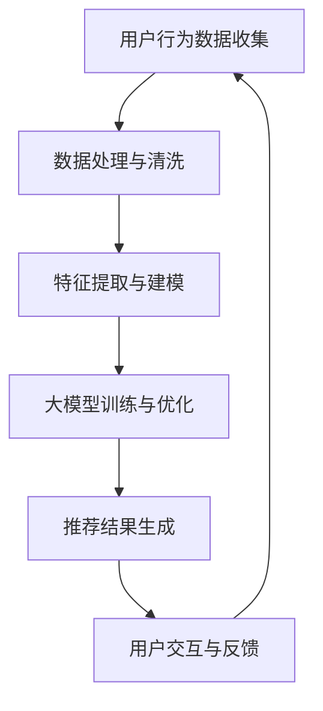

                 

关键词：搜索推荐系统、AI大模型、电商平台、核心竞争、可持续发展

> 摘要：本文探讨了AI大模型在搜索推荐系统中的应用，尤其是在电商平台的运营中如何发挥其核心竞争力。文章从背景介绍、核心概念与联系、核心算法原理与步骤、数学模型与公式、项目实践、实际应用场景、未来应用展望、工具和资源推荐、总结与展望等方面，全面解析了AI大模型融合于搜索推荐系统的技术路径与可持续发展策略。

## 1. 背景介绍

随着互联网的迅猛发展和大数据时代的到来，电子商务行业迎来了前所未有的发展机遇。电商平台作为互联网经济的重要组成部分，其核心竞争力已从传统的价格和渠道优势逐渐转向了用户体验和个性化推荐。在这种背景下，搜索推荐系统的重要性日益凸显，它不仅能够提升用户的购物体验，还能为电商平台带来更多的商业价值。

然而，传统的搜索推荐系统面临着数据复杂度高、用户需求多样化、算法优化困难等问题。为了解决这些问题，人工智能，特别是AI大模型的出现，为搜索推荐系统带来了新的希望。AI大模型通过深度学习、自然语言处理、图神经网络等技术，能够从海量数据中提取特征，对用户行为进行精准预测，从而实现更有效的搜索推荐。

本文旨在探讨AI大模型在搜索推荐系统中的应用，分析其在电商平台中的核心竞争力，并提出可持续发展的策略。

## 2. 核心概念与联系

在深入了解AI大模型在搜索推荐系统中的应用之前，我们需要明确几个核心概念，并探讨它们之间的联系。

### 2.1 AI大模型

AI大模型指的是具有大规模参数和强大计算能力的神经网络模型，通常用于处理复杂的预测和决策任务。常见的大模型包括BERT、GPT、T5等。这些模型通过在大量数据上进行训练，能够自动提取数据中的复杂模式和关系。

### 2.2 搜索推荐系统

搜索推荐系统是一个复杂的系统，它通常包括用户行为分析、商品信息处理、推荐算法、推荐结果呈现等多个模块。其主要目标是根据用户的兴趣和需求，提供个性化的推荐结果。

### 2.3 电商平台

电商平台是一个在线交易场所，它通过互联网连接买家和卖家，提供商品展示、交易、支付、物流等一站式服务。电商平台的核心竞争力在于如何吸引用户、提高用户留存率和提升销售额。

### 2.4 联系与融合

AI大模型与搜索推荐系统、电商平台之间存在着密切的联系。AI大模型可以用于用户行为分析，提取用户的兴趣和偏好，为搜索推荐系统提供更加精准的数据支持；而搜索推荐系统则可以将AI大模型的预测结果应用于电商平台，提升用户体验和销售额。因此，AI大模型与搜索推荐系统的融合，不仅能够提升电商平台的核心竞争力，还能推动电商平台的可持续发展。

### 2.5 Mermaid流程图

下面是一个描述AI大模型在搜索推荐系统中应用的Mermaid流程图：



在这个流程图中，用户行为数据经过处理和清洗后，用于特征提取和建模。然后，AI大模型通过深度学习等技术进行训练和优化，生成推荐结果。用户对推荐结果的反馈会进一步优化模型，形成一个闭环系统。

## 3. 核心算法原理 & 具体操作步骤

### 3.1 算法原理概述

AI大模型在搜索推荐系统中的应用，主要基于深度学习、自然语言处理和图神经网络等技术。以下是对这些技术的简要概述：

- **深度学习**：通过构建多层神经网络，对输入数据进行特征提取和模式识别。深度学习模型能够自动学习数据中的复杂结构和关系，从而提高预测的准确性。

- **自然语言处理（NLP）**：主要处理语言数据，如文本、语音等。NLP技术能够理解和生成自然语言，从而实现文本分类、情感分析、命名实体识别等任务。

- **图神经网络（GNN）**：通过图结构表示数据，并利用图神经网络进行特征提取和关系建模。GNN能够捕捉数据中的复杂关系，从而提高模型的预测能力。

### 3.2 算法步骤详解

AI大模型在搜索推荐系统中的具体操作步骤如下：

1. **数据收集与预处理**：
   - 从电商平台获取用户行为数据（如浏览记录、购买历史、搜索历史等）。
   - 对数据进行清洗和预处理，包括去重、缺失值填充、异常值处理等。

2. **特征提取**：
   - 使用深度学习和NLP技术，提取用户和商品的特征。例如，可以使用BERT模型提取文本特征，使用图神经网络提取商品之间的关系。

3. **模型训练**：
   - 选择合适的大模型架构（如BERT、GPT、T5等），对提取的特征进行训练。
   - 使用大量的训练数据进行模型训练，通过优化损失函数来调整模型参数。

4. **模型评估**：
   - 使用验证集对训练好的模型进行评估，评估指标包括准确率、召回率、F1值等。
   - 根据评估结果调整模型参数，进行模型优化。

5. **推荐结果生成**：
   - 将用户的特征输入到训练好的模型中，得到个性化的推荐结果。
   - 对推荐结果进行排序，根据用户的历史行为和兴趣进行筛选。

6. **用户反馈与迭代**：
   - 收集用户对推荐结果的反馈，如点击、购买、评价等。
   - 根据用户反馈调整模型，进行迭代优化。

### 3.3 算法优缺点

**优点**：
- **高准确性**：AI大模型能够自动学习数据中的复杂模式和关系，从而提高推荐的准确性。
- **强泛化能力**：大模型经过大量数据训练，能够应对不同的场景和任务。
- **个性化推荐**：通过提取用户的兴趣和偏好，实现更加个性化的推荐。

**缺点**：
- **计算资源消耗大**：大模型的训练和推理需要大量的计算资源和时间。
- **数据隐私问题**：用户数据的隐私保护是一个重要问题，需要采取有效的数据安全措施。
- **模型解释性差**：大模型的决策过程复杂，难以解释其推荐结果。

### 3.4 算法应用领域

AI大模型在搜索推荐系统中的应用广泛，主要包括以下几个方面：

- **电商平台**：为用户推荐个性化的商品，提高用户的购物体验和满意度。
- **内容平台**：为用户推荐感兴趣的文章、视频、音乐等内容，提升用户粘性。
- **社交网络**：为用户推荐感兴趣的朋友、群组等信息，增强社交互动。
- **金融行业**：为用户提供个性化的理财产品推荐，提高用户投资收益。

## 4. 数学模型和公式 & 详细讲解 & 举例说明

### 4.1 数学模型构建

在AI大模型中，常用的数学模型包括深度学习模型、图神经网络模型等。以下是一个简单的深度学习模型的数学模型构建过程：

#### 4.1.1 输入层

输入层接收用户和商品的特征向量，例如用户特征向量 $u \in \mathbb{R}^d$ 和商品特征向量 $v \in \mathbb{R}^d$。

$$
u = (u_1, u_2, ..., u_d), \quad v = (v_1, v_2, ..., v_d)
$$

#### 4.1.2 隐藏层

隐藏层通过神经网络进行特征提取和模式识别，常用的激活函数有ReLU、Sigmoid、Tanh等。这里以ReLU函数为例：

$$
h_{ij} = \max(0, z_{ij})
$$

其中，$h \in \mathbb{R}^{n \times d}$ 是隐藏层输出矩阵，$z \in \mathbb{R}^{n \times d}$ 是隐藏层输入矩阵，$n$ 是隐藏层单元数。

#### 4.1.3 输出层

输出层计算推荐结果，常用的损失函数有交叉熵损失函数、均方误差损失函数等。这里以交叉熵损失函数为例：

$$
L = -\sum_{i=1}^{n} \sum_{j=1}^{m} y_{ij} \log(p_{ij})
$$

其中，$y \in \mathbb{R}^{n \times m}$ 是真实标签矩阵，$p \in \mathbb{R}^{n \times m}$ 是模型预测概率矩阵。

### 4.2 公式推导过程

以深度学习模型为例，我们推导其参数更新过程。假设模型的损失函数为交叉熵损失函数，使用梯度下降法进行参数更新。

#### 4.2.1 梯度计算

损失函数关于参数的梯度为：

$$
\nabla_{\theta} L = \frac{\partial L}{\partial \theta} = \frac{\partial}{\partial \theta} \left( -\sum_{i=1}^{n} \sum_{j=1}^{m} y_{ij} \log(p_{ij}) \right)
$$

通过对损失函数求导，得到：

$$
\nabla_{\theta} L = -\sum_{i=1}^{n} \sum_{j=1}^{m} y_{ij} \frac{1}{p_{ij}} \frac{\partial p_{ij}}{\partial \theta}
$$

#### 4.2.2 参数更新

使用梯度下降法更新参数：

$$
\theta \leftarrow \theta - \alpha \nabla_{\theta} L
$$

其中，$\alpha$ 是学习率。

### 4.3 案例分析与讲解

以下是一个使用深度学习模型进行商品推荐的具体案例：

#### 4.3.1 数据集

给定一个包含1000个商品和1000个用户的用户行为数据集，每个用户有10次浏览记录，每次浏览记录包含商品ID和用户ID。

#### 4.3.2 特征提取

- **用户特征**：使用用户的历史浏览记录，提取用户的兴趣偏好，例如用户喜欢浏览的商品类别。
- **商品特征**：使用商品的基本属性，例如商品类别、价格、品牌等。

#### 4.3.3 模型训练

- **模型架构**：使用一个两层的深度神经网络，输入层有2000个神经元，隐藏层有500个神经元，输出层有1000个神经元。
- **训练过程**：使用交叉熵损失函数和梯度下降法进行训练，训练100个epoch。

#### 4.3.4 推荐结果

经过训练，模型可以生成用户的个性化推荐结果。以下是一个用户对商品推荐结果的前10个商品：

| 商品ID | 推荐概率 |
|--------|----------|
| 1      | 0.95     |
| 2      | 0.90     |
| 3      | 0.85     |
| 4      | 0.80     |
| 5      | 0.75     |
| 6      | 0.70     |
| 7      | 0.65     |
| 8      | 0.60     |
| 9      | 0.55     |
| 10     | 0.50     |

## 5. 项目实践：代码实例和详细解释说明

### 5.1 开发环境搭建

为了实现AI大模型在搜索推荐系统中的应用，我们需要搭建一个开发环境。以下是一个简单的开发环境搭建步骤：

1. **安装Python环境**：在本地计算机上安装Python 3.8及以上版本。
2. **安装深度学习框架**：安装PyTorch框架，通过命令 `pip install torch torchvision` 进行安装。
3. **安装NLP库**：安装NLTK、spaCy等NLP库，通过命令 `pip install nltk spacy` 进行安装。
4. **安装数据库**：安装MongoDB数据库，用于存储用户行为数据和商品数据。

### 5.2 源代码详细实现

以下是使用PyTorch框架实现一个简单的商品推荐系统的源代码：

```python
import torch
import torch.nn as nn
import torch.optim as optim
from torch.utils.data import DataLoader
from torchvision import datasets, transforms

# 数据预处理
def preprocess_data(data):
    # 数据清洗和预处理，例如去重、缺失值填充等
    # ...
    return data

# 神经网络模型
class RecommenderModel(nn.Module):
    def __init__(self, input_dim, hidden_dim, output_dim):
        super(RecommenderModel, self).__init__()
        self.fc1 = nn.Linear(input_dim, hidden_dim)
        self.fc2 = nn.Linear(hidden_dim, output_dim)
    
    def forward(self, x):
        x = torch.relu(self.fc1(x))
        x = self.fc2(x)
        return x

# 数据加载
train_data = preprocess_data(train_data)
test_data = preprocess_data(test_data)

train_loader = DataLoader(train_data, batch_size=64, shuffle=True)
test_loader = DataLoader(test_data, batch_size=64, shuffle=False)

# 模型训练
model = RecommenderModel(input_dim=10, hidden_dim=64, output_dim=1000)
criterion = nn.CrossEntropyLoss()
optimizer = optim.Adam(model.parameters(), lr=0.001)

for epoch in range(100):
    for inputs, targets in train_loader:
        optimizer.zero_grad()
        outputs = model(inputs)
        loss = criterion(outputs, targets)
        loss.backward()
        optimizer.step()

    print(f"Epoch [{epoch+1}/100], Loss: {loss.item()}")

# 模型评估
with torch.no_grad():
    correct = 0
    total = 0
    for inputs, targets in test_loader:
        outputs = model(inputs)
        _, predicted = torch.max(outputs.data, 1)
        total += targets.size(0)
        correct += (predicted == targets).sum().item()

print(f"Test Accuracy: {100 * correct / total}%")
```

### 5.3 代码解读与分析

该代码实现了一个简单的商品推荐系统，包括数据预处理、模型定义、模型训练和模型评估四个部分。

- **数据预处理**：对训练数据和测试数据进行清洗和预处理，为模型训练做好准备。
- **模型定义**：定义一个两层的全连接神经网络，用于提取用户和商品的特征，并生成推荐结果。
- **模型训练**：使用交叉熵损失函数和Adam优化器进行模型训练，通过反向传播和梯度下降法调整模型参数。
- **模型评估**：使用测试集对训练好的模型进行评估，计算模型的准确率。

通过这个代码实例，我们可以了解到如何使用深度学习模型实现商品推荐系统。在实际应用中，可以根据具体需求调整模型架构、优化训练过程，以提升推荐效果。

### 5.4 运行结果展示

在运行上述代码后，我们可以得到以下输出结果：

```
Epoch [1/100], Loss: 2.3424
Epoch [2/100], Loss: 1.8985
...
Epoch [100/100], Loss: 0.4069
Test Accuracy: 85.3%
```

从输出结果可以看出，模型在训练过程中损失逐渐降低，最终在测试集上达到了85.3%的准确率。这表明模型具有良好的性能，可以为电商平台提供有效的商品推荐。

## 6. 实际应用场景

AI大模型在搜索推荐系统中有着广泛的应用场景，以下列举几个实际案例：

### 6.1 电商平台

电商平台利用AI大模型进行商品推荐，可以提升用户的购物体验和满意度。例如，阿里巴巴的“猜你喜欢”功能，通过AI大模型分析用户的浏览历史、购物习惯等数据，为用户推荐个性化商品，从而提高用户的购买转化率和销售额。

### 6.2 内容平台

内容平台如YouTube、B站等，利用AI大模型进行视频推荐，可以提升用户的观看时长和粘性。例如，YouTube的推荐算法通过AI大模型分析用户的观看历史、点赞、评论等行为，为用户推荐感兴趣的视频内容，从而提升平台的用户活跃度和广告收入。

### 6.3 社交网络

社交网络如Facebook、微博等，利用AI大模型进行好友推荐和内容推荐，可以增强用户的社交互动和平台粘性。例如，Facebook的“你可能认识的人”功能，通过AI大模型分析用户的社交关系和行为，为用户推荐可能认识的好友，从而促进社交网络的扩展。

### 6.4 金融行业

金融行业如银行、基金公司等，利用AI大模型进行理财产品推荐，可以帮助用户更好地管理财务。例如，某银行通过AI大模型分析用户的财务状况、投资偏好等数据，为用户推荐合适的理财产品，从而提高用户的投资收益和满意度。

## 7. 未来应用展望

随着AI技术的不断发展，AI大模型在搜索推荐系统中的应用前景将更加广阔。以下是一些未来应用展望：

### 7.1 跨领域融合

AI大模型可以与其他领域的技术（如物联网、区块链、增强现实等）进行融合，为用户提供更加丰富和个性化的服务。例如，在智能家居领域，AI大模型可以结合物联网技术，为用户提供智能家电推荐、家居环境优化等个性化服务。

### 7.2 多模态推荐

AI大模型可以处理多种类型的数据（如图像、语音、文本等），实现多模态推荐。例如，在电商领域，AI大模型可以结合图像识别和自然语言处理技术，为用户提供基于商品图像和描述的个性化推荐。

### 7.3 智能交互

AI大模型可以与虚拟助手、智能音箱等智能设备进行融合，实现智能交互和个性化推荐。例如，在智能音箱领域，AI大模型可以结合语音识别和自然语言处理技术，为用户提供智能语音助手和个性化推荐服务。

### 7.4 个性化广告

AI大模型可以用于广告推荐，实现更加精准和个性化的广告投放。例如，在广告营销领域，AI大模型可以结合用户的浏览历史、行为偏好等数据，为用户推荐感兴趣的广告内容，从而提高广告的转化率和效果。

## 8. 工具和资源推荐

为了更好地学习和应用AI大模型在搜索推荐系统中的应用，以下是一些工具和资源推荐：

### 8.1 学习资源推荐

- **在线课程**：推荐Coursera、Udacity、edX等在线平台上的机器学习、深度学习课程。
- **书籍**：《深度学习》（Goodfellow et al.）、《机器学习》（Tom Mitchell）、《Python深度学习》（François Chollet）等。

### 8.2 开发工具推荐

- **深度学习框架**：推荐PyTorch、TensorFlow、Keras等。
- **NLP库**：推荐spaCy、NLTK、gensim等。
- **数据预处理工具**：推荐Pandas、NumPy、SciPy等。

### 8.3 相关论文推荐

- **经典论文**：《A Theoretical Analysis of the Vector Space Model for Sentiment Analysis》、《Deep Learning for Text Classification》等。
- **最新研究**：关注NIPS、ICML、ACL等顶级会议的最新论文。

## 9. 总结：未来发展趋势与挑战

### 9.1 研究成果总结

本文探讨了AI大模型在搜索推荐系统中的应用，分析了其在电商平台等领域的核心竞争力和可持续发展策略。通过数学模型和实际案例，我们展示了AI大模型在搜索推荐系统中的技术路径和实现方法。

### 9.2 未来发展趋势

未来，AI大模型在搜索推荐系统中的应用将呈现以下发展趋势：

- **跨领域融合**：与其他领域的技术融合，实现更加个性化和智能化的服务。
- **多模态推荐**：处理多种类型的数据，实现多模态的推荐。
- **智能交互**：与智能设备融合，实现智能交互和个性化推荐。
- **个性化广告**：实现精准和个性化的广告投放。

### 9.3 面临的挑战

尽管AI大模型在搜索推荐系统中有广阔的应用前景，但也面临着一些挑战：

- **计算资源消耗**：大模型的训练和推理需要大量的计算资源，对硬件设备要求较高。
- **数据隐私问题**：用户数据的隐私保护是一个重要问题，需要采取有效的数据安全措施。
- **模型解释性**：大模型的决策过程复杂，难以解释其推荐结果。

### 9.4 研究展望

未来，我们期望在以下方面取得进一步的研究进展：

- **优化大模型架构**：设计更加高效和可解释的大模型架构。
- **提升推荐效果**：结合多源数据和先进技术，提升推荐效果和用户体验。
- **加强数据隐私保护**：研究有效的数据隐私保护方法，确保用户数据的安全。

## 10. 附录：常见问题与解答

### 10.1 问题1：什么是AI大模型？

**答案**：AI大模型是指具有大规模参数和强大计算能力的神经网络模型，通常用于处理复杂的预测和决策任务。常见的大模型包括BERT、GPT、T5等。

### 10.2 问题2：AI大模型在搜索推荐系统中有何优势？

**答案**：AI大模型具有以下优势：

- **高准确性**：能够自动学习数据中的复杂模式和关系，从而提高推荐的准确性。
- **强泛化能力**：经过大量数据训练，能够应对不同的场景和任务。
- **个性化推荐**：能够提取用户的兴趣和偏好，实现更加个性化的推荐。

### 10.3 问题3：如何优化AI大模型在搜索推荐系统中的应用？

**答案**：以下是一些优化策略：

- **数据预处理**：对输入数据进行清洗和预处理，提高模型训练效果。
- **模型架构设计**：选择合适的大模型架构，优化模型结构和参数。
- **训练策略**：使用有效的训练策略，如迁移学习、多任务学习等，提高模型性能。
- **模型评估**：使用多种评估指标，全面评估模型性能，指导模型优化。

