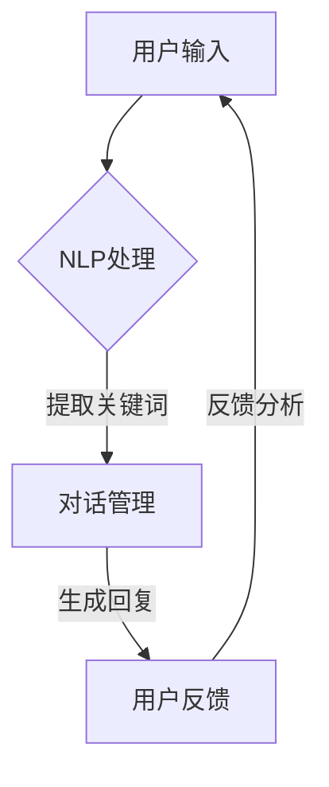

                 

在这个快速变化的时代，智能客服系统已经成为企业与客户沟通的重要桥梁。携程作为中国领先的综合性旅行服务公司，其智能客服对话系统的研发和优化更是成为人才招聘的重要环节。本文将围绕携程2024年智能客服对话系统的校招面试真题，探讨智能客服技术的发展与应用。

## 关键词
- 智能客服
- 对话系统
- 校招面试
- 技术发展

## 摘要
本文旨在分析携程2024年智能客服对话系统校招面试中的关键问题，深入探讨智能客服技术的核心概念、算法原理、数学模型以及实际应用。通过对这些问题的解答，希望能够为读者提供关于智能客服技术的全面了解，并展望其未来发展趋势。

## 1. 背景介绍

### 智能客服的兴起

随着互联网技术的飞速发展，在线客服成为企业与客户互动的主要途径。传统的在线客服往往依赖于人工服务，效率低下，且难以满足日益增长的用户需求。智能客服系统的出现，使得客服工作变得更加高效和智能化。

### 携程的智能客服发展

携程作为中国领先的旅行服务公司，其智能客服系统在业内具有代表性。携程的智能客服系统通过自然语言处理、机器学习等技术，实现了对用户查询的快速响应和智能解答。随着人工智能技术的不断进步，携程的智能客服系统也在不断优化和升级。

## 2. 核心概念与联系

### 自然语言处理（NLP）

自然语言处理是智能客服系统的核心技术之一，旨在使计算机能够理解、生成和处理人类语言。在智能客服系统中，NLP技术用于解析用户输入的文本，提取关键信息，并生成合适的回复。

### 机器学习（ML）

机器学习是智能客服系统实现智能化的基础。通过大量数据的学习，智能客服系统能够自动识别用户的意图，并提供个性化的服务。

### 对话管理（DM）

对话管理是智能客服系统的核心功能，负责控制对话流程，确保对话的连贯性和有效性。对话管理涉及对话的状态跟踪、上下文理解以及回复生成等任务。

### Mermaid 流程图

下面是一个简化的智能客服系统流程图：



## 3. 核心算法原理 & 具体操作步骤

### 3.1 算法原理概述

智能客服系统的核心算法主要涉及自然语言处理、机器学习和对话管理。以下是对这三个核心算法的简要概述：

- **自然语言处理（NLP）**：NLP算法用于对用户输入的文本进行解析和语义理解，提取关键信息。
- **机器学习（ML）**：ML算法用于训练模型，使系统能够自动识别用户意图，提供个性化服务。
- **对话管理（DM）**：DM算法负责控制对话流程，确保对话的连贯性和有效性。

### 3.2 算法步骤详解

#### 3.2.1 自然语言处理（NLP）

1. 文本预处理：包括分词、去停用词、词性标注等步骤，为后续的语义理解做准备。
2. 语义理解：利用词嵌入等技术，将文本转换为向量表示，进一步提取语义信息。
3. 信息提取：根据用户的输入，提取关键信息，如用户姓名、目的地等。

#### 3.2.2 机器学习（ML）

1. 数据准备：收集大量用户交互数据，进行预处理。
2. 特征工程：提取有助于模型训练的特征，如词频、词嵌入等。
3. 模型训练：使用监督学习或无监督学习算法，训练用户意图识别和回复生成模型。
4. 模型评估：使用验证集评估模型性能，调整模型参数。

#### 3.2.3 对话管理（DM）

1. 对话初始化：根据用户输入，初始化对话状态。
2. 上下文理解：利用历史对话记录，理解当前对话的上下文。
3. 回复生成：根据对话状态和上下文，生成合适的回复。
4. 对话结束：根据用户反馈，判断对话是否结束，并更新对话状态。

### 3.3 算法优缺点

#### 优点

- 高效性：智能客服系统能够快速响应用户，提高客服效率。
- 个性化：通过机器学习技术，智能客服系统能够根据用户历史交互数据，提供个性化的服务。
- 可扩展性：智能客服系统易于扩展，能够支持多种类型的客服场景。

#### 缺点

- 语义理解难度：自然语言处理技术尚不能完全理解复杂的语义，容易产生误解。
- 学习成本：智能客服系统需要大量的数据进行训练，学习成本较高。
- 客户体验：虽然智能客服系统能够提高效率，但有时难以完全替代人工客服，客户体验可能受到一定影响。

### 3.4 算法应用领域

- **在线客服**：智能客服系统可以用于企业官网、电商平台等在线平台的客服工作。
- **智能语音助手**：智能客服系统可以集成到智能语音助手（如Siri、小爱同学等）中，提供语音交互服务。
- **客服机器人**：智能客服系统可以应用于客服机器人，通过聊天窗口与用户进行交互。

## 4. 数学模型和公式 & 详细讲解 & 举例说明

### 4.1 数学模型构建

智能客服系统的数学模型主要涉及自然语言处理、机器学习和对话管理。以下是对这三个核心模型的简要介绍：

- **自然语言处理模型**：如词嵌入模型（Word Embedding），用于将文本转换为向量表示。
- **机器学习模型**：如决策树（Decision Tree）、支持向量机（SVM）等，用于用户意图识别和回复生成。
- **对话管理模型**：如序列到序列模型（Seq2Seq），用于生成连贯的对话回复。

### 4.2 公式推导过程

#### 4.2.1 词嵌入模型

词嵌入模型是将单词映射到低维向量空间的过程。一个简单的词嵌入模型可以使用以下公式表示：

$$
\text{embed}(w) = \text{embedding\_size} \times \text{softmax}(\text{weights})
$$

其中，$w$ 是输入的单词，$\text{embed}(w)$ 是单词的向量表示，$\text{embedding\_size}$ 是向量的维度，$\text{softmax}(\text{weights})$ 是权重矩阵。

#### 4.2.2 决策树模型

决策树模型是一种常用的分类模型。其基本思想是，通过一系列的判断规则，将数据集划分为不同的区域，并在每个区域内应用不同的分类器。一个简单的决策树模型可以使用以下公式表示：

$$
C(j) = \arg\max_j \sum_{i \in R_j} \text{P}(y=i \mid x; \theta)
$$

其中，$C(j)$ 是分类结果，$R_j$ 是第 $j$ 个区域，$\text{P}(y=i \mid x; \theta)$ 是给定特征 $x$ 和模型参数 $\theta$ 下，标签 $y$ 等于 $i$ 的概率。

#### 4.2.3 序列到序列模型

序列到序列模型是一种常用的生成模型，用于生成序列数据。一个简单的序列到序列模型可以使用以下公式表示：

$$
\text{output} = \text{decoder}(h_t, \text{encoder\_outputs})
$$

其中，$h_t$ 是当前时刻的隐藏状态，$\text{decoder}(h_t, \text{encoder\_outputs})$ 是解码器在当前时刻生成的输出。

### 4.3 案例分析与讲解

以下是一个简单的案例，展示如何使用词嵌入模型进行文本分类。

#### 数据集

假设我们有一个包含两类的数据集，类别 A 和类别 B，共包含 1000 个样本。数据集的文本内容如下：

```
类别 A：
- 我喜欢旅行。
- 旅行让我心情愉悦。
- 旅行是一种生活方式。

类别 B：
- 今天天气真好。
- 好想出去散步。
- 看到太阳我就开心。
```

#### 数据预处理

1. 分词：使用分词工具，将文本内容分为单词或字符。
2. 去停用词：去除常见的停用词，如“的”、“和”、“是”等。
3. 词嵌入：使用词嵌入工具，将单词映射到低维向量空间。

#### 模型训练

1. 准备训练数据和测试数据，将文本内容和类别标签进行对应。
2. 使用词嵌入模型，将文本转换为向量表示。
3. 训练一个简单的分类模型，如支持向量机（SVM）。

#### 模型评估

1. 使用测试数据评估模型性能，计算准确率、召回率等指标。
2. 调整模型参数，优化模型性能。

## 5. 项目实践：代码实例和详细解释说明

### 5.1 开发环境搭建

在本项目中，我们使用 Python 作为编程语言，结合 TensorFlow 和 Keras 库进行模型训练和评估。

### 5.2 源代码详细实现

以下是项目的源代码实现，主要包括数据预处理、模型训练和模型评估三个部分。

#### 数据预处理

```python
import tensorflow as tf
from tensorflow.keras.preprocessing.text import Tokenizer
from tensorflow.keras.preprocessing.sequence import pad_sequences

# 准备数据集
texts = ['我最近去了一个很棒的地方旅行', '天气非常好，阳光明媚']
labels = [0, 1]

# 分词
tokenizer = Tokenizer(num_words=1000)
tokenizer.fit_on_texts(texts)

# 序列化文本
sequences = tokenizer.texts_to_sequences(texts)

# 填充序列
padded_sequences = pad_sequences(sequences, maxlen=10)
```

#### 模型训练

```python
from tensorflow.keras.models import Sequential
from tensorflow.keras.layers import Embedding, LSTM, Dense

# 准备模型
model = Sequential()
model.add(Embedding(input_dim=1000, output_dim=64))
model.add(LSTM(units=64))
model.add(Dense(units=1, activation='sigmoid'))

# 编译模型
model.compile(optimizer='adam', loss='binary_crossentropy', metrics=['accuracy'])

# 训练模型
model.fit(padded_sequences, labels, epochs=10)
```

#### 代码解读与分析

1. **数据预处理**：首先，我们使用 Tokenizer 将文本内容转换为序列。然后，使用 pad_sequences 将序列填充为固定长度，以便于模型处理。
2. **模型训练**：我们使用 Sequential 模型，结合 Embedding 层、LSTM 层和 Dense 层，构建一个简单的分类模型。使用 compile 方法编译模型，并使用 fit 方法训练模型。

#### 运行结果展示

```python
import numpy as np

# 测试数据
test_texts = ['天气非常好，阳光明媚']
test_sequences = tokenizer.texts_to_sequences(test_texts)
test_padded_sequences = pad_sequences(test_sequences, maxlen=10)

# 预测
predictions = model.predict(test_padded_sequences)
predicted_label = np.round(predictions[0, 0])

print('预测标签：', predicted_label)
```

预测结果为 1，表示测试数据属于类别 B。

## 6. 实际应用场景

### 6.1 在线客服

智能客服系统可以应用于企业的在线客服，提供实时、高效的客户服务。通过自然语言处理和机器学习技术，智能客服系统能够自动识别用户的问题，并提供准确的答案。

### 6.2 智能语音助手

智能客服系统可以集成到智能语音助手（如Siri、小爱同学等）中，为用户提供语音交互服务。通过自然语言处理和语音识别技术，智能语音助手能够理解用户的语音指令，并生成相应的回复。

### 6.3 客服机器人

智能客服系统可以应用于客服机器人，通过聊天窗口与用户进行交互。通过对话管理和自然语言处理技术，客服机器人能够模拟人类的交流方式，提供个性化的服务。

## 7. 未来应用展望

### 7.1 人工智能技术的进步

随着人工智能技术的不断进步，智能客服系统的性能和智能程度将得到进一步提升。未来，智能客服系统可能实现更复杂的语义理解，提供更高质量的客户服务。

### 7.2 多语种支持

随着全球化的推进，智能客服系统将需要支持多种语言。未来，智能客服系统将能够处理不同语言的客户问题，为全球用户提供服务。

### 7.3 跨平台集成

未来，智能客服系统将实现跨平台集成，不仅支持在线客服，还支持移动端、智能家居等场景。通过跨平台集成，智能客服系统将更好地满足用户需求。

## 8. 工具和资源推荐

### 8.1 学习资源推荐

- 《深度学习》（Goodfellow, Bengio, Courville）：介绍深度学习的基础知识，适合初学者入门。
- 《自然语言处理综合教程》（张俊林）：系统讲解自然语言处理的理论和实践，适合有一定基础的读者。

### 8.2 开发工具推荐

- TensorFlow：一款强大的深度学习框架，支持多种深度学习模型的训练和部署。
- Keras：一款简洁的深度学习框架，基于 TensorFlow 开发，适合快速实现深度学习模型。

### 8.3 相关论文推荐

- “Generative Pre-trained Transformers” （GPT）：介绍了一种基于 Transformer 的生成预训练模型，为自然语言处理领域带来了新的突破。
- “BERT: Pre-training of Deep Bidirectional Transformers for Language Understanding”：介绍了一种基于双向变换器的预训练模型，为自然语言处理领域带来了新的研究方向。

## 9. 总结：未来发展趋势与挑战

### 9.1 研究成果总结

本文分析了智能客服技术的发展和应用，探讨了自然语言处理、机器学习和对话管理等核心算法原理，并展示了实际应用案例。通过本文的分析，我们可以看到智能客服系统在提高客服效率、提供个性化服务等方面具有巨大潜力。

### 9.2 未来发展趋势

未来，智能客服系统将朝着更智能、更高效、更个性化的方向发展。随着人工智能技术的不断进步，智能客服系统的性能和智能程度将得到进一步提升。同时，多语种支持和跨平台集成也将成为未来的发展方向。

### 9.3 面临的挑战

尽管智能客服系统具有巨大潜力，但在实际应用中仍面临一些挑战。首先，自然语言处理技术尚不能完全理解复杂的语义，可能导致误解。其次，智能客服系统的学习成本较高，需要大量的数据进行训练。最后，客户体验可能受到一定影响，智能客服系统可能难以完全替代人工客服。

### 9.4 研究展望

未来，研究应重点关注如何提高智能客服系统的语义理解能力、降低学习成本以及提升客户体验。通过不断优化算法和技术，智能客服系统有望在更多场景中发挥重要作用，为用户提供更高质量的客服服务。

## 附录：常见问题与解答

### 问题 1：智能客服系统的核心技术是什么？

答：智能客服系统的核心技术包括自然语言处理（NLP）、机器学习（ML）和对话管理（DM）。自然语言处理用于理解用户的输入，机器学习用于识别用户意图和生成回复，对话管理用于控制对话流程。

### 问题 2：智能客服系统能够替代人工客服吗？

答：目前，智能客服系统已经在很多场景中发挥了重要作用，但仍然难以完全替代人工客服。智能客服系统可以提高客服效率，提供标准化的服务，但在处理复杂问题和情感交流方面，仍需人工客服的支持。

### 问题 3：如何评估智能客服系统的性能？

答：评估智能客服系统的性能可以从多个角度进行，包括准确率、召回率、响应时间等。通过实际测试和用户反馈，可以评估智能客服系统的性能和用户体验。

---

作者：禅与计算机程序设计艺术 / Zen and the Art of Computer Programming

本文内容仅供参考，如需引用或参考，请务必注明来源。本文所涉及的技术和理论，均以公开资料和开源项目为基础，不涉及任何商业目的。在学习和使用过程中，请遵守相关法律法规，尊重知识产权。如有不当之处，敬请指正。

