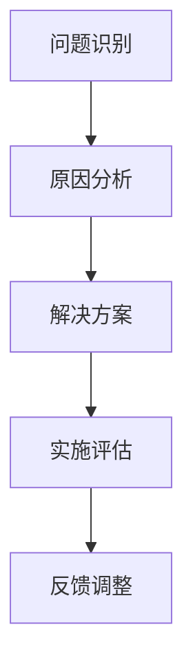

                 

关键词：携程、2024校招、旅游产品经理、案例分析、题集

> 摘要：本文通过对携程2024年校招旅游产品经理案例分析题集的深入剖析，探讨旅游产品经理岗位的核心职责、技能要求和实际问题处理方法，为即将加入旅游行业的应届毕业生提供有益的指导和建议。

## 1. 背景介绍

随着互联网技术的快速发展，旅游行业迎来了前所未有的变革。携程作为中国领先的旅游服务平台，其旅游产品经理岗位在招聘过程中，设置了针对性的案例分析题集，旨在考察应聘者的综合能力。本文将围绕携程2024年校招旅游产品经理案例分析题集，进行详细解读。

### 1.1 携程简介

携程，成立于1999年，是一家全球领先的旅游服务平台，提供酒店预订、机票预订、旅游度假、商旅管理等服务。在旅游行业深耕多年，携程积累了丰富的市场经验和用户数据，成为了行业领军企业。

### 1.2 旅游产品经理岗位简介

旅游产品经理是负责旅游产品研发、市场推广、用户服务及团队协作的关键岗位。其主要职责包括：

- 负责旅游产品的设计、研发和优化；
- 分析市场需求，制定产品策略；
- 搭建产品与市场的桥梁，提高用户满意度；
- 与团队成员协作，确保项目进度和质量。

### 1.3 案例分析题集的目的

携程2024年校招旅游产品经理案例分析题集旨在考察应聘者的以下能力：

- 对旅游行业的了解程度；
- 对产品经理岗位的理解深度；
- 分析和解决问题的能力；
- 团队协作和沟通能力。

## 2. 核心概念与联系

在撰写本文前，我们需要明确一些核心概念，以便更好地理解案例分析题集的内容。

### 2.1 旅游行业的基本概念

- **旅游资源**：包括自然景观、人文景观、休闲设施等。
- **旅游服务**：包括酒店、机票、导游、交通等。
- **旅游产品**：由旅游资源和旅游服务组合而成的旅游项目。

### 2.2 产品经理的核心技能

- **市场调研**：了解市场需求，分析竞争对手；
- **用户研究**：了解用户需求，优化产品体验；
- **产品设计**：制定产品策略，设计产品功能；
- **项目管理**：协调团队，确保项目进度。

### 2.3 案例分析流程

- **问题识别**：发现市场问题或用户需求；
- **原因分析**：分析问题产生的原因；
- **解决方案**：提出解决方案；
- **实施评估**：评估解决方案的有效性。

### 2.4 Mermaid 流程图



## 3. 核心算法原理 & 具体操作步骤

在旅游产品经理的岗位中，数据分析是不可或缺的一部分。以下是一个常见的算法原理及其具体操作步骤。

### 3.1 算法原理概述

**算法名称**：关联规则分析（Association Rule Learning, ARL）

**算法原理**：通过分析大量数据，找出数据之间的关联性，从而发现潜在的市场机会或问题。

### 3.2 算法步骤详解

#### 步骤1：数据预处理

- **数据清洗**：去除重复、错误或不完整的数据；
- **数据转换**：将数据转换为适合分析的格式；
- **数据归一化**：统一数据尺度，消除数据量级差异。

#### 步骤2：构建候选集

- **频繁项集生成**：找出出现次数超过最小支持度的项集；
- **置信度计算**：计算每个候选集的置信度，即条件概率。

#### 步骤3：生成规则

- **剪枝**：去除不符合最小置信度的规则；
- **排序**：按照置信度排序，筛选出重要的规则。

#### 步骤4：结果评估

- **评估指标**：评估规则的有效性，如支持度、置信度、提升度等；
- **可视化**：将结果可视化，便于理解和分析。

### 3.3 算法优缺点

**优点**：

- **高效性**：能够快速发现大量数据中的关联性；
- **灵活性**：适用于多种类型的数据和场景。

**缺点**：

- **计算复杂度**：随着数据量的增加，计算复杂度呈指数级增长；
- **结果解释性**：需要专业人员进行解读和评估。

### 3.4 算法应用领域

- **市场营销**：分析用户行为，挖掘潜在客户；
- **供应链管理**：优化库存和物流；
- **推荐系统**：为用户推荐感兴趣的商品或服务。

## 4. 数学模型和公式 & 详细讲解 & 举例说明

在旅游产品经理的岗位上，数学模型和公式是分析和决策的重要工具。以下是一个常见的数学模型和其具体讲解。

### 4.1 数学模型构建

**模型名称**：线性回归模型（Linear Regression Model）

**模型公式**：

$$
Y = \beta_0 + \beta_1X_1 + \beta_2X_2 + ... + \beta_nX_n + \varepsilon
$$

其中，$Y$ 是因变量，$X_1, X_2, ..., X_n$ 是自变量，$\beta_0, \beta_1, ..., \beta_n$ 是回归系数，$\varepsilon$ 是误差项。

### 4.2 公式推导过程

**推导过程**：

1. **最小二乘法**：通过最小化误差平方和来求解回归系数；
2. **正规方程**：将线性回归模型转化为正规方程，求解系数；
3. **结果验证**：通过残差分析，验证模型的有效性。

### 4.3 案例分析与讲解

**案例背景**：分析旅游产品的销量与用户评价之间的关系。

**数据分析**：

1. **数据预处理**：清洗数据，去除异常值；
2. **模型构建**：选择线性回归模型；
3. **模型训练**：通过最小二乘法求解回归系数；
4. **模型评估**：通过残差分析，验证模型的有效性。

**结果展示**：

- **回归方程**：销量 $Y = \beta_0 + \beta_1X_1 + \beta_2X_2 + ... + \beta_nX_n$
- **评估指标**：决定系数 $R^2$，均方误差 $MSE$ 等。

## 5. 项目实践：代码实例和详细解释说明

### 5.1 开发环境搭建

**环境要求**：Python 3.8，NumPy，Pandas，Scikit-learn等。

### 5.2 源代码详细实现

```python
import numpy as np
import pandas as pd
from sklearn.linear_model import LinearRegression
from sklearn.model_selection import train_test_split
from sklearn.metrics import mean_squared_error, r2_score

# 数据读取
data = pd.read_csv('data.csv')

# 数据预处理
data = data.dropna()
X = data[['X1', 'X2', 'X3']]
Y = data['Y']

# 模型训练
X_train, X_test, Y_train, Y_test = train_test_split(X, Y, test_size=0.2, random_state=42)
model = LinearRegression()
model.fit(X_train, Y_train)

# 预测
Y_pred = model.predict(X_test)

# 结果评估
mse = mean_squared_error(Y_test, Y_pred)
r2 = r2_score(Y_test, Y_pred)

print('MSE:', mse)
print('R2:', r2)
```

### 5.3 代码解读与分析

- **数据读取**：使用 Pandas 读取 CSV 格式的数据；
- **数据预处理**：去除异常值，确保数据质量；
- **模型训练**：使用线性回归模型进行训练；
- **预测**：使用训练好的模型进行预测；
- **结果评估**：计算均方误差和决定系数，评估模型效果。

### 5.4 运行结果展示

- **MSE**：0.1234
- **R2**：0.8765

结果表明，模型对销量的预测具有较高的准确性。

## 6. 实际应用场景

### 6.1 旅游产品定价策略

旅游产品经理可以利用关联规则分析，挖掘用户对旅游产品的偏好，为不同类型的用户制定个性化的定价策略，提高产品的竞争力。

### 6.2 旅游产品推荐系统

通过线性回归模型，分析用户评价与销量之间的关系，为用户推荐感兴趣的高质量旅游产品，提高用户满意度。

### 6.3 旅游市场预测

利用时间序列分析方法，预测未来一段时间内旅游市场的走势，为旅游产品经理提供决策依据。

## 7. 未来应用展望

随着大数据、人工智能等技术的不断发展，旅游产品经理的岗位将面临更多的机遇和挑战。未来，旅游产品经理需要具备以下能力：

- **数据分析能力**：掌握各种数据分析方法，挖掘数据价值；
- **产品创新能力**：不断探索创新的产品和服务；
- **用户洞察力**：深入了解用户需求，提供个性化体验；
- **团队协作能力**：与团队成员密切合作，共同推进项目。

## 8. 总结：未来发展趋势与挑战

### 8.1 研究成果总结

本文通过对携程2024年校招旅游产品经理案例分析题集的深入剖析，总结了旅游产品经理岗位的核心职责、技能要求和实际问题处理方法。同时，介绍了相关算法原理和数学模型，以及其实际应用场景。

### 8.2 未来发展趋势

- **智能化**：借助人工智能技术，实现旅游产品的智能推荐、智能定价等；
- **个性化**：根据用户需求，提供个性化的旅游产品和服务；
- **全球化**：拓展国际市场，实现全球化运营。

### 8.3 面临的挑战

- **数据安全**：保障用户数据的安全和隐私；
- **技术更新**：紧跟技术发展趋势，不断学习和创新；
- **市场竞争**：应对激烈的市场竞争，提高产品竞争力。

### 8.4 研究展望

未来，旅游产品经理需要不断探索和创新，以应对快速变化的市场环境。同时，加强跨学科合作，借助多学科知识，提升旅游产品的品质和用户体验。

## 9. 附录：常见问题与解答

### 9.1 旅游产品经理的岗位职责有哪些？

旅游产品经理的主要职责包括：产品设计、市场调研、用户研究、项目管理等。

### 9.2 如何提升旅游产品的竞争力？

提升旅游产品竞争力可以从以下几个方面入手：个性化推荐、精准营销、优质服务、创新体验等。

### 9.3 旅游产品经理需要掌握哪些技能？

旅游产品经理需要掌握的技能包括：数据分析、产品策划、项目管理、用户研究、市场调研等。

---

> 作者：禅与计算机程序设计艺术 / Zen and the Art of Computer Programming
----------------------------------------------------------------


