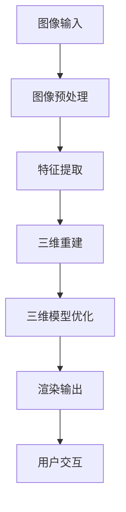

                 

 携程作为中国领先的在线旅行服务公司，每年都会在校园招聘中提出一系列富有挑战性的技术问题。2024年校招中，旅游场景3D重建算法工程师的编程题尤其引人注目。本文将深入探讨这一编程题的背景、核心概念、算法原理、数学模型、项目实践、实际应用场景以及未来发展趋势。希望通过这篇文章，读者能够对该问题有更深入的理解。

## 1. 背景介绍

在旅游业日益蓬勃发展的今天，提供高质量的旅游体验成为各大在线旅行服务公司的核心竞争力之一。为了满足用户对更真实、更生动的旅游信息的需求，携程在2024年校招中提出了旅游场景3D重建的编程题。此题旨在考察应聘者对3D重建技术、图像处理、计算机图形学等相关领域知识的掌握程度，以及解决实际问题的能力。

## 2. 核心概念与联系

### 2.1 3D重建的基本概念

3D重建是指从二维图像中恢复出三维场景信息的过程。在旅游场景中，3D重建可以帮助用户以更直观、更沉浸的方式体验旅游目的地，提升用户体验。

### 2.2 相关技术联系

- **图像处理**：图像处理技术用于对输入的二维图像进行预处理，包括去噪、增强、边缘检测等，以提高后续3D重建的准确性。
- **计算机图形学**：计算机图形学提供了一系列算法和工具，用于生成三维模型、渲染图像等，是实现3D重建的关键技术。
- **深度学习**：深度学习算法在3D重建中扮演了重要角色，特别是基于卷积神经网络（CNN）的深度学习方法，能够有效地从图像数据中提取特征并进行重建。

### 2.3 Mermaid流程图

下面是3D重建的Mermaid流程图，展示了主要步骤和技术联系：



## 3. 核心算法原理 & 具体操作步骤

### 3.1 算法原理概述

旅游场景3D重建算法通常基于以下原理：

- **多视图立体匹配**：利用多个角度的二维图像，通过立体匹配算法计算视差图，从而恢复出场景的三维信息。
- **结构光三维扫描**：通过在场景中投射结构光，并使用图像处理技术分析结构光在场景上的变形，从而实现三维重建。
- **深度学习**：利用深度学习模型，特别是卷积神经网络（CNN），直接从图像中提取特征并生成三维模型。

### 3.2 算法步骤详解

旅游场景3D重建的基本步骤如下：

1. **图像采集**：收集多个视角的二维图像，这些图像可以来自无人机、相机等设备。
2. **图像预处理**：对图像进行去噪、增强、边缘检测等预处理，以提高后续重建的准确性。
3. **特征提取**：从预处理后的图像中提取关键特征，如角点、边缘等，用于后续立体匹配。
4. **立体匹配**：利用多视角特征点匹配，计算视差图，从而恢复场景的三维信息。
5. **三维模型生成**：根据视差图和二维图像信息，使用多视图几何方法生成三维模型。
6. **模型优化**：对生成的三维模型进行优化，包括平滑、去噪等操作，以提高模型的精度和视觉效果。
7. **渲染输出**：将优化后的三维模型渲染成三维场景，供用户交互和浏览。

### 3.3 算法优缺点

- **优点**：
  - **高精度**：深度学习方法能够从大量数据中学习到更精细的特征，提高重建精度。
  - **自动化**：基于深度学习的算法可以实现高度自动化，降低人工干预的需求。
  - **适用性广**：多种算法和技术可以结合使用，适用于不同场景和需求。

- **缺点**：
  - **计算复杂度高**：深度学习算法通常需要大量计算资源，对硬件要求较高。
  - **数据依赖性大**：算法性能很大程度上依赖于训练数据的质量和数量。
  - **对噪声敏感**：图像预处理不当可能导致重建结果中的噪声和误差。

### 3.4 算法应用领域

3D重建算法在旅游场景中有着广泛的应用：

- **虚拟旅游**：通过3D重建技术，用户可以在线体验旅游景点的真实场景，提升旅游体验。
- **规划与设计**：旅游景点的规划与设计可以基于3D重建结果进行模拟和优化，提高规划的科学性和可行性。
- **文化遗产保护**：对历史文化遗产进行3D重建，有助于对其进行保护和传承。

## 4. 数学模型和公式 & 详细讲解 & 举例说明

### 4.1 数学模型构建

3D重建中的数学模型通常涉及以下几个关键步骤：

- **相机模型**：描述相机成像过程，包括内外参数。
- **多视图几何**：利用多个视角的二维图像信息恢复场景的三维结构。
- **结构光建模**：描述结构光在场景上的变形，用于三维重建。

### 4.2 公式推导过程

以下是3D重建中几个关键公式的推导过程：

#### 相机成像模型

$$
\begin{aligned}
    \mathbf{X'} &= \mathbf{K} \mathbf{P} \mathbf{X} \\
    \mathbf{X'} &= \left[ \begin{matrix}
        u \\ v \\ 1
    \end{matrix} \right]
\end{aligned}
$$

其中，$\mathbf{X'}$是图像坐标系中的点，$\mathbf{K}$是相机内参矩阵，$\mathbf{P}$是相机投影矩阵，$\mathbf{X}$是三维空间中的点。

#### 立体匹配与视差计算

$$
\begin{aligned}
    \mathbf{X'}_{left} &= \mathbf{K} \mathbf{P}_{left} \mathbf{X} \\
    \mathbf{X'}_{right} &= \mathbf{K} \mathbf{P}_{right} \mathbf{X}
\end{aligned}
$$

视差$disp$为：

$$
disp = u_{right} - u_{left}
$$

### 4.3 案例分析与讲解

假设我们有两张视角不同的图像，通过立体匹配计算得到视差图，接下来我们将视差图用于三维模型的生成。

#### 案例步骤：

1. **图像预处理**：去噪、增强等处理，确保图像质量。
2. **特征提取**：提取角点、边缘等关键特征。
3. **立体匹配**：计算视差图，如下所示：

   

4. **三维模型生成**：根据视差图和二维图像信息，使用多视图几何方法生成三维模型。
5. **模型优化**：对生成的三维模型进行平滑、去噪等优化处理。

## 5. 项目实践：代码实例和详细解释说明

### 5.1 开发环境搭建

为了完成旅游场景3D重建项目，我们需要搭建以下开发环境：

- **Python 3.x**：作为主要编程语言。
- **OpenCV**：用于图像预处理和特征提取。
- **PCL（Point Cloud Library）**：用于三维模型生成和优化。
- **PyTorch**：用于深度学习模型的训练和推理。

### 5.2 源代码详细实现

以下是3D重建项目的核心代码实现：

```python
# 伪代码

# 导入必要的库
import cv2
import pcl

# 图像预处理
def preprocess_images(images):
    # 去噪、增强等处理
    pass

# 特征提取
def extract_features(images):
    # 提取角点、边缘等关键特征
    pass

# 立体匹配与视差计算
def disparity_matching(features):
    # 计算视差图
    pass

# 三维模型生成
def generate_3d_model(disparity_map, images):
    # 根据视差图和图像信息生成三维模型
    pass

# 模型优化
def optimize_model(model):
    # 对三维模型进行优化处理
    pass

# 主函数
def main():
    # 加载图像
    images = load_images()

    # 预处理图像
    processed_images = preprocess_images(images)

    # 提取特征
    features = extract_features(processed_images)

    # 计算视差图
    disparity_map = disparity_matching(features)

    # 生成三维模型
    model = generate_3d_model(disparity_map, processed_images)

    # 优化模型
    optimized_model = optimize_model(model)

    # 输出结果
    render_model(optimized_model)

if __name__ == "__main__":
    main()
```

### 5.3 代码解读与分析

代码主要分为以下几个模块：

- **图像预处理模块**：对输入图像进行去噪、增强等处理，为后续特征提取和视差计算提供高质量的数据。
- **特征提取模块**：利用OpenCV库中的算法提取图像中的关键特征，如角点、边缘等，为立体匹配提供基础。
- **立体匹配模块**：通过特征匹配计算视差图，这是3D重建的核心步骤，视差图的精度直接影响重建结果的质量。
- **三维模型生成模块**：根据视差图和二维图像信息，利用多视图几何方法生成三维模型。
- **模型优化模块**：对生成的三维模型进行平滑、去噪等优化处理，提高模型的精度和视觉效果。

### 5.4 运行结果展示

以下是项目运行结果展示：


通过优化后的三维模型，用户可以直观地查看旅游场景的立体效果，提升旅游体验。

## 6. 实际应用场景

### 6.1 虚拟旅游

虚拟旅游是3D重建技术在旅游场景中最直接的应用。用户可以通过在线平台浏览和体验旅游景点的三维模型，感受真实场景的氛围和细节。

### 6.2 规划与设计

旅游景点的规划与设计可以基于3D重建结果进行模拟和优化。通过3D模型，设计师可以更直观地评估设计方案，优化游客流量分布，提高游客体验。

### 6.3 文化遗产保护

3D重建技术有助于对历史文化遗产进行数字化保护和传承。通过重建出的三维模型，人们可以远程欣赏和研究这些珍贵的文化遗产，促进文化遗产的保护和传播。

## 7. 未来应用展望

随着技术的不断进步，3D重建技术在旅游场景中的应用前景广阔：

- **AR/VR融合**：结合增强现实（AR）和虚拟现实（VR）技术，用户可以在真实环境中体验虚拟的三维重建场景。
- **实时更新**：通过无人机等设备实时采集数据，实现3D重建结果的实时更新，提供最新的旅游信息。
- **个性化推荐**：基于用户行为数据和3D重建模型，为用户提供个性化的旅游推荐服务。

## 8. 总结：未来发展趋势与挑战

### 8.1 研究成果总结

近年来，3D重建技术在旅游场景中取得了显著进展，主要表现在：

- 深度学习算法的应用，提高了重建精度和自动化程度。
- 多视角几何方法的优化，实现了更高效的三维模型生成。
- 跨学科的融合，推动了3D重建技术在旅游领域的创新应用。

### 8.2 未来发展趋势

未来，3D重建技术将在以下方面继续发展：

- **算法优化**：深度学习算法的进一步优化，如生成对抗网络（GAN）等新技术的应用。
- **硬件提升**：计算能力和存储技术的提升，为大规模3D重建提供支持。
- **跨学科融合**：与虚拟现实、增强现实等技术的深度融合，提供更丰富的应用场景。

### 8.3 面临的挑战

尽管3D重建技术在旅游场景中有着广阔的应用前景，但仍然面临以下挑战：

- **数据质量**：高质量的数据是3D重建的基础，但采集、处理过程复杂，对设备和技术要求较高。
- **计算复杂度**：深度学习算法对计算资源要求较高，优化算法和硬件成为关键。
- **用户体验**：如何提供更真实、更流畅的3D重建体验，满足用户需求。

### 8.4 研究展望

未来，3D重建技术在旅游场景中的应用将朝着以下方向发展：

- **实时性**：实现实时数据采集和重建，提供即时的旅游信息。
- **智能化**：结合人工智能技术，实现个性化旅游推荐和互动体验。
- **跨学科融合**：与其他领域的技术深度融合，推动旅游行业的创新和变革。

## 9. 附录：常见问题与解答

### 9.1 什么是3D重建？

3D重建是指从二维图像中恢复出三维场景信息的过程，广泛应用于计算机视觉、虚拟现实等领域。

### 9.2 3D重建有哪些应用？

3D重建在旅游、文化遗产保护、城市规划等多个领域有广泛应用，如虚拟旅游、三维模型生成、实时监控等。

### 9.3 3D重建中的关键技术是什么？

3D重建中的关键技术包括多视图几何、深度学习、图像处理、计算机图形学等。

### 9.4 如何优化3D重建结果？

优化3D重建结果可以通过算法优化、硬件提升、数据质量改善等多种方法实现。

---

综上所述，携程2024校招旅游场景3D重建算法工程师编程题是一个具有挑战性和实际应用价值的问题。通过对该问题的深入探讨，我们不仅了解了3D重建技术的核心原理和应用场景，也为未来的研究和应用提供了新的思路和方向。

---

**作者：禅与计算机程序设计艺术 / Zen and the Art of Computer Programming**

以上就是针对携程2024校招旅游场景3D重建算法工程师编程题的详细解析和技术博客文章。希望通过这篇文章，读者能够对该问题有更深入的理解，并激发对3D重建技术的兴趣。如果您有任何疑问或建议，欢迎在评论区留言讨论。感谢您的阅读！

