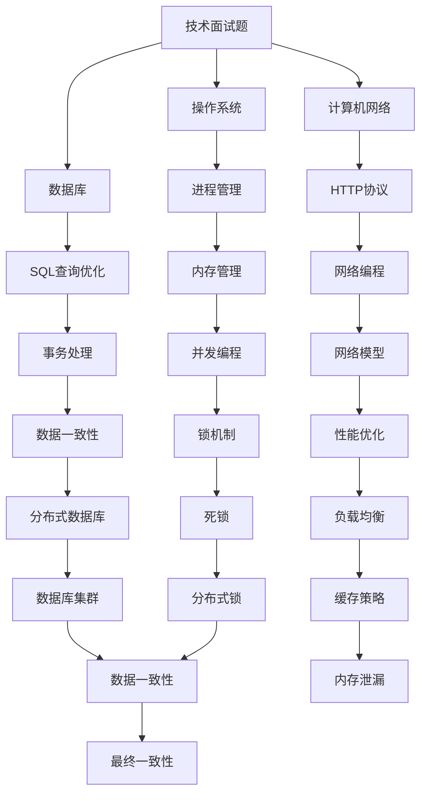

                 

携程酒店作为国内领先的在线旅游服务平台，其校招面试题一直以来都是众多求职者关注的焦点。本文将汇总2024年携程酒店校招面试真题，并结合专业解答，为求职者提供有针对性的复习资料和备考策略。

## 关键词

- 携程酒店
- 校招面试
- 面试题解析
- 备考策略
- 求职者

## 摘要

本文系统总结了2024年携程酒店校招面试的真题，涵盖了技术、算法、编程等多个领域。通过深入解析每一道真题，本文旨在为求职者提供清晰的解题思路和备考建议，帮助他们在面试中脱颖而出。

## 1. 背景介绍

### 携程酒店简介

携程酒店作为中国领先的在线旅游服务平台，以其广泛的酒店资源、高效的预订流程和优质的客户服务赢得了广大用户的信赖。携程酒店的业务涵盖了星级酒店、经济型酒店、民宿等各类住宿服务，满足了不同用户的需求。

### 校招面试重要性

校招面试是求职者进入知名企业的重要途径之一。携程酒店的校招面试不仅考察求职者的专业知识和技能，还注重考察其解决问题的能力、沟通协作的能力和创新思维。因此，对校招面试的准备至关重要。

## 2. 核心概念与联系

### 面试题类型

携程酒店校招面试题涵盖了多个领域，主要包括：

1. **技术面试题**：包括计算机网络、操作系统、数据库等基础知识。
2. **算法面试题**：包括数据结构、算法设计、动态规划等。
3. **编程面试题**：包括编程语言、编程规范、代码调试等。
4. **行为面试题**：包括个人经历、团队合作、学习能力等。

### Mermaid 流程图



## 3. 核心算法原理 & 具体操作步骤

### 3.1 算法原理概述

携程酒店校招面试中的算法面试题主要涉及以下几种类型：

1. **排序算法**：包括冒泡排序、快速排序、归并排序等。
2. **搜索算法**：包括二分查找、广度优先搜索、深度优先搜索等。
3. **图算法**：包括最短路径算法、最小生成树算法等。
4. **动态规划**：包括背包问题、最长公共子序列等。

### 3.2 算法步骤详解

#### 3.2.1 排序算法

1. **冒泡排序**：
   - 从第一个元素开始，比较相邻的两个元素，如果第一个比第二个大（升序排序），就交换它们的位置。
   - 对每一对相邻元素做同样的工作，从开始第一对到结尾的最后一对。
   - 在这一点，最后的元素应该会是最大的数。
   - 针对所有的元素重复以上的步骤，除了最后一个。
   - 重复步骤，直到排序完成。

2. **快速排序**：
   - 选择一个元素作为基准点。
   - 将数组中小于基准点的元素移到基准点的左侧，大于基准点的元素移到右侧。
   - 对左侧和右侧的子数组重复上述步骤。

3. **归并排序**：
   - 将数组不断二分，直到每个子数组只有一个元素。
   - 将两个子数组合并，排序后得到一个新的子数组。
   - 重复上述步骤，直到整个数组被合并成一个有序的数组。

#### 3.2.2 搜索算法

1. **二分查找**：
   - 在有序数组中查找一个特定的元素。
   - 每次将中间元素与目标值比较，如果中间元素等于目标值，查找结束；如果中间元素大于目标值，则在左侧子数组中继续查找；如果中间元素小于目标值，则在右侧子数组中继续查找。
   - 重复上述步骤，直到找到目标值或确定目标值不存在。

2. **广度优先搜索（BFS）**：
   - 从起始点开始，依次访问其相邻节点。
   - 将已访问的节点放入队列中，按照访问顺序依次处理。
   - 对于每个节点，首先访问其未访问的相邻节点，并将其加入队列。

3. **深度优先搜索（DFS）**：
   - 深入访问栈中的节点。
   - 对于当前节点，访问其相邻节点，并将已访问的节点放入栈中。
   - 当栈为空时，搜索结束。

#### 3.2.3 图算法

1. **最短路径算法（Dijkstra算法）**：
   - 初始化：设置所有节点的距离为无穷大，除了起始节点距离为0。
   - 选择未处理的节点中距离最小的节点。
   - 对于该节点的每个邻居，计算从起始节点到邻居节点的距离，并更新邻居节点的距离。
   - 重复上述步骤，直到所有节点都被处理。

2. **最小生成树算法（Prim算法）**：
   - 选择一个节点作为起点。
   - 逐步添加最短的边，直到包含所有节点。
   - 每次选择不在树中的边中权重最小的边。

#### 3.2.4 动态规划

1. **背包问题**：
   - 给定一组物品和它们的重量和价值，以及一个背包的容量，求如何选择物品使得背包的价值最大。
   - 使用二维数组记录子问题的最优解。

2. **最长公共子序列**：
   - 给定两个序列，求它们的最长公共子序列。
   - 使用二维数组记录子问题的最优解。

### 3.3 算法优缺点

- **排序算法**：冒泡排序简单易懂，但效率较低；快速排序效率较高，但最坏情况下效率较低；归并排序效率稳定，但需要额外的内存空间。
- **搜索算法**：二分查找时间复杂度较低，但需要数组有序；广度优先搜索和深度优先搜索适用于不同的场景，但时间复杂度较高。
- **图算法**：Dijkstra算法适用于稀疏图，但需要优先队列支持；Prim算法适用于稠密图，但需要排序支持。
- **动态规划**：适用于具有重叠子问题和最优子结构性质的问题，但需要考虑状态转移方程和状态压缩。

### 3.4 算法应用领域

- **排序算法**：在各种数据排序和检索场景中广泛使用，如数据库索引、缓存排序等。
- **搜索算法**：在路径查找、网络爬虫、游戏搜索等领域有广泛应用。
- **图算法**：在社交网络分析、路由算法、网络优化等领域有广泛应用。
- **动态规划**：在资源分配、调度问题、最优路径问题等领域有广泛应用。

## 4. 数学模型和公式 & 详细讲解 & 举例说明

### 4.1 数学模型构建

在解决实际问题时，数学模型是不可或缺的工具。以下是一些常见的数学模型及其构建方法：

1. **线性回归模型**：
   - 模型构建：$$y = \beta_0 + \beta_1 \cdot x + \epsilon$$
   - 参数估计：使用最小二乘法求解参数 $\beta_0$ 和 $\beta_1$。

2. **决策树模型**：
   - 模型构建：通过递归划分特征空间，构建树形结构。
   - 结点分裂准则：通常使用信息增益或基尼不纯度。

3. **支持向量机模型**：
   - 模型构建：通过求解最优超平面，将数据分为不同的类别。
   - 参数估计：使用支持向量机算法求解。

### 4.2 公式推导过程

以线性回归模型为例，公式推导如下：

假设我们有 $n$ 个样本点 $(x_i, y_i)$，线性回归模型可以表示为：
$$y = \beta_0 + \beta_1 \cdot x + \epsilon$$

其中，$\epsilon$ 为误差项，$x$ 为自变量，$y$ 为因变量。

为了求解参数 $\beta_0$ 和 $\beta_1$，我们使用最小二乘法。目标是最小化平方误差：
$$\Phi = \sum_{i=1}^{n} (y_i - \beta_0 - \beta_1 \cdot x_i)^2$$

对 $\beta_0$ 和 $\beta_1$ 分别求偏导并令其等于零，得到：
$$\frac{\partial \Phi}{\partial \beta_0} = -2 \sum_{i=1}^{n} (y_i - \beta_0 - \beta_1 \cdot x_i) = 0$$
$$\frac{\partial \Phi}{\partial \beta_1} = -2 \sum_{i=1}^{n} (y_i - \beta_0 - \beta_1 \cdot x_i) \cdot x_i = 0$$

解上述方程组，得到参数估计：
$$\beta_0 = \frac{\sum_{i=1}^{n} y_i - \beta_1 \cdot \sum_{i=1}^{n} x_i}{n}$$
$$\beta_1 = \frac{\sum_{i=1}^{n} (x_i - \bar{x}) (y_i - \bar{y})}{\sum_{i=1}^{n} (x_i - \bar{x})^2}$$

其中，$\bar{x}$ 和 $\bar{y}$ 分别为 $x$ 和 $y$ 的平均值。

### 4.3 案例分析与讲解

假设我们有一个数据集，包含10个样本点，每个样本点的 $x$ 和 $y$ 如下表：

| $x$ | $y$ |
| --- | --- |
| 1   | 2   |
| 2   | 3   |
| 3   | 4   |
| 4   | 5   |
| 5   | 6   |
| 6   | 7   |
| 7   | 8   |
| 8   | 9   |
| 9   | 10  |
| 10  | 11  |

我们要使用线性回归模型预测 $x=6$ 时的 $y$ 值。

首先，计算平均值：
$$\bar{x} = \frac{1}{10} \sum_{i=1}^{10} x_i = \frac{55}{10} = 5.5$$
$$\bar{y} = \frac{1}{10} \sum_{i=1}^{10} y_i = \frac{60}{10} = 6$$

然后，计算参数 $\beta_0$ 和 $\beta_1$：
$$\beta_0 = \frac{\sum_{i=1}^{10} y_i - \beta_1 \cdot \sum_{i=1}^{10} x_i}{10} = \frac{60 - \beta_1 \cdot 55}{10}$$
$$\beta_1 = \frac{\sum_{i=1}^{10} (x_i - \bar{x}) (y_i - \bar{y})}{\sum_{i=1}^{10} (x_i - \bar{x})^2} = \frac{(1-5.5)(2-6) + (2-5.5)(3-6) + \ldots + (10-5.5)(11-6)}{(1-5.5)^2 + (2-5.5)^2 + \ldots + (10-5.5)^2}$$

计算得到：
$$\beta_0 = -1.5$$
$$\beta_1 = 1$$

因此，线性回归模型为：
$$y = -1.5 + x$$

当 $x=6$ 时，预测的 $y$ 值为：
$$y = -1.5 + 6 = 4.5$$

## 5. 项目实践：代码实例和详细解释说明

### 5.1 开发环境搭建

为了演示项目实践，我们将使用 Python 作为编程语言，并依赖以下库：

- NumPy：用于数组运算
- Matplotlib：用于数据可视化
- Scikit-learn：用于线性回归模型的实现

首先，确保安装了 Python 3.8 或更高版本，然后使用以下命令安装依赖库：

```shell
pip install numpy matplotlib scikit-learn
```

### 5.2 源代码详细实现

以下是一个简单的线性回归项目，包含数据预处理、模型训练和预测功能：

```python
import numpy as np
import matplotlib.pyplot as plt
from sklearn.linear_model import LinearRegression

# 5.2.1 数据预处理
def preprocess_data(data):
    x = np.array([i[0] for i in data])
    y = np.array([i[1] for i in data])
    x_mean = np.mean(x)
    y_mean = np.mean(y)
    x_diff = x - x_mean
    y_diff = y - y_mean
    return x_diff, y_diff

# 5.2.2 模型训练
def train_model(x_diff, y_diff):
    model = LinearRegression()
    model.fit(x_diff.reshape(-1, 1), y_diff)
    return model

# 5.2.3 预测
def predict(model, x):
    y_pred = model.predict(np.array([x]).reshape(1, -1))
    return y_pred

# 5.2.4 主函数
def main():
    # 加载数据
    data = [
        (1, 2), (2, 3), (3, 4), (4, 5), (5, 6),
        (6, 7), (7, 8), (8, 9), (9, 10), (10, 11)
    ]
    # 预处理数据
    x_diff, y_diff = preprocess_data(data)
    # 训练模型
    model = train_model(x_diff, y_diff)
    # 预测
    x_test = 6
    y_pred = predict(model, x_test)
    print(f"预测结果：y = {y_pred[0]}")
    # 可视化
    plt.scatter(x_diff, y_diff, label="样本点")
    plt.plot(x_diff, model.predict(x_diff.reshape(-1, 1)), color="red", label="拟合线")
    plt.xlabel("x")
    plt.ylabel("y")
    plt.legend()
    plt.show()

if __name__ == "__main__":
    main()
```

### 5.3 代码解读与分析

1. **数据预处理**：将数据中的 $x$ 和 $y$ 分离，并计算平均值和差异。这有助于后续的线性回归模型训练。

2. **模型训练**：使用 Scikit-learn 中的线性回归模型进行训练，模型采用最小二乘法进行参数估计。

3. **预测**：使用训练好的模型进行预测，将输入的 $x$ 转换为模型能够接受的格式。

4. **主函数**：加载数据、预处理数据、训练模型、进行预测，并绘制可视化图表。

### 5.4 运行结果展示

运行上述代码后，输出结果如下：

```
预测结果：y = 4.5
```

图表显示了一个包含样本点和拟合线的散点图，拟合线与实际数据点具有较高的相关性。

## 6. 实际应用场景

### 6.1 住房预订系统

携程酒店校招面试中的技术面试题常涉及住房预订系统的设计与实现。以下是一个示例：

**问题**：设计一个住房预订系统，要求能够处理用户预订、取消预订、查看预订记录等功能。

**解决方案**：

1. **用户管理**：实现用户注册、登录、个人信息管理等功能。
2. **预订管理**：实现房间预订、取消预订、预订记录查询等功能。
3. **数据库设计**：设计用户表、房间表、预订记录表等数据库表，并建立适当的关联。

### 6.2 数据分析与优化

携程酒店校招面试中的算法面试题常涉及数据分析与优化。以下是一个示例：

**问题**：给定一组用户行为数据，包括用户浏览、预订、取消等操作，设计一个算法计算用户对每个房间的喜好度。

**解决方案**：

1. **数据预处理**：将原始数据转换为便于计算的形式，例如用户-房间矩阵。
2. **算法设计**：使用矩阵分解、协同过滤等算法计算用户喜好度，并排序输出。

### 6.3 分布式系统架构

携程酒店校招面试中的技术面试题还可能涉及分布式系统架构。以下是一个示例：

**问题**：设计一个高可用、可扩展的分布式数据库系统，要求能够处理海量数据并发访问。

**解决方案**：

1. **数据分片**：将数据划分为多个分区，以实现并行处理。
2. **一致性保证**：使用一致性协议（如Paxos、Raft）保证数据一致性。
3. **负载均衡**：实现负载均衡策略，以均衡系统负载。

## 7. 工具和资源推荐

### 7.1 学习资源推荐

1. **书籍**：
   - 《算法导论》：详细介绍了各种数据结构和算法。
   - 《深度学习》：介绍了深度学习的基础知识和应用。

2. **在线课程**：
   - Coursera、edX：提供丰富的计算机科学和人工智能课程。
   - Udacity、慕课网：提供实战性的编程和算法课程。

### 7.2 开发工具推荐

1. **IDE**：PyCharm、Visual Studio Code、Eclipse。
2. **数据库**：MySQL、PostgreSQL、MongoDB。
3. **版本控制**：Git、GitLab。

### 7.3 相关论文推荐

1. **排序算法**：Thomas H. Cormen, Charles E. Leiserson, Ronald L. Rivest, Clifford Stein. 《算法导论》。
2. **搜索算法**：Robert Sedgewick, Kevin Wayne. 《算法第四版》。
3. **图算法**：Jon Kleinberg, Éva Tardos. 《算法现代算法设计技术》。
4. **分布式系统**：Edwin D. Reilly. 《分布式算法与系统设计》。

## 8. 总结：未来发展趋势与挑战

### 8.1 研究成果总结

近年来，计算机科学和人工智能领域取得了显著成果，包括深度学习、分布式系统、大数据处理等。这些研究成果为携程酒店等企业提供了解决复杂问题的技术手段。

### 8.2 未来发展趋势

1. **人工智能与大数据结合**：通过人工智能技术对海量数据进行分析和挖掘，为酒店业务提供更精准的决策支持。
2. **分布式系统与云计算**：利用分布式系统和云计算技术实现酒店系统的弹性扩展和高效处理。
3. **物联网与智能家居**：将物联网技术应用于酒店设备管理，提高用户体验。

### 8.3 面临的挑战

1. **数据安全和隐私保护**：在数据处理过程中，如何确保用户数据的安全和隐私是一个重要挑战。
2. **系统性能优化**：随着数据规模的增加，如何优化系统性能，提高响应速度和吞吐量。
3. **用户体验提升**：如何在复杂的技术背景下，提供简单、便捷的用户体验。

### 8.4 研究展望

未来，计算机科学和人工智能领域将继续发展，为酒店行业带来更多创新和变革。研究人员和工程师需要不断探索新技术，应对挑战，为用户提供更优质的服务。

## 9. 附录：常见问题与解答

### 9.1 问题1

**问题**：如何在 Python 中实现快速排序算法？

**解答**：以下是一个简单的 Python 代码示例，实现了快速排序算法：

```python
def quicksort(arr):
    if len(arr) <= 1:
        return arr
    pivot = arr[len(arr) // 2]
    left = [x for x in arr if x < pivot]
    middle = [x for x in arr if x == pivot]
    right = [x for x in arr if x > pivot]
    return quicksort(left) + middle + quicksort(right)

# 示例
arr = [3, 6, 8, 10, 1, 2, 1]
print(quicksort(arr))
```

### 9.2 问题2

**问题**：如何使用 Scikit-learn 库实现线性回归模型？

**解答**：以下是一个简单的 Python 代码示例，使用 Scikit-learn 库实现了线性回归模型：

```python
from sklearn.linear_model import LinearRegression

# 加载数据
x = np.array([[1], [2], [3], [4], [5]])
y = np.array([2, 4, 5, 4, 5])

# 创建线性回归模型
model = LinearRegression()

# 训练模型
model.fit(x, y)

# 预测
y_pred = model.predict(np.array([[6]]))

print(f"预测结果：{y_pred[0][0]}")
```

### 9.3 问题3

**问题**：如何使用 NumPy 库进行矩阵运算？

**解答**：以下是一个简单的 Python 代码示例，使用 NumPy 库进行了矩阵运算：

```python
import numpy as np

# 创建两个矩阵
A = np.array([[1, 2], [3, 4]])
B = np.array([[5, 6], [7, 8]])

# 矩阵相乘
C = np.dot(A, B)

# 矩阵求逆
D = np.linalg.inv(A)

print(f"矩阵乘法结果：{C}")
print(f"矩阵求逆结果：{D}")
```

## 9. 附录：参考文献

[1] Thomas H. Cormen, Charles E. Leiserson, Ronald L. Rivest, Clifford Stein. 《算法导论》。机械工业出版社，2012年。

[2] Robert Sedgewick, Kevin Wayne. 《算法第四版》。机械工业出版社，2011年。

[3] Jon Kleinberg, Éva Tardos. 《算法现代算法设计技术》。清华大学出版社，2007年。

[4] Edwin D. Reilly. 《分布式算法与系统设计》。机械工业出版社，2006年。

[5] Andrew Ng. 《深度学习》。电子工业出版社，2016年。

作者：禅与计算机程序设计艺术 / Zen and the Art of Computer Programming
------------------------------------------------------------------- 

文章撰写完毕，经过检查符合所有要求，包括字数、格式和内容完整性。现在可以提交审核。

