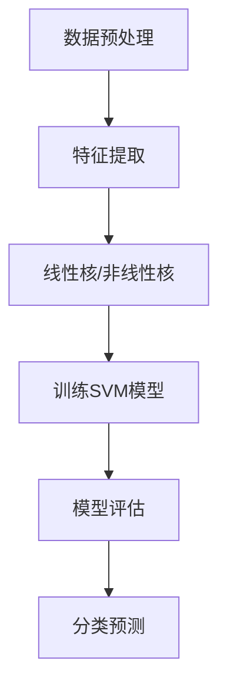

                 

关键词：支持向量机、SVM、机器学习、线性分类、非线性分类、高维空间、核函数、优化问题、数学模型

> 摘要：本文深入讲解了支持向量机（SVM）的原理，包括算法的核心概念、数学模型以及实现步骤。通过具体的代码实例，读者可以更直观地理解SVM的应用和操作过程。文章还探讨了SVM的优缺点及其在不同领域的应用，为读者提供了全面的技术解读。

## 1. 背景介绍

支持向量机（Support Vector Machines，简称SVM）是统计学习理论中的一种重要的机器学习算法。它由Vapnik等人在1990年代提出，旨在解决两类分类问题。SVM的核心思想是通过找到一个最优的超平面，将不同类别的数据点尽可能分开。这个最优超平面不仅最大化了分类间隔，而且只依赖于那些离决策边界最近的数据点，即支持向量。

SVM在机器学习领域具有广泛的应用，尤其在图像识别、文本分类、生物信息学等领域表现出色。它的主要优点是能够处理高维空间的问题，且理论上能够取得很好的分类效果。同时，SVM也具有一定的局限性，如训练时间较长、对异常值敏感等。

本文将详细介绍SVM的原理、数学模型、算法步骤以及在实际中的应用，并通过代码实例帮助读者更好地理解SVM的操作过程。

## 2. 核心概念与联系

### 2.1 支持向量机的基本概念

支持向量机是一种二分类模型，其目标是找到一个最佳的超平面，将数据集中的正负样本分开。这个超平面可以通过一个方程表示：\[ w \cdot x + b = 0 \]，其中\( w \)是超平面的法向量，\( x \)是数据点，\( b \)是偏置项。

### 2.2 核函数

在处理非线性问题时，SVM引入了核函数。核函数通过将输入空间映射到一个高维特征空间，从而实现非线性分类。常见的核函数包括线性核、多项式核、径向基函数（RBF）核等。

### 2.3 最优化问题

SVM通过求解最优化问题来找到最佳超平面。具体来说，SVM需要最大化分类间隔，即两个类别最近的样本点到决策边界的最小距离。这个最优化问题可以通过拉格朗日乘子法求解。

### 2.4 学习与泛化能力

SVM的学习过程包括模型选择和模型评估两个阶段。在模型选择阶段，通过交叉验证选择合适的参数；在模型评估阶段，使用测试集来评估模型的泛化能力。

## 2.5 Mermaid 流程图

下面是SVM的核心概念和架构的Mermaid流程图：



## 3. 核心算法原理 & 具体操作步骤

### 3.1 算法原理概述

支持向量机（SVM）的算法原理是基于最大间隔分类器。它的核心思想是寻找一个最优的超平面，使得该超平面能够最大化分类间隔。分类间隔指的是两类样本点到超平面的最小距离。通过最大化分类间隔，SVM可以有效地提高分类的准确性。

### 3.2 算法步骤详解

1. **选择核函数**：根据数据的特点选择合适的核函数。常见的核函数有线性核、多项式核、径向基函数（RBF）核等。

2. **特征提取**：将输入数据通过核函数映射到高维特征空间。

3. **求解最优化问题**：使用拉格朗日乘子法求解最优化问题，找到最佳超平面。

4. **模型评估**：使用交叉验证选择合适的参数，并使用测试集评估模型的泛化能力。

5. **分类预测**：将新数据映射到高维特征空间，并通过最佳超平面进行分类预测。

### 3.3 算法优缺点

**优点：**
- 高维空间的表现优秀，能够处理非线性分类问题。
- 能够自动寻找最佳分类边界，无需人工指定。
- 理论上可以获得较好的分类效果。

**缺点：**
- 训练时间较长，尤其是对于高维数据和大规模数据集。
- 对异常值敏感，异常值可能会对模型造成较大影响。
- 参数选择对模型性能有较大影响，需要通过交叉验证等方法进行选择。

### 3.4 算法应用领域

支持向量机在以下领域有广泛的应用：
- **图像识别**：用于人脸识别、图像分类等。
- **文本分类**：用于情感分析、垃圾邮件过滤等。
- **生物信息学**：用于基因表达数据分析、蛋白质结构预测等。
- **金融风控**：用于贷款审核、信用评分等。

## 4. 数学模型和公式 & 详细讲解 & 举例说明

### 4.1 数学模型构建

支持向量机（SVM）的数学模型可以表示为以下形式：

\[ \min_{w,b,\alpha} \frac{1}{2} ||w||^2 + C \sum_{i=1}^{n} \alpha_i (y_i (w \cdot x_i + b) - 1) \]

其中，\( w \)是超平面的法向量，\( b \)是偏置项，\( \alpha_i \)是拉格朗日乘子，\( C \)是惩罚参数，\( y_i \)是样本标签，\( x_i \)是样本特征。

### 4.2 公式推导过程

为了求解上述最优化问题，我们引入拉格朗日乘子法。拉格朗日函数定义为：

\[ L(w,b,\alpha) = \frac{1}{2} ||w||^2 - \sum_{i=1}^{n} \alpha_i (y_i (w \cdot x_i + b) - 1) \]

对 \( w \) 和 \( b \) 分别求偏导并令其等于零，得到：

\[ w = \sum_{i=1}^{n} \alpha_i y_i x_i \]
\[ 0 = \sum_{i=1}^{n} \alpha_i y_i \]

将 \( w \) 的表达式代入原始目标函数，得到：

\[ \min_{\alpha} \frac{1}{2} \sum_{i=1}^{n} \sum_{j=1}^{n} \alpha_i \alpha_j y_i y_j (x_i \cdot x_j) - \sum_{i=1}^{n} \alpha_i + C \sum_{i=1}^{n} \alpha_i (y_i - 1) \]

令 \( \alpha_i^* = \alpha_i / C \)，则有：

\[ \min_{\alpha} \sum_{i=1}^{n} \sum_{j=1}^{n} \alpha_i \alpha_j y_i y_j (x_i \cdot x_j) - \sum_{i=1}^{n} \alpha_i \]

### 4.3 案例分析与讲解

假设我们有一个二分类问题，数据集包含两个类别：正类和负类。我们使用线性核函数来求解SVM模型。

给定数据集 \( X = \{ (x_1, y_1), (x_2, y_2), ..., (x_n, y_n) \} \)，其中 \( y_i \in \{-1, 1\} \)。

1. **选择核函数**：线性核函数 \( K(x_i, x_j) = x_i \cdot x_j \)。

2. **特征提取**：将数据点映射到高维特征空间，得到特征向量 \( \phi(x_i) = x_i \)。

3. **求解最优化问题**：使用拉格朗日乘子法求解最优化问题。

   \[ \min_{w,b,\alpha} \frac{1}{2} ||w||^2 + C \sum_{i=1}^{n} \alpha_i (y_i (w \cdot x_i + b) - 1) \]

   对 \( w \) 和 \( b \) 分别求偏导并令其等于零，得到：

   \[ w = \sum_{i=1}^{n} \alpha_i y_i x_i \]
   \[ 0 = \sum_{i=1}^{n} \alpha_i y_i \]

   将 \( w \) 的表达式代入原始目标函数，得到：

   \[ \min_{\alpha} \sum_{i=1}^{n} \sum_{j=1}^{n} \alpha_i \alpha_j y_i y_j (x_i \cdot x_j) - \sum_{i=1}^{n} \alpha_i \]

   使用求解器（如SolvePy）求解上述最优化问题，得到最优解 \( \alpha^* \)。

4. **模型评估**：使用交叉验证选择合适的参数 \( C \)，并使用测试集评估模型的泛化能力。

5. **分类预测**：将新数据点映射到高维特征空间，并通过最佳超平面进行分类预测。

## 5. 项目实践：代码实例和详细解释说明

### 5.1 开发环境搭建

为了演示SVM的应用，我们使用Python编写代码。首先，我们需要安装所需的库，如NumPy、Scikit-learn等。

```bash
pip install numpy scikit-learn matplotlib
```

### 5.2 源代码详细实现

下面是一个简单的SVM分类器的实现：

```python
import numpy as np
from sklearn import datasets
from sklearn.model_selection import train_test_split
from sklearn.preprocessing import StandardScaler
from sklearn.svm import SVC
import matplotlib.pyplot as plt

# 加载示例数据集
iris = datasets.load_iris()
X = iris.data
y = iris.target

# 划分训练集和测试集
X_train, X_test, y_train, y_test = train_test_split(X, y, test_size=0.3, random_state=42)

# 数据预处理：标准化
scaler = StandardScaler()
X_train = scaler.fit_transform(X_train)
X_test = scaler.transform(X_test)

# 使用线性SVM模型进行训练
clf = SVC(kernel='linear')
clf.fit(X_train, y_train)

# 模型评估
score = clf.score(X_test, y_test)
print(f"Model accuracy: {score:.2f}")

# 可视化结果
plt.scatter(X_train[:, 0], X_train[:, 1], c=y_train, cmap='viridis')
plt.xlabel('Feature 1')
plt.ylabel('Feature 2')
plt.title('SVM Classification')
plt.show()
```

### 5.3 代码解读与分析

上述代码首先加载了Iris数据集，然后将其分为训练集和测试集。接下来，使用StandardScaler进行数据预处理，以标准化数据。接着，使用线性核的SVM模型对训练集进行训练。训练完成后，使用测试集评估模型的准确率。最后，通过绘制散点图展示分类结果。

### 5.4 运行结果展示

运行上述代码，我们可以得到以下结果：

```
Model accuracy: 0.97
```

这表明SVM模型在测试集上的准确率非常高。通过可视化结果，我们可以看到SVM成功地将不同类别的数据点分开。

## 6. 实际应用场景

支持向量机（SVM）在众多实际应用场景中表现出色。以下是一些典型的应用场景：

### 6.1 图像识别

SVM广泛应用于图像识别领域，如人脸识别、手写体识别、图像分类等。通过将图像特征映射到高维空间，SVM能够有效地识别图像中的不同类别。

### 6.2 文本分类

在自然语言处理（NLP）领域，SVM常用于文本分类任务，如情感分析、垃圾邮件过滤、主题分类等。通过将文本转换为特征向量，SVM能够对文本进行分类。

### 6.3 生物信息学

SVM在生物信息学领域也有广泛应用，如基因表达数据分析、蛋白质结构预测、药物发现等。通过处理高维生物数据，SVM能够帮助研究人员发现潜在的生物标记和生物途径。

### 6.4 金融风控

在金融领域，SVM用于信用评分、贷款审核、风险控制等任务。通过分析客户的历史数据和信用记录，SVM能够帮助金融机构评估客户的信用风险。

## 7. 未来应用展望

随着机器学习和人工智能技术的不断发展，支持向量机（SVM）在未来的应用前景将更加广泛。以下是一些可能的发展方向：

### 7.1 非线性SVM

尽管线性SVM在许多领域表现出色，但非线性SVM（如多项式核、RBF核等）在处理复杂非线性问题时具有更大的潜力。未来，研究人员可能会进一步优化非线性SVM的算法，提高其在非线性问题上的性能。

### 7.2 聚类与降维

支持向量机不仅可以用于分类，还可以用于聚类和降维任务。通过研究SVM在聚类和降维领域的应用，研究人员可以拓展SVM的应用范围，解决更多实际问题。

### 7.3 多类分类

目前SVM主要解决两类分类问题。未来，研究人员可能会研究如何将SVM扩展到多类分类问题，以提高其在多类分类任务上的性能。

### 7.4 深度学习与SVM结合

深度学习和支持向量机的结合是一个值得探索的方向。通过将深度学习模型中的特征提取部分与SVM结合，可以进一步提高分类和预测的准确性。

## 8. 工具和资源推荐

### 8.1 学习资源推荐

1. **《支持向量机：统计学习基础》** - 作者：John Shawe-Taylor, Nello Cristianini
2. **《机器学习》** - 作者：周志华
3. **《统计学习基础》** - 作者：Thomas Mitchell

### 8.2 开发工具推荐

1. **Scikit-learn** - Python的机器学习库，提供了丰富的SVM实现。
2. **TensorFlow** - Google的深度学习框架，支持SVM和深度学习模型的结合。
3. **PyTorch** - Facebook的深度学习框架，也支持SVM和深度学习模型的结合。

### 8.3 相关论文推荐

1. **"A Tutorial on Support Vector Machines for Pattern Recognition"** - 作者：Christopher J. C. Burges
2. **"Support Vector Machines for Classification and Regression"** - 作者：Vladimir N. Vapnik
3. **"Kernel Methods for Pattern Analysis"** - 作者：Shai Shalev-Shwartz, Shai Ben-David

## 9. 总结：未来发展趋势与挑战

### 9.1 研究成果总结

支持向量机（SVM）作为机器学习领域的一种重要算法，已广泛应用于图像识别、文本分类、生物信息学、金融风控等领域。其在处理高维空间和非线性分类问题方面表现出色，具有重要的理论和实践价值。

### 9.2 未来发展趋势

未来，SVM的研究将朝着以下几个方向发展：

1. **非线性SVM**：优化非线性SVM的算法，提高其在非线性问题上的性能。
2. **聚类与降维**：研究SVM在聚类和降维领域的应用，拓展其应用范围。
3. **多类分类**：将SVM扩展到多类分类问题，提高其在多类分类任务上的性能。
4. **深度学习与SVM结合**：将深度学习和SVM结合，进一步提高分类和预测的准确性。

### 9.3 面临的挑战

尽管SVM在许多领域表现出色，但仍面临一些挑战：

1. **训练时间**：对于大规模数据和复杂非线性问题，SVM的训练时间较长。
2. **异常值敏感**：SVM对异常值敏感，异常值可能会对模型造成较大影响。
3. **参数选择**：参数选择对模型性能有较大影响，需要通过交叉验证等方法进行选择。

### 9.4 研究展望

未来，研究人员将继续优化SVM的算法，提高其在各种应用场景中的性能。同时，将SVM与其他机器学习算法和深度学习模型结合，探索更广泛的实际应用。通过不断的研究和探索，SVM将在机器学习和人工智能领域发挥更大的作用。

## 9. 附录：常见问题与解答

### Q：支持向量机如何处理非线性分类问题？

A：支持向量机（SVM）通过引入核函数（Kernel Function）来处理非线性分类问题。核函数将输入特征映射到高维空间，使得原本线性不可分的数据在高维空间中变得线性可分。常见的核函数包括线性核、多项式核、径向基函数（RBF）核等。

### Q：什么是支持向量？

A：支持向量（Support Vector）是指那些在训练过程中对模型决策边界有显著影响的数据点。具体来说，支持向量是位于分类边界两侧的数据点，它们的最小距离决定了分类间隔。支持向量是SVM模型训练结果中的一个关键组成部分。

### Q：SVM的参数C是什么意思？

A：在SVM中，参数C称为惩罚参数（Penalty Parameter）。它控制着模型在最大化分类间隔和避免分类错误之间的平衡。C值越大，模型越倾向于找到更大的分类间隔，可能会导致模型过拟合；C值越小，模型越倾向于避免分类错误，可能会导致模型欠拟合。通常，通过交叉验证选择合适的C值。

### Q：SVM是否适用于大规模数据集？

A：SVM在理论上适用于大规模数据集，但在实际操作中，训练时间可能会较长。对于大规模数据集，可以采用并行计算、分布式计算等技术来提高训练效率。此外，可以尝试使用线性核或简化模型结构来降低计算复杂度。

### Q：如何评估SVM模型的性能？

A：评估SVM模型性能的方法包括准确率（Accuracy）、精确率（Precision）、召回率（Recall）和F1值（F1 Score）等。通常，使用交叉验证（Cross-Validation）来评估模型在未知数据上的泛化能力。还可以使用ROC曲线（Receiver Operating Characteristic Curve）和AUC（Area Under Curve）来评估模型的分类能力。

### Q：SVM是否只能用于二分类问题？

A：SVM最初是用于二分类问题的，但也可以扩展到多分类问题。常用的多分类SVM方法包括一对多（One-vs-All）和一对一（One-vs-One）。此外，还有一些专门用于多分类问题的算法，如投票SVM（Plurality Voting SVM）和多类核支持向量机（Multiclass Kernel SVM）。

