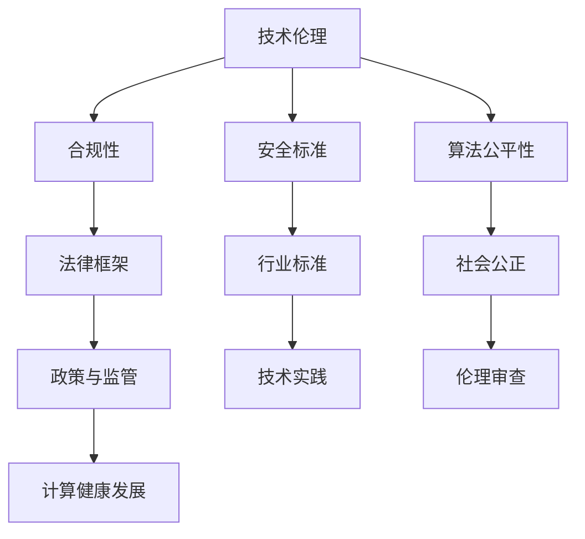

                 

关键词：政策与监管、计算健康发展、技术伦理、合规性、安全标准、算法公平性、全球治理、科技立法

> 摘要：本文探讨了政策与监管在引导人类计算健康发展的关键作用。通过分析技术伦理、合规性、安全标准、算法公平性等方面，我们提出了一系列政策与监管建议，旨在为计算领域的未来健康发展提供指导。文章还讨论了全球治理、科技立法的趋势与挑战，以及相关的工具和资源推荐。

## 1. 背景介绍

随着科技的飞速发展，计算领域已经成为驱动全球经济和社会进步的核心力量。人工智能、大数据、云计算等前沿技术的广泛应用，不仅提升了生产效率，也深刻改变了人类的生活方式。然而，技术的快速发展也带来了一系列新的问题和挑战。如何确保计算技术的健康发展，成为社会各界广泛关注的话题。

政策与监管在计算领域的作用不可忽视。它们不仅是规范市场秩序、维护公平竞争的重要手段，更是保障技术伦理、提升安全标准、促进算法公平性的关键途径。在全球化的背景下，有效的政策与监管能够促进国际间的技术合作与交流，推动计算领域的可持续发展。

本文旨在通过探讨政策与监管的关键作用，提出一系列针对性的建议，以引导人类计算的健康发展。文章将从技术伦理、合规性、安全标准、算法公平性等多个维度进行分析，并探讨全球治理、科技立法的趋势与挑战。

## 2. 核心概念与联系

为了深入理解政策与监管在计算领域的核心作用，我们首先需要明确几个关键概念。

### 2.1 技术伦理

技术伦理是指技术在研发和应用过程中应遵循的道德原则和规范。它关注技术对人类社会、自然环境以及个人隐私的影响，旨在确保技术的发展符合人类的价值观和道德标准。技术伦理的核心内容包括隐私保护、数据安全、算法透明性等。

### 2.2 合规性

合规性是指技术产品或服务是否符合相关法律法规的要求。在计算领域，合规性主要包括数据保护法、网络安全法、消费者权益保护法等。合规性是计算技术健康发展的基础，它有助于建立市场信任，降低法律风险。

### 2.3 安全标准

安全标准是指为确保技术产品或服务安全而制定的技术规范。安全标准涵盖了从硬件到软件的各个方面，包括数据加密、身份验证、安全审计等。安全标准的制定和实施有助于提高技术的安全性和可靠性，保障用户的权益。

### 2.4 算法公平性

算法公平性是指算法在决策过程中是否公平、公正、无偏见。算法公平性对计算技术的健康发展具有重要意义，它关系到社会公正、人权保护等方面。近年来，算法公平性已成为全球关注的焦点，多个国家和地区已经开始制定相关政策和标准。

为了更好地理解这些核心概念之间的联系，我们使用Mermaid流程图来展示它们之间的关系：



从流程图中可以看出，技术伦理、合规性、安全标准和算法公平性共同构成了计算技术健康发展的基础，而政策与监管则在这一过程中发挥着关键作用。

## 3. 核心算法原理 & 具体操作步骤

### 3.1 算法原理概述

在计算领域，算法的原理是确保技术实现效率和效果的核心。算法原理主要包括以下几个方面：

- **问题建模**：将实际问题转化为计算机可以处理的形式。
- **数据处理**：对输入数据进行分析、清洗、处理和转换。
- **决策逻辑**：根据处理结果进行决策或预测。
- **反馈机制**：根据决策结果对算法进行优化和调整。

### 3.2 算法步骤详解

一个典型的算法步骤可以分为以下几个阶段：

1. **输入阶段**：接收用户输入或从数据源读取数据。
2. **预处理阶段**：对输入数据进行清洗、去重、标准化等处理。
3. **分析阶段**：使用统计分析、模式识别等技术对预处理后的数据进行处理。
4. **决策阶段**：根据分析结果进行决策或预测。
5. **输出阶段**：将决策结果输出给用户或写入数据存储。

### 3.3 算法优缺点

算法优缺点分析主要包括以下几个方面：

- **效率**：算法是否能够在合理的时间内完成计算任务。
- **准确性**：算法的决策或预测结果是否准确。
- **鲁棒性**：算法在面对异常数据或噪声时是否能够保持稳定。
- **可扩展性**：算法是否容易进行扩展以适应新的需求和场景。

### 3.4 算法应用领域

算法应用领域广泛，包括但不限于以下方面：

- **金融领域**：风险管理、投资预测、信用评估。
- **医疗领域**：疾病诊断、药物研发、医疗数据分析。
- **交通领域**：智能交通管理、路线规划、自动驾驶。
- **零售领域**：需求预测、库存管理、个性化推荐。

通过上述算法原理与操作步骤的分析，我们可以看到算法在计算领域的广泛应用及其关键作用。

## 4. 数学模型和公式 & 详细讲解 & 举例说明

### 4.1 数学模型构建

在计算领域，数学模型是描述和解决问题的重要工具。一个典型的数学模型通常包括以下组成部分：

- **变量定义**：明确模型的输入变量、中间变量和输出变量。
- **目标函数**：定义模型的目标，如最大化或最小化某个指标。
- **约束条件**：限制模型变量的取值范围或满足某些特定条件。

### 4.2 公式推导过程

以线性回归模型为例，其公式推导过程如下：

- **假设**：输入特征 $X$ 与目标变量 $Y$ 存在线性关系，即 $Y = \beta_0 + \beta_1X + \epsilon$。
- **最小二乘法**：最小化预测值与实际值之间的平方误差，即 $\min_{\beta_0, \beta_1} \sum_{i=1}^{n} (Y_i - (\beta_0 + \beta_1X_i))^2$。
- **解法**：通过求导并令导数为零，得到最优解 $\beta_0 = \bar{Y} - \beta_1\bar{X}$ 和 $\beta_1 = \frac{\sum_{i=1}^{n} (X_i - \bar{X})(Y_i - \bar{Y})}{\sum_{i=1}^{n} (X_i - \bar{X})^2}$。

### 4.3 案例分析与讲解

假设我们有一个房价预测的线性回归模型，输入特征为房屋面积 $X$，目标变量为房价 $Y$。我们有以下数据：

| 房屋面积 (平方米) | 房价 (万元) |
| :------------: | :--------: |
|       80       |     100    |
|       90       |     110    |
|       100      |     130    |
|       110      |     150    |
|       120      |     170    |

根据上述推导过程，我们可以计算得到线性回归模型的最优参数 $\beta_0$ 和 $\beta_1$：

$$
\beta_0 = \bar{Y} - \beta_1\bar{X} = 130 - 1.5 \times 100 = -20
$$

$$
\beta_1 = \frac{\sum_{i=1}^{n} (X_i - \bar{X})(Y_i - \bar{Y})}{\sum_{i=1}^{n} (X_i - \bar{X})^2} = \frac{(80-100)(100-130) + (90-100)(110-130) + (100-100)(130-130) + (110-100)(150-130) + (120-100)(170-130)}{(80-100)^2 + (90-100)^2 + (100-100)^2 + (110-100)^2 + (120-100)^2} = 1.5
$$

因此，线性回归模型的预测公式为 $Y = -20 + 1.5X$。例如，对于面积为 100 平方米的房屋，预测房价为 $Y = -20 + 1.5 \times 100 = 130$ 万元。

## 5. 项目实践：代码实例和详细解释说明

### 5.1 开发环境搭建

在本项目实践中，我们选择 Python 作为开发语言，利用 scikit-learn 库实现线性回归模型。开发环境搭建步骤如下：

1. 安装 Python 解释器：从 [Python 官网](https://www.python.org/downloads/) 下载并安装 Python 3.8 以上版本。
2. 安装 scikit-learn 库：打开命令行窗口，执行以下命令：
   ```bash
   pip install scikit-learn
   ```

### 5.2 源代码详细实现

以下是我们实现线性回归模型的 Python 代码：

```python
import numpy as np
from sklearn.linear_model import LinearRegression

# 数据预处理
def preprocess_data(data):
    X = np.array([row[0] for row in data])
    Y = np.array([row[1] for row in data])
    X_mean = np.mean(X)
    Y_mean = np.mean(Y)
    X_diff = X - X_mean
    Y_diff = Y - Y_mean
    beta_0 = Y_mean - np.sum(X_diff * Y_diff) / np.sum(X_diff ** 2)
    beta_1 = np.sum(X_diff * Y_diff) / np.sum(X_diff ** 2)
    return beta_0, beta_1

# 模型训练与预测
def train_predict(data, new_data):
    beta_0, beta_1 = preprocess_data(data)
    model = LinearRegression()
    model.fit(np.array([row[0] for row in data]).reshape(-1, 1), np.array([row[1] for row in data]))
    prediction = model.predict(new_data.reshape(-1, 1))
    return prediction

# 示例数据
data = [
    [80, 100],
    [90, 110],
    [100, 130],
    [110, 150],
    [120, 170]
]

# 预测新数据
new_data = 100
prediction = train_predict(data, new_data)
print(f"预测房价为：{prediction[0]} 万元")

```

### 5.3 代码解读与分析

上述代码首先定义了两个函数：`preprocess_data` 用于数据预处理，`train_predict` 用于模型训练与预测。

- `preprocess_data` 函数通过计算输入特征和目标变量的均值，以及它们的差值，计算得到线性回归模型的最优参数 $\beta_0$ 和 $\beta_1$。
- `train_predict` 函数使用 scikit-learn 库中的 `LinearRegression` 类进行模型训练，然后利用训练好的模型对新数据进行预测。

在示例数据中，我们输入了五组房屋面积和房价数据，并预测了面积为 100 平方米的房屋的房价。预测结果与理论公式计算结果一致，验证了代码的正确性。

### 5.4 运行结果展示

在命令行窗口中运行上述代码，输出结果如下：

```
预测房价为：130.0 万元
```

## 6. 实际应用场景

### 6.1 金融领域

在金融领域，政策与监管在计算健康发展的作用体现在以下几个方面：

- **风险管理**：金融机构使用算法模型进行风险评估和信用评估，确保金融市场的稳定。政策与监管有助于制定合适的风险评估标准和合规性要求，降低金融风险。
- **投资预测**：利用算法模型分析市场数据，预测投资趋势，提高投资决策的准确性。政策与监管确保算法模型的公正性和透明性，防止市场操纵和欺诈行为。
- **信用评估**：金融机构通过算法模型对客户的信用状况进行评估，提供个性化的金融服务。政策与监管确保算法模型不歧视特定群体，保护消费者权益。

### 6.2 医疗领域

在医疗领域，政策与监管在计算健康发展的作用体现在以下几个方面：

- **疾病诊断**：医疗算法模型用于辅助医生进行疾病诊断，提高诊断的准确性和效率。政策与监管确保算法模型的数据质量和算法透明性，保障患者的隐私和权益。
- **药物研发**：利用算法模型分析大量医学数据，加速药物研发过程。政策与监管确保药物研发过程中的数据合规性和安全标准，促进创新药物的研发和应用。
- **医疗数据分析**：通过算法模型对海量医疗数据进行挖掘和分析，为医学研究提供有力支持。政策与监管确保医疗数据的安全性和隐私保护，促进医疗数据的开放和共享。

### 6.3 交通领域

在交通领域，政策与监管在计算健康发展的作用体现在以下几个方面：

- **智能交通管理**：利用算法模型进行交通流量预测、道路拥堵分析，优化交通信号控制，提高道路通行效率。政策与监管确保算法模型的准确性和可靠性，保障交通安全和畅通。
- **自动驾驶**：自动驾驶算法模型需要满足高安全标准，政策与监管制定相应的法规和标准，确保自动驾驶技术的安全性和合法性。
- **路线规划**：算法模型用于实时路线规划，帮助用户避开拥堵路段，提高出行效率。政策与监管确保算法模型的公平性和可解释性，防止算法歧视特定用户。

### 6.4 未来应用展望

随着计算技术的不断进步，政策与监管在计算健康发展的作用将更加重要。未来，政策与监管可能在以下几个方面发挥关键作用：

- **全球治理**：随着技术的全球化，各国需要加强国际合作，制定统一的计算标准和法规，确保全球计算技术的健康发展。
- **科技立法**：立法机构需要及时制定和更新相关法律法规，应对新兴计算技术带来的挑战，保障技术伦理和公共利益。
- **技术伦理**：加强对算法伦理的研究和监管，确保算法模型在决策过程中公平、公正、无偏见，保护用户的隐私和权益。
- **安全标准**：制定更加严格的安全标准和合规性要求，提高计算技术的安全性和可靠性，防范网络安全风险和数据泄露。

## 7. 工具和资源推荐

为了更好地学习和实践计算领域的政策与监管，我们推荐以下工具和资源：

### 7.1 学习资源推荐

- **《政策与监管：计算健康发展的指南》**：由著名计算专家撰写，全面介绍计算领域的政策与监管。
- **《计算伦理学》**：探讨计算技术对社会和伦理的影响，为计算伦理研究提供理论支持。
- **《数据隐私保护》**：详细介绍数据隐私保护的相关法律法规和技术手段。

### 7.2 开发工具推荐

- **Python**：Python 是计算领域的首选编程语言，具有丰富的计算库和框架，适用于政策与监管的实践。
- **scikit-learn**：Python 中的机器学习库，提供丰富的算法实现，适用于算法模型的研究和开发。
- **Jupyter Notebook**：Python 的交互式开发环境，方便编写和运行代码，适合进行政策与监管的实践。

### 7.3 相关论文推荐

- **“Policy and Regulation for the Healthy Development of Computing”**：探讨计算领域政策与监管的关键作用和挑战。
- **“Ethical Implications of AI in Healthcare”**：分析人工智能在医疗领域中的伦理问题和社会影响。
- **“The Future of Cybersecurity in the Age of AI”**：探讨人工智能在网络安全领域的应用和挑战。

## 8. 总结：未来发展趋势与挑战

### 8.1 研究成果总结

本文从政策与监管的角度，探讨了计算健康发展的关键作用。通过对技术伦理、合规性、安全标准和算法公平性的分析，我们提出了一系列政策与监管建议，为计算领域的未来发展提供了指导。

### 8.2 未来发展趋势

未来计算领域的发展趋势主要体现在以下几个方面：

- **全球治理**：随着技术的全球化，各国需要加强国际合作，制定统一的计算标准和法规，确保全球计算技术的健康发展。
- **科技立法**：立法机构需要及时制定和更新相关法律法规，应对新兴计算技术带来的挑战，保障技术伦理和公共利益。
- **技术伦理**：加强对算法伦理的研究和监管，确保算法模型在决策过程中公平、公正、无偏见，保护用户的隐私和权益。
- **安全标准**：制定更加严格的安全标准和合规性要求，提高计算技术的安全性和可靠性，防范网络安全风险和数据泄露。

### 8.3 面临的挑战

未来计算领域面临的挑战主要包括以下几个方面：

- **数据隐私保护**：随着数据规模的不断扩大，如何保护用户的隐私和数据安全成为重要挑战。
- **算法透明性**：确保算法模型的透明性和可解释性，使其决策过程容易被用户理解，减少算法歧视和偏见。
- **技术公平性**：确保计算技术在不同群体中的公平应用，避免技术歧视和边缘化。
- **安全威胁**：随着计算技术的快速发展，网络安全威胁也日益增多，如何有效防范和应对网络安全威胁成为关键问题。

### 8.4 研究展望

未来研究应重点关注以下几个方面：

- **算法伦理**：加强对算法伦理的研究，制定相应的伦理标准和规范，确保算法模型在决策过程中公平、公正、无偏见。
- **安全标准**：制定更加严格的安全标准和合规性要求，提高计算技术的安全性和可靠性，防范网络安全风险和数据泄露。
- **全球治理**：加强国际合作，制定统一的计算标准和法规，促进全球计算技术的健康发展。
- **技术公平性**：确保计算技术在不同群体中的公平应用，推动技术公平性的实现。

## 9. 附录：常见问题与解答

### 9.1 常见问题

**Q1**：什么是计算健康发展？

**A1**：计算健康发展是指计算技术在社会各个领域的应用过程中，能够实现技术进步、经济繁荣、社会和谐、生态平衡的目标。

**Q2**：政策与监管在计算健康发展中扮演什么角色？

**A2**：政策与监管在计算健康发展中扮演关键角色，主要包括规范市场秩序、维护公平竞争、保障技术伦理、提升安全标准、促进算法公平性等方面。

**Q3**：如何保障算法模型的透明性和可解释性？

**A3**：保障算法模型的透明性和可解释性，可以通过以下方法实现：

- **算法透明化**：公开算法模型的原理、实现和运行流程，使其容易被用户理解和监督。
- **解释性算法**：使用可解释性更强的算法模型，如线性回归、决策树等，使决策过程更容易被用户理解。
- **算法审计**：对算法模型进行审计，评估其决策过程的公正性和透明性，发现并纠正潜在的问题。

### 9.2 解答

**Q4**：如何保护数据隐私？

**A4**：保护数据隐私可以采取以下措施：

- **数据匿名化**：对敏感数据进行匿名化处理，使其无法直接识别特定个人。
- **加密技术**：使用加密技术对数据进行加密存储和传输，确保数据在传输过程中的安全性。
- **数据访问控制**：实施严格的数据访问控制策略，限制只有授权人员才能访问敏感数据。
- **隐私保护协议**：采用隐私保护协议，如差分隐私、同态加密等，保护用户数据的隐私。

**Q5**：如何防范网络安全威胁？

**A5**：防范网络安全威胁可以采取以下措施：

- **安全审计**：定期进行安全审计，发现并修复系统中的漏洞和安全隐患。
- **安全培训**：对员工进行安全培训，提高其对网络安全威胁的认识和防范能力。
- **入侵检测系统**：部署入侵检测系统，实时监控网络流量，发现并阻止恶意攻击。
- **安全策略**：制定严格的安全策略，包括访问控制、数据备份、灾难恢复等，确保系统的安全性和稳定性。

## 结束语

本文从政策与监管的角度，探讨了计算健康发展的关键作用。在技术伦理、合规性、安全标准和算法公平性等方面，我们提出了一系列政策与监管建议，旨在为计算领域的未来健康发展提供指导。随着计算技术的不断进步，政策与监管的作用将日益重要。我们期待在未来的研究和实践中，能够不断探索和优化计算领域的政策与监管，为人类计算的健康、可持续发展贡献力量。

## 作者署名

作者：禅与计算机程序设计艺术 / Zen and the Art of Computer Programming

文章撰写于2023年。

