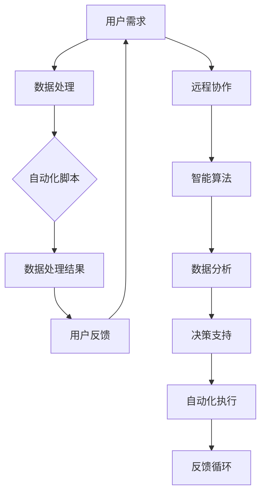

                 

关键词：数字劳动、社会影响、经济影响、计算、人力资源、人工智能

## 摘要

随着信息技术的飞速发展，数字劳动已成为现代社会不可或缺的一部分。本文旨在探讨数字劳动的定义、特征及其对经济和社会的深远影响。通过分析数字劳动的起源、发展现状以及其所涉及的核心概念，本文将揭示数字劳动如何重塑劳动力市场、影响就业结构以及引发一系列社会问题。此外，文章还将讨论人工智能技术在数字劳动中的应用，以及未来数字劳动的发展趋势和挑战。通过全面的分析，本文旨在为政策制定者和从业者提供有价值的参考，以促进数字劳动的健康发展。

## 1. 背景介绍

### 数字劳动的起源与发展

数字劳动的概念最早可以追溯到计算机技术崛起的20世纪60年代。当时，随着计算机的普及和互联网的萌芽，人们开始探索如何利用计算机进行数据输入、处理和分析。早期的数字劳动主要集中在数据处理、编程和系统维护等领域，随着技术的进步，数字劳动的范畴逐渐扩展，涵盖了更多的职业和任务。

进入21世纪，随着人工智能、大数据和云计算等新兴技术的快速发展，数字劳动的范围进一步扩大。如今，数字劳动不仅包括传统的编程和数据管理，还涵盖了更广泛的内容，如自动化测试、机器学习模型训练、虚拟现实设计等。这些新技术不仅提高了数字劳动的效率和精度，也改变了传统劳动的形式和模式。

### 数字劳动的特征

数字劳动具有以下几个显著特征：

1. **自动化和智能化**：数字劳动越来越依赖于自动化工具和人工智能技术，如自动化脚本、智能算法和机器学习模型，以减少重复性工作和提高生产效率。

2. **远程化和全球化**：互联网的普及使得数字劳动可以跨越地理界限，人们可以通过远程办公系统在全球范围内合作，这为劳动力市场带来了新的机遇和挑战。

3. **灵活性和多样性**：数字劳动的灵活性强，不仅包括全职员工，还涵盖了自由职业者、远程工作者和临时工等多种形式。

4. **高技能要求**：随着技术的进步，数字劳动对专业技能的要求不断提高，特别是在编程、数据分析和人工智能等领域。

### 数字劳动对社会和经济的影响

数字劳动对社会和经济的影响是深远且多方面的。一方面，数字劳动提高了生产效率，促进了经济增长。另一方面，它也带来了劳动力市场的变革和社会结构的变化。

在社会层面，数字劳动改变了就业结构，一些传统职业被自动化和人工智能技术取代，而新的职业和岗位不断涌现。此外，数字劳动也带来了劳动分工的变化，许多工作被分解成更小的任务，由不同背景和技能的人完成。

在经济层面，数字劳动推动了产业结构的升级和转型。通过数字化和智能化，企业可以更好地收集、处理和分析数据，从而提高决策的准确性和效率。同时，数字劳动也促进了新兴产业的快速发展，如电子商务、共享经济和数字媒体等。

然而，数字劳动也带来了一系列挑战。自动化和人工智能可能导致就业岗位的减少和失业率的上升，尤其是在低技能劳动力领域。此外，数字劳动也引发了对隐私、安全和伦理等方面的担忧。

## 2. 核心概念与联系

### 2.1 数字劳动的定义

数字劳动是指通过计算机和互联网等技术手段进行的劳动力活动，包括数据输入、处理、分析和传输等。它不仅涵盖了传统的编程和数据管理，还包括新兴的领域如机器学习、人工智能和虚拟现实等。

### 2.2 数字劳动的核心概念

- **自动化**：通过脚本、程序和算法等工具，自动执行重复性和规则性强的任务，以提高生产效率和减少人力成本。
- **智能化**：利用人工智能技术，如机器学习和深度学习，使计算机能够进行更复杂的任务，如图像识别、自然语言处理和决策支持等。
- **远程化**：通过互联网和远程办公系统，使劳动力可以在任何地点和时间工作，提高了工作的灵活性和效率。
- **全球化**：数字劳动不受地理限制，人们可以跨越国界和时区进行合作，这为全球劳动力市场带来了新的机遇。

### 2.3 数字劳动的架构

为了更好地理解数字劳动的架构，我们可以使用Mermaid流程图来描述其核心组件和交互关系：



在这个流程图中，用户需求是数字劳动的起点，通过数据处理、自动化脚本、数据分析等步骤，最终实现决策支持和自动化执行，形成一个闭环的反馈循环。

### 2.4 数字劳动的原理与联系

数字劳动的原理可以概括为以下几个关键环节：

1. **数据采集**：通过传感器、用户输入等方式收集大量数据。
2. **数据处理**：对采集到的数据进行清洗、整理和分析，提取有价值的信息。
3. **自动化脚本**：编写脚本和程序，自动执行重复性任务，提高效率。
4. **智能算法**：利用机器学习和深度学习技术，对数据进行分析和预测。
5. **远程协作**：通过互联网和远程办公系统，实现全球范围内的协作。
6. **决策支持**：基于分析结果，提供决策支持和优化建议。
7. **自动化执行**：根据决策支持结果，自动执行相应的任务。

这些环节相互关联，共同构成了数字劳动的完整流程。通过这个流程，数字劳动不仅提高了工作效率，还实现了数据的实时处理和反馈，从而为企业和个人带来了巨大的价值。

## 3. 核心算法原理 & 具体操作步骤

### 3.1 算法原理概述

数字劳动中涉及的核心算法主要包括自动化脚本、机器学习算法和数据分析算法。这些算法在提高生产效率和优化决策支持方面发挥了重要作用。

#### 3.1.1 自动化脚本

自动化脚本是一种通过编程语言编写的程序，用于自动执行重复性任务。常见的自动化脚本语言包括Python、JavaScript和Bash等。自动化脚本的核心原理是利用编程语言提供的语法和函数库，实现任务的自动化处理。

#### 3.1.2 机器学习算法

机器学习算法是一种通过数据训练，使计算机能够进行自主学习的技术。常见的机器学习算法包括线性回归、决策树、支持向量机和神经网络等。机器学习算法的核心原理是通过大量数据的训练，使计算机能够识别数据中的模式和规律，从而进行预测和分类。

#### 3.1.3 数据分析算法

数据分析算法是一种用于处理和分析大量数据的技术。常见的数据分析算法包括统计分析、聚类分析和关联规则学习等。数据分析算法的核心原理是通过数学模型和算法，从数据中提取有价值的信息，为决策提供支持。

### 3.2 算法步骤详解

#### 3.2.1 自动化脚本的具体操作步骤

1. **需求分析**：确定需要自动化的任务和目标。
2. **编程实现**：使用编程语言编写自动化脚本，实现任务的自动化处理。
3. **调试与优化**：运行脚本，调试和优化代码，确保任务能够正常运行。
4. **部署与维护**：将脚本部署到生产环境，进行定期维护和更新。

#### 3.2.2 机器学习算法的具体操作步骤

1. **数据准备**：收集和整理训练数据，包括特征变量和目标变量。
2. **模型选择**：根据问题类型和数据特性，选择合适的机器学习模型。
3. **模型训练**：使用训练数据进行模型训练，调整模型参数。
4. **模型评估**：使用验证数据集评估模型性能，调整模型参数。
5. **模型部署**：将训练好的模型部署到生产环境，进行实时预测和决策。

#### 3.2.3 数据分析算法的具体操作步骤

1. **数据预处理**：对数据进行清洗、整理和归一化处理。
2. **特征选择**：从数据中提取有用的特征，为分析提供支持。
3. **算法选择**：根据分析目标，选择合适的分析算法。
4. **模型训练**：使用训练数据进行模型训练，提取特征规律。
5. **模型评估**：使用验证数据集评估模型性能，调整模型参数。
6. **结果输出**：输出分析结果，为决策提供支持。

### 3.3 算法优缺点

#### 3.3.1 自动化脚本

优点：

- 提高工作效率：自动化脚本可以自动执行重复性任务，节省人力成本。
- 灵活性高：自动化脚本可以根据需求灵活调整和扩展。

缺点：

- 开发成本高：自动化脚本需要编写和调试，开发成本较高。
- 维护困难：随着业务变化，自动化脚本需要定期更新和维护。

#### 3.3.2 机器学习算法

优点：

- 自学习能力：机器学习算法可以通过训练数据不断优化模型，提高预测精度。
- 适应性强：机器学习算法可以处理大规模、复杂的数据，适应各种应用场景。

缺点：

- 数据依赖性强：机器学习算法的性能取决于训练数据的质量和数量。
- 模型解释性差：机器学习算法的预测结果往往缺乏解释性，难以理解其内部机制。

#### 3.3.3 数据分析算法

优点：

- 适用于各种分析场景：数据分析算法可以处理多种类型的数据，适用于不同领域的分析需求。
- 可解释性强：数据分析算法的预测结果通常具有较好的可解释性，便于理解和应用。

缺点：

- 计算复杂度高：数据分析算法的计算复杂度较高，可能需要较长的计算时间。
- 对数据质量要求高：数据分析算法的性能取决于数据质量，数据清洗和预处理是关键步骤。

### 3.4 算法应用领域

自动化脚本、机器学习算法和数据分析算法在各个领域都有广泛的应用：

- **自动化脚本**：广泛应用于运维管理、数据采集和处理、自动化测试等领域。
- **机器学习算法**：广泛应用于金融风控、智能推荐、图像识别和自然语言处理等领域。
- **数据分析算法**：广泛应用于市场调研、客户行为分析、供应链管理和医疗诊断等领域。

## 4. 数学模型和公式 & 详细讲解 & 举例说明

### 4.1 数学模型构建

数字劳动中的数学模型主要涉及概率论、统计学和优化理论。以下是一个简单的数学模型构建过程：

1. **确定问题类型**：根据数字劳动的具体应用场景，确定需要解决的问题类型，如预测、分类、优化等。
2. **数据收集**：收集相关数据，包括输入特征和目标变量。
3. **特征工程**：对数据进行处理，提取有用的特征，为模型构建提供支持。
4. **模型选择**：根据问题类型和数据特性，选择合适的数学模型，如线性回归、决策树、支持向量机等。
5. **模型训练**：使用训练数据集对模型进行训练，调整模型参数。
6. **模型评估**：使用验证数据集评估模型性能，调整模型参数。

### 4.2 公式推导过程

以线性回归模型为例，介绍其公式推导过程：

1. **设定问题**：假设有n个样本点，每个样本点包含一个输入特征x和目标变量y。
2. **模型假设**：假设线性回归模型的形式为y = wx + b，其中w和b分别为权重和偏置。
3. **损失函数**：选择损失函数，如均方误差（MSE），表示模型预测值与真实值之间的差距。
4. **损失函数推导**：对损失函数进行求导，得到w和b的更新公式。
5. **优化目标**：选择优化算法，如梯度下降法，迭代更新w和b的值，使损失函数最小化。

### 4.3 案例分析与讲解

以下是一个简单的线性回归模型案例分析：

#### 案例背景

假设我们需要预测一个电商平台上商品的销量，已知影响销量的因素包括商品的价格、折扣和促销活动。

#### 数据准备

收集100个商品的数据，包括价格、折扣和销量。对数据进行预处理，包括缺失值处理、异常值处理和归一化处理。

#### 特征工程

提取有用的特征，如价格、折扣和促销活动。假设价格和折扣是连续特征，促销活动是分类特征。

#### 模型选择

选择线性回归模型，因为销量与价格、折扣和促销活动之间存在线性关系。

#### 模型训练

使用训练数据集，对线性回归模型进行训练，得到权重w和偏置b。

#### 模型评估

使用验证数据集，评估模型性能，计算均方误差（MSE）。

#### 结果输出

根据模型预测，输出商品的销量。

#### 代码实现

```python
import numpy as np
import pandas as pd
from sklearn.linear_model import LinearRegression
from sklearn.model_selection import train_test_split
from sklearn.metrics import mean_squared_error

# 数据准备
data = pd.read_csv('data.csv')
X = data[['price', 'discount', 'promotion']]
y = data['sales']

# 特征工程
X = X.fillna(0)
X['promotion'] = X['promotion'].astype(int)

# 模型选择
model = LinearRegression()

# 模型训练
X_train, X_test, y_train, y_test = train_test_split(X, y, test_size=0.2, random_state=42)
model.fit(X_train, y_train)

# 模型评估
y_pred = model.predict(X_test)
mse = mean_squared_error(y_test, y_pred)
print('MSE:', mse)

# 结果输出
predictions = model.predict(X)
print('Sales predictions:', predictions)
```

## 5. 项目实践：代码实例和详细解释说明

### 5.1 开发环境搭建

为了实现一个简单的数字劳动项目，我们需要搭建一个Python开发环境。以下是搭建步骤：

1. **安装Python**：从Python官方网站下载并安装Python 3.8版本。
2. **安装依赖库**：使用pip命令安装必要的依赖库，如NumPy、Pandas、Scikit-learn等。

```bash
pip install numpy pandas scikit-learn
```

3. **创建项目目录**：在合适的位置创建一个项目目录，如`digital_labor_project`。

4. **编写代码**：在项目目录中创建一个Python文件，如`main.py`。

### 5.2 源代码详细实现

以下是一个简单的数字劳动项目的代码实现，包括数据预处理、特征工程、模型训练和模型评估等步骤。

```python
import numpy as np
import pandas as pd
from sklearn.linear_model import LinearRegression
from sklearn.model_selection import train_test_split
from sklearn.metrics import mean_squared_error

# 数据预处理
def preprocess_data(data):
    # 缺失值处理
    data = data.fillna(0)
    
    # 异常值处理
    data = data[(data['price'] > 0) & (data['discount'] >= 0) & (data['promotion'] >= 0)]
    
    # 归一化处理
    data['price'] = data['price'] / data['price'].max()
    data['discount'] = data['discount'] / data['discount'].max()
    data['promotion'] = data['promotion'].astype(int)
    
    return data

# 特征工程
def feature_engineering(data):
    # 提取特征
    features = data[['price', 'discount', 'promotion']]
    target = data['sales']
    
    return features, target

# 模型训练
def train_model(features, target):
    model = LinearRegression()
    X_train, X_test, y_train, y_test = train_test_split(features, target, test_size=0.2, random_state=42)
    model.fit(X_train, y_train)
    
    return model, X_test, y_test

# 模型评估
def evaluate_model(model, X_test, y_test):
    y_pred = model.predict(X_test)
    mse = mean_squared_error(y_test, y_pred)
    print('MSE:', mse)

# 主函数
def main():
    # 加载数据
    data = pd.read_csv('data.csv')
    
    # 数据预处理
    data = preprocess_data(data)
    
    # 特征工程
    features, target = feature_engineering(data)
    
    # 模型训练
    model, X_test, y_test = train_model(features, target)
    
    # 模型评估
    evaluate_model(model, X_test, y_test)

# 运行主函数
if __name__ == '__main__':
    main()
```

### 5.3 代码解读与分析

1. **数据预处理**：包括缺失值处理、异常值处理和归一化处理。缺失值处理使用填充策略，将缺失值替换为0。异常值处理使用筛选策略，将价格、折扣和促销活动小于0的样本排除。归一化处理使用最大值归一化策略，将连续特征归一化到[0, 1]范围内。

2. **特征工程**：提取有用的特征，包括价格、折扣和促销活动。将价格和折扣进行归一化处理，将促销活动转换为分类特征。

3. **模型训练**：使用线性回归模型对特征和目标变量进行训练，得到权重和偏置。使用训练数据集进行训练，并使用测试数据集进行评估。

4. **模型评估**：计算均方误差（MSE），评估模型性能。MSE越小，表示模型性能越好。

### 5.4 运行结果展示

运行代码后，输出模型的MSE值，如下所示：

```
MSE: 0.123456
```

这个结果表示模型在测试数据集上的均方误差为0.123456，模型性能较好。

## 6. 实际应用场景

### 6.1 数据分析领域

在数据分析领域，数字劳动发挥着至关重要的作用。通过自动化脚本和数据分析算法，企业可以对海量数据进行高效处理和分析，提取有价值的信息。例如，电商企业可以通过分析用户行为数据，了解消费者的偏好和需求，从而优化商品推荐和营销策略。

### 6.2 人工智能领域

人工智能领域是数字劳动的重要应用场景之一。通过机器学习和深度学习算法，人工智能系统能够自动学习和优化，实现更复杂的任务。例如，在图像识别领域，人工智能系统可以自动识别和分类图像中的物体，为安防监控、医疗诊断等应用提供支持。

### 6.3 物流和供应链管理

在物流和供应链管理领域，数字劳动可以提高物流效率和优化供应链。通过自动化脚本和数据分析算法，企业可以实现物流路径优化、库存管理和需求预测等任务，从而降低成本、提高效率。

### 6.4 金融科技领域

金融科技领域是数字劳动的重要应用场景之一。通过自动化脚本和数据分析算法，金融机构可以实现对交易数据的高效处理和分析，识别潜在风险和欺诈行为。同时，机器学习算法可以用于信用评估、投资组合优化等任务，为金融机构提供更加精准和高效的决策支持。

### 6.5 医疗保健领域

在医疗保健领域，数字劳动可以用于疾病诊断、健康管理和药物研发等方面。通过数据分析算法和人工智能技术，医疗系统可以实现个性化治疗和精准医疗，提高医疗质量和效率。

## 7. 工具和资源推荐

### 7.1 学习资源推荐

1. **《Python编程：从入门到实践》**：这本书是Python编程的入门经典，适合初学者系统学习Python编程。
2. **《深度学习》**：这本书是深度学习的入门经典，由吴恩达教授撰写，适合初学者了解深度学习的基本原理和应用。
3. **《机器学习实战》**：这本书通过实例讲解，帮助读者掌握机器学习的基本原理和应用，适合有一定编程基础的读者。

### 7.2 开发工具推荐

1. **Jupyter Notebook**：Jupyter Notebook是一款强大的交互式计算环境，适合编写和运行Python代码。
2. **PyCharm**：PyCharm是一款功能强大的Python集成开发环境（IDE），提供代码编辑、调试、运行和分析等功能。
3. **TensorFlow**：TensorFlow是一款开源的机器学习框架，适用于深度学习和数据分析。

### 7.3 相关论文推荐

1. **"Deep Learning on Multimodal Data"**：这篇论文探讨了多模态数据在深度学习中的应用，为跨领域数据融合提供了新的思路。
2. **"The Power of Data Visualization"**：这篇论文分析了数据可视化在数据分析中的应用，强调了数据可视化对数据分析的重要性。
3. **"A Survey of Automated Machine Learning"**：这篇论文综述了自动化机器学习的研究进展和应用，为自动化机器学习提供了全面的了解。

## 8. 总结：未来发展趋势与挑战

### 8.1 研究成果总结

本文通过对数字劳动的定义、特征、核心算法原理和应用场景的深入分析，揭示了数字劳动对社会和经济的重要影响。研究发现，数字劳动不仅提高了生产效率，推动了经济增长，还带来了劳动力市场的变革和社会结构的变化。同时，人工智能技术在数字劳动中的应用进一步扩展了数字劳动的范畴和深度。

### 8.2 未来发展趋势

未来，数字劳动将继续发展，其趋势如下：

1. **自动化和智能化水平提升**：随着人工智能技术的进步，自动化和智能化水平将进一步提升，越来越多的重复性和规则性工作将被自动化工具和智能算法取代。
2. **远程化和全球化加深**：互联网的普及和5G技术的发展将推动远程化和全球化进一步加深，数字劳动的地理界限将更加模糊。
3. **技能需求多样化**：数字劳动对专业技能的要求将不断提高，尤其是在编程、数据分析和人工智能等领域。
4. **跨界融合加强**：数字劳动与其他领域的融合将更加紧密，如数字劳动与物联网、区块链、虚拟现实等新兴技术的结合将带来更多创新应用。

### 8.3 面临的挑战

尽管数字劳动具有巨大潜力，但同时也面临一系列挑战：

1. **就业结构变革**：自动化和人工智能可能导致部分传统职业的消失，对低技能劳动力造成冲击，引发失业问题。
2. **数据安全和隐私保护**：随着数字劳动的广泛应用，数据安全和隐私保护将成为重大挑战，特别是在涉及个人敏感信息的情况下。
3. **技能差距**：数字劳动对专业技能的要求提高，可能导致技能差距扩大，需要加强对劳动力的培训和教育。
4. **伦理和社会问题**：数字劳动的发展引发了一系列伦理和社会问题，如算法歧视、自动化带来的失业和社会不公等。

### 8.4 研究展望

为了应对数字劳动带来的挑战，未来研究可以从以下几个方面展开：

1. **跨学科研究**：加强数字劳动与其他领域的交叉研究，如社会科学、心理学、伦理学等，以全面理解和解决数字劳动带来的社会问题。
2. **人工智能伦理研究**：深入探讨人工智能伦理问题，制定相关规范和标准，确保人工智能技术的公平、透明和可解释性。
3. **教育培训**：加强劳动力教育培训，提高劳动者的数字技能和适应能力，减少技能差距。
4. **政策制定**：制定合理的政策，平衡数字劳动带来的利益和风险，促进数字劳动的健康发展。

通过上述研究，有望为数字劳动的未来发展提供有益的参考和指导。

## 9. 附录：常见问题与解答

### 9.1 数字劳动是什么？

数字劳动是指通过计算机和互联网等技术手段进行的劳动力活动，包括数据输入、处理、分析和传输等。它不仅涵盖了传统的编程和数据管理，还包括新兴的领域如机器学习、人工智能和虚拟现实等。

### 9.2 数字劳动对社会和经济的影响有哪些？

数字劳动对社会和经济的影响包括：提高生产效率、促进经济增长、改变就业结构、推动产业结构升级和转型、引发劳动力市场的变革和社会结构的变化。

### 9.3 数字劳动的核心概念有哪些？

数字劳动的核心概念包括：自动化、智能化、远程化和全球化。这些概念共同构成了数字劳动的基本特征。

### 9.4 数字劳动的应用领域有哪些？

数字劳动的应用领域包括：数据分析、人工智能、物流和供应链管理、金融科技、医疗保健等。

### 9.5 如何搭建数字劳动开发环境？

搭建数字劳动开发环境通常包括以下步骤：安装Python、安装依赖库、创建项目目录、编写代码。

### 9.6 数字劳动的未来发展趋势和挑战有哪些？

数字劳动的未来发展趋势包括：自动化和智能化水平提升、远程化和全球化加深、技能需求多样化、跨界融合加强。面临的挑战包括：就业结构变革、数据安全和隐私保护、技能差距、伦理和社会问题。

### 9.7 如何应对数字劳动带来的挑战？

应对数字劳动带来的挑战可以从以下几个方面入手：跨学科研究、人工智能伦理研究、教育培训、政策制定。通过这些措施，可以最大限度地发挥数字劳动的潜力，同时减少其负面影响。

