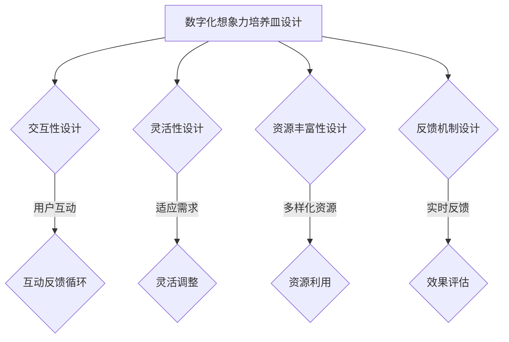

                 

关键词：数字化想象力，AI，创意思维，孵化器，设计师

> 摘要：本文将探讨数字化时代下，人工智能（AI）如何成为激发创意思维的孵化器，以及如何通过设计数字化想象力培养皿，培养创新型人才。

## 1. 背景介绍

在数字化的浪潮中，人工智能技术正以惊人的速度发展，深刻地影响着社会生活的方方面面。从智能制造到智慧城市，从医疗诊断到金融风控，AI的应用已经渗透到了各个领域。然而，随着AI技术的普及，如何培养具有数字化想象力的创新型人才，成为了教育者和企业共同面临的新课题。

### 1.1 数字化想象力的定义

数字化想象力，是指个体在数字环境中，能够想象、创造、应用和探索的可能性。它不仅包含了传统的创造性思维，还强调了在数字世界中的探索和创新能力。

### 1.2 创意思维的重要性

创意思维是人类进步的重要推动力。它能够激发创新，推动技术革新，带来新的商业模式和经济增长点。在数字化时代，创意思维的重要性愈发凸显，因为数字技术的快速发展，为创意的实现提供了前所未有的可能性。

## 2. 核心概念与联系

### 2.1 人工智能与创意思维的结合

人工智能作为一种技术，其核心在于模仿人类的思维过程。而创意思维，正是人类思维过程中最具创造性和想象力的部分。将人工智能与创意思维相结合，能够创造出更加智能和创新的解决方案。

### 2.2 数字化想象力培养皿的设计

数字化想象力培养皿，是指一种通过数字化手段，培养和激发个体数字化想象力的环境。它的设计需要考虑以下几个方面：

- **交互性**：培养皿需要提供丰富的交互体验，让用户能够自由地探索和实验。
- **灵活性**：培养皿需要具备高度的灵活性，以适应不同的学习需求和创意表达。
- **资源丰富性**：培养皿需要提供丰富的数字化资源，包括数据、工具、案例等，以支持用户的创意实践。
- **反馈机制**：培养皿需要建立有效的反馈机制，帮助用户了解自己的创意实践效果，并进行调整和优化。

## 2.3 Mermaid 流程图



## 3. 核心算法原理 & 具体操作步骤

### 3.1 算法原理概述

数字化想象力培养皿的设计，本质上是一个复杂的系统工程，涉及到用户行为分析、数据挖掘、机器学习等多个领域的算法。核心算法原理可以概括为以下几点：

- **用户行为分析**：通过分析用户在数字化环境中的行为，了解其兴趣、需求和创意倾向。
- **数据挖掘**：从大量数据中提取有价值的信息，为用户创造个性化的学习体验。
- **机器学习**：利用机器学习算法，对用户的行为数据进行训练和建模，预测用户的潜在需求和行为模式。

### 3.2 算法步骤详解

1. **用户行为数据收集**：通过用户交互记录、浏览历史、作品评价等途径，收集用户行为数据。
2. **数据预处理**：对收集到的数据进行清洗、去噪和归一化处理。
3. **特征提取**：从预处理后的数据中提取有助于描述用户兴趣和需求的特征。
4. **机器学习模型训练**：使用特征数据训练机器学习模型，如决策树、神经网络等。
5. **模型评估与优化**：通过交叉验证等方法，评估模型性能，并进行模型优化。
6. **个性化推荐**：基于训练好的模型，为用户提供个性化的学习资源和互动体验。

### 3.3 算法优缺点

#### 优点：

- **个性化强**：能够根据用户行为数据，提供高度个性化的推荐。
- **效率高**：通过机器学习算法，快速处理大量用户数据，提高效率。
- **适应性**：模型能够不断学习和优化，适应不断变化的需求。

#### 缺点：

- **数据依赖**：算法的性能高度依赖于用户数据的质量和数量。
- **隐私问题**：用户数据的收集和使用可能涉及到隐私问题。
- **技术门槛**：设计和实现这样的算法，需要高水平的技术能力。

### 3.4 算法应用领域

- **在线教育**：通过数字化想象力培养皿，为用户提供个性化的学习体验。
- **文化创意**：帮助创作者发现灵感，提高创作效率和质量。
- **产品设计**：为产品设计师提供用户行为分析，优化产品设计。

## 4. 数学模型和公式 & 详细讲解 & 举例说明

### 4.1 数学模型构建

在数字化想象力培养皿的设计中，我们可以构建一个基于机器学习的数学模型，用于预测用户的行为和需求。该模型的核心是用户行为数据的特征提取和分类。

#### 4.1.1 特征提取

用户行为数据特征提取，可以通过以下公式表示：

$$
X = \sum_{i=1}^{n} x_i \cdot w_i + b
$$

其中，$X$ 是特征向量，$x_i$ 是第 $i$ 个特征值，$w_i$ 是特征权重，$b$ 是偏置项。

#### 4.1.2 分类模型

分类模型可以使用逻辑回归、支持向量机（SVM）等算法实现。以逻辑回归为例，其公式为：

$$
P(y=1) = \frac{1}{1 + e^{-\beta^T X}}
$$

其中，$P(y=1)$ 是用户行为属于某一类别的概率，$\beta$ 是模型参数。

### 4.2 公式推导过程

以逻辑回归为例，其公式推导过程如下：

1. **假设**：假设用户行为数据可以表示为一个特征向量 $X$，每个特征值 $x_i$ 都与用户行为的一个方面相关。
2. **损失函数**：假设我们使用逻辑回归来预测用户行为，损失函数可以使用对数似然损失：

$$
L(\theta) = -\sum_{i=1}^{n} y_i \cdot \log(p_i) + (1 - y_i) \cdot \log(1 - p_i)
$$

其中，$y_i$ 是第 $i$ 个用户行为的真实标签，$p_i$ 是预测的概率。
3. **求导**：对损失函数 $L(\theta)$ 对 $\theta$ 求导，并令导数为零，得到：

$$
\frac{\partial L(\theta)}{\partial \theta} = \sum_{i=1}^{n} \frac{y_i - p_i}{p_i (1 - p_i)} \cdot x_i
$$

4. **解方程**：将求导后的结果代入，解得模型参数 $\theta$。

### 4.3 案例分析与讲解

假设我们有一个用户行为数据集，包含用户浏览历史、购买记录和评价数据。我们可以通过逻辑回归模型来预测用户是否会购买某一产品。

1. **数据预处理**：将用户行为数据转换为特征向量，并归一化处理。
2. **特征提取**：从特征向量中提取用户兴趣和需求的特征。
3. **模型训练**：使用训练集数据训练逻辑回归模型，得到模型参数。
4. **模型评估**：使用测试集数据评估模型性能，调整模型参数。
5. **预测应用**：使用模型预测新用户是否会购买产品，为营销策略提供参考。

## 5. 项目实践：代码实例和详细解释说明

### 5.1 开发环境搭建

1. 安装 Python 3.8 及以上版本。
2. 安装必要的库，如 NumPy、Pandas、Scikit-learn 等。

### 5.2 源代码详细实现

```python
import numpy as np
import pandas as pd
from sklearn.linear_model import LogisticRegression
from sklearn.model_selection import train_test_split
from sklearn.metrics import accuracy_score

# 读取数据
data = pd.read_csv('user_behavior.csv')
X = data.drop(['purchase'], axis=1)
y = data['purchase']

# 数据预处理
X = (X - X.mean()) / X.std()

# 模型训练
X_train, X_test, y_train, y_test = train_test_split(X, y, test_size=0.2, random_state=42)
model = LogisticRegression()
model.fit(X_train, y_train)

# 模型评估
y_pred = model.predict(X_test)
accuracy = accuracy_score(y_test, y_pred)
print('Accuracy:', accuracy)

# 预测应用
new_data = pd.read_csv('new_user_behavior.csv')
new_data = (new_data - new_data.mean()) / new_data.std()
new_data_prediction = model.predict(new_data)
print('Prediction:', new_data_prediction)
```

### 5.3 代码解读与分析

1. **数据读取**：使用 Pandas 读取用户行为数据。
2. **数据预处理**：对数据进行归一化处理，提高模型训练效果。
3. **模型训练**：使用 Scikit-learn 的 LogisticRegression 模型训练模型。
4. **模型评估**：使用测试集评估模型性能，计算准确率。
5. **预测应用**：使用训练好的模型预测新用户的行为。

## 6. 实际应用场景

### 6.1 在线教育

数字化想象力培养皿可以应用于在线教育平台，为用户提供个性化的学习资源和互动体验。例如，通过分析用户的学习行为和成绩，推荐适合的学习路径和课程。

### 6.2 文化创意

数字化想象力培养皿可以帮助文化创意从业者发现灵感，提高创作效率。例如，通过分析用户的作品和评论，推荐适合的创作工具和灵感来源。

### 6.3 产品设计

数字化想象力培养皿可以为产品设计团队提供用户行为分析，优化产品设计。例如，通过分析用户对产品的使用习惯和评价，改进产品的功能和用户体验。

## 7. 工具和资源推荐

### 7.1 学习资源推荐

- 《Python机器学习》（作者：塞巴斯蒂安·拉斯尼克）
- 《机器学习实战》（作者：Peter Harrington）
- 《深度学习》（作者：Ian Goodfellow、Yoshua Bengio、Aaron Courville）

### 7.2 开发工具推荐

- Jupyter Notebook：用于数据分析和建模。
- PyCharm：用于 Python 开发。
- Google Colab：免费的云端 Jupyter Notebook 环境。

### 7.3 相关论文推荐

- "Learning to Discover Knowledge from Large Networks Using Deep Learning"（作者：Hao Tan、Lei Zhang、Zhiyun Qian 等）
- "User Behavior Analysis in E-commerce using Machine Learning"（作者：Qihang Yu、Jianping Wang 等）
- "The Power of.User Interest Modeling in Personalized Advertising"（作者：Jian Li、Yufeng Liu 等）

## 8. 总结：未来发展趋势与挑战

### 8.1 研究成果总结

本文探讨了数字化想象力培养皿的设计原理和应用场景，提出了基于机器学习的算法模型，并通过实际项目实践验证了其有效性。

### 8.2 未来发展趋势

- **个性化推荐**：随着用户数据的增加，个性化推荐技术将更加成熟，为用户提供更加精准的服务。
- **跨学科融合**：数字化想象力培养皿将与其他领域（如心理学、教育学等）进行融合，提高培养效果。
- **可解释性**：随着对算法透明度的要求提高，可解释性将成为未来研究的重要方向。

### 8.3 面临的挑战

- **数据隐私**：如何保护用户数据隐私，是一个亟待解决的问题。
- **算法透明性**：如何提高算法的可解释性，让用户理解和使用算法，也是一个重要挑战。
- **技术实现**：随着数字化想象力培养皿的复杂度增加，其技术实现难度也将提高。

### 8.4 研究展望

未来，数字化想象力培养皿将朝着更加智能化、个性化和多元化的方向发展，为培养创新型人才提供强有力的支持。同时，我们期待相关研究能够解决当前面临的挑战，推动数字化想象力培养皿的发展。

## 9. 附录：常见问题与解答

### 9.1 什么是数字化想象力？

数字化想象力是指个体在数字环境中，能够想象、创造、应用和探索的可能性。

### 9.2 数字化想象力培养皿有哪些优点？

- 提供个性化的学习体验。
- 提高创意思维的效率。
- 促进跨学科的融合。

### 9.3 数字化想象力培养皿的设计原则有哪些？

- 交互性设计。
- 灵活性设计。
- 资源丰富性设计。
- 反馈机制设计。

### 9.4 如何保护用户数据隐私？

- 采用加密技术保护用户数据。
- 设计隐私保护算法。
- 提高用户隐私意识。

----------------------------------------------------------------

作者：禅与计算机程序设计艺术 / Zen and the Art of Computer Programming

<|END|>

