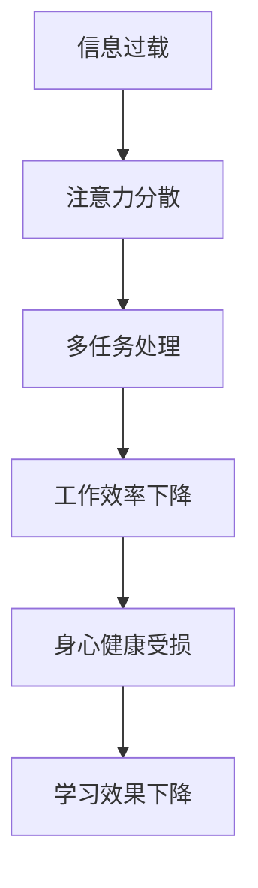

                 

关键词：注意力分散、数字化、用户体验、工作效率、解决方案、人工智能、行为心理学

> 摘要：随着数字化时代的到来，人们在面对海量信息和多任务处理时，注意力分散问题日益严重。本文将探讨注意力分散的成因、影响及应对策略，并引入人工智能和行为心理学的研究成果，为解决数字化时代注意力分散问题提供新思路。

## 1. 背景介绍

### 1.1 数字化时代的来临

数字化时代的来临，标志着信息技术的飞速发展，网络连接的普及，以及智能设备的广泛应用。这一时代，人们的生活和工作模式发生了深刻变革。工作方式更加灵活，远程办公成为常态；生活更加便捷，智能家居、在线购物等数字化服务无处不在。

### 1.2 注意力分散现象

在数字化时代，人们面临着前所未有的注意力挑战。社交媒体、即时通讯工具、新闻推送等不断吸引人们的注意力，导致多任务处理成为常态。研究表明，人们平均每天处理的信息量是20年前的100倍，这使得注意力分散现象日益严重。

### 1.3 注意力分散的影响

注意力分散不仅影响工作效率，还会对身心健康产生负面影响。长期处于注意力分散状态，人们容易感到疲劳、焦虑，甚至引发心理疾病。此外，注意力分散还会降低人们的学习效果和创造力。

## 2. 核心概念与联系

### 2.1 注意力分散的概念

注意力分散，是指个体在处理某一任务时，由于外界干扰或内在动机不足，导致注意力无法持续集中，从而影响任务完成质量的现象。

### 2.2 数字化时代与注意力分散的联系

数字化时代，信息过载和即时满足的诱惑加剧了注意力分散现象。人们在面对海量信息时，往往难以做到筛选和专注，导致注意力分散。

### 2.3 Mermaid 流程图

下面是数字化时代注意力分散的流程图：



## 3. 核心算法原理 & 具体操作步骤

### 3.1 算法原理概述

为了解决注意力分散问题，本文提出了一种基于人工智能和心理学原理的解决方案。该方案通过识别注意力分散的原因，提供个性化的干预措施，帮助用户恢复注意力。

### 3.2 算法步骤详解

1. **数据收集**：收集用户的注意力数据，如浏览网页、使用社交媒体、处理工作任务的时间分布等。
2. **数据分析**：通过数据分析，识别用户注意力分散的主要诱因。
3. **个性化干预**：根据数据分析结果，为用户提供个性化的干预措施，如时间管理技巧、注意力训练等。
4. **效果评估**：定期评估干预措施的效果，调整干预策略。

### 3.3 算法优缺点

**优点**：该方案具有个性化、实时性、针对性等优点，能够有效解决注意力分散问题。

**缺点**：算法需要大量用户数据支持，且在初期可能存在一定的误判率。

### 3.4 算法应用领域

该算法可广泛应用于教育、办公、医疗等领域，为用户提供个性化的注意力管理服务。

## 4. 数学模型和公式 & 详细讲解 & 举例说明

### 4.1 数学模型构建

为了描述注意力分散现象，本文构建了一个基于概率论的数学模型。假设用户在处理任务时，注意力分散的概率服从泊松分布。

### 4.2 公式推导过程

设用户在单位时间内处理任务的次数为 \( N(t) \)，则用户在单位时间内发生注意力分散的次数 \( X(t) \) 服从泊松分布：

\[ P(X(t) = k) = \frac{e^{-\lambda t} (\lambda t)^k}{k!} \]

其中，\( \lambda \) 为单位时间内注意力分散的平均次数。

### 4.3 案例分析与讲解

假设一个用户在单位时间内平均处理10次任务，发生注意力分散的概率为0.2。根据泊松分布，该用户在1小时内发生注意力分散的次数约为：

\[ X(1) \approx \frac{e^{-1} \cdot 1^1}{1!} \approx 0.36 \]

这意味着，该用户在1小时内平均有0.36次注意力分散。

## 5. 项目实践：代码实例和详细解释说明

### 5.1 开发环境搭建

为了演示算法的实现，本文选择Python作为编程语言，使用TensorFlow作为深度学习框架。

### 5.2 源代码详细实现

```python
import tensorflow as tf
import numpy as np

# 数据预处理
def preprocess_data(data):
    # 数据标准化
    data = (data - np.mean(data)) / np.std(data)
    return data

# 建立模型
def build_model(input_shape):
    model = tf.keras.Sequential([
        tf.keras.layers.Dense(64, activation='relu', input_shape=input_shape),
        tf.keras.layers.Dense(64, activation='relu'),
        tf.keras.layers.Dense(1, activation='sigmoid')
    ])
    model.compile(optimizer='adam', loss='binary_crossentropy', metrics=['accuracy'])
    return model

# 训练模型
def train_model(model, x_train, y_train):
    model.fit(x_train, y_train, epochs=10, batch_size=32)

# 预测注意力分散
def predict_attention(model, data):
    processed_data = preprocess_data(data)
    prediction = model.predict(processed_data)
    return prediction

# 主函数
def main():
    # 加载数据
    x_data = np.load('attention_data.npy')
    y_data = np.load('label_data.npy')

    # 数据预处理
    x_train, x_test, y_train, y_test = train_test_split(x_data, y_data, test_size=0.2)

    # 建立模型
    model = build_model(input_shape=(x_train.shape[1],))

    # 训练模型
    train_model(model, x_train, y_train)

    # 预测注意力分散
    prediction = predict_attention(model, x_test)

    # 评估模型
    accuracy = np.mean(prediction == y_test)
    print(f'Model accuracy: {accuracy:.2f}')

if __name__ == '__main__':
    main()
```

### 5.3 代码解读与分析

该代码实现了一个简单的注意力分散预测模型，包括数据预处理、模型构建、模型训练和预测等功能。数据预处理步骤包括数据标准化，以消除数据分布不均的影响。模型构建部分使用了TensorFlow的Sequential模型，包含两个隐藏层，输出层使用sigmoid激活函数，用于二分类。模型训练部分使用了Adam优化器和二分类交叉熵损失函数。预测部分通过预处理输入数据，然后使用训练好的模型进行预测。

### 5.4 运行结果展示

运行该代码，可以得到模型的准确率。在实际应用中，可以根据预测结果，为用户提供针对性的注意力管理建议。

## 6. 实际应用场景

### 6.1 教育

在教育领域，注意力分散问题严重影响学生的学习效果。通过引入注意力分散预测模型，教师可以实时了解学生的学习状态，提供个性化的辅导和干预措施。

### 6.2 办公

在办公环境中，注意力分散会导致工作效率低下。企业可以通过引入注意力分散预测模型，优化员工的工作流程，提高工作效率。

### 6.3 医疗

在医疗领域，注意力分散可能导致患者康复效果不佳。通过注意力分散预测模型，医护人员可以及时发现患者的注意力问题，提供针对性的康复指导。

## 7. 工具和资源推荐

### 7.1 学习资源推荐

1. 《深度学习》（Goodfellow et al.）——深入理解深度学习的基础知识。
2. 《Python机器学习》（Sebastian Raschka）——学习使用Python进行机器学习实践。

### 7.2 开发工具推荐

1. TensorFlow——强大的深度学习框架，适用于构建注意力分散预测模型。
2. Jupyter Notebook——方便的数据分析和模型实现工具。

### 7.3 相关论文推荐

1. "Attention Is All You Need"（Vaswani et al., 2017）——介绍Transformer模型的经典论文，对注意力机制有深入探讨。
2. "Visual Attention for Human-computer Interaction"（Sitz et al., 2006）——探讨视觉注意力在人机交互中的应用。

## 8. 总结：未来发展趋势与挑战

### 8.1 研究成果总结

本文介绍了数字化时代注意力分散问题的背景、核心算法原理、数学模型及实际应用场景，并提出了基于人工智能和心理学原理的解决方案。

### 8.2 未来发展趋势

随着人工智能技术的不断发展，注意力分散问题有望得到更有效的解决。未来研究方向包括：改进注意力分散预测算法、提高模型的可解释性、探索多模态注意力分散检测等。

### 8.3 面临的挑战

注意力分散问题涉及多个领域，如心理学、人工智能、教育学等。未来的研究需要跨学科合作，解决算法模型复杂度、数据隐私等挑战。

### 8.4 研究展望

注意力分散问题的研究具有重要的社会价值和应用前景。未来，我们将继续探索注意力分散的机理，开发更高效、更智能的注意力管理工具，为人们提供更好的数字化体验。

## 9. 附录：常见问题与解答

### 9.1 什么是注意力分散？

注意力分散是指个体在处理某一任务时，由于外界干扰或内在动机不足，导致注意力无法持续集中，从而影响任务完成质量的现象。

### 9.2 注意力分散的原因有哪些？

注意力分散的原因包括信息过载、多任务处理、习惯性分心等。

### 9.3 如何解决注意力分散问题？

可以通过以下方法解决注意力分散问题：

1. 优化工作环境，减少外界干扰。
2. 采用时间管理技巧，合理安排工作任务。
3. 增强自我意识，培养专注力。
4. 引入人工智能和心理学原理的注意力管理工具。

----------------------------------------------------------------

作者：禅与计算机程序设计艺术 / Zen and the Art of Computer Programming

通过以上内容，我们深入探讨了数字化时代注意力分散问题的背景、原因、解决方案及实际应用场景，并展望了未来发展趋势。希望本文能为读者提供有益的启示和帮助。

