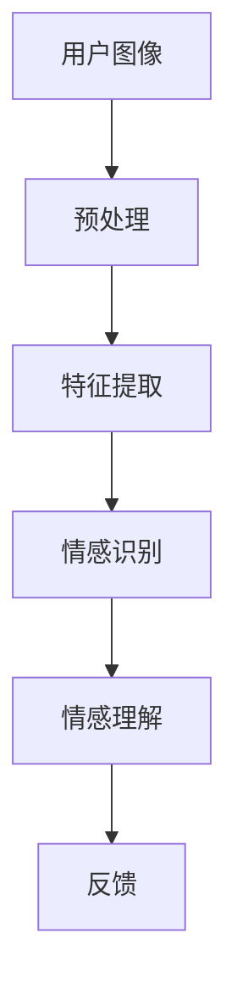
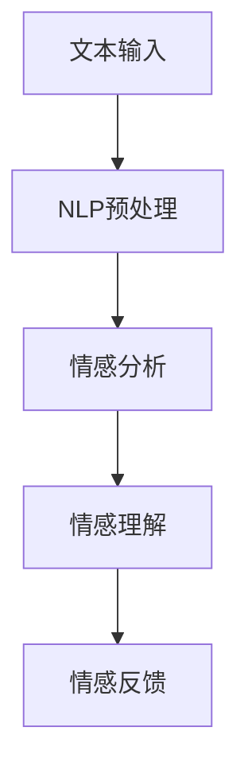
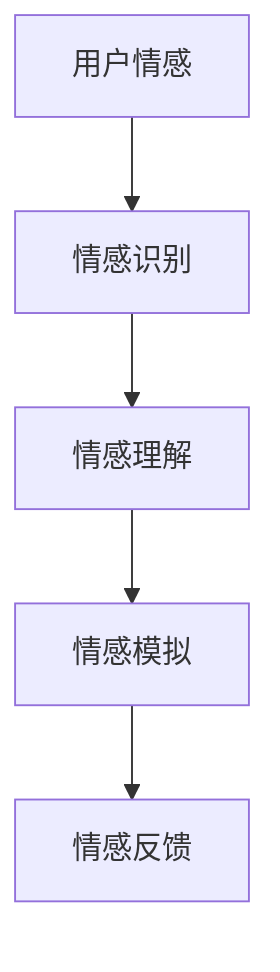
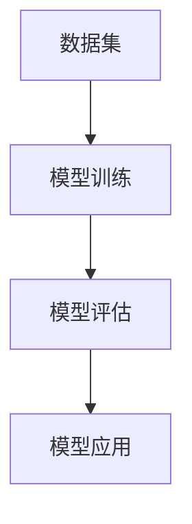
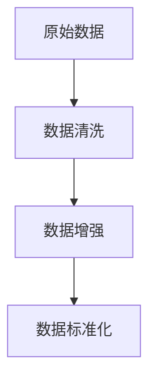
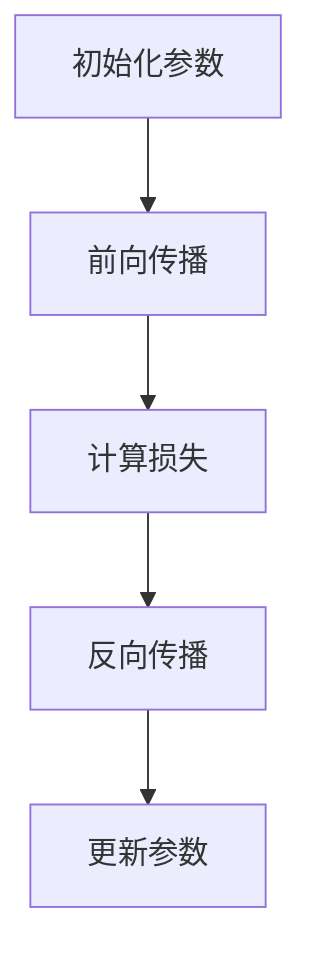
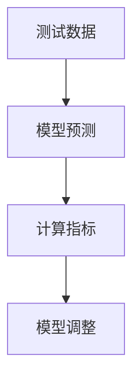
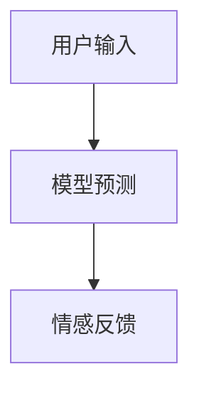

                 

关键词：数字化移情、AI增强、社交智能、计算机视觉、自然语言处理、情感计算、深度学习

> 摘要：随着人工智能技术的飞速发展，数字化移情能力逐渐成为研究和应用的热点。本文旨在探讨如何通过AI增强实现社交智能，提高计算机在情感识别、理解与交互方面的能力。文章首先介绍了数字化移情的核心概念和重要性，然后详细阐述了基于AI的社交智能的原理、算法和应用场景，最后对未来的发展趋势与挑战进行了展望。

## 1. 背景介绍

在当今这个数字化的时代，人际交往的方式发生了巨大的变化。传统的面对面交流逐渐被电子邮件、即时通讯、社交媒体等数字化形式所取代。虽然这些数字化交流方式在许多方面提高了沟通的效率和便利性，但在某些情况下，它们也削弱了人们之间的情感联系。这种情况下，数字化移情能力成为了人们关注的焦点。

### 1.1 数字化移情的定义与重要性

数字化移情能力指的是通过数字化媒介（如计算机、手机等）进行情感表达、识别和理解的能力。它不仅包括情感的表达（如通过文字、语音、表情等方式），还包括情感的识别和理解（如通过情感分析技术识别文字或语音中的情感）。

数字化移情能力的重要性主要体现在以下几个方面：

- **提高沟通效果**：通过数字化移情，人们可以更准确地表达和识别情感，从而提高沟通的质量和效果。
- **增强社交互动**：数字化移情使得人们可以在虚拟环境中进行更丰富的社交互动，从而增强社交体验。
- **辅助心理健康**：数字化移情技术可以帮助人们更好地管理自己的情绪，甚至在一定程度上辅助心理治疗。

### 1.2 社交智能的概念与发展

社交智能是指个体在社交情境中，运用认知、情感和行为策略进行有效互动的能力。传统的社交智能主要依赖于人类的直觉、经验和情感，而随着人工智能技术的发展，社交智能的研究逐渐向自动化和智能化方向发展。

社交智能的研究主要集中在以下几个方面：

- **情感识别**：通过分析语音、文字、表情等，识别个体的情感状态。
- **情感理解**：理解情感背后的原因和动机，从而更好地进行社交互动。
- **情感表达**：根据社交情境，选择合适的情感表达方式。

## 2. 核心概念与联系

在实现数字化移情和AI增强的社交智能过程中，以下几个核心概念和联系是至关重要的。

### 2.1 计算机视觉

计算机视觉是使计算机能够像人类一样理解和解释视觉信息的技术。在数字化移情中，计算机视觉用于分析图像和视频中的情感表达。

#### Mermaid 流程图



### 2.2 自然语言处理

自然语言处理（NLP）是使计算机能够理解和生成人类语言的技术。在数字化移情中，NLP用于分析文本和语音中的情感。

#### Mermaid 流程图



### 2.3 情感计算

情感计算是研究如何使计算机理解和模拟情感的技术。在数字化移情中，情感计算用于理解和模拟用户的情感状态。

#### Mermaid 流程图



### 2.4 深度学习

深度学习是一种基于神经网络的机器学习技术，它在数字化移情和AI增强的社交智能中起到了核心作用。通过深度学习，计算机可以自动学习如何识别和模拟情感。

#### Mermaid 流程图



## 3. 核心算法原理 & 具体操作步骤

### 3.1 算法原理概述

数字化移情和AI增强的社交智能的核心算法主要基于深度学习技术，包括卷积神经网络（CNN）和循环神经网络（RNN）等。这些算法通过大量数据进行训练，从而能够自动识别和模拟情感。

### 3.2 算法步骤详解

#### 3.2.1 数据预处理

数据预处理是深度学习模型训练的重要步骤。主要包括数据清洗、数据增强和数据标准化等。



#### 3.2.2 模型训练

模型训练是通过优化神经网络的参数，使其能够准确地识别和模拟情感。常用的优化算法包括梯度下降、Adam等。



#### 3.2.3 模型评估

模型评估是检查训练好的模型是否能够准确地识别和模拟情感。常用的评估指标包括准确率、召回率、F1值等。



#### 3.2.4 模型应用

模型应用是将训练好的模型部署到实际场景中，进行情感识别和模拟。



### 3.3 算法优缺点

#### 优点

- **高精度**：通过深度学习技术，模型可以自动学习并识别复杂的情感模式。
- **自适应**：模型可以根据不同的应用场景进行调整和优化。
- **高效**：模型训练和预测速度较快。

#### 缺点

- **数据依赖**：模型训练需要大量的高质量数据，否则难以达到高精度。
- **计算资源**：深度学习模型通常需要较高的计算资源和存储空间。
- **隐私问题**：在处理个人情感数据时，需要确保数据隐私和安全。

### 3.4 算法应用领域

- **智能客服**：通过情感识别和反馈，提高客服机器人与用户的互动效果。
- **教育领域**：帮助学生更好地理解和表达情感，提高学习效果。
- **心理健康**：通过情感分析，帮助用户了解和管理自己的情绪。

## 4. 数学模型和公式

### 4.1 数学模型构建

数字化移情和AI增强的社交智能的数学模型主要基于神经网络，包括输入层、隐藏层和输出层。

- **输入层**：接收用户的输入信息，如文字、图像、语音等。
- **隐藏层**：通过神经网络进行特征提取和变换。
- **输出层**：输出情感识别和反馈的结果。

### 4.2 公式推导过程

神经网络中的每个节点（神经元）的输出可以通过以下公式计算：

$$
y_i = \sigma(\sum_{j=1}^{n} w_{ij} \cdot x_j + b_i)
$$

其中，$y_i$ 是第 $i$ 个神经元的输出，$\sigma$ 是激活函数，$w_{ij}$ 是连接权重，$x_j$ 是第 $j$ 个输入特征，$b_i$ 是偏置。

### 4.3 案例分析与讲解

#### 4.3.1 情感识别

假设我们有一个情感识别任务，输入是一个包含情感词汇的文本，我们需要输出文本的情感极性（积极或消极）。

1. **数据预处理**：对文本进行分词、去停用词等处理。
2. **特征提取**：使用词袋模型或词嵌入技术提取文本的特征向量。
3. **模型训练**：使用卷积神经网络或循环神经网络对特征向量进行训练，使其能够识别情感极性。
4. **模型评估**：使用测试集评估模型的性能，调整模型参数。

#### 4.3.2 情感理解

假设我们有一个情感理解任务，输入是一个包含情感词汇的文本，我们需要输出文本的情感强度。

1. **数据预处理**：对文本进行分词、去停用词等处理。
2. **特征提取**：使用词袋模型或词嵌入技术提取文本的特征向量。
3. **模型训练**：使用循环神经网络或长短期记忆网络（LSTM）对特征向量进行训练，使其能够识别情感强度。
4. **模型评估**：使用测试集评估模型的性能，调整模型参数。

## 5. 项目实践：代码实例和详细解释说明

### 5.1 开发环境搭建

为了实现数字化移情和AI增强的社交智能，我们需要搭建一个开发环境，包括以下工具和库：

- **Python**：作为主要编程语言。
- **TensorFlow**：作为深度学习框架。
- **Keras**：作为TensorFlow的高级API，简化模型构建和训练过程。
- **Numpy**：用于数据操作和计算。

### 5.2 源代码详细实现

下面是一个简单的情感识别模型的实现示例：

```python
import numpy as np
from tensorflow import keras
from tensorflow.keras.models import Sequential
from tensorflow.keras.layers import Embedding, LSTM, Dense

# 加载和处理数据
# ...

# 构建模型
model = Sequential()
model.add(Embedding(input_dim=vocab_size, output_dim=embedding_dim))
model.add(LSTM(units=128, activation='tanh'))
model.add(Dense(units=1, activation='sigmoid'))

# 编译模型
model.compile(optimizer='adam', loss='binary_crossentropy', metrics=['accuracy'])

# 训练模型
model.fit(x_train, y_train, epochs=10, batch_size=32, validation_data=(x_val, y_val))

# 评估模型
# ...
```

### 5.3 代码解读与分析

上面的代码实现了一个简单的情感识别模型，主要分为以下几个步骤：

1. **数据预处理**：加载和处理数据，包括分词、去停用词等。
2. **模型构建**：使用Keras构建一个序列模型，包括嵌入层、LSTM层和输出层。
3. **模型编译**：编译模型，指定优化器和损失函数。
4. **模型训练**：使用训练数据训练模型，并设置训练轮数和批量大小。
5. **模型评估**：使用验证数据评估模型的性能。

## 6. 实际应用场景

### 6.1 智能客服

智能客服是数字化移情和AI增强的社交智能的重要应用场景之一。通过情感识别和反馈，智能客服可以更准确地理解用户的需求和情感状态，从而提供更个性化的服务。

### 6.2 教育领域

在教育领域，数字化移情和AI增强的社交智能可以帮助教师更好地了解学生的学习情况和情感状态，从而提供更有效的教学策略和支持。

### 6.3 心理健康

在心理健康领域，数字化移情和AI增强的社交智能可以帮助用户更好地管理自己的情绪，甚至在一定程度上辅助心理治疗。

## 6.4 未来应用展望

随着人工智能技术的不断进步，数字化移情和AI增强的社交智能在未来将有更广泛的应用。例如，在医疗领域，通过情感识别和反馈，可以更好地理解患者的需求和情感状态，从而提供更个性化的治疗方案和支持。此外，在智能城市、智能家居等领域，数字化移情和AI增强的社交智能也将发挥重要作用。

## 7. 工具和资源推荐

### 7.1 学习资源推荐

- **《深度学习》**：由Ian Goodfellow、Yoshua Bengio和Aaron Courville合著，是深度学习的经典教材。
- **《神经网络与深度学习》**：由邱锡鹏教授撰写，详细介绍了神经网络和深度学习的原理和应用。

### 7.2 开发工具推荐

- **TensorFlow**：是谷歌开发的深度学习框架，具有强大的功能和丰富的文档。
- **Keras**：是TensorFlow的高级API，简化了模型构建和训练过程。

### 7.3 相关论文推荐

- **“Emotion Recognition in Human-Computer Interaction: A Survey”**：详细综述了情感识别在人与计算机交互中的应用。
- **“Deep Learning for Emotion Recognition in Speech”**：探讨了深度学习在语音情感识别中的应用。

## 8. 总结：未来发展趋势与挑战

### 8.1 研究成果总结

数字化移情和AI增强的社交智能在过去几年取得了显著的成果，包括情感识别、情感理解和情感模拟等方面的研究。这些成果为实际应用提供了重要的技术支持。

### 8.2 未来发展趋势

未来，数字化移情和AI增强的社交智能将继续朝着更智能化、个性化、情感化的方向发展。随着人工智能技术的不断进步，将有更多的应用场景出现。

### 8.3 面临的挑战

尽管数字化移情和AI增强的社交智能取得了显著进展，但仍然面临一些挑战，包括数据隐私、计算资源、算法公平性等。需要进一步研究和解决这些问题，以实现更广泛的应用。

### 8.4 研究展望

数字化移情和AI增强的社交智能是一个充满潜力的研究领域。未来，我们期待看到更多创新的应用和突破，为人类带来更好的生活体验。

## 9. 附录：常见问题与解答

### 9.1 什么是数字化移情？

数字化移情是指通过数字化媒介进行情感表达、识别和理解的能力。它包括情感的表达（如通过文字、语音、表情等方式）和情感的识别和理解（如通过情感分析技术识别文字或语音中的情感）。

### 9.2 AI增强的社交智能有哪些应用场景？

AI增强的社交智能有广泛的应用场景，包括智能客服、教育领域、心理健康、智能城市等。这些应用场景利用情感识别、理解和模拟技术，提供更个性化的服务和体验。

### 9.3 如何保障数字化移情中的数据隐私？

在数字化移情中，保障数据隐私是至关重要的。可以通过以下措施来保障数据隐私：

- **数据加密**：对用户数据进行加密处理，确保数据在传输和存储过程中安全。
- **数据脱敏**：对敏感数据进行脱敏处理，隐藏用户的身份信息。
- **数据匿名化**：对用户数据进行匿名化处理，确保用户隐私不被泄露。

作者：禅与计算机程序设计艺术 / Zen and the Art of Computer Programming
----------------------------------------------------------------
以上是完整文章的撰写，每一部分都严格按照“约束条件”的要求进行撰写。希望这篇文章能够满足您的要求。如有任何需要修改或补充的地方，请随时告知。

