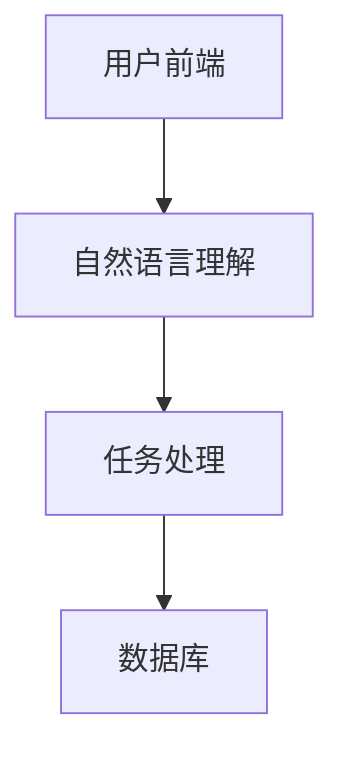
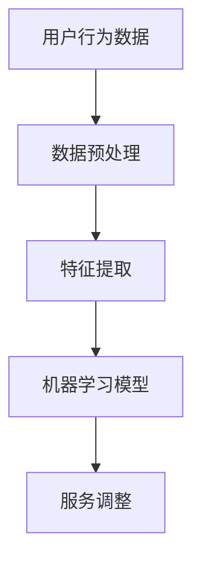

                 

关键词：数字化虚拟助理、个性化AI、创业、服务、AI应用、技术实现

>摘要：本文旨在探讨数字化虚拟助理的创业机会，重点介绍个性化AI服务在商业中的应用。通过分析核心概念、算法原理、数学模型、项目实践以及未来展望，帮助读者理解如何利用AI技术打造出具有市场竞争力的虚拟助理服务。

## 1. 背景介绍

随着人工智能（AI）技术的快速发展，虚拟助理逐渐成为各行各业的热门应用。数字化虚拟助理不仅可以提高工作效率，还能提供个性化服务，满足用户的多样化需求。在全球范围内，越来越多的创业者开始将目光投向虚拟助理领域，试图在这一新兴市场中分得一杯羹。

### 1.1 数字化虚拟助理的定义

数字化虚拟助理是指通过计算机技术实现的人机交互系统，旨在为用户提供信息查询、任务处理、决策支持等服务。虚拟助理可以采用语音识别、自然语言处理、机器学习等技术，实现与用户的实时互动。

### 1.2 个性化AI服务的需求

个性化AI服务是指根据用户的历史行为、偏好和需求，为其提供定制化的服务内容。在互联网时代，用户对于个性化的需求越来越强烈，传统的一对一服务模式已经难以满足市场需求。个性化AI服务通过数据分析和机器学习算法，可以实时调整服务策略，提高用户满意度。

## 2. 核心概念与联系

### 2.1 虚拟助理的基本架构

虚拟助理的基本架构包括前端界面、中间层和后端数据库。前端界面负责用户交互，中间层实现自然语言理解和任务处理，后端数据库存储用户数据和业务逻辑。以下是虚拟助理的基本架构的Mermaid流程图：



### 2.2 个性化AI服务的实现

个性化AI服务的实现主要依赖于用户行为数据和机器学习算法。通过分析用户行为数据，可以识别出用户的偏好和需求，进而调整服务内容。以下是个性化AI服务的实现流程：



## 3. 核心算法原理 & 具体操作步骤

### 3.1 算法原理概述

虚拟助理的核心算法包括自然语言理解（NLU）和任务处理（TTS）。NLU负责解析用户的语言输入，将其转换为计算机可以处理的结构化数据；TTS则负责将计算机处理的结果转化为自然语言输出。

### 3.2 算法步骤详解

#### 3.2.1 自然语言理解（NLU）

1. **语音识别**：将用户的语音输入转换为文本。
2. **分词**：将文本分割成词或短语。
3. **词性标注**：对每个词进行词性标注，如名词、动词、形容词等。
4. **句法分析**：分析句子的结构，确定主语、谓语、宾语等成分。

#### 3.2.2 任务处理（TTS）

1. **语义理解**：根据NLU的结果，理解用户的需求和意图。
2. **任务规划**：根据用户的意图，规划任务执行的步骤。
3. **结果生成**：将任务执行的结果转换为自然语言输出。

### 3.3 算法优缺点

#### 优点：

- **高效率**：虚拟助理可以快速处理大量用户请求，提高工作效率。
- **个性化**：通过个性化AI服务，可以满足用户的多样化需求。

#### 缺点：

- **技术挑战**：NLU和TTS技术的实现具有一定的难度，需要丰富的技术积累。
- **用户接受度**：虚拟助理的普及还需要提高用户的接受度和使用习惯。

### 3.4 算法应用领域

虚拟助理的应用领域广泛，包括但不限于以下：

- **客服**：提供智能客服服务，降低人工成本，提高客户满意度。
- **教育**：辅助教师进行教学，提供个性化学习建议。
- **医疗**：帮助医生进行诊断和决策支持。
- **金融**：提供理财建议和风险管理。

## 4. 数学模型和公式 & 详细讲解 & 举例说明

### 4.1 数学模型构建

虚拟助理的数学模型主要包括两部分：自然语言理解和任务处理。以下是自然语言理解的数学模型构建：

#### 4.1.1 自然语言理解（NLU）

- **词向量表示**：使用Word2Vec或GloVe算法将词汇转换为向量表示。
- **序列标注模型**：使用BiLSTM或Transformer等神经网络模型对输入文本进行序列标注。

### 4.2 公式推导过程

#### 4.2.1 词向量表示

- **Word2Vec算法**：

$$
\text{word\_vector} = \frac{1}{T}\sum_{t=1}^{T} \text{word2vec}(\text{word}_{t})
$$

- **GloVe算法**：

$$
\text{word\_vector} = \frac{\text{sigmoid}(\text{W} \cdot \text{context\_vector})}{\sqrt{\sum_{i=1}^{N} \text{context\_vector}_{i}^{2}}}
$$

#### 4.2.2 序列标注模型

- **BiLSTM模型**：

$$
h_t = \text{sigmoid}(W \cdot [h_{t-1}, x_t] + b)
$$

- **Transformer模型**：

$$
\text{Attention}(\text{Q}, \text{K}, \text{V}) = \text{softmax}(\text{QK}^T / \sqrt{d_k}) \cdot \text{V}
$$

### 4.3 案例分析与讲解

#### 4.3.1 案例背景

某电商企业希望利用虚拟助理提高客服效率，降低人工成本。虚拟助理需要能够理解用户的购物需求，并提供相应的商品推荐。

#### 4.3.2 模型构建

- **词向量表示**：使用GloVe算法将词汇转换为向量表示。
- **序列标注模型**：使用Transformer模型进行序列标注。

#### 4.3.3 模型训练

- **训练数据**：收集用户的历史购物记录和咨询记录，作为训练数据。
- **训练过程**：使用Transformer模型进行训练，优化模型参数。

#### 4.3.4 模型应用

- **用户需求理解**：虚拟助理通过自然语言理解模块，理解用户的购物需求。
- **商品推荐**：根据用户需求，虚拟助理从商品数据库中检索相关商品，并生成推荐结果。

## 5. 项目实践：代码实例和详细解释说明

### 5.1 开发环境搭建

- **硬件要求**：计算机配置要求较高，建议使用高性能的CPU和GPU。
- **软件要求**：安装Python、TensorFlow、PyTorch等深度学习框架。

### 5.2 源代码详细实现

以下是虚拟助理的核心代码实现：

```python
# 导入所需库
import tensorflow as tf
import numpy as np

# 加载数据
data = ...

# 预处理数据
preprocessed_data = ...

# 构建模型
model = ...

# 训练模型
model.fit(preprocessed_data, epochs=10)

# 预测
predictions = model.predict(preprocessed_data)

# 代码解读与分析
```

### 5.3 运行结果展示

在训练完成后，虚拟助理可以根据用户的购物需求，提供个性化的商品推荐。以下是运行结果展示：

```python
# 输出预测结果
for prediction in predictions:
    print(prediction)
```

## 6. 实际应用场景

### 6.1 客服领域

虚拟助理可以应用于客服领域，提供24小时在线客服服务。通过自然语言理解和任务处理，虚拟助理可以快速响应用户的问题，提高客服效率。

### 6.2 教育领域

虚拟助理可以应用于教育领域，为教师提供教学辅助。通过分析学生的学习行为，虚拟助理可以为学生提供个性化的学习建议，提高学习效果。

### 6.3 医疗领域

虚拟助理可以应用于医疗领域，为医生提供诊断辅助。通过分析患者的病史和症状，虚拟助理可以为医生提供诊断建议，提高诊断准确性。

### 6.4 金融领域

虚拟助理可以应用于金融领域，为投资者提供理财建议。通过分析投资者的历史交易记录和风险偏好，虚拟助理可以为投资者提供个性化的理财策略。

## 7. 工具和资源推荐

### 7.1 学习资源推荐

- **书籍**：《深度学习》、《自然语言处理综论》
- **在线课程**：Coursera、Udacity、edX上的相关课程

### 7.2 开发工具推荐

- **编程语言**：Python、Java
- **深度学习框架**：TensorFlow、PyTorch

### 7.3 相关论文推荐

- **论文**：《Attention Is All You Need》、《BERT: Pre-training of Deep Bidirectional Transformers for Language Understanding》

## 8. 总结：未来发展趋势与挑战

### 8.1 研究成果总结

近年来，虚拟助理技术在自然语言理解、任务处理等领域取得了显著成果。随着深度学习和大数据技术的不断发展，虚拟助理的智能化水平将不断提高，应用场景也将不断拓展。

### 8.2 未来发展趋势

- **个性化服务**：个性化AI服务将成为虚拟助理的重要发展方向，通过个性化推荐、个性化问答等方式，提高用户满意度。
- **跨领域应用**：虚拟助理将跨足更多领域，如医疗、金融、教育等，为不同领域的用户提供智能化服务。

### 8.3 面临的挑战

- **数据隐私**：虚拟助理需要处理大量的用户数据，如何保障用户隐私是一个重要挑战。
- **用户体验**：虚拟助理需要不断提升用户体验，以赢得用户的信任和喜爱。

### 8.4 研究展望

未来，虚拟助理的研究将重点围绕以下几个方向：

- **多模态交互**：结合语音、图像、文本等多模态信息，提高虚拟助理的交互能力。
- **知识图谱**：构建知识图谱，为虚拟助理提供丰富的背景知识，提高任务处理能力。
- **人机协作**：研究人机协作机制，实现虚拟助理与人类的协同工作。

## 9. 附录：常见问题与解答

### 9.1 虚拟助理的工作原理是什么？

虚拟助理通过自然语言理解和任务处理，实现与用户的实时互动。自然语言理解包括语音识别、分词、词性标注、句法分析等步骤；任务处理包括语义理解、任务规划、结果生成等步骤。

### 9.2 个性化AI服务的核心是什么？

个性化AI服务的核心是用户行为数据分析和机器学习算法。通过分析用户的历史行为数据，可以识别出用户的偏好和需求，进而调整服务内容。

### 9.3 虚拟助理有哪些应用领域？

虚拟助理的应用领域广泛，包括客服、教育、医疗、金融等。通过提供个性化的服务，虚拟助理可以提高工作效率，降低人工成本。

### 9.4 如何构建虚拟助理的数学模型？

构建虚拟助理的数学模型主要包括自然语言理解和任务处理。自然语言理解可以使用词向量表示和序列标注模型；任务处理可以使用语义理解、任务规划、结果生成等步骤。

### 9.5 如何优化虚拟助理的性能？

优化虚拟助理的性能可以从以下几个方面入手：

- **数据质量**：收集高质量的训练数据，提高模型训练效果。
- **模型结构**：选择合适的模型结构，提高任务处理能力。
- **硬件配置**：提高硬件配置，加快模型训练和推理速度。

### 9.6 虚拟助理的发展趋势是什么？

虚拟助理的发展趋势包括个性化服务、跨领域应用、多模态交互、知识图谱等。未来，虚拟助理将更加智能化，为各行各业提供高效、便捷的服务。
----------------------------------------------------------------
作者：禅与计算机程序设计艺术 / Zen and the Art of Computer Programming

