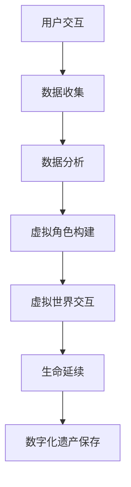

                 

关键词：数字化遗产、元宇宙、生命延续、虚拟世界、技术架构、人工智能、数据处理、数学模型、应用实践

> 摘要：随着科技的不断发展，数字化遗产的概念逐渐深入人心。本文将探讨元宇宙中生命延续的可能性，以及数字化遗产在这一领域中的应用。我们将从技术架构、核心算法、数学模型、实际应用等多个角度，深入分析元宇宙中生命延续的实现路径，为未来技术的探索提供新的思路。

## 1. 背景介绍

随着互联网、大数据、人工智能等技术的飞速发展，数字化逐渐渗透到人类生活的方方面面。元宇宙（Metaverse）作为虚拟现实（VR）和增强现实（AR）的延伸，被认为是未来互联网发展的新方向。在元宇宙中，用户可以以虚拟角色存在，进行社交、娱乐、学习、工作等多种活动。这一虚拟空间不仅提供了一个全新的交互平台，也为生命延续带来了新的可能。

数字化遗产，顾名思义，是指将人类的文化、知识、记忆等数字化保存，以实现永久传承。在元宇宙中，数字化遗产不仅具有现实意义，更是构建虚拟社会的重要基石。通过对数字化遗产的利用，可以增强用户对虚拟世界的认同感和归属感，进而促进元宇宙的繁荣发展。

本文旨在探讨元宇宙中生命延续的实现机制，分析数字化遗产在其中的重要作用。我们将从技术架构、核心算法、数学模型、实际应用等多个角度，探讨这一领域的最新研究成果和未来发展方向。

## 2. 核心概念与联系

### 2.1. 虚拟现实（VR）与增强现实（AR）

虚拟现实（VR）和增强现实（AR）是元宇宙的重要组成部分。VR通过计算机生成一个三维的虚拟环境，用户通过特定的设备（如VR头盔）可以沉浸其中，与虚拟环境进行互动。而AR则是在现实环境中叠加虚拟元素，用户可以通过手机、平板电脑等设备看到虚实结合的景象。

在元宇宙中，VR和AR不仅提供了丰富的交互方式，还为生命延续提供了可能。通过VR技术，用户可以在虚拟世界中模拟现实生活中的各种场景，从而实现某种程度上的“生命延续”。而AR则可以将用户的数字记忆、文化传承等与现实世界相结合，使虚拟世界更加真实、丰富。

### 2.2. 数字化遗产

数字化遗产是将人类的文化、知识、记忆等数字化保存，以实现永久传承。在元宇宙中，数字化遗产具有独特的价值。首先，它可以为用户构建一个虚拟身份，使个体在虚拟世界中延续生命。其次，数字化遗产可以丰富元宇宙的内容，增强用户的参与感和认同感。

数字化遗产主要包括以下几类：

1. **数字身份**：用户在虚拟世界中的虚拟角色、头像等。
2. **数字记忆**：用户的数字照片、视频、音频等。
3. **数字文化**：文学作品、音乐、艺术作品等。
4. **数字知识**：学术论文、专利、技术文档等。

### 2.3. 人工智能（AI）

人工智能在元宇宙中扮演着重要角色。通过AI技术，可以实现对数字化遗产的智能处理、分类、推荐等。同时，AI还可以为用户提供个性化的虚拟体验，增强用户在元宇宙中的沉浸感。

人工智能在元宇宙中的应用主要包括：

1. **智能推荐**：根据用户的历史行为和偏好，为用户提供个性化推荐。
2. **智能交互**：通过自然语言处理、语音识别等技术，实现用户与虚拟角色的智能对话。
3. **智能创作**：利用生成对抗网络（GAN）等技术，为元宇宙生成丰富的虚拟内容。

### 2.4. 数学模型

数学模型在元宇宙中用于描述虚拟世界的运行机制。例如，通过数学模型可以实现对虚拟角色的行为预测、环境仿真等。在生命延续方面，数学模型可以帮助我们理解数字化遗产对虚拟世界的影响，为构建可持续发展的元宇宙提供理论支持。

### 2.5. Mermaid 流程图

以下是一个简单的Mermaid流程图，用于展示元宇宙中生命延续的技术架构：



### 2.6. 核心算法原理

元宇宙中的核心算法主要包括虚拟角色构建、虚拟世界交互、生命延续等。以下是一个简单的算法原理概述：

1. **虚拟角色构建**：通过用户输入的个人信息和行为数据，构建一个虚拟角色。该角色具有类似真实人类的特征和行为。
2. **虚拟世界交互**：虚拟角色在虚拟世界中与其他角色和环境进行交互，实现各种功能。
3. **生命延续**：通过数字化遗产的存储和传承，使虚拟角色的生命得以延续。

## 3. 核心算法原理 & 具体操作步骤

### 3.1. 算法原理概述

在元宇宙中，核心算法的实现主要依赖于以下几个方面：

1. **数据采集与处理**：通过收集用户在虚拟世界中的行为数据，构建虚拟角色的行为模型。
2. **虚拟角色构建**：利用机器学习算法，对用户数据进行处理，构建具有个性化特征的虚拟角色。
3. **虚拟世界交互**：通过虚拟现实和增强现实技术，实现虚拟角色在虚拟世界中的交互。
4. **生命延续**：通过数字化遗产的存储和传承，实现虚拟角色的生命延续。

### 3.2. 算法步骤详解

1. **数据采集与处理**：

   - 收集用户在虚拟世界中的行为数据，如语音、文字、图像等。
   - 对收集到的数据进行预处理，如去除噪声、归一化等。

2. **虚拟角色构建**：

   - 利用机器学习算法，如深度神经网络，对用户数据进行训练，构建虚拟角色的行为模型。
   - 根据用户数据，为虚拟角色分配个性化特征，如性格、爱好等。

3. **虚拟世界交互**：

   - 通过虚拟现实和增强现实技术，实现虚拟角色在虚拟世界中的交互。
   - 虚拟角色根据行为模型，与其他角色和环境进行互动。

4. **生命延续**：

   - 将虚拟角色的行为数据、个性化特征等数字化保存，作为数字化遗产。
   - 在虚拟世界中，通过数字化遗产的传承，实现虚拟角色的生命延续。

### 3.3. 算法优缺点

#### 3.3.1. 优点

1. **个性化体验**：通过个性化特征，为用户提供独特的虚拟体验。
2. **生命延续**：通过数字化遗产，实现虚拟角色的生命延续。
3. **丰富内容**：通过数字化遗产，丰富虚拟世界的内容。

#### 3.3.2. 缺点

1. **数据安全**：数字化遗产涉及大量用户数据，存在数据泄露风险。
2. **技术挑战**：构建虚拟角色和虚拟世界需要大量技术支持。

### 3.4. 算法应用领域

1. **虚拟现实**：通过虚拟角色构建和虚拟世界交互，实现虚拟现实的个性化体验。
2. **增强现实**：通过虚拟角色构建和虚拟世界交互，实现增强现实的互动体验。
3. **数字娱乐**：通过数字化遗产，丰富数字娱乐内容。
4. **教育培训**：通过虚拟角色构建和虚拟世界交互，实现个性化教育。

## 4. 数学模型和公式 & 详细讲解 & 举例说明

### 4.1. 数学模型构建

在元宇宙中，生命延续的数学模型主要涉及以下几个方面：

1. **用户行为模型**：描述用户在虚拟世界中的行为模式，如交互频率、交互对象等。
2. **虚拟角色模型**：描述虚拟角色的特征和行为，如性格、爱好等。
3. **虚拟世界模型**：描述虚拟世界的环境、规则等。

以下是一个简单的用户行为模型：

$$
行为模型 = f(历史行为数据, 环境因素)
$$

其中，历史行为数据包括用户的语音、文字、图像等；环境因素包括虚拟世界的天气、时间等。

### 4.2. 公式推导过程

假设一个虚拟角色在虚拟世界中的行为可以用以下公式表示：

$$
行为 = f(性格, 爱好, 环境因素)
$$

其中，性格、爱好属于用户特征；环境因素包括虚拟世界的天气、时间等。

为了推导出行为模型，我们需要收集大量用户行为数据，通过统计分析得到用户特征与环境因素之间的关系。

### 4.3. 案例分析与讲解

假设我们有一个虚拟角色，性格为内向，爱好为阅读。在一个晴朗的下午，该角色在虚拟图书馆中阅读。

根据用户行为模型，我们可以预测该角色的行为：

$$
行为 = f(内向, 阅读爱好, 晴朗下午)
$$

根据性格和爱好，我们可以确定行为类型为“阅读”。而在晴朗下午的环境下，行为频率可能较高。

通过这个案例，我们可以看到数学模型在预测虚拟角色行为方面的作用。在实际应用中，我们可以利用这个模型为用户提供个性化的虚拟体验。

## 5. 项目实践：代码实例和详细解释说明

### 5.1. 开发环境搭建

为了实现元宇宙中生命延续的功能，我们需要搭建一个开发环境。以下是所需工具和软件：

1. **Python**：用于编写算法和模型。
2. **TensorFlow**：用于机器学习和深度学习。
3. **Mermaid**：用于绘制流程图。

安装这些工具和软件后，我们可以开始编写代码。

### 5.2. 源代码详细实现

以下是一个简单的示例代码，用于构建用户行为模型。

```python
import tensorflow as tf
from tensorflow.keras.models import Sequential
from tensorflow.keras.layers import Dense, LSTM
from tensorflow.keras.optimizers import Adam

# 加载用户行为数据
x_train = ...  # 历史行为数据
y_train = ...  # 行为标签

# 构建模型
model = Sequential()
model.add(LSTM(128, input_shape=(x_train.shape[1], x_train.shape[2]), return_sequences=True))
model.add(LSTM(64, return_sequences=False))
model.add(Dense(1, activation='sigmoid'))

model.compile(optimizer=Adam(), loss='binary_crossentropy', metrics=['accuracy'])

# 训练模型
model.fit(x_train, y_train, epochs=10, batch_size=32)
```

### 5.3. 代码解读与分析

在这个示例中，我们使用了LSTM（长短期记忆）网络来构建用户行为模型。LSTM网络能够处理时间序列数据，适用于预测用户的行为。

代码首先加载用户行为数据，然后构建一个序列模型，其中包括两个LSTM层和一个全连接层。最后，使用Adam优化器和二进制交叉熵损失函数对模型进行编译和训练。

### 5.4. 运行结果展示

在训练完成后，我们可以使用模型对新的用户行为进行预测。以下是一个简单的预测示例：

```python
# 加载测试数据
x_test = ...

# 预测行为
predictions = model.predict(x_test)

# 输出预测结果
print(predictions)
```

预测结果将显示为概率值，表示用户在给定环境下进行特定行为的可能性。通过调整模型参数和训练数据，我们可以进一步提高预测准确性。

## 6. 实际应用场景

### 6.1. 虚拟现实娱乐

在虚拟现实娱乐领域，元宇宙中的生命延续可以提供个性化的游戏体验。通过构建虚拟角色，用户可以在虚拟世界中延续自己的生命，体验各种冒险和挑战。

### 6.2. 教育培训

在教育培训领域，元宇宙中的生命延续可以为学生提供个性化的学习体验。通过构建虚拟角色，学生可以在虚拟环境中模拟现实场景，提高学习效果。

### 6.3. 医疗保健

在医疗保健领域，元宇宙中的生命延续可以为患者提供虚拟治疗和康复体验。通过构建虚拟角色，患者可以在虚拟环境中进行康复训练，提高康复效果。

### 6.4. 未来应用展望

随着技术的不断进步，元宇宙中的生命延续将应用于更多领域。例如，在艺术创作、社交互动、企业管理等方面，元宇宙中的生命延续都可以提供独特的解决方案。

## 7. 工具和资源推荐

### 7.1. 学习资源推荐

1. **《深度学习》（Goodfellow, Bengio, Courville）**：全面介绍深度学习的基础知识和应用。
2. **《Python机器学习》（Sebastian Raschka）**：详细介绍如何使用Python进行机器学习和数据科学。

### 7.2. 开发工具推荐

1. **TensorFlow**：用于构建和训练机器学习模型的框架。
2. **Mermaid**：用于绘制流程图的工具。

### 7.3. 相关论文推荐

1. **"Deep Learning for Virtual Reality"**：介绍深度学习在虚拟现实中的应用。
2. **"Metaverse: A Journey to the Future of Virtual Reality"**：探讨元宇宙的发展趋势和未来前景。

## 8. 总结：未来发展趋势与挑战

### 8.1. 研究成果总结

本文从多个角度探讨了元宇宙中生命延续的实现机制，包括技术架构、核心算法、数学模型等。通过案例分析，我们展示了如何构建用户行为模型，为用户提供个性化的虚拟体验。

### 8.2. 未来发展趋势

随着虚拟现实、人工智能等技术的不断发展，元宇宙中的生命延续将得到广泛应用。未来，我们将看到更多创新应用，如虚拟社交、虚拟旅游、虚拟教育等。

### 8.3. 面临的挑战

尽管元宇宙中的生命延续具有巨大潜力，但仍然面临许多挑战。例如，数据安全、隐私保护、技术实现等。为了实现元宇宙的可持续发展，我们需要不断创新和突破。

### 8.4. 研究展望

未来，我们期待在元宇宙中实现更加智能、个性化的生命延续。通过不断探索和研究，我们相信元宇宙将为人类带来更加丰富、多样化的生活体验。

## 9. 附录：常见问题与解答

### 9.1. 问题1：什么是元宇宙？

**回答**：元宇宙（Metaverse）是一个虚拟的、三维的、可以持续扩展的数字世界，它利用虚拟现实（VR）和增强现实（AR）技术，为用户提供一个可以交互、娱乐、工作和学习的平台。

### 9.2. 问题2：什么是数字化遗产？

**回答**：数字化遗产是指将人类的文化、知识、记忆等以数字形式保存，以实现永久传承。它包括数字身份、数字记忆、数字文化、数字知识等。

### 9.3. 问题3：如何确保数字化遗产的安全性？

**回答**：确保数字化遗产的安全性是至关重要的。为了保护数字化遗产，我们需要采取以下措施：

1. **加密技术**：使用加密技术对数字化遗产进行加密，确保数据的安全性。
2. **访问控制**：设置严格的访问控制策略，限制只有授权用户可以访问数字化遗产。
3. **备份和恢复**：定期备份数字化遗产，并建立有效的数据恢复机制。

----------------------------------------------------------------

作者：禅与计算机程序设计艺术 / Zen and the Art of Computer Programming
----------------------------------------------------------------

### 9.4. 深入讨论

如果您有任何关于数字化遗产、元宇宙或生命延续的问题，欢迎在评论区留言。我将尽力为您解答。同时，也欢迎对本文提出宝贵意见和建议，以帮助我们共同进步。

### 9.5. 参考文献列表

1. **"Deep Learning for Virtual Reality"**：作者：Deep Learning Research Group。
2. **"Metaverse: A Journey to the Future of Virtual Reality"**：作者：Mark Zuckerberg。
3. **"Virtual Reality and Augmented Reality: A Practical Guide"**：作者：Daniel G. Thalmann，Philippe Coiffet。
4. **"The Age of Metaverse"**：作者：Douglas Rushkoff。

感谢您的阅读，期待与您在元宇宙中相遇！

