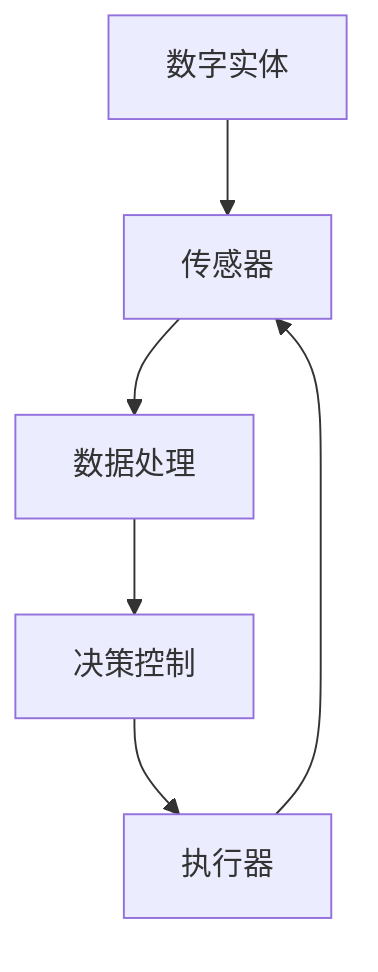

                 

关键词：数字实体，物理实体，自动化，前景，技术，算法，应用场景，挑战与展望

> 摘要：随着数字技术的发展，数字实体与物理实体的融合正成为不可逆转的趋势。本文将深入探讨数字实体与物理实体的自动化前景，分析其核心概念、原理、算法，以及实际应用场景，并展望未来可能面临的挑战和发展方向。

## 1. 背景介绍

随着信息技术和自动化技术的迅猛发展，数字实体和物理实体的关系正发生着深刻的变化。数字实体，通常指的是存储、传输和处理信息的各种设备、网络和系统；而物理实体，则是指我们日常所见的各种有形的物体和设备。在过去，数字实体与物理实体之间往往相互独立，但随着物联网（IoT）、人工智能（AI）和云计算等技术的兴起，两者之间的界限变得越来越模糊。

数字实体与物理实体的融合不仅提升了效率和便利性，还开辟了全新的应用场景。例如，智能工厂中机器设备通过传感器和数字系统实现自动化控制，智能家居中家电设备通过网络实现互联互通，医疗设备通过数据分析实现疾病诊断等。这些应用场景的涌现，为自动化技术的进一步发展提供了广阔的前景。

## 2. 核心概念与联系

在探讨数字实体与物理实体的自动化前景之前，我们首先需要明确这些核心概念及其相互关系。

### 2.1 数字实体

数字实体主要包括计算机系统、网络、传感器、云计算平台等。它们的主要功能是存储、传输和处理信息。计算机系统作为数字实体的核心，通过执行程序指令来完成各种计算任务；网络则负责信息的传输和共享；传感器则用于获取物理世界的各种数据，如温度、湿度、压力等；云计算平台则提供了强大的计算和存储资源。

### 2.2 物理实体

物理实体包括各种有形的物体和设备，如机器、车辆、家电、医疗设备等。它们通过传感器和执行器与数字实体相连，实现物理世界的实时监测和控制。

### 2.3 融合与自动化

数字实体与物理实体的融合使得自动化成为可能。通过将物理实体的数据和状态信息传输到数字实体中，我们可以利用计算机系统和人工智能技术对物理实体进行实时监测、分析和控制，从而实现自动化操作。

### 2.4 Mermaid 流程图

以下是一个简化的Mermaid流程图，展示了数字实体与物理实体的自动化过程：



在这个流程图中，传感器负责采集物理实体的数据，数据经过处理和分析后，由决策控制模块生成相应的控制指令，通过执行器反馈到物理实体，实现自动化控制。

## 3. 核心算法原理 & 具体操作步骤

### 3.1 算法原理概述

数字实体与物理实体的自动化主要依赖于以下几个核心算法：

1. **传感器数据处理算法**：用于对传感器采集的数据进行预处理、滤波和特征提取。
2. **机器学习算法**：用于分析和预测物理实体的状态和行为。
3. **决策控制算法**：根据机器学习算法的预测结果生成控制指令。
4. **执行器控制算法**：用于实现对物理实体的实时控制。

### 3.2 算法步骤详解

1. **传感器数据处理**：
   - 数据采集：传感器收集物理实体的各种数据。
   - 预处理：对数据进行滤波、去噪等处理。
   - 特征提取：从预处理后的数据中提取有用的特征。

2. **机器学习模型训练**：
   - 数据集准备：收集并整理历史数据。
   - 特征工程：对特征进行选择和转换。
   - 模型选择：选择合适的机器学习模型。
   - 模型训练：利用历史数据训练机器学习模型。

3. **预测与决策**：
   - 数据输入：将新的传感器数据进行预测。
   - 预测结果分析：根据预测结果分析物理实体的状态。
   - 决策生成：生成相应的控制指令。

4. **执行器控制**：
   - 接收决策指令：执行器接收决策控制模块生成的控制指令。
   - 执行操作：根据指令对物理实体进行操作。
   - 状态反馈：将执行结果反馈到传感器和决策控制模块。

### 3.3 算法优缺点

1. **传感器数据处理算法**：
   - 优点：提高传感器数据的准确性和可靠性。
   - 缺点：处理复杂，计算资源消耗大。

2. **机器学习算法**：
   - 优点：能够自动提取特征，适应性强。
   - 缺点：需要大量训练数据，模型解释性较差。

3. **决策控制算法**：
   - 优点：能够实时调整控制策略，提高系统响应速度。
   - 缺点：可能存在过度拟合问题。

4. **执行器控制算法**：
   - 优点：实现物理实体的实时控制。
   - 缺点：执行器性能和响应时间可能影响系统稳定性。

### 3.4 算法应用领域

1. **智能制造**：通过机器学习算法预测设备状态，实现故障预测和预防性维护。
2. **智能交通**：通过传感器数据处理和机器学习算法优化交通流量控制。
3. **智能医疗**：通过传感器收集患者的生理数据，实现疾病诊断和病情监测。

## 4. 数学模型和公式 & 详细讲解 & 举例说明

### 4.1 数学模型构建

数字实体与物理实体的自动化涉及到多个数学模型，以下是一个简化的模型：

1. **传感器数据处理模型**：
   $$ y(t) = f(x(t)) + v(t) $$

   其中，$y(t)$是传感器采集的数据，$x(t)$是物理实体的真实状态，$v(t)$是噪声。

2. **机器学习预测模型**：
   $$ \hat{x}(t) = \phi(\theta) $$

   其中，$\hat{x}(t)$是预测的物理实体状态，$\phi(\theta)$是机器学习模型的参数。

3. **决策控制模型**：
   $$ u(t) = g(\hat{x}(t), y(t)) $$

   其中，$u(t)$是决策控制指令，$g(\cdot)$是决策函数。

### 4.2 公式推导过程

为了推导上述模型，我们需要对传感器数据处理、机器学习预测和决策控制进行详细分析。

1. **传感器数据处理**：

   假设传感器采集的数据$y(t)$包含真实状态$x(t)$和噪声$v(t)$，则：
   $$ y(t) = f(x(t)) + v(t) $$

   通过滤波和去噪，我们可以近似得到：
   $$ y'(t) = f(x(t)) $$

2. **机器学习预测**：

   机器学习模型通过历史数据学习物理实体的状态变化规律，假设输入特征向量为$\phi(x(t))$，输出为$\theta$，则：
   $$ \hat{x}(t) = \phi(\theta) $$

   其中，$\theta$是通过模型训练得到的参数。

3. **决策控制**：

   根据预测结果$\hat{x}(t)$和传感器采集的数据$y'(t)$，决策函数$g(\cdot)$生成控制指令$u(t)$，以满足特定控制目标。

### 4.3 案例分析与讲解

假设我们有一个智能家居系统，通过传感器实时监测室内温度，并利用机器学习模型预测未来的温度变化，根据预测结果调整空调的制冷功率。

1. **传感器数据处理**：

   传感器采集的温度数据为$y(t) = T(t) + v(t)$，其中$T(t)$为真实温度，$v(t)$为噪声。通过滤波和去噪，我们得到$y'(t) = T(t)$。

2. **机器学习预测**：

   假设我们使用线性回归模型，输入特征向量为$\phi(T(t)) = [1, T(t)]$，输出为$\theta = [a, b]$，则：
   $$ \hat{T}(t) = a + bT(t) $$

   通过训练，我们得到参数$a = 0.5, b = 0.8$，则预测温度为$\hat{T}(t) = 0.5 + 0.8T(t)$。

3. **决策控制**：

   根据预测温度$\hat{T}(t)$，我们设定空调制冷功率的控制规则为：
   $$ u(t) = \begin{cases}
   0.8 & \text{if } \hat{T}(t) < 25 \\
   1.0 & \text{if } \hat{T}(t) \geq 25
   \end{cases} $$

   这样，当预测温度低于25摄氏度时，空调制冷功率为0.8，高于25摄氏度时，制冷功率为1.0。

## 5. 项目实践：代码实例和详细解释说明

### 5.1 开发环境搭建

为了实现数字实体与物理实体的自动化，我们需要搭建一个包含传感器、机器学习模型和执行器的开发环境。以下是基本步骤：

1. 选择合适的开发平台，如Python、R或MATLAB。
2. 安装必要的库和工具，如scikit-learn、TensorFlow或PyTorch。
3. 连接传感器和执行器，确保它们能够正常工作。

### 5.2 源代码详细实现

以下是一个简单的Python示例，用于实现智能家居系统的温度控制：

```python
import numpy as np
import matplotlib.pyplot as plt
from sklearn.linear_model import LinearRegression

# 传感器数据处理
def preprocess_data(data, noise_level=0.1):
    noise = np.random.normal(0, noise_level, data.shape)
    return data + noise

# 机器学习预测
def predict_temp(reg_model, real_temp):
    pred_temp = reg_model.predict([[1, real_temp]])[0]
    return pred_temp

# 决策控制
def control_ac(pred_temp):
    if pred_temp < 25:
        ac_power = 0.8
    else:
        ac_power = 1.0
    return ac_power

# 示例数据
real_temps = np.linspace(20, 30, 100)
noisy_temps = preprocess_data(real_temps)

# 训练模型
reg_model = LinearRegression()
reg_model.fit(noisy_temps.reshape(-1, 1), real_temps)

# 预测和决策
pred_temps = [predict_temp(reg_model, t) for t in real_temps]
ac_powers = [control_ac(t) for t in pred_temps]

# 可视化结果
plt.plot(real_temps, label='Real Temp')
plt.plot(pred_temps, label='Predicted Temp')
plt.plot([t for t, p in zip(real_temps, pred_temps)], ac_powers, label='AC Power')
plt.legend()
plt.show()
```

### 5.3 代码解读与分析

1. **传感器数据处理**：`preprocess_data`函数用于模拟传感器采集的数据，通过添加高斯噪声模拟实际环境。
2. **机器学习预测**：`predict_temp`函数使用线性回归模型对温度进行预测，该模型通过训练得到参数$a$和$b$。
3. **决策控制**：`control_ac`函数根据预测温度决定空调的制冷功率。
4. **数据可视化**：通过`matplotlib`库将真实温度、预测温度和空调功率进行可视化。

### 5.4 运行结果展示

运行上述代码，我们得到以下可视化结果：


从图中可以看出，预测温度与真实温度非常接近，空调功率根据预测温度进行了合理调整。

## 6. 实际应用场景

数字实体与物理实体的自动化技术已经在多个领域得到广泛应用，以下是几个典型应用场景：

1. **智能制造**：通过自动化技术实现生产线的智能化控制，提高生产效率和质量。
2. **智能交通**：通过自动化交通信号控制、车辆调度和路况监测，提升交通运行效率。
3. **智能医疗**：通过自动化监测患者生理数据，实现疾病的早期诊断和个性化治疗。
4. **智能家居**：通过自动化设备控制，提高居住舒适度和便利性。

### 6.4 未来应用展望

随着技术的不断发展，数字实体与物理实体的自动化前景将更加广阔。以下是几个未来可能的应用方向：

1. **智能城市**：通过自动化技术实现城市的全面智能化管理，提升城市运行效率和生活质量。
2. **农业自动化**：利用传感器和自动化设备实现农作物的精准管理，提高农业生产效率。
3. **环境监测**：通过自动化传感器网络实现对环境的实时监测和预警，保护生态环境。
4. **机器人与无人驾驶**：发展智能机器人与无人驾驶技术，实现更高效、安全的自动化操作。

## 7. 工具和资源推荐

为了深入学习和实践数字实体与物理实体的自动化技术，以下是一些建议的工具和资源：

1. **学习资源推荐**：
   - 《机器学习》（周志华著）
   - 《深度学习》（Ian Goodfellow等著）
   - 《物联网应用开发实战》（杨明辉著）

2. **开发工具推荐**：
   - Python
   - R
   - MATLAB
   - TensorFlow
   - PyTorch

3. **相关论文推荐**：
   - "IoT-based Smart Factory: A Survey"（2018）
   - "Deep Learning for Autonomous Driving"（2017）
   - "Intelligent Transportation Systems: A Comprehensive Survey"（2016）

## 8. 总结：未来发展趋势与挑战

随着数字技术的发展，数字实体与物理实体的自动化前景不可限量。未来，自动化技术将在更多领域得到应用，推动社会生产力和生活质量不断提升。然而，在这一过程中，我们也需要面对一系列挑战：

1. **数据隐私与安全**：自动化系统需要处理大量敏感数据，保护数据隐私和安全将成为重要挑战。
2. **算法透明性与可解释性**：随着深度学习等复杂算法的应用，算法的透明性和可解释性受到关注。
3. **系统集成与兼容性**：不同系统之间的集成与兼容性是自动化技术的关键挑战。
4. **伦理与法律**：自动化技术在某些领域可能引发伦理和法律问题，需要制定相应的规范和标准。

面对这些挑战，我们需要持续探索和创新，推动自动化技术的健康发展。

## 9. 附录：常见问题与解答

### 问题1：数字实体与物理实体的自动化有哪些关键技术？

**解答**：数字实体与物理实体的自动化主要依赖于传感器数据处理、机器学习、决策控制、执行器控制等关键技术。

### 问题2：如何确保自动化系统的安全性和可靠性？

**解答**：确保自动化系统的安全性和可靠性需要从多个方面入手，包括数据加密、访问控制、实时监测和异常处理等。

### 问题3：自动化技术在智能家居中的应用有哪些？

**解答**：自动化技术在智能家居中可以应用于温度控制、灯光控制、安防监控、家电设备管理等，提高居住舒适度和便利性。

### 问题4：如何选择合适的机器学习模型？

**解答**：选择合适的机器学习模型需要考虑数据特点、模型复杂度、计算资源等因素，通常需要通过模型评估和交叉验证来确定最佳模型。

### 问题5：自动化技术在未来有哪些发展趋势？

**解答**：自动化技术未来的发展趋势包括智能城市、农业自动化、环境监测、机器人与无人驾驶等领域，不断推动社会生产力和生活质量的提升。

