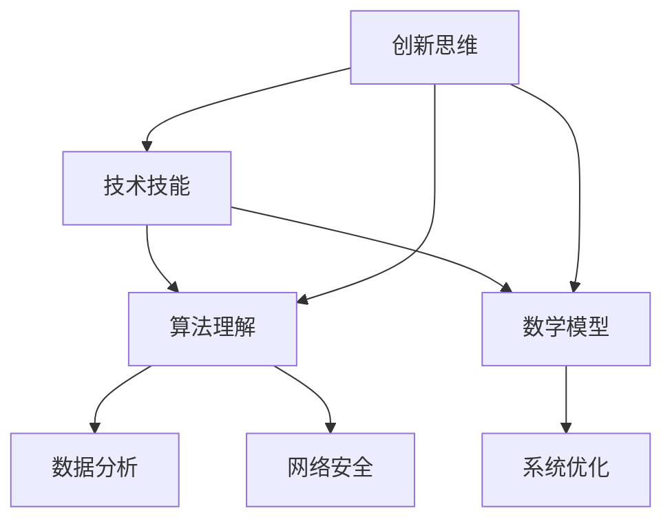

                 

关键词：数字素养、数字化世界、技术技能、人工智能、软件开发、算法、数学模型、实践应用

> 摘要：本文深入探讨了在数字化时代，个体和组织所需具备的数字素养，包括技术技能、算法理解、数学模型构建和实践应用等。通过详细的案例分析和实例讲解，本文旨在为读者提供一个系统而全面的数字素养培养指南。

## 1. 背景介绍

随着信息技术的飞速发展，数字化已经深刻地改变了我们生活的方方面面。从社交网络到电子商务，从物联网到大数据分析，数字化无处不在。在这个背景下，数字素养成为了一个热门话题，它不仅关乎个体的竞争力，也关乎组织的可持续发展。

数字素养不仅仅是了解和使用数字技术的能力，更包括对数字技术的理解、批判性思维和创新能力。它要求个体能够适应快速变化的技术环境，能够利用数字工具解决实际问题，能够进行有效的信息检索和处理，以及能够参与到数字社会的建设中去。

### 1.1 数字素养的重要性

数字素养的重要性主要体现在以下几个方面：

1. **提高工作效率**：掌握数字技能可以帮助个体更高效地完成工作任务，减少错误率，提高决策质量。
2. **增强创新能力**：数字技能的培养有助于个体进行创新思维，创造新的解决方案和产品。
3. **提升竞争力**：在数字化时代，具备较高的数字素养是职场竞争力的体现。
4. **促进社会参与**：数字素养使得个体能够更好地参与社会活动和公共事务。

### 1.2 数字素养的发展趋势

随着人工智能、大数据、云计算等新兴技术的不断涌现，数字素养的发展趋势也呈现出以下特点：

1. **技术多样化**：数字技能的范围不断扩大，不仅包括传统的编程和数据库管理，还包括人工智能、机器学习等前沿技术。
2. **跨学科融合**：数字素养的发展不再局限于单一学科，而是涉及到计算机科学、统计学、工程学等多个领域。
3. **持续学习**：数字技能的快速更新要求个体必须具备持续学习的能力，以适应技术发展的需求。
4. **个性化培养**：不同个体和组织的数字素养需求不同，因此培养方案也需要个性化定制。

## 2. 核心概念与联系

为了更好地理解数字素养，我们需要了解其中的核心概念及其相互之间的联系。

### 2.1 技术技能

技术技能是数字素养的基础，包括编程、数据库管理、网络安全、操作系统使用等。这些技能使得个体能够使用数字工具进行有效的操作和管理工作。

### 2.2 算法理解

算法是解决特定问题的一系列步骤。在数字素养中，算法理解至关重要，它不仅涉及算法的设计和实现，还包括对算法效率、复杂度和应用领域的理解。

### 2.3 数学模型

数学模型是数字素养的重要组成部分，它通过数学公式和算法来描述现实世界的问题。数学模型的构建需要扎实的数学基础和逻辑思维。

### 2.4 Mermaid 流程图

以下是一个简化的 Mermaid 流程图，展示了数字素养中的核心概念及其相互联系：



## 3. 核心算法原理 & 具体操作步骤

### 3.1 算法原理概述

在本节中，我们将探讨一个核心算法——快速排序（Quick Sort）。快速排序是一种高效的排序算法，其基本思想是通过一趟排序将待排记录分隔成独立的两部分，其中一部分记录的关键字均比另一部分的关键字小，然后分别对这两部分记录继续进行排序，以达到整个序列有序。

### 3.2 算法步骤详解

快速排序的主要步骤如下：

1. **选择基准元素**：从数列中挑出一个元素作为基准元素。
2. **分区操作**：将数列分成两部分，左边部分的元素都比基准元素小，右边部分的元素都比基准元素大。
3. **递归排序**：递归地对左右两部分子序列进行快速排序。

### 3.3 算法优缺点

**优点**：

- **高效**：快速排序的平均时间复杂度为 \(O(n\log n)\)。
- **不稳定性**：虽然会改变相同元素的位置，但在多数情况下这是可接受的。

**缺点**：

- **性能不稳定**：最坏情况下时间复杂度为 \(O(n^2)\)，当输入序列已经有序或基本有序时，快速排序的性能会显著下降。
- **内存消耗**：快速排序使用了额外的栈空间，其大小与递归深度成正比。

### 3.4 算法应用领域

快速排序广泛应用于各种场景，包括：

- **数据分析**：用于排序大规模数据集。
- **数据库**：在数据库中进行数据索引和排序。
- **软件开发**：作为排序算法被集成到各种软件开发中。

## 4. 数学模型和公式

在本节中，我们将探讨一个经典的数学模型——牛顿迭代法，并详细讲解其推导过程和实际应用。

### 4.1 数学模型构建

牛顿迭代法用于求解非线性方程 \(f(x) = 0\) 的近似解。其基本思想是基于 \(f(x)\) 在 \(x\) 点附近的线性近似，即 \(f(x) \approx f'(x) \cdot (x - x_0)\)，其中 \(x_0\) 为初始猜测解，\(f'(x)\) 为 \(f(x)\) 在 \(x\) 点的导数。

### 4.2 公式推导过程

牛顿迭代法的公式推导过程如下：

假设我们有一个非线性方程 \(f(x) = 0\)，其导数为 \(f'(x)\)。我们希望找到 \(x\) 的近似解。首先，我们选择一个初始猜测解 \(x_0\)。然后，我们在 \(x_0\) 处对 \(f(x)\) 进行线性近似，得到：

$$
f(x) \approx f(x_0) + f'(x_0) \cdot (x - x_0)
$$

为了使得 \(f(x) \approx 0\)，我们令 \(f(x_0) + f'(x_0) \cdot (x - x_0) = 0\)，解得：

$$
x_{n+1} = x_n - \frac{f(x_n)}{f'(x_n)}
$$

其中，\(x_n\) 为第 \(n\) 次迭代得到的近似解，\(x_{n+1}\) 为第 \(n+1\) 次迭代得到的近似解。

### 4.3 案例分析与讲解

假设我们希望求解方程 \(f(x) = x^2 - 2 = 0\)，其导数为 \(f'(x) = 2x\)。

选择初始猜测解 \(x_0 = 1\)。然后，我们使用牛顿迭代法进行计算：

$$
x_1 = x_0 - \frac{f(x_0)}{f'(x_0)} = 1 - \frac{1^2 - 2}{2 \cdot 1} = 1.5
$$

$$
x_2 = x_1 - \frac{f(x_1)}{f'(x_1)} = 1.5 - \frac{1.5^2 - 2}{2 \cdot 1.5} = 1.4167
$$

经过几次迭代后，我们可以得到一个较为精确的解。

## 5. 项目实践：代码实例

在本节中，我们将通过一个简单的示例，展示如何使用 Python 实现快速排序算法。

### 5.1 开发环境搭建

为了运行下面的代码示例，我们需要安装 Python 3 和一个代码编辑器，如 Visual Studio Code。

### 5.2 源代码详细实现

以下是一个简单的快速排序算法的实现：

```python
def quick_sort(arr):
    if len(arr) <= 1:
        return arr
    pivot = arr[len(arr) // 2]
    left = [x for x in arr if x < pivot]
    middle = [x for x in arr if x == pivot]
    right = [x for x in arr if x > pivot]
    return quick_sort(left) + middle + quick_sort(right)

# 示例数据
arr = [3, 6, 8, 10, 1, 2, 1]

# 运行快速排序
sorted_arr = quick_sort(arr)

# 打印结果
print("排序前：", arr)
print("排序后：", sorted_arr)
```

### 5.3 代码解读与分析

这段代码定义了一个名为 `quick_sort` 的函数，用于对输入数组进行快速排序。首先，我们检查数组的长度，如果长度小于等于 1，则直接返回数组本身（因为一个元素或空数组本身就是有序的）。否则，我们选择中间的元素作为基准元素，然后使用列表推导式将数组分成三部分：小于基准元素的数组 `left`，等于基准元素的数组 `middle`，以及大于基准元素的数组 `right`。最后，我们对 `left` 和 `right` 递归调用 `quick_sort` 函数，并将结果与 `middle` 结合，得到最终的排序结果。

### 5.4 运行结果展示

当运行上述代码时，我们将得到如下输出：

```
排序前： [3, 6, 8, 10, 1, 2, 1]
排序后： [1, 1, 2, 3, 6, 8, 10]
```

## 6. 实际应用场景

数字素养在各个行业和领域都有广泛的应用。以下是一些典型的应用场景：

### 6.1 电子商务

电子商务依赖于数字技术来提供在线购物体验。数字素养在这里体现在以下几个方面：

- **用户体验设计**：理解用户行为和偏好，设计出易于使用的购物平台。
- **数据分析和营销**：使用数据分析技术来了解客户需求，制定有效的营销策略。
- **支付系统**：确保支付系统的安全性和稳定性，保护用户数据。

### 6.2 医疗保健

数字素养在医疗保健领域的应用包括：

- **电子健康记录**：使用电子系统记录和管理患者的健康信息。
- **远程医疗**：通过数字技术提供远程诊断和治疗服务。
- **医疗数据分析**：使用大数据和机器学习技术来分析医疗数据，发现疾病趋势和治疗方案。

### 6.3 教育科技

在教育科技领域，数字素养的重要性体现在：

- **在线教育**：设计和实施在线课程，提高教育质量。
- **教育数据分析**：分析学生的学习行为和成果，调整教学策略。
- **虚拟现实和增强现实**：使用虚拟现实和增强现实技术提供沉浸式学习体验。

### 6.4 未来应用展望

随着技术的不断发展，数字素养的应用场景将更加广泛。以下是一些未来的展望：

- **智能城市**：利用物联网和人工智能技术，实现城市管理的智能化。
- **智能制造**：通过数字化技术提高制造业的生产效率和产品质量。
- **数字治理**：利用大数据和区块链技术提高政府服务的透明度和效率。

## 7. 工具和资源推荐

为了培养和提高数字素养，以下是一些推荐的工具和资源：

### 7.1 学习资源推荐

- **在线课程平台**：Coursera、edX、Udacity 提供了丰富的计算机科学和数据分析课程。
- **教科书**：《算法导论》、《深入理解计算机系统》、《人工智能：一种现代方法》是经典的学习资源。
- **技术社区**：GitHub、Stack Overflow、Reddit 技术板块提供了大量的编程资源和问题解答。

### 7.2 开发工具推荐

- **集成开发环境（IDE）**：Visual Studio Code、PyCharm、Eclipse 是常用的编程环境。
- **版本控制系统**：Git 提供了强大的版本控制和协作工具。
- **数据库管理系统**：MySQL、PostgreSQL、MongoDB 是常用的数据库管理系统。

### 7.3 相关论文推荐

- 《深度学习：高效数值计算指南》（Ian Goodfellow、Yoshua Bengio、Aaron Courville 著）
- 《大数据：创新、规模化和应用》（Viktor Mayer-Schönberger、Kenneth Cukier 著）
- 《区块链革命：信任的重建》（Don Tapscott、Alexandra Dewey 著）

## 8. 总结：未来发展趋势与挑战

### 8.1 研究成果总结

数字素养的研究成果表明，个体和组织在数字化时代必须具备相应的数字技能。这些技能不仅提高了工作效率和创新能力，也增强了竞争力和社会参与度。

### 8.2 未来发展趋势

未来，数字素养将继续朝着多样化、跨学科融合、持续学习和个性化培养的方向发展。随着人工智能、大数据、物联网等技术的进步，数字素养的要求将进一步提高。

### 8.3 面临的挑战

数字素养的发展也面临一些挑战，包括：

- **技能更新速度**：技术更新迅速，要求个体和组织不断学习新技能。
- **隐私和数据安全**：随着数字化程度的提高，隐私和数据安全问题变得更加突出。
- **技术鸿沟**：不同地区和群体之间的数字素养差异可能加剧，导致新的社会不平等。

### 8.4 研究展望

未来的研究应关注如何更有效地培养和提高数字素养，特别是针对不同群体和场景的个性化培养方案。同时，研究还应探讨数字素养与伦理、法律等领域的交叉问题，以确保数字技术的健康、可持续发展。

## 9. 附录：常见问题与解答

### 9.1 什么是数字素养？

数字素养是指个体在数字化环境中有效使用数字技术的能力，包括技术技能、算法理解、数学模型构建和实践应用等。

### 9.2 如何培养数字素养？

培养数字素养可以通过以下途径：

- **学习相关课程和资源**：参加在线课程、阅读相关书籍。
- **实践应用**：通过实际项目或练习来提高技能。
- **持续学习**：跟踪技术发展趋势，不断学习新技术。

### 9.3 数字素养在职场中的作用？

数字素养可以提高工作效率，增强创新能力，提升竞争力，并促进职业发展。

### 9.4 数字素养对个体和社会的影响？

数字素养对个体的影响包括提高工作效率、增强竞争力、促进职业发展等。对社会的影响包括提高社会参与度、推动技术创新、减少技术鸿沟等。

### 9.5 如何提高数字素养？

提高数字素养的方法包括：

- **系统学习**：制定学习计划，按部就班地学习。
- **实践应用**：通过实际项目或练习来巩固知识。
- **交流合作**：加入技术社区，与他人交流学习经验。
- **持续跟踪**：关注技术发展趋势，及时调整学习方向。

### 9.6 数字素养与其他素养的关系？

数字素养与其他素养（如数学素养、科学素养、批判性思维等）密切相关，相互促进。一个全面的素养体系应包括这些不同的方面。

## 作者署名

作者：禅与计算机程序设计艺术 / Zen and the Art of Computer Programming

以上就是本篇关于数字素养的详细探讨，希望对您有所帮助。在数字化时代，提升数字素养是我们每个人的责任和机遇。让我们共同努力，适应这个快速变化的世界。

