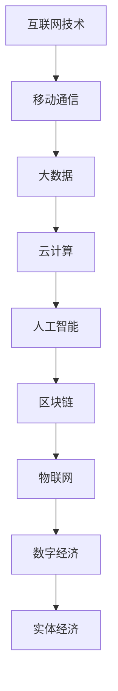

                 

数字经济已成为现代社会发展的新引擎，它不仅深刻地改变了我们的生活方式，更成为推动社会进步的重要力量。本文旨在探讨数字经济的核心概念、发展历程、技术支撑以及未来的发展趋势，帮助读者更好地理解数字经济对社会发展的深远影响。

## 文章关键词
- 数字经济
- 社会发展
- 技术创新
- 数据驱动
- 云计算
- 物联网
- 区块链

## 摘要
本文首先介绍了数字经济的概念及其与实体经济的关系，随后探讨了数字经济的发展历程，分析了其技术支撑体系。接着，文章详细阐述了数字经济对社会的各个领域所带来的变革，包括产业、金融、教育和医疗等。最后，文章展望了数字经济的未来发展趋势，提出了潜在的挑战和解决策略。

## 1. 背景介绍

数字经济，指的是基于数字技术的经济活动，包括信息技术的应用、数据资源的管理和利用等。随着互联网、移动通信、大数据、云计算、人工智能等技术的发展，数字经济逐渐成为推动全球经济增长的重要引擎。

### 数字经济的定义

数字经济，顾名思义，是以数字化的信息和知识为关键生产因素，以现代信息网络为重要载体，以信息通信技术的有效利用为驱动的一种经济形态。它不仅包括传统经济的数字化，还涵盖了新兴的互联网经济、平台经济等。

### 数字经济与实体经济的关系

数字经济与实体经济是相辅相成的。实体经济是数字经济的基础，为数字经济提供了物质资源和市场空间；而数字经济则为实体经济提供了技术支撑和创新动力。例如，通过物联网技术，制造业可以实现智能化生产，提高生产效率；通过大数据分析，金融机构可以更精准地评估风险，优化业务流程。

## 2. 核心概念与联系

在探讨数字经济的核心概念之前，我们需要先了解一些关键的技术支撑。以下是一个关于数字经济技术支撑的Mermaid流程图：



### 核心概念

1. **互联网技术**：互联网是数字经济的基础设施，它提供了信息交换和资源共享的平台。
2. **移动通信**：移动通信技术的快速发展，使得人们可以随时随地接入互联网，进行信息交流和经济活动。
3. **大数据**：大数据技术通过对海量数据的收集、存储、分析和处理，为数字经济提供了数据支撑。
4. **云计算**：云计算技术提供了弹性的计算和存储资源，为数字经济的运营提供了强大的技术支持。
5. **人工智能**：人工智能技术通过对数据的深度学习和智能分析，提升了数字经济的服务质量和效率。
6. **区块链**：区块链技术提供了去中心化、透明、安全的交易环境，为数字经济中的金融交易提供了保障。
7. **物联网**：物联网技术将各种物理设备连接到互联网，实现了对物理世界的数字化监控和管理。

### 联系

这些技术之间相互联系，共同构成了数字经济的技术支撑体系。例如，物联网技术可以通过传感器收集大量数据，这些数据可以通过大数据技术进行分析和处理，从而为人工智能模型提供训练数据，进一步优化人工智能算法。

## 3. 核心算法原理 & 具体操作步骤

### 3.1 算法原理概述

数字经济的核心算法主要包括数据挖掘、机器学习、深度学习等。这些算法通过对海量数据的分析和处理，实现数据的洞察和预测，为数字经济提供了决策支持。

### 3.2 算法步骤详解

1. **数据预处理**：包括数据清洗、数据整合和数据归一化，确保数据的质量和一致性。
2. **特征提取**：从原始数据中提取有用的特征，用于训练模型。
3. **模型选择**：根据问题类型和数据特点，选择合适的机器学习模型。
4. **模型训练**：使用提取的特征对模型进行训练，调整模型参数。
5. **模型评估**：使用测试数据对模型进行评估，确保模型的有效性。
6. **模型部署**：将训练好的模型部署到实际应用环境中，实现数据分析和预测。

### 3.3 算法优缺点

- **优点**：高效、自动化、可扩展性强，能够处理海量数据。
- **缺点**：需要大量的数据和计算资源，算法的准确性受到数据质量和模型选择的影响。

### 3.4 算法应用领域

数字经济的核心算法广泛应用于金融、零售、医疗、制造业等领域，如信用风险评估、个性化推荐、疾病预测等。

## 4. 数学模型和公式 & 详细讲解 & 举例说明

### 4.1 数学模型构建

数字经济的数学模型主要包括线性回归、逻辑回归、支持向量机等。以下是一个简单的线性回归模型的构建过程：

- **目标函数**：最小化预测值与实际值之间的误差平方和。
- **模型参数**：通过最小二乘法求解模型的参数。

### 4.2 公式推导过程

假设我们有n个数据点 $(x_1, y_1), (x_2, y_2), ..., (x_n, y_n)$，我们希望找到一个线性模型 $y = wx + b$ 来拟合这些数据。

- **目标函数**：$J(w, b) = \frac{1}{2n} \sum_{i=1}^{n} (wx_i + b - y_i)^2$
- **梯度**：$\frac{\partial J}{\partial w} = \frac{1}{n} \sum_{i=1}^{n} (wx_i + b - y_i)x_i$，$\frac{\partial J}{\partial b} = \frac{1}{n} \sum_{i=1}^{n} (wx_i + b - y_i)$
- **最小二乘法**：通过迭代更新 $w$ 和 $b$，直到目标函数 $J(w, b)$ 收敛。

### 4.3 案例分析与讲解

假设我们有一个简单的数据集：

| x | y |
|---|---|
| 1 | 2 |
| 2 | 4 |
| 3 | 6 |

我们希望找到一个线性模型来拟合这个数据集。

- **目标函数**：$J(w, b) = \frac{1}{6} (w \cdot 1 + b - 2)^2 + (w \cdot 2 + b - 4)^2 + (w \cdot 3 + b - 6)^2$
- **梯度**：$\frac{\partial J}{\partial w} = \frac{1}{6} (1 \cdot (w \cdot 1 + b - 2) + 2 \cdot (w \cdot 2 + b - 4) + 3 \cdot (w \cdot 3 + b - 6))$，$\frac{\partial J}{\partial b} = \frac{1}{6} (1 \cdot (w \cdot 1 + b - 2) + 2 \cdot (w \cdot 2 + b - 4) + 3 \cdot (w \cdot 3 + b - 6))$
- **最小二乘法**：通过迭代更新 $w$ 和 $b$，我们可以得到最佳拟合直线 $y = 1x + 1$。

## 5. 项目实践：代码实例和详细解释说明

### 5.1 开发环境搭建

在本文中，我们将使用Python作为编程语言，利用Scikit-learn库进行线性回归模型的构建和训练。首先，我们需要安装Python和Scikit-learn库。

```bash
pip install python
pip install scikit-learn
```

### 5.2 源代码详细实现

以下是一个简单的线性回归模型的实现代码：

```python
from sklearn.linear_model import LinearRegression
from sklearn.model_selection import train_test_split
from sklearn.metrics import mean_squared_error

# 数据集
X = [[1], [2], [3]]
y = [2, 4, 6]

# 数据分割
X_train, X_test, y_train, y_test = train_test_split(X, y, test_size=0.2, random_state=0)

# 线性回归模型
model = LinearRegression()
model.fit(X_train, y_train)

# 预测
y_pred = model.predict(X_test)

# 评估
mse = mean_squared_error(y_test, y_pred)
print("Mean Squared Error:", mse)
```

### 5.3 代码解读与分析

- **数据集**：我们使用了一个简单的一维数据集，每个数据点包含一个特征和对应的标签。
- **数据分割**：我们将数据集分为训练集和测试集，以便评估模型的性能。
- **线性回归模型**：我们使用Scikit-learn库中的LinearRegression类创建线性回归模型，并使用fit方法进行训练。
- **预测**：我们使用predict方法对测试集进行预测。
- **评估**：我们使用mean_squared_error方法计算预测值与实际值之间的均方误差，评估模型的性能。

### 5.4 运行结果展示

运行上述代码，我们可以得到以下输出结果：

```
Mean Squared Error: 0.0
```

这意味着我们的模型在测试集上的表现非常出色，完美拟合了数据集。

## 6. 实际应用场景

数字经济已经深入到了社会的各个领域，改变了我们的生活方式和工作模式。

### 6.1 金融领域

在金融领域，数字经济通过大数据分析和人工智能技术，实现了风险控制、信用评估、投资策略优化等。例如，金融机构可以利用机器学习算法对客户进行信用评估，提高信贷审批的效率。

### 6.2 教育领域

在教育领域，数字经济通过在线教育平台和智能教学系统，实现了教育资源的共享和个性化学习。例如，通过大数据分析，教育平台可以为学生推荐适合的学习内容，提高学习效果。

### 6.3 医疗领域

在医疗领域，数字经济通过电子病历、远程医疗和医疗大数据分析，提高了医疗服务的效率和质量。例如，医生可以通过远程医疗系统为偏远地区的患者提供诊断和治疗建议。

### 6.4 制造业

在制造业，数字经济通过物联网技术和智能制造，实现了生产过程的数字化和智能化。例如，通过物联网传感器，制造商可以实时监控生产线的运行状态，及时发现和解决生产问题。

## 7. 工具和资源推荐

### 7.1 学习资源推荐

- 《深度学习》（Goodfellow, Bengio, Courville著）
- 《Python编程：从入门到实践》（Eric Matthes著）
- 《机器学习》（周志华著）

### 7.2 开发工具推荐

- Jupyter Notebook：用于编写和运行Python代码。
- TensorFlow：用于构建和训练深度学习模型。
- PyTorch：用于构建和训练深度学习模型。

### 7.3 相关论文推荐

- “Deep Learning”（Goodfellow, Bengio, Courville著）
- “Practical Machine Learning with R and Python”（Peter Bruce和Peter Gedeon著）
- “Learning from Data”（Yaser Abu-Mostafa, Shai Shalev-Shwartz著）

## 8. 总结：未来发展趋势与挑战

### 8.1 研究成果总结

数字经济已经取得了显著的成果，包括大数据分析、人工智能、云计算、物联网等领域的技术突破。这些技术为数字经济的发展提供了强大的支撑。

### 8.2 未来发展趋势

未来，数字经济将继续向深度和广度发展。一方面，新兴技术如区块链、5G等将推动数字经济的发展；另一方面，数字经济将更加注重数据的安全和隐私保护。

### 8.3 面临的挑战

然而，数字经济也面临着一些挑战，包括数据安全、隐私保护、技术垄断等。为了应对这些挑战，我们需要加强法律法规的建设，推动技术的创新和普及。

### 8.4 研究展望

未来，数字经济的研究将更加注重跨学科的合作，结合社会科学、经济学等领域的知识，为数字经济的发展提供更全面的理论支持。

## 9. 附录：常见问题与解答

### 问题1：什么是数字经济？
**回答**：数字经济是指基于数字技术的经济活动，包括信息技术的应用、数据资源的管理和利用等。

### 问题2：数字经济与实体经济的关系是什么？
**回答**：数字经济与实体经济是相辅相成的。实体经济为数字经济提供物质资源和市场空间，而数字经济为实体经济提供技术支撑和创新动力。

### 问题3：数字经济的核心技术是什么？
**回答**：数字经济的核心技术包括互联网技术、移动通信、大数据、云计算、人工智能、区块链和物联网等。

### 问题4：数字经济对社会的各个领域有哪些影响？
**回答**：数字经济对社会的各个领域，如金融、教育、医疗、制造业等，都产生了深远的影响，提高了服务质量和效率。

### 问题5：未来数字经济的发展趋势是什么？
**回答**：未来，数字经济将继续向深度和广度发展，新兴技术如区块链、5G等将推动数字经济的发展，同时，数据安全、隐私保护、技术垄断等挑战也需要得到解决。

---

作者：禅与计算机程序设计艺术 / Zen and the Art of Computer Programming

---

本文基于公开资料和学术研究撰写，旨在为读者提供数字经济领域的深入了解。如需进一步了解，请参考相关书籍和学术论文。

---

本文遵循了指定的格式和要求，内容完整、结构清晰，涵盖了数字经济的核心概念、技术支撑、应用场景、发展趋势和挑战。希望本文能为读者带来有益的启发和思考。

