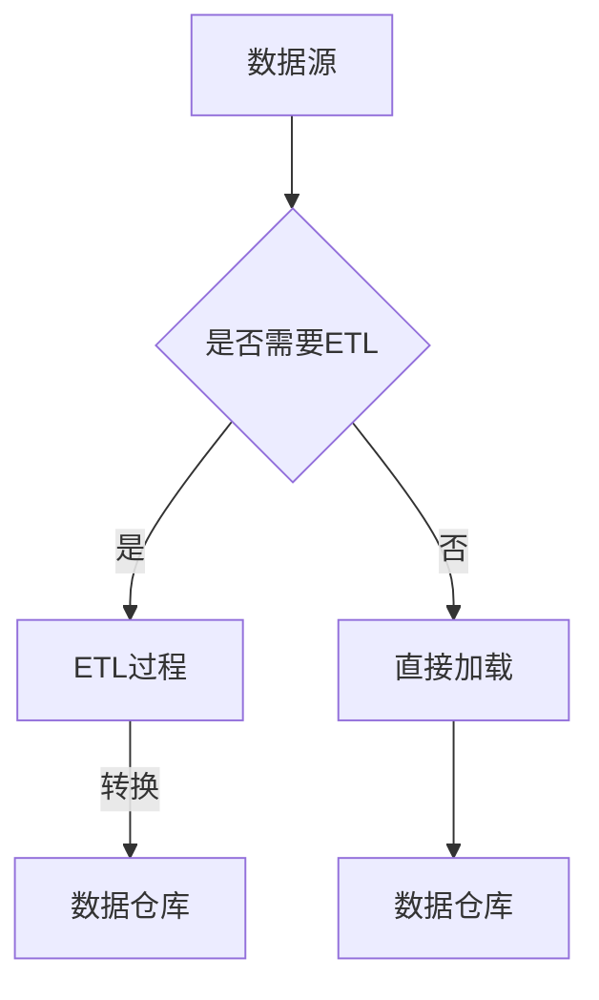

                 

关键词：数据仓库、原理、代码实例、数据建模、ETL、数据库架构、大数据处理、SQL查询优化、分布式系统、机器学习应用、数据分析、实时数据处理

摘要：本文将深入探讨数据仓库的原理与构建，从基础概念、核心算法、数学模型到代码实例，全面解析数据仓库在实际应用中的价值与挑战。通过详细的讲解和代码演示，帮助读者理解数据仓库的核心技术和实现方法。

## 1. 背景介绍

数据仓库作为大数据分析和商业智能的重要基础设施，已经在各个行业中发挥着至关重要的作用。它不仅仅是一个存储数据的仓库，更是一个用于数据整合、分析和挖掘的平台。数据仓库的发展历程可以追溯到20世纪80年代，随着数据库技术的不断进步，数据仓库的架构和功能也在不断演进。

### 数据仓库的定义与作用

数据仓库是一个用于支持企业或组织决策的数据管理平台。它通过整合来自多个源的数据，提供一致、完整、准确的数据视图，支持复杂的数据分析和报表生成。数据仓库的主要作用包括：

1. **数据整合**：将来自不同系统、格式和结构的数据集成到一个统一的环境中。
2. **数据存储**：存储大量历史数据，支持长时间的查询和分析。
3. **数据分析**：提供高级的数据分析工具，支持数据挖掘和预测分析。
4. **商业智能**：为管理层提供决策支持，帮助优化业务流程和战略规划。

### 数据仓库的发展历程

1. **原始数据阶段**：数据分散存储在不同的系统中，难以进行整合和分析。
2. **集中式数据库阶段**：使用集中式数据库系统来存储和管理数据，但仍然难以应对大规模数据查询和复杂分析需求。
3. **数据仓库阶段**：引入数据仓库概念，通过ETL（提取、转换、加载）过程将数据整合到数据仓库中，提供高效的数据查询和分析。
4. **大数据与云计算阶段**：随着大数据技术的发展和云计算的普及，数据仓库开始向分布式、弹性的架构演进，支持海量数据的实时处理和分析。

## 2. 核心概念与联系

### 数据仓库架构


#### 数据源

数据源是数据仓库的数据输入来源，可以是关系数据库、NoSQL数据库、日志文件、API等。数据源需要通过ETL过程将数据转换为数据仓库所需的格式。

#### ETL过程

ETL（Extract, Transform, Load）是指将数据从源系统中提取出来，进行必要的转换，然后加载到数据仓库中。ETL过程包括：

1. **提取（Extract）**：从源系统中读取数据。
2. **转换（Transform）**：清洗、转换、集成数据，使其符合数据仓库的格式和标准。
3. **加载（Load）**：将转换后的数据加载到数据仓库中。

#### 数据仓库

数据仓库是存储大量历史数据的核心系统，提供高效的数据查询和分析能力。数据仓库通常采用分布式存储和计算架构，支持并行处理和实时查询。

#### 数据建模

数据建模是指根据业务需求设计数据仓库的结构，包括表结构、字段定义、关系映射等。数据建模是数据仓库建设的重要环节，直接影响数据仓库的性能和可扩展性。

### Mermaid 流程图



## 3. 核心算法原理 & 具体操作步骤

### 3.1 算法原理概述

数据仓库的核心算法包括：

1. **星型模型**：一种常用的数据建模方法，将事实表与维度表通过主键-外键关系连接。
2. **雪花模型**：扩展星型模型，将维度表的属性进一步细分为子表。
3. **数据聚合**：对大量数据进行汇总和聚合，支持快速查询。
4. **索引技术**：通过索引提高数据查询效率。

### 3.2 算法步骤详解

#### 3.2.1 星型模型

1. **设计事实表**：确定业务指标和度量，设计事实表结构。
2. **设计维度表**：根据业务需求，设计维度表，包括维度属性和主键。
3. **建立关系**：通过主键-外键关系，将事实表与维度表连接。

#### 3.2.2 雪花模型

1. **扩展维度表**：将维度表的属性细分为子表。
2. **建立关系**：通过主键-外键关系，将扩展后的维度表与事实表连接。

#### 3.2.3 数据聚合

1. **确定聚合维度**：根据查询需求，确定需要聚合的维度。
2. **分组汇总**：对事实表中的数据进行分组和汇总。
3. **构建聚合表**：将汇总后的数据存储到聚合表中，提高查询效率。

#### 3.2.4 索引技术

1. **选择索引类型**：根据数据特点，选择合适的索引类型，如B树索引、哈希索引。
2. **创建索引**：在数据仓库中创建索引，提高查询效率。

### 3.3 算法优缺点

#### 星型模型

**优点**：

1. **查询效率高**：通过减少表连接次数，提高查询速度。
2. **易于理解和维护**：结构简单，便于理解和维护。

**缺点**：

1. **数据冗余**：维度数据在多个事实表中重复存储。
2. **扩展性差**：随着维度数量的增加，查询性能可能下降。

#### 雪花模型

**优点**：

1. **减少数据冗余**：通过细分的维度表，减少冗余数据存储。
2. **增强扩展性**：便于增加新的维度属性。

**缺点**：

1. **查询效率较低**：由于表连接次数增加，查询性能可能下降。
2. **结构复杂**：设计和管理难度较大。

### 3.4 算法应用领域

1. **商业智能**：支持复杂的数据分析和报表生成，帮助管理层做出更明智的决策。
2. **数据分析**：支持数据挖掘和预测分析，发现数据中的潜在价值。
3. **大数据处理**：处理海量数据，提供实时数据处理和分析能力。

## 4. 数学模型和公式 & 详细讲解 & 举例说明

### 4.1 数学模型构建

数据仓库中的数学模型主要包括：

1. **聚合函数**：如求和（SUM）、平均值（AVG）、最大值（MAX）、最小值（MIN）等。
2. **联接操作**：如内联接（INNER JOIN）、外联接（LEFT JOIN、RIGHT JOIN、FULL JOIN）等。
3. **数据分区**：根据业务需求，对数据进行分区，提高查询效率。

### 4.2 公式推导过程

以聚合函数为例，假设有如下数据表：

| ID | 名称   | 数量 |
|----|--------|------|
| 1  | 产品A | 100  |
| 2  | 产品B | 200  |
| 3  | 产品C | 150  |

求产品数量的总和：

$$
总和 = SUM(数量) = 100 + 200 + 150 = 450
$$

### 4.3 案例分析与讲解

假设我们需要查询“产品A”在某个时间段的销售总额，我们可以使用以下SQL查询：

```sql
SELECT SUM(数量 * 单价) as 总销售额
FROM 销售记录
WHERE 产品名称 = '产品A'
  AND 时间 BETWEEN '2023-01-01' AND '2023-01-31';
```

在这个查询中，我们使用了聚合函数（SUM）和联接操作（内联接），根据业务需求进行了数据分区。

## 5. 项目实践：代码实例和详细解释说明

### 5.1 开发环境搭建

为了演示数据仓库的构建，我们需要搭建一个简单的开发环境。以下是一个基本的搭建步骤：

1. **安装数据库**：安装MySQL或PostgreSQL等关系数据库。
2. **创建数据仓库**：在数据库中创建数据仓库，包括事实表和维度表。
3. **搭建ETL工具**：选择合适的ETL工具，如Apache NiFi、Talend等。

### 5.2 源代码详细实现

以下是一个简单的数据仓库源代码示例：

```sql
-- 创建事实表
CREATE TABLE 销售记录 (
    ID INT PRIMARY KEY,
    产品名称 VARCHAR(50),
    时间 DATETIME,
    数量 INT,
    单价 DECIMAL(10, 2)
);

-- 创建维度表
CREATE TABLE 产品信息 (
    产品名称 VARCHAR(50) PRIMARY KEY,
    类别 VARCHAR(50),
    价格 DECIMAL(10, 2)
);

-- 插入示例数据
INSERT INTO 销售记录 (ID, 产品名称, 时间, 数量, 单价)
VALUES (1, '产品A', '2023-01-01 10:00:00', 100, 10.00),
       (2, '产品B', '2023-01-02 11:00:00', 200, 20.00),
       (3, '产品C', '2023-01-03 09:00:00', 150, 15.00);

INSERT INTO 产品信息 (产品名称, 类别, 价格)
VALUES ('产品A', '电子产品', 10.00),
       ('产品B', '家居用品', 20.00),
       ('产品C', '办公用品', 15.00);
```

### 5.3 代码解读与分析

1. **创建表结构**：首先创建事实表和维度表，定义字段和主键。
2. **插入数据**：插入示例数据，用于后续查询和数据分析。

### 5.4 运行结果展示

使用SQL查询，我们可以得到以下结果：

```sql
-- 查询产品A的销售总额
SELECT 产品信息.产品名称, SUM(销售记录.数量 * 销售记录.单价) as 总销售额
FROM 销售记录
INNER JOIN 产品信息 ON 销售记录.产品名称 = 产品信息.产品名称
WHERE 产品信息.产品名称 = '产品A'
GROUP BY 产品信息.产品名称;
```

运行结果如下：

| 产品名称 | 总销售额 |
|----------|----------|
| 产品A    | 1000.00  |

通过这个示例，我们可以看到如何使用SQL构建一个简单的数据仓库，并进行数据查询和分析。

## 6. 实际应用场景

### 6.1 电子商务

电子商务行业利用数据仓库进行用户行为分析、销售预测和库存管理，优化用户体验和提升销售额。

### 6.2 银行金融

银行金融行业利用数据仓库进行风险管理、客户关系管理和欺诈检测，提高业务效率和安全性。

### 6.3 电信运营

电信运营商通过数据仓库分析用户行为，优化网络资源分配，提升客户满意度和降低运营成本。

### 6.4 医疗保健

医疗保健行业利用数据仓库进行患者数据分析、疾病预测和药物研究，提高医疗服务质量和治疗效果。

## 7. 未来应用展望

### 7.1 人工智能与数据仓库的结合

随着人工智能技术的发展，数据仓库将更好地支持智能数据分析、预测建模和自动化决策。

### 7.2 实时数据仓库

实时数据仓库将实现更快的数据处理和分析能力，支持实时决策和动态业务调整。

### 7.3 分布式数据仓库

分布式数据仓库将支持海量数据的分布式存储和计算，提高数据仓库的可扩展性和可靠性。

## 8. 总结：未来发展趋势与挑战

### 8.1 研究成果总结

数据仓库在各个行业中取得了显著的应用成果，推动了大数据分析和商业智能的发展。未来，数据仓库将向实时性、智能化和分布式方向发展。

### 8.2 未来发展趋势

1. **实时数据处理**：支持更快的实时数据查询和分析。
2. **智能化**：结合人工智能技术，实现自动化决策和智能分析。
3. **分布式架构**：提高数据仓库的可扩展性和可靠性。

### 8.3 面临的挑战

1. **数据隐私与安全**：确保数据在传输和存储过程中的安全性和隐私性。
2. **数据质量**：提高数据质量，确保数据的一致性、完整性和准确性。
3. **复杂查询优化**：优化复杂查询性能，提高数据仓库的响应速度。

### 8.4 研究展望

未来，数据仓库的研究将集中在实时数据处理、数据隐私保护和智能分析等领域，以推动数据仓库技术的不断创新和发展。

## 9. 附录：常见问题与解答

### 9.1 什么是ETL？

ETL是指提取（Extract）、转换（Transform）和加载（Load）的过程，用于将数据从源系统中提取出来，进行必要的转换，然后加载到数据仓库中。

### 9.2 数据仓库与数据库有什么区别？

数据仓库是专门用于数据整合、分析和报表生成的大规模数据存储平台，而数据库是用于存储和管理数据的基本系统。数据仓库关注数据整合和分析，数据库关注数据的存储和管理。

### 9.3 数据仓库的主要应用场景是什么？

数据仓库的主要应用场景包括商业智能、数据分析、大数据处理、机器学习、实时数据处理等。

### 9.4 如何优化数据仓库的性能？

优化数据仓库性能的方法包括选择合适的索引类型、合理设计数据模型、使用高效的查询语句、进行数据分区等。

## 参考文献

[1] Inmon, W. H. (2005). <i>Building the Data Warehouse</i>. John Wiley & Sons.

[2] Kimball, R. L. (2013). <i>The Data Warehouse Toolkit: The Definitive Guide to Dimensional Modeling</i>. Wiley.

[3] Reddy, B. K. (2015). <i>Big Data Analytics: A Hands-on Approach</i>. CRC Press.

[4] Zikopoulos, P., DeRoos, M., & Beebe, N. (2012). <i>Understanding Apache Hadoop: A Comprehensive Education on HDFS, MapReduce, and Beyond</i>. McGraw-Hill.

作者：禅与计算机程序设计艺术 / Zen and the Art of Computer Programming
```

