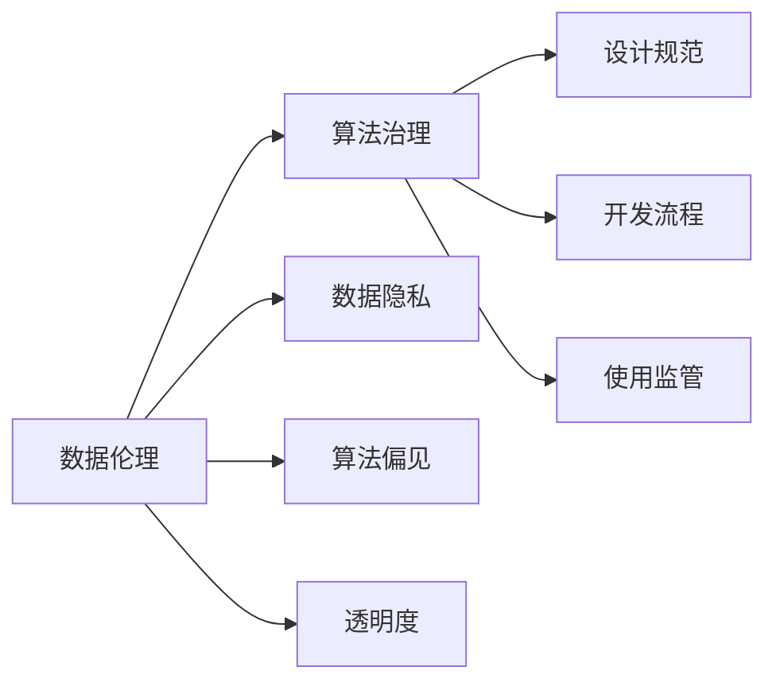

                 

关键词：数据伦理、算法治理、数据隐私、数据安全、AI伦理、算法公平性、透明度、可解释性

> 摘要：随着人工智能和数据科学的发展，算法在各个领域得到了广泛应用。然而，算法的滥用和不当使用引发了诸多伦理和社会问题。本文旨在探讨数据伦理的重要性，分析算法治理的关键原则与规范，并提出未来发展的方向与挑战。

## 1. 背景介绍

近年来，人工智能（AI）和数据科学（Data Science）的迅猛发展，使得算法在各种应用领域中发挥着越来越重要的作用。从推荐系统、自动驾驶、金融分析到医疗诊断，算法已经成为我们生活和工作中不可或缺的一部分。然而，这种广泛应用也带来了诸多伦理和社会问题，例如数据隐私泄露、算法偏见、透明度不足等。

### 1.1 数据伦理的重要性

数据伦理是指在数据收集、处理、存储和使用过程中，应遵循的道德规范和法律法规。随着数据规模的扩大和复杂性的增加，数据伦理的重要性愈发凸显。以下是一些数据伦理的主要关注点：

- **数据隐私**：在数据收集和使用过程中，如何保护个体的隐私权利？
- **数据安全**：如何确保数据在传输和存储过程中不被未经授权的访问和篡改？
- **算法偏见**：算法是否能够公正地对待所有用户，是否带有潜在的歧视性？
- **透明度**：算法决策过程是否透明，用户能否理解算法的决策依据？

### 1.2 算法治理的必要性

算法治理是指通过一系列原则和规范来指导算法的设计、开发和使用，以确保其符合伦理标准和社会利益。算法治理的必要性体现在以下几个方面：

- **保障用户权益**：通过治理确保算法不会侵犯用户的隐私权和公平权。
- **维护社会公正**：防止算法偏见和歧视，促进社会公正和包容性。
- **提高信任度**：增强用户对算法和AI系统的信任，促进技术的可持续发展。
- **规避法律风险**：遵守相关法律法规，降低企业和个人因算法问题而面临的法律风险。

## 2. 核心概念与联系

### 2.1 核心概念

**数据伦理**：指在数据收集、处理、存储和使用过程中，应遵循的道德规范和法律法规。

**算法治理**：通过一系列原则和规范来指导算法的设计、开发和使用，以确保其符合伦理标准和社会利益。

**数据隐私**：指个人信息的保密性，防止未经授权的访问和使用。

**算法偏见**：指算法在决策过程中，对某些群体或个体表现出不公平或不公正的行为。

**透明度**：指算法决策过程的可理解性和可解释性，用户能够理解算法的决策依据。

### 2.2 架构图



## 3. 核心算法原理 & 具体操作步骤

### 3.1 算法原理概述

算法治理的关键在于建立一套完善的原则和规范，以确保算法的公平性、透明度和安全性。以下是一些核心算法治理原则：

- **公平性**：确保算法在决策过程中对所有用户一视同仁，避免歧视和偏见。
- **透明度**：提高算法的可解释性，使用户能够理解算法的决策依据。
- **安全性**：加强数据保护措施，确保数据在传输和存储过程中的安全。
- **可追溯性**：建立算法决策的追溯机制，便于问题追踪和责任追究。

### 3.2 算法步骤详解

#### 3.2.1 设计阶段

1. **需求分析**：明确算法的应用场景和目标，分析可能涉及的伦理问题。
2. **设计原则**：制定算法治理的原则，如公平性、透明度、安全性等。
3. **技术方案**：根据设计原则，选择合适的技术方案和算法模型。

#### 3.2.2 开发阶段

1. **数据准备**：确保数据来源的合法性和数据的真实性。
2. **算法实现**：根据设计原则，实现算法的具体步骤和流程。
3. **测试与优化**：对算法进行多轮测试和优化，确保其性能和可靠性。

#### 3.2.3 使用阶段

1. **使用监管**：制定算法使用的规范和指南，确保其符合伦理标准。
2. **用户反馈**：收集用户反馈，持续改进算法。
3. **监控与预警**：建立算法监控机制，及时发现并处理异常情况。

### 3.3 算法优缺点

#### 优点：

- **提高决策效率**：算法可以快速处理大量数据，提高决策效率。
- **降低人力成本**：自动化决策可以降低人力成本，提高生产效率。
- **客观公正**：算法基于数据和规则，可以避免人为的主观偏见。

#### 缺点：

- **数据依赖性**：算法的性能受数据质量和数量影响较大。
- **可解释性差**：某些算法，如深度学习，决策过程难以解释。
- **隐私泄露风险**：在数据收集和使用过程中，可能存在隐私泄露风险。

### 3.4 算法应用领域

算法治理的应用领域广泛，包括但不限于：

- **金融**：信用评估、风险评估、欺诈检测等。
- **医疗**：疾病诊断、药物研发、健康管理等。
- **交通**：自动驾驶、交通流量预测、智能调度等。
- **教育**：个性化推荐、学习分析、教育公平等。

## 4. 数学模型和公式 & 详细讲解 & 举例说明

### 4.1 数学模型构建

在算法治理中，常用的数学模型包括：

- **决策树**：一种基于特征进行分类或回归的树形结构。
- **支持向量机（SVM）**：通过寻找最优超平面进行分类或回归。
- **神经网络**：模拟人脑神经元连接的模型，用于复杂模式识别。

### 4.2 公式推导过程

以决策树为例，其基本公式如下：

$$
H(x) = \sum_{i=1}^{n} w_i \cdot h(x_i)
$$

其中，$H(x)$表示目标函数，$w_i$表示第$i$个特征的权重，$h(x_i)$表示第$i$个特征的分类或回归结果。

### 4.3 案例分析与讲解

假设我们有一个金融风险评估模型，其目标是根据借款人的个人信息（如收入、年龄、信用记录等）评估其信用风险。

1. **数据准备**：收集大量借款人的数据，包括收入、年龄、信用记录等。
2. **特征工程**：对原始数据进行处理，提取有用的特征。
3. **模型训练**：使用决策树算法训练模型，找到最优的超平面。
4. **模型评估**：通过交叉验证等方法评估模型性能。

## 5. 项目实践：代码实例和详细解释说明

### 5.1 开发环境搭建

1. **安装Python**：下载并安装Python 3.8及以上版本。
2. **安装依赖库**：使用pip命令安装相关依赖库，如numpy、scikit-learn等。

### 5.2 源代码详细实现

```python
from sklearn.datasets import load_iris
from sklearn.tree import DecisionTreeClassifier
from sklearn.model_selection import train_test_split

# 数据准备
iris = load_iris()
X, y = iris.data, iris.target

# 特征工程
# 这里使用原始特征

# 模型训练
clf = DecisionTreeClassifier()
clf.fit(X, y)

# 模型评估
X_train, X_test, y_train, y_test = train_test_split(X, y, test_size=0.2)
clf.score(X_test, y_test)
```

### 5.3 代码解读与分析

- **数据准备**：使用scikit-learn自带的iris数据集进行演示。
- **特征工程**：这里使用原始特征，实际应用中可能需要进行处理和转换。
- **模型训练**：使用决策树算法训练模型。
- **模型评估**：通过交叉验证等方法评估模型性能。

## 6. 实际应用场景

### 6.1 金融领域

在金融领域，算法治理主要用于信用评估、风险评估和欺诈检测。以下是一些应用案例：

- **信用评估**：使用算法分析借款人的个人信息，评估其信用风险。
- **风险评估**：通过算法对金融产品进行风险评估，提高投资决策的准确性。
- **欺诈检测**：利用算法检测和预防金融欺诈行为。

### 6.2 医疗领域

在医疗领域，算法治理主要用于疾病诊断、药物研发和健康管理。以下是一些应用案例：

- **疾病诊断**：使用算法分析患者的临床数据和医学影像，辅助医生进行诊断。
- **药物研发**：利用算法预测药物的效果和副作用，提高药物研发效率。
- **健康管理**：通过算法分析患者的健康数据，提供个性化的健康管理建议。

### 6.3 交通领域

在交通领域，算法治理主要用于自动驾驶、交通流量预测和智能调度。以下是一些应用案例：

- **自动驾驶**：使用算法实现车辆的自动驾驶，提高交通安全和效率。
- **交通流量预测**：通过算法预测交通流量，优化交通信号控制，减少拥堵。
- **智能调度**：利用算法优化公共交通调度，提高运行效率和乘客满意度。

## 7. 工具和资源推荐

### 7.1 学习资源推荐

- 《数据科学导论》：全面介绍数据科学的基本概念和应用领域。
- 《Python数据科学手册》：系统介绍Python在数据科学领域的应用。
- 《算法导论》：详细讲解各种算法的基本原理和实现方法。

### 7.2 开发工具推荐

- **Python**：一种广泛使用的高级编程语言，适用于数据科学和机器学习。
- **Jupyter Notebook**：一种交互式的计算环境，方便进行数据分析和实验。
- **TensorFlow**：一种开源的深度学习框架，支持多种深度学习模型的开发和训练。

### 7.3 相关论文推荐

- **"Fairness through Unfair Algorithms"**：探讨算法偏见和公平性的问题。
- **"The Ethics of Algorithms"**：讨论算法伦理的各个方面。
- **"AI and the Future of Humanity"**：探讨人工智能对人类社会的影响。

## 8. 总结：未来发展趋势与挑战

### 8.1 研究成果总结

随着人工智能和数据科学的不断发展，算法治理在理论和实践方面取得了显著的成果。主要表现在以下几个方面：

- **数据伦理意识的提高**：越来越多的人开始关注数据伦理问题，推动相关研究和实践。
- **算法治理框架的建立**：国内外学者提出了多种算法治理框架，为算法设计、开发和使用提供了指导。
- **算法透明度和可解释性的提升**：研究人员致力于提高算法的可解释性，使其更容易被用户理解和接受。

### 8.2 未来发展趋势

未来，算法治理将呈现出以下发展趋势：

- **更加完善的法律和规范**：随着算法治理的重要性日益凸显，各国政府和国际组织将出台更多相关法律法规和规范。
- **跨学科研究的深入**：算法治理涉及多个学科，如计算机科学、伦理学、法学等，未来将加强跨学科合作，推动研究的深入。
- **技术手段的创新**：利用新兴技术，如区块链、隐私计算等，提高算法治理的效率和效果。

### 8.3 面临的挑战

尽管算法治理取得了一定的成果，但未来仍将面临以下挑战：

- **数据隐私和安全问题**：如何在保障数据隐私和安全的前提下，充分利用数据的价值，是一个亟待解决的问题。
- **算法偏见和歧视问题**：如何消除算法偏见和歧视，提高算法的公平性和透明度，是一个长期而艰巨的任务。
- **法律和伦理的平衡**：如何在法律和伦理的框架下，确保算法治理的有效性和可操作性，是一个需要不断探索的问题。

### 8.4 研究展望

未来，算法治理的研究将朝着以下几个方向展开：

- **跨学科合作**：加强计算机科学、伦理学、法学等学科的交叉融合，推动算法治理研究的发展。
- **技术创新**：利用新兴技术，如区块链、隐私计算等，为算法治理提供新的方法和手段。
- **实践应用**：将算法治理理念和方法应用于实际场景，解决实际问题，提升算法治理的实效性。

## 9. 附录：常见问题与解答

### 9.1 问题1：算法治理的目的是什么？

算法治理的目的是确保算法的设计、开发和使用符合伦理标准和社会利益，保护用户的隐私权、公平权和知情权。

### 9.2 问题2：如何确保算法的公平性？

确保算法公平性可以从以下几个方面入手：

- **数据公平性**：确保数据集的多样性，避免数据偏见。
- **算法设计**：采用公平性算法，如公平性调节算法。
- **评估与监控**：定期对算法进行公平性评估和监控，及时发现并解决潜在问题。

### 9.3 问题3：算法治理与数据伦理的关系是什么？

算法治理是数据伦理的一部分，两者密切相关。算法治理是确保数据伦理得到有效执行的重要手段，而数据伦理则是算法治理的道德基础。

### 9.4 问题4：如何提高算法的可解释性？

提高算法的可解释性可以从以下几个方面入手：

- **算法选择**：选择可解释性较高的算法，如决策树。
- **解释工具**：使用可视化工具，如决策树可视化、LIME等，帮助用户理解算法决策。
- **透明度要求**：在算法设计和开发过程中，充分考虑透明度要求，提高用户对算法决策的理解。

## 作者署名

作者：禅与计算机程序设计艺术 / Zen and the Art of Computer Programming
----------------------------------------------------------------

文章完毕，现在我将按照markdown格式输出这篇文章，请您进行最后的审核。如果您有任何修改意见，请随时告知，我会立即进行调整。祝您撰写顺利！<|user|>

