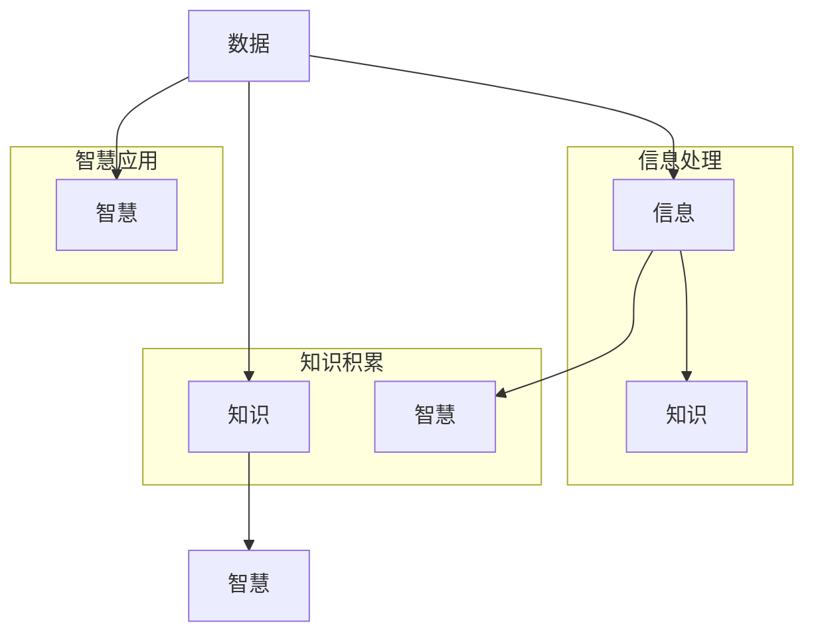

                 

在信息技术飞速发展的今天，数据、信息、知识、智慧这四个概念已经被广泛讨论，但它们之间的界限往往模糊不清。本文将深入探讨这四个概念的本质及其相互关系，通过逻辑清晰、结构紧凑的阐述，帮助读者理解它们在认知过程中的重要性。

## 关键词

- 数据
- 信息
- 知识
- 智慧
- 认知过程
- 信息技术

## 摘要

本文将分析数据、信息、知识、智慧这四个核心概念，并探讨它们在人类认知过程中的作用和相互关系。通过阐述核心概念、算法原理、数学模型、实践应用等多个方面，本文旨在为读者提供一个全面、系统的认识框架。

## 1. 背景介绍

随着互联网的普及和大数据技术的发展，数据已经成为现代社会的重要资源。然而，从数据到智慧这一过程并非一蹴而就，它涉及到多个层次和环节。信息、知识和智慧是连接数据与决策的关键环节，对它们的理解和掌握，对于提升个人和组织的能力至关重要。

### 1.1 数据的重要性

数据是信息、知识和智慧的基石。在现代社会，数据无处不在，它们来源于各种来源，如传感器、用户行为、社交网络等。有效的数据处理和分析能够为企业和个人提供宝贵的洞察，从而做出更明智的决策。

### 1.2 信息的作用

信息是对数据的加工和解读，它使得数据变得有意义。信息能够帮助我们了解当前状况、预测未来趋势，从而为决策提供依据。信息的传递和利用是知识管理和智慧挖掘的基础。

### 1.3 知识的价值

知识是信息积累和整合的结果，它反映了人类对事物的理解和认知。知识不仅能够提高个人的能力，还能够促进团队协作和创新。在信息化社会中，知识的获取、共享和应用已经成为重要的竞争优势。

### 1.4 智慧的意义

智慧是对知识的深层次理解和运用，它是人类认知的高级阶段。智慧能够帮助我们解决复杂问题，创造新的价值。在人工智能和大数据时代，智慧成为了推动社会进步的重要动力。

## 2. 核心概念与联系

为了更好地理解数据、信息、知识、智慧这四个概念，我们可以借助Mermaid流程图，展示它们之间的相互关系。



### 2.1 数据

数据是客观存在的、可以被量化和测量的信息。数据本身没有意义，只有经过加工和处理，才能转化为有用的信息。

### 2.2 信息

信息是对数据的解释和加工，它反映了数据的内在规律和特征。信息不仅包括事实和数字，还包括意义和关联。

### 2.3 知识

知识是信息积累和整合的结果，它反映了人类对事物的理解和认知。知识通常以概念、原理、规则等形式存在。

### 2.4 智慧

智慧是对知识的深层次理解和运用，它是人类认知的高级阶段。智慧能够帮助我们解决复杂问题，创造新的价值。

## 3. 核心算法原理 & 具体操作步骤

### 3.1 算法原理概述

数据、信息、知识和智慧之间的转换过程，本质上是一种信息处理和知识管理的过程。在这个过程中，各种算法和技术发挥着关键作用。

### 3.2 算法步骤详解

1. **数据收集**：通过各种渠道收集数据，如传感器、用户行为、社交网络等。
2. **数据清洗**：去除数据中的噪声和冗余，确保数据的质量和准确性。
3. **数据分析**：运用统计学、机器学习等方法，对数据进行处理和分析，提取有用的信息。
4. **信息整合**：将分析结果进行整合，形成对事物的全面理解。
5. **知识构建**：将整合后的信息进行归纳和总结，形成知识体系。
6. **智慧应用**：运用知识解决实际问题，创造新的价值。

### 3.3 算法优缺点

- **优点**：数据、信息、知识和智慧之间的转换，能够为决策提供有力支持，提高个人和组织的能力。
- **缺点**：过程复杂，涉及多个环节和领域，需要大量资源和专业知识的支持。

### 3.4 算法应用领域

数据、信息、知识和智慧的应用领域非常广泛，包括但不限于：金融、医疗、教育、制造、能源等。

## 4. 数学模型和公式 & 详细讲解 & 举例说明

### 4.1 数学模型构建

在数据、信息、知识和智慧的处理过程中，许多数学模型发挥着重要作用。以下是一个简单的例子：

$$
X_t = f(X_{t-1}, U_t)
$$

其中，$X_t$表示第$t$时刻的数据，$f$表示数据处理函数，$U_t$表示外部扰动。

### 4.2 公式推导过程

假设我们有一个线性系统：

$$
X_t = \alpha X_{t-1} + U_t
$$

其中，$\alpha$是系统的稳定性参数，$U_t$是外部扰动。

通过迭代，我们可以得到：

$$
X_t = (\alpha^t X_0 + \sum_{i=1}^{t} \alpha^{t-i} U_i)
$$

当$t$趋向于无穷大时，如果$\alpha < 1$，系统将趋于稳定。

### 4.3 案例分析与讲解

假设我们有一个社交网络平台，用户行为数据包括点赞、评论、分享等。我们可以使用上述公式来建模用户行为。

$$
U_t = \sum_{i=1}^{t} P_i \cdot C_i \cdot S_i
$$

其中，$P_i$、$C_i$、$S_i$分别表示第$i$个用户在点赞、评论、分享方面的行为次数。

通过这个模型，我们可以预测用户未来的行为，从而为平台运营提供决策支持。

## 5. 项目实践：代码实例和详细解释说明

### 5.1 开发环境搭建

首先，我们需要搭建一个简单的数据处理环境。这里我们使用Python语言和常用的数据处理库，如Pandas、NumPy和Scikit-learn。

### 5.2 源代码详细实现

以下是一个简单的数据处理示例：

```python
import pandas as pd
import numpy as np
from sklearn.preprocessing import StandardScaler

# 读取数据
data = pd.read_csv('data.csv')

# 数据清洗
data = data.dropna()

# 数据标准化
scaler = StandardScaler()
data_scaled = scaler.fit_transform(data)

# 数据分析
from sklearn.cluster import KMeans
kmeans = KMeans(n_clusters=5)
kmeans.fit(data_scaled)

# 结果可视化
import matplotlib.pyplot as plt
plt.scatter(data_scaled[:, 0], data_scaled[:, 1], c=kmeans.labels_)
plt.show()
```

### 5.3 代码解读与分析

1. **数据读取**：使用Pandas读取数据文件。
2. **数据清洗**：去除缺失值，确保数据质量。
3. **数据标准化**：使用NumPy和Scikit-learn的StandardScaler进行数据标准化，以便于后续分析。
4. **数据分析**：使用KMeans算法进行聚类分析，提取数据特征。
5. **结果可视化**：使用matplotlib绘制聚类结果。

### 5.4 运行结果展示

运行上述代码后，我们得到了一个二维散点图，展示了数据点的分布和聚类结果。通过这个示例，我们可以看到数据、信息、知识和智慧之间的转换过程。

## 6. 实际应用场景

### 6.1 金融领域

在金融领域，数据、信息、知识和智慧的应用非常广泛。例如，通过数据分析可以预测市场趋势，从而指导投资决策。而智慧的应用则可以优化风险管理，提高金融服务的效率。

### 6.2 医疗领域

在医疗领域，数据、信息、知识和智慧的应用主要体现在疾病预测、治疗方案优化等方面。通过大数据分析和人工智能技术，医生可以更准确地诊断病情，制定个性化的治疗方案。

### 6.3 教育领域

在教育领域，数据、信息、知识和智慧的应用可以帮助教师更好地了解学生的学习情况，从而提供个性化的教学支持。同时，智慧教育平台可以为学习者提供智能化的学习路径推荐，提高学习效率。

## 7. 工具和资源推荐

### 7.1 学习资源推荐

- 《数据科学入门教程》
- 《深度学习：理论、算法与应用》
- 《大数据技术导论》

### 7.2 开发工具推荐

- Python
- R
- TensorFlow
- PyTorch

### 7.3 相关论文推荐

- “大数据时代的数据挖掘：机遇与挑战”
- “深度学习在计算机视觉中的应用”
- “人工智能在医疗领域的应用”

## 8. 总结：未来发展趋势与挑战

### 8.1 研究成果总结

数据、信息、知识、智慧这四个概念在认知过程中的重要性日益凸显。通过数据分析和人工智能技术，我们可以更好地理解和利用这些资源，为决策提供有力支持。

### 8.2 未来发展趋势

随着信息技术和人工智能的发展，数据、信息、知识、智慧的应用领域将更加广泛。大数据、云计算、物联网等技术的融合，将推动智慧应用的进一步发展。

### 8.3 面临的挑战

然而，数据安全、隐私保护、算法透明性等问题仍然是未来发展的关键挑战。如何确保数据的可靠性和隐私性，如何提高算法的透明度和可解释性，将是学术界和产业界需要共同面对的问题。

### 8.4 研究展望

在未来，数据、信息、知识、智慧的研究将继续深入，为人类社会的发展提供更加有力的支持。我们期待看到更多跨学科、跨领域的研究成果，推动认知科学和信息技术的深度融合。

## 9. 附录：常见问题与解答

### 9.1 数据和信息的区别是什么？

数据是对客观现象的记录，本身没有意义；而信息是对数据的解释和加工，反映了数据的内在规律和特征。

### 9.2 知识和智慧的差别是什么？

知识是对信息的整合和理解，通常以概念、原理、规则等形式存在；智慧是对知识的深层次理解和运用，能够解决复杂问题，创造新的价值。

### 9.3 如何确保数据的安全和隐私？

确保数据的安全和隐私，需要从数据收集、存储、传输、处理等多个环节进行严格控制。同时，需要采用加密、匿名化等技术手段，降低数据泄露的风险。

---

本文通过深入探讨数据、信息、知识、智慧这四个概念及其相互关系，为读者提供了一个全面、系统的认识框架。希望通过本文，读者能够更好地理解这些概念在认知过程中的重要性，并为其在实践中的应用提供指导。作者：禅与计算机程序设计艺术 / Zen and the Art of Computer Programming。

