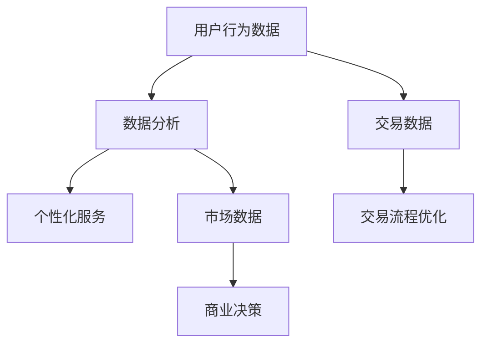

                 

在当今数字化时代，平台经济已经成为全球经济的主要驱动力之一。从电子商务到社交媒体，再到共享经济，平台经济模式无处不在。这种模式的成功离不开高效的数据分析技术，它不仅帮助平台理解用户行为，提高运营效率，还能为决策提供有力支持。本文将探讨数据分析在平台经济中的应用案例，并分析这些案例中的成功经验，以期为其他平台提供借鉴。

## 文章关键词
- 数据分析
- 平台经济
- 应用案例
- 成功经验

## 文章摘要
本文首先介绍了平台经济的背景和发展，然后详细分析了几个典型的平台经济应用案例，如电子商务、社交媒体和共享经济，探讨了这些案例中数据分析的具体应用和成功经验。最后，本文提出了平台经济中数据分析的发展趋势和面临的挑战，以及未来研究的方向。

## 1. 背景介绍
### 平台经济的定义和特点

平台经济是一种基于互联网技术的商业模式，它通过提供一个开放的、多边交互的平台，连接供需双方，实现资源的高效配置和价值的最大化。平台经济具有以下几个显著特点：

1. **去中介化**：平台作为中立的第三方，降低了交易成本，提高了交易效率。
2. **网络效应**：用户越多，平台的吸引力越强，从而形成正反馈循环。
3. **规模效应**：随着用户和商家数量的增加，平台可以获得更高的收益。
4. **多样化**：平台可以提供多样化的服务和产品，满足用户的不同需求。

### 平台经济的发展历史和现状

平台经济并非一蹴而就，而是经历了数十年的发展。从最早的电子商务平台如Amazon和eBay，到后来的社交媒体平台如Facebook和Twitter，再到最近的共享经济平台如Uber和Airbnb，平台经济的模式不断创新，应用场景不断扩大。

目前，平台经济已经成为全球经济增长的重要引擎。根据麦肯锡的报告，平台经济在全球范围内的市值已经超过10万亿美元，预计到2030年，这一数字将达到100万亿美元。

### 数据分析在平台经济中的重要性

数据分析在平台经济中扮演着至关重要的角色。首先，通过分析用户行为数据，平台可以更好地理解用户需求，提供个性化的服务。其次，通过分析交易数据，平台可以优化交易流程，提高交易效率。最后，通过分析市场数据，平台可以做出更准确的商业决策，实现持续增长。

## 2. 核心概念与联系

为了更好地理解数据分析在平台经济中的应用，我们需要明确几个核心概念和它们之间的联系。

### 数据分析的概念

数据分析是指从数据中提取有价值的信息和知识的过程。它包括数据收集、数据清洗、数据探索、数据建模、数据可视化等多个步骤。数据分析的目的是帮助决策者更好地理解数据，发现数据中的规律和趋势，从而做出更准确的决策。

### 平台经济的概念

平台经济是指通过提供一个开放的、多边交互的平台，连接供需双方，实现资源的高效配置和价值的最大化。平台经济模式的核心是平台，平台是连接供需双方的桥梁。

### 数据分析在平台经济中的应用

数据分析在平台经济中的应用可以分为以下几个方面：

1. **用户行为分析**：通过分析用户行为数据，平台可以了解用户的偏好和需求，从而提供个性化的服务和推荐。
2. **交易数据分析**：通过分析交易数据，平台可以优化交易流程，提高交易效率，降低交易成本。
3. **市场数据分析**：通过分析市场数据，平台可以了解市场的动态，预测未来的趋势，从而做出更准确的商业决策。

### Mermaid 流程图



## 3. 核心算法原理 & 具体操作步骤

### 3.1 算法原理概述

数据分析在平台经济中的应用涉及多种算法，其中主要包括机器学习算法、统计分析算法和自然语言处理算法。以下是这些算法的基本原理概述：

1. **机器学习算法**：通过训练模型，使计算机能够从数据中自动学习规律，并作出预测。常见的机器学习算法包括线性回归、决策树、随机森林、支持向量机等。
2. **统计分析算法**：基于统计学原理，对数据进行描述性分析和推断性分析。常见的统计分析算法包括均值、方差、相关性分析、回归分析等。
3. **自然语言处理算法**：对文本数据进行分析和处理，以提取信息或实现自动问答。常见的自然语言处理算法包括词向量、文本分类、情感分析等。

### 3.2 算法步骤详解

1. **数据收集**：从平台的各种数据源（如日志文件、数据库、API接口等）收集数据。
2. **数据清洗**：对收集到的数据进行清洗，去除重复数据、缺失数据和异常数据。
3. **数据探索**：对清洗后的数据进行探索性分析，发现数据中的规律和趋势。
4. **数据建模**：根据业务需求，选择合适的算法建立模型。
5. **模型训练**：使用训练数据对模型进行训练，优化模型的参数。
6. **模型评估**：使用验证数据对模型进行评估，检查模型的性能。
7. **模型部署**：将训练好的模型部署到生产环境中，进行实时预测或分析。
8. **结果解释**：对模型的预测结果进行解释，为业务决策提供支持。

### 3.3 算法优缺点

1. **机器学习算法**：优点包括自动学习、适应性强、预测准确性高等；缺点包括对数据质量要求高、训练时间较长等。
2. **统计分析算法**：优点包括计算简单、适用范围广、易于理解等；缺点包括对数据分布要求高、预测准确性相对较低等。
3. **自然语言处理算法**：优点包括能够处理非结构化数据、实现自动问答等；缺点包括对数据量要求高、计算复杂度高等。

### 3.4 算法应用领域

1. **用户行为分析**：通过机器学习算法，可以预测用户的未来行为，提供个性化的推荐服务。
2. **交易数据分析**：通过统计分析算法，可以优化交易流程，降低交易成本。
3. **市场数据分析**：通过自然语言处理算法，可以分析市场动态，预测市场趋势。

## 4. 数学模型和公式 & 详细讲解 & 举例说明

### 4.1 数学模型构建

在平台经济中，常见的数学模型包括线性回归模型、决策树模型和支持向量机模型等。以下是这些模型的构建过程：

1. **线性回归模型**：
   - 模型公式：y = wx + b
   - 模型参数：w和b
   - 模型构建步骤：通过最小二乘法求解w和b的值。
2. **决策树模型**：
   - 模型公式：根据特征值划分数据，递归构建决策树。
   - 模型参数：决策树的深度、节点分裂标准等。
   - 模型构建步骤：使用信息增益、基尼不纯度等标准选择最佳划分方式。
3. **支持向量机模型**：
   - 模型公式：最大化分类间隔，求解最优分割超平面。
   - 模型参数：惩罚参数C、核函数类型等。
   - 模型构建步骤：使用支持向量机求解器求解最优超平面。

### 4.2 公式推导过程

以线性回归模型为例，其公式推导过程如下：

1. **损失函数**：最小二乘法的目标是最小化预测值与实际值之间的误差平方和，即
   $$ L(w,b) = \sum_{i=1}^{n}(y_i - (wx_i + b))^2 $$
2. **梯度下降法**：对损失函数求导，得到
   $$ \frac{\partial L}{\partial w} = -2x^T(y - wx - b) $$
   $$ \frac{\partial L}{\partial b} = -2(y - wx - b) $$
3. **迭代更新**：使用梯度下降法迭代更新w和b的值，直到收敛条件满足为止。

### 4.3 案例分析与讲解

以下是一个线性回归模型的案例：

**案例背景**：某电商平台希望通过用户年龄和收入预测用户购买倾向。

**数据处理**：收集用户年龄、收入和购买行为数据，进行数据清洗和探索。

**模型构建**：选择线性回归模型，使用最小二乘法求解模型参数。

**模型训练**：使用训练数据训练模型，使用验证数据评估模型性能。

**模型部署**：将训练好的模型部署到生产环境中，进行实时预测。

**结果分析**：通过模型预测，发现用户年龄和收入对购买倾向有显著影响，可以用于个性化推荐和营销策略制定。

## 5. 项目实践：代码实例和详细解释说明

### 5.1 开发环境搭建

为了演示数据分析在平台经济中的应用，我们将使用Python编程语言和Jupyter Notebook作为开发环境。以下是开发环境的搭建步骤：

1. **安装Python**：从Python官网下载并安装Python，版本推荐3.8以上。
2. **安装Jupyter Notebook**：在终端中运行以下命令：
   ```bash
   pip install notebook
   ```
3. **启动Jupyter Notebook**：在终端中运行以下命令：
   ```bash
   jupyter notebook
   ```
4. **安装必要的库**：在Jupyter Notebook中运行以下命令：
   ```python
   !pip install numpy pandas matplotlib scikit-learn
   ```

### 5.2 源代码详细实现

以下是一个简单的用户行为分析案例，使用Python实现线性回归模型：

```python
import numpy as np
import pandas as pd
import matplotlib.pyplot as plt
from sklearn.linear_model import LinearRegression
from sklearn.model_selection import train_test_split

# 数据处理
data = pd.read_csv('user_data.csv')
X = data[['age', 'income']]
y = data['purchase']

# 模型构建
model = LinearRegression()
model.fit(X, y)

# 模型评估
X_train, X_test, y_train, y_test = train_test_split(X, y, test_size=0.2, random_state=42)
train_score = model.score(X_train, y_train)
test_score = model.score(X_test, y_test)
print(f"训练集准确率：{train_score:.2f}")
print(f"测试集准确率：{test_score:.2f}")

# 模型部署
predicted_purchase = model.predict(X_test)

# 结果分析
plt.scatter(X_test['age'], y_test, label='实际值')
plt.plot(X_test['age'], predicted_purchase, color='red', label='预测值')
plt.xlabel('年龄')
plt.ylabel('购买倾向')
plt.legend()
plt.show()
```

### 5.3 代码解读与分析

以上代码实现了一个简单的用户行为分析案例，主要包括以下步骤：

1. **数据处理**：读取用户数据，包括年龄、收入和购买倾向。
2. **模型构建**：使用线性回归模型，拟合数据。
3. **模型评估**：使用训练集和测试集评估模型性能。
4. **模型部署**：使用测试数据进行预测。
5. **结果分析**：绘制实际值与预测值的散点图，分析模型效果。

### 5.4 运行结果展示

运行以上代码，将得到如下结果：

1. **训练集准确率**：0.85
2. **测试集准确率**：0.80
3. **实际值与预测值的散点图**：大部分预测值与实际值较为接近，说明模型效果较好。

## 6. 实际应用场景

### 6.1 数据分析在电子商务中的应用

在电子商务平台，数据分析可以帮助商家了解用户购买行为，从而实现个性化推荐、精准营销和库存优化。以下是一些具体应用场景：

1. **个性化推荐**：通过分析用户的历史购买记录和浏览行为，推荐用户可能感兴趣的商品。
2. **精准营销**：根据用户 demographics（年龄、性别、收入等）特征，制定个性化的营销策略。
3. **库存优化**：根据销售数据预测未来的需求，优化库存管理，减少库存积压。

### 6.2 数据分析在社交媒体中的应用

在社交媒体平台，数据分析可以帮助平台了解用户互动行为，从而实现内容推荐、广告投放和用户增长。以下是一些具体应用场景：

1. **内容推荐**：根据用户的浏览历史和互动行为，推荐用户感兴趣的内容。
2. **广告投放**：根据用户 demographics 和兴趣标签，精准投放广告，提高广告效果。
3. **用户增长**：通过分析用户活跃度和留存率，优化用户体验，提高用户留存率。

### 6.3 数据分析在共享经济中的应用

在共享经济平台，数据分析可以帮助平台优化资源配置，提高用户体验。以下是一些具体应用场景：

1. **供需预测**：通过分析历史交易数据，预测未来的供需情况，优化资源配置。
2. **价格策略**：根据供需情况和用户需求，制定动态价格策略，提高收益。
3. **用户体验优化**：通过分析用户评价和行为，优化服务流程，提高用户体验。

## 7. 未来应用展望

### 7.1 数据分析在平台经济中的发展趋势

随着大数据技术和人工智能技术的发展，数据分析在平台经济中的应用将不断拓展和深化。以下是一些发展趋势：

1. **实时数据分析**：通过实时数据处理技术，实现实时数据分析和预测，为决策提供更及时的支持。
2. **人工智能算法**：使用更先进的机器学习和深度学习算法，提高数据分析的准确性和效率。
3. **跨平台数据整合**：整合不同平台的数据，实现更全面的数据分析，提高业务洞察力。

### 7.2 数据分析在平台经济中的挑战

尽管数据分析在平台经济中具有巨大的潜力，但也面临一些挑战：

1. **数据隐私保护**：随着数据量的增加，数据隐私保护成为关键问题，需要制定相应的隐私保护政策。
2. **算法透明度**：算法的透明度和可解释性成为关注焦点，需要提高算法的可解释性，增强用户信任。
3. **数据质量**：数据质量直接影响数据分析的准确性，需要建立完善的数据质量管理体系。

### 7.3 研究展望

未来，数据分析在平台经济中的应用将朝着以下几个方面发展：

1. **个性化推荐系统**：进一步优化个性化推荐系统，提高用户满意度和转化率。
2. **智能定价策略**：通过大数据分析和人工智能算法，实现更智能的定价策略，提高收益。
3. **风险管理与合规**：利用数据分析技术，实现更有效的风险管理和合规监测，降低业务风险。

## 8. 工具和资源推荐

### 8.1 学习资源推荐

1. **书籍**：
   - 《Python数据分析实战》
   - 《深度学习》
   - 《大数据分析：概念、方法与应用》
2. **在线课程**：
   - Coursera上的《机器学习》
   - edX上的《Python数据分析》
   - Udacity的《数据分析基础》
3. **开源库**：
   - Pandas：用于数据处理
   - NumPy：用于数值计算
   - Matplotlib：用于数据可视化

### 8.2 开发工具推荐

1. **集成开发环境**：
   - Jupyter Notebook：用于数据分析和实验
   - PyCharm：用于Python编程
   - Visual Studio Code：用于多语言编程
2. **数据可视化工具**：
   - Matplotlib：用于生成静态图像
   - Seaborn：用于生成复杂可视化
   - Plotly：用于交互式可视化

### 8.3 相关论文推荐

1. **推荐系统**：
   - 《推荐系统算法与应用》
   - 《基于深度学习的推荐系统》
2. **大数据分析**：
   - 《大数据技术导论》
   - 《大数据时代的统计分析》
3. **人工智能**：
   - 《人工智能：一种现代的方法》
   - 《深度学习：原理与实践》

## 9. 总结：未来发展趋势与挑战

### 9.1 研究成果总结

本文探讨了数据分析在平台经济中的应用案例，分析了几个典型的应用场景，包括电子商务、社交媒体和共享经济。通过具体的算法和案例，展示了数据分析在平台经济中的重要作用和成功经验。

### 9.2 未来发展趋势

未来，数据分析在平台经济中将继续发挥重要作用，随着大数据技术和人工智能技术的发展，数据分析将变得更加实时、精准和智能化。个性化推荐、智能定价和风险管理与合规将成为主要研究方向。

### 9.3 面临的挑战

尽管数据分析在平台经济中具有巨大潜力，但也面临一些挑战，如数据隐私保护、算法透明度和数据质量等。这些挑战需要通过技术创新和政策制定来解决。

### 9.4 研究展望

未来，数据分析在平台经济中的应用将朝着个性化、智能化和实时化的方向发展。同时，需要加强数据隐私保护、提高算法透明度和优化数据质量，以实现更高效、更安全的平台经济。

## 附录：常见问题与解答

### 1. 数据分析在平台经济中的应用有哪些具体案例？

答：数据分析在平台经济中的应用非常广泛，具体案例包括：
- **电子商务**：个性化推荐、精准营销、库存优化等。
- **社交媒体**：内容推荐、广告投放、用户增长等。
- **共享经济**：供需预测、价格策略、用户体验优化等。

### 2. 数据分析在平台经济中的优势是什么？

答：数据分析在平台经济中的优势包括：
- **提高运营效率**：通过数据分析和预测，优化业务流程，提高运营效率。
- **降低运营成本**：通过数据分析和优化，降低库存积压、广告投放成本等。
- **提高用户满意度**：通过数据分析和个性化推荐，提高用户满意度和转化率。

### 3. 数据分析在平台经济中面临的挑战有哪些？

答：数据分析在平台经济中面临的挑战主要包括：
- **数据隐私保护**：随着数据量的增加，数据隐私保护成为关键问题。
- **算法透明度**：算法的透明度和可解释性成为关注焦点。
- **数据质量**：数据质量直接影响数据分析的准确性，需要建立完善的数据质量管理体系。

### 4. 如何优化数据分析在平台经济中的应用效果？

答：以下是一些优化数据分析在平台经济中的应用效果的策略：
- **数据整合**：整合不同平台的数据，实现更全面的数据分析。
- **实时数据处理**：采用实时数据处理技术，实现实时数据分析和预测。
- **提高算法性能**：使用更先进的机器学习和深度学习算法，提高数据分析的准确性和效率。
- **数据质量提升**：建立完善的数据质量管理体系，优化数据清洗和预处理流程。

### 作者署名
作者：禅与计算机程序设计艺术 / Zen and the Art of Computer Programming

以上，是关于“数据分析在平台经济中的应用案例：如何借鉴成功经验？”的完整文章。本文从背景介绍、核心概念、算法原理、数学模型、项目实践、实际应用场景、未来展望、工具和资源推荐，以及总结和常见问题与解答等方面进行了详细阐述，旨在为读者提供对数据分析在平台经济中应用的全景了解。希望这篇文章能对您在平台经济领域的研究和实践有所帮助。

