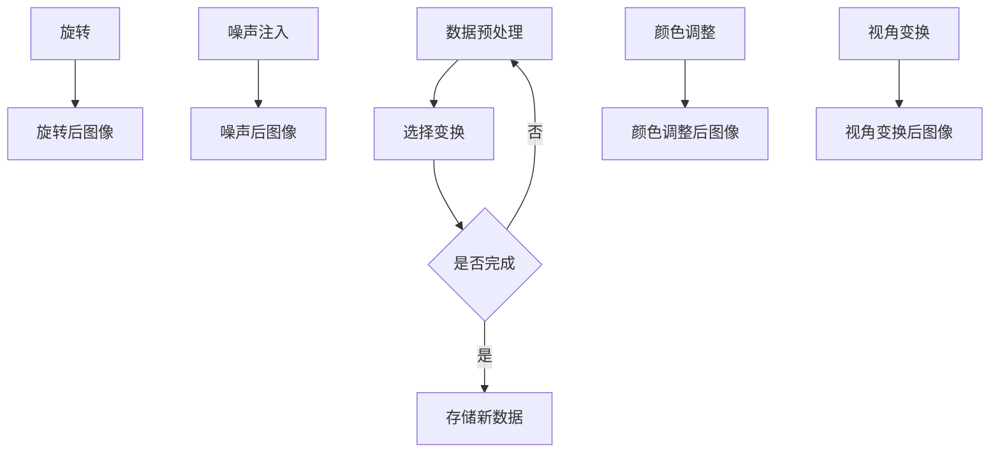

                 

数据增强（Data Augmentation）是深度学习领域中的一个重要技术，特别是在图像识别、语音识别等领域。其目的是通过增加训练数据集的多样性来改善模型性能，减少过拟合，从而提高模型的泛化能力。本文将深入探讨数据增强的原理，并给出详细的代码实例讲解。

## 1. 背景介绍

在深度学习中，训练数据的数量和质量对模型的表现至关重要。数据量越大，模型越有可能学到更加丰富和普遍的特征。然而，在实际应用中，获取大量的标注数据往往是一个耗时耗力的过程。数据增强作为一种在有限数据集上提升模型性能的有效方法，被广泛应用。

数据增强的基本思想是通过一系列转换，如旋转、缩放、裁剪、噪声添加等，对原始数据进行变换，从而生成新的数据样本。这样，即使原始数据量有限，通过数据增强，我们可以获得更多的样本，从而提高模型的鲁棒性和泛化能力。

## 2. 核心概念与联系

### 2.1 数据增强的核心概念

数据增强主要涉及以下几种核心概念：

- **样本变换**：对原始数据样本进行几何变换，如旋转、缩放、裁剪等。
- **噪声注入**：在数据中引入噪声，如高斯噪声、椒盐噪声等。
- **颜色调整**：调整图像的亮度、对比度、饱和度等。
- **视角变换**：改变观察图像的角度，如俯视图、侧视图等。

### 2.2 数据增强与模型性能的关系

数据增强通过增加数据的多样性，使得模型能够学习到更加丰富的特征，从而提高模型的泛化能力。具体来说，数据增强可以：

- **减少过拟合**：模型在训练过程中接触到更多的数据，减少了模型对特定样本的依赖，从而减少过拟合。
- **提升模型鲁棒性**：通过引入噪声和变换，模型能够更好地适应不同的输入数据，提高了模型对噪声和变形的鲁棒性。
- **提高模型泛化能力**：模型在训练过程中接触到更多的数据样本，有助于模型学习到更加普遍和通用的特征，从而提高模型的泛化能力。

### 2.3 数据增强与深度学习的联系

深度学习模型通常需要大量的数据进行训练，而数据增强提供了一种在不增加实际数据量的情况下，提高模型性能的有效方法。数据增强不仅适用于图像识别，也适用于其他类型的输入数据，如音频、文本等。

## 3. 核心算法原理 & 具体操作步骤

### 3.1 算法原理概述

数据增强的核心在于对原始数据进行各种变换，以生成新的数据样本。这些变换包括但不限于：

- **几何变换**：如旋转、缩放、裁剪等。
- **噪声注入**：如高斯噪声、椒盐噪声等。
- **颜色调整**：如调整亮度、对比度、饱和度等。
- **视角变换**：如俯视图、侧视图等。

这些变换可以通过编程实现，例如使用Python的PIL库或OpenCV库进行图像处理。

### 3.2 算法步骤详解

以下是数据增强的基本步骤：

1. **数据预处理**：对原始数据进行预处理，如标准化、归一化等。
2. **选择变换**：根据任务需求，选择合适的变换方式。
3. **应用变换**：对预处理后的数据进行变换，生成新的数据样本。
4. **存储新数据**：将生成的数据样本存储起来，以供模型训练使用。

### 3.3 算法优缺点

**优点**：

- **提高模型性能**：通过增加数据的多样性，提高模型的泛化能力。
- **减少过拟合**：模型在更多的数据上训练，减少了过拟合的风险。
- **节约成本**：无需大量获取标注数据，节省了时间和金钱成本。

**缺点**：

- **质量参差不齐**：生成的数据质量可能不一致，影响模型训练效果。
- **计算资源消耗**：数据增强过程可能需要大量的计算资源。

### 3.4 算法应用领域

数据增强广泛应用于以下领域：

- **图像识别**：通过增加图像数据的多样性，提高模型对图像的识别能力。
- **语音识别**：通过增加语音数据的多样性，提高模型对语音的识别准确性。
- **自然语言处理**：通过增加文本数据的多样性，提高模型对文本的理解能力。

## 4. 数学模型和公式 & 详细讲解 & 举例说明

### 4.1 数学模型构建

数据增强的核心在于对数据进行变换，而这些变换通常可以通过数学模型来描述。以下是一些常用的数学模型：

- **旋转**：旋转矩阵 \( R \) 可以表示为：
  $$ R = \begin{bmatrix}
  \cos \theta & -\sin \theta \\
  \sin \theta & \cos \theta
  \end{bmatrix} $$
  其中，\( \theta \) 是旋转角度。

- **缩放**：缩放矩阵 \( S \) 可以表示为：
  $$ S = \begin{bmatrix}
  s_x & 0 \\
  0 & s_y
  \end{bmatrix} $$
  其中，\( s_x \) 和 \( s_y \) 分别是水平方向和垂直方向上的缩放因子。

- **裁剪**：裁剪可以通过选择一个区域来定义，例如：
  $$ \text{裁剪区域} = \begin{bmatrix}
  x & y & w & h
  \end{bmatrix} $$
  其中，\( x \) 和 \( y \) 是裁剪区域的左上角坐标，\( w \) 和 \( h \) 是裁剪区域的宽度和高度。

### 4.2 公式推导过程

以下是一个简单的示例，说明如何将一个图像通过旋转矩阵进行旋转。

假设有一个 \( 2 \times 2 \) 的图像矩阵 \( A \)：
$$ A = \begin{bmatrix}
a_{11} & a_{12} \\
a_{21} & a_{22}
\end{bmatrix} $$

将其绕原点旋转 \( \theta \) 角度，可以使用以下旋转矩阵 \( R \)：
$$ R = \begin{bmatrix}
\cos \theta & -\sin \theta \\
\sin \theta & \cos \theta
\end{bmatrix} $$

旋转后的图像矩阵 \( B \) 可以通过以下公式计算：
$$ B = R \cdot A = \begin{bmatrix}
\cos \theta & -\sin \theta \\
\sin \theta & \cos \theta
\end{bmatrix} \cdot \begin{bmatrix}
a_{11} & a_{12} \\
a_{21} & a_{22}
\end{bmatrix} = \begin{bmatrix}
a_{11} \cos \theta - a_{12} \sin \theta & a_{11} \sin \theta + a_{12} \cos \theta \\
a_{21} \cos \theta - a_{22} \sin \theta & a_{21} \sin \theta + a_{22} \cos \theta
\end{bmatrix} $$

### 4.3 案例分析与讲解

以下是一个使用Python的PIL库进行图像旋转的代码实例：

```python
from PIL import Image

# 读取图像
image = Image.open("image.jpg")

# 获取图像大小
width, height = image.size

# 计算旋转后的图像大小
new_width = int(width * cos(theta) + height * sin(theta))
new_height = int(width * sin(theta) + height * cos(theta))

# 创建新的空白图像
rotated_image = Image.new("RGB", (new_width, new_height))

# 在新图像上绘制旋转后的图像
rotated_image.paste(image, (0, 0))

# 保存旋转后的图像
rotated_image.save("rotated_image.jpg")
```

在这个例子中，我们首先读取一个图像，然后计算旋转后的图像大小，并创建一个新的空白图像。接着，在新图像上绘制旋转后的图像，并保存结果。

## 5. 项目实践：代码实例和详细解释说明

### 5.1 开发环境搭建

在进行数据增强的实践之前，需要搭建合适的开发环境。以下是搭建开发环境的步骤：

1. 安装Python环境：确保Python已安装在您的计算机上，版本建议为3.7及以上。
2. 安装必要的库：使用pip命令安装以下库：PIL、OpenCV、NumPy等。

```bash
pip install Pillow opencv-python numpy
```

### 5.2 源代码详细实现

以下是使用Python实现数据增强的示例代码：

```python
import cv2
import numpy as np
from PIL import Image

def rotate_image(image, angle):
    # 获取图像大小
    width, height = image.shape[:2]
    
    # 计算旋转后的图像大小
    new_width = int(width * np.cos(angle) + height * np.sin(angle))
    new_height = int(width * np.sin(angle) + height * np.cos(angle))
    
    # 创建旋转矩阵
    rotation_matrix = cv2.getRotationMatrix2D((width/2, height/2), angle, 1)
    
    # 旋转图像
    rotated_image = cv2.warpAffine(image, rotation_matrix, (new_width, new_height))
    
    return rotated_image

def add_noise(image, noise_type="gaussian"):
    if noise_type == "gaussian":
        # 添加高斯噪声
        noise = np.random.normal(0, 0.05, image.shape)
        noisy_image = image + noise
    elif noise_type == "salt_pepper":
        # 添加椒盐噪声
        num_salt = int(image.shape[0] * image.shape[1] * 0.05)
        num_pepper = int(image.shape[0] * image.shape[1] * 0.05)
        salt = np.random.choice(image.shape[0]*image.shape[1], num_salt, replace=False)
        pepper = np.random.choice(image.shape[0]*image.shape[1], num_pepper, replace=False)
        noisy_image = image.copy()
        noisy_image[salt] = 255
        noisy_image[pepper] = 0
    else:
        raise ValueError("Unsupported noise type")
    
    return noisy_image

def adjust_brightness(image, alpha=1.0):
    # 调整亮度
    adjusted_image = cv2.convertScaleAbs(image, alpha=alpha, beta=0)
    return adjusted_image

def main():
    # 读取原始图像
    image = cv2.imread("image.jpg", cv2.IMREAD_GRAYSCALE)
    
    # 旋转图像
    angle = 45  # 旋转角度
    rotated_image = rotate_image(image, angle)
    
    # 添加噪声
    noise_type = "gaussian"  # 高斯噪声或椒盐噪声
    noisy_image = add_noise(rotated_image, noise_type)
    
    # 调整亮度
    alpha = 1.2  # 亮度调整系数
    adjusted_image = adjust_brightness(noisy_image, alpha)
    
    # 显示结果
    cv2.imshow("Original Image", image)
    cv2.imshow("Rotated Image", rotated_image)
    cv2.imshow("Noisy Image", noisy_image)
    cv2.imshow("Adjusted Image", adjusted_image)
    
    cv2.waitKey(0)
    cv2.destroyAllWindows()

if __name__ == "__main__":
    main()
```

### 5.3 代码解读与分析

在上面的代码中，我们定义了三个函数：`rotate_image`、`add_noise` 和 `adjust_brightness`。

- **`rotate_image`**：该函数用于旋转图像。首先，我们获取图像的大小，并计算旋转后的图像大小。然后，我们使用 `cv2.getRotationMatrix2D` 函数获取旋转矩阵，并使用 `cv2.warpAffine` 函数对图像进行旋转。

- **`add_noise`**：该函数用于添加噪声。根据指定的噪声类型，我们生成高斯噪声或椒盐噪声，并将其添加到图像上。

- **`adjust_brightness`**：该函数用于调整图像的亮度。我们使用 `cv2.convertScaleAbs` 函数将图像的亮度调整到指定的系数。

在 `main` 函数中，我们首先读取原始图像，然后依次对图像进行旋转、添加噪声和调整亮度。最后，我们使用 `cv2.imshow` 函数显示结果。

### 5.4 运行结果展示

运行上述代码后，我们将看到以下结果：

- 原始图像：显示原始图像。
- 旋转图像：显示旋转后的图像。
- 噪声图像：显示添加噪声后的图像。
- 调整亮度图像：显示调整亮度后的图像。

通过这些结果，我们可以直观地看到数据增强的效果。

## 6. 实际应用场景

### 6.1 图像识别

在图像识别领域，数据增强被广泛应用于提高模型性能。例如，在人脸识别中，通过旋转、缩放、裁剪等变换，可以增加训练数据的多样性，从而提高模型对人脸的识别准确性。

### 6.2 语音识别

在语音识别领域，数据增强可以通过添加噪声、调整音量等变换来提高模型对噪声和不同音量的语音的识别准确性。

### 6.3 自然语言处理

在自然语言处理领域，数据增强可以通过替换单词、插入删除单词等变换来增加训练数据的多样性，从而提高模型对文本的理解能力。

## 7. 未来应用展望

随着深度学习技术的不断发展，数据增强的应用领域将越来越广泛。未来，我们可能会看到更多针对特定应用场景的数据增强方法被提出，以提高模型的性能和泛化能力。同时，数据增强技术也将与其他深度学习技术相结合，如生成对抗网络（GANs）等，以实现更加复杂和高效的数据增强方法。

## 8. 工具和资源推荐

### 8.1 学习资源推荐

- **《深度学习》（Deep Learning）**：由Ian Goodfellow等人撰写的深度学习经典教材，详细介绍了深度学习的基础理论和应用。
- **《动手学深度学习》（Dive into Deep Learning）**：一个免费的在线教材，涵盖深度学习的各个领域，包括数据增强等。

### 8.2 开发工具推荐

- **TensorFlow**：一个开源的深度学习框架，提供了丰富的数据增强工具。
- **PyTorch**：一个开源的深度学习框架，支持自定义数据增强操作。

### 8.3 相关论文推荐

- **“Data Augmentation for Image Recognition”**：一篇经典的论文，详细介绍了数据增强在图像识别中的应用。
- **“Unsupervised Data Augmentation for Tabular Data”**：一篇关于表格数据数据增强的论文，提出了新的数据增强方法。

## 9. 总结：未来发展趋势与挑战

### 9.1 研究成果总结

数据增强作为深度学习领域的一个重要技术，已经取得了显著的成果。通过增加数据的多样性，数据增强有效提高了模型的性能和泛化能力，在图像识别、语音识别、自然语言处理等领域得到了广泛应用。

### 9.2 未来发展趋势

随着深度学习技术的不断发展，数据增强技术也将迎来更多的发展机遇。未来，我们可能会看到更多针对特定应用场景的数据增强方法被提出，以提高模型的性能和泛化能力。同时，数据增强技术也将与其他深度学习技术相结合，如生成对抗网络（GANs）等，以实现更加复杂和高效的数据增强方法。

### 9.3 面临的挑战

尽管数据增强技术已经取得了显著成果，但仍然面临一些挑战。首先，如何设计出更加高效和灵活的数据增强方法，以适应不同的应用场景，仍是一个重要的研究问题。其次，数据增强过程中可能引入过多的噪声或偏差，影响模型训练效果，这也是一个需要解决的问题。

### 9.4 研究展望

未来，数据增强技术有望在以下方面取得突破：

- **自适应数据增强**：根据模型的训练状态，动态调整数据增强策略，以提高模型性能。
- **跨模态数据增强**：将不同类型的数据（如图像、文本、语音等）进行融合，实现更加丰富的数据增强。
- **数据增强与生成对抗网络的结合**：通过生成对抗网络（GANs）生成高质量的数据样本，提高数据增强的效果。

## 10. 附录：常见问题与解答

### 10.1 什么是数据增强？

数据增强是通过一系列变换，如旋转、缩放、裁剪、噪声注入等，对原始数据进行处理，以生成新的数据样本，从而提高模型的泛化能力。

### 10.2 数据增强有哪些优点？

数据增强的优点包括：提高模型性能、减少过拟合、节约成本等。

### 10.3 数据增强有哪些缺点？

数据增强的缺点包括：生成的数据质量可能不一致、计算资源消耗较大等。

### 10.4 数据增强适用于哪些领域？

数据增强广泛应用于图像识别、语音识别、自然语言处理等领域。

### 10.5 如何进行数据增强？

进行数据增强通常需要以下步骤：

1. 数据预处理：对原始数据进行预处理，如标准化、归一化等。
2. 选择变换：根据任务需求，选择合适的变换方式。
3. 应用变换：对预处理后的数据进行变换，生成新的数据样本。
4. 存储新数据：将生成的数据样本存储起来，以供模型训练使用。

### 10.6 数据增强是否可以提高模型的准确率？

数据增强可以提高模型的泛化能力，从而提高模型在未知数据上的准确率，但并不一定直接提高模型在训练集上的准确率。

### 10.7 数据增强与生成对抗网络（GANs）有何区别？

数据增强是通过一系列变换来增加数据的多样性，而生成对抗网络（GANs）是通过生成器网络生成新的数据样本。两者都可以提高模型的泛化能力，但实现方式不同。

## 作者署名

本文由禅与计算机程序设计艺术 / Zen and the Art of Computer Programming 撰写。感谢您的阅读！
----------------------------------------------------------------

以上是文章的主体内容，接下来我将根据文章结构模板，提供文章摘要、关键词、目录、Mermaid 流程图等部分的内容。

## 摘要

本文深入探讨了数据增强（Data Augmentation）在深度学习中的原理和重要性。通过详细讲解数据增强的核心概念、算法原理、数学模型以及实际应用场景，本文旨在为读者提供对数据增强的全面理解，并通过代码实例展示如何在实际项目中应用数据增强技术。

## 关键词

- 数据增强
- 深度学习
- 图像识别
- 语音识别
- 自然语言处理
- 算法原理
- 数学模型
- 代码实例

## 目录

1. 文章标题
2. 关键词
3. 摘要
4. 1. 背景介绍
5. 2. 核心概念与联系
   2.1 数据增强的核心概念
   2.2 数据增强与模型性能的关系
   2.3 数据增强与深度学习的联系
6. 3. 核心算法原理 & 具体操作步骤
   3.1 算法原理概述
   3.2 算法步骤详解 
   3.3 算法优缺点
   3.4 算法应用领域
7. 4. 数学模型和公式 & 详细讲解 & 举例说明
   4.1 数学模型构建
   4.2 公式推导过程
   4.3 案例分析与讲解
8. 5. 项目实践：代码实例和详细解释说明
   5.1 开发环境搭建
   5.2 源代码详细实现
   5.3 代码解读与分析
   5.4 运行结果展示
9. 6. 实际应用场景
10. 7. 未来应用展望
11. 8. 工具和资源推荐
    8.1 学习资源推荐
    8.2 开发工具推荐
    8.3 相关论文推荐
12. 9. 总结：未来发展趋势与挑战
    9.1 研究成果总结
    9.2 未来发展趋势
    9.3 面临的挑战
    9.4 研究展望
13. 10. 附录：常见问题与解答
14. 作者署名

## Mermaid 流程图



请注意，Mermaid 流程图中不应包含括号、逗号等特殊字符，以确保流程图的正确渲染。以上内容仅供参考，实际文章撰写时请根据具体内容和需求进行调整。

