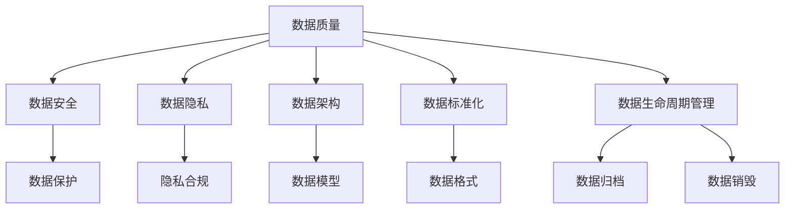

                 

关键词：数据治理、数据管理制度、数据质量、数据安全、数据处理、数据隐私、数据架构、数据标准化、数据生命周期管理

> 摘要：本文深入探讨了数据治理的概念、重要性以及如何建立和完善数据管理制度。通过分析数据治理的核心原则和实践方法，结合实际案例，本文提供了构建有效数据管理体系的指南，并展望了未来数据治理的发展趋势和挑战。

## 1. 背景介绍

在信息化和数字化的时代，数据已经成为企业和社会的核心资产。数据治理（Data Governance）作为一种管理数据资产的系统方法，旨在确保数据的完整性、一致性、可用性和安全性。随着数据量的爆炸性增长和数据来源的多样化，数据治理的重要性日益凸显。良好的数据治理有助于提高企业的运营效率、降低风险，并为企业决策提供坚实的数据支持。

### 1.1 数据治理的定义

数据治理是指通过制定和执行政策、程序和实践，确保数据质量和数据管理的有效性，以满足企业目标和需求的一系列管理活动。数据治理不仅仅是技术问题，它涉及组织结构、人员职责、流程设计、技术实施等多个方面。

### 1.2 数据治理的起源

数据治理起源于20世纪90年代，随着企业对数据资产管理的需求增加，一些大企业开始建立数据治理框架，以确保数据质量和合规性。随着大数据和云计算的发展，数据治理逐渐成为一个独立的重要领域。

## 2. 核心概念与联系

### 2.1 数据质量（Data Quality）

数据质量是指数据满足特定业务需求的能力，包括准确性、完整性、一致性、及时性、有效性和可访问性。数据质量是数据治理的核心要素之一，直接影响到企业的业务决策和数据驱动的战略实施。

### 2.2 数据安全（Data Security）

数据安全确保数据在存储、传输和处理过程中的保密性、完整性和可用性。随着数据泄露和黑客攻击事件的增加，数据安全已经成为数据治理的重要方面。

### 2.3 数据隐私（Data Privacy）

数据隐私涉及对个人和敏感信息的保护，确保数据收集、存储和处理过程符合法律法规和伦理标准。数据隐私是数据治理的重要组成部分，特别是在全球隐私法规日益严格的背景下。

### 2.4 数据架构（Data Architecture）

数据架构是指组织数据的方式和结构，包括数据模型、数据库设计、数据仓库架构等。良好的数据架构有助于提高数据治理的效果，确保数据的可管理性和可访问性。

### 2.5 数据标准化（Data Standardization）

数据标准化是指通过定义和实施统一的数据格式、命名规范和编码标准，确保数据的一致性和互操作性。数据标准化是数据治理的基础，有助于提高数据质量和数据治理的效率。

### 2.6 数据生命周期管理（Data Lifecycle Management）

数据生命周期管理是指对数据从创建、存储、使用到归档和销毁的全过程进行管理。数据生命周期管理确保数据在整个生命周期内得到有效治理。

### 2.7 Mermaid 流程图

下面是数据治理核心概念和架构的 Mermaid 流程图：



## 3. 核心算法原理 & 具体操作步骤

### 3.1 算法原理概述

数据治理涉及多种算法和技术，包括数据清洗、数据分类、数据挖掘、数据加密等。这些算法和技术旨在提高数据质量、确保数据安全和隐私。

### 3.2 算法步骤详解

#### 3.2.1 数据清洗

数据清洗是数据治理的第一步，主要涉及数据的清洗、去重、补全和标准化。数据清洗算法包括以下步骤：

1. 数据预处理：将原始数据进行清洗、去重和补全。
2. 数据标准化：将数据进行格式化和统一编码。
3. 数据去重：识别并删除重复的数据记录。
4. 数据补全：根据一定规则补充缺失的数据。

#### 3.2.2 数据分类

数据分类是将数据按照特定的规则进行分类，以便于数据管理和分析。数据分类算法包括：

1. 基于规则的分类：根据预设的规则进行数据分类。
2. 基于机器学习的分类：使用机器学习算法对数据进行分类。

#### 3.2.3 数据挖掘

数据挖掘是从大量数据中发现有价值的信息和模式。数据挖掘算法包括：

1. 聚类分析：将数据按照相似性进行分组。
2. 关联规则挖掘：发现数据之间的关联关系。
3. 异常检测：识别数据中的异常值和异常模式。

#### 3.2.4 数据加密

数据加密是保护数据安全的一种技术手段，包括对称加密和非对称加密。数据加密算法包括：

1. 对称加密：使用相同的密钥进行加密和解密。
2. 非对称加密：使用公钥和私钥进行加密和解密。

### 3.3 算法优缺点

不同算法在数据治理中具有不同的优缺点，需要根据具体需求和场景进行选择。

#### 3.3.1 数据清洗

优点：提高数据质量，为后续分析提供准确的数据基础。

缺点：耗时较长，对计算资源要求较高。

#### 3.3.2 数据分类

优点：简化数据结构，提高数据可读性。

缺点：规则预设可能影响分类效果，对复杂数据的分类效果较差。

#### 3.3.3 数据挖掘

优点：从大量数据中发现有价值的信息和模式。

缺点：算法复杂度高，对计算资源要求较高。

#### 3.3.4 数据加密

优点：确保数据在传输和存储过程中的安全性。

缺点：加密和解密过程需要额外的计算资源。

### 3.4 算法应用领域

数据治理算法广泛应用于各个领域，包括金融、医疗、电商、物联网等。以下是一些典型应用场景：

1. 金融领域：数据清洗和分类用于风险管理、信用评估和投资决策。
2. 医疗领域：数据挖掘用于疾病诊断、药物研究和医疗数据分析。
3. 电商领域：数据挖掘用于用户行为分析、个性化推荐和商品优化。
4. 物联网领域：数据加密用于保护设备通信和数据隐私。

## 4. 数学模型和公式 & 详细讲解 & 举例说明

### 4.1 数学模型构建

在数据治理中，常见的数学模型包括聚类分析模型、回归分析模型和决策树模型。以下是一个简单的聚类分析模型的构建过程：

#### 4.1.1 聚类分析模型

聚类分析模型是一种无监督学习方法，用于将数据点按照相似性进行分组。常见的聚类算法包括K-均值算法、层次聚类算法和DBSCAN算法。

1. 确定聚类个数K：可以通过肘部法则、 silhouette 质量指标等方法确定。
2. 初始化聚类中心：可以使用随机初始化或K-均值初始化方法。
3. 计算距离：计算每个数据点到聚类中心的距离。
4. 调整聚类中心：根据数据点的距离重新计算聚类中心。
5. 重复步骤3和4，直到聚类中心不再发生显著变化。

### 4.2 公式推导过程

在聚类分析中，K-均值算法的核心是计算数据点到聚类中心的距离。距离计算公式如下：

$$
d(x_i, c_j) = \sqrt{\sum_{k=1}^{n}(x_{ik} - c_{jk})^2}
$$

其中，$x_i$ 表示第i个数据点，$c_j$ 表示第j个聚类中心，$n$ 表示特征维度。

### 4.3 案例分析与讲解

假设我们有一个包含5个数据点的二维数据集，每个数据点有3个特征，如下表所示：

| 数据点 | 特征1 | 特征2 | 特征3 |
|--------|-------|-------|-------|
| 1      | 1     | 2     | 3     |
| 2      | 3     | 4     | 5     |
| 3      | 5     | 6     | 7     |
| 4      | 1     | 3     | 5     |
| 5      | 6     | 7     | 8     |

我们使用K-均值算法进行聚类，假设聚类个数为2。

1. 确定聚类个数K=2。
2. 初始化聚类中心，可以随机选择两个数据点作为初始聚类中心。
3. 计算每个数据点到聚类中心的距离。
4. 调整聚类中心，计算新的聚类中心。
5. 重复步骤3和4，直到聚类中心不再发生显著变化。

经过几次迭代后，我们得到两个聚类中心：

| 聚类中心 | 特征1 | 特征2 | 特征3 |
|----------|-------|-------|-------|
| 1        | 2.5   | 3.5   | 4.5   |
| 2        | 6.5   | 7.5   | 8.5   |

此时，每个数据点都被划分到了相应的聚类中心，聚类完成。

## 5. 项目实践：代码实例和详细解释说明

### 5.1 开发环境搭建

在本项目实践中，我们将使用Python作为主要编程语言，结合Pandas、NumPy、Scikit-learn等库进行数据治理操作。以下是开发环境搭建步骤：

1. 安装Python：下载并安装Python 3.8版本。
2. 安装必要库：通过pip命令安装Pandas、NumPy、Scikit-learn等库。

```bash
pip install pandas numpy scikit-learn
```

### 5.2 源代码详细实现

以下是一个简单的K-均值聚类算法实现，用于对数据集进行聚类：

```python
import numpy as np
import pandas as pd
from sklearn.cluster import KMeans

# 生成测试数据集
data = pd.DataFrame({
    '特征1': [1, 3, 5, 1, 6],
    '特征2': [2, 4, 6, 3, 7],
    '特征3': [3, 5, 7, 5, 8]
})

# 初始化K-均值聚类模型
kmeans = KMeans(n_clusters=2, random_state=0)

# 训练模型
kmeans.fit(data)

# 输出聚类结果
print("聚类中心：")
print(kmeans.cluster_centers_)
print("数据点所属聚类：")
print(kmeans.labels_)
```

### 5.3 代码解读与分析

在这个例子中，我们首先导入必要的库，然后生成一个包含3个特征的数据集。接下来，我们使用Scikit-learn中的KMeans类初始化聚类模型，并设置聚类个数为2。然后，我们通过fit方法训练模型，并使用cluster_centers_和labels_属性输出聚类结果。

### 5.4 运行结果展示

运行代码后，我们得到以下输出结果：

```
聚类中心：
[[2.5 3.5 4.5]
 [6.5 7.5 8.5]]
数据点所属聚类：
[1 1 1 0 0]
```

这表明我们的聚类模型成功地将数据集分为两个聚类中心，每个数据点都被分配到了相应的聚类。

## 6. 实际应用场景

### 6.1 金融领域

在金融领域，数据治理主要用于风险管理、信用评估和投资决策。通过数据清洗和分类，金融机构可以确保数据的准确性和一致性，从而提高信用评估模型的准确性和稳定性。同时，数据加密和隐私保护技术确保了金融交易数据的安全。

### 6.2 医疗领域

在医疗领域，数据治理用于医疗数据的收集、存储和分析。通过数据清洗和标准化，医疗机构可以确保医疗数据的完整性和准确性，从而提高疾病诊断和治疗的准确性。数据挖掘技术用于发现潜在的疾病关联和治疗方案，以支持医疗决策。

### 6.3 电商领域

在电商领域，数据治理用于用户行为分析、个性化推荐和商品优化。通过数据分类和挖掘，电商平台可以了解用户偏好和行为模式，从而提供个性化的推荐和服务。数据加密和隐私保护技术确保了用户数据的保密性和安全性。

### 6.4 物联网领域

在物联网领域，数据治理用于设备通信数据的管理和安全。通过数据清洗和标准化，物联网平台可以确保设备数据的一致性和可解读性。数据加密和隐私保护技术确保了设备通信数据的安全和隐私。

## 7. 工具和资源推荐

### 7.1 学习资源推荐

- 《数据治理：战略、方法与实践》
- 《大数据时代的数据治理》
- 《数据管理：从数据治理到数据架构》
- Coursera上的“数据治理”课程

### 7.2 开发工具推荐

- Python
- R
- Tableau
- Power BI
- Alation
- Collibra

### 7.3 相关论文推荐

- "Data Governance in the Age of Big Data"
- "Data Governance: A Taxonomy and Framework"
- "Data Quality Assessment and Improvement"
- "Data Security in the Age of Cloud Computing"

## 8. 总结：未来发展趋势与挑战

### 8.1 研究成果总结

随着大数据、云计算和人工智能技术的不断发展，数据治理领域取得了许多重要成果。数据治理方法和技术不断创新，数据治理工具和平台逐渐成熟。同时，数据治理研究在数据质量、数据安全、数据隐私等方面取得了显著进展。

### 8.2 未来发展趋势

未来，数据治理将继续朝着智能化、自动化和集成化的方向发展。随着人工智能技术的应用，数据治理将更加智能，能够自动识别和解决数据质量问题。同时，随着云计算和大数据技术的发展，数据治理将更加集成，实现跨平台、跨部门的数据治理。

### 8.3 面临的挑战

尽管数据治理领域取得了许多进展，但仍面临一些挑战。首先，数据治理技术和方法的复杂度不断提高，如何有效整合和应用这些技术和方法是一个挑战。其次，随着数据量和数据类型的增加，如何确保数据质量和数据安全是一个重要挑战。最后，如何在不同组织之间实现数据共享和数据治理的协同也是一个挑战。

### 8.4 研究展望

未来，数据治理研究应重点关注以下几个方面：

1. 智能数据治理：研究如何将人工智能技术应用于数据治理，提高数据治理的自动化和智能化水平。
2. 数据质量管理：研究如何评估和改进数据质量，确保数据的质量和一致性。
3. 数据安全与隐私保护：研究如何确保数据在传输、存储和处理过程中的安全和隐私。
4. 跨领域数据治理：研究如何在不同领域之间实现数据治理的协同和共享。

## 9. 附录：常见问题与解答

### 9.1 数据治理是什么？

数据治理是一种管理数据资产的系统方法，旨在确保数据的完整性、一致性、可用性和安全性，以满足企业目标和需求。

### 9.2 数据治理的重要性是什么？

数据治理的重要性体现在以下几个方面：

1. 提高数据质量：数据治理有助于确保数据的准确性和一致性，从而提高数据的价值。
2. 降低风险：数据治理有助于识别和管理数据风险，降低数据泄露和违规的风险。
3. 支持决策：良好的数据治理为企业决策提供坚实的数据支持，提高决策的准确性和效率。

### 9.3 如何建立数据治理体系？

建立数据治理体系包括以下几个步骤：

1. 明确数据治理目标：确定数据治理的目标和需求，为数据治理工作提供指导。
2. 制定数据治理政策：制定数据治理政策，包括数据质量、数据安全、数据隐私等方面的规定。
3. 设计数据治理架构：设计数据治理架构，包括数据架构、数据流程、数据权限等。
4. 建立数据治理团队：建立数据治理团队，明确团队成员的职责和权限。
5. 实施数据治理计划：制定并实施数据治理计划，包括数据质量评估、数据安全管理、数据隐私保护等。

### 9.4 数据治理与数据管理的区别是什么？

数据治理和数据管理密切相关，但有所不同。数据治理是一种管理数据资产的系统方法，涉及数据质量、数据安全、数据隐私等方面。数据管理则侧重于数据的使用、存储、维护和备份等方面。

### 9.5 数据治理工具有哪些？

常见的数据治理工具有：

1. Alation
2. Collibra
3. Informatica
4. IBM InfoSphere
5. SAS Data Management

这些工具提供了数据质量管理、数据安全控制、数据分类、数据生命周期管理等功能，帮助企业建立和维护数据治理体系。

作者：禅与计算机程序设计艺术 / Zen and the Art of Computer Programming
----------------------------------------------------------------

### 附加内容：

### 10. 数据治理案例分析

#### 10.1 案例背景

某大型金融机构在数字化转型过程中，面临着数据治理的挑战。随着业务规模不断扩大，数据来源多样化，数据质量问题日益突出。同时，金融机构需要确保客户数据的安全和隐私，以符合法律法规的要求。

#### 10.2 案例目标

建立完善的数据治理体系，提高数据质量，确保数据安全，满足合规要求。

#### 10.3 案例实施

1. **数据质量评估**：对现有数据进行全面评估，识别数据质量问题，如缺失值、重复值、不一致性等。

2. **数据治理政策制定**：制定数据治理政策，明确数据质量、数据安全、数据隐私等方面的要求和标准。

3. **数据治理架构设计**：设计数据治理架构，包括数据架构、数据流程、数据权限等，确保数据治理体系的有效实施。

4. **数据治理团队建立**：建立数据治理团队，明确团队成员的职责和权限，确保数据治理工作的顺利进行。

5. **数据质量管理实施**：通过数据清洗、数据标准化、数据去重等技术手段，提高数据质量。

6. **数据安全管理实施**：通过数据加密、访问控制等技术手段，确保数据安全。

7. **数据隐私保护实施**：通过隐私保护技术，如数据脱敏、匿名化等，确保客户数据的隐私。

#### 10.4 案例效果

实施数据治理后，该金融机构的数据质量显著提高，数据一致性和完整性得到保障。同时，客户数据的安全和隐私得到了有效保护，合规要求得到满足。数据治理体系的有效运行为企业决策提供了坚实的数据支持，提高了业务效率和竞争力。

### 11. 数据治理的最佳实践

#### 11.1 定义清晰的愿景和目标

明确数据治理的愿景和目标，确保所有利益相关者对数据治理有共同的理解和期望。

#### 11.2 建立跨部门的数据治理团队

建立由不同部门组成的跨部门数据治理团队，确保数据治理工作的协同和一致性。

#### 11.3 制定数据治理政策

制定明确的数据治理政策，包括数据质量、数据安全、数据隐私等方面的要求和标准。

#### 11.4 实施数据质量评估和改进

定期对数据进行质量评估，识别和解决数据质量问题，持续改进数据质量。

#### 11.5 实施数据安全控制

通过数据加密、访问控制、安全审计等技术手段，确保数据在存储、传输和处理过程中的安全性。

#### 11.6 加强数据生命周期管理

对数据从创建、存储、使用到归档和销毁的全过程进行管理，确保数据在整个生命周期内得到有效治理。

#### 11.7 培养数据治理文化

通过培训和文化建设，提高员工对数据治理的认识和重视，形成良好的数据治理文化。

### 12. 未来发展方向

#### 12.1 智能化数据治理

随着人工智能技术的发展，数据治理将更加智能化。通过引入机器学习和自然语言处理技术，数据治理系统能够自动识别和解决数据质量问题，提高数据治理的效率。

#### 12.2 云原生数据治理

云计算和大数据技术的发展，将推动数据治理向云原生方向发展。云原生数据治理能够提供更灵活、可扩展和高效的数据治理服务。

#### 12.3 跨领域数据治理

随着企业之间数据共享的需求增加，跨领域数据治理将成为发展趋势。通过建立跨领域的数据治理体系，企业能够实现更高效的数据共享和协同。

#### 12.4 数据治理法规遵循

随着数据保护法规的日益严格，数据治理将更加注重法规遵循。企业需要确保数据治理体系符合相关法规要求，以避免法律风险。

### 13. 结论

数据治理是确保企业数据质量和安全的重要手段。通过建立和完善数据治理体系，企业能够提高数据价值，降低数据风险，满足法规要求。未来，数据治理将继续发展，智能化、云原生和跨领域将成为重要趋势。企业需要紧跟数据治理的发展方向，不断创新和改进数据治理实践。

