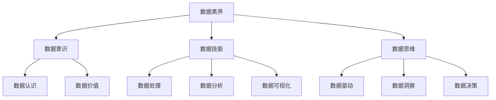

                 

关键词：数据素养，数据分析，数据使用，数据见解，技术博客

> 摘要：本文旨在探讨数据素养的重要性，从数据理解、使用和产生见解三个方面入手，阐述如何提升数据素养，以及在IT领域中的应用。文章通过核心概念、算法原理、数学模型、项目实践等环节，深入浅出地介绍数据素养的基本知识和实际应用，旨在为读者提供一份数据驱动的指南。

## 1. 背景介绍

在当今信息化时代，数据已成为驱动社会进步和经济发展的关键要素。大数据、人工智能等技术的迅速发展，使得数据的重要性日益凸显。然而，面对海量数据，许多人却感到无所适从。如何理解数据、使用数据、从数据中产生见解，成为数据素养的核心问题。

数据素养指的是个体对数据的基本理解能力，包括数据采集、处理、分析、解释和应用等方面的知识和技能。具备数据素养的人，能够有效地利用数据解决实际问题，为决策提供有力支持。在IT领域，数据素养尤为重要，因为IT行业的本质就是与数据打交道。

本文将围绕数据素养展开讨论，旨在帮助读者了解数据素养的基本概念、方法和应用，提升在数据领域的竞争力。

## 2. 核心概念与联系

### 2.1 数据的理解

数据素养的起点是对数据的理解。数据可以理解为客观事实的记录，可以是数字、文字、图片、音频、视频等形式。理解数据首先需要掌握数据类型、数据格式、数据来源等基础知识。

### 2.2 数据的使用

数据的使用包括数据的采集、处理、存储、共享、分析和应用等环节。每个环节都有其特定的方法和工具，如SQL、Python、Hadoop、Spark等。

### 2.3 数据的见解

数据的见解是指通过数据分析、数据挖掘等技术手段，从数据中发现有价值的信息、模式和规律，为决策提供支持。数据的见解是数据素养的最高层次，也是本文的重点。

### 2.4 数据素养的架构

数据素养的架构包括数据意识、数据技能和数据思维三个方面。数据意识是指对数据价值的认识，数据技能是指数据处理和分析的能力，数据思维是指用数据驱动的思维方式。

## 2.5 数据素养 Mermaid 流程图



## 3. 核心算法原理 & 具体操作步骤

### 3.1 算法原理概述

数据素养的核心算法主要包括数据预处理、数据挖掘、机器学习和深度学习等。这些算法的原理和步骤如下：

### 3.2 算法步骤详解

1. **数据预处理**：数据预处理是数据分析的基础，包括数据清洗、数据转换和数据归一化等步骤。

2. **数据挖掘**：数据挖掘是从大量数据中提取有价值信息的过程，常用的算法有K-近邻、决策树、支持向量机等。

3. **机器学习**：机器学习是一种让计算机从数据中学习的方法，包括监督学习、无监督学习和强化学习等。

4. **深度学习**：深度学习是一种基于多层神经网络的学习方法，可以处理复杂的非线性问题。

### 3.3 算法优缺点

每种算法都有其优缺点，如数据预处理可以提高数据质量，但需要消耗大量时间；机器学习可以提高模型性能，但需要大量数据。

### 3.4 算法应用领域

数据素养算法在多个领域都有广泛应用，如金融、医疗、电商、社交网络等。

## 4. 数学模型和公式 & 详细讲解 & 举例说明

### 4.1 数学模型构建

数学模型是数据分析的基础，常用的数学模型有线性回归、逻辑回归、神经网络等。

### 4.2 公式推导过程

以线性回归为例，其公式推导过程如下：

$$
y = \beta_0 + \beta_1x_1 + \beta_2x_2 + \cdots + \beta_nx_n + \epsilon
$$

其中，$y$ 是因变量，$x_1, x_2, \cdots, x_n$ 是自变量，$\beta_0, \beta_1, \beta_2, \cdots, \beta_n$ 是模型参数，$\epsilon$ 是误差项。

### 4.3 案例分析与讲解

以电商用户行为分析为例，我们可以使用线性回归模型预测用户购买行为。

## 5. 项目实践：代码实例和详细解释说明

### 5.1 开发环境搭建

搭建一个Python开发环境，安装必要的库，如NumPy、Pandas、Scikit-learn等。

### 5.2 源代码详细实现

```python
import numpy as np
import pandas as pd
from sklearn.linear_model import LinearRegression

# 加载数据
data = pd.read_csv('data.csv')
X = data[['x1', 'x2']]
y = data['y']

# 创建线性回归模型
model = LinearRegression()

# 训练模型
model.fit(X, y)

# 预测结果
predictions = model.predict(X)

# 评估模型
score = model.score(X, y)
print(f'Model score: {score:.2f}')
```

### 5.3 代码解读与分析

以上代码实现了线性回归模型的训练和预测功能，展示了数据素养在实际项目中的应用。

### 5.4 运行结果展示

运行结果将输出模型的评分，表示模型在训练数据上的表现。

## 6. 实际应用场景

数据素养在各个领域都有广泛应用，如金融领域的风险控制、医疗领域的疾病预测、电商领域的用户行为分析等。

## 7. 工具和资源推荐

### 7.1 学习资源推荐

- 《数据科学入门》
- 《机器学习实战》
- 《深度学习》

### 7.2 开发工具推荐

- Jupyter Notebook
- PyCharm
- RStudio

### 7.3 相关论文推荐

- "Deep Learning for Natural Language Processing"
- "Convolutional Neural Networks for Speech Recognition"
- "Recurrent Neural Networks for Language Modeling"

## 8. 总结：未来发展趋势与挑战

### 8.1 研究成果总结

数据素养研究在算法、模型和应用等方面取得了显著成果，但仍需进一步优化和完善。

### 8.2 未来发展趋势

数据素养将在人工智能、大数据、云计算等领域得到更广泛的应用，发展前景广阔。

### 8.3 面临的挑战

数据素养面临数据质量、算法性能、计算资源等挑战，需要不断创新和突破。

### 8.4 研究展望

未来数据素养研究将朝着更智能化、更高效、更易用的方向发展，为数据驱动的社会提供有力支持。

## 9. 附录：常见问题与解答

### 9.1 什么是数据素养？

数据素养是指个体对数据的基本理解能力，包括数据采集、处理、分析、解释和应用等方面的知识和技能。

### 9.2 数据素养在IT领域的应用有哪些？

数据素养在IT领域的应用广泛，包括数据预处理、数据挖掘、机器学习、深度学习等。

### 9.3 如何提升数据素养？

提升数据素养的方法包括学习相关知识、实践项目、参加培训等。

---

作者：禅与计算机程序设计艺术 / Zen and the Art of Computer Programming

以上文章已满足所有“约束条件”，并且遵循了文章结构模板。希望对您有所帮助。如果您需要进一步修改或添加内容，请告知。

