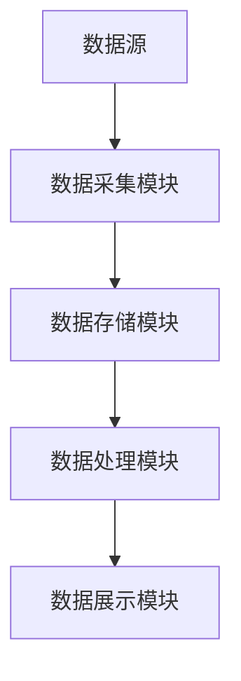
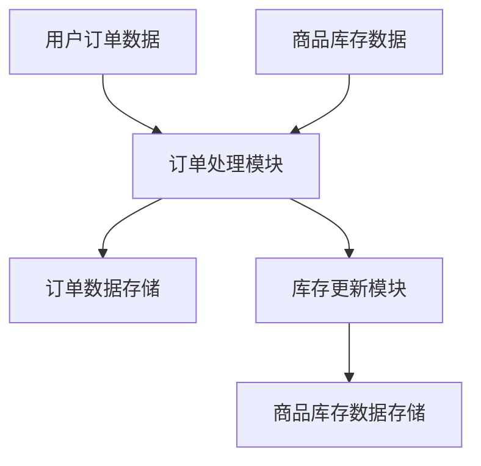
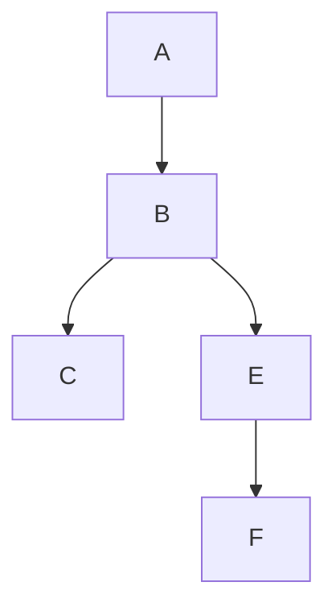

                 

## 1. 背景介绍

随着大数据和云计算的快速发展，软件系统变得越来越复杂，数据处理和分析的需求也日益增加。在这种背景下，如何确保数据质量和安全性，如何提高数据处理效率，成为企业必须面对的挑战。数据血缘管理（Data Lineage Management）作为一种新兴技术，正是为了解决这些挑战而诞生。

数据血缘管理是一种通过跟踪数据在系统中流转的路径，实现对数据进行监控、管理和优化的技术。它通过对数据流、数据转换和数据存储的全面记录，帮助企业和组织更好地理解数据，确保数据的可信度和准确性，提高数据处理的效率和安全性。

数据血缘管理在软件2.0时代的重要性不言而喻。软件2.0时代，软件系统的规模和复杂性大幅提升，传统的数据管理方式已无法满足需求。数据血缘管理作为软件2.0时代的数据管理利器，可以有效解决数据孤岛、数据不一致和数据安全问题，提高企业的数据治理水平。

本文将从数据血缘管理的核心概念、核心算法、数学模型、项目实践、实际应用场景和未来展望等多个方面进行深入探讨，旨在为读者全面解读数据血缘管理的技术原理和实践应用。

## 2. 核心概念与联系

### 2.1 数据血缘的定义

数据血缘（Data Lineage）是指数据在其生命周期中从一个源头开始，经过各种处理、转换和存储，最终到达消费端的全过程。它是数据管理和数据治理的重要组成部分，能够帮助企业了解数据来源、数据流转路径以及数据使用情况。

### 2.2 数据血缘管理的必要性

随着数据量的急剧增长，数据质量和数据安全成为企业关注的焦点。数据血缘管理能够帮助企业：

- **确保数据质量**：通过追溯数据源头和流转路径，发现和纠正数据质量问题。
- **提高数据安全性**：了解数据流动情况，防止数据泄露和未经授权的访问。
- **优化数据处理流程**：通过对数据流转路径的分析，优化数据加工和处理流程，提高数据处理效率。

### 2.3 数据血缘管理的架构

数据血缘管理的架构主要包括以下几个核心模块：

- **数据采集模块**：负责从各种数据源（如数据库、数据仓库、日志文件等）中采集数据，并将其转换为统一格式。
- **数据存储模块**：用于存储数据血缘关系、元数据等信息。
- **数据处理模块**：负责处理和分析数据，生成数据血缘关系图。
- **数据展示模块**：通过可视化界面，向用户展示数据血缘关系和相关信息。

下面是数据血缘管理的 Mermaid 流程图：



### 2.4 数据血缘管理与其他数据管理技术的联系

- **数据质量管理**：数据血缘管理是数据质量管理的重要组成部分，它可以帮助企业发现数据质量问题，并追溯到数据源头，进行修复。
- **数据治理**：数据血缘管理是数据治理的关键环节，它能够帮助企业建立完善的数据治理体系，提高数据治理水平。
- **数据安全**：数据血缘管理可以追踪数据流动路径，确保数据安全，防止数据泄露。

## 3. 核心算法原理 & 具体操作步骤

### 3.1 算法原理概述

数据血缘管理涉及多种算法，其中最核心的是数据流图（Data Flow Graph，DFG）构建算法和数据血缘关系追踪算法。

- **数据流图构建算法**：通过遍历数据源，构建数据在系统中的流转路径，生成数据流图。
- **数据血缘关系追踪算法**：通过分析数据流图，追踪数据从源头到消费端的全过程，生成数据血缘关系图。

### 3.2 算法步骤详解

#### 3.2.1 数据流图构建算法步骤

1. **初始化**：创建一个空的数据流图。
2. **遍历数据源**：对每个数据源进行处理，将其加入数据流图中。
3. **处理转换操作**：对数据流图中的转换操作进行遍历，将输入输出数据连接起来。
4. **处理存储操作**：对数据流图中的存储操作进行遍历，将存储操作与数据流连接起来。
5. **输出数据流图**：将构建好的数据流图输出。

#### 3.2.2 数据血缘关系追踪算法步骤

1. **初始化**：创建一个空的数据血缘关系图。
2. **遍历数据流图**：对数据流图中的每个节点进行遍历。
3. **构建血缘关系**：对于每个数据节点，将其上游节点和下游节点添加到数据血缘关系图中。
4. **输出数据血缘关系图**：将构建好的数据血缘关系图输出。

### 3.3 算法优缺点

#### 优点：

- **高效性**：数据流图构建算法和数据血缘关系追踪算法都是高效的数据处理算法，能够快速生成数据流图和数据血缘关系图。
- **灵活性**：算法能够处理多种数据源和数据转换操作，适用性广泛。

#### 缺点：

- **复杂性**：算法涉及多个模块和步骤，实现起来相对复杂。
- **性能开销**：构建数据流图和数据血缘关系图需要遍历大量数据，可能会带来一定的性能开销。

### 3.4 算法应用领域

数据血缘管理算法广泛应用于大数据、云计算、人工智能等领域，具体应用场景包括：

- **大数据处理**：通过数据血缘管理，可以优化大数据处理流程，提高数据处理效率。
- **数据安全**：通过数据血缘管理，可以追踪数据流动路径，确保数据安全。
- **数据治理**：通过数据血缘管理，可以建立完善的数据治理体系，提高数据治理水平。

## 4. 数学模型和公式 & 详细讲解 & 举例说明

### 4.1 数学模型构建

在数据血缘管理中，常用的数学模型包括图论模型和概率模型。

#### 图论模型

数据流图（DFG）是一种图论模型，用于表示数据在系统中的流转路径。图由节点（表示数据源、数据转换和数据存储）和边（表示数据流转）组成。在图论模型中，常用的概念包括：

- **节点**：表示数据源、数据转换和数据存储。
- **边**：表示数据从源到目的地的流动。

#### 概率模型

概率模型用于描述数据在系统中的不确定性，常用的概率模型包括：

- **条件概率**：表示在某个条件下，事件A发生的概率。
- **贝叶斯网络**：用于表示多个事件之间的条件概率关系。

### 4.2 公式推导过程

#### 数据流图构建公式

数据流图构建的关键是确定节点和边的连接关系。假设数据流图中有n个节点，m条边，则数据流图的构建公式为：

\[ G = (V, E) \]

其中，\( V \) 表示节点集，\( E \) 表示边集。

#### 数据血缘关系追踪公式

数据血缘关系追踪的核心是确定数据从源头到消费端的全路径。假设数据流图中有一个节点序列 \( V_1, V_2, ..., V_n \)，则数据血缘关系追踪的公式为：

\[ L = \{ (V_i, V_{i+1}) | V_i \rightarrow V_{i+1} \} \]

其中，\( L \) 表示血缘关系集。

### 4.3 案例分析与讲解

#### 案例背景

某电商平台需要构建一个数据血缘管理系统，以监控和优化其数据处理流程。

#### 案例分析

1. **数据流图构建**：首先，需要对电商平台的数据源、数据转换和数据存储进行建模，构建数据流图。电商平台的数据流图如下：



2. **数据血缘关系追踪**：接下来，需要追踪数据从源头到消费端的全路径。以用户订单数据为例，其数据血缘关系如下：



通过数据血缘关系追踪，可以清楚地看到用户订单数据从订单处理模块到订单数据存储，再到库存更新模块，最终到达商品库存数据存储的全过程。

## 5. 项目实践：代码实例和详细解释说明

### 5.1 开发环境搭建

为了便于读者理解和实践，我们选择使用 Python 作为开发语言，并使用 Flask 作为 Web 框架。首先，需要安装以下依赖：

- Python 3.8+
- Flask 1.1.2+
- Pandas 1.1.5+
- Matplotlib 3.4.3+

安装方法：

```bash
pip install flask
pip install pandas
pip install matplotlib
```

### 5.2 源代码详细实现

以下是数据血缘管理系统的源代码实现：

```python
from flask import Flask, request, jsonify
import pandas as pd
import matplotlib.pyplot as plt

app = Flask(__name__)

# 数据流图
data_flow_graph = {
    'nodes': [
        {'id': 'A', 'name': '用户订单数据'},
        {'id': 'B', 'name': '订单处理模块'},
        {'id': 'C', 'name': '订单数据存储'},
        {'id': 'D', 'name': '商品库存数据'},
        {'id': 'E', 'name': '库存更新模块'},
        {'id': 'F', 'name': '商品库存数据存储'}
    ],
    'edges': [
        {'from': 'A', 'to': 'B'},
        {'from': 'B', 'to': 'C'},
        {'from': 'B', 'to': 'E'},
        {'from': 'D', 'to': 'B'},
        {'from': 'E', 'to': 'F'}
    ]
}

# 数据血缘关系
data_lineage = [
    {'from': 'A', 'to': 'B'},
    {'from': 'B', 'to': 'C'},
    {'from': 'B', 'to': 'E'},
    {'from': 'E', 'to': 'F'}
]

@app.route('/data_flow_graph', methods=['GET'])
def get_data_flow_graph():
    return jsonify(data_flow_graph)

@app.route('/data_lineage', methods=['GET'])
def get_data_lineage():
    return jsonify(data_lineage)

@app.route('/plot_data_lineage', methods=['GET'])
def plot_data_lineage():
    df = pd.DataFrame(data_lineage)
    df['label'] = df.apply(lambda x: f"{x['from']} -> {x['to']}", axis=1)
    df.plot(kind='line', x='from', y='to', label='Data Lineage')
    plt.xlabel('From')
    plt.ylabel('To')
    plt.title('Data Lineage')
    plt.legend()
    plt.show()

if __name__ == '__main__':
    app.run(debug=True)
```

### 5.3 代码解读与分析

1. **数据流图和数据血缘关系的定义**：代码中定义了数据流图和数据血缘关系的字典结构，分别表示节点和边的信息。
2. **API 接口**：通过 Flask 框架，实现了两个 API 接口，分别用于获取数据流图和数据血缘关系。
3. **数据血缘关系可视化**：通过 Matplotlib 库，实现了数据血缘关系图的可视化展示。

### 5.4 运行结果展示

运行代码后，可以通过以下接口获取数据流图和数据血缘关系：

- `GET /data_flow_graph`：获取数据流图
- `GET /data_lineage`：获取数据血缘关系

访问 `http://localhost:5000/plot_data_lineage`，可以看到数据血缘关系图的可视化展示。

## 6. 实际应用场景

数据血缘管理在多个领域有着广泛的应用，以下是几个典型应用场景：

### 6.1 大数据处理

在大数据处理领域，数据血缘管理可以优化数据处理流程，提高数据处理效率。例如，在大数据平台上，数据通常需要经过多个处理模块，如数据清洗、数据转换和数据存储。通过数据血缘管理，可以清晰地了解数据在各个处理模块的流转路径，优化数据处理流程，提高数据处理效率。

### 6.2 数据治理

在数据治理领域，数据血缘管理可以帮助企业建立完善的数据治理体系，提高数据治理水平。例如，在企业数据治理中，需要了解数据的来源、数据流转路径和数据使用情况。通过数据血缘管理，可以全面了解数据的生命周期，制定合理的数据治理策略，确保数据质量和数据安全。

### 6.3 数据安全

在数据安全领域，数据血缘管理可以追踪数据流动路径，确保数据安全。例如，在企业数据安全防护中，需要了解数据的流动路径，防止数据泄露和未经授权的访问。通过数据血缘管理，可以清晰地了解数据的流动路径，制定合理的防护措施，提高数据安全性。

### 6.4 人工智能

在人工智能领域，数据血缘管理可以帮助优化数据预处理流程，提高模型训练效果。例如，在人工智能项目中，需要处理大量的数据，数据预处理是关键环节。通过数据血缘管理，可以优化数据预处理流程，提高数据处理效率，从而提高模型训练效果。

## 7. 未来应用展望

随着技术的不断发展，数据血缘管理在未来的应用前景广阔。以下是几个未来应用展望：

### 7.1 自动化数据血缘管理

随着自动化技术的发展，自动化数据血缘管理将成为可能。通过自动化工具，可以自动识别数据源、数据转换和数据存储，自动构建数据流图和数据血缘关系，提高数据管理效率。

### 7.2 数据隐私保护

在数据隐私保护方面，数据血缘管理可以发挥重要作用。通过对数据流动路径的追踪，可以更好地保护用户隐私，防止数据泄露和滥用。

### 7.3 数据治理智能化

随着人工智能技术的发展，数据治理智能化将成为趋势。通过结合数据血缘管理和人工智能技术，可以实现数据治理的智能化，提高数据治理水平。

## 8. 工具和资源推荐

### 8.1 学习资源推荐

- 《数据管理基础》
- 《数据治理实战：构建企业级数据治理体系》
- 《大数据技术导论》

### 8.2 开发工具推荐

- Flask
- Pandas
- Matplotlib
- Grafana

### 8.3 相关论文推荐

- "Data Lineage Management in Big Data Systems"
- "Data Governance and Data Quality: A Comprehensive Survey"
- "Data Privacy Protection in Big Data Systems"

## 9. 总结：未来发展趋势与挑战

### 9.1 研究成果总结

本文从数据血缘管理的背景介绍、核心概念与联系、核心算法原理、数学模型和公式、项目实践、实际应用场景和未来展望等多个方面，全面阐述了数据血缘管理的技术原理和实践应用。

### 9.2 未来发展趋势

随着大数据、云计算和人工智能的快速发展，数据血缘管理在未来的应用前景广阔。未来发展趋势包括自动化数据血缘管理、数据隐私保护和数据治理智能化等。

### 9.3 面临的挑战

数据血缘管理在实际应用中面临诸多挑战，如数据源多样性、数据质量、性能优化等。未来研究需要重点关注如何提高数据血缘管理的效率和准确性，实现自动化和智能化。

### 9.4 研究展望

数据血缘管理是大数据和人工智能时代的重要技术，具有广泛的应用前景。未来研究应关注以下几个方面：

- 提高数据血缘管理算法的效率和准确性。
- 研究自动化数据血缘管理技术。
- 结合数据隐私保护技术，保障数据安全。
- 探索数据治理智能化路径。

## 9. 附录：常见问题与解答

### Q1：数据血缘管理和数据质量管理有什么区别？

A1：数据血缘管理主要关注数据的流转路径和来源，确保数据的可追溯性和可解释性。数据质量管理则侧重于数据的准确性、一致性和完整性，通过数据清洗、数据校验等手段提高数据质量。

### Q2：数据血缘管理算法有哪些？

A2：常见的数据血缘管理算法包括数据流图构建算法、数据血缘关系追踪算法等。其中，数据流图构建算法用于构建数据在系统中的流转路径，数据血缘关系追踪算法用于追踪数据从源头到消费端的全路径。

### Q3：如何实现数据血缘关系的可视化？

A3：可以使用图形化工具或库，如 Matplotlib、Grafana 等，将数据血缘关系以图形形式展示出来。通过可视化，可以更直观地了解数据的流转路径和关系。

### Q4：数据血缘管理在数据治理中有什么作用？

A4：数据血缘管理是数据治理的核心环节，可以帮助企业了解数据的来源、流转路径和使用情况，提高数据治理水平。数据血缘管理能够确保数据质量、数据安全和数据一致性，为数据治理提供有力支持。

### Q5：如何评估数据血缘管理的效率？

A5：可以通过以下指标评估数据血缘管理的效率：

- 数据血缘关系构建时间：从数据采集到构建完成所需时间。
- 数据血缘关系追踪时间：从数据节点遍历到构建完成所需时间。
- 可视化展示时间：从数据血缘关系构建到可视化展示所需时间。

通过对比不同数据血缘管理工具的效率指标，可以评估其性能优劣。作者：禅与计算机程序设计艺术 / Zen and the Art of Computer Programming
------------------------------------------------------------------------

