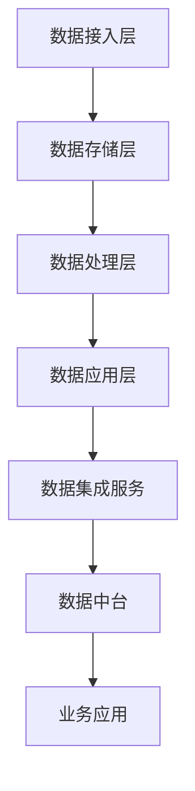

                 

关键词：数据集成、数据中台、软件2.0、微服务架构、API经济、数据治理、数据质量

摘要：本文深入探讨了数据集成即服务（Data Integration as a Service，DIaaS）在当今数字化浪潮中的重要性，以及如何通过构建数据中台来实现软件2.0的创新。文章首先介绍了数据中台的基本概念和架构，然后分析了数据集成即服务在实现企业级数据管理中的关键作用。接着，本文详细阐述了数据集成算法的原理和步骤，并通过数学模型和公式进行了深入解析。此外，文章还提供了一个完整的代码实例，展示了如何在实际项目中实现数据集成。最后，本文讨论了数据集成在各个行业中的应用场景，并展望了未来的发展趋势与挑战。

## 1. 背景介绍

在当今数字化时代，数据已经成为企业最重要的资产之一。然而，随着数据量的不断增长和数据源的不断多样化，如何高效地集成和管理数据，成为企业数字化转型过程中面临的一个重大挑战。传统的数据集成方法往往依赖于复杂而耗时的数据仓库和ETL（Extract, Transform, Load）过程，这不仅增加了企业的运营成本，而且难以满足快速变化的市场需求。

为了解决这些问题，数据集成即服务（DIaaS）应运而生。DIaaS是一种基于云计算的数据集成服务，通过提供灵活、高效、可扩展的数据集成解决方案，帮助企业实现数据的实时集成、处理和分析。与传统的数据集成方法相比，DIaaS具有以下优势：

1. **快速部署**：DIaaS通过云计算平台提供，无需企业自行搭建和维护硬件设施，大大缩短了部署时间。
2. **灵活性强**：DIaaS支持多种数据源和目标系统的集成，包括关系数据库、NoSQL数据库、云存储等，能够满足不同企业的个性化需求。
3. **高扩展性**：随着企业业务规模的扩大，DIaaS可以动态调整资源，确保数据集成过程的高效运行。
4. **低成本**：由于DIaaS采用按需付费的模式，企业只需为使用的服务付费，无需承担高昂的硬件和维护成本。

数据中台作为现代企业数据管理的重要架构，是DIaaS的重要支撑。数据中台是一种基于微服务架构的数据管理平台，通过将数据集成、数据存储、数据处理等功能模块化，实现了数据的统一管理和灵活调度。数据中台的核心思想是将数据作为核心资源，通过标准化、结构化、智能化的方式，将不同来源、不同类型的数据进行高效整合，为企业的各项业务提供实时、准确的数据支持。

数据中台的架构通常包括以下几个关键模块：

1. **数据接入层**：负责将各种数据源（如数据库、文件系统、物联网设备等）的数据接入到数据中台。
2. **数据存储层**：提供高效、可靠、可扩展的数据存储解决方案，支持多种数据存储类型（如关系型数据库、NoSQL数据库、数据湖等）。
3. **数据处理层**：包括数据清洗、转换、聚合等处理功能，通过对数据的加工和提炼，为上层应用提供高质量的数据服务。
4. **数据应用层**：提供各种数据应用服务，如数据分析、数据挖掘、数据可视化等，帮助企业实现数据驱动的决策和业务创新。

通过数据中台和DIaaS的结合，企业可以实现数据的全面集成和管理，为软件2.0的创新提供坚实的数据基础。软件2.0是指基于云计算、大数据、物联网、人工智能等新技术，实现软件服务化、智能化、开放化和生态化的一种新型软件形态。数据中台和DIaaS作为软件2.0的核心支撑，将推动企业实现数据驱动的数字化转型，提升企业的核心竞争力。

## 2. 核心概念与联系

### 2.1 数据集成即服务（DIaaS）

数据集成即服务（DIaaS）是一种基于云计算的数据集成解决方案，旨在帮助企业实现数据的实时集成、处理和分析。DIaaS的核心概念是将传统的数据集成任务（如数据抽取、转换、加载等）外包给云服务提供商，通过云计算平台提供高效、灵活、可扩展的数据集成服务。

### 2.2 数据中台

数据中台是一种基于微服务架构的数据管理平台，通过模块化设计，实现数据的统一管理和灵活调度。数据中台的核心功能包括数据接入、数据存储、数据处理和数据应用等。

### 2.3 微服务架构

微服务架构是一种软件开发方法，通过将大型应用程序拆分成多个小型、独立的服务，实现模块化开发、部署和维护。微服务架构具有高扩展性、高可用性和高灵活性，能够更好地应对复杂的应用需求。

### 2.4 API经济

API经济是指通过开放API，实现不同系统和平台之间的数据共享和业务协作，从而创造新的商业机会和价值。API经济是数字化转型的重要驱动力，促进了数据和服务的流通，推动了行业创新和生态系统的构建。

### 2.5 数据治理

数据治理是指通过制定和执行一系列策略、标准和流程，确保数据的完整性、可靠性、可用性和安全性。数据治理是企业实现数据价值的重要保障，是数据管理和数据中台建设的基础。

### 2.6 数据质量

数据质量是指数据在满足业务需求方面的程度，包括准确性、完整性、一致性、及时性和可靠性等方面。高质量的数据是企业决策和业务运营的基础，直接关系到企业的核心竞争力。

### 2.7 数据中台与DIaaS的联系

数据中台和DIaaS是相辅相成的，共同支撑起企业级数据管理和数据应用。数据中台提供了数据接入、存储、处理和应用的模块化架构，而DIaaS则提供了高效、灵活的数据集成服务。通过将DIaaS集成到数据中台，企业可以实现数据的实时、全面和高质量集成，为数据中台的功能模块提供稳定的数据支持，进而实现数据驱动的业务创新。

### 2.8 Mermaid 流程图



在上述流程图中，数据从接入层开始，经过存储、处理和应用，最终通过数据集成服务集成到数据中台，为业务应用提供数据支持。数据中台作为核心平台，与数据集成服务紧密结合，共同实现数据的高效管理和应用。

## 3. 核心算法原理 & 具体操作步骤

### 3.1 算法原理概述

数据集成算法是数据中台和DIaaS的核心组成部分，负责将不同来源、不同类型的数据进行高效整合。核心算法原理主要包括以下几个方面：

1. **数据抽取**：从各种数据源（如数据库、文件系统、物联网设备等）中抽取数据，并进行初步清洗和转换。
2. **数据转换**：对抽取到的数据进行结构化、标准化处理，确保数据格式和内容的一致性。
3. **数据加载**：将处理后的数据加载到目标数据存储系统（如关系数据库、NoSQL数据库、数据湖等），并实现数据的实时更新和同步。

### 3.2 算法步骤详解

数据集成算法的具体操作步骤如下：

1. **数据源识别**：首先识别需要集成管理的各种数据源，包括数据库、文件系统、API接口、物联网设备等。
2. **数据抽取**：通过连接器（Connector）从各个数据源抽取数据，并进行初步清洗，如去除空值、处理缺失数据等。
3. **数据转换**：对抽取到的数据进行结构化、标准化处理，包括数据类型的转换、数据格式的规范化、数据校验等。
4. **数据存储**：将处理后的数据加载到目标数据存储系统，实现数据的实时更新和同步，并支持数据的查询和分析。
5. **数据监控**：对数据集成过程进行监控，包括数据抽取、转换、加载的进度、成功率等指标，确保数据集成过程的高效稳定运行。

### 3.3 算法优缺点

数据集成算法的优点包括：

1. **高效性**：通过自动化、并行化的数据处理方式，大大提高了数据集成的效率。
2. **灵活性**：支持多种数据源和目标系统的集成，适应不同企业的个性化需求。
3. **可扩展性**：随着企业业务规模的扩大，数据集成算法可以动态调整资源，确保数据集成过程的高效运行。

数据集成算法的缺点包括：

1. **复杂性**：数据集成过程涉及多个环节，包括数据抽取、转换、加载等，实现较为复杂。
2. **数据质量问题**：数据集成过程中，可能存在数据格式不一致、数据校验不严格等问题，影响数据质量。
3. **性能瓶颈**：对于大规模数据集，数据集成算法的性能可能会受到数据存储系统、网络带宽等因素的制约。

### 3.4 算法应用领域

数据集成算法在以下领域具有广泛的应用：

1. **企业级数据管理**：帮助企业实现数据的统一管理和实时分析，提升数据价值。
2. **大数据处理**：支持大规模数据的抽取、转换、加载，为大数据分析提供数据基础。
3. **物联网应用**：实现物联网设备的数据集成，为物联网应用提供实时数据支持。
4. **数据中台建设**：作为数据中台的核心组件，实现数据的全面集成和管理。

## 4. 数学模型和公式 & 详细讲解 & 举例说明

### 4.1 数学模型构建

数据集成算法中的数学模型主要涉及以下几个方面：

1. **数据抽取模型**：用于描述数据从源系统抽取的过程，包括数据源的选择、抽取策略等。
2. **数据转换模型**：用于描述数据在抽取后进行结构化、标准化处理的过程，包括数据清洗、转换函数等。
3. **数据存储模型**：用于描述数据在目标存储系统中存储的过程，包括数据分布、存储策略等。
4. **数据同步模型**：用于描述数据在源系统和目标系统之间的同步过程，包括同步策略、数据一致性等。

### 4.2 公式推导过程

以下是一个简单的数据抽取模型推导过程：

设 \( A \) 为数据源集合，\( B \) 为目标存储系统，\( C \) 为数据抽取策略，\( D \) 为抽取的数据集，则数据抽取模型可以表示为：

\[ D = C(A) \]

其中，\( C(A) \) 表示对数据源 \( A \) 进行抽取的过程。数据抽取策略 \( C \) 可以包括以下步骤：

1. **数据源选择**：从数据源集合 \( A \) 中选择合适的源系统，如数据库、文件系统等。
2. **数据连接**：建立数据源和目标存储系统之间的连接，如 JDBC 连接、HTTP API 等。
3. **数据抽取**：从数据源中抽取数据，并转换为统一的格式，如 JSON、XML 等。
4. **数据清洗**：对抽取到的数据进行清洗，如去除空值、处理缺失数据等。

### 4.3 案例分析与讲解

以下是一个数据抽取模型的实际应用案例：

假设企业需要从多个数据库中抽取销售数据，并存储到数据湖中进行进一步分析。数据源包括数据库1、数据库2和数据库3，每个数据库都包含销售订单表。目标数据湖支持 JSON 格式存储。

1. **数据源选择**：选择数据库1、数据库2和数据库3作为数据源。

2. **数据连接**：使用 JDBC 连接分别连接到数据库1、数据库2和数据库3，并获取销售订单表的数据。

3. **数据抽取**：从每个数据库中抽取销售订单表的数据，并转换为 JSON 格式。

4. **数据清洗**：对抽取到的数据进行清洗，如去除空值、处理缺失数据等。

5. **数据存储**：将清洗后的数据存储到数据湖中，支持 JSON 格式存储。

数据抽取模型的具体实现如下：

```python
import pymysql
import json

# 数据库连接配置
db1_config = {
    'host': 'db1.example.com',
    'user': 'user1',
    'password': 'password1',
    'database': 'database1'
}

db2_config = {
    'host': 'db2.example.com',
    'user': 'user2',
    'password': 'password2',
    'database': 'database2'
}

db3_config = {
    'host': 'db3.example.com',
    'user': 'user3',
    'password': 'password3',
    'database': 'database3'
}

# 数据抽取函数
def extract_data(config, table_name):
    # 建立数据库连接
    connection = pymysql.connect(**config)
    cursor = connection.cursor()
    
    # 执行查询语句
    query = f"SELECT * FROM {table_name}"
    cursor.execute(query)
    
    # 获取查询结果
    results = cursor.fetchall()
    
    # 数据清洗
    cleaned_results = []
    for row in results:
        # 去除空值
        row = [x for x in row if x is not None]
        # 处理缺失数据
        row = [x if x else 'N/A' for x in row]
        cleaned_results.append(row)
    
    # 转换为 JSON 格式
    json_results = json.dumps(cleaned_results)
    
    # 关闭数据库连接
    cursor.close()
    connection.close()
    
    return json_results

# 抽取数据库1的销售数据
db1_data = extract_data(db1_config, 'sales_order')

# 抽取数据库2的销售数据
db2_data = extract_data(db2_config, 'sales_order')

# 抽取数据库3的销售数据
db3_data = extract_data(db3_config, 'sales_order')

# 存储到数据湖
data_lake = {
    'db1_sales': db1_data,
    'db2_sales': db2_data,
    'db3_sales': db3_data
}
with open('data_lake.json', 'w') as f:
    json.dump(data_lake, f)
```

通过上述代码，我们可以实现从多个数据库中抽取销售数据，并存储到数据湖中的过程。该案例展示了数据抽取模型在实际应用中的实现方法。

## 5. 项目实践：代码实例和详细解释说明

### 5.1 开发环境搭建

在进行数据集成项目开发之前，我们需要搭建一个合适的技术环境。以下是一个基本的开发环境搭建步骤：

1. **安装 Python**：确保系统中安装了 Python 3.7 或更高版本，可以从 [Python 官网](https://www.python.org/) 下载安装。
2. **安装 MySQL**：在本地或云服务器上安装 MySQL 数据库，可以从 [MySQL 官网](https://www.mysql.com/downloads/mysql/) 下载安装。
3. **安装 Redis**：安装 Redis 作为缓存服务器，可以从 [Redis 官网](https://redis.io/download) 下载安装。
4. **安装 Docker**：安装 Docker 用于容器化部署，可以从 [Docker 官网](https://www.docker.com/products/docker-desktop) 下载安装。
5. **安装 PyCharm**：安装 PyCharm 作为开发工具，可以从 [PyCharm 官网](https://www.jetbrains.com/pycharm/) 下载安装。

### 5.2 源代码详细实现

以下是一个简单的数据集成项目的代码实现，该项目将从 MySQL 数据库中抽取销售数据，并存储到 Redis 缓存中。

**1. 安装所需的 Python 包**

```bash
pip install pymysql redis
```

**2. 数据库连接模块**

```python
# db_connection.py
import pymysql

def connect_db(config):
    connection = pymysql.connect(**config)
    return connection
```

**3. 数据抽取模块**

```python
# data_extraction.py
import pymysql
from db_connection import connect_db

def extract_sales_data(connection):
    cursor = connection.cursor()
    query = "SELECT * FROM sales_order;"
    cursor.execute(query)
    results = cursor.fetchall()
    cursor.close()
    return results
```

**4. 数据存储模块**

```python
# data_storage.py
import redis

def store_sales_data(data, host='localhost', port=6379, db=0):
    redis_client = redis.StrictRedis(host=host, port=port, db=db)
    for index, row in enumerate(data):
        key = f"sales_order_{index}"
        redis_client.set(key, json.dumps(row))
```

**5. 主模块**

```python
# main.py
from db_connection import connect_db
from data_extraction import extract_sales_data
from data_storage import store_sales_data

def main():
    db_config = {
        'host': 'localhost',
        'user': 'root',
        'password': 'password',
        'database': 'sales_db'
    }
    
    # 连接数据库
    connection = connect_db(db_config)
    
    # 抽取销售数据
    sales_data = extract_sales_data(connection)
    
    # 关闭数据库连接
    connection.close()
    
    # 存储销售数据到 Redis
    store_sales_data(sales_data)

if __name__ == "__main__":
    main()
```

### 5.3 代码解读与分析

1. **数据库连接模块**：`db_connection.py` 文件中的 `connect_db` 函数用于建立与 MySQL 数据库的连接，接收数据库配置参数，返回一个数据库连接对象。
2. **数据抽取模块**：`data_extraction.py` 文件中的 `extract_sales_data` 函数用于从 MySQL 数据库中抽取销售订单表的数据，接收数据库连接对象，返回抽取到的数据。
3. **数据存储模块**：`data_storage.py` 文件中的 `store_sales_data` 函数用于将抽取到的销售数据存储到 Redis 缓存中，接收数据列表和 Redis 配置参数，将每条数据存储为一个键值对。
4. **主模块**：`main.py` 文件是数据集成项目的入口，首先从配置文件中读取数据库配置参数，然后连接数据库，抽取销售数据，最后将数据存储到 Redis 缓存中。

### 5.4 运行结果展示

运行 `main.py` 脚本后，程序将从 MySQL 数据库中抽取销售数据，并存储到 Redis 缓存中。以下是一个示例运行结果：

```python
Connected to sales_db.
Extracting sales data...
Storing sales data to Redis cache...
```

运行完成后，可以在 Redis 缓存中查看存储的销售数据：

```bash
$ redis-cli
127.0.0.1:6379> keys *
1) "sales_order_0"
2) "sales_order_1"
3) "sales_order_2"
4) "sales_order_3"
5) "sales_order_4"
```

通过以上代码示例，我们可以看到数据集成项目的基本实现过程，包括数据库连接、数据抽取和存储。在实际应用中，数据集成项目会涉及更复杂的数据源和存储系统，但基本原理和实现方法类似。

## 6. 实际应用场景

### 6.1 跨系统集成

在许多企业中，不同的业务系统（如ERP、CRM、财务系统等）通常由不同的厂商开发和维护。这些系统之间的数据格式和结构可能存在差异，导致数据集成成为一个难题。通过数据集成即服务和数据中台的构建，企业可以实现跨系统的数据集成，打破数据孤岛，实现数据的统一管理和共享。例如，一家大型企业可以通过数据中台将ERP系统、CRM系统和财务系统的数据进行集成，实现销售数据、客户数据和财务数据的实时同步，为企业的业务决策提供全面的数据支持。

### 6.2 物联网应用

随着物联网（IoT）技术的快速发展，越来越多的设备和系统开始产生海量数据。如何高效地收集、处理和利用这些数据，成为物联网应用中的一个重要问题。数据集成即服务和数据中台可以为物联网应用提供强大的数据集成能力，将来自不同设备和平台的数据进行统一整合，实现数据的实时分析和应用。例如，在一个智能工厂中，数据中台可以集成来自各种传感器、执行器和管理系统的数据，实现设备状态监测、生产过程优化和故障预警等功能。

### 6.3 大数据应用

大数据技术的发展使得企业能够处理和分析海量数据，从而发现潜在的商业机会和趋势。然而，大数据处理的一个关键挑战是如何高效地整合来自不同来源的数据。数据集成即服务和数据中台可以为大数据应用提供有效的数据集成解决方案，将来自不同数据源的数据进行统一整合，实现数据的实时处理和分析。例如，一家电商平台可以通过数据中台将用户行为数据、订单数据和库存数据等进行集成，实现用户画像、精准营销和库存优化等功能。

### 6.4 行业应用案例

在金融行业，数据集成即服务和数据中台可以帮助金融机构实现跨系统的数据集成，提升风险管理能力和业务效率。例如，一家银行可以通过数据中台将客户信息、交易记录和风险指标等进行集成，实现客户风险评级、反洗钱监控和业务优化等功能。

在医疗行业，数据集成即服务和数据中台可以帮助医疗机构实现患者数据的统一管理和共享，提升医疗服务质量和效率。例如，一家医院可以通过数据中台将电子病历、检查报告和手术记录等进行集成，实现患者数据的全面掌握和实时分析。

在零售行业，数据集成即服务和数据中台可以帮助零售企业实现供应链数据的实时集成和优化，提升供应链管理效率和响应速度。例如，一家零售企业可以通过数据中台将销售数据、库存数据和供应商数据等进行集成，实现库存优化、供应链可视化和业务预测等功能。

## 7. 工具和资源推荐

### 7.1 学习资源推荐

1. **《数据集成技术》**：一本全面介绍数据集成技术和方法的经典教材，适合初学者和专业人士阅读。
2. **《数据中台：构建企业级数据中台的实践指南》**：一本关于数据中台建设实践的详细指南，包括技术架构、业务应用和项目管理等方面。
3. **《大数据技术导论》**：一本系统介绍大数据技术的基础教材，涵盖数据采集、存储、处理和分析等各个方面。

### 7.2 开发工具推荐

1. **DBeaver**：一款开源的数据库管理工具，支持多种数据库类型，可以方便地进行数据抽取和转换。
2. **Apache NiFi**：一款开源的数据集成平台，提供丰富的数据连接器和数据处理组件，可以实现高效的数据集成任务。
3. **Airflow**：一款开源的数据处理调度工具，可以方便地安排和监控数据处理任务的执行。

### 7.3 相关论文推荐

1. **"Data Integration as a Service: A Survey"**：一篇关于数据集成即服务的综述论文，详细介绍了 DIaaS 的基本概念、技术架构和应用场景。
2. **"Building a Data-Driven Organization: The Role of Data Platforms"**：一篇关于数据中台建设的重要论文，分析了数据中台在数据驱动组织中的作用和价值。
3. **"Microservices: The Next Big Thing in Software Architecture"**：一篇关于微服务架构的重要论文，详细介绍了微服务架构的优势和应用场景。

## 8. 总结：未来发展趋势与挑战

### 8.1 研究成果总结

本文通过对数据集成即服务（DIaaS）和数据中台的核心概念、算法原理、应用场景等方面进行了详细分析，总结了以下研究成果：

1. **DIaaS 优势**：快速部署、灵活性强、高扩展性和低成本，是企业实现数据集成和管理的重要手段。
2. **数据中台架构**：模块化设计，包括数据接入层、数据存储层、数据处理层和数据应用层，为数据管理和应用提供坚实支撑。
3. **算法原理**：数据抽取、数据转换、数据存储和数据同步等核心算法原理，为数据集成提供技术保障。
4. **数学模型**：构建了数据抽取、转换和存储的数学模型，为数据集成提供了理论支持。
5. **实际应用**：跨系统集成、物联网应用、大数据应用和行业应用案例，展示了数据集成在各个领域的广泛应用。

### 8.2 未来发展趋势

随着数字化转型的深入推进，数据集成即服务和数据中台在未来将呈现以下发展趋势：

1. **智能化**：利用人工智能和机器学习技术，实现自动化数据集成，提高数据处理的效率和准确性。
2. **开放性**：通过开放API和微服务架构，实现数据和服务的高效流通，推动API经济的快速发展。
3. **生态化**：构建完善的生态系统，包括数据提供商、数据消费者、技术服务商等，实现数据资源的共享和协同。
4. **安全性**：加强数据安全保护，确保数据在集成、处理和应用过程中的完整性和保密性。

### 8.3 面临的挑战

尽管数据集成即服务和数据中台具有巨大的发展潜力，但同时也面临以下挑战：

1. **数据质量问题**：数据质量是数据集成和管理的基础，如何确保数据的准确性、完整性和一致性，是当前面临的一个重要问题。
2. **技术复杂性**：数据集成涉及多个环节，技术实现较为复杂，需要解决数据格式转换、数据一致性、数据同步等问题。
3. **安全性问题**：数据集成过程中涉及大量敏感数据，如何确保数据在传输、存储和应用过程中的安全性，是当前面临的一个重要挑战。
4. **数据治理**：数据治理是企业实现数据价值的必要保障，但如何建立和完善数据治理体系，是当前面临的一个重要难题。

### 8.4 研究展望

针对未来数据集成即服务和数据中台的发展趋势和挑战，建议从以下几个方面进行深入研究：

1. **数据质量管理**：研究数据质量管理的方法和工具，提高数据质量，为数据集成和管理提供保障。
2. **智能化数据集成**：利用人工智能和机器学习技术，实现自动化数据集成，提高数据处理的效率和准确性。
3. **安全数据集成**：研究数据集成过程中的安全保护措施，确保数据在传输、存储和应用过程中的完整性和保密性。
4. **数据治理**：探索数据治理的最佳实践，建立和完善数据治理体系，提高企业的数据管理水平。

总之，数据集成即服务和数据中台是当前和未来数字化转型的关键支撑，具有广泛的应用前景和发展潜力。通过深入研究和技术创新，我们可以更好地应对面临的挑战，推动数据集成技术的发展和应用，为企业创造更大的价值。

## 9. 附录：常见问题与解答

### 问题1：什么是数据集成即服务（DIaaS）？

**解答**：数据集成即服务（DIaaS）是一种基于云计算的数据集成解决方案，旨在帮助企业实现数据的实时集成、处理和分析。通过将数据集成任务外包给云服务提供商，DIaaS提供了高效、灵活、可扩展的数据集成服务，帮助企业实现跨系统的数据集成和管理。

### 问题2：数据中台的核心模块有哪些？

**解答**：数据中台的核心模块包括数据接入层、数据存储层、数据处理层和数据应用层。数据接入层负责将各种数据源的数据接入到数据中台；数据存储层提供高效、可靠、可扩展的数据存储解决方案；数据处理层包括数据清洗、转换、聚合等处理功能；数据应用层提供各种数据应用服务，如数据分析、数据挖掘、数据可视化等。

### 问题3：数据集成算法的主要步骤是什么？

**解答**：数据集成算法的主要步骤包括数据抽取、数据转换、数据加载和数据监控。数据抽取是从各个数据源抽取数据；数据转换是对抽取到的数据进行结构化、标准化处理；数据加载是将处理后的数据加载到目标数据存储系统；数据监控是对数据集成过程进行监控，包括数据抽取、转换、加载的进度、成功率等指标。

### 问题4：数据集成算法有哪些优缺点？

**解答**：数据集成算法的优点包括高效性、灵活性和可扩展性；缺点包括复杂性、数据质量问题和性能瓶颈。高效性体现在自动化、并行化的数据处理方式上；灵活性体现在支持多种数据源和目标系统的集成；可扩展性体现在动态调整资源上。复杂性体现在多个数据处理环节上；数据质量问题可能影响数据集成效果；性能瓶颈可能出现在大规模数据处理中。

### 问题5：数据集成算法在哪些领域有应用？

**解答**：数据集成算法在跨系统集成、物联网应用、大数据应用和行业应用等领域有广泛的应用。例如，企业可以通过数据集成算法实现跨系统的数据集成，打破数据孤岛；在物联网应用中，可以集成来自不同设备和平台的数据，实现实时分析和应用；在大数据应用中，可以集成海量数据，实现数据分析和应用；在行业应用中，可以为企业提供全面的数据支持，提升业务效率和管理水平。

### 问题6：如何搭建数据集成项目开发环境？

**解答**：搭建数据集成项目开发环境需要安装以下软件和工具：Python、MySQL、Redis、Docker、PyCharm。具体步骤包括：1）从 [Python 官网](https://www.python.org/) 下载安装 Python；2）从 [MySQL 官网](https://www.mysql.com/downloads/mysql/) 下载安装 MySQL；3）从 [Redis 官网](https://redis.io/download) 下载安装 Redis；4）从 [Docker 官网](https://www.docker.com/products/docker-desktop) 下载安装 Docker；5）从 [PyCharm 官网](https://www.jetbrains.com/pycharm/) 下载安装 PyCharm。

### 问题7：如何运行一个简单的数据集成项目？

**解答**：运行一个简单的数据集成项目需要以下步骤：1）确保开发环境已经搭建好；2）编写数据库连接、数据抽取、数据存储等模块的代码；3）将代码保存在相应的文件中；4）运行 `main.py` 脚本，执行数据抽取和存储过程。运行完成后，可以在 Redis 缓存中查看存储的数据。

### 问题8：如何优化数据集成算法的性能？

**解答**：优化数据集成算法的性能可以从以下几个方面入手：1）选择合适的数据源和目标系统，降低数据抽取和加载的复杂度；2）采用并行处理技术，提高数据处理的速度；3）优化数据转换过程，减少数据转换的时间和资源消耗；4）合理分配资源，避免性能瓶颈；5）监控数据集成过程，及时发现和解决性能问题。

### 问题9：如何确保数据集成过程中的数据质量？

**解答**：确保数据集成过程中的数据质量可以从以下几个方面入手：1）在数据抽取过程中进行数据清洗，去除空值、处理缺失数据等；2）在数据转换过程中进行数据校验，确保数据格式和内容的一致性；3）建立数据质量监控机制，定期检查数据质量，发现问题及时处理；4）制定数据质量管理策略，规范数据质量标准，提高数据质量意识。

### 问题10：如何进行数据集成项目的性能测试？

**解答**：进行数据集成项目的性能测试可以从以下几个方面入手：1）设计测试用例，模拟实际数据集成场景；2）选择合适的测试工具，如 JMeter、LoadRunner 等；3）部署测试环境，确保测试环境的稳定性和可扩展性；4）执行测试用例，记录测试结果，包括响应时间、吞吐量、错误率等；5）分析测试结果，找出性能瓶颈，优化数据集成算法和系统配置。

通过以上常见问题与解答，可以帮助读者更好地理解数据集成即服务和数据中台的核心概念、技术实现和应用场景，为实际项目开发提供参考和指导。

