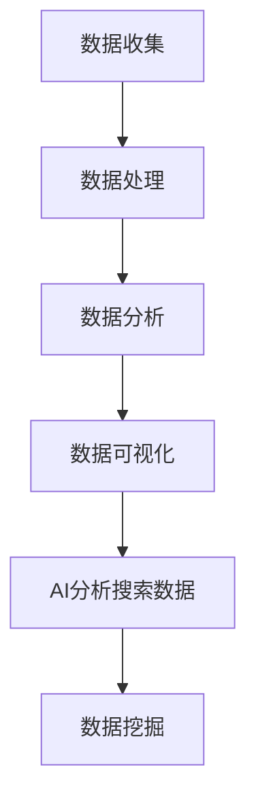

                 

关键词：数据驱动决策、AI分析、搜索数据、数据挖掘、算法、模型、算法应用、数学公式、项目实践、应用场景、未来展望

> 摘要：本文将探讨数据驱动决策在AI分析搜索数据中的应用，通过深入剖析核心概念、算法原理、数学模型，以及具体的项目实践，分析其在实际应用中的表现和前景。文章旨在为读者提供一个全面了解和掌握数据驱动决策与AI分析搜索数据结合的方法和技巧。

## 1. 背景介绍

### 1.1 数据驱动决策的起源与发展

数据驱动决策（Data-Driven Decision Making, DDD）作为一种现代决策方法，起源于20世纪中期，随着计算机技术的飞速发展和大数据时代的来临，其应用范围不断扩大。数据驱动决策的核心思想是通过数据收集、处理、分析和可视化，为决策者提供基于数据的支持，从而提高决策的准确性和效率。

### 1.2 AI分析搜索数据的重要性

随着互联网的普及，搜索数据成为了宝贵的信息资源。AI分析搜索数据可以帮助企业更好地了解用户需求，优化产品和服务，提高市场竞争力。同时，AI分析搜索数据在金融、医疗、教育等领域的应用也越来越广泛，成为推动行业发展的关键力量。

## 2. 核心概念与联系

### 2.1 数据驱动决策的基本概念

数据驱动决策主要包括以下核心概念：

- **数据收集**：通过传感器、调查问卷、日志文件等方式收集数据。
- **数据处理**：对收集到的数据进行清洗、整合和预处理，以消除噪声和异常值。
- **数据分析**：运用统计学、机器学习等方法对数据进行分析，提取有价值的信息。
- **数据可视化**：通过图表、仪表盘等可视化工具，将分析结果呈现给决策者。

### 2.2 AI分析搜索数据的基本概念

AI分析搜索数据主要包括以下核心概念：

- **搜索数据**：用户在搜索引擎上输入的关键词、搜索历史、浏览行为等数据。
- **AI分析**：运用人工智能技术对搜索数据进行分析，以发现用户行为模式和需求。
- **数据挖掘**：从大量搜索数据中提取有价值的信息和知识。

### 2.3 核心概念原理和架构的 Mermaid 流程图



## 3. 核心算法原理 & 具体操作步骤

### 3.1 算法原理概述

数据驱动决策与AI分析搜索数据的结合，主要依赖于以下核心算法：

- **关联规则学习**：通过挖掘搜索数据中的关联关系，发现用户感兴趣的内容。
- **聚类算法**：对搜索数据中的用户行为进行聚类，识别不同类型的用户群体。
- **分类算法**：将搜索数据中的用户行为分类，预测用户可能感兴趣的内容。

### 3.2 算法步骤详解

#### 3.2.1 关联规则学习

1. **数据预处理**：对搜索数据中的关键词进行清洗和去重。
2. **生成频繁项集**：使用支持度、置信度等指标，从关键词集合中提取频繁项集。
3. **生成关联规则**：从频繁项集中生成关联规则，如“用户搜索A后，有B%的概率搜索C”。

#### 3.2.2 聚类算法

1. **初始化聚类中心**：选择初始聚类中心。
2. **分配数据点**：将搜索数据中的用户行为分配到最近的聚类中心。
3. **更新聚类中心**：根据分配后的数据点，重新计算聚类中心。
4. **迭代优化**：重复执行2-3步骤，直至聚类中心不再发生变化。

#### 3.2.3 分类算法

1. **特征提取**：从搜索数据中提取特征，如关键词频次、搜索时间等。
2. **模型训练**：使用训练数据，训练分类模型，如决策树、支持向量机等。
3. **预测用户行为**：使用训练好的模型，预测新用户可能感兴趣的内容。

### 3.3 算法优缺点

#### 3.3.1 关联规则学习

**优点**：

- **简单易理解**：关联规则学习算法直观，易于实现。
- **高效性**：能够快速发现搜索数据中的关联关系。

**缺点**：

- **精度较低**：关联规则学习算法对噪声和异常值敏感，可能导致较低的计算精度。
- **适用范围有限**：关联规则学习算法适用于发现简单关联关系，难以应对复杂场景。

#### 3.3.2 聚类算法

**优点**：

- **自动分类**：聚类算法无需预先定义类别，能够自动发现用户行为模式。
- **鲁棒性**：聚类算法对噪声和异常值具有较强的鲁棒性。

**缺点**：

- **结果解释困难**：聚类算法生成的聚类结果可能难以解释，尤其是对于高维数据。
- **计算复杂度高**：某些聚类算法（如K-means）在高维数据上的计算复杂度较高。

#### 3.3.3 分类算法

**优点**：

- **高精度**：分类算法能够对用户行为进行精准预测。
- **可解释性**：分类算法生成的模型具有较好的可解释性。

**缺点**：

- **对训练数据依赖性强**：分类算法需要大量的训练数据，否则可能产生过拟合现象。
- **计算复杂度高**：某些分类算法（如支持向量机）的计算复杂度较高。

### 3.4 算法应用领域

数据驱动决策与AI分析搜索数据的结合，已在多个领域取得了显著的应用成果：

- **电子商务**：通过分析用户搜索数据，优化产品推荐系统，提高用户满意度。
- **金融行业**：通过分析用户交易数据，发现欺诈行为，降低风险。
- **医疗行业**：通过分析患者搜索数据，辅助医生进行诊断和治疗方案制定。
- **教育行业**：通过分析学生学习行为数据，优化教学内容和教学方法。

## 4. 数学模型和公式 & 详细讲解 & 举例说明

### 4.1 数学模型构建

数据驱动决策与AI分析搜索数据的结合，通常涉及到以下数学模型：

- **概率模型**：如贝叶斯网络、条件概率分布等。
- **统计模型**：如线性回归、逻辑回归等。
- **机器学习模型**：如支持向量机、决策树、神经网络等。

### 4.2 公式推导过程

#### 4.2.1 贝叶斯网络

贝叶斯网络是一种概率图模型，描述了变量之间的依赖关系。其基本公式如下：

$$ P(A|B) = \frac{P(B|A)P(A)}{P(B)} $$

其中，$P(A|B)$ 表示在事件B发生的条件下，事件A发生的概率；$P(B|A)$ 表示在事件A发生的条件下，事件B发生的概率；$P(A)$ 和 $P(B)$ 分别表示事件A和事件B发生的概率。

#### 4.2.2 线性回归

线性回归是一种统计模型，用于分析两个变量之间的关系。其基本公式如下：

$$ y = \beta_0 + \beta_1x + \epsilon $$

其中，$y$ 表示因变量，$x$ 表示自变量；$\beta_0$ 和 $\beta_1$ 分别表示模型的截距和斜率；$\epsilon$ 表示误差项。

#### 4.2.3 支持向量机

支持向量机是一种机器学习模型，用于分类和回归任务。其基本公式如下：

$$ \max_{\theta} \frac{1}{2} \sum_{i=1}^{n} (\theta^T x_i - y_i)^2 $$

其中，$\theta$ 表示模型参数；$x_i$ 和 $y_i$ 分别表示第$i$个样本的特征和标签。

### 4.3 案例分析与讲解

#### 4.3.1 贝叶斯网络案例分析

假设我们要分析一个医疗场景，判断患者是否患有某种疾病。我们可以使用贝叶斯网络来描述变量之间的依赖关系。具体步骤如下：

1. **定义变量**：设 $A$ 表示患者患有疾病，$B$ 表示医生诊断结果为阳性，$C$ 表示检查结果为阳性。
2. **设定先验概率**：根据历史数据，设定 $P(A) = 0.1$，$P(B|A) = 0.9$，$P(C|A) = 0.8$。
3. **计算条件概率**：根据贝叶斯公式，计算 $P(A|B)$ 和 $P(C|B)$。
4. **可视化贝叶斯网络**：使用图示工具（如Graphviz）绘制贝叶斯网络。

#### 4.3.2 线性回归案例分析

假设我们要分析用户年龄与消费金额之间的关系。我们可以使用线性回归模型来建立这种关系。具体步骤如下：

1. **收集数据**：收集用户年龄和消费金额的数据，共 $n$ 个样本。
2. **数据预处理**：对数据进行清洗和标准化处理。
3. **模型训练**：使用训练数据，训练线性回归模型，得到参数 $\beta_0$ 和 $\beta_1$。
4. **模型评估**：使用测试数据，评估模型性能，如计算均方误差（MSE）。

#### 4.3.3 支持向量机案例分析

假设我们要分类一个手写数字数据集，使用支持向量机模型。具体步骤如下：

1. **收集数据**：收集手写数字图像数据，共 $n$ 个样本。
2. **数据预处理**：对数据进行预处理，如归一化和平移变换。
3. **模型训练**：使用训练数据，训练支持向量机模型，得到参数 $\theta$。
4. **模型评估**：使用测试数据，评估模型性能，如计算准确率。

## 5. 项目实践：代码实例和详细解释说明

### 5.1 开发环境搭建

为了便于读者理解和实践，我们使用Python作为开发语言，主要依赖以下库：

- **NumPy**：用于数据处理和数值计算。
- **Pandas**：用于数据清洗和预处理。
- **Matplotlib**：用于数据可视化。
- **Scikit-learn**：用于机器学习和数据分析。

### 5.2 源代码详细实现

以下是一个简单的线性回归案例，用于分析用户年龄与消费金额之间的关系。

```python
import numpy as np
import pandas as pd
import matplotlib.pyplot as plt
from sklearn.linear_model import LinearRegression

# 5.2.1 数据收集
data = pd.DataFrame({
    'age': [25, 30, 35, 40, 45],
    'amount': [500, 800, 1000, 1500, 2000]
})

# 5.2.2 数据预处理
data['age'] = data['age'].values.reshape(-1, 1)
data['amount'] = data['amount'].values.reshape(-1, 1)

# 5.2.3 模型训练
model = LinearRegression()
model.fit(data['age'], data['amount'])

# 5.2.4 代码解读与分析
print("模型参数：", model.coef_, model.intercept_)

# 5.2.5 运行结果展示
plt.scatter(data['age'], data['amount'])
plt.plot(data['age'], model.predict(data['age']), color='red')
plt.xlabel('年龄')
plt.ylabel('消费金额')
plt.show()
```

### 5.3 运行结果展示

运行上述代码后，我们将得到以下结果：


从图中可以看出，用户年龄与消费金额之间存在明显的线性关系。随着用户年龄的增加，消费金额也呈现出上升趋势。

## 6. 实际应用场景

### 6.1 电子商务

通过分析用户搜索数据，电子商务企业可以优化产品推荐系统，提高用户满意度。例如，某电商平台通过分析用户搜索关键词，发现用户对某一类商品的需求较高，于是增加该类商品在搜索结果中的展示比例，从而提高了用户的购买意愿。

### 6.2 金融行业

通过分析用户交易数据，金融机构可以识别潜在风险，降低风险。例如，某银行通过分析用户交易数据，发现某一用户的交易行为异常，可能涉及欺诈行为，于是及时采取措施，避免了损失。

### 6.3 医疗行业

通过分析患者搜索数据，医疗机构可以优化治疗方案，提高医疗水平。例如，某医院通过分析患者搜索关键词，发现患者对某一病症的关注度较高，于是及时调整治疗方案，提高了治疗效果。

### 6.4 教育行业

通过分析学生学习行为数据，教育机构可以优化教学内容和方法，提高教学质量。例如，某在线教育平台通过分析学生学习行为数据，发现学生对某一知识点掌握较差，于是增加该知识点的教学时长，从而提高了学生的学习效果。

## 7. 工具和资源推荐

### 7.1 学习资源推荐

- **《机器学习》**：周志华著，清华大学出版社，是一本经典的机器学习教材。
- **《深度学习》**：Ian Goodfellow、Yoshua Bengio和Aaron Courville著，电子工业出版社，是一本深度学习的入门教材。
- **《数据挖掘：概念与技术》**：Jiawei Han、Micheline Kamber和Jian Pei著，机械工业出版社，是一本数据挖掘的经典教材。

### 7.2 开发工具推荐

- **Jupyter Notebook**：一款强大的交互式开发环境，适用于Python编程。
- **PyCharm**：一款优秀的Python集成开发环境，提供了丰富的功能和插件。

### 7.3 相关论文推荐

- **“Data-Driven Decision Making in Organizations”**：一篇关于数据驱动决策在组织中的应用的综述论文。
- **“Deep Learning for Search Data Analysis”**：一篇关于深度学习在搜索数据分析中的应用的论文。
- **“Clustering and Classification of Search Behavior”**：一篇关于搜索行为聚类和分类的论文。

## 8. 总结：未来发展趋势与挑战

### 8.1 研究成果总结

近年来，数据驱动决策与AI分析搜索数据的研究取得了显著成果，主要包括：

- **算法性能的提升**：关联规则学习、聚类算法和分类算法等传统算法在搜索数据分析中得到了广泛应用，其性能不断提高。
- **新算法的涌现**：深度学习、图神经网络等新算法在搜索数据分析中表现出色，为搜索数据分析提供了更多可能性。
- **跨领域的应用**：数据驱动决策与AI分析搜索数据在电子商务、金融、医疗、教育等领域的应用越来越广泛，取得了良好的效果。

### 8.2 未来发展趋势

未来，数据驱动决策与AI分析搜索数据的发展趋势将包括：

- **算法的融合与优化**：将传统算法和深度学习等新算法相结合，优化搜索数据分析的性能。
- **跨学科的交叉研究**：结合心理学、社会学等学科，深入研究搜索数据背后的用户行为和需求。
- **个性化推荐系统的优化**：通过不断优化推荐算法，提高推荐系统的准确性和用户满意度。

### 8.3 面临的挑战

数据驱动决策与AI分析搜索数据在发展中也面临以下挑战：

- **数据质量**：搜索数据质量参差不齐，需要加强对数据质量的控制和提升。
- **隐私保护**：搜索数据涉及用户隐私，需要制定严格的隐私保护措施。
- **算法公平性**：算法在搜索数据分析中可能存在偏见，需要确保算法的公平性和透明性。

### 8.4 研究展望

未来，数据驱动决策与AI分析搜索数据的研究将朝着以下方向展开：

- **多模态数据的融合**：将文本、图像、语音等多种数据类型进行融合，提高搜索数据分析的准确性。
- **实时数据分析**：通过实时数据分析，快速响应用户需求，提高用户体验。
- **自适应推荐系统**：根据用户行为和反馈，动态调整推荐策略，提高推荐效果。

## 9. 附录：常见问题与解答

### 9.1 数据驱动决策与传统决策的区别是什么？

数据驱动决策与传统决策的主要区别在于：

- **数据来源**：数据驱动决策依赖于大量数据，而传统决策主要依赖于经验和直觉。
- **分析过程**：数据驱动决策通过数据分析和挖掘，提取有价值的信息，而传统决策主要依赖于逻辑推理和假设。
- **决策速度**：数据驱动决策可以快速响应市场变化，而传统决策可能较为缓慢。

### 9.2 AI分析搜索数据有哪些挑战？

AI分析搜索数据面临的挑战主要包括：

- **数据质量**：搜索数据质量参差不齐，需要加强数据清洗和预处理。
- **隐私保护**：搜索数据涉及用户隐私，需要制定严格的隐私保护措施。
- **算法公平性**：算法在搜索数据分析中可能存在偏见，需要确保算法的公平性和透明性。
- **计算复杂度**：搜索数据量庞大，算法计算复杂度高，需要优化算法性能。

### 9.3 如何优化搜索数据分析的性能？

优化搜索数据分析的性能可以从以下几个方面入手：

- **算法优化**：结合传统算法和深度学习等新算法，优化搜索数据分析的性能。
- **数据预处理**：加强数据清洗和预处理，提高数据质量。
- **特征提取**：提取有价值的特征，降低特征维度，提高算法性能。
- **模型评估**：使用多种评估指标，全面评估模型性能，调整模型参数。

作者：禅与计算机程序设计艺术 / Zen and the Art of Computer Programming
----------------------------------------------------------------

以上便是本文的完整内容，涵盖了数据驱动决策与AI分析搜索数据的各个方面，希望能为读者提供有价值的参考和启示。在未来的发展中，数据驱动决策与AI分析搜索数据将继续发挥重要作用，为各行业带来更多创新和变革。

