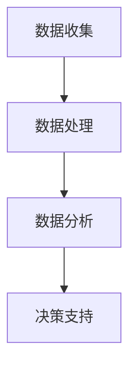

                 

关键词：数据驱动决策、人工智能、机器学习、数据挖掘、算法优化

> 摘要：本文旨在探讨数据驱动决策在人工智能（AI）领域的实现与应用。通过深入分析核心概念、算法原理、数学模型以及项目实践，本文为读者呈现了一个全面的数据驱动决策框架，并对其未来发展提出了展望。

## 1. 背景介绍

随着信息技术的飞速发展，数据已成为现代企业和社会的关键资源。然而，如何从海量数据中提取有价值的信息，并利用这些信息进行决策，成为一个亟待解决的问题。数据驱动决策（Data-Driven Decision Making）作为一种基于数据分析的决策方法，日益受到关注。其核心在于通过收集、处理和分析数据，提供客观、科学的决策依据，从而提高决策的准确性和效率。

人工智能（Artificial Intelligence，AI）作为一门模拟、延伸和扩展人类智能的科学，正深刻地改变着我们的生活方式。在AI领域，数据驱动决策的应用涵盖了各个层面，从智能推荐系统、智能客服到自动驾驶，无不依赖于对大量数据的深度挖掘和分析。

本文将围绕数据驱动决策在AI领域的实现，探讨其核心概念、算法原理、数学模型和项目实践，并对其未来发展提出展望。

## 2. 核心概念与联系

### 2.1 数据驱动决策

数据驱动决策是一种基于数据的决策方法，其核心在于利用数据分析和挖掘技术，从海量数据中提取有价值的信息，为决策提供支持。数据驱动决策通常包括以下几个步骤：

1. **数据收集**：收集与决策相关的各种数据，包括结构化数据、半结构化数据和非结构化数据。
2. **数据处理**：对收集到的数据进行清洗、转换和整合，使其具备可用性。
3. **数据分析**：利用统计方法、机器学习算法等对数据进行分析，提取有价值的信息。
4. **决策支持**：根据分析结果，为决策者提供客观、科学的决策建议。

### 2.2 人工智能

人工智能是一门研究、开发和应用使计算机模拟、延伸和扩展人类智能的理论、方法和技术的科学。人工智能的主要研究领域包括机器学习、计算机视觉、自然语言处理等。在数据驱动决策中，人工智能通过对大量数据的分析和处理，提供智能化的决策支持。

### 2.3 数据挖掘

数据挖掘（Data Mining）是一种从大量数据中提取有价值信息的过程，它利用统计学、机器学习、数据库和人工智能等技术，发现数据中的模式和关联。数据挖掘在数据驱动决策中起着关键作用，它帮助从海量数据中提取有价值的洞察，为决策提供支持。

### 2.4 Mermaid 流程图



## 3. 核心算法原理 & 具体操作步骤

### 3.1 算法原理概述

数据驱动决策在AI领域主要依赖于以下几种核心算法：

1. **机器学习算法**：如线性回归、决策树、支持向量机等，用于分析数据并提取规律。
2. **深度学习算法**：如卷积神经网络（CNN）、循环神经网络（RNN）等，用于处理复杂的数据结构和模式。
3. **聚类算法**：如K均值聚类、层次聚类等，用于发现数据中的模式和关联。
4. **关联规则算法**：如Apriori算法、FP-Growth算法等，用于发现数据中的关联关系。

### 3.2 算法步骤详解

1. **数据收集**：收集与决策相关的数据，包括用户行为数据、市场数据等。
2. **数据处理**：对收集到的数据进行清洗、转换和整合，使其具备可用性。
3. **特征工程**：根据业务需求，提取和构造特征，为算法提供输入。
4. **算法选择**：根据数据特点和业务需求，选择合适的算法进行训练。
5. **模型训练**：利用训练数据，对算法模型进行训练，使其学会提取数据中的规律。
6. **模型评估**：利用测试数据，对训练好的模型进行评估，判断其性能。
7. **决策支持**：根据模型预测结果，为决策者提供客观、科学的决策建议。

### 3.3 算法优缺点

- **机器学习算法**：优点在于能够自动提取数据中的特征，提高决策的准确性。缺点是对数据质量要求较高，且模型解释性较差。
- **深度学习算法**：优点在于能够处理复杂的数据结构和模式，提高决策的准确性。缺点是训练过程复杂，对计算资源要求较高。
- **聚类算法**：优点在于能够自动发现数据中的模式和关联，缺点是聚类结果可能依赖于参数设置，解释性较差。
- **关联规则算法**：优点在于能够发现数据中的关联关系，缺点是对大规模数据处理能力较差。

### 3.4 算法应用领域

数据驱动决策在AI领域的应用广泛，包括但不限于以下领域：

1. **智能推荐系统**：通过分析用户行为数据，为用户推荐个性化的产品或服务。
2. **金融风险管理**：通过分析市场数据，预测金融市场趋势，为投资决策提供支持。
3. **医疗健康**：通过分析患者数据，为医生提供诊断和治疗方案建议。
4. **智能客服**：通过分析用户提问，为客服人员提供智能化的回答建议。
5. **自动驾驶**：通过分析道路数据和环境信息，实现自动驾驶功能。

## 4. 数学模型和公式 & 详细讲解 & 举例说明

### 4.1 数学模型构建

数据驱动决策中的数学模型主要包括机器学习模型、深度学习模型和聚类模型等。以下以线性回归模型为例进行说明。

线性回归模型是一种经典的机器学习算法，用于预测连续值输出。其数学模型可以表示为：

$$
y = \beta_0 + \beta_1 \cdot x_1 + \beta_2 \cdot x_2 + ... + \beta_n \cdot x_n + \epsilon
$$

其中，$y$ 为预测值，$x_1, x_2, ..., x_n$ 为输入特征，$\beta_0, \beta_1, ..., \beta_n$ 为模型参数，$\epsilon$ 为误差项。

### 4.2 公式推导过程

线性回归模型的公式推导过程如下：

1. **目标函数**：线性回归的目标是最小化预测值与实际值之间的误差平方和，即：

$$
J(\beta_0, \beta_1, ..., \beta_n) = \sum_{i=1}^{m} (y_i - (\beta_0 + \beta_1 \cdot x_{i1} + \beta_2 \cdot x_{i2} + ... + \beta_n \cdot x_{in}))^2
$$

2. **梯度下降**：为了求解模型参数，可以采用梯度下降算法。梯度下降的目标是沿着目标函数的梯度方向进行迭代更新，直到目标函数值收敛。

$$
\beta_j = \beta_j - \alpha \cdot \frac{\partial J(\beta_0, \beta_1, ..., \beta_n)}{\partial \beta_j}
$$

其中，$\alpha$ 为学习率。

### 4.3 案例分析与讲解

假设我们有一个住房价格预测问题，已知影响住房价格的因素包括房屋面积（$x_1$）和房屋年龄（$x_2$）。我们希望利用线性回归模型预测房屋价格（$y$）。

1. **数据收集**：收集包含房屋面积、房屋年龄和房屋价格的样本数据。
2. **数据处理**：对收集到的数据进行清洗和转换，去除缺失值和异常值，并将数据标准化。
3. **特征工程**：提取房屋面积和房屋年龄作为输入特征。
4. **算法选择**：选择线性回归模型进行训练。
5. **模型训练**：利用训练数据，对线性回归模型进行训练。
6. **模型评估**：利用测试数据，对训练好的模型进行评估，判断其性能。
7. **预测应用**：利用模型对新的房屋数据（房屋面积、房屋年龄）进行预测，得到房屋价格。

## 5. 项目实践：代码实例和详细解释说明

### 5.1 开发环境搭建

1. **Python环境**：安装Python 3.8及以上版本，并配置好pip和virtualenv。
2. **依赖库**：安装NumPy、Pandas、Scikit-learn等Python依赖库。

### 5.2 源代码详细实现

```python
import numpy as np
import pandas as pd
from sklearn.linear_model import LinearRegression
from sklearn.model_selection import train_test_split
from sklearn.metrics import mean_squared_error

# 1. 数据收集
data = pd.read_csv('house_price_data.csv')

# 2. 数据处理
data = data.dropna()
data = data[['area', 'age', 'price']]

# 3. 特征工程
X = data[['area', 'age']]
y = data['price']

# 4. 算法选择
model = LinearRegression()

# 5. 模型训练
X_train, X_test, y_train, y_test = train_test_split(X, y, test_size=0.2, random_state=42)
model.fit(X_train, y_train)

# 6. 模型评估
y_pred = model.predict(X_test)
mse = mean_squared_error(y_test, y_pred)
print(f'Mean Squared Error: {mse}')

# 7. 预测应用
new_data = np.array([[2000, 10]])
predicted_price = model.predict(new_data)
print(f'Predicted Price: {predicted_price[0]}')
```

### 5.3 代码解读与分析

1. **数据收集**：使用Pandas库读取CSV文件，获取包含房屋面积、房屋年龄和房屋价格的样本数据。
2. **数据处理**：对数据集进行清洗，去除缺失值和异常值，并划分特征和标签。
3. **特征工程**：提取房屋面积和房屋年龄作为输入特征。
4. **算法选择**：选择线性回归模型，并使用Scikit-learn库进行训练。
5. **模型训练**：使用训练数据，对线性回归模型进行训练。
6. **模型评估**：使用测试数据，对训练好的模型进行评估，计算均方误差（MSE）。
7. **预测应用**：利用训练好的模型，对新的房屋数据进行预测，得到房屋价格。

## 6. 实际应用场景

数据驱动决策在AI领域的应用场景广泛，以下列举几个典型应用场景：

1. **智能推荐系统**：通过分析用户行为数据，为用户推荐个性化的产品或服务，如电商平台、音乐平台等。
2. **金融风险管理**：通过分析市场数据，预测金融市场趋势，为投资决策提供支持，如股票交易、风险控制等。
3. **医疗健康**：通过分析患者数据，为医生提供诊断和治疗方案建议，如疾病预测、药物研发等。
4. **智能客服**：通过分析用户提问，为客服人员提供智能化的回答建议，如在线客服、智能音箱等。
5. **自动驾驶**：通过分析道路数据和环境信息，实现自动驾驶功能，如自动驾驶汽车、无人机等。

## 7. 工具和资源推荐

### 7.1 学习资源推荐

1. **书籍**：
   - 《数据科学入门》（作者：蒋炎岩）
   - 《机器学习实战》（作者：Peter Harrington）
   - 《深度学习》（作者：Ian Goodfellow、Yoshua Bengio、Aaron Courville）

2. **在线课程**：
   - Coursera的《机器学习》课程（作者：Andrew Ng）
   - Udacity的《深度学习纳米学位》
   - edX的《数据科学基础》课程

### 7.2 开发工具推荐

1. **编程语言**：Python
2. **数据分析库**：Pandas、NumPy、SciPy
3. **机器学习库**：Scikit-learn、TensorFlow、PyTorch
4. **可视化工具**：Matplotlib、Seaborn、Plotly

### 7.3 相关论文推荐

1. **《Deep Learning》（2016）**：Ian Goodfellow、Yoshua Bengio、Aaron Courville
2. **《Learning Deep Architectures for AI》（2009）**：Yoshua Bengio
3. **《Recommender Systems Handbook》（2011）**：F. M. Suchanek、G. Salvato、K. Weerkamp

## 8. 总结：未来发展趋势与挑战

### 8.1 研究成果总结

1. **数据驱动决策在AI领域的应用不断拓展**，从智能推荐、金融风险管控到医疗健康等，都取得了显著成果。
2. **机器学习和深度学习算法的发展**，使得数据驱动决策的准确性和效率不断提高。
3. **大数据技术的进步**，使得海量数据的存储、处理和分析成为可能，为数据驱动决策提供了坚实的基础。

### 8.2 未来发展趋势

1. **跨学科研究**：数据驱动决策与生物学、心理学、经济学等领域的交叉研究，有望带来新的突破。
2. **可解释性AI**：提高模型的可解释性，使得决策过程更加透明和可信。
3. **边缘计算**：在边缘设备上进行数据分析和决策，降低延迟，提高实时性。

### 8.3 面临的挑战

1. **数据质量**：数据质量和完整性对数据驱动决策至关重要，如何提高数据质量成为一个挑战。
2. **计算资源**：深度学习模型训练需要大量计算资源，如何优化计算资源使用成为关键问题。
3. **隐私保护**：在数据驱动决策中，如何保护用户隐私成为一个亟待解决的问题。

### 8.4 研究展望

数据驱动决策在AI领域的未来发展充满机遇与挑战。通过不断优化算法、提高计算效率、加强跨学科合作，数据驱动决策有望在未来发挥更大的作用，为人类社会带来更多创新和价值。

## 9. 附录：常见问题与解答

### 9.1 数据驱动决策与数据挖掘有什么区别？

数据驱动决策和数据挖掘都是基于数据分析的方法，但它们的应用场景和目标有所不同。数据驱动决策侧重于利用数据分析结果进行决策，其核心是提供决策支持；而数据挖掘侧重于从海量数据中提取有价值的信息和模式，其核心是发现数据中的规律。

### 9.2 深度学习模型训练需要多少数据？

深度学习模型的训练数据量取决于具体任务和数据集的特点。一般来说，深度学习模型需要大量的训练数据才能达到较好的性能。对于复杂任务，如图像识别和自然语言处理，可能需要数百万甚至数千万的样本。

### 9.3 如何提高模型的可解释性？

提高模型的可解释性可以从以下几个方面入手：

1. **可视化**：将模型训练过程和结果进行可视化，帮助理解模型的工作原理。
2. **特征工程**：对输入特征进行筛选和构造，使其具备较好的解释性。
3. **模型选择**：选择具备较高解释性的模型，如线性回归、决策树等。
4. **模型融合**：通过融合多个模型，提高整体模型的解释性。

### 9.4 数据驱动决策在金融领域有哪些应用？

数据驱动决策在金融领域的应用包括：

1. **智能投顾**：利用用户行为数据和财务状况，为用户提供个性化的投资建议。
2. **信用评估**：通过分析借款人的历史数据和信用记录，预测其信用风险。
3. **风险管理**：通过分析市场数据，预测金融市场风险，为投资决策提供支持。
4. **智能客服**：通过分析用户提问，为金融客服人员提供智能化的回答建议。

----------------------------------------------------------------

本文由禅与计算机程序设计艺术 / Zen and the Art of Computer Programming 撰写，旨在探讨数据驱动决策在人工智能领域的实现与应用。希望本文能为读者提供有价值的参考和启示。如果您有任何疑问或建议，欢迎在评论区留言。感谢您的阅读！
----------------------------------------------------------------

# 文章标题

数据驱动决策：AI的实现

## 文章关键词

数据驱动决策、人工智能、机器学习、数据挖掘、算法优化

## 文章摘要

本文旨在探讨数据驱动决策在人工智能（AI）领域的实现与应用。通过深入分析核心概念、算法原理、数学模型以及项目实践，本文为读者呈现了一个全面的数据驱动决策框架，并对其未来发展提出了展望。

## 1. 背景介绍

随着信息技术的飞速发展，数据已成为现代企业和社会的关键资源。然而，如何从海量数据中提取有价值的信息，并利用这些信息进行决策，成为一个亟待解决的问题。数据驱动决策（Data-Driven Decision Making）作为一种基于数据分析的决策方法，日益受到关注。其核心在于通过收集、处理和分析数据，提供客观、科学的决策依据，从而提高决策的准确性和效率。

人工智能（Artificial Intelligence，AI）作为一门模拟、延伸和扩展人类智能的科学，正深刻地改变着我们的生活方式。在AI领域，数据驱动决策的应用涵盖了各个层面，从智能推荐系统、智能客服到自动驾驶，无不依赖于对大量数据的深度挖掘和分析。

本文将围绕数据驱动决策在AI领域的实现，探讨其核心概念、算法原理、数学模型和项目实践，并对其未来发展提出展望。

## 2. 核心概念与联系

### 2.1 数据驱动决策

数据驱动决策是一种基于数据的决策方法，其核心在于利用数据分析和挖掘技术，从海量数据中提取有价值的信息，为决策提供支持。数据驱动决策通常包括以下几个步骤：

1. **数据收集**：收集与决策相关的各种数据，包括结构化数据、半结构化数据和非结构化数据。
2. **数据处理**：对收集到的数据进行清洗、转换和整合，使其具备可用性。
3. **数据分析**：利用统计方法、机器学习算法等对数据进行分析，提取有价值的信息。
4. **决策支持**：根据分析结果，为决策者提供客观、科学的决策建议。

### 2.2 人工智能

人工智能是一门研究、开发和应用使计算机模拟、延伸和扩展人类智能的理论、方法和技术的科学。人工智能的主要研究领域包括机器学习、计算机视觉、自然语言处理等。在数据驱动决策中，人工智能通过对大量数据的分析和处理，提供智能化的决策支持。

### 2.3 数据挖掘

数据挖掘（Data Mining）是一种从大量数据中提取有价值信息的过程，它利用统计学、机器学习、数据库和人工智能等技术，发现数据中的模式和关联。数据挖掘在数据驱动决策中起着关键作用，它帮助从海量数据中提取有价值的洞察，为决策提供支持。

### 2.4 Mermaid 流程图


## 3. 核心算法原理 & 具体操作步骤

### 3.1 算法原理概述

数据驱动决策在AI领域主要依赖于以下几种核心算法：

1. **机器学习算法**：如线性回归、决策树、支持向量机等，用于分析数据并提取规律。
2. **深度学习算法**：如卷积神经网络（CNN）、循环神经网络（RNN）等，用于处理复杂的数据结构和模式。
3. **聚类算法**：如K均值聚类、层次聚类等，用于发现数据中的模式和关联。
4. **关联规则算法**：如Apriori算法、FP-Growth算法等，用于发现数据中的关联关系。

### 3.2 算法步骤详解

1. **数据收集**：收集与决策相关的数据，包括用户行为数据、市场数据等。
2. **数据处理**：对收集到的数据进行清洗、转换和整合，使其具备可用性。
3. **特征工程**：根据业务需求，提取和构造特征，为算法提供输入。
4. **算法选择**：根据数据特点和业务需求，选择合适的算法进行训练。
5. **模型训练**：利用训练数据，对算法模型进行训练，使其学会提取数据中的规律。
6. **模型评估**：利用测试数据，对训练好的模型进行评估，判断其性能。
7. **决策支持**：根据模型预测结果，为决策者提供客观、科学的决策建议。

### 3.3 算法优缺点

- **机器学习算法**：优点在于能够自动提取数据中的特征，提高决策的准确性。缺点是对数据质量要求较高，且模型解释性较差。
- **深度学习算法**：优点在于能够处理复杂的数据结构和模式，提高决策的准确性。缺点是训练过程复杂，对计算资源要求较高。
- **聚类算法**：优点在于能够自动发现数据中的模式和关联，缺点是聚类结果可能依赖于参数设置，解释性较差。
- **关联规则算法**：优点在于能够发现数据中的关联关系，缺点是对大规模数据处理能力较差。

### 3.4 算法应用领域

数据驱动决策在AI领域的应用广泛，包括但不限于以下领域：

1. **智能推荐系统**：通过分析用户行为数据，为用户推荐个性化的产品或服务。
2. **金融风险管理**：通过分析市场数据，预测金融市场趋势，为投资决策提供支持。
3. **医疗健康**：通过分析患者数据，为医生提供诊断和治疗方案建议。
4. **智能客服**：通过分析用户提问，为客服人员提供智能化的回答建议。
5. **自动驾驶**：通过分析道路数据和环境信息，实现自动驾驶功能。

## 4. 数学模型和公式 & 详细讲解 & 举例说明

### 4.1 数学模型构建

数据驱动决策中的数学模型主要包括机器学习模型、深度学习模型和聚类模型等。以下以线性回归模型为例进行说明。

线性回归模型是一种经典的机器学习算法，用于预测连续值输出。其数学模型可以表示为：

$$
y = \beta_0 + \beta_1 \cdot x_1 + \beta_2 \cdot x_2 + ... + \beta_n \cdot x_n + \epsilon
$$

其中，$y$ 为预测值，$x_1, x_2, ..., x_n$ 为输入特征，$\beta_0, \beta_1, ..., \beta_n$ 为模型参数，$\epsilon$ 为误差项。

### 4.2 公式推导过程

线性回归模型的公式推导过程如下：

1. **目标函数**：线性回归的目标是最小化预测值与实际值之间的误差平方和，即：

$$
J(\beta_0, \beta_1, ..., \beta_n) = \sum_{i=1}^{m} (y_i - (\beta_0 + \beta_1 \cdot x_{i1} + \beta_2 \cdot x_{i2} + ... + \beta_n \cdot x_{in}))^2
$$

2. **梯度下降**：为了求解模型参数，可以采用梯度下降算法。梯度下降的目标是沿着目标函数的梯度方向进行迭代更新，直到目标函数值收敛。

$$
\beta_j = \beta_j - \alpha \cdot \frac{\partial J(\beta_0, \beta_1, ..., \beta_n)}{\partial \beta_j}
$$

其中，$\alpha$ 为学习率。

### 4.3 案例分析与讲解

假设我们有一个住房价格预测问题，已知影响住房价格的因素包括房屋面积（$x_1$）和房屋年龄（$x_2$）。我们希望利用线性回归模型预测房屋价格（$y$）。

1. **数据收集**：收集包含房屋面积、房屋年龄和房屋价格的样本数据。
2. **数据处理**：对收集到的数据进行清洗和转换，去除缺失值和异常值，并将数据标准化。
3. **特征工程**：提取房屋面积和房屋年龄作为输入特征。
4. **算法选择**：选择线性回归模型进行训练。
5. **模型训练**：利用训练数据，对线性回归模型进行训练。
6. **模型评估**：利用测试数据，对训练好的模型进行评估，判断其性能。
7. **预测应用**：利用模型对新的房屋数据（房屋面积、房屋年龄）进行预测，得到房屋价格。

## 5. 项目实践：代码实例和详细解释说明

### 5.1 开发环境搭建

1. **Python环境**：安装Python 3.8及以上版本，并配置好pip和virtualenv。
2. **依赖库**：安装NumPy、Pandas、Scikit-learn等Python依赖库。

### 5.2 源代码详细实现

```python
import numpy as np
import pandas as pd
from sklearn.linear_model import LinearRegression
from sklearn.model_selection import train_test_split
from sklearn.metrics import mean_squared_error

# 1. 数据收集
data = pd.read_csv('house_price_data.csv')

# 2. 数据处理
data = data.dropna()
data = data[['area', 'age', 'price']]

# 3. 特征工程
X = data[['area', 'age']]
y = data['price']

# 4. 算法选择
model = LinearRegression()

# 5. 模型训练
X_train, X_test, y_train, y_test = train_test_split(X, y, test_size=0.2, random_state=42)
model.fit(X_train, y_train)

# 6. 模型评估
y_pred = model.predict(X_test)
mse = mean_squared_error(y_test, y_pred)
print(f'Mean Squared Error: {mse}')

# 7. 预测应用
new_data = np.array([[2000, 10]])
predicted_price = model.predict(new_data)
print(f'Predicted Price: {predicted_price[0]}')
```

### 5.3 代码解读与分析

1. **数据收集**：使用Pandas库读取CSV文件，获取包含房屋面积、房屋年龄和房屋价格的样本数据。
2. **数据处理**：对数据集进行清洗，去除缺失值和异常值，并划分特征和标签。
3. **特征工程**：提取房屋面积和房屋年龄作为输入特征。
4. **算法选择**：选择线性回归模型，并使用Scikit-learn库进行训练。
5. **模型训练**：使用训练数据，对线性回归模型进行训练。
6. **模型评估**：使用测试数据，对训练好的模型进行评估，计算均方误差（MSE）。
7. **预测应用**：利用训练好的模型，对新的房屋数据进行预测，得到房屋价格。

## 6. 实际应用场景

数据驱动决策在AI领域的应用场景广泛，以下列举几个典型应用场景：

1. **智能推荐系统**：通过分析用户行为数据，为用户推荐个性化的产品或服务，如电商平台、音乐平台等。
2. **金融风险管理**：通过分析市场数据，预测金融市场趋势，为投资决策提供支持，如股票交易、风险控制等。
3. **医疗健康**：通过分析患者数据，为医生提供诊断和治疗方案建议，如疾病预测、药物研发等。
4. **智能客服**：通过分析用户提问，为客服人员提供智能化的回答建议，如在线客服、智能音箱等。
5. **自动驾驶**：通过分析道路数据和环境信息，实现自动驾驶功能，如自动驾驶汽车、无人机等。

## 7. 工具和资源推荐

### 7.1 学习资源推荐

1. **书籍**：
   - 《数据科学入门》（作者：蒋炎岩）
   - 《机器学习实战》（作者：Peter Harrington）
   - 《深度学习》（作者：Ian Goodfellow、Yoshua Bengio、Aaron Courville）

2. **在线课程**：
   - Coursera的《机器学习》课程（作者：Andrew Ng）
   - Udacity的《深度学习纳米学位》
   - edX的《数据科学基础》课程

### 7.2 开发工具推荐

1. **编程语言**：Python
2. **数据分析库**：Pandas、NumPy、SciPy
3. **机器学习库**：Scikit-learn、TensorFlow、PyTorch
4. **可视化工具**：Matplotlib、Seaborn、Plotly

### 7.3 相关论文推荐

1. **《Deep Learning》（2016）**：Ian Goodfellow、Yoshua Bengio、Aaron Courville
2. **《Learning Deep Architectures for AI》（2009）**：Yoshua Bengio
3. **《Recommender Systems Handbook》（2011）**：F. M. Suchanek、G. Salvato、K. Weerkamp

## 8. 总结：未来发展趋势与挑战

### 8.1 研究成果总结

1. **数据驱动决策在AI领域的应用不断拓展**，从智能推荐、金融风险管控到医疗健康等，都取得了显著成果。
2. **机器学习和深度学习算法的发展**，使得数据驱动决策的准确性和效率不断提高。
3. **大数据技术的进步**，使得海量数据的存储、处理和分析成为可能，为数据驱动决策提供了坚实的基础。

### 8.2 未来发展趋势

1. **跨学科研究**：数据驱动决策与生物学、心理学、经济学等领域的交叉研究，有望带来新的突破。
2. **可解释性AI**：提高模型的可解释性，使得决策过程更加透明和可信。
3. **边缘计算**：在边缘设备上进行数据分析和决策，降低延迟，提高实时性。

### 8.3 面临的挑战

1. **数据质量**：数据质量和完整性对数据驱动决策至关重要，如何提高数据质量成为一个挑战。
2. **计算资源**：深度学习模型训练需要大量计算资源，如何优化计算资源使用成为关键问题。
3. **隐私保护**：在数据驱动决策中，如何保护用户隐私成为一个亟待解决的问题。

### 8.4 研究展望

数据驱动决策在AI领域的未来发展充满机遇与挑战。通过不断优化算法、提高计算效率、加强跨学科合作，数据驱动决策有望在未来发挥更大的作用，为人类社会带来更多创新和价值。

## 9. 附录：常见问题与解答

### 9.1 数据驱动决策与数据挖掘有什么区别？

数据驱动决策和数据挖掘都是基于数据分析的方法，但它们的应用场景和目标有所不同。数据驱动决策侧重于利用数据分析结果进行决策，其核心是提供决策支持；而数据挖掘侧重于从海量数据中提取有价值的信息和模式，其核心是发现数据中的规律。

### 9.2 深度学习模型训练需要多少数据？

深度学习模型的训练数据量取决于具体任务和数据集的特点。一般来说，深度学习模型需要大量的训练数据才能达到较好的性能。对于复杂任务，如图像识别和自然语言处理，可能需要数百万甚至数千万的样本。

### 9.3 如何提高模型的可解释性？

提高模型的可解释性可以从以下几个方面入手：

1. **可视化**：将模型训练过程和结果进行可视化，帮助理解模型的工作原理。
2. **特征工程**：对输入特征进行筛选和构造，使其具备较好的解释性。
3. **模型选择**：选择具备较高解释性的模型，如线性回归、决策树等。
4. **模型融合**：通过融合多个模型，提高整体模型的解释性。

### 9.4 数据驱动决策在金融领域有哪些应用？

数据驱动决策在金融领域的应用包括：

1. **智能投顾**：利用用户行为数据和财务状况，为用户提供个性化的投资建议。
2. **信用评估**：通过分析借款人的历史数据和信用记录，预测其信用风险。
3. **风险管理**：通过分析市场数据，预测金融市场风险，为投资决策提供支持。
4. **智能客服**：通过分析用户提问，为金融客服人员提供智能化的回答建议。

