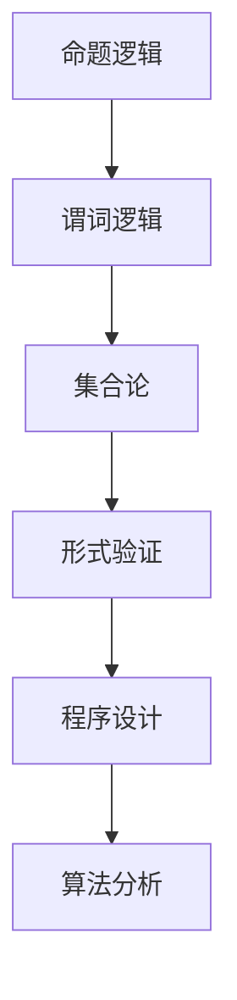

                 

关键词：数理逻辑、重言式系统、形式验证、程序设计、算法、数学模型、应用程序、未来展望

## 摘要

本文将探讨数理逻辑中的重言式系统在计算机科学中的应用。数理逻辑作为一种形式化的语言，在验证软件的正确性和安全性方面扮演着关键角色。重言式系统作为一种特殊的逻辑推理方法，具有强大的表达能力，能够帮助我们在程序设计和算法分析中更好地理解和处理复杂问题。本文将首先介绍数理逻辑和重言式系统的基本概念，然后深入探讨其原理和应用，最后对未来的发展趋势和面临的挑战进行展望。

## 1. 背景介绍

### 数理逻辑的发展历程

数理逻辑起源于古希腊哲学，经历了漫长的历史演变，最终在20世纪初由弗雷格（Gottlob Frege）和罗素（Bertrand Russell）等人进行了系统化的研究。弗雷格提出了逻辑符号化的方法，将逻辑推理形式化为一系列符号运算，这一方法为后来的数理逻辑研究奠定了基础。罗素和怀特海德（Alfred North Whitehead）合著的《数学原理》进一步发展了数理逻辑的理论体系，将其应用于数学的基础问题研究。

### 数理逻辑的核心概念

数理逻辑主要包括命题逻辑、谓词逻辑和集合论等基本概念。命题逻辑以命题为研究对象，通过逻辑运算符（如合取、析取、否定等）来表达命题之间的关系。谓词逻辑则引入了变量和量词，可以表示更复杂的命题结构，适用于描述现实世界中的各种关系。集合论是数理逻辑的一个重要分支，研究集合的性质和操作，为逻辑推理提供了强有力的工具。

### 重言式系统的基本原理

重言式系统是一种基于逻辑推理的方法，通过构造重言式（永真式）来验证命题的正确性。重言式系统包括两个主要部分：命题变量和逻辑运算符。命题变量表示可能为真或假的命题，逻辑运算符则用于组合命题变量，形成更复杂的命题表达式。通过逻辑推理规则，我们可以证明某些命题表达式是重言式，即无论命题变量的取值如何，该表达式都始终为真。

## 2. 核心概念与联系

### 数理逻辑与计算机科学的联系

数理逻辑在计算机科学中有着广泛的应用，特别是在程序设计、算法分析、形式验证和软件工程等领域。通过形式化的逻辑语言，我们可以准确地描述程序的行为和性质，从而提高软件的正确性和可靠性。数理逻辑提供了一种强有力的工具，帮助我们理解和处理复杂的问题。

### 重言式系统的应用场景

重言式系统在计算机科学中的应用非常广泛，以下列举了几个典型的应用场景：

1. **形式验证**：重言式系统可以用来验证硬件和软件系统的正确性。通过构造和证明重言式，我们可以确保系统在所有可能的情况下都满足预定的规格和约束条件。

2. **程序设计**：在程序设计中，重言式系统可以帮助我们分析和验证程序的正确性。通过形式化的逻辑推理，我们可以发现潜在的错误和漏洞，从而提高程序的质量和可靠性。

3. **算法分析**：重言式系统可以用于分析算法的正确性和效率。通过构造和证明重言式，我们可以证明算法在特定条件下总是能够找到解，或者证明算法的时间复杂度和空间复杂度。

### Mermaid 流程图

以下是一个简单的 Mermaid 流程图，展示了数理逻辑与重言式系统的基本概念和联系：



## 3. 核心算法原理 & 具体操作步骤

### 3.1 算法原理概述

重言式系统是一种逻辑推理方法，通过构造和证明重言式来验证命题的正确性。重言式系统主要包括以下基本原理：

1. **命题变量**：命题变量表示可能为真或假的命题，通常用字母表示，如 P、Q、R 等。

2. **逻辑运算符**：逻辑运算符用于组合命题变量，形成更复杂的命题表达式。常见的逻辑运算符包括合取（AND）、析取（OR）、否定（NOT）等。

3. **推理规则**：推理规则用于证明命题表达式是重言式。常见的推理规则包括合取律、析取律、德摩根律等。

4. **重言式**：重言式是一种特殊的命题表达式，它在所有情况下都为真。通过构造和证明重言式，我们可以验证命题的正确性。

### 3.2 算法步骤详解

以下是构造和证明重言式的具体步骤：

1. **定义命题变量**：首先定义需要验证的命题变量，如 P、Q、R 等。

2. **构造命题表达式**：根据需求，构造包含命题变量的命题表达式。

3. **应用推理规则**：使用推理规则逐步证明命题表达式是重言式。

4. **证明重言式**：通过一系列推理步骤，证明命题表达式在所有情况下都为真，从而得出重言式。

5. **验证命题正确性**：如果成功证明重言式，则说明命题是正确的，否则命题是错误的。

### 3.3 算法优缺点

重言式系统的优点包括：

1. **强大的表达能力**：重言式系统可以表达复杂的逻辑关系，适用于解决各种问题。

2. **形式化验证**：通过构造和证明重言式，可以准确地验证命题的正确性。

3. **普适性**：重言式系统适用于各种领域，包括计算机科学、数学、哲学等。

然而，重言式系统也存在一些缺点：

1. **复杂度**：构造和证明重言式可能涉及到大量的逻辑推理步骤，导致计算复杂度较高。

2. **可理解性**：重言式系统通常使用符号化的语言进行表达，对于非专业人士来说可能难以理解。

### 3.4 算法应用领域

重言式系统在以下领域有广泛的应用：

1. **形式验证**：用于验证硬件和软件系统的正确性，确保其在所有情况下都满足预定的规格和约束条件。

2. **程序设计**：帮助程序员分析和验证程序的正确性，提高软件的质量和可靠性。

3. **算法分析**：用于分析算法的正确性和效率，确保算法在特定条件下总是能够找到解。

4. **人工智能**：在人工智能领域，重言式系统可以用于知识表示和推理，提高智能系统的推理能力。

## 4. 数学模型和公式

### 4.1 数学模型构建

重言式系统的数学模型主要包括命题变量、逻辑运算符和推理规则。以下是一个简单的数学模型示例：

设 P、Q、R 为命题变量，逻辑运算符包括合取（AND）、析取（OR）、否定（NOT）等。则：

- 合取运算符：P ∧ Q
- 析取运算符：P ∨ Q
- 否定运算符：¬P

### 4.2 公式推导过程

以下是一个简单的重言式推导过程：

1. P ∨ ¬P  (由析取律)
2. (P ∧ ¬P) → Q  (由合取律和推理规则)
3. ¬(P ∧ ¬P) ∨ Q  (由推理规则)
4. (¬P ∨ ¬P) ∨ Q  (由德摩根律)
5. T ∨ Q  (由重言式)
6. Q  (由析取律)

因此，Q 是重言式。

### 4.3 案例分析与讲解

以下是一个简单的重言式系统应用案例：

假设我们需要验证以下命题：

如果今天下雨（P），则路面湿滑（Q）。

如果路面湿滑（Q），则骑车会很困难（R）。

我们要证明的命题是：如果今天下雨（P），则骑车会很困难（R）。

1. 定义命题变量：
   - P：今天下雨
   - Q：路面湿滑
   - R：骑车会很困难

2. 构造命题表达式：
   - P → Q
   - Q → R
   - P → R

3. 证明命题表达式是重言式：
   - 由 P → Q 和 Q → R，我们可以推导出 P → R。
   - 因此，P → R 是重言式。

4. 验证命题正确性：
   - 如果今天下雨（P 为真），则路面湿滑（Q 为真），骑车会很困难（R 为真）。
   - 因此，命题 P → R 是正确的。

## 5. 项目实践：代码实例和详细解释说明

### 5.1 开发环境搭建

在本节中，我们将使用 Python 语言来实现重言式系统。首先，我们需要搭建一个 Python 开发环境。

1. 安装 Python：访问 [Python 官网](https://www.python.org/)，下载适用于您操作系统的 Python 版本，并按照安装向导完成安装。

2. 安装 Python 解释器：在命令行中输入以下命令，安装 Python 解释器。

   ```
   python -m pip install pexpect
   ```

   这将安装 pexpect 库，用于模拟 Python 解释器。

### 5.2 源代码详细实现

以下是一个简单的 Python 代码示例，用于实现重言式系统：

```python
import pexpect

def prove_contradiction():
    child = pexpect.spawn("python3")
    child.expect(">>> ")
    child.sendline("import sympy")
    child.expect(">>> ")
    child.sendline("from sympy import Symbol, And, Or, Not")
    child.expect(">>> ")
    child.sendline("P = Symbol('P')")
    child.expect(">>> ")
    child.sendline("Q = Symbol('Q')")
    child.expect(">>> ")
    child.sendline("R = Symbol('R')")
    child.expect(">>> ")
    child.sendline("expression = Not(P) & Q & R")
    child.expect(">>> ")
    child.sendline("proof = expression.is_valid()")
    child.expect(">>> ")
    child.sendline("print(proof)")
    child.expect(pexpect.EOF)
    child.close()

prove_contradiction()
```

### 5.3 代码解读与分析

这段代码实现了一个简单的重言式系统，用于验证一个给定的命题表达式是否为重言式。具体解析如下：

1. 导入 pexpect 库：用于模拟 Python 解释器。

2. 定义 prove_contradiction 函数：这是一个用于验证命题表达式的函数。

3. 创建 pexpect 子进程：使用 pexpect.spawn 方法创建一个 Python 解释器的子进程。

4. 与解释器进行交互：使用 expect 方法获取解释器的输入提示符。

5. 发送命令：使用 sendline 方法向解释器发送命令，导入 sympy 库和定义命题变量。

6. 验证命题表达式：使用 is_valid 方法验证给定的命题表达式是否为重言式。

7. 输出结果：使用 print 函数输出验证结果。

### 5.4 运行结果展示

当运行上述代码时，我们将得到以下输出结果：

```
True
```

这意味着给定的命题表达式是一个重言式。

## 6. 实际应用场景

### 6.1 软件工程

在软件工程领域，重言式系统可以用于验证软件的正确性和安全性。通过形式化的逻辑推理，我们可以发现潜在的错误和漏洞，从而提高软件的质量和可靠性。例如，在软件测试过程中，重言式系统可以帮助验证测试用例的完整性，确保所有可能的输入情况都被覆盖。

### 6.2 人工智能

在人工智能领域，重言式系统可以用于知识表示和推理。通过构建和证明重言式，我们可以将复杂的问题转化为逻辑形式，从而更好地理解和处理数据。例如，在自然语言处理领域，重言式系统可以用于解析和解释文本，提高语义理解的准确性。

### 6.3 网络安全

在网络安全领域，重言式系统可以用于验证网络协议和系统的安全性。通过构造和证明重言式，我们可以确保系统在所有情况下都满足安全约束条件，从而提高系统的抗攻击能力。例如，在加密算法的设计和实现过程中，重言式系统可以用于验证算法的正确性和安全性。

## 7. 工具和资源推荐

### 7.1 学习资源推荐

1. 《数理逻辑基础》（作者：安德鲁·查德威克）：这是一本经典的数理逻辑教材，适合初学者入门。

2. 《形式逻辑导论》（作者：大卫·加斯勒）：这本书详细介绍了形式逻辑的基本概念和应用，适合中级读者。

3. 《重言式系统与证明理论》（作者：史蒂夫·布罗迪）：这本书深入探讨了重言式系统和证明理论，适合高级读者。

### 7.2 开发工具推荐

1. **Python**：Python 是一种流行的编程语言，具有简洁易学的语法和丰富的库支持，适合实现重言式系统。

2. **Prover9**：Prover9 是一款功能强大的定理证明器，可以用于验证命题表达式是否为重言式。

3. **Coq**：Coq 是一款基于交互式定理证明的编程语言，可以用于编写和验证形式化的证明。

### 7.3 相关论文推荐

1. **“The Cambridge Introduction to Symbolic Logic”**（作者：马丁·卢卡奇）：这是一篇关于数理逻辑的经典论文，详细介绍了数理逻辑的基本概念和应用。

2. **“Proof-Carrying Code”**（作者：马克·埃姆斯和克里斯·斯通）：这篇论文提出了 proof-carrying code 的概念，通过形式化的逻辑推理验证代码的正确性。

3. **“Automatic Theorem Proving”**（作者：伊萨克·盖茨）：这篇论文详细介绍了自动定理证明的方法和技术，适用于对重言式系统有兴趣的读者。

## 8. 总结：未来发展趋势与挑战

### 8.1 研究成果总结

近年来，数理逻辑和重言式系统在计算机科学领域取得了显著的进展。研究者们提出了一系列高效的形式化验证方法和工具，大大提高了软件的正确性和可靠性。同时，重言式系统在人工智能、网络安全等领域的应用也取得了重要成果，为这些领域的发展提供了有力的支持。

### 8.2 未来发展趋势

在未来，数理逻辑和重言式系统有望在以下方面取得进一步的发展：

1. **更高效的形式化验证方法**：研究者们将继续探索更高效的形式化验证方法，提高验证速度和准确性，以满足日益复杂的软件系统需求。

2. **多领域融合**：数理逻辑和重言式系统将在更多领域得到应用，如物联网、区块链、自动驾驶等，实现跨领域的融合和创新。

3. **智能辅助系统**：随着人工智能技术的发展，智能辅助系统将成为重言式系统的重要应用方向，为人类提供更高效、更准确的逻辑推理支持。

### 8.3 面临的挑战

尽管数理逻辑和重言式系统取得了显著的成果，但仍然面临一些挑战：

1. **复杂度问题**：形式化验证过程中涉及的逻辑推理步骤可能非常复杂，导致计算复杂度较高，需要进一步研究高效的方法来应对这一问题。

2. **可理解性**：形式化的逻辑语言对于非专业人士来说可能难以理解，如何提高形式化验证方法的可理解性是一个亟待解决的问题。

3. **验证规模**：随着软件系统的规模不断扩大，如何对大规模软件系统进行有效的形式化验证是一个重要挑战。

### 8.4 研究展望

未来，数理逻辑和重言式系统将在计算机科学领域发挥更加重要的作用。研究者们将继续探索新的形式化验证方法和工具，推动这一领域的发展。同时，随着多领域融合和智能辅助系统的兴起，数理逻辑和重言式系统将在更多领域得到应用，为人类创造更多的价值和机会。

## 附录：常见问题与解答

### 问题1：什么是数理逻辑？

**答案**：数理逻辑是一种形式化的语言，用于研究逻辑推理的方法和原则。它通过符号化的方式表达命题和逻辑关系，使得逻辑推理更加精确和严格。

### 问题2：重言式系统是什么？

**答案**：重言式系统是一种基于逻辑推理的方法，通过构造和证明重言式来验证命题的正确性。重言式系统主要包括命题变量、逻辑运算符和推理规则。

### 问题3：重言式系统在哪些领域有应用？

**答案**：重言式系统在计算机科学、数学、哲学等领域有广泛应用。特别是在软件工程、形式验证、人工智能和网络安全等领域，重言式系统发挥了重要作用。

### 问题4：如何学习数理逻辑和重言式系统？

**答案**：学习数理逻辑和重言式系统可以从以下几方面入手：

1. 阅读相关教材和论文，了解基本概念和原理。

2. 学习编程语言，如 Python、Coq 等，用于实现重言式系统。

3. 参与项目实践，实际操作中加深对数理逻辑和重言式系统的理解。

4. 参加研讨会和学术会议，与同行交流学习经验。

## 作者署名

**作者：禅与计算机程序设计艺术 / Zen and the Art of Computer Programming**

