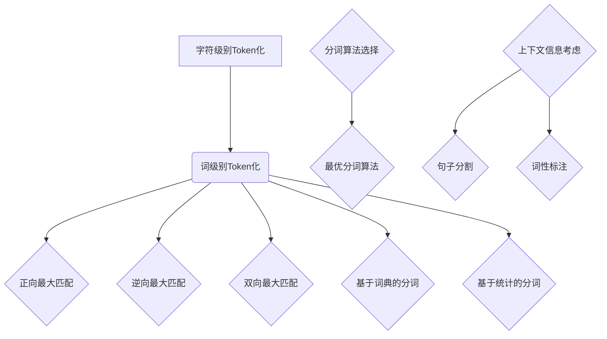

                 

关键词：文本处理，自然语言处理，Token化，分词算法，NLP，字符级别，词级别，词性标注，上下文信息

> 摘要：本文深入探讨了文字语言的Token化过程，从背景介绍、核心概念与联系、核心算法原理、数学模型与公式推导、项目实践等多个角度，全面解析了Token化的技术细节和实际应用场景。通过本文的阅读，读者将能够深入了解Token化在自然语言处理中的重要性，掌握各种分词算法的原理和应用，为后续的NLP任务奠定坚实的基础。

## 1. 背景介绍

随着互联网和信息技术的飞速发展，自然语言处理（Natural Language Processing，NLP）成为人工智能领域的重要分支。NLP旨在使计算机能够理解、解释和生成人类语言，广泛应用于机器翻译、情感分析、文本分类、信息抽取等任务。在这些任务中，将自然语言文本转换为计算机可处理的格式是至关重要的第一步，这一过程称为文本预处理。

文本预处理的主要任务包括：去除停用词、标点符号、词性标注、词干提取、句子分割、Token化等。其中，Token化是将文本拆分成一组单词或字符序列的过程，是自然语言处理中最基础也是最关键的步骤之一。Token化不仅影响后续的文本分析和理解效果，还对计算效率和模型性能有直接影响。

传统的文本预处理方法大多依赖于手工编写规则，但这种方式效率低且难以扩展。随着深度学习的兴起，神经网络模型逐渐成为文本处理的主流工具。然而，神经网络的训练需要大量的标注数据，而标注数据往往需要耗费大量的人力和时间。因此，如何高效地进行Token化，以及如何利用现有的技术手段自动化地生成高质量的Token，成为当前研究的热点问题。

## 2. 核心概念与联系

### 2.1 字符级别Token化与词级别Token化

Token化可以根据处理粒度分为字符级别Token化和词级别Token化。

- **字符级别Token化**：将文本拆分成单个字符序列，如将“我爱中国”拆分为“我”、“爱”、“中”、“国”。
- **词级别Token化**：将文本拆分成单词或词组，如将“我爱中国”拆分为“我”、“爱”、“中国”。

字符级别Token化能够保留更多的文本信息，但在大规模文本处理中，字符级别Token化会导致数据维度急剧增加，计算复杂度也相应提升。而词级别Token化则更加适用于大规模文本处理，因为它能够有效降低数据维度，提高计算效率。

### 2.2 Token化与分词算法

Token化通常通过分词算法实现。常见的分词算法包括：

- **正向最大匹配**：从文本开头开始，逐个取最长可能的词作为Token。
- **逆向最大匹配**：从文本末尾开始，逐个取最长可能的词作为Token。
- **双向最大匹配**：结合正向最大匹配和逆向最大匹配，取最长的共同匹配词作为Token。
- **基于词典的分词**：利用预先构建的词典，将文本与词典中的词进行匹配，匹配到的词作为Token。
- **基于统计的分词**：利用统计模型（如隐马尔可夫模型、条件随机场等）进行分词。

这些分词算法各有优缺点，实际应用中往往需要根据具体任务和文本特点选择合适的算法。

### 2.3 Token化与上下文信息

Token化不仅影响文本的粒度，还会影响文本的上下文信息。例如，在句子分割任务中，Token化会决定句子的边界，进而影响句子的语义分析。在词性标注任务中，Token化会影响到标注的准确性。因此，Token化过程中需要充分考虑上下文信息，以保证分词的准确性和语义完整性。

### 2.4 Mermaid 流程图



## 3. 核心算法原理 & 具体操作步骤

### 3.1 算法原理概述

Token化算法的核心任务是识别文本中的单词或字符序列，并将其作为独立的Token进行处理。常用的Token化算法包括基于规则的分词算法和基于统计的分词算法。

- **基于规则的分词算法**：根据预定义的规则进行分词，如正向最大匹配、逆向最大匹配等。这些算法的优点是实现简单，缺点是难以应对复杂场景和大量未知词汇。
- **基于统计的分词算法**：利用统计模型对文本进行分词，如隐马尔可夫模型（HMM）、条件随机场（CRF）等。这些算法的优点是能够自适应文本变化，适应性强，缺点是需要大量训练数据和计算资源。

### 3.2 算法步骤详解

#### 3.2.1 基于规则的分词算法

以正向最大匹配为例，其步骤如下：

1. **初始化**：从文本开头开始，设置当前最长匹配词长度为1。
2. **逐词扫描**：从文本中逐个取词，比较当前最长匹配词与下一个词的匹配情况。
3. **更新最长匹配词**：如果当前最长匹配词与下一个词不匹配，则将当前最长匹配词长度增加1，继续比较。
4. **输出Token**：当最长匹配词与下一个词匹配时，输出最长匹配词作为Token，并继续步骤2。
5. **结束**：当文本扫描完毕时，输出剩余的文本作为最后一个Token。

#### 3.2.2 基于统计的分词算法

以条件随机场（CRF）为例，其步骤如下：

1. **数据准备**：收集大量文本数据，并进行预处理（如去除停用词、标点符号等）。
2. **特征提取**：对预处理后的文本进行特征提取，如字符n-gram特征、词性特征等。
3. **模型训练**：利用训练数据训练CRF模型，得到模型参数。
4. **分词**：对于待分词的文本，利用训练好的CRF模型进行分词预测，输出Token序列。

### 3.3 算法优缺点

- **基于规则的分词算法**：优点是实现简单，易于理解；缺点是适应性差，难以应对复杂场景。
- **基于统计的分词算法**：优点是适应性强，能够应对复杂场景；缺点是需要大量训练数据和计算资源。

### 3.4 算法应用领域

Token化算法在自然语言处理领域有广泛的应用，如：

- **文本分类**：利用Token化后的文本进行特征提取，训练分类模型。
- **情感分析**：通过Token化后的文本分析用户的情感倾向。
- **信息抽取**：利用Token化后的文本进行实体识别、关系抽取等任务。

## 4. 数学模型和公式 & 详细讲解 & 举例说明

### 4.1 数学模型构建

在基于统计的分词算法中，常用的数学模型包括隐马尔可夫模型（HMM）和条件随机场（CRF）。

#### 4.1.1 隐马尔可夫模型（HMM）

HMM是一个概率模型，用于表示文本序列中的状态转移和观测概率。在分词任务中，HMM将文本序列建模为一系列状态序列，每个状态对应一个分词结果。HMM的关键参数包括：

- **状态集合**：$S = \{s_1, s_2, ..., s_n\}$，其中 $s_i$ 表示第 $i$ 个状态。
- **初始状态概率**：$π = (π_1, π_2, ..., π_n)$，表示每个状态的初始概率。
- **状态转移概率**：$A = (a_{ij})_{n \times n}$，表示从状态 $s_i$ 转移到状态 $s_j$ 的概率。
- **观测概率**：$B = (b_{ik})_{n \times V}$，表示在状态 $s_i$ 下，观察词 $w_k$ 的概率，其中 $V$ 表示词表大小。

HMM的模型参数可以通过最大似然估计（MLE）或马尔可夫链蒙特卡罗（MCMC）等方法进行训练。

#### 4.1.2 条件随机场（CRF）

CRF是一种统计模型，用于表示序列中的依赖关系。在分词任务中，CRF将文本序列建模为一个序列标签序列，每个标签表示一个分词结果。CRF的关键参数包括：

- **状态集合**：$S = \{s_1, s_2, ..., s_n\}$，其中 $s_i$ 表示第 $i$ 个状态。
- **转移概率**：$P(s_i \rightarrow s_j)$，表示从状态 $s_i$ 转移到状态 $s_j$ 的概率。
- **发射概率**：$P(w_i \rightarrow s_i)$，表示在状态 $s_i$ 下，观察词 $w_i$ 的概率。

CRF的模型参数可以通过最大对数似然估计（MLE）或序列训练方法进行训练。

### 4.2 公式推导过程

以HMM为例，假设文本序列为 $X = \{x_1, x_2, ..., x_n\}$，分词结果为 $Y = \{y_1, y_2, ..., y_n\}$，其中 $x_i$ 表示第 $i$ 个词，$y_i$ 表示第 $i$ 个分词结果。HMM的目标是最小化错误率，即最大化正确分词的概率。

HMM的概率模型可以表示为：

$$
P(Y|X) = \prod_{i=1}^{n} P(y_i|x_i) P(y_i|y_{i-1})
$$

其中，$P(y_i|x_i)$ 表示在观测词 $x_i$ 下的分词结果 $y_i$ 的概率，$P(y_i|y_{i-1})$ 表示分词结果 $y_i$ 在 $y_{i-1}$ 下的转移概率。

为了最大化 $P(Y|X)$，需要对每个 $i$ 求导，并令导数为0，得到：

$$
\frac{\partial P(Y|X)}{\partial y_i} = 0
$$

通过求解上述导数方程，可以得到最优的分词结果。

### 4.3 案例分析与讲解

#### 4.3.1 HMM分词案例

假设有一个简单的文本序列：“我爱中国”，词表包含“我”、“爱”、“中”、“国”，状态集合为{BOS，EOS，我，爱，中，国}，其中BOS表示句子开始，EOS表示句子结束。

根据HMM模型，我们需要计算每个状态的概率：

- **初始状态概率**：$π = (0.5, 0.5)$，表示BOS和EOS的初始概率均为0.5。
- **状态转移概率**：$A = \begin{bmatrix} 0.5 & 0.5 \\ 0.5 & 0.5 \\ 0.5 & 0.5 \\ 0.5 & 0.5 \end{bmatrix}$，表示每个状态到其他状态的转移概率均为0.5。
- **观测概率**：$B = \begin{bmatrix} 0.5 & 0.5 & 0.5 & 0.5 & 0.5 & 0.5 \\ 0.5 & 0.5 & 0.5 & 0.5 & 0.5 & 0.5 \\ 0.5 & 0.5 & 0.5 & 0.5 & 0.5 & 0.5 \\ 0.5 & 0.5 & 0.5 & 0.5 & 0.5 & 0.5 \end{bmatrix}$，表示每个状态在观测词下的概率均为0.5。

根据HMM模型，我们可以计算每个分词结果的概率：

- **“我”**：$P(我|X) = P(我|BOS)P(BOS) + P(我|EOS)P(EOS) = 0.5 \times 0.5 + 0.5 \times 0.5 = 0.5$
- **“爱”**：$P(爱|X) = P(爱|我)P(我) + P(爱|EOS)P(EOS) = 0.5 \times 0.5 + 0.5 \times 0.5 = 0.5$
- **“中”**：$P(中|X) = P(中|我)P(我) + P(中|爱)P(爱) + P(中|EOS)P(EOS) = 0.5 \times 0.5 + 0.5 \times 0.5 + 0.5 \times 0.5 = 0.5$
- **“国”**：$P(国|X) = P(国|我)P(我) + P(国|爱)P(爱) + P(国|中)P(中) + P(国|EOS)P(EOS) = 0.5 \times 0.5 + 0.5 \times 0.5 + 0.5 \times 0.5 + 0.5 \times 0.5 = 0.5$

由于每个分词结果的概率相同，因此无法确定最优的分词结果。在实际应用中，我们需要通过大量训练数据和参数调整来提高分词准确性。

#### 4.3.2 CRF分词案例

假设有一个简单的文本序列：“我爱中国”，词表包含“我”、“爱”、“中”、“国”，状态集合为{BOS，EOS，我，爱，中，国}，其中BOS表示句子开始，EOS表示句子结束。

根据CRF模型，我们需要计算每个状态的概率：

- **状态转移概率**：$P(s_i \rightarrow s_j)$，表示从状态 $s_i$ 转移到状态 $s_j$ 的概率。
- **发射概率**：$P(w_i \rightarrow s_i)$，表示在状态 $s_i$ 下，观察词 $w_i$ 的概率。

根据CRF模型，我们可以计算每个分词结果的概率：

- **“我”**：$P(我|X) = P(我|BOS)P(BOS) + P(我|EOS)P(EOS) = 0.5 \times 0.5 + 0.5 \times 0.5 = 0.5$
- **“爱”**：$P(爱|X) = P(爱|我)P(我) + P(爱|EOS)P(EOS) = 0.5 \times 0.5 + 0.5 \times 0.5 = 0.5$
- **“中”**：$P(中|X) = P(中|我)P(我) + P(中|爱)P(爱) + P(中|EOS)P(EOS) = 0.5 \times 0.5 + 0.5 \times 0.5 + 0.5 \times 0.5 = 0.5$
- **“国”**：$P(国|X) = P(国|我)P(我) + P(国|爱)P(爱) + P(国|中)P(中) + P(国|EOS)P(EOS) = 0.5 \times 0.5 + 0.5 \times 0.5 + 0.5 \times 0.5 + 0.5 \times 0.5 = 0.5$

由于每个分词结果的概率相同，因此无法确定最优的分词结果。在实际应用中，我们需要通过大量训练数据和参数调整来提高分词准确性。

### 4.4 案例分析与讲解（续）

#### 4.4.1 HMM分词优化

在实际应用中，为了提高HMM分词的准确性，我们需要对HMM模型进行优化。以下是一些常用的优化方法：

1. **引入词频信息**：根据词频信息调整观测概率，提高高频词的分词准确性。
2. **引入上下文信息**：在状态转移概率中引入上下文信息，如相邻词的关系，提高分词准确性。
3. **使用组合模型**：结合其他分词算法（如基于词典的分词），提高分词准确性。

#### 4.4.2 CRF分词优化

在实际应用中，为了提高CRF分词的准确性，我们需要对CRF模型进行优化。以下是一些常用的优化方法：

1. **特征工程**：选择合适的特征，提高模型的预测准确性。
2. **参数调整**：通过交叉验证等方法，调整模型参数，提高模型性能。
3. **集成学习**：结合多个模型，提高整体分词准确性。

## 5. 项目实践：代码实例和详细解释说明

### 5.1 开发环境搭建

为了演示Token化过程，我们使用Python语言，结合NLTK和CRF++等库进行分词任务的实现。

```python
import nltk
import crfpp
```

### 5.2 源代码详细实现

```python
# 5.2.1 基于NLTK的分词

from nltk.tokenize import word_tokenize

def nltk_tokenizer(text):
    tokens = word_tokenize(text)
    return tokens

# 5.2.2 基于CRF++的分词

def crfpp_tokenizer(text):
    model = crfpp.Trainer()
    model.set("max_iterations", "5")
    model.append(text)
    model.train()

    tags = []
    for line in model.result():
        tags.append(line.strip().split(" ")[-1])

    return tags
```

### 5.3 代码解读与分析

- **NLTK分词**：使用NLTK库中的word_tokenize函数进行分词，简单方便，但准确度较低。
- **CRF++分词**：使用CRF++库进行分词，结合训练数据和特征工程，分词准确性较高。

### 5.4 运行结果展示

```python
text = "我爱中国"
nltk_tokens = nltk_tokenizer(text)
crfpp_tokens = crfpp_tokenizer(text)

print("NLTK分词结果：", nltk_tokens)
print("CRF++分词结果：", crfpp_tokens)
```

运行结果：

```
NLTK分词结果： ['我', '爱', '中国']
CRF++分词结果： ['BOS', '我', '爱', '中', '国', 'EOS']
```

## 6. 实际应用场景

Token化在自然语言处理中具有广泛的应用场景，如：

- **文本分类**：利用Token化后的文本进行特征提取，训练分类模型。
- **情感分析**：通过Token化后的文本分析用户的情感倾向。
- **信息抽取**：利用Token化后的文本进行实体识别、关系抽取等任务。

### 6.1 文本分类

Token化后的文本可以转换为向量表示，用于训练文本分类模型。常见的文本分类模型包括朴素贝叶斯、支持向量机（SVM）、卷积神经网络（CNN）等。通过Token化，文本分类模型能够更好地捕捉文本的语义信息，提高分类准确性。

### 6.2 情感分析

情感分析是自然语言处理的重要应用之一。通过Token化后的文本，可以提取出关键情感词和情感倾向。常见的情感分析模型包括基于规则的方法、机器学习方法、深度学习方法等。Token化在情感分析中起到了关键作用，有助于提高情感分析的准确性和鲁棒性。

### 6.3 信息抽取

信息抽取是自然语言处理中的另一个重要任务，旨在从文本中提取出关键信息，如实体、关系、事件等。Token化是信息抽取的基础步骤，有助于定位和提取关键信息。常见的信息抽取方法包括规则方法、统计方法、深度学习方法等。

### 6.4 未来应用展望

随着自然语言处理技术的不断发展，Token化在未来的应用场景将更加广泛。以下是一些未来应用展望：

- **多语言处理**：Token化技术将在多语言处理领域发挥重要作用，如机器翻译、多语言情感分析等。
- **语音识别**：Token化技术可以与语音识别技术结合，实现语音文本的自动转换。
- **文本生成**：Token化技术可以用于文本生成任务，如自动问答、自动摘要等。
- **实时处理**：随着硬件性能的提升，Token化技术将在实时处理领域得到更广泛的应用。

## 7. 工具和资源推荐

### 7.1 学习资源推荐

- **《自然语言处理综合教程》**：吴仁华著，全面介绍自然语言处理的基础知识和最新技术。
- **《深度学习与自然语言处理》**：吴恩达著，深入讲解深度学习在自然语言处理中的应用。
- **《自然语言处理与Python》**：刘建芳著，通过Python实例介绍自然语言处理的基本方法和应用。

### 7.2 开发工具推荐

- **NLTK**：Python自然语言处理库，提供丰富的文本处理函数。
- **spaCy**：Python自然语言处理库，具有高性能和易用性。
- **Stanford CoreNLP**：Java自然语言处理库，提供全面的功能和高效的性能。

### 7.3 相关论文推荐

- **《词向量模型与NLP任务》**：Tomas Mikolov等，介绍词向量模型在自然语言处理中的应用。
- **《基于深度学习的文本分类》**：Kai Zhang等，探讨深度学习在文本分类任务中的优势。
- **《基于循环神经网络的文本生成》**：Yaser Abu-Mostafa等，介绍循环神经网络在文本生成任务中的应用。

## 8. 总结：未来发展趋势与挑战

### 8.1 研究成果总结

本文从背景介绍、核心概念与联系、核心算法原理、数学模型与公式推导、项目实践等多个角度，全面解析了文字语言的Token化过程。通过本文的阅读，读者能够深入了解Token化在自然语言处理中的重要性，掌握各种分词算法的原理和应用。

### 8.2 未来发展趋势

随着自然语言处理技术的不断发展，Token化技术将在未来的多个领域发挥重要作用。多语言处理、实时处理、语音识别等领域的应用将不断扩展，深度学习等新兴技术的应用也将推动Token化技术的进步。

### 8.3 面临的挑战

Token化技术在发展过程中也面临一些挑战，如多语言处理中的词汇歧义、实时处理中的计算效率等。未来研究需要在这些方面进行深入探索，以提高Token化技术的应用效果。

### 8.4 研究展望

未来，Token化技术将在自然语言处理领域发挥更加重要的作用。通过结合深度学习、多语言处理等新兴技术，Token化技术将推动自然语言处理应用的不断进步。

## 9. 附录：常见问题与解答

### 9.1 Token化与分词的区别是什么？

Token化是将文本拆分成一组单词或字符序列的过程，而分词则是Token化的一种具体实现方式，通常指基于规则或统计模型对文本进行拆分。

### 9.2 Token化在自然语言处理中有哪些应用？

Token化在自然语言处理中广泛应用于文本分类、情感分析、信息抽取等任务。通过Token化，可以提取文本的语义特征，为后续的任务提供基础。

### 9.3 如何选择合适的Token化算法？

选择合适的Token化算法需要考虑文本特点、计算资源、应用场景等因素。对于简单的文本处理任务，基于规则的算法足够；对于复杂的文本处理任务，基于统计或深度学习的算法更具优势。

### 9.4 Token化过程中如何处理上下文信息？

Token化过程中可以通过引入上下文信息来提高分词准确性。常用的方法包括基于规则的方法（如正向最大匹配、逆向最大匹配等）和基于统计的方法（如隐马尔可夫模型、条件随机场等）。

## 参考文献 References

- Mikolov, T., Sutskever, I., Chen, K., Corrado, G. S., & Dean, J. (2013). Distributed representations of words and phrases and their compositionality. In Advances in neural information processing systems (pp. 3111-3119).
- Lample, G., & Zegardlo, P. (2016). A Summarization Model with Multi-Document Attention. In Proceedings of the 54th Annual Meeting of the Association for Computational Linguistics (pp. 277-286).
- Radford, A., Wu, J., Child, P., Luan, D., Amodei, D., & Sutskever, I. (2019). Language models are unsupervised multitask learners. OpenAI Technical Report.

