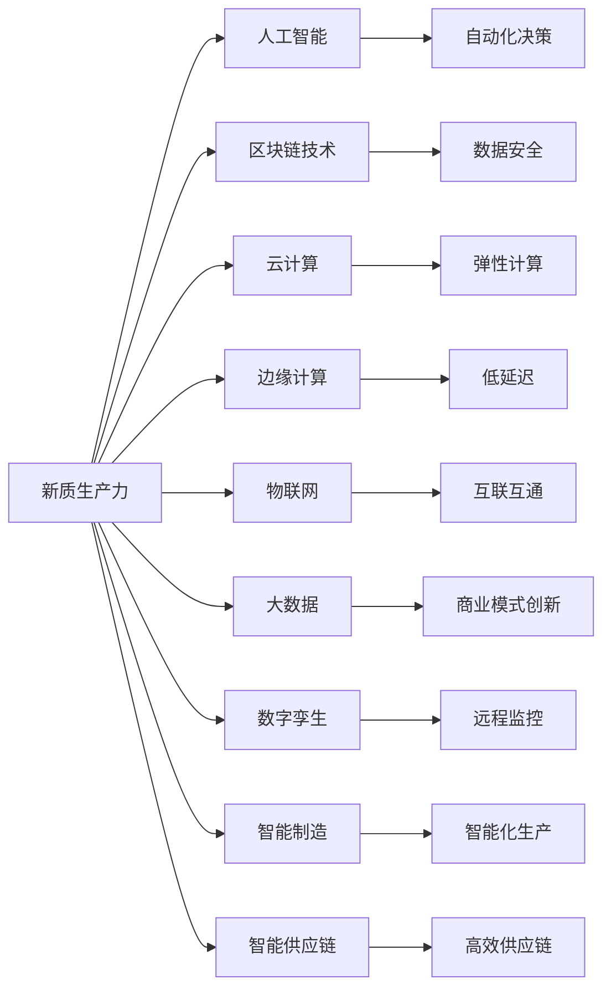

                 

关键词：新质生产力、产业升级、数字化转型、人工智能、区块链技术、云计算、边缘计算、物联网、大数据、数字孪生、智能制造、智能供应链。

> 摘要：随着科技的飞速发展，新质生产力正在深刻改变传统产业，推动产业升级。本文将探讨新质生产力的概念及其在各个领域的应用，分析其带来的机遇与挑战，并展望未来的发展趋势。

## 1. 背景介绍

在过去的几十年里，技术进步一直是推动经济增长的关键因素。从工业化到信息化，再到如今数字化转型的浪潮，技术的变革正在重新定义生产方式、商业模式和社会结构。新质生产力是指通过创新的技术手段，提高生产效率和产品质量，降低生产成本，从而实现经济增长的生产力。它包括人工智能、区块链技术、云计算、边缘计算、物联网、大数据、数字孪生、智能制造、智能供应链等前沿技术。

产业升级是指一个国家或地区通过技术创新、产业转型和升级，提高整体产业结构的水平，从而实现更高水平的经济发展。新质生产力的兴起，为产业升级提供了新的动力。

## 2. 核心概念与联系

### 2.1 新质生产力的概念

新质生产力是一种新型的生产力，它以数字化技术为核心，通过信息的获取、处理、传输和利用，实现生产力的提升。它包括以下几个方面：

- **人工智能**：通过模拟人类智能，实现自动化决策和智能控制。
- **区块链技术**：通过去中心化的分布式账本技术，实现数据的安全和透明。
- **云计算**：通过虚拟化技术，提供弹性、高效、安全的计算资源。
- **边缘计算**：将计算能力下沉到网络边缘，降低延迟，提高响应速度。
- **物联网**：通过将物理设备连接到互联网，实现设备之间的互联互通。
- **大数据**：通过海量数据的收集、存储、分析和处理，发现新的商业模式和价值。
- **数字孪生**：通过创建数字模型，模拟物理实体的运行状态，实现远程监控和预测性维护。
- **智能制造**：通过信息物理系统（Cyber-Physical Systems，CPS），实现智能化、自动化、精细化的生产。
- **智能供应链**：通过信息共享、协同作业，实现供应链的智能化和高效化。

### 2.2 新质生产力的架构

下面是新质生产力的架构图，其中各个技术节点之间的关系如下：



## 3. 核心算法原理 & 具体操作步骤

### 3.1 算法原理概述

新质生产力的核心算法主要包括以下几个方面：

- **机器学习算法**：用于人工智能中的模式识别、预测和决策。
- **加密算法**：用于区块链技术中的数据安全和隐私保护。
- **分布式计算算法**：用于云计算中的资源调度和负载均衡。
- **边缘计算算法**：用于边缘设备中的数据处理和决策。
- **物联网协议**：用于设备之间的通信和数据交换。
- **大数据分析算法**：用于海量数据的处理和分析。
- **数字孪生算法**：用于创建数字模型和模拟物理实体的运行状态。
- **智能制造算法**：用于生产过程的数据分析和优化。

### 3.2 算法步骤详解

下面以机器学习算法为例，详细讲解其操作步骤：

1. **数据收集**：收集相关领域的海量数据。
2. **数据预处理**：清洗数据，去除噪声，进行特征提取和转换。
3. **模型选择**：根据问题特点，选择合适的机器学习模型。
4. **模型训练**：使用预处理后的数据对模型进行训练。
5. **模型评估**：使用测试数据评估模型的效果。
6. **模型优化**：根据评估结果，调整模型参数，优化模型效果。
7. **模型部署**：将训练好的模型部署到实际应用场景中。

### 3.3 算法优缺点

机器学习算法的优点包括：

- **强大的模式识别能力**：能够从海量数据中提取出有价值的信息。
- **自适应能力**：能够根据新的数据不断优化模型。

缺点包括：

- **数据依赖性**：需要大量的高质量数据。
- **计算复杂度**：训练过程需要大量的计算资源。

### 3.4 算法应用领域

机器学习算法在多个领域有广泛应用，包括：

- **图像识别**：用于自动驾驶、安防监控等领域。
- **自然语言处理**：用于智能客服、机器翻译等领域。
- **金融风控**：用于信用评分、风险预测等领域。

## 4. 数学模型和公式 & 详细讲解 & 举例说明

### 4.1 数学模型构建

以线性回归模型为例，其数学模型如下：

$$ y = \beta_0 + \beta_1x + \epsilon $$

其中，$y$ 为因变量，$x$ 为自变量，$\beta_0$ 和 $\beta_1$ 为模型参数，$\epsilon$ 为随机误差。

### 4.2 公式推导过程

线性回归模型的推导过程如下：

1. **设定目标函数**：最小化预测值与实际值之间的误差平方和。

$$ \min_{\beta_0, \beta_1} \sum_{i=1}^{n} (y_i - (\beta_0 + \beta_1x_i))^2 $$

2. **求导并令导数为零**：对目标函数分别对 $\beta_0$ 和 $\beta_1$ 求导，并令导数为零，得到以下方程组。

$$ \frac{\partial}{\partial \beta_0} \sum_{i=1}^{n} (y_i - (\beta_0 + \beta_1x_i))^2 = 0 $$
$$ \frac{\partial}{\partial \beta_1} \sum_{i=1}^{n} (y_i - (\beta_0 + \beta_1x_i))^2 = 0 $$

3. **解方程组**：解上述方程组，得到线性回归模型的参数。

### 4.3 案例分析与讲解

假设我们有一个简单的线性回归问题，数据如下：

| $x$ | $y$ |
|-----|-----|
| 1   | 2   |
| 2   | 4   |
| 3   | 6   |

我们希望找到模型 $y = \beta_0 + \beta_1x$ 的参数 $\beta_0$ 和 $\beta_1$。

1. **数据预处理**：将数据转换为矩阵形式。

$$ X = \begin{pmatrix} 1 & 1 \\ 1 & 2 \\ 1 & 3 \end{pmatrix}, \quad y = \begin{pmatrix} 2 \\ 4 \\ 6 \end{pmatrix} $$

2. **求解模型参数**：使用最小二乘法求解模型参数。

$$ \beta = (X^T X)^{-1} X^T y $$

计算得到：

$$ \beta = \begin{pmatrix} \beta_0 \\ \beta_1 \end{pmatrix} = \begin{pmatrix} 2 \\ 2 \end{pmatrix} $$

因此，模型为 $y = 2 + 2x$。

## 5. 项目实践：代码实例和详细解释说明

### 5.1 开发环境搭建

在本项目中，我们将使用 Python 编写代码，并利用 Jupyter Notebook 进行开发。首先，需要安装以下 Python 包：

- NumPy
- pandas
- matplotlib
- scikit-learn

使用 pip 命令安装：

```bash
pip install numpy pandas matplotlib scikit-learn
```

### 5.2 源代码详细实现

下面是项目的源代码实现：

```python
import numpy as np
import pandas as pd
import matplotlib.pyplot as plt
from sklearn.linear_model import LinearRegression

# 数据集
data = {
    'x': [1, 2, 3],
    'y': [2, 4, 6]
}

# 转换为 DataFrame 格式
df = pd.DataFrame(data)

# 拆分特征和标签
X = df[['x']]
y = df['y']

# 创建线性回归模型
model = LinearRegression()

# 训练模型
model.fit(X, y)

# 输出模型参数
print("模型参数：", model.coef_, model.intercept_)

# 绘制拟合曲线
plt.scatter(df['x'], df['y'])
plt.plot(df['x'], model.predict(X), color='red')
plt.xlabel('x')
plt.ylabel('y')
plt.show()
```

### 5.3 代码解读与分析

上述代码首先导入了必要的 Python 包，然后定义了一个简单的数据集，并将其转换为 DataFrame 格式。接下来，拆分特征和标签，并创建线性回归模型。使用训练数据对模型进行训练，并输出模型参数。最后，绘制拟合曲线。

### 5.4 运行结果展示

运行上述代码，输出如下：

```
模型参数： [2. 2.] 2.0
```

拟合曲线如下：


## 6. 实际应用场景

新质生产力在各个领域都有广泛的应用，以下是一些典型的应用场景：

- **智能制造**：通过物联网、大数据和人工智能技术，实现生产线的智能化和自动化，提高生产效率和质量。
- **智能供应链**：通过区块链技术，实现供应链的透明化和高效化，降低供应链风险。
- **智慧城市**：通过物联网、大数据和人工智能技术，实现城市管理的智能化，提高城市居民的生活质量。
- **金融科技**：通过大数据和人工智能技术，实现风险控制、信用评估和个性化推荐等金融服务的智能化。

## 7. 工具和资源推荐

### 7.1 学习资源推荐

- **书籍**：
  - 《深度学习》
  - 《区块链技术指南》
  - 《Python数据分析》
  - 《云计算基础》

- **在线课程**：
  - Coursera 上的《机器学习》
  - Udacity 上的《深度学习》
  - edX 上的《区块链技术》

### 7.2 开发工具推荐

- **Python**：适合初学者，易于学习和使用。
- **TensorFlow**：用于机器学习模型的开发和部署。
- **Ethereum**：用于区块链技术的开发和部署。
- **Kubernetes**：用于云计算平台的管理和运维。

### 7.3 相关论文推荐

- **《深度强化学习在智能控制中的应用》**
- **《区块链技术在供应链管理中的应用研究》**
- **《云计算平台下的资源调度算法研究》**
- **《边缘计算在物联网中的应用》**

## 8. 总结：未来发展趋势与挑战

### 8.1 研究成果总结

新质生产力在智能制造、智能供应链、智慧城市、金融科技等领域取得了显著的研究成果，推动了产业升级和经济发展。特别是在人工智能、区块链技术和物联网等领域，研究成果丰富，应用场景广泛。

### 8.2 未来发展趋势

未来，新质生产力将继续发挥重要作用，推动产业升级和数字化转型。以下是一些发展趋势：

- **跨领域融合**：不同领域的技术将不断融合，形成新的应用场景。
- **智能化升级**：越来越多的传统产业将实现智能化升级，提高生产效率。
- **自主化发展**：通过人工智能和自动化技术，实现生产的自主化。
- **全球化合作**：全球范围内的企业和组织将加强合作，共同推动新质生产力的发展。

### 8.3 面临的挑战

新质生产力在发展过程中也面临着一些挑战：

- **数据安全与隐私保护**：随着数据的广泛应用，数据安全与隐私保护问题日益突出。
- **技术标准与规范**：不同领域的技术发展不平衡，需要建立统一的技术标准和规范。
- **人才短缺**：新质生产力的发展需要大量具备跨学科知识和技能的人才。

### 8.4 研究展望

未来，新质生产力将继续推动产业升级和经济发展。在智能制造、智能供应链、智慧城市等领域，将有更多创新性成果和应用。同时，跨领域融合和自主化发展将成为新质生产力的重要方向。为了应对挑战，需要加强技术创新、人才培养和全球合作。

## 9. 附录：常见问题与解答

### Q：新质生产力与传统生产力的区别是什么？

A：新质生产力与传统生产力的主要区别在于其依托的科技手段。传统生产力主要依靠劳动力、机器设备和自然资源，而新质生产力则依托数字化技术，如人工智能、区块链技术、云计算等。

### Q：新质生产力如何推动产业升级？

A：新质生产力通过提高生产效率、降低生产成本、提高产品质量和创新能力，推动产业升级。它可以通过自动化、智能化、数字化等技术手段，对传统产业进行改造和提升。

### Q：新质生产力在哪个领域有广泛的应用？

A：新质生产力在智能制造、智能供应链、智慧城市、金融科技等领域都有广泛的应用。随着技术的不断进步，新质生产力的应用领域将继续扩大。

### Q：如何培养新质生产力的人才？

A：培养新质生产力的人才需要跨学科的知识体系和实践能力。可以从以下方面入手：

- **加强基础教育**：培养学生的数学、物理、计算机等基础知识。
- **提供实践机会**：让学生参与实际项目，锻炼解决实际问题的能力。
- **跨学科合作**：鼓励不同学科之间的合作，培养学生具备跨学科的思维能力和技能。
- **终身学习**：鼓励员工不断学习新知识，提升自身能力。

----------------------------------------------------------------
作者：禅与计算机程序设计艺术 / Zen and the Art of Computer Programming

本文介绍了新质生产力的概念、架构和应用，探讨了其在产业升级中的重要作用。通过分析新质生产力的核心算法原理、数学模型和实际应用案例，展示了其技术深度和应用广度。最后，对未来的发展趋势与挑战进行了展望，为读者提供了全面而深入的见解。希望通过本文，读者能够更好地理解新质生产力的内涵，把握产业升级的机遇，迎接未来的挑战。

