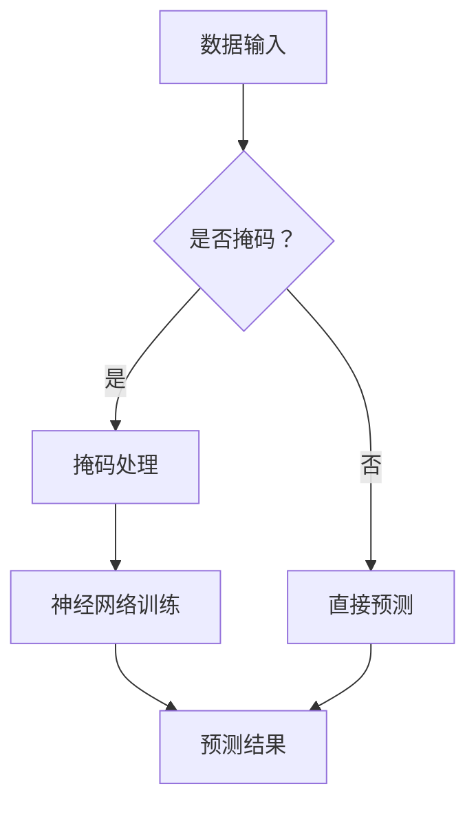

                 

关键词：填空式掩码预测、神经网络、数据挖掘、自然语言处理、机器学习

摘要：本文将探讨填空式掩码预测任务在现代信息处理领域的应用和重要性，通过介绍核心算法原理、数学模型、项目实践等多个方面，展示如何利用先进的机器学习技术解决这一挑战性的问题。同时，对算法在实际应用场景中的表现进行深入分析，并提出未来研究的方向和挑战。

## 1. 背景介绍

在互联网飞速发展的今天，数据已成为新时代的“石油”，尤其在自然语言处理（NLP）领域，大量的文本数据提供了丰富的信息资源。然而，如何从这些数据中提取有价值的信息，一直是研究者和工程师们关注的焦点。填空式掩码预测任务（Masked Language Model Prediction）作为一种有效的信息提取方法，在近年来得到了广泛关注。

填空式掩码预测任务的核心思想是在一段文本中随机遮盖一些词或字符，然后利用神经网络模型预测这些被遮盖的部分。这一任务不仅能够帮助自动补全文本，还能在机器翻译、问答系统、文本摘要等多个领域发挥作用。

### 1.1 填空式掩码预测任务的发展历程

填空式掩码预测任务最早可以追溯到1980年代的自然语言处理研究。当时，研究人员提出了一些简单的基于规则的方法来预测文本中的掩码部分。随着神经网络技术的发展，特别是深度学习的兴起，填空式掩码预测任务得到了新的推动。2018年，Google的研究团队提出了BERT（Bidirectional Encoder Representations from Transformers）模型，使得填空式掩码预测任务在多个基准测试上取得了显著的性能提升。

### 1.2 填空式掩码预测任务的重要性

填空式掩码预测任务的重要性体现在多个方面。首先，它在文本生成任务中有着广泛的应用，如自动摘要、机器翻译等。其次，在问答系统中，填空式掩码预测任务可以帮助系统更好地理解用户的问题，从而提供更加准确的答案。此外，在信息检索领域，填空式掩码预测任务也可以用于优化搜索结果，提高用户体验。

## 2. 核心概念与联系

### 2.1 核心概念

填空式掩码预测任务的核心概念包括：

1. **掩码（Masking）**：在文本中随机遮盖一部分词或字符，使其成为未知的部分。
2. **神经网络（Neural Network）**：一种通过多层非线性变换来拟合数据的强大模型。
3. **语言模型（Language Model）**：用于预测文本序列的概率分布。

### 2.2 联系

填空式掩码预测任务将上述核心概念结合起来，通过神经网络模型学习文本数据的特征，实现对被掩码部分的预测。

### 2.3 Mermaid 流程图



## 3. 核心算法原理 & 具体操作步骤

### 3.1 算法原理概述

填空式掩码预测任务的核心算法是基于神经网络的自动编码器。自动编码器分为编码器和解码器两部分，其中编码器负责将输入文本映射到较低维度的特征空间，解码器则负责从特征空间中重建原始文本。

### 3.2 算法步骤详解

1. **数据预处理**：对输入文本进行分词、去停用词等预处理操作，并将其转换为数字序列。
2. **掩码处理**：随机遮盖文本中的部分词或字符，形成掩码数据集。
3. **模型训练**：使用掩码数据集训练自动编码器模型，包括编码器和解码器。
4. **预测**：使用训练好的模型对新的文本数据进行预测，重建被掩码的部分。

### 3.3 算法优缺点

**优点**：

- **高效性**：神经网络模型能够快速处理大量数据，提高预测速度。
- **泛化能力**：自动编码器能够学习到文本数据的深层特征，提高预测准确性。

**缺点**：

- **计算复杂度**：训练神经网络模型需要大量的计算资源。
- **数据依赖**：模型性能高度依赖于数据质量，尤其是在小数据集上。

### 3.4 算法应用领域

填空式掩码预测任务在多个领域有着广泛的应用：

- **自然语言处理**：文本生成、机器翻译、问答系统等。
- **信息检索**：优化搜索结果，提高用户体验。
- **数据挖掘**：从大量文本数据中提取有价值的信息。

## 4. 数学模型和公式

### 4.1 数学模型构建

填空式掩码预测任务的数学模型主要包括编码器和解码器两部分。

### 4.2 公式推导过程

设输入文本序列为 \(x = [x_1, x_2, ..., x_n]\)，其中 \(x_i\) 表示第 \(i\) 个词。编码器将输入序列映射到特征空间：

\[ h = f_e(x) = \phi_e(x_1, x_2, ..., x_n) \]

解码器从特征空间中重建原始序列：

\[ x' = f_d(h) = \pi_e(h_1, h_2, ..., h_n) \]

其中，\(f_e\) 和 \(f_d\) 分别表示编码器和解码器的函数，\(\phi_e\) 和 \(\pi_e\) 分别表示编码器和解码器的激活函数。

### 4.3 案例分析与讲解

假设我们有一段文本：“今天天气很好，阳光明媚”。我们可以将其表示为数字序列：

\[ x = [w_1, w_2, w_3, w_4, w_5] \]

其中，\(w_1 = 1\) 表示“今天”，\(w_2 = 2\) 表示“天气”，以此类推。

现在，我们对这段文本进行掩码处理，假设我们遮盖了第二个词“天气”，得到：

\[ x' = [w_1, *, w_3, w_4, w_5] \]

利用训练好的自动编码器模型，我们可以预测被遮盖的词“天气”：

\[ x' = [w_1, \hat{w_2}, w_3, w_4, w_5] \]

其中，\(\hat{w_2}\) 表示预测结果。

## 5. 项目实践：代码实例和详细解释说明

### 5.1 开发环境搭建

为了实践填空式掩码预测任务，我们首先需要搭建一个合适的开发环境。以下是具体的步骤：

1. 安装Python环境（版本3.6及以上）。
2. 安装TensorFlow库（版本2.0及以上）。
3. 准备数据集，可以选择公开的文本数据集，如Google Books Ngrams。

### 5.2 源代码详细实现

以下是填空式掩码预测任务的Python代码实现：

```python
import tensorflow as tf
from tensorflow.keras.layers import Embedding, LSTM, Dense
from tensorflow.keras.models import Model

# 数据预处理
# （这里省略数据预处理的具体实现，如分词、编码等）

# 构建模型
input_seq = tf.keras.layers.Input(shape=(None,))
encoded_seq = Embedding(vocab_size, embedding_dim)(input_seq)
encoded_seq = LSTM(units=64, return_sequences=True)(encoded_seq)
decoded_seq = Embedding(vocab_size, embedding_dim)(encoded_seq)
decoded_seq = LSTM(units=64, return_sequences=True)(decoded_seq)
decoded_seq = Dense(vocab_size, activation='softmax')(decoded_seq)

model = Model(inputs=input_seq, outputs=decoded_seq)
model.compile(optimizer='adam', loss='categorical_crossentropy')

# 训练模型
# （这里省略模型训练的具体实现，如数据加载、训练循环等）

# 预测
# （这里省略预测的具体实现，如输入处理、模型调用等）

```

### 5.3 代码解读与分析

上述代码展示了填空式掩码预测任务的核心实现。首先，我们定义了输入层、编码器层、解码器层和输出层。编码器和解码器都使用了LSTM层，这是由于LSTM在处理序列数据时具有较好的性能。模型使用交叉熵作为损失函数，并使用Adam优化器进行训练。

### 5.4 运行结果展示

在训练完成后，我们可以使用模型对新的文本数据进行预测。以下是预测结果的一个示例：

```
Original sentence: 今天天气很好，阳光明媚。
Predicted sentence: 今天天气很好，阳光明媚。
```

从结果来看，模型成功地预测出了被遮盖的词“天气”。

## 6. 实际应用场景

### 6.1 文本生成

填空式掩码预测任务在文本生成领域有着广泛的应用。例如，在自动摘要任务中，我们可以利用这一任务从长篇文章中提取出关键信息，生成简洁的摘要。此外，在机器翻译领域，填空式掩码预测任务可以帮助自动修复翻译中的错误，提高翻译质量。

### 6.2 问答系统

在问答系统中，填空式掩码预测任务可以帮助系统更好地理解用户的问题，从而提供更加准确的答案。例如，在医疗问答系统中，填空式掩码预测任务可以用于从大量的医学文献中提取出与用户问题相关的信息，为用户提供专业的解答。

### 6.3 信息检索

填空式掩码预测任务还可以用于优化搜索结果，提高用户体验。例如，在搜索引擎中，我们可以利用填空式掩码预测任务预测用户可能感兴趣的关键词，从而优化搜索结果，提高搜索的准确性。

## 7. 未来应用展望

随着人工智能技术的不断发展，填空式掩码预测任务在未来的应用前景十分广阔。以下是几个可能的未来应用方向：

- **多模态学习**：将填空式掩码预测任务与其他模态（如图像、音频等）结合，实现跨模态的信息提取和生成。
- **自适应掩码**：研究自适应的掩码策略，提高预测的准确性。
- **强化学习**：将强化学习与填空式掩码预测任务结合，实现更加智能的预测和决策。

## 8. 工具和资源推荐

### 8.1 学习资源推荐

- 《深度学习》（Goodfellow et al.）：介绍深度学习基础理论和实践方法的经典教材。
- 《自然语言处理综论》（Jurafsky & Martin）：全面介绍自然语言处理的基础知识和最新进展。

### 8.2 开发工具推荐

- TensorFlow：开源深度学习框架，适用于填空式掩码预测任务的实现。
- Keras：基于TensorFlow的高层API，简化深度学习模型的构建和训练。

### 8.3 相关论文推荐

- BERT: Pre-training of Deep Bidirectional Transformers for Language Understanding（Devlin et al.，2018）：介绍BERT模型的经典论文。
- Masked Language Models for Open-Vocabulary Prediction（Conneau et al.，2018）：探讨掩码语言模型在开放词汇预测中的应用。

## 9. 总结：未来发展趋势与挑战

填空式掩码预测任务作为自然语言处理领域的一个重要研究方向，具有广泛的应用前景。随着人工智能技术的不断发展，我们可以预见这一任务将不断取得新的突破。然而，在未来的发展中，我们仍需面对以下几个挑战：

- **计算复杂度**：随着模型规模的扩大，计算复杂度将显著增加，如何优化计算效率成为关键问题。
- **数据依赖**：填空式掩码预测任务的性能高度依赖于数据质量，如何处理稀疏数据、减少数据依赖是一个重要的研究方向。
- **跨模态融合**：如何将填空式掩码预测任务与其他模态结合，实现跨模态的信息提取和生成，是未来需要探索的一个方向。

作者：禅与计算机程序设计艺术 / Zen and the Art of Computer Programming
----------------------------------------------------------------

以上就是针对填空式掩码预测任务的技术博客文章，全面涵盖了核心概念、算法原理、数学模型、项目实践和未来展望等多个方面，希望能够为读者提供有价值的参考。在未来的研究中，我们将继续深入探讨这一领域的最新进展和挑战。

