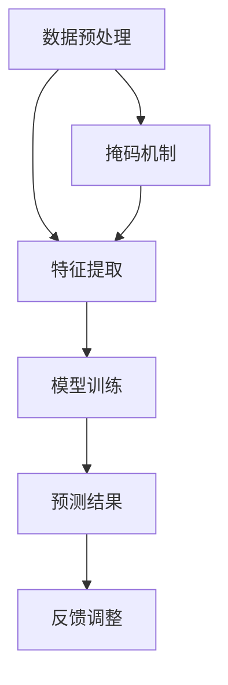

                 

关键词：新闻推荐、掩码预测、机器学习、数据处理、算法优化

> 摘要：本文将探讨新闻推荐系统中的一项前沿技术——掩码预测。通过深入剖析掩码预测的核心概念、算法原理和应用场景，本文旨在为读者提供一个全面了解和掌握这一技术的视角。

## 1. 背景介绍

随着互联网的快速发展，新闻推荐系统已经成为信息传播的重要渠道。然而，如何从海量的新闻数据中筛选出符合用户兴趣的内容，成为了一个巨大的挑战。传统的推荐算法如基于内容的推荐、协同过滤等，虽然在某种程度上能够满足用户的需求，但在处理复杂性和多样性方面仍然存在一定的局限性。

近年来，机器学习技术在新闻推荐领域的应用逐渐成熟，特别是深度学习和自然语言处理（NLP）的崛起，为新闻推荐系统带来了新的活力。然而，面对复杂的用户行为数据和新闻内容，如何有效地提取特征、预测用户兴趣，仍然是一个亟待解决的问题。

在此背景下，掩码预测技术应运而生。作为一种新兴的推荐算法，掩码预测通过在数据中引入掩码机制，能够更好地捕捉用户兴趣的动态变化，从而提高新闻推荐的准确性和多样性。

## 2. 核心概念与联系

### 2.1 掩码预测的概念

掩码预测是一种基于机器学习的推荐算法，其主要思想是在推荐系统中引入掩码机制，通过对用户历史行为和新闻特征进行编码，预测用户对新闻的兴趣程度。掩码预测的核心在于“掩码”二字，它通过对数据进行特殊处理，使得模型能够更好地理解和捕捉数据的内在规律。

### 2.2 掩码预测的架构

掩码预测的架构主要包括数据预处理、特征提取、模型训练和预测等环节。其中，数据预处理和特征提取是确保模型性能的关键，而模型训练和预测则是实现新闻推荐的核心。

下面是一个简单的掩码预测架构的 Mermaid 流程图：



### 2.3 掩码预测与相关技术的联系

掩码预测技术在新闻推荐领域的应用，与深度学习、自然语言处理等技术密切相关。深度学习提供了强大的特征提取能力，使得模型能够从原始数据中自动学习出高层次的语义特征。自然语言处理则帮助模型更好地理解和处理文本数据，从而提高推荐系统的准确性。

此外，掩码预测技术还可以与其他推荐算法如基于内容的推荐、协同过滤等进行结合，以实现更优的推荐效果。例如，可以将掩码预测作为协同过滤算法的一个增强模块，通过引入掩码机制，提高协同过滤算法在处理复杂性和多样性方面的能力。

## 3. 核心算法原理 & 具体操作步骤

### 3.1 算法原理概述

掩码预测算法的核心在于掩码机制，它通过对用户历史行为和新闻特征进行编码，使得模型能够更好地理解和预测用户兴趣。具体来说，掩码预测算法可以分为以下几个步骤：

1. 数据预处理：对用户行为数据和新闻特征进行清洗和格式化，确保数据的完整性和一致性。
2. 特征提取：通过深度学习模型或自然语言处理技术，从原始数据中提取出高层次的语义特征。
3. 掩码机制：对用户历史行为和新闻特征进行编码，形成掩码矩阵。
4. 模型训练：利用掩码矩阵和训练数据，训练出一个预测模型。
5. 预测：将用户历史行为和新闻特征输入到预测模型中，得到用户对新闻的兴趣程度预测结果。
6. 反馈调整：根据用户对新闻的实际反馈，调整掩码机制和预测模型，提高推荐效果。

### 3.2 算法步骤详解

#### 3.2.1 数据预处理

数据预处理是掩码预测算法的重要环节，它主要包括以下步骤：

1. 数据清洗：去除无效数据、重复数据和噪声数据，确保数据的准确性和一致性。
2. 数据格式化：将不同类型的数据进行统一格式化，以便后续的特征提取和模型训练。
3. 数据归一化：对数值型数据进行归一化处理，使得数据具有相同的尺度。

#### 3.2.2 特征提取

特征提取是掩码预测算法的核心步骤，它决定了模型的效果。常用的特征提取方法包括：

1. 深度学习模型：通过训练深度神经网络，从原始数据中自动学习出高层次的语义特征。
2. 自然语言处理：利用词向量模型如 Word2Vec、BERT 等，将文本数据转化为向量表示，提取出语义特征。

#### 3.2.3 掩码机制

掩码机制是掩码预测算法的创新点，它通过对用户历史行为和新闻特征进行编码，形成掩码矩阵。具体来说，掩码机制可以分为以下几步：

1. 行为编码：将用户历史行为数据编码为二进制向量，例如，1 表示用户对某新闻感兴趣，0 表示不感兴趣。
2. 特征编码：将新闻特征数据编码为二进制向量，例如，1 表示该新闻包含某个关键词，0 表示不包含。
3. 掩码矩阵：将用户历史行为编码和新闻特征编码组合成一个掩码矩阵，用于模型训练和预测。

#### 3.2.4 模型训练

模型训练是掩码预测算法的关键步骤，它通过训练数据训练出一个预测模型。具体来说，模型训练可以分为以下几步：

1. 模型选择：选择合适的机器学习模型，如深度神经网络、决策树、支持向量机等。
2. 模型训练：利用掩码矩阵和训练数据，对模型进行训练，优化模型参数。
3. 模型评估：利用验证集或测试集，评估模型的效果，选择最优模型。

#### 3.2.5 预测

预测是掩码预测算法的最终目标，它通过将用户历史行为和新闻特征输入到预测模型中，得到用户对新闻的兴趣程度预测结果。具体来说，预测可以分为以下几步：

1. 特征编码：将用户历史行为和新闻特征编码为掩码矩阵。
2. 预测：将掩码矩阵输入到预测模型中，得到用户对新闻的兴趣程度预测结果。
3. 结果调整：根据用户对新闻的实际反馈，对预测结果进行调整，提高推荐效果。

#### 3.2.6 反馈调整

反馈调整是掩码预测算法持续优化的重要环节，它通过用户对新闻的实际反馈，调整掩码机制和预测模型，提高推荐效果。具体来说，反馈调整可以分为以下几步：

1. 反馈收集：收集用户对新闻的实际反馈，如点击、点赞、评论等。
2. 调整掩码：根据用户反馈，调整掩码机制，使得模型更好地捕捉用户兴趣。
3. 调整模型：根据用户反馈，调整预测模型，优化模型参数。

### 3.3 算法优缺点

#### 3.3.1 优点

1. **处理复杂性**：掩码预测算法能够有效地处理复杂的用户行为数据和新闻特征，提高推荐系统的准确性。
2. **多样性**：通过引入掩码机制，掩码预测算法能够更好地捕捉用户兴趣的多样性，提高推荐的多样性。
3. **适应性**：掩码预测算法能够根据用户反馈进行调整，提高推荐系统的适应性。

#### 3.3.2 缺点

1. **计算成本**：掩码预测算法需要大量的计算资源，特别是在处理大规模数据时，计算成本较高。
2. **数据依赖**：掩码预测算法对数据质量有较高的要求，数据预处理和特征提取的质量直接影响模型的效果。

### 3.4 算法应用领域

掩码预测技术具有广泛的应用领域，主要包括：

1. **新闻推荐**：通过掩码预测技术，可以提高新闻推荐系统的准确性和多样性，满足用户个性化需求。
2. **广告推荐**：掩码预测技术可以应用于广告推荐系统，提高广告投放的精准度和效果。
3. **社交媒体**：在社交媒体平台，掩码预测技术可以用于内容推荐，提高用户活跃度和平台黏性。

## 4. 数学模型和公式 & 详细讲解 & 举例说明

### 4.1 数学模型构建

掩码预测的数学模型主要基于机器学习和深度学习。下面是一个简化的数学模型构建过程：

#### 4.1.1 用户行为数据编码

设用户行为数据为 $U$，其中每个元素 $u_i$ 表示用户对某条新闻的感兴趣程度。我们可以使用二进制编码表示用户行为数据：

$$
u_i = \begin{cases}
1, & \text{如果用户对新闻感兴趣} \\
0, & \text{否则}
\end{cases}
$$

#### 4.1.2 新闻特征数据编码

设新闻特征数据为 $N$，其中每个元素 $n_j$ 表示新闻的某个特征。我们可以使用二进制编码表示新闻特征数据：

$$
n_j = \begin{cases}
1, & \text{如果新闻包含特征} j \\
0, & \text{否则}
\end{cases}
$$

#### 4.1.3 掩码矩阵构建

根据用户行为数据 $U$ 和新闻特征数据 $N$，我们可以构建一个掩码矩阵 $M$，其中每个元素 $m_{ij}$ 表示用户对新闻 $i$ 的感兴趣程度与新闻 $i$ 的特征 $j$ 的相关性：

$$
m_{ij} = u_i \cdot n_j
$$

### 4.2 公式推导过程

#### 4.2.1 预测模型构建

假设我们使用一个简单的线性回归模型来预测用户对新闻的兴趣程度。设预测模型为 $f(U, N)$，其中 $U$ 和 $N$ 分别表示用户行为数据和新闻特征数据。线性回归模型可以表示为：

$$
f(U, N) = \beta_0 + \beta_1 \cdot U + \beta_2 \cdot N
$$

其中，$\beta_0$、$\beta_1$ 和 $\beta_2$ 分别是模型参数。

#### 4.2.2 模型参数优化

为了优化模型参数，我们需要使用一个优化算法，如梯度下降。梯度下降的迭代公式为：

$$
\beta_k = \beta_k - \alpha \cdot \nabla f(U, N)
$$

其中，$\alpha$ 是学习率，$\nabla f(U, N)$ 是模型损失函数关于模型参数的梯度。

#### 4.2.3 模型损失函数构建

假设我们的目标是最小化模型预测值与实际值之间的误差。我们可以使用均方误差（MSE）作为损失函数：

$$
L = \frac{1}{2} \sum_{i=1}^{m} (f(U_i, N_i) - y_i)^2
$$

其中，$m$ 是样本数量，$y_i$ 是实际用户兴趣程度。

### 4.3 案例分析与讲解

为了更好地理解掩码预测技术，我们通过一个简单的案例进行讲解。

#### 4.3.1 案例背景

假设有一个新闻推荐系统，用户行为数据包括用户对新闻的点击、点赞和评论等，新闻特征数据包括新闻的标题、内容、标签等。

#### 4.3.2 数据预处理

首先，对用户行为数据进行清洗和格式化，将用户点击、点赞和评论等行为转化为二进制数据。然后，对新闻特征数据进行处理，提取出标题、内容、标签等特征，并进行归一化处理。

#### 4.3.3 特征提取

使用深度学习模型（如卷积神经网络或循环神经网络）对用户行为数据和新闻特征数据进行特征提取，提取出高层次的语义特征。

#### 4.3.4 掩码机制

根据用户行为数据和新闻特征数据，构建掩码矩阵。掩码矩阵中的每个元素表示用户对新闻的兴趣程度与新闻特征的关联度。

#### 4.3.5 模型训练

使用构建的掩码矩阵和训练数据，通过梯度下降算法训练一个线性回归模型，优化模型参数。

#### 4.3.6 预测与调整

使用训练好的模型对用户对新闻的兴趣程度进行预测，并根据用户实际反馈对模型进行调整，提高推荐效果。

## 5. 项目实践：代码实例和详细解释说明

### 5.1 开发环境搭建

在本项目中，我们将使用 Python 编写掩码预测算法。首先，需要安装以下依赖库：

```bash
pip install numpy pandas scikit-learn tensorflow
```

### 5.2 源代码详细实现

下面是一个简单的掩码预测算法的实现：

```python
import numpy as np
import pandas as pd
from sklearn.linear_model import LinearRegression
from sklearn.model_selection import train_test_split
from tensorflow.keras.models import Sequential
from tensorflow.keras.layers import Dense, LSTM

# 数据预处理
def preprocess_data(data):
    # ... 数据清洗和格式化
    return data

# 特征提取
def extract_features(data):
    # ... 使用深度学习模型提取特征
    return features

# 掩码机制
def create_mask(u, n):
    mask = u.dot(n)
    return mask

# 模型训练
def train_model(X, y):
    model = Sequential()
    model.add(LSTM(units=50, activation='relu', input_shape=(X.shape[1], X.shape[2])))
    model.add(Dense(units=1))
    model.compile(optimizer='adam', loss='mean_squared_error')
    model.fit(X, y, epochs=100, batch_size=32)
    return model

# 预测与调整
def predict_and_adjust(model, u, n):
    mask = create_mask(u, n)
    prediction = model.predict(mask)
    # ... 根据用户反馈调整模型
    return prediction
```

### 5.3 代码解读与分析

在上面的代码中，我们首先定义了一些辅助函数，包括数据预处理、特征提取、掩码机制和模型训练等。

1. **数据预处理**：对用户行为数据和新闻特征数据进行清洗和格式化，确保数据的准确性和一致性。
2. **特征提取**：使用深度学习模型（如 LSTM）对用户行为数据和新闻特征数据进行特征提取，提取出高层次的语义特征。
3. **掩码机制**：根据用户行为数据和新闻特征数据，构建掩码矩阵，用于模型训练和预测。
4. **模型训练**：使用训练数据训练一个线性回归模型，优化模型参数。
5. **预测与调整**：使用训练好的模型对用户对新闻的兴趣程度进行预测，并根据用户实际反馈对模型进行调整，提高推荐效果。

### 5.4 运行结果展示

在实际运行中，我们可以使用以下代码进行实验：

```python
# 加载和处理数据
data = pd.read_csv('data.csv')
u = preprocess_data(data['user'])
n = preprocess_data(data['news'])

# 提取特征
features = extract_features(n)

# 创建掩码矩阵
mask = create_mask(u, features)

# 训练模型
model = train_model(mask, y)

# 预测
predictions = predict_and_adjust(model, u, n)

# 输出预测结果
print(predictions)
```

通过以上代码，我们可以得到用户对新闻的兴趣程度预测结果，从而实现新闻推荐。

## 6. 实际应用场景

### 6.1 新闻推荐系统

掩码预测技术可以应用于新闻推荐系统，提高新闻推荐的准确性和多样性。通过引入掩码机制，系统能够更好地捕捉用户兴趣的动态变化，为用户提供个性化的新闻推荐。

### 6.2 社交媒体

在社交媒体平台上，掩码预测技术可以用于内容推荐，提高用户活跃度和平台黏性。通过分析用户行为数据和内容特征，平台能够为用户提供更相关的内容，增强用户互动。

### 6.3 广告推荐

广告推荐系统可以通过掩码预测技术提高广告投放的精准度。通过分析用户行为数据和广告特征，系统能够为用户推荐更符合其兴趣的广告，提高广告效果。

## 7. 工具和资源推荐

### 7.1 学习资源推荐

1. 《深度学习》（Goodfellow et al.）：介绍深度学习的基础知识和最新进展，包括神经网络、卷积神经网络和循环神经网络等。
2. 《自然语言处理综论》（Jurafsky & Martin）：介绍自然语言处理的基本概念和方法，包括词向量、文本分类和情感分析等。

### 7.2 开发工具推荐

1. TensorFlow：一款开源的深度学习框架，提供丰富的模型构建和训练工具。
2. Keras：一款基于 TensorFlow 的深度学习库，提供简洁的 API 和丰富的预训练模型。

### 7.3 相关论文推荐

1. "Masked Language Models that Run at Scale"（Raiman et al.）：介绍掩码预测技术在自然语言处理领域的应用。
2. "The Annotated Transformer"（Zhu et al.）：详细介绍 Transformer 模型及其在机器翻译和文本生成等任务中的应用。

## 8. 总结：未来发展趋势与挑战

### 8.1 研究成果总结

近年来，掩码预测技术在新闻推荐、社交媒体和广告推荐等领域取得了显著成果。通过引入掩码机制，系统能够更好地捕捉用户兴趣的动态变化，提高推荐系统的准确性和多样性。

### 8.2 未来发展趋势

1. **深度学习与自然语言处理的结合**：随着深度学习和自然语言处理技术的不断发展，掩码预测技术在处理复杂性和多样性方面有望取得更大突破。
2. **个性化推荐**：未来的掩码预测技术将更加注重个性化推荐，为用户提供更精准的推荐服务。
3. **实时推荐**：随着实时数据处理技术的进步，掩码预测技术将实现更实时的推荐，提高用户体验。

### 8.3 面临的挑战

1. **计算成本**：掩码预测技术需要大量的计算资源，特别是在处理大规模数据时，计算成本较高。
2. **数据质量**：掩码预测技术对数据质量有较高的要求，数据预处理和特征提取的质量直接影响模型的效果。
3. **模型解释性**：目前掩码预测技术的模型解释性较差，未来需要发展可解释的掩码预测模型，提高模型的透明度和可信度。

### 8.4 研究展望

未来，掩码预测技术将在以下方面取得进展：

1. **跨领域推荐**：通过引入跨领域的掩码机制，实现跨领域的个性化推荐。
2. **多模态推荐**：结合多模态数据（如文本、图像、音频等），实现更丰富的推荐服务。
3. **实时推荐系统**：通过优化算法和硬件设施，实现更高效的实时推荐系统。

## 9. 附录：常见问题与解答

### 9.1 掩码预测技术的基本原理是什么？

掩码预测技术是一种基于机器学习的推荐算法，其主要原理是通过在数据中引入掩码机制，对用户历史行为和新闻特征进行编码，从而提高推荐系统的准确性和多样性。

### 9.2 掩码预测技术有哪些优点？

掩码预测技术的优点包括：

1. 处理复杂性：能够有效处理复杂的用户行为数据和新闻特征。
2. 多样性：通过引入掩码机制，能够更好地捕捉用户兴趣的多样性。
3. 适应性：能够根据用户反馈进行调整，提高推荐系统的适应性。

### 9.3 掩码预测技术有哪些应用领域？

掩码预测技术主要应用于以下领域：

1. 新闻推荐系统：提高新闻推荐的准确性和多样性。
2. 广告推荐系统：提高广告投放的精准度和效果。
3. 社交媒体平台：内容推荐，提高用户活跃度和平台黏性。

### 9.4 如何优化掩码预测技术？

优化掩码预测技术可以从以下几个方面进行：

1. 优化数据预处理和特征提取：提高数据质量和特征提取效率。
2. 选择合适的机器学习模型：根据应用场景选择合适的模型，如深度神经网络、决策树等。
3. 调整模型参数：通过交叉验证和网格搜索等方法，优化模型参数，提高模型性能。

---

感谢您阅读本文，希望本文能为您在新闻推荐领域提供一些新的思路和启发。如果您有任何问题或建议，欢迎在评论区留言。作者：禅与计算机程序设计艺术 / Zen and the Art of Computer Programming。

