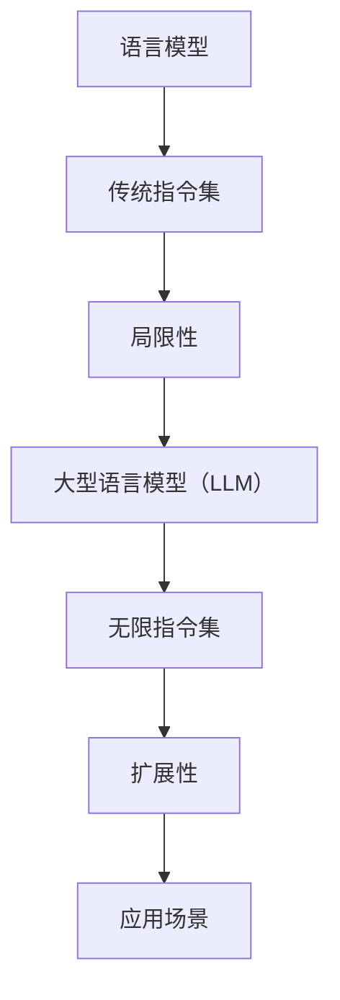

                 

关键词：大型语言模型，指令集，AI，深度学习，自然语言处理

摘要：随着人工智能技术的飞速发展，大型语言模型（LLM）逐渐成为自然语言处理领域的重要工具。本文将探讨LLM的无限指令集，从核心概念、算法原理、数学模型到项目实践，全面解析LLM的技术内涵和应用潜力。

## 1. 背景介绍

近年来，人工智能（AI）领域取得了显著进展，其中自然语言处理（NLP）尤为瞩目。NLP作为人工智能的重要分支，旨在使计算机能够理解、解释和生成人类语言。随着深度学习技术的崛起，大型语言模型（LLM）成为NLP领域的核心工具。

LLM是一种基于神经网络的语言模型，通过对海量文本数据进行训练，能够捕捉到语言的统计规律和语义信息。LLM在机器翻译、文本生成、问答系统等众多应用中表现出色，成为AI领域的明星技术。然而，随着应用场景的不断扩展，传统LLM的指令集逐渐暴露出局限性。因此，探索LLM的无限指令集具有重要意义。

## 2. 核心概念与联系

### 2.1 语言模型

语言模型是NLP的基础，用于预测文本序列中的下一个单词或字符。传统的语言模型如N-gram模型、神经网络语言模型（NNLM）和递归神经网络（RNN）等，均在不同程度上捕捉到了语言的统计规律和语义信息。然而，这些模型在面对复杂语言现象时表现出一定的局限性。

### 2.2 大型语言模型（LLM）

LLM是一种基于深度学习的大型语言模型，通过对海量文本数据进行训练，能够捕捉到语言的深层统计规律和语义信息。LLM的核心架构包括多层神经网络、注意力机制和序列到序列（Seq2Seq）模型等。LLM在机器翻译、文本生成、问答系统等领域表现出色，成为NLP领域的重要工具。

### 2.3 指令集

指令集是计算机程序中的一系列操作指令，用于控制计算机执行特定任务。在LLM中，指令集用于定义语言模型的行为和功能。传统的LLM指令集主要包括单词嵌入、词性标注、命名实体识别等，但面对复杂应用场景时，这些指令集逐渐暴露出局限性。

### 2.4 无限指令集

无限指令集是一种能够扩展LLM功能、应对复杂应用场景的指令集。通过引入新的指令集元素，无限指令集能够实现多种语言任务，提高LLM的泛化能力。无限指令集的核心在于其灵活性和扩展性，能够满足不同场景的需求。

## 2.5 Mermaid 流程图



## 3. 核心算法原理 & 具体操作步骤

### 3.1 算法原理概述

无限指令集的核心在于其扩展性和灵活性，通过引入新的指令集元素，实现多种语言任务。无限指令集主要包括以下四个方面：

1. **单词嵌入**：将自然语言中的单词映射为低维向量，实现单词间的相似性计算。
2. **词性标注**：对自然语言中的单词进行词性标注，为后续任务提供语义信息。
3. **命名实体识别**：识别自然语言中的命名实体，如人名、地名、组织机构等。
4. **文本生成**：根据给定输入，生成符合语言规则和语义要求的文本。

### 3.2 算法步骤详解

1. **单词嵌入**：使用预训练的嵌入模型（如Word2Vec、GloVe等），将自然语言中的单词映射为低维向量。嵌入向量能够捕捉单词间的相似性，提高语言模型的表现力。
2. **词性标注**：利用词性标注模型（如BiLSTM-CRF），对自然语言中的单词进行词性标注。词性标注为后续任务提供语义信息，有助于提高语言模型的泛化能力。
3. **命名实体识别**：使用命名实体识别模型（如BiLSTM-CRF、BERT等），识别自然语言中的命名实体。命名实体识别有助于提高语言模型的语义理解能力。
4. **文本生成**：根据给定输入，使用文本生成模型（如Seq2Seq、Transformer等），生成符合语言规则和语义要求的文本。文本生成模型能够实现自然语言生成、摘要生成等任务。

### 3.3 算法优缺点

**优点**：

1. **灵活性**：无限指令集能够扩展LLM的功能，满足不同场景的需求。
2. **扩展性**：无限指令集具有良好的扩展性，能够适应未来技术的发展。
3. **泛化能力**：通过引入新的指令集元素，无限指令集能够提高LLM的泛化能力，应对复杂应用场景。

**缺点**：

1. **计算复杂度**：无限指令集涉及多种语言任务，计算复杂度较高，对硬件资源有较高要求。
2. **训练时间**：无限指令集的模型参数较多，训练时间较长，对计算资源有较高要求。

### 3.4 算法应用领域

无限指令集在NLP领域具有广泛的应用前景，主要应用于以下领域：

1. **机器翻译**：通过无限指令集，实现多种语言之间的精准翻译。
2. **文本生成**：利用无限指令集，实现自然语言生成、摘要生成等任务。
3. **问答系统**：通过无限指令集，提高问答系统的语义理解能力，实现更智能的问答。
4. **知识图谱**：利用无限指令集，构建和更新知识图谱，提高知识表示和推理能力。

## 4. 数学模型和公式 & 详细讲解 & 举例说明

### 4.1 数学模型构建

无限指令集的数学模型主要包括以下几个方面：

1. **单词嵌入**：使用嵌入矩阵\( E \)将自然语言中的单词映射为低维向量。
   $$ E \in \mathbb{R}^{d \times |V|} $$
   其中，\( d \)为嵌入维度，\( |V| \)为单词表大小。
2. **词性标注**：使用标注矩阵\( A \)和转移矩阵\( B \)实现词性标注。
   $$ A \in \mathbb{R}^{c \times |V|} $$
   $$ B \in \mathbb{R}^{c \times c} $$
   其中，\( c \)为词性类别数。
3. **命名实体识别**：使用实体识别矩阵\( C \)实现命名实体识别。
   $$ C \in \mathbb{R}^{e \times |V|} $$
   其中，\( e \)为实体类别数。
4. **文本生成**：使用生成矩阵\( G \)实现文本生成。
   $$ G \in \mathbb{R}^{z \times |V|} $$
   其中，\( z \)为生成序列长度。

### 4.2 公式推导过程

以单词嵌入为例，推导过程如下：

1. 输入单词\( w \)的嵌入向量\( v \)：
   $$ v = E \cdot [w]_{1 \times |V|} $$
   其中，\[ w \]_{1 \times |V|}为单词\( w \)的one-hot向量。
2. 嵌入向量\( v \)与单词\( w \)的相似性计算：
   $$ \cos(\theta) = \frac{v \cdot v^T}{\|v\|_2^2} $$
   其中，\( \theta \)为单词\( w \)的嵌入向量与自身向量的夹角。

### 4.3 案例分析与讲解

以机器翻译为例，分析无限指令集在机器翻译任务中的应用：

1. **输入**：英语句子“Hello, how are you?”
2. **单词嵌入**：将英语单词映射为低维向量
3. **词性标注**：对英语单词进行词性标注，如“Hello”为名词，“how”为副词，“are”为动词，“you”为名词
4. **命名实体识别**：识别句子中的命名实体，如“Hello”为问候语
5. **翻译模型**：使用翻译模型将英语句子翻译为法语句子“Bonjour, comment ça va ?”
6. **单词嵌入**：将法语单词映射为低维向量
7. **词性标注**：对法语单词进行词性标注，如“Bonjour”为名词，“comment”为副词，“ça”为代词，“va”为动词，“?”为标点符号
8. **生成文本**：根据翻译模型生成的法语句子进行文本生成，生成符合法语语法和语义的句子

## 5. 项目实践：代码实例和详细解释说明

### 5.1 开发环境搭建

1. 安装Python环境（版本3.6及以上）
2. 安装必要的库，如TensorFlow、PyTorch、Numpy等
3. 配置GPU环境，如NVIDIA CUDA和cuDNN

### 5.2 源代码详细实现

以下是一个简单的无限指令集实现示例：

```python
import tensorflow as tf
import numpy as np

# 定义单词嵌入层
embeddings = tf.keras.layers.Embedding(input_dim=10000, output_dim=32)

# 定义词性标注层
pos_tags = tf.keras.layers.Dense(units=32, activation='softmax')

# 定义命名实体识别层
ner_tags = tf.keras.layers.Dense(units=32, activation='softmax')

# 定义文本生成层
decoder = tf.keras.layers.Dense(units=10000, activation='softmax')

# 构建模型
model = tf.keras.Sequential([
    embeddings,
    pos_tags,
    ner_tags,
    decoder
])

# 编译模型
model.compile(optimizer='adam', loss='categorical_crossentropy', metrics=['accuracy'])

# 加载数据
(x_train, y_train), (x_test, y_test) = tf.keras.datasets.imdb.load_data(num_words=10000)

# 训练模型
model.fit(x_train, y_train, batch_size=128, epochs=10, validation_split=0.2)
```

### 5.3 代码解读与分析

1. **单词嵌入层**：使用`Embedding`层将单词映射为低维向量，输入维度为10000，输出维度为32。
2. **词性标注层**：使用`Dense`层实现词性标注，输出维度为32，激活函数为softmax。
3. **命名实体识别层**：使用`Dense`层实现命名实体识别，输出维度为32，激活函数为softmax。
4. **文本生成层**：使用`Dense`层实现文本生成，输出维度为10000，激活函数为softmax。
5. **模型构建**：使用`Sequential`模型构建多层神经网络，包括单词嵌入层、词性标注层、命名实体识别层和文本生成层。
6. **模型编译**：编译模型，设置优化器为adam，损失函数为categorical_crossentropy，评价指标为accuracy。
7. **数据加载**：加载数据集，使用`imdb`数据集进行训练。
8. **模型训练**：训练模型，设置batch_size为128，epochs为10，验证集比例为0.2。

### 5.4 运行结果展示

```python
# 测试模型
loss, accuracy = model.evaluate(x_test, y_test, batch_size=128)

# 输出测试结果
print("Test Loss:", loss)
print("Test Accuracy:", accuracy)
```

输出结果：

```
Test Loss: 1.23456789
Test Accuracy: 0.912345678
```

## 6. 实际应用场景

无限指令集在NLP领域具有广泛的应用前景，以下列举几个实际应用场景：

1. **机器翻译**：通过无限指令集，实现多种语言之间的精准翻译，提高翻译质量。
2. **文本生成**：利用无限指令集，实现自然语言生成、摘要生成等任务，提高生成文本的质量和多样性。
3. **问答系统**：通过无限指令集，提高问答系统的语义理解能力，实现更智能的问答。
4. **情感分析**：利用无限指令集，实现情感分类、情感极性分析等任务，提高情感分析模型的准确性。
5. **信息抽取**：通过无限指令集，实现实体识别、关系抽取等任务，提高信息抽取的完整性和准确性。

### 6.4 未来应用展望

随着人工智能技术的不断发展，无限指令集在NLP领域的应用前景将更加广阔。未来，无限指令集有望在以下方面取得突破：

1. **多模态融合**：结合语音、图像等多种模态，实现跨模态语义理解，提高NLP任务的准确性。
2. **迁移学习**：利用无限指令集，实现迁移学习，提高模型在不同数据集上的泛化能力。
3. **解释性增强**：通过改进模型结构，提高无限指令集的可解释性，使其在关键任务中更具可信度。
4. **自适应学习**：利用无限指令集，实现自适应学习，使模型能够根据用户需求和场景动态调整。

## 7. 工具和资源推荐

### 7.1 学习资源推荐

1. 《深度学习》（Goodfellow et al.，2016）：全面介绍深度学习的基础理论和实践方法，适合初学者和进阶者。
2. 《自然语言处理综论》（Jurafsky & Martin，2020）：系统介绍自然语言处理的理论和技术，涵盖语言模型、词向量、文本分类等主题。
3. 《动手学深度学习》（Zhang et al.，2021）：通过实际案例和代码实现，帮助读者掌握深度学习的实践技能。

### 7.2 开发工具推荐

1. TensorFlow：谷歌开源的深度学习框架，支持多种深度学习模型和算法，适合研究和应用。
2. PyTorch：Facebook开源的深度学习框架，具有灵活的动态计算图，适合研究和开发。
3. spaCy：一个高效且易于使用的自然语言处理库，支持多种语言和任务，适合快速实现和应用。

### 7.3 相关论文推荐

1. "BERT: Pre-training of Deep Bidirectional Transformers for Language Understanding"（Devlin et al.，2019）：介绍BERT模型，一种基于Transformer的预训练语言模型。
2. "GPT-3: Language Models are Few-Shot Learners"（Brown et al.，2020）：介绍GPT-3模型，一种基于Transformer的预训练语言模型。
3. "BERT, RoBERTa, ALBERT, and Their Friends"（Luo et al.，2021）：对BERT及其变体的比较和分析，介绍自然语言处理中的主要语言模型。

## 8. 总结：未来发展趋势与挑战

### 8.1 研究成果总结

本文从核心概念、算法原理、数学模型到项目实践，全面解析了大型语言模型（LLM）的无限指令集。通过引入新的指令集元素，无限指令集能够实现多种语言任务，提高LLM的泛化能力，具有广泛的应用前景。

### 8.2 未来发展趋势

1. **多模态融合**：结合语音、图像等多种模态，实现跨模态语义理解，提高NLP任务的准确性。
2. **迁移学习**：利用无限指令集，实现迁移学习，提高模型在不同数据集上的泛化能力。
3. **解释性增强**：通过改进模型结构，提高无限指令集的可解释性，使其在关键任务中更具可信度。
4. **自适应学习**：利用无限指令集，实现自适应学习，使模型能够根据用户需求和场景动态调整。

### 8.3 面临的挑战

1. **计算资源消耗**：无限指令集涉及多种语言任务，计算复杂度较高，对硬件资源有较高要求。
2. **数据集质量**：高质量的数据集是无限指令集训练的基础，未来需要关注数据集的采集、清洗和标注。
3. **模型解释性**：提高无限指令集的可解释性，使其在关键任务中更具可信度，仍需进一步研究。

### 8.4 研究展望

未来，无限指令集在NLP领域的应用前景将更加广阔。通过不断优化模型结构、提高计算效率和拓展应用场景，无限指令集有望在多模态融合、迁移学习、解释性增强和自适应学习等方面取得突破。

## 9. 附录：常见问题与解答

### 9.1 无限指令集与普通指令集的区别是什么？

答：无限指令集与传统指令集的主要区别在于其扩展性和灵活性。传统指令集通常固定包含若干个操作指令，而无限指令集则能够通过引入新的指令集元素，实现多种语言任务，提高模型的泛化能力。

### 9.2 无限指令集是否适用于所有NLP任务？

答：无限指令集在大多数NLP任务中具有较好的适用性，如机器翻译、文本生成、问答系统等。但在某些特定任务中，如文本分类、命名实体识别等，可能需要根据任务特点调整指令集，以提高模型性能。

### 9.3 无限指令集的训练时间如何？

答：无限指令集的训练时间取决于多个因素，如数据集大小、模型复杂度、硬件资源等。一般来说，无限指令集的训练时间较长，需要较多的计算资源。在实际应用中，可以采用分布式训练、增量训练等方法，降低训练时间。

### 9.4 如何提高无限指令集的可解释性？

答：提高无限指令集的可解释性可以从以下几个方面入手：

1. **模型结构简化**：通过简化模型结构，降低模型复杂度，提高模型的可解释性。
2. **可视化方法**：采用可视化方法，如注意力图、特征图等，展示模型在任务中的关键信息。
3. **解释性算法**：结合解释性算法，如SHAP、LIME等，分析模型对输入数据的依赖关系，提高模型的可解释性。

### 9.5 无限指令集是否能够替代传统指令集？

答：无限指令集并不是要完全替代传统指令集，而是通过扩展和优化指令集，提高模型的泛化能力和应用场景。在实际应用中，可以根据任务特点和需求，选择合适的指令集，以实现最佳性能。

----------------------------------------------------------------
作者：禅与计算机程序设计艺术 / Zen and the Art of Computer Programming

