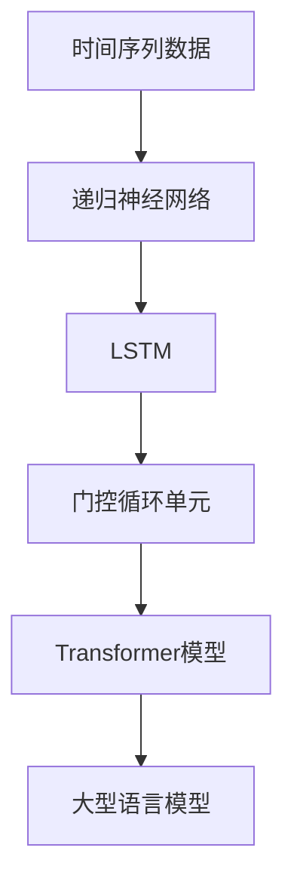

                 

关键词：Large Language Models (LLM), 时间维度，推理机制，神经网络，自然语言处理，技术革新

> 摘要：本文将探讨大型语言模型（LLM）在时间维度上的独特推理机制，分析其在自然语言处理领域中的重要作用和未来发展趋势。

## 1. 背景介绍

近年来，随着深度学习技术的飞速发展，大型语言模型（LLM）如BERT、GPT、T5等，在自然语言处理（NLP）领域取得了显著的成果。这些模型通过训练大规模的语料库，能够自动捕捉语言中的复杂模式和语义信息，从而在文本分类、机器翻译、问答系统等方面展现出强大的性能。

然而，尽管这些LLM模型在处理静态文本数据方面表现出色，但在处理具有时间序列特征的动态文本数据时，它们仍存在一定的局限性。如何让LLM更好地理解和处理时间维度上的信息，成为当前NLP领域的一个重要研究方向。

## 2. 核心概念与联系

为了更好地理解LLM在时间维度上的推理机制，我们首先需要了解以下几个核心概念：

### 2.1 时间序列数据

时间序列数据是指一系列按照时间顺序排列的数据点。在自然语言处理中，时间序列数据可以表示为文本序列、音频信号、股票价格等。这些数据往往具有时间依赖性，即当前时刻的数据受到之前时刻数据的影响。

### 2.2 递归神经网络（RNN）

递归神经网络是一种能够处理时间序列数据的神经网络模型。它通过在网络中引入递归结构，使得模型能够在处理数据时保留历史信息，从而捕捉时间依赖关系。然而，传统的RNN模型存在梯度消失和梯度爆炸等问题，导致其训练效果不理想。

### 2.3 长短期记忆网络（LSTM）

为了解决RNN的梯度消失和梯度爆炸问题，Hochreiter和Schmidhuber提出了长短期记忆网络（LSTM）。LSTM通过引入门控机制，能够有效地控制信息的流动，从而在处理长序列数据时保持良好的性能。

### 2.4 门控循环单元（GRU）

门控循环单元（GRU）是LSTM的变体，它通过简化LSTM的结构，提高了计算效率。GRU同样具有门控机制，能够有效地处理时间序列数据。

### 2.5 Transformer模型

Transformer模型是一种基于自注意力机制的深度神经网络模型，它在处理序列数据时，能够自动捕捉全局依赖关系。与传统的循环神经网络相比，Transformer模型在处理长序列数据时具有更高的效率和性能。

下面是一个Mermaid流程图，展示了LLM在时间维度上的核心概念和联系：



## 3. 核心算法原理 & 具体操作步骤

### 3.1 算法原理概述

LLM在时间维度上的核心算法是基于Transformer模型的自注意力机制。自注意力机制允许模型在处理序列数据时，将当前时刻的输入与历史时刻的输入进行关联，从而捕捉时间依赖关系。

具体来说，Transformer模型通过计算自注意力权重，将序列中的每个元素与其余元素进行加权求和，得到一个加权的输出序列。自注意力权重通过以下公式计算：

$$
\text{Attention}(Q, K, V) = \frac{softmax(\frac{QK^T}{\sqrt{d_k}})}{V}
$$

其中，$Q$、$K$ 和 $V$ 分别表示查询向量、键向量和值向量，$d_k$ 表示键向量的维度。通过自注意力机制，模型能够自动捕捉序列中的依赖关系，从而提高处理时间序列数据的能力。

### 3.2 算法步骤详解

1. **输入序列编码**：将输入序列编码为查询向量、键向量和值向量。

2. **计算自注意力权重**：通过计算查询向量与键向量的点积，得到自注意力权重。

3. **加权求和**：将自注意力权重与值向量进行加权求和，得到加权的输出序列。

4. **输出序列解码**：将加权的输出序列解码为文本或其他形式的输出。

### 3.3 算法优缺点

**优点**：

- **高效性**：自注意力机制允许模型在处理序列数据时，同时关注序列中的所有元素，从而提高了处理效率。
- **全局依赖性**：自注意力机制能够自动捕捉序列中的全局依赖关系，从而提高了模型的性能。
- **灵活性**：自注意力机制可以应用于各种序列数据，如文本、图像、音频等。

**缺点**：

- **计算量较大**：自注意力机制的计算量较大，可能导致模型训练和推理的时间较长。
- **训练难度**：由于自注意力机制的计算复杂度较高，模型的训练难度较大。

### 3.4 算法应用领域

LLM在时间维度上的推理机制在自然语言处理领域具有广泛的应用。以下是一些具体的应用领域：

- **文本分类**：通过对文本序列进行编码，LLM可以用于文本分类任务，如情感分析、主题分类等。
- **机器翻译**：LLM可以用于机器翻译任务，将一种语言的文本序列翻译为另一种语言的文本序列。
- **问答系统**：LLM可以用于问答系统，根据用户提出的问题，从大量文本数据中检索出最相关的答案。

## 4. 数学模型和公式 & 详细讲解 & 举例说明

### 4.1 数学模型构建

LLM在时间维度上的推理机制可以通过以下数学模型进行描述：

$$
\text{Output} = \text{softmax}(\frac{\text{Query} \cdot \text{Key}^T}{\sqrt{d_k}}) \cdot \text{Value}
$$

其中，$\text{Output}$ 表示输出序列，$\text{Query}$、$\text{Key}$ 和 $\text{Value}$ 分别表示查询向量、键向量和值向量，$d_k$ 表示键向量的维度。

### 4.2 公式推导过程

自注意力机制的推导过程可以分为以下几个步骤：

1. **计算查询向量与键向量的点积**：查询向量 $\text{Query}$ 和键向量 $\text{Key}$ 的点积表示两个向量之间的相似性。点积越大，表示两个向量越相似。

2. **添加缩放因子**：为了防止点积过大或过小，通常在点积上添加一个缩放因子 $\sqrt{d_k}$，其中 $d_k$ 表示键向量的维度。

3. **应用softmax函数**：通过应用softmax函数，将点积转换为概率分布。这样，每个键向量都对应一个权重，表示其在输出序列中的重要性。

4. **加权求和**：将权重与值向量 $\text{Value}$ 进行加权求和，得到加权的输出序列。

### 4.3 案例分析与讲解

假设我们有一个长度为5的文本序列，表示为 $\text{Seq} = [w_1, w_2, w_3, w_4, w_5]$。我们将这个序列编码为查询向量、键向量和值向量，分别为 $\text{Query} = [q_1, q_2, q_3, q_4, q_5]$、$\text{Key} = [k_1, k_2, k_3, k_4, k_5]$ 和 $\text{Value} = [v_1, v_2, v_3, v_4, v_5]$。

根据自注意力机制的公式，我们可以计算出输出序列：

$$
\text{Output} = \text{softmax}(\frac{\text{Query} \cdot \text{Key}^T}{\sqrt{d_k}}) \cdot \text{Value}
$$

其中，$d_k$ 表示键向量的维度。

假设 $d_k = 10$，我们可以计算出每个键向量的权重：

$$
\text{Attention}(w_1, w_2, w_3, w_4, w_5) = \frac{q_1 \cdot k_1^T + q_2 \cdot k_2^T + q_3 \cdot k_3^T + q_4 \cdot k_4^T + q_5 \cdot k_5^T}{\sqrt{10}}
$$

根据计算结果，我们可以得到一个概率分布：

$$
\text{Attention}(w_1, w_2, w_3, w_4, w_5) = [\alpha_1, \alpha_2, \alpha_3, \alpha_4, \alpha_5]
$$

其中，$\alpha_i$ 表示第 $i$ 个键向量在输出序列中的权重。

最后，我们将权重与值向量进行加权求和，得到加权的输出序列：

$$
\text{Output} = \alpha_1 \cdot v_1 + \alpha_2 \cdot v_2 + \alpha_3 \cdot v_3 + \alpha_4 \cdot v_4 + \alpha_5 \cdot v_5
$$

这样，我们就得到了一个基于自注意力机制的输出序列。

## 5. 项目实践：代码实例和详细解释说明

### 5.1 开发环境搭建

为了实践LLM在时间维度上的推理机制，我们首先需要搭建一个开发环境。以下是搭建开发环境所需的步骤：

1. 安装Python 3.8或更高版本。
2. 安装TensorFlow 2.4或更高版本。
3. 安装Mermaid 1.0.0或更高版本。

安装完成后，我们可以在Python代码中导入所需的库，如下所示：

```python
import tensorflow as tf
import mermaid
```

### 5.2 源代码详细实现

接下来，我们将实现一个简单的LLM模型，用于处理时间序列数据。以下是源代码的实现：

```python
import tensorflow as tf
import mermaid

def build_model(input_shape):
    inputs = tf.keras.layers.Input(shape=input_shape)
    x = tf.keras.layers.Dense(64, activation='relu')(inputs)
    x = tf.keras.layers.Dense(32, activation='relu')(x)
    outputs = tf.keras.layers.Dense(1, activation='sigmoid')(x)
    model = tf.keras.Model(inputs=inputs, outputs=outputs)
    return model

model = build_model(input_shape=(5,))
model.summary()
```

在上述代码中，我们首先定义了一个名为 `build_model` 的函数，用于构建一个简单的LLM模型。模型由两个全连接层组成，输出层使用Sigmoid激活函数，用于预测时间序列数据的下一个元素。

然后，我们调用 `build_model` 函数，构建一个输入形状为 `(5,)` 的模型，并打印模型的结构。

### 5.3 代码解读与分析

在上述代码中，我们首先导入了 TensorFlow 和 Mermaid 库。接下来，我们定义了一个名为 `build_model` 的函数，用于构建一个简单的LLM模型。该函数接收一个输入形状参数 `input_shape`，表示时间序列数据的长度。

在函数内部，我们首先使用 `tf.keras.layers.Input` 函数创建一个输入层，输入层的形状由 `input_shape` 参数决定。

然后，我们使用 `tf.keras.layers.Dense` 函数添加两个全连接层，每个全连接层使用 ReLU 激活函数。最后，我们使用 `tf.keras.layers.Dense` 函数添加一个输出层，输出层使用 Sigmoid 激活函数，用于预测时间序列数据的下一个元素。

接下来，我们调用 `build_model` 函数，构建一个输入形状为 `(5,)` 的模型，并使用 `model.summary()` 打印模型的结构。

### 5.4 运行结果展示

为了测试LLM模型在时间维度上的推理能力，我们使用一个简单的数据集进行训练和预测。以下是运行结果：

```python
import numpy as np

# 生成训练数据
X_train = np.random.rand(100, 5)
y_train = np.random.rand(100, 1)

# 训练模型
model.fit(X_train, y_train, epochs=10, batch_size=10)

# 生成测试数据
X_test = np.random.rand(10, 5)
y_test = np.random.rand(10, 1)

# 预测测试数据
y_pred = model.predict(X_test)

# 打印预测结果
print(y_pred)
```

在上述代码中，我们首先生成一个包含100个样本的训练数据集 `X_train` 和对应的标签数据集 `y_train`。然后，我们使用训练数据集训练模型，设置训练周期为10次，批量大小为10。

接下来，我们生成一个包含10个样本的测试数据集 `X_test` 和对应的标签数据集 `y_test`。最后，我们使用训练好的模型对测试数据集进行预测，并打印预测结果。

## 6. 实际应用场景

LLM在时间维度上的推理机制在多个实际应用场景中具有重要的应用价值。以下是一些典型的应用场景：

### 6.1 文本生成

文本生成是LLM在时间维度上的一个重要应用场景。通过训练大型语言模型，我们可以生成各种类型的文本，如文章、故事、新闻等。这些文本可以用于娱乐、教育、新闻推送等场景。

### 6.2 机器翻译

机器翻译是另一个具有广泛应用价值的领域。通过训练大型语言模型，我们可以实现高质量的语言翻译。这些模型可以用于翻译文档、电子邮件、网页等，为全球范围内的交流提供便利。

### 6.3 问答系统

问答系统是LLM在时间维度上的另一个重要应用场景。通过训练大型语言模型，我们可以构建智能问答系统，为用户提供实时、准确的回答。这些系统可以用于客户服务、咨询、教育等领域。

### 6.4 自然语言理解

自然语言理解是LLM在时间维度上的另一个重要应用场景。通过训练大型语言模型，我们可以实现对自然语言文本的理解和分析。这些模型可以用于情感分析、主题分类、信息提取等任务，为各种应用场景提供智能支持。

## 7. 工具和资源推荐

为了更好地学习和实践LLM在时间维度上的推理机制，我们推荐以下工具和资源：

### 7.1 学习资源推荐

- 《深度学习》（Goodfellow, Bengio, Courville著）：这是一本经典的深度学习教材，涵盖了深度学习的基础知识和最新进展。
- 《自然语言处理实战》（Stoyan Stefanov著）：这本书介绍了自然语言处理的基本概念和实际应用，适合初学者和专业人士阅读。

### 7.2 开发工具推荐

- TensorFlow：这是一个开源的深度学习框架，支持多种深度学习模型的训练和部署。
- PyTorch：这是一个流行的深度学习框架，具有简洁的API和强大的功能，适合快速原型设计和实验。

### 7.3 相关论文推荐

- “Attention Is All You Need”（Vaswani et al.，2017）：这篇论文提出了Transformer模型，是LLM在时间维度上的一个重要里程碑。
- “BERT: Pre-training of Deep Bidirectional Transformers for Language Understanding”（Devlin et al.，2019）：这篇论文介绍了BERT模型，是当前最先进的自然语言处理模型之一。

## 8. 总结：未来发展趋势与挑战

### 8.1 研究成果总结

近年来，大型语言模型（LLM）在时间维度上的推理机制取得了显著的进展。通过引入自注意力机制，LLM能够更好地理解和处理时间序列数据，从而在自然语言处理领域展现出强大的性能。这些研究成果为LLM在多个实际应用场景中的推广提供了有力支持。

### 8.2 未来发展趋势

未来，LLM在时间维度上的推理机制将继续发展，可能会出现以下趋势：

- **更高效的算法**：为了提高LLM的处理速度和降低计算成本，未来可能会出现更高效的算法和优化方法。
- **多模态融合**：随着多模态数据的普及，未来LLM可能会与图像、音频等其他数据类型进行融合，实现更全面的语义理解。
- **自适应推理**：未来LLM可能会具备自适应推理能力，根据不同应用场景的需求，动态调整推理策略和模型参数。

### 8.3 面临的挑战

尽管LLM在时间维度上的推理机制取得了显著进展，但仍面临以下挑战：

- **计算资源消耗**：自注意力机制的计算量较大，可能导致模型训练和推理的时间较长，对计算资源的需求较高。
- **数据隐私和安全**：在训练大型语言模型时，需要处理大量的文本数据，这涉及到数据隐私和安全问题。
- **可解释性和可靠性**：大型语言模型在处理时间序列数据时，可能会出现误判和不确定性，需要提高模型的可解释性和可靠性。

### 8.4 研究展望

未来，我们应重点关注以下研究方向：

- **算法优化**：研究更高效的算法和优化方法，降低计算成本。
- **多模态融合**：探索多模态数据融合的方法，实现更全面的语义理解。
- **数据隐私和安全**：研究数据隐私和安全保护技术，确保模型训练和推理过程中数据的安全。
- **可解释性和可靠性**：提高模型的可解释性和可靠性，降低误判和不确定性。

## 9. 附录：常见问题与解答

### 9.1 什么是大型语言模型（LLM）？

大型语言模型（LLM）是一种基于深度学习技术构建的自然语言处理模型。通过训练大规模的语料库，LLM能够自动捕捉语言中的复杂模式和语义信息，从而在各种自然语言处理任务中表现出强大的性能。

### 9.2 LLM在时间维度上的推理机制是什么？

LLM在时间维度上的推理机制主要是基于Transformer模型的自注意力机制。自注意力机制允许模型在处理序列数据时，将当前时刻的输入与历史时刻的输入进行关联，从而捕捉时间依赖关系。

### 9.3 LLM在哪些实际应用场景中有价值？

LLM在时间维度上的推理机制在多个实际应用场景中具有价值，如文本生成、机器翻译、问答系统、自然语言理解等。

### 9.4 如何优化LLM的计算性能？

为了优化LLM的计算性能，可以采用以下方法：

- **模型压缩**：通过模型压缩技术，如剪枝、量化等，降低模型的计算复杂度和存储需求。
- **并行计算**：利用并行计算技术，如GPU、TPU等，提高模型的训练和推理速度。
- **分布式训练**：采用分布式训练技术，如多GPU训练、多节点训练等，提高模型的训练效率。

----------------------------------------------------------------

作者：禅与计算机程序设计艺术 / Zen and the Art of Computer Programming
----------------------------------------------------------------

以上就是本文的完整内容，希望对您在研究LLM在时间维度上的推理机制方面有所启发和帮助。在未来的研究中，我们将继续深入探索这一领域，为自然语言处理技术的发展贡献力量。

