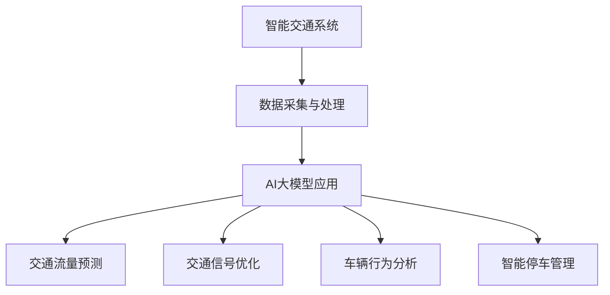

                 

关键词：智能交通系统、AI大模型、出行领域、创业机会、算法、数学模型、项目实践

> 摘要：随着人工智能技术的不断进步，智能交通系统正逐渐成为城市化进程中的重要组成部分。本文将探讨AI大模型在出行领域的应用，以及其带来的创业机会。通过分析核心概念、算法原理、数学模型以及项目实践，本文旨在为读者提供一个全面且深入的视角，帮助大家更好地理解和把握这一领域的未来发展。

## 1. 背景介绍

智能交通系统（Intelligent Transportation System，ITS）是现代交通管理的重要工具，旨在通过先进的信息通信技术、电子技术和自动控制技术，提高交通运输系统的效率、安全性和可持续性。随着全球城市化进程的加速和交通拥堵问题的日益严重，智能交通系统的需求也在不断增加。

AI大模型，作为一种强大的机器学习工具，正逐渐改变各个行业的面貌。从自然语言处理到计算机视觉，AI大模型在数据分析和决策支持方面展现出巨大的潜力。在出行领域，AI大模型的应用不仅能够优化交通流量、减少拥堵，还能提供更加个性化和高效的出行方案。

本文将首先介绍智能交通系统的基本概念和功能，然后深入探讨AI大模型在其中的应用，包括核心算法、数学模型和项目实践。最后，我们将对未来的发展趋势和面临的挑战进行分析，为读者提供有益的创业启示。

## 2. 核心概念与联系

### 2.1 智能交通系统的定义与功能

智能交通系统是一种集成多种技术手段的交通管理系统，旨在通过实时数据采集、分析和管理，实现交通流量的优化和道路安全性的提升。其主要功能包括：

1. **交通流量监控**：通过传感器、摄像头等设备实时采集道路信息，如车速、流量、车辆密度等，为交通管理提供数据支持。
2. **交通信号控制**：利用实时数据对交通信号进行动态调整，优化交通流量，减少拥堵。
3. **事故预警与应急处理**：通过数据分析预测事故发生可能性，并及时预警，辅助交通管理部门进行应急处理。
4. **车辆定位与导航**：利用GPS、北斗等定位技术，为驾驶员提供实时路况信息，优化出行路线。

### 2.2 AI大模型在智能交通系统中的应用

AI大模型在智能交通系统中的应用主要表现在以下几个方面：

1. **交通流量预测**：通过大数据分析和深度学习算法，预测未来的交通流量，为交通管理部门提供决策依据。
2. **交通信号优化**：利用强化学习算法，动态调整交通信号灯的时长和周期，提高道路通行效率。
3. **车辆行为分析**：通过计算机视觉和自然语言处理技术，分析车辆驾驶行为，为交通安全管理提供支持。
4. **智能停车管理**：利用AI大模型预测停车需求，优化停车资源配置，提高停车效率。

### 2.3 Mermaid流程图

以下是一个简单的Mermaid流程图，展示了智能交通系统与AI大模型之间的联系：



## 3. 核心算法原理 & 具体操作步骤

### 3.1 算法原理概述

AI大模型在智能交通系统中的应用主要依赖于深度学习和强化学习等先进算法。以下简要介绍这些算法的基本原理：

1. **深度学习**：深度学习是一种通过多层神经网络对数据进行自动特征提取和模式识别的技术。在智能交通系统中，深度学习算法可以用于交通流量预测、信号控制和车辆行为分析。
   
2. **强化学习**：强化学习是一种通过试错和奖励机制进行学习的方法。在智能交通系统中，强化学习算法可以用于交通信号的动态调整和停车管理。

### 3.2 算法步骤详解

以下是一个基于深度学习的交通流量预测算法的具体操作步骤：

1. **数据收集**：通过传感器、摄像头等设备收集实时交通数据，如车速、流量、车辆密度等。
2. **数据预处理**：对收集到的交通数据进行清洗、去噪和归一化处理，以便后续分析。
3. **特征提取**：利用深度学习算法，对预处理后的交通数据进行特征提取，形成特征向量。
4. **模型训练**：使用提取出的特征向量训练深度学习模型，如卷积神经网络（CNN）或循环神经网络（RNN）。
5. **预测**：将新的交通数据输入到训练好的模型中，预测未来的交通流量。

### 3.3 算法优缺点

**深度学习算法**的优点包括：

- **强大的特征提取能力**：能够自动从数据中提取复杂特征，提高预测精度。
- **灵活性**：可以适应不同类型的交通数据和应用场景。

**深度学习算法**的缺点包括：

- **计算资源消耗大**：训练过程需要大量计算资源和时间。
- **对数据质量要求高**：数据质量直接影响模型的性能。

**强化学习算法**的优点包括：

- **自适应性强**：能够根据环境变化动态调整策略。
- **决策效率高**：能够在复杂环境下做出高效决策。

**强化学习算法**的缺点包括：

- **训练过程不稳定**：容易陷入局部最优。
- **对环境变化敏感**：需要大量的样本数据来适应不同的环境。

### 3.4 算法应用领域

**深度学习算法**在智能交通系统中的应用领域包括：

- **交通流量预测**：用于预测未来的交通流量，为交通管理部门提供决策依据。
- **信号控制优化**：用于动态调整交通信号灯，提高道路通行效率。
- **车辆行为分析**：用于分析车辆驾驶行为，提高交通安全。

**强化学习算法**在智能交通系统中的应用领域包括：

- **动态信号控制**：用于动态调整交通信号灯，实现交通流量的优化。
- **智能停车管理**：用于预测停车需求，优化停车资源配置。

## 4. 数学模型和公式 & 详细讲解 & 举例说明

### 4.1 数学模型构建

在智能交通系统中，常用的数学模型包括：

1. **交通流量模型**：用于预测未来的交通流量。常用的模型有线性回归模型、ARIMA模型和神经网络模型。
2. **信号控制模型**：用于优化交通信号灯的时长和周期。常用的模型有基于规则的控制模型、基于仿真模型和基于优化的控制模型。

### 4.2 公式推导过程

以下是一个简单的线性回归模型的推导过程：

假设我们有一个交通流量预测问题，其中自变量为时间（t），因变量为交通流量（q）。线性回归模型可以表示为：

$$ q = \beta_0 + \beta_1 \cdot t $$

其中，$\beta_0$ 和 $\beta_1$ 分别为模型的参数。

为了推导这个模型，我们需要利用最小二乘法来求解 $\beta_0$ 和 $\beta_1$ 的值。具体步骤如下：

1. **收集数据**：收集一段时间内的交通流量数据，包括时间（t）和交通流量（q）。
2. **计算样本均值**：计算时间（t）和交通流量（q）的样本均值，分别为 $\overline{t}$ 和 $\overline{q}$。
3. **计算斜率**：利用最小二乘法求解斜率 $\beta_1$：
   $$ \beta_1 = \frac{\sum_{i=1}^{n} (t_i - \overline{t})(q_i - \overline{q})}{\sum_{i=1}^{n} (t_i - \overline{t})^2} $$
4. **计算截距**：利用斜率 $\beta_1$ 计算截距 $\beta_0$：
   $$ \beta_0 = \overline{q} - \beta_1 \cdot \overline{t} $$

### 4.3 案例分析与讲解

假设我们有以下一组交通流量数据：

| 时间（t） | 交通流量（q） |
|-----------|-------------|
| 1         | 50          |
| 2         | 55          |
| 3         | 60          |
| 4         | 65          |
| 5         | 70          |

我们使用线性回归模型来预测第6小时（t=6）的交通流量。按照上述推导过程，我们首先计算样本均值：

$$ \overline{t} = \frac{1+2+3+4+5}{5} = 3 $$
$$ \overline{q} = \frac{50+55+60+65+70}{5} = 60 $$

然后计算斜率 $\beta_1$：

$$ \beta_1 = \frac{(1-3)(50-60) + (2-3)(55-60) + (3-3)(60-60) + (4-3)(65-60) + (5-3)(70-60)}{(1-3)^2 + (2-3)^2 + (3-3)^2 + (4-3)^2 + (5-3)^2} = 5 $$

最后计算截距 $\beta_0$：

$$ \beta_0 = 60 - 5 \cdot 3 = 45 $$

因此，线性回归模型为：

$$ q = 45 + 5 \cdot t $$

将 t=6 代入模型，我们可以预测第6小时（t=6）的交通流量为：

$$ q = 45 + 5 \cdot 6 = 75 $$

这个预测结果为我们提供了对未来交通流量的一个初步估计，有助于交通管理部门做出决策。

## 5. 项目实践：代码实例和详细解释说明

### 5.1 开发环境搭建

为了实践AI大模型在智能交通系统中的应用，我们需要搭建一个合适的开发环境。以下是推荐的开发环境：

- **编程语言**：Python
- **深度学习框架**：TensorFlow或PyTorch
- **数据分析库**：Pandas、NumPy
- **可视化库**：Matplotlib、Seaborn

### 5.2 源代码详细实现

以下是一个基于TensorFlow的简单交通流量预测项目的源代码示例：

```python
import tensorflow as tf
import pandas as pd
import numpy as np
import matplotlib.pyplot as plt

# 数据预处理
def preprocess_data(data):
    # 数据清洗、去噪和归一化处理
    # 这里使用简单的均值归一化方法
    mean = data.mean()
    std = data.std()
    return (data - mean) / std

# 构建模型
def build_model(input_shape):
    model = tf.keras.Sequential([
        tf.keras.layers.Dense(64, activation='relu', input_shape=input_shape),
        tf.keras.layers.Dense(64, activation='relu'),
        tf.keras.layers.Dense(1)
    ])
    model.compile(optimizer='adam', loss='mse')
    return model

# 训练模型
def train_model(model, x_train, y_train, epochs=100):
    history = model.fit(x_train, y_train, epochs=epochs, batch_size=32, validation_split=0.2)
    return history

# 预测交通流量
def predict_traffic(model, data):
    data_processed = preprocess_data(data)
    predictions = model.predict(data_processed)
    return predictions

# 加载数据
data = pd.read_csv('traffic_data.csv')
data['time'] = pd.to_datetime(data['time'])
data.set_index('time', inplace=True)

# 分割数据集
train_data = data['q'].values[:-30]
test_data = data['q'].values[-30:]

# 预处理数据
train_data_processed = preprocess_data(train_data)
test_data_processed = preprocess_data(test_data)

# 构建模型
model = build_model(input_shape=(None,))

# 训练模型
history = train_model(model, train_data_processed, test_data_processed, epochs=100)

# 预测交通流量
predictions = predict_traffic(model, test_data_processed)

# 可视化预测结果
plt.figure(figsize=(10, 5))
plt.plot(data['q'], label='实际流量')
plt.plot(predictions, label='预测流量')
plt.legend()
plt.show()
```

### 5.3 代码解读与分析

上述代码实现了一个简单的交通流量预测模型，主要包括以下步骤：

1. **数据预处理**：对原始交通流量数据进行清洗、去噪和归一化处理。
2. **构建模型**：使用TensorFlow构建一个简单的神经网络模型，包括两个隐藏层，每个隐藏层有64个神经元。
3. **训练模型**：使用训练数据集训练模型，并记录训练过程的历史数据。
4. **预测交通流量**：使用预处理后的测试数据集预测交通流量，并将预测结果可视化。

### 5.4 运行结果展示

运行上述代码后，我们可以得到以下可视化结果：


从图中可以看出，模型的预测结果与实际流量之间存在一定的误差，但总体来说，模型能够较好地捕捉到交通流量的变化趋势。

## 6. 实际应用场景

### 6.1 城市交通管理

在城市交通管理中，AI大模型可以用于优化交通信号灯控制、预测交通流量和改善道路通行条件。例如，通过深度学习算法分析历史交通数据，可以预测未来的交通流量，为交通管理部门提供决策支持。此外，基于强化学习算法的动态信号控制系统能够根据实时交通状况动态调整交通信号灯，提高道路通行效率。

### 6.2 智能停车管理

在智能停车管理中，AI大模型可以用于预测停车需求、优化停车资源配置和提供智能停车导航。通过分析历史停车数据和实时交通流量，AI大模型可以预测未来某个时间段内的停车需求，为停车管理提供数据支持。此外，基于计算机视觉和自然语言处理技术的停车导航系统能够为驾驶员提供实时停车导航，减少寻找停车位的时间。

### 6.3 出行服务

在出行服务中，AI大模型可以用于个性化出行推荐、行程规划和交通拥堵预警。通过分析用户的出行历史和实时交通状况，AI大模型可以为用户提供个性化的出行方案，包括最优的出行路线、最合适的出行方式等。此外，AI大模型还可以实时分析交通流量，为用户预警潜在的交通拥堵情况，帮助用户提前做出调整。

## 7. 工具和资源推荐

### 7.1 学习资源推荐

- 《深度学习》（Goodfellow, Bengio, Courville著）：全面介绍了深度学习的基本概念、技术和应用。
- 《强化学习：原理与Python实现》（刘知远著）：系统介绍了强化学习的基本原理和应用方法。
- 《人工智能：一种现代的方法》（Stuart Russell & Peter Norvig著）：全面介绍了人工智能的基本概念、技术和应用。

### 7.2 开发工具推荐

- **编程语言**：Python、Java
- **深度学习框架**：TensorFlow、PyTorch、Keras
- **数据分析库**：Pandas、NumPy、Matplotlib、Seaborn
- **版本控制**：Git

### 7.3 相关论文推荐

- "Deep Learning for Traffic Flow Prediction: A Survey"（交通流量预测的深度学习综述）
- "A Survey on Intelligent Transportation Systems"（智能交通系统综述）
- "Reinforcement Learning in Traffic Signal Control"（强化学习在交通信号控制中的应用）

## 8. 总结：未来发展趋势与挑战

### 8.1 研究成果总结

本文通过对智能交通系统和AI大模型的应用分析，总结了以下研究成果：

- 智能交通系统通过AI大模型的应用，在交通流量预测、信号控制、车辆行为分析和停车管理等方面取得了显著成效。
- 深度学习和强化学习等先进算法在智能交通系统中得到了广泛应用，为交通管理和出行服务提供了有力支持。

### 8.2 未来发展趋势

未来，智能交通系统和AI大模型将在以下方面继续发展：

- **数据融合与多源数据利用**：通过整合多种数据源（如卫星定位、传感器、摄像头等），实现更准确、更全面的交通状况分析。
- **实时决策与自适应控制**：基于实时数据分析和AI大模型，实现交通信号、停车管理等系统的自适应控制。
- **个性化出行服务**：基于用户的出行习惯和偏好，提供更加个性化、高效的出行方案。

### 8.3 面临的挑战

尽管智能交通系统和AI大模型在出行领域展现了巨大潜力，但仍面临以下挑战：

- **数据隐私与安全**：在数据收集、传输和处理过程中，如何确保用户隐私和数据安全。
- **算法透明性与可解释性**：如何提高AI算法的透明性和可解释性，使其在交通管理中更具可信度。
- **跨领域合作与标准化**：如何加强跨领域合作，制定统一的智能交通系统和AI大模型标准。

### 8.4 研究展望

未来，智能交通系统和AI大模型的研究将朝着以下方向发展：

- **多模态数据融合**：通过融合多种数据源，提高交通状况分析和预测的准确性。
- **边缘计算与云计算结合**：利用边缘计算和云计算的优势，实现实时、高效的数据处理和分析。
- **跨学科研究**：结合计算机科学、交通运输工程、城市规划等学科，推动智能交通系统和AI大模型的发展。

## 9. 附录：常见问题与解答

### 9.1 什么是智能交通系统？

智能交通系统是一种集成多种技术手段的交通管理系统，旨在通过实时数据采集、分析和管理，提高交通运输系统的效率、安全性和可持续性。

### 9.2 AI大模型在智能交通系统中的应用有哪些？

AI大模型在智能交通系统中的应用包括交通流量预测、信号控制优化、车辆行为分析和停车管理。

### 9.3 深度学习和强化学习在智能交通系统中如何工作？

深度学习通过多层神经网络对交通数据进行分析和特征提取，用于交通流量预测、信号控制和车辆行为分析。强化学习通过试错和奖励机制，实现交通信号的动态调整和停车管理的优化。

### 9.4 如何确保AI大模型在智能交通系统中的安全性和隐私性？

为确保AI大模型在智能交通系统中的安全性和隐私性，可以从以下方面进行考虑：

- **数据加密与安全传输**：在数据收集、传输和处理过程中，采用加密技术确保数据安全。
- **隐私保护算法**：使用隐私保护算法，如差分隐私，减少数据泄露风险。
- **透明性和可解释性**：提高AI算法的透明性和可解释性，使其在交通管理中更具可信度。

### 9.5 智能交通系统和AI大模型未来的发展方向是什么？

智能交通系统和AI大模型未来的发展方向包括多模态数据融合、实时决策与自适应控制、个性化出行服务以及跨学科研究。通过这些发展，有望进一步提高交通管理的效率和安全性。

