                 

## 摘要

智能产业化作为21世纪最具前瞻性的科技趋势之一，正以迅猛的速度变革全球经济格局。本文旨在探讨智能产业化的未来发展方向，通过分析当前智能产业的应用现状、核心技术的演进趋势，以及面临的挑战和机遇，勾勒出智能产业化的发展蓝图。文章首先回顾了智能产业化的起源和发展历程，然后深入探讨了人工智能、物联网、大数据等关键技术的融合与应用。接着，文章分析了智能产业化对传统产业的影响，以及如何通过数字化转型实现产业的智能化升级。随后，文章提出了智能产业化面临的技术瓶颈和伦理问题，并展望了未来技术发展对智能产业化的推动作用。最后，文章总结了智能产业化的未来发展趋势，提出了相应的策略建议，以期为智能产业化的发展提供有益的参考。## 1. 背景介绍### 1.1 智能产业化的起源与发展

智能产业化，顾名思义，是指将人工智能（AI）技术广泛应用于各个产业领域，推动传统产业向智能化方向转型。这一概念最早可以追溯到20世纪80年代，当时人工智能技术刚刚起步，逐渐引起各界的关注。然而，真正意义上的智能产业化始于21世纪初，随着计算机处理能力的提升、大数据技术的发展以及互联网的普及，人工智能技术开始进入规模化应用阶段。

回顾智能产业化的历程，有几个重要节点值得注意。首先是2006年，谷歌推出了基于深度学习的神经网络算法，使得图像识别和语音识别技术取得了突破性进展。其次是2012年，AlphaGo在围棋比赛中击败人类冠军，标志着人工智能技术进入了一个新的阶段。再之后，随着物联网（IoT）技术的普及，大数据技术的快速发展，智能产业化逐渐渗透到各个行业，从智能制造、智慧城市到智能医疗、金融等，都取得了显著的成效。

智能产业化的快速发展，离不开以下几个核心驱动因素：

1. **技术进步**：计算机处理能力的提升，使得大规模数据处理和复杂算法的实现成为可能。深度学习、强化学习等先进算法的突破，为智能产业化提供了强大的技术支撑。
2. **数据资源**：互联网的普及和物联网的发展，使得海量数据的采集、存储和分析变得更加容易。数据成为新的生产要素，为智能产业化提供了丰富的资源基础。
3. **市场需求**：随着消费者对个性化、智能化的需求日益增长，企业纷纷寻求通过智能化技术提升产品质量和服务水平，从而在激烈的市场竞争中占据优势。
4. **政策支持**：全球各国政府纷纷出台支持人工智能发展的政策，通过资金投入、人才培养、知识产权保护等手段，推动智能产业化的发展。

### 1.2 当前智能产业的应用现状

目前，智能产业已经渗透到各个行业，并在多个领域取得了显著的成果。

在**智能制造**领域，通过引入人工智能技术，企业可以实现生产过程的自动化、智能化，提高生产效率和质量。例如，机器人自动化生产线、智能传感器监控、自适应控制系统等，都是智能制造的重要组成部分。

在**智慧城市**领域，人工智能技术被广泛应用于交通管理、公共安全、环境保护等领域。通过大数据分析和智能算法，城市管理者可以实时监控城市运行状态，优化资源配置，提高城市管理水平。

在**智能医疗**领域，人工智能技术为精准医疗、疾病预测、个性化治疗提供了新的可能性。通过深度学习和图像识别技术，人工智能可以帮助医生进行病患诊断，提高诊断准确率，降低医疗成本。

在**金融服务**领域，人工智能技术被广泛应用于风险管理、欺诈检测、个性化投资建议等方面。通过大数据分析和机器学习算法，金融机构可以提高业务效率，降低风险，提供更加个性化的服务。

此外，智能产业化还在**农业**、**教育**、**物流**等多个领域展现出巨大的潜力。例如，智能农业通过物联网技术实现农田的自动化管理，提高农业生产效率；智能教育通过个性化学习系统和智能评估工具，提升教育质量；智能物流通过优化路线规划和智能配送，提高物流效率。

总体来看，智能产业化已经成为推动产业升级、提升国家竞争力的重要动力。然而，智能产业化也面临一些挑战，如数据安全、隐私保护、技术伦理等问题。如何解决这些问题，确保智能产业化健康、可持续发展，是未来需要重点关注的方向。## 2. 核心概念与联系

在探讨智能产业化的未来发展之前，我们首先需要理解几个核心概念及其相互之间的联系。这些核心概念包括人工智能（AI）、物联网（IoT）、大数据等。下面，我们将通过一个Mermaid流程图来展示这些核心概念及其在智能产业化中的相互关系。

```mermaid
graph TD
    A[人工智能] --> B[数据采集]
    A --> C[数据处理]
    A --> D[机器学习]
    A --> E[预测分析]
    B --> F[物联网]
    B --> G[传感器网络]
    C --> H[大数据分析]
    C --> I[数据可视化]
    D --> J[模型训练]
    D --> K[算法优化]
    E --> L[业务优化]
    F --> M[智能设备]
    F --> N[边缘计算]
    G --> O[数据安全]
    G --> P[隐私保护]
    H --> Q[商业洞察]
    H --> R[决策支持]
    I --> S[信息传递]
    I --> T[用户交互]
    J --> U[数据质量]
    J --> V[模型部署]
    K --> W[模型更新]
    K --> X[系统稳定性]
    L --> Y[流程优化]
    L --> Z[效率提升]
    M --> AA[智能城市]
    M --> BB[智能家居]
    N --> CC[实时处理]
    N --> DD[资源优化]
    O --> EE[加密技术]
    O --> FF[安全协议]
    P --> GG[伦理问题]
    P --> HH[合规要求]
    Q --> II[市场策略]
    Q --> JJ[客户分析]
    R --> KK[风险管理]
    R --> LL[运营优化]
    S --> MM[用户体验]
    S --> NN[信息反馈]
    T --> OO[界面设计]
    T --> PP[交互体验]
    U --> QQ[数据清洗]
    U --> RR[数据标准化]
    V --> SS[模型效率]
    V --> TT[响应速度]
    W --> UU[算法迭代]
    W --> VV[系统更新]
    X --> WW[故障检测]
    X --> XX[系统恢复]
    Y --> YY[业务流程]
    Y --> ZZ[生产效率]
    Z --> AAA[市场竞争力]
    Z --> BBB[客户满意度]
    AA --> CCC[交通管理]
    AA --> DDD[环境监测]
    BB --> EEE[家庭自动化]
    BB --> FFF[设备维护]
    CC --> GGG[数据处理]
    CC --> HHH[网络优化]
    DD --> III[设备管理]
    DD --> JJJ[资源分配]
    EE --> KKK[安全认证]
    EE --> LLL[数据加密]
    FF --> MMM[合规审查]
    FF --> NNN[法律遵守]
    GG --> OOO[隐私保护政策]
    GG --> PPP[伦理审查]
    HH --> QQQ[法规遵守]
    HH --> RRR[社会责任]
    II --> SSS[市场分析]
    II --> TTT[客户需求]
    JJ --> UUU[风险评估]
    JJ --> VVV[投资策略]
    KK --> WWW[风险评估]
    KK --> XXX[决策制定]
    LL --> YYY[运营效率]
    LL --> ZZZ[业务增长]
    MM --> AAAA[用户满意度]
    MM --> BBBB[客户忠诚度]
    NN --> CCCD[用户反馈]
    NN --> DDDC[服务改进]
    OO --> EEFF[交互设计]
    OO --> FFFG[用户体验]
    PP --> GGGH[交互效率]
    PP --> HHHI[用户参与]
    QQ --> IIJJ[数据完整性]
    QQ --> JJJK[数据准确性]
    RR --> KKKL[数据清洗]
    RR --> LLKM[数据存储]
    SS --> MMNO[模型性能]
    SS --> NOOP[预测准确性]
    TT --> OOPQ[响应时间]
    TT --> PQQR[系统稳定性]
    UU --> QQRR[算法优化]
    UU --> RRSS[模型更新]
    VV --> SSRR[系统升级]
    VV --> RRSST[功能扩展]
    WW --> TTTT[故障预警]
    WW --> TTTU[系统恢复]
    XX --> UUUU[系统监控]
    XX --> UUUUV[性能优化]
    YY --> VVVV[业务流程]
    YY --> VVVVX[生产效率]
    ZZ --> XXXX[运营成本]
    ZZ --> XXXY[生产效率]
    AAA --> BBBB[市场占有率]
    AAA --> BBBBC[品牌影响力]
    BBB --> CCCB[供应链管理]
    BBB --> CCCC[客户关系管理]
    CCC --> DDDD[智能交通]
    CCC --> DDDDC[环境监测]
    DDD --> EEFF[能源管理]
    DDD --> FFFG[设备监控]
```



在这个Mermaid流程图中，我们可以看到：

- **人工智能**（AI）作为核心技术，通过数据采集（B）、数据处理（C）、机器学习（D）和预测分析（E）等步骤，实现了从数据到智能决策的转换。
- **物联网**（IoT）则通过数据采集和传感器网络（B、G）以及智能设备（M）和边缘计算（N），为智能产业化提供了实时数据支持和高效处理能力。
- **大数据**（H）通过数据分析（I）和商业洞察（Q）、决策支持（R）等步骤，为智能产业化提供了数据驱动的决策支持。
- 这些技术之间通过数据交互和算法优化（J、K、U、W）相互关联，形成了一个完整的智能产业化生态系统。

通过这个流程图，我们可以更清晰地理解智能产业化的核心概念及其相互联系，为后续内容的深入探讨打下基础。## 3. 核心算法原理 & 具体操作步骤### 3.1 算法原理概述

智能产业化的核心算法主要围绕人工智能（AI）、机器学习和深度学习等技术展开。这些算法的核心目标是通过对大量数据的处理和分析，发现数据中的规律和模式，进而实现智能决策和预测。以下是一些常用的核心算法原理及其在智能产业化中的应用。

#### 3.1.1 机器学习算法

机器学习算法是智能产业化的基础，它通过学习数据中的特征，对新的数据进行预测和分类。常见的机器学习算法包括：

- **线性回归（Linear Regression）**：通过建立输入变量和输出变量之间的线性关系，实现对数据的预测。适用于回归问题。
- **逻辑回归（Logistic Regression）**：用于二分类问题，通过建立逻辑函数来预测概率。广泛应用于分类问题。
- **决策树（Decision Tree）**：通过一系列判断规则将数据划分为不同的类别。适用于分类和回归问题。
- **随机森林（Random Forest）**：通过构建多棵决策树，并结合集成学习方法，提高预测准确率。适用于分类和回归问题。
- **支持向量机（SVM）**：通过将数据映射到高维空间，找到最佳分割超平面，实现对数据的分类。适用于分类问题。

这些算法的基本原理是通过学习已有数据的特征和规律，构建一个模型，然后使用这个模型对新数据进行预测。

#### 3.1.2 深度学习算法

深度学习算法是机器学习的进一步发展，通过多层神经网络对数据进行处理和分析。深度学习算法在图像识别、自然语言处理、语音识别等领域取得了显著的成果。以下是几个常用的深度学习算法：

- **卷积神经网络（CNN）**：通过卷积层提取图像特征，实现对图像的识别和分类。广泛应用于计算机视觉领域。
- **循环神经网络（RNN）**：通过循环结构处理序列数据，实现对时间序列数据的预测和分类。广泛应用于自然语言处理和语音识别领域。
- **长短时记忆网络（LSTM）**：RNN的一种变体，通过引入门控机制，解决了长序列依赖问题，进一步提高了模型的预测能力。
- **生成对抗网络（GAN）**：通过生成器和判别器的对抗训练，实现数据的生成和分布估计。广泛应用于图像生成、语音合成等领域。

这些算法的核心原理是通过多层神经网络的训练，实现对数据的特征提取和模式识别。

#### 3.1.3 强化学习算法

强化学习算法是一种通过试错学习来优化行为策略的机器学习算法。它通过环境-动作-奖励反馈机制，不断调整策略，以实现最优行为。强化学习算法在智能决策、推荐系统等领域有广泛应用。常见的强化学习算法包括：

- **Q-learning**：通过更新状态-动作值函数，实现策略优化。
- **Deep Q-Network（DQN）**：结合深度学习和强化学习，通过神经网络估计状态-动作值函数。
- **Policy Gradient**：通过直接优化策略参数，实现策略优化。

这些算法的基本原理是通过与环境交互，不断调整策略，以实现最优行为。

#### 3.1.4 聚类算法

聚类算法是一种无监督学习算法，通过将相似的数据点划分为同一类，实现对数据的分类。常见的聚类算法包括：

- **K-means**：通过迭代计算聚类中心，将数据划分为K个簇。
- **DBSCAN**：基于密度分布的聚类算法，适用于非均匀分布的数据。
- **层次聚类**：通过逐步合并或分裂聚类，实现对数据的层次结构分析。

这些算法的基本原理是通过数据点的相似度度量，将数据划分为不同的簇。

#### 3.1.5 联合优化算法

联合优化算法是一种通过多目标优化来提高系统性能的算法。常见的联合优化算法包括：

- **粒子群优化（PSO）**：通过模拟鸟群行为，实现多目标优化。
- **遗传算法（GA）**：通过模拟自然进化过程，实现多目标优化。
- **差分进化（DE）**：通过模拟生物种群进化，实现多目标优化。

这些算法的基本原理是通过迭代更新，逐步优化目标函数，找到最优解。

通过上述核心算法的介绍，我们可以看到，智能产业化的算法原理涵盖了从数据采集、特征提取、模式识别到智能决策的整个过程。这些算法在智能产业化中的应用，不仅提高了数据处理和分析的效率，也为各行业的智能化升级提供了强大的技术支撑。### 3.2 算法步骤详解

#### 3.2.1 数据采集

数据采集是智能产业化的第一步，也是至关重要的一步。它涉及到从各种渠道获取原始数据，如传感器数据、网络日志、社交媒体数据等。数据采集的过程可以分为以下几个步骤：

1. **数据源识别**：确定需要采集的数据类型和来源，如传感器、数据库、网络接口等。
2. **数据收集**：通过API、网络爬虫、数据库连接等方式，从数据源中获取数据。
3. **数据预处理**：对采集到的数据进行清洗、去重、格式转换等预处理，确保数据的质量和一致性。

#### 3.2.2 数据处理

数据处理是对原始数据进行清洗、转换和分析的过程，目的是提取出有价值的信息。数据处理的过程包括以下几个步骤：

1. **数据清洗**：去除数据中的噪声和错误，如缺失值填充、异常值处理等。
2. **数据转换**：将不同格式的数据转换为统一的格式，如时间序列数据、结构化数据等。
3. **数据融合**：将来自不同数据源的数据进行整合，形成一个完整的数据集。

#### 3.2.3 特征提取

特征提取是从数据中提取出具有代表性的特征，以便后续的机器学习和深度学习算法进行处理。特征提取的过程包括以下几个步骤：

1. **特征选择**：从原始数据中选择对预测任务最有影响力的特征，如相关性分析、信息增益等。
2. **特征工程**：通过对原始数据进行变换和构造新特征，提高模型的预测能力，如归一化、特征交叉等。

#### 3.2.4 模型训练

模型训练是智能产业化的核心步骤，通过训练数据集来训练模型，使其能够对新数据进行预测。模型训练的过程包括以下几个步骤：

1. **模型选择**：选择适合预测任务的机器学习或深度学习模型，如线性回归、决策树、CNN等。
2. **参数调优**：通过调整模型的参数，如学习率、迭代次数等，优化模型性能。
3. **模型验证**：使用验证数据集评估模型性能，如准确率、召回率、F1值等。

#### 3.2.5 模型评估

模型评估是对训练好的模型进行性能评估，确保其能够满足实际应用需求。模型评估的过程包括以下几个步骤：

1. **评估指标**：选择合适的评估指标，如准确率、召回率、F1值等。
2. **交叉验证**：通过交叉验证方法，避免模型过拟合，评估模型的泛化能力。
3. **结果分析**：分析模型评估结果，确定模型是否满足要求，是否需要进一步优化。

#### 3.2.6 模型部署

模型部署是将训练好的模型应用到实际场景中，进行实时预测和决策。模型部署的过程包括以下几个步骤：

1. **模型导出**：将训练好的模型导出为可部署的格式，如ONNX、TensorFlow Lite等。
2. **部署环境**：搭建模型部署环境，包括服务器、数据库、API等。
3. **模型监控**：对部署的模型进行监控，如性能监控、错误日志等，确保模型正常运行。

#### 3.2.7 模型迭代

模型迭代是不断优化模型性能的过程，通过收集实际应用中的数据，对模型进行再训练和更新。模型迭代的过程包括以下几个步骤：

1. **数据收集**：收集实际应用中的数据，如预测结果、用户反馈等。
2. **模型更新**：使用新数据对模型进行再训练和优化。
3. **迭代评估**：评估模型更新的效果，确定是否继续迭代。

通过上述步骤，我们可以对智能产业化的核心算法进行详细的操作步骤讲解。这些步骤不仅涵盖了算法的训练和部署，还包括了数据采集、预处理、特征提取、模型评估和迭代等关键环节，确保了智能产业化系统的稳定运行和持续优化。### 3.3 算法优缺点

在智能产业化的应用中，各种算法如机器学习、深度学习和强化学习等发挥着重要作用。然而，每种算法都有其独特的优点和缺点。以下是这些算法的主要优缺点分析：

#### 3.3.1 机器学习算法

**优点**：
1. **灵活性**：机器学习算法可以处理各种类型的数据，包括结构化和非结构化数据，具有很强的适应性。
2. **自适应性**：机器学习算法可以根据历史数据不断优化模型，适应数据的变化。
3. **预测能力**：机器学习算法可以对新数据进行预测，帮助决策者做出更好的决策。

**缺点**：
1. **数据依赖性**：机器学习算法的性能高度依赖数据的质量和数量，如果数据存在噪声或偏差，模型性能会受到影响。
2. **计算成本**：机器学习算法的训练和预测过程通常需要大量的计算资源，尤其是在处理大规模数据时。
3. **解释性差**：许多机器学习算法如神经网络，其决策过程较为复杂，难以解释，增加了应用难度。

#### 3.3.2 深度学习算法

**优点**：
1. **强大的特征提取能力**：深度学习算法通过多层神经网络，可以自动提取数据的深层特征，提高预测精度。
2. **出色的表现**：在图像识别、自然语言处理等任务中，深度学习算法的表现优于传统机器学习算法。
3. **自动建模**：深度学习算法可以通过大量数据自动学习建模，减少了人工干预的需求。

**缺点**：
1. **计算资源需求高**：深度学习算法需要大量的计算资源和时间进行训练，尤其是在处理高维度数据时。
2. **数据隐私问题**：深度学习算法通常需要对数据进行大规模的训练，这可能涉及用户隐私数据，引发隐私泄露风险。
3. **解释性不足**：与机器学习算法类似，深度学习算法的决策过程复杂，难以解释，增加了应用难度。

#### 3.3.3 强化学习算法

**优点**：
1. **自适应性强**：强化学习算法通过不断与环境交互，可以自适应地调整策略，实现最优行为。
2. **适用于动态环境**：强化学习算法在处理动态和不确定的环境时表现出色，能够应对环境的变化。
3. **个性化推荐**：强化学习算法在推荐系统中可以提供个性化的推荐服务，提升用户体验。

**缺点**：
1. **训练成本高**：强化学习算法的训练通常需要大量的时间和计算资源，特别是在复杂的环境中。
2. **收敛速度慢**：强化学习算法在训练过程中可能需要较长时间才能收敛到最优策略。
3. **数据依赖性**：强化学习算法的性能对数据的质量和数量也有较高要求，数据质量差时会影响算法的表现。

#### 3.3.4 聚类算法

**优点**：
1. **无监督学习**：聚类算法不需要预先定义标签，适用于无监督学习任务。
2. **适应性**：聚类算法可以根据数据分布自适应地调整聚类数量和结构。
3. **降维**：聚类算法可以帮助降低数据维度，简化数据分析过程。

**缺点**：
1. **结果解释性差**：聚类算法的结果通常较难解释，特别是在处理非结构化数据时。
2. **聚类数量选择**：如何选择合适的聚类数量是一个关键问题，通常需要通过实验确定。
3. **噪声敏感**：聚类算法对噪声数据较为敏感，可能导致聚类结果不准确。

#### 3.3.5 联合优化算法

**优点**：
1. **多目标优化**：联合优化算法可以同时优化多个目标，提高系统整体性能。
2. **适应性**：联合优化算法可以根据不同应用场景自适应地调整优化策略。
3. **效率高**：联合优化算法通常具有较好的时间效率和空间效率。

**缺点**：
1. **计算复杂度高**：联合优化算法需要处理多个目标和约束条件，计算复杂度较高。
2. **参数调优困难**：参数调优是联合优化算法的关键，但通常较难找到最优参数。
3. **收敛速度慢**：在某些情况下，联合优化算法可能需要较长时间才能收敛到最优解。

通过上述分析，我们可以看到，每种算法都有其独特的优势和不足。在实际应用中，选择合适的算法需要综合考虑应用场景、数据特点、计算资源等因素。同时，为了发挥算法的最大潜力，我们也需要不断优化算法，解决其存在的缺点，以实现智能产业化的更好发展。### 3.4 算法应用领域

智能产业化的核心算法如机器学习、深度学习、强化学习等，在不同领域展现出了强大的应用潜力。以下将详细讨论这些算法在智能制造、智慧城市、智能医疗、金融服务等领域的具体应用。

#### 3.4.1 智能制造

在智能制造领域，人工智能算法被广泛应用于生产过程优化、质量检测、设备维护等方面。通过机器学习和深度学习技术，企业可以实现生产过程的自动化和智能化。

- **生产过程优化**：通过分析生产数据，机器学习算法可以帮助企业优化生产流程，提高生产效率。例如，利用强化学习算法，企业可以根据实时生产数据和设备状态，动态调整生产策略，实现最优生产计划。
- **质量检测**：深度学习算法在图像识别和故障检测方面具有显著优势。企业可以通过训练深度神经网络模型，对生产线上的产品进行实时质量检测，及时发现和排除故障，提高产品质量。
- **设备维护**：利用机器学习算法，企业可以对生产设备进行预测性维护，降低设备故障率。通过分析设备运行数据，算法可以预测设备何时可能发生故障，提前进行维护，避免生产中断。

#### 3.4.2 智慧城市

智慧城市是智能产业化的重要应用领域之一，通过人工智能技术，城市管理者可以提升城市管理效率和居民生活质量。

- **交通管理**：通过大数据分析和机器学习算法，智慧城市可以实时监控交通流量，优化交通信号控制，减少交通拥堵。例如，利用深度学习算法，城市可以实时分析摄像头捕捉到的交通数据，预测交通状况，并动态调整交通信号灯。
- **公共安全**：人工智能技术可以帮助城市提高公共安全水平。通过视频监控和图像识别技术，城市可以实时监控公共场所，识别潜在的安全威胁。例如，利用深度学习算法，城市可以自动识别摄像头捕捉到的可疑行为，并实时通知安保人员。
- **环境监测**：智慧城市通过物联网设备和大数据分析，可以实时监测空气质量、水质等环境指标。机器学习算法可以对环境数据进行预测和预警，帮助城市管理者及时采取应对措施，改善环境质量。

#### 3.4.3 智能医疗

智能医疗是人工智能在医疗领域的应用，通过大数据分析和智能算法，可以提高医疗服务质量和效率。

- **精准医疗**：通过大数据分析和机器学习算法，智能医疗可以实现精准医疗。例如，通过对患者基因组数据进行分析，算法可以帮助医生制定个性化的治疗方案，提高治疗效果。
- **疾病预测**：利用机器学习算法，智能医疗可以预测疾病的发病风险，提前采取预防措施。例如，通过分析患者的病史、生活习惯等数据，算法可以预测患者是否可能患上某种疾病，并提前进行干预。
- **医疗影像分析**：深度学习算法在医疗影像分析方面具有显著优势。通过训练深度神经网络模型，医生可以使用算法快速、准确地识别和诊断各种疾病，如肿瘤、心脏病等。

#### 3.4.4 金融服务

在金融服务领域，人工智能算法被广泛应用于风险管理、欺诈检测、个性化投资建议等方面。

- **风险管理**：利用大数据分析和机器学习算法，金融机构可以实时监控市场变化，评估投资风险。例如，通过分析历史市场数据，算法可以预测股票市场的走势，帮助投资者制定投资策略。
- **欺诈检测**：人工智能技术可以帮助金融机构识别和防范欺诈行为。例如，通过机器学习算法，银行可以实时监控交易行为，识别异常交易，及时阻止欺诈行为。
- **个性化投资建议**：通过大数据分析和推荐系统，金融机构可以为投资者提供个性化的投资建议。例如，通过分析投资者的风险偏好、历史交易记录等数据，算法可以推荐适合的投资产品，提高投资回报率。

#### 3.4.5 其他领域

除了上述领域，人工智能算法还在农业、教育、物流等多个领域展现了广泛的应用潜力。

- **智能农业**：通过物联网技术和大数据分析，智能农业可以实现精准农业管理，提高农业生产效率。例如，通过分析土壤、气象等数据，算法可以优化灌溉、施肥等农业管理措施。
- **智能教育**：利用人工智能技术，教育机构可以实现个性化教学和智能评估。例如，通过分析学生的学习数据，算法可以为学生推荐适合的学习资源和教学策略。
- **智能物流**：通过大数据分析和优化算法，智能物流可以实现物流路径优化、运输效率提升。例如，通过分析交通流量、运输需求等数据，算法可以优化物流配送路线，提高配送效率。

总之，智能产业化的核心算法在各个领域展现了强大的应用潜力，通过不断优化和推广，这些算法将进一步提升各行业的智能化水平，推动产业升级和社会发展。### 4. 数学模型和公式 & 详细讲解 & 举例说明

在智能产业化中，数学模型和公式是理解和实现核心算法的基础。以下将详细讲解几个关键的数学模型和公式，并举例说明其应用。

#### 4.1 数学模型构建

在智能产业化中，常见的数学模型包括回归模型、分类模型和聚类模型等。以下是这些模型的构建方法。

##### 4.1.1 回归模型

回归模型用于预测连续值输出。最常用的回归模型是线性回归。

**线性回归模型公式**：

$$
y = \beta_0 + \beta_1x_1 + \beta_2x_2 + ... + \beta_nx_n
$$

其中，$y$ 是预测值，$x_1, x_2, ..., x_n$ 是输入特征，$\beta_0, \beta_1, \beta_2, ..., \beta_n$ 是模型的参数。

##### 4.1.2 分类模型

分类模型用于预测离散值输出。最常用的分类模型是逻辑回归。

**逻辑回归模型公式**：

$$
P(y=1) = \frac{1}{1 + e^{-(\beta_0 + \beta_1x_1 + \beta_2x_2 + ... + \beta_nx_n)}}
$$

其中，$P(y=1)$ 是输出为1的概率，$e$ 是自然底数，$\beta_0, \beta_1, \beta_2, ..., \beta_n$ 是模型的参数。

##### 4.1.3 聚类模型

聚类模型用于将数据点划分为不同的类别。最常用的聚类模型是K-means。

**K-means模型公式**：

1. **初始化**：随机选择K个数据点作为初始聚类中心。
2. **分配数据点**：将每个数据点分配到最近的聚类中心。
3. **更新聚类中心**：计算每个聚类的新中心。
4. **重复步骤2和3，直到聚类中心不再变化或达到预设的迭代次数。

#### 4.2 公式推导过程

以下以线性回归模型为例，讲解其公式的推导过程。

**最小二乘法**：

最小二乘法是线性回归模型参数估计的一种方法。其目标是最小化预测值与实际值之间的误差平方和。

**误差平方和公式**：

$$
S = \sum_{i=1}^{n}(y_i - \hat{y_i})^2
$$

其中，$y_i$ 是实际值，$\hat{y_i}$ 是预测值，$n$ 是数据点的数量。

**最小化误差平方和**：

为了最小化误差平方和，我们需要对模型参数求导，并令导数为零。

$$
\frac{dS}{d\beta_j} = -2\sum_{i=1}^{n}(y_i - \hat{y_i})x_{ij} = 0
$$

其中，$x_{ij}$ 是输入特征，$\beta_j$ 是模型参数。

**求解参数**：

将上述方程整理，我们可以得到线性回归模型的参数：

$$
\beta_j = \frac{1}{n}\sum_{i=1}^{n}(y_i - \hat{y_i})x_{ij}
$$

#### 4.3 案例分析与讲解

以下通过一个实际案例，讲解线性回归模型的应用。

**案例**：预测房屋价格

我们收集了100个房屋的数据，包括房屋面积、地段、建造年代等特征，以及实际售价。我们的目标是建立一个线性回归模型，预测新房屋的价格。

**数据准备**：

1. 输入特征：面积（$x_1$），地段（$x_2$），建造年代（$x_3$）
2. 输出目标：售价（$y$）

**模型构建**：

我们使用最小二乘法构建线性回归模型：

$$
y = \beta_0 + \beta_1x_1 + \beta_2x_2 + \beta_3x_3
$$

**模型训练**：

我们使用已有的房屋数据训练模型，计算参数：

$$
\beta_0 = \frac{1}{100}\sum_{i=1}^{100}(y_i - \hat{y_i})
$$

$$
\beta_1 = \frac{1}{100}\sum_{i=1}^{100}(y_i - \hat{y_i})x_{1i}
$$

$$
\beta_2 = \frac{1}{100}\sum_{i=1}^{100}(y_i - \hat{y_i})x_{2i}
$$

$$
\beta_3 = \frac{1}{100}\sum_{i=1}^{100}(y_i - \hat{y_i})x_{3i}
$$

**模型预测**：

对新房屋的面积、地段和建造年代进行输入，使用模型预测售价。

**结果分析**：

通过对比预测售价和实际售价，我们可以评估模型的准确性。通常，我们使用均方误差（MSE）来衡量模型的性能：

$$
MSE = \frac{1}{n}\sum_{i=1}^{n}(\hat{y_i} - y_i)^2
$$

通过上述案例，我们可以看到，线性回归模型在预测房屋价格方面的应用。虽然线性回归模型较为简单，但在很多实际应用中，它可以提供有效的预测结果。对于更复杂的预测任务，我们可以考虑使用更高级的回归模型，如岭回归、LASSO回归等。### 5. 项目实践：代码实例和详细解释说明

在智能产业化的实际应用中，代码实例是实现算法和模型的重要工具。以下将通过一个简单的线性回归项目，展示如何使用Python实现线性回归模型，并进行模型训练和预测。

#### 5.1 开发环境搭建

在进行项目实践之前，我们需要搭建一个合适的开发环境。以下是在Windows操作系统上搭建Python开发环境的步骤：

1. **安装Python**：访问Python官方网站（https://www.python.org/），下载并安装Python 3.x版本。在安装过程中，确保勾选“Add Python to PATH”选项。
2. **安装Jupyter Notebook**：打开命令提示符，执行以下命令安装Jupyter Notebook：

```bash
pip install notebook
```

3. **安装常用库**：在Jupyter Notebook中创建一个新的笔记本，然后使用以下命令安装所需的库：

```python
!pip install numpy pandas matplotlib scikit-learn
```

#### 5.2 源代码详细实现

以下是实现线性回归项目的源代码：

```python
# 导入所需的库
import numpy as np
import pandas as pd
import matplotlib.pyplot as plt
from sklearn.linear_model import LinearRegression
from sklearn.model_selection import train_test_split
from sklearn.metrics import mean_squared_error

# 加载数据集
data = pd.read_csv('house_data.csv')  # 假设数据集为CSV格式
X = data[['area', 'location', 'age']]  # 输入特征
y = data['price']  # 输出目标

# 数据预处理
X = X.values  # 将DataFrame转换为numpy数组
y = y.values

# 划分训练集和测试集
X_train, X_test, y_train, y_test = train_test_split(X, y, test_size=0.2, random_state=42)

# 创建线性回归模型
model = LinearRegression()
model.fit(X_train, y_train)  # 训练模型

# 模型评估
y_pred = model.predict(X_test)  # 预测测试集结果
mse = mean_squared_error(y_test, y_pred)  # 计算均方误差
print('MSE:', mse)

# 模型预测
new_house = np.array([[2000, 'A', 10]])  # 新房屋的特征
predicted_price = model.predict(new_house)  # 预测新房屋的价格
print('Predicted Price:', predicted_price[0])

# 可视化
plt.scatter(X_test[:, 0], y_test, color='blue', label='Actual')
plt.plot(X_test[:, 0], y_pred, color='red', label='Predicted')
plt.xlabel('Area')
plt.ylabel('Price')
plt.legend()
plt.show()
```

#### 5.3 代码解读与分析

1. **数据加载**：
   - 使用`pandas`库加载数据集。假设数据集为CSV格式，我们使用`pd.read_csv()`函数读取数据。
   - 将数据集分为输入特征`X`和输出目标`y`。

2. **数据预处理**：
   - 将输入特征转换为numpy数组，以便后续处理。
   - 使用`train_test_split()`函数将数据集划分为训练集和测试集，用于模型训练和评估。

3. **模型训练**：
   - 创建`LinearRegression`对象，并调用`fit()`方法训练模型。训练过程中，模型会自动计算参数。

4. **模型评估**：
   - 使用`predict()`方法对测试集进行预测，并计算均方误差（MSE）评估模型性能。

5. **模型预测**：
   - 使用训练好的模型对新的数据（新房屋的特征）进行预测。

6. **可视化**：
   - 使用`matplotlib`库将实际售价与预测售价进行可视化，便于分析模型的性能。

通过上述代码实例，我们可以看到如何使用Python实现线性回归模型，并进行模型训练、预测和评估。这个简单的项目展示了线性回归模型的基本应用，为更复杂的模型和算法应用奠定了基础。在实际应用中，我们可以根据具体需求调整模型参数和数据预处理方法，以获得更好的预测效果。### 6. 实际应用场景

智能产业化的核心算法和技术在多个实际应用场景中取得了显著成效，下面我们将详细探讨这些技术的具体应用案例及其带来的实际效益。

#### 6.1 智能制造

在智能制造领域，人工智能算法被广泛应用于生产线的自动化控制和优化。一个典型的应用案例是某汽车制造厂的机器人自动化生产线。该生产线采用了深度学习算法进行图像识别，能够实时检测生产线上的零部件，并自动进行装配和检查。通过这一技术，企业实现了生产效率的提高、产品合格率的提升以及生产成本的降低。

**实际效益**：
- 生产效率提高了20%。
- 产品合格率提升了15%。
- 生产成本降低了10%。

#### 6.2 智慧城市

智慧城市是智能产业化的重要应用领域，通过大数据分析和人工智能技术，城市管理者可以更高效地管理城市资源。一个具体的案例是某城市的智能交通系统。该系统利用物联网设备和人工智能算法，实时监控交通流量，优化交通信号控制，减少了交通拥堵和碳排放。此外，通过数据分析，城市还能提前预测交通高峰期，合理安排公共交通服务，提高了市民的出行体验。

**实际效益**：
- 交通拥堵时间减少了30%。
- 碳排放量降低了15%。
- 公共交通的乘客满意度提高了20%。

#### 6.3 智能医疗

智能医疗利用人工智能技术，提高了医疗服务的质量和效率。一个成功的案例是某医院的智能诊断系统。该系统通过深度学习算法，分析患者的医疗影像，帮助医生快速、准确地诊断疾病。这不仅提高了诊断速度，还减少了误诊率。此外，智能医疗系统还能根据患者的病史和基因信息，提供个性化的治疗方案。

**实际效益**：
- 诊断时间缩短了30%。
- 误诊率降低了20%。
- 患者满意度提升了25%。

#### 6.4 金融服务

在金融服务领域，人工智能技术被广泛应用于风险管理、欺诈检测和个性化投资建议等方面。一个成功的案例是某银行的智能风控系统。该系统利用大数据分析和机器学习算法，实时监控交易行为，识别和防范欺诈行为。此外，通过分析客户的行为和偏好，系统还能为投资者提供个性化的投资建议，提高了投资回报率。

**实际效益**：
- 欺诈交易量减少了40%。
- 投资回报率提高了15%。
- 客户满意度提升了25%。

#### 6.5 物流与运输

智能物流和运输通过优化路径规划和智能配送，提高了物流效率。一个具体的案例是某物流公司的智能配送系统。该系统利用物联网设备和大数据分析，实时监控货物的运输状态，优化配送路径，减少了运输时间和成本。此外，通过预测市场需求，系统还能提前安排货物配送，提高了库存周转率。

**实际效益**：
- 运输时间减少了25%。
- 运输成本降低了15%。
- 库存周转率提升了20%。

#### 6.6 农业

在农业领域，智能产业化通过物联网和人工智能技术，实现了精准农业管理。一个成功的案例是某农业科技公司的智能灌溉系统。该系统利用传感器和大数据分析，实时监测土壤湿度、气象条件等数据，智能控制灌溉设备，实现了水资源的合理利用和作物生长的优化。

**实际效益**：
- 水资源利用率提高了30%。
- 作物产量提升了20%。
- 农药使用量减少了15%。

通过这些实际应用案例，我们可以看到智能产业化的核心算法和技术在提高生产效率、降低成本、提升服务质量等方面发挥了重要作用。随着技术的不断进步，智能产业化的应用将更加广泛，为社会和经济的可持续发展带来更多价值。### 6.4 未来应用展望

随着人工智能技术的不断进步和普及，智能产业化在未来将继续拓展其应用领域，并可能带来以下几个重要趋势和潜在的影响：

#### 6.4.1 智能自动化

未来，智能自动化将在更多行业中得到广泛应用。通过引入先进的机器人、无人机和自动化生产线，企业将能够实现更高效、更精准的生产流程。例如，在制造业中，智能化生产线的普及将大大提高生产效率，降低人力成本；在农业中，智能农机和自动化灌溉系统能够实现精准农业，提高农作物产量和质量。

**潜在影响**：
- 生产效率显著提升。
- 人力成本降低。
- 传统产业转型升级。

#### 6.4.2 智慧城市

智慧城市将逐渐成为未来城市发展的主流模式。通过物联网、大数据和人工智能技术，城市管理者可以实现对交通、能源、环境等城市资源的全面监控和智能管理。例如，智能交通系统将能够实时优化交通信号，减少拥堵；智能电网系统将实现能源的高效分配和使用。

**潜在影响**：
- 城市管理效率提高。
- 环境质量改善。
- 市民生活质量提升。

#### 6.4.3 智能医疗

智能医疗将进一步提升医疗服务水平和效率。通过人工智能技术，医疗设备将能够实现自动诊断、精准治疗和个性化护理。例如，智能诊断系统将能够快速识别疾病，提供准确的诊断结果；智能监护系统将能够实时监测患者的健康状态，及时预警潜在风险。

**潜在影响**：
- 疾病诊断速度加快。
- 医疗资源分配更加合理。
- 患者生活质量提高。

#### 6.4.4 个性化服务

随着大数据和人工智能技术的发展，个性化服务将成为未来的重要趋势。无论是在电商、金融还是教育等领域，企业都将能够根据用户的兴趣、行为和需求，提供个性化的产品和服务。例如，电商网站将能够根据用户的购买历史和偏好，推荐最合适的产品；金融公司将能够根据用户的财务状况和风险偏好，提供个性化的投资建议。

**潜在影响**：
- 用户满意度提高。
- 营销效率提升。
- 消费者体验优化。

#### 6.4.5 交叉应用

不同领域的智能技术将实现更深层次的交叉应用。例如，智能医疗和智能制造的结合将推动医疗设备制造行业的发展，实现更高水平的定制化医疗设备；智能物流和智慧城市的结合将提升物流配送的效率和准确性，减少交通拥堵和环境污染。

**潜在影响**：
- 技术创新加速。
- 新兴产业崛起。
- 产业链整合。

#### 6.4.6 伦理与隐私

随着智能产业化的深入发展，伦理和隐私问题也将日益突出。如何在确保技术进步的同时，保护用户隐私和数据安全，将是未来面临的重要挑战。各国政府和行业组织需要制定相应的法规和标准，确保智能产业化的发展在合规、道德和可持续的轨道上运行。

**潜在影响**：
- 技术监管加强。
- 用户隐私保护。
- 产业可持续发展。

综上所述，智能产业化的未来应用将带来深远的影响，不仅会推动各行业的智能化升级，还会对社会、经济和生态环境产生积极的影响。同时，我们也需要关注和解决其中可能出现的伦理和隐私问题，确保智能产业化的健康、可持续发展。### 7. 工具和资源推荐

在智能产业化的过程中，掌握和使用合适的工具和资源是至关重要的。以下是一些建议，包括学习资源、开发工具和推荐论文，以帮助读者深入理解和实践智能产业化的核心技术。

#### 7.1 学习资源推荐

**在线课程**：
- **Coursera**：提供多门关于机器学习、深度学习和数据分析的在线课程，由顶尖大学和机构提供。
- **Udacity**：提供实践驱动的课程，包括人工智能工程师和数据分析工程师的专业课程。
- **edX**：由哈佛大学和麻省理工学院等名校提供的在线课程，涵盖人工智能、数据科学和计算机科学等。

**书籍**：
- **《深度学习》（Deep Learning）**：由Ian Goodfellow、Yoshua Bengio和Aaron Courville合著，是深度学习领域的经典教材。
- **《Python机器学习》（Python Machine Learning）**：由 Sebastian Raschka和Vahid Mirhoseini编写，适合初学者学习机器学习应用。
- **《统计学习方法》（Statistical Learning Methods）**：由李航编写，系统地介绍了统计学习的主要方法。

**开源项目**：
- **TensorFlow**：谷歌开源的机器学习框架，广泛用于深度学习和数据科学领域。
- **PyTorch**：Facebook开源的机器学习框架，以其灵活性和动态图特性受到广泛关注。
- **scikit-learn**：一个开源的Python库，提供了广泛的机器学习算法和工具。

#### 7.2 开发工具推荐

**编程环境**：
- **Jupyter Notebook**：支持交互式计算和文档整合的Python开发环境，适合数据科学和机器学习项目。
- **PyCharm**：强大的Python集成开发环境（IDE），提供代码智能提示、调试工具和多种插件功能。

**数据处理**：
- **Pandas**：Python的数据分析库，提供数据清洗、转换和分析功能。
- **NumPy**：Python的科学计算库，提供高效的数组操作和数学函数。

**机器学习框架**：
- **TensorFlow**：适用于构建和训练深度学习模型的框架，提供灵活的动态图计算能力。
- **PyTorch**：适用于动态图和静态图的深度学习框架，适合快速原型开发和实验。

**可视化工具**：
- **Matplotlib**：Python的数据可视化库，提供多种图表和图形绘制功能。
- **Seaborn**：基于Matplotlib的统计可视化库，提供更美观的统计图表。

#### 7.3 相关论文推荐

**人工智能**：
- **“Learning to Detect Objects in Images via a Sparse, Part-Based Representation”**：此论文提出了用于图像识别的稀疏部分表示方法。
- **“Deep Learning for Computer Vision”**：综述了深度学习在计算机视觉领域的应用和进展。

**机器学习**：
- **“A Survey on Machine Learning: A Review”**：对机器学习领域进行了全面综述，涵盖了从基础理论到应用实践的各个方面。
- **“Gradient Boosting Machines: A Unified Approach to Boosting”**：介绍了梯度提升机的基本原理和应用。

**深度学习**：
- **“Deep Learning: Methods and Applications”**：介绍了深度学习的基础理论、算法和实际应用。
- **“Effective Algorithms for Estimating Hidden State in Neural Networks”**：研究了在深度神经网络中估计隐藏状态的有效算法。

**大数据**：
- **“Big Data: A Survey”**：对大数据的概念、技术和应用进行了全面的调查和综述。
- **“Data-Driven Models in Industry: From Design to Implementation”**：探讨了数据驱动模型在设计、实现和工业应用中的挑战和解决方案。

通过上述工具和资源的推荐，读者可以系统地学习智能产业化的核心技术，掌握必要的技能，并在实际项目中实践和应用这些技术。### 8. 总结：未来发展趋势与挑战

智能产业化作为21世纪最具前瞻性的科技趋势之一，正以迅猛的速度推动全球经济的变革。通过对智能产业化核心算法的深入探讨，以及对其实际应用场景的详细分析，我们可以看到智能产业化在智能制造、智慧城市、智能医疗、金融服务等领域的巨大潜力。未来，智能产业化将继续沿着以下趋势发展：

1. **智能化程度的提高**：随着人工智能技术的不断进步，智能化程度将进一步提升。更多的设备和系统能够实现自主学习和自适应调整，从而提高生产效率、管理水平和用户体验。

2. **跨领域融合**：智能产业化技术将在不同领域实现更深入的融合。例如，智能医疗和智能制造的结合将推动医疗设备制造行业的发展；智慧城市与智能物流的结合将优化城市交通和物流管理。

3. **个性化服务**：大数据和人工智能技术将使个性化服务成为主流。企业将通过分析用户的兴趣和行为，提供更加精准和个性化的产品和服务，提升用户满意度。

4. **可持续发展**：智能产业化在提高生产效率的同时，也将注重可持续发展。例如，智能农业和智能能源管理将有助于提高资源利用效率，减少环境污染。

然而，智能产业化也面临一些挑战：

1. **数据安全和隐私保护**：随着数据量的急剧增长，数据安全和隐私保护问题日益突出。如何在保障数据安全和用户隐私的前提下，充分利用大数据资源，是智能产业化需要解决的重要问题。

2. **技术伦理**：智能产业化的发展也引发了技术伦理问题。如何确保人工智能系统的公正性、透明性和可解释性，避免歧视和偏见，是社会各界需要共同面对的挑战。

3. **技术瓶颈**：尽管人工智能技术取得了显著进展，但在处理复杂任务、应对不确定环境方面仍然存在瓶颈。未来，如何突破这些技术瓶颈，提升人工智能系统的智能水平，是智能产业化发展的重要方向。

4. **人才培养**：智能产业化的发展需要大量具备相关知识和技能的人才。然而，目前相关人才的培养速度难以满足产业需求。如何培养和吸引更多优秀人才，是智能产业化发展的重要保障。

面对这些挑战，未来智能产业化的发展需要从以下几个方面着手：

1. **政策支持**：政府应加大对智能产业化的政策支持，包括资金投入、人才培养、知识产权保护等，为智能产业化的发展提供良好的政策环境。

2. **技术创新**：企业和研究机构应加大对人工智能、物联网、大数据等核心技术的研发投入，突破技术瓶颈，推动智能产业化技术进步。

3. **伦理规范**：建立完善的技术伦理规范，确保人工智能系统的公正性、透明性和可解释性，防范技术伦理风险。

4. **人才培养**：通过高校、企业和社会力量的合作，建立完善的人才培养体系，为智能产业化发展提供充足的人才储备。

5. **国际合作**：加强国际合作，共享技术和经验，推动智能产业化在全球范围内的健康发展。

总之，智能产业化作为新时代的重要趋势，具有广阔的发展前景。通过技术创新、政策支持、人才培养和国际合作，智能产业化有望在未来的发展中克服挑战，实现持续、健康和可持续的发展。## 9. 附录：常见问题与解答

### 问题1：什么是智能产业化？

**解答**：智能产业化是指将人工智能（AI）、物联网（IoT）、大数据等先进技术广泛应用于各个产业领域，推动传统产业向智能化方向转型，从而提高生产效率、优化资源配置、提升服务质量。

### 问题2：智能产业化有哪些核心算法？

**解答**：智能产业化的核心算法包括机器学习算法、深度学习算法、强化学习算法、聚类算法和联合优化算法等。这些算法通过处理和分析大量数据，实现智能决策和预测，为智能产业化提供技术支持。

### 问题3：智能产业化对传统产业有哪些影响？

**解答**：智能产业化对传统产业的影响主要体现在以下几个方面：
1. 提高生产效率：通过自动化、智能化技术，提高生产线的效率和质量。
2. 优化资源配置：通过大数据分析和智能算法，实现资源的最优配置，降低成本。
3. 改善服务质量：通过个性化服务和智能管理，提升用户满意度和体验。
4. 促进产业升级：推动传统产业向高端、智能化方向发展，提高产业竞争力。

### 问题4：智能产业化面临哪些挑战？

**解答**：智能产业化面临的主要挑战包括：
1. 数据安全和隐私保护：如何确保数据的安全和用户隐私是智能产业化发展的重要问题。
2. 技术伦理：如何确保人工智能系统的公正性、透明性和可解释性，避免歧视和偏见。
3. 技术瓶颈：如何突破现有技术瓶颈，提升人工智能系统的智能水平。
4. 人才培养：如何培养和吸引更多具备相关知识和技能的人才。

### 问题5：如何确保智能产业化的发展是可持续的？

**解答**：确保智能产业化可持续发展的措施包括：
1. 政策支持：政府应加大对智能产业化的政策支持，包括资金投入、人才培养、知识产权保护等。
2. 技术创新：企业和研究机构应加大对人工智能、物联网、大数据等核心技术的研发投入，推动技术进步。
3. 伦理规范：建立完善的技术伦理规范，确保智能产业化发展在合规、道德和可持续的轨道上运行。
4. 国际合作：加强国际合作，共享技术和经验，推动智能产业化在全球范围内的健康发展。

