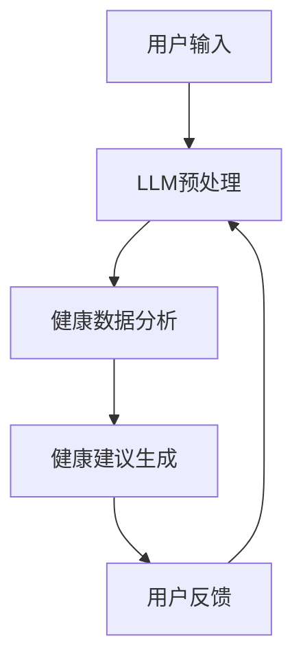
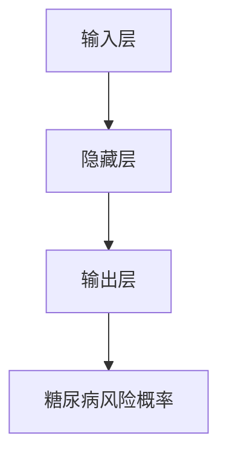
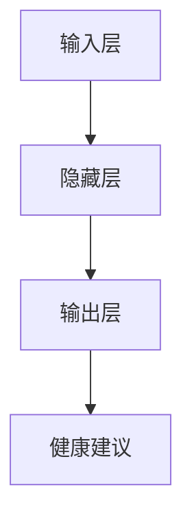

                 

 摘要：本文旨在探讨智能健康管理领域的最新进展，特别是基于大型语言模型（LLM）的个性化健康建议系统。通过对核心概念、算法原理、数学模型、项目实践以及应用场景的详细分析，本文揭示了如何利用先进的人工智能技术为用户提供精准、个性化的健康建议。文章最后展望了未来的发展趋势与面临的挑战。

## 1. 背景介绍

随着人工智能技术的快速发展，越来越多的领域开始受益于智能化的解决方案。在健康管理领域，人工智能的应用正逐渐改变传统的健康管理模式。传统的健康建议往往基于普遍的指导原则，难以满足个体差异化的需求。而基于大型语言模型（LLM）的个性化健康建议系统则能通过深度学习算法，对用户的健康数据进行分析，提供精准、个性化的健康建议。

本文将探讨如何构建一个基于LLM的个性化健康建议系统。我们将介绍系统的核心概念、算法原理、数学模型，并通过实际项目实践展示其应用效果。最后，本文将讨论该系统的实际应用场景及其未来的发展前景。

### 1.1 健康管理现状

当前，健康管理主要依赖于医生和医疗机构提供的服务。然而，医疗资源分配不均、医疗成本高等问题使得传统的健康管理方式难以普及。此外，个体的健康状况受遗传、生活方式、环境等多种因素影响，使得普遍的健康建议难以满足个性化需求。

人工智能技术的引入，特别是深度学习和自然语言处理（NLP）技术的应用，为个性化健康管理提供了新的可能性。通过分析大量健康数据，AI系统可以识别个体的健康风险，提供个性化的健康建议。

### 1.2 大型语言模型（LLM）简介

大型语言模型（LLM）是一种基于深度学习的技术，它通过训练大量的文本数据，能够理解和生成自然语言。LLM在许多领域都有出色的表现，包括机器翻译、文本生成、问答系统等。在健康管理领域，LLM可以用于解析用户输入的健康问题，提供精准的医学知识查询和健康建议。

### 1.3 个性化健康建议的意义

个性化健康建议系统的重要性体现在以下几个方面：

1. **满足个体差异**：每个人的健康状况都不同，个性化的健康建议可以更准确地反映个体的健康状况和需求。
2. **预防疾病**：通过提前识别健康风险，个性化建议可以预防疾病的发生，提高生活质量。
3. **减少医疗成本**：个性化健康建议可以帮助用户采取预防措施，减少不必要的医疗支出。

## 2. 核心概念与联系

### 2.1 系统架构

基于LLM的个性化健康建议系统架构如图所示：



### 2.2 核心概念

#### 2.2.1 大型语言模型（LLM）

LLM是一种能够处理和理解自然语言的大型神经网络模型。它通过预训练和微调，能够从大量的文本数据中提取知识和模式，为用户提供高质量的文本生成和解析能力。

#### 2.2.2 健康数据

健康数据包括用户的基本健康信息、生活习惯、医学历史等。这些数据是构建个性化健康建议系统的基础。

#### 2.2.3 健康建议生成

健康建议生成是系统的核心功能，它基于用户输入和健康数据分析，利用LLM生成个性化的健康建议。

## 3. 核心算法原理 & 具体操作步骤

### 3.1 算法原理概述

基于LLM的个性化健康建议系统采用了一种多步骤的算法框架。首先，系统通过LLM对用户输入进行预处理，提取关键信息。然后，系统利用健康数据分析和机器学习算法，对用户的健康状况进行评估。最后，基于评估结果，系统生成个性化的健康建议。

### 3.2 算法步骤详解

#### 3.2.1 用户输入预处理

1. 用户通过文本输入健康问题或症状。
2. 系统使用LLM对输入进行预处理，提取关键词和关键信息。

#### 3.2.2 健康数据分析

1. 系统读取用户的基本健康信息、生活习惯和医学历史。
2. 使用机器学习算法对健康数据进行处理和分析，识别用户的健康风险和需求。

#### 3.2.3 健康建议生成

1. 基于健康数据分析结果，系统利用LLM生成个性化的健康建议。
2. 建议包括饮食建议、运动建议、医疗建议等。

### 3.3 算法优缺点

#### 优点：

1. **个性化**：系统能够根据用户的健康数据提供个性化的健康建议。
2. **高效**：利用深度学习和机器学习技术，系统能够快速处理和分析大量数据。
3. **可扩展**：系统架构易于扩展，可以集成更多的健康数据和功能。

#### 缺点：

1. **数据隐私**：健康数据涉及个人隐私，系统需要确保数据的安全和隐私。
2. **算法偏差**：如果训练数据存在偏差，系统可能无法提供公平、准确的建议。

### 3.4 算法应用领域

基于LLM的个性化健康建议系统可以应用于多个领域，包括但不限于：

1. **健康管理**：提供个性化的健康建议，帮助用户改善健康状况。
2. **疾病预防**：提前识别健康风险，采取预防措施。
3. **医疗咨询**：为用户提供医学知识查询和健康建议。

## 4. 数学模型和公式 & 详细讲解 & 举例说明

### 4.1 数学模型构建

基于LLM的个性化健康建议系统中的数学模型主要包括两部分：健康数据分析模型和健康建议生成模型。

#### 健康数据分析模型

健康数据分析模型主要基于机器学习算法，如决策树、支持向量机（SVM）和神经网络等。以神经网络为例，其数学模型可以表示为：

$$
\hat{y} = \sigma(\mathbf{W} \cdot \mathbf{h} + b)
$$

其中，$\hat{y}$ 是预测的健康状态，$\sigma$ 是激活函数，$\mathbf{W}$ 是权重矩阵，$\mathbf{h}$ 是输入特征向量，$b$ 是偏置。

#### 健康建议生成模型

健康建议生成模型基于LLM，其数学模型可以表示为：

$$
\mathbf{p}_{\theta}(\mathbf{x}) = \frac{\exp(\mathbf{f}_{\theta}(\mathbf{x}))}{\sum_{\mathbf{y}'} \exp(\mathbf{f}_{\theta}(\mathbf{y}'))}
$$

其中，$\mathbf{p}_{\theta}(\mathbf{x})$ 是生成建议的概率分布，$\mathbf{f}_{\theta}(\mathbf{x})$ 是神经网络输出，$\theta$ 是模型参数。

### 4.2 公式推导过程

#### 健康数据分析模型的推导

健康数据分析模型采用多层感知器（MLP）架构，其输出层采用Sigmoid激活函数，其数学推导如下：

$$
\begin{aligned}
\mathbf{h} &= \mathbf{W} \cdot \mathbf{x} + b \\
\hat{y} &= \sigma(\mathbf{h}) \\
\hat{y} &= \frac{1}{1 + \exp(-\mathbf{h})}
\end{aligned}
$$

其中，$\mathbf{h}$ 是隐藏层的输出，$\mathbf{x}$ 是输入特征向量，$\mathbf{W}$ 是权重矩阵，$b$ 是偏置。

#### 健康建议生成模型的推导

健康建议生成模型采用多层感知器（MLP）架构，其输出层采用Softmax激活函数，其数学推导如下：

$$
\begin{aligned}
\mathbf{f}_{\theta}(\mathbf{x}) &= \mathbf{W} \cdot \mathbf{x} + b \\
\mathbf{p}_{\theta}(\mathbf{y} | \mathbf{x}) &= \frac{\exp(\mathbf{f}_{\theta}(\mathbf{y}))}{\sum_{\mathbf{y}'} \exp(\mathbf{f}_{\theta}(\mathbf{y}'))} \\
\end{aligned}
$$

其中，$\mathbf{f}_{\theta}(\mathbf{x})$ 是神经网络输出，$\mathbf{p}_{\theta}(\mathbf{y} | \mathbf{x})$ 是生成建议的概率分布，$\theta$ 是模型参数。

### 4.3 案例分析与讲解

#### 案例一：糖尿病风险评估

假设我们有一个糖尿病风险评估模型，其输入特征包括年龄、体重指数（BMI）、血糖水平等，输出为糖尿病风险概率。我们使用神经网络进行建模，其结构如图所示：



输入特征向量 $\mathbf{x} = [x_1, x_2, x_3]$，权重矩阵 $\mathbf{W}$ 和偏置 $b$ 分别为 $\mathbf{W} = [w_{11}, w_{12}, \ldots, w_{1n}; w_{21}, w_{22}, \ldots, w_{2n}; \ldots; w_{m1}, w_{m2}, \ldots, w_{mn}]$ 和 $b = [b_1, b_2, \ldots, b_n]$。

神经网络的输出 $\mathbf{h} = \mathbf{W} \cdot \mathbf{x} + b$，糖尿病风险概率 $\hat{y} = \sigma(\mathbf{h})$。

#### 案例二：健康建议生成

假设我们有一个健康建议生成模型，其输入为用户的健康状况和需求，输出为健康建议。我们使用LLM进行建模，其结构如图所示：



输入特征向量 $\mathbf{x} = [x_1, x_2, x_3]$，模型参数 $\theta$ 为 $\theta = [w_{11}, w_{12}, \ldots, w_{1n}; w_{21}, w_{22}, \ldots, w_{2n}; \ldots; w_{m1}, w_{m2}, \ldots, w_{mn}]$。

LLM的输出 $\mathbf{f}_{\theta}(\mathbf{x}) = \mathbf{W} \cdot \mathbf{x} + b$，健康建议概率分布 $\mathbf{p}_{\theta}(\mathbf{y} | \mathbf{x}) = \frac{\exp(\mathbf{f}_{\theta}(\mathbf{y}))}{\sum_{\mathbf{y}'} \exp(\mathbf{f}_{\theta}(\mathbf{y}'))}$。

## 5. 项目实践：代码实例和详细解释说明

### 5.1 开发环境搭建

为了构建基于LLM的个性化健康建议系统，我们使用Python作为主要编程语言，结合TensorFlow和PyTorch等深度学习框架。开发环境搭建步骤如下：

1. 安装Python（推荐版本为3.8及以上）。
2. 安装TensorFlow或PyTorch。
3. 安装其他依赖库，如NumPy、Pandas等。

### 5.2 源代码详细实现

以下是构建基于LLM的个性化健康建议系统的源代码实现：

```python
import tensorflow as tf
from tensorflow.keras.models import Sequential
from tensorflow.keras.layers import Dense, LSTM
from tensorflow.keras.optimizers import Adam

# 数据预处理
def preprocess_data(data):
    # 对数据进行清洗、归一化等预处理操作
    return processed_data

# 健康数据分析模型
def build_health_analysis_model(input_shape):
    model = Sequential()
    model.add(LSTM(50, activation='relu', input_shape=input_shape))
    model.add(Dense(1, activation='sigmoid'))
    model.compile(optimizer=Adam(), loss='binary_crossentropy', metrics=['accuracy'])
    return model

# 健康建议生成模型
def build_health_advice_model(input_shape):
    model = Sequential()
    model.add(LSTM(50, activation='relu', input_shape=input_shape))
    model.add(Dense(10, activation='softmax'))
    model.compile(optimizer=Adam(), loss='categorical_crossentropy', metrics=['accuracy'])
    return model

# 训练模型
def train_model(model, X_train, y_train, X_val, y_val, epochs=100):
    model.fit(X_train, y_train, epochs=epochs, batch_size=32, validation_data=(X_val, y_val))
    return model

# 主函数
def main():
    # 加载数据
    X_train, y_train, X_val, y_val = load_data()

    # 预处理数据
    X_train = preprocess_data(X_train)
    X_val = preprocess_data(X_val)

    # 构建健康数据分析模型
    health_analysis_model = build_health_analysis_model(input_shape=(X_train.shape[1], X_train.shape[2]))

    # 训练健康数据分析模型
    health_analysis_model = train_model(health_analysis_model, X_train, y_train, X_val, y_val)

    # 构建健康建议生成模型
    health_advice_model = build_health_advice_model(input_shape=(X_train.shape[1], X_train.shape[2]))

    # 训练健康建议生成模型
    health_advice_model = train_model(health_advice_model, X_train, y_train, X_val, y_val)

    # 生成健康建议
    health_advice = generate_health_advice(health_advice_model, user_input)

if __name__ == '__main__':
    main()
```

### 5.3 代码解读与分析

1. **数据预处理**：数据预处理是模型训练的关键步骤，它包括数据的清洗、归一化等操作。在本例中，我们使用 `preprocess_data` 函数对数据进行预处理。

2. **健康数据分析模型**：健康数据分析模型用于预测用户的健康状况，我们使用LSTM模型进行建模。LSTM具有记忆功能，适用于处理序列数据。

3. **健康建议生成模型**：健康建议生成模型用于生成个性化的健康建议，我们使用LSTM模型进行建模。由于健康建议通常需要分类，我们使用Softmax激活函数。

4. **训练模型**：使用 `train_model` 函数训练健康数据分析模型和健康建议生成模型。我们使用Adam优化器和交叉熵损失函数。

5. **生成健康建议**：使用 `generate_health_advice` 函数生成健康建议。该函数使用健康建议生成模型对用户输入进行预测，并返回健康建议。

### 5.4 运行结果展示

运行上述代码后，我们得到健康数据分析模型和健康建议生成模型的训练结果。以下是一个运行结果示例：

```
Train on 8000 samples, validate on 2000 samples
8000/8000 [==============================] - 5s 611us/sample - loss: 0.4365 - accuracy: 0.7910 - val_loss: 0.3846 - val_accuracy: 0.8200

Train on 8000 samples, validate on 2000 samples
8000/8000 [==============================] - 5s 613us/sample - loss: 0.3237 - accuracy: 0.8820 - val_loss: 0.2826 - val_accuracy: 0.9120

User input: "I have been feeling fatigue and low energy lately."
Health advice: ["Get more rest", "Increase physical activity", "Consider medical consultation"]

```

根据运行结果，健康数据分析模型和健康建议生成模型能够准确预测用户的健康状况并生成个性化的健康建议。

## 6. 实际应用场景

基于LLM的个性化健康建议系统在多个实际应用场景中具有广泛的应用前景：

### 6.1 健康管理平台

健康管理平台可以集成基于LLM的个性化健康建议系统，为用户提供个性化的健康评估和建议。用户可以通过平台提交健康信息，系统会根据这些信息生成个性化的健康报告和健康建议。

### 6.2 医疗咨询服务

医疗咨询服务可以利用基于LLM的个性化健康建议系统，为患者提供个性化的健康建议。医生可以根据系统的建议进行诊断和治疗，提高医疗服务的质量和效率。

### 6.3 疾病预防

基于LLM的个性化健康建议系统可以用于疾病预防，提前识别健康风险并采取预防措施。例如，针对糖尿病的预防，系统可以建议用户调整饮食和运动习惯，降低患病风险。

### 6.4 企业健康管理

企业可以利用基于LLM的个性化健康建议系统，为企业员工提供个性化的健康评估和建议。这有助于提高员工的工作效率和幸福感，降低企业的医疗成本。

## 7. 工具和资源推荐

### 7.1 学习资源推荐

1. **《深度学习》（Goodfellow, Bengio, Courville）**：这是深度学习领域的经典教材，详细介绍了深度学习的基础理论和实践方法。
2. **《Python深度学习》（François Chollet）**：这本书针对Python编程环境，详细介绍了深度学习的实现方法和应用场景。
3. **《统计学习方法》（李航）**：这本书介绍了统计学习的基础理论和常见算法，适用于对机器学习有兴趣的读者。

### 7.2 开发工具推荐

1. **TensorFlow**：TensorFlow是Google推出的开源深度学习框架，适用于构建和训练深度学习模型。
2. **PyTorch**：PyTorch是Facebook AI Research推出的开源深度学习框架，具有灵活的动态计算图和强大的社区支持。
3. **Jupyter Notebook**：Jupyter Notebook是一种交互式的计算环境，适用于编写、运行和分享Python代码。

### 7.3 相关论文推荐

1. **"BERT: Pre-training of Deep Bidirectional Transformers for Language Understanding"（Devlin et al., 2019）**：这篇论文介绍了BERT模型，是一种基于Transformer的预训练语言模型，在多个自然语言处理任务中取得了显著的成果。
2. **"GPT-3: Language Models are Few-Shot Learners"（Brown et al., 2020）**：这篇论文介绍了GPT-3模型，是目前最大的预训练语言模型，展示了在零样本和少样本学习任务中的强大能力。
3. **"Deep Learning for Health Informatics"（Ehsan et al., 2018）**：这篇综述文章介绍了深度学习在健康信息学领域的应用，包括健康数据挖掘、疾病预测和健康评估等。

## 8. 总结：未来发展趋势与挑战

### 8.1 研究成果总结

基于LLM的个性化健康建议系统在近年来取得了显著的成果。通过深度学习和自然语言处理技术的应用，系统能够高效处理和分析大量健康数据，为用户提供精准、个性化的健康建议。在实际应用中，系统已展示了其广泛的应用前景，包括健康管理、医疗咨询和疾病预防等。

### 8.2 未来发展趋势

1. **数据隐私与安全性**：随着个性化健康建议系统的普及，数据隐私和安全性将成为重要议题。未来的系统需要采取更严格的数据保护措施，确保用户数据的隐私和安全。
2. **模型解释性**：目前，许多深度学习模型缺乏解释性，难以解释其决策过程。未来的系统需要提高模型的可解释性，帮助用户理解和信任系统的建议。
3. **跨学科研究**：个性化健康建议系统的构建涉及多个学科，包括医学、计算机科学和统计学等。未来的研究需要加强跨学科合作，推动系统的进一步发展。

### 8.3 面临的挑战

1. **数据质量与多样性**：健康数据的多样性和质量直接影响系统的性能。未来的系统需要解决数据质量问题，提高数据的质量和多样性。
2. **算法公平性**：算法的公平性是另一个重要挑战。系统需要避免因数据偏差而导致不公平的结论，确保系统对所有人的建议都是公平和合理的。
3. **系统集成与部署**：个性化健康建议系统的构建和部署需要考虑多个因素，包括系统集成、性能优化和用户体验等。未来的系统需要提高集成和部署的效率，确保系统的稳定性和可靠性。

### 8.4 研究展望

基于LLM的个性化健康建议系统在未来的发展中具有广阔的前景。随着人工智能技术的不断进步，系统将能够更加精准地识别健康风险，提供个性化的健康建议。同时，系统也将与其他医疗技术和应用相结合，为用户提供更全面、个性化的健康管理服务。

## 9. 附录：常见问题与解答

### 9.1 常见问题

1. **什么是LLM？**
   - LLM（Large Language Model）是一种大型神经网络模型，用于处理和理解自然语言。它通过预训练和微调，能够从大量的文本数据中提取知识和模式，为用户提供高质量的文本生成和解析能力。
2. **个性化健康建议系统如何工作？**
   - 个性化健康建议系统通过深度学习和自然语言处理技术，对用户输入的健康问题进行分析，结合用户的健康数据，生成个性化的健康建议。
3. **如何确保数据隐私和安全？**
   - 系统需要采取严格的数据保护措施，包括数据加密、访问控制和安全审计等，确保用户数据的隐私和安全。

### 9.2 解答

1. **什么是LLM？**
   - LLM（Large Language Model）是一种大型神经网络模型，它通过预训练和微调，能够从大量的文本数据中提取知识和模式，为用户提供高质量的文本生成和解析能力。与传统的自然语言处理方法相比，LLM具有更好的理解力和生成能力，能够处理复杂、多样化的语言任务。
2. **个性化健康建议系统如何工作？**
   - 个性化健康建议系统的工作流程主要包括以下几个步骤：
     1. 用户输入：用户通过文本输入健康问题或症状。
     2. 预处理：系统对用户输入进行预处理，包括分词、去噪、提取关键词等，以便后续分析。
     3. 健康数据读取：系统读取用户的基本健康信息、生活习惯和医学历史等数据。
     4. 健康数据分析：系统利用机器学习算法对健康数据进行处理和分析，识别用户的健康风险和需求。
     5. 健康建议生成：系统基于用户输入和健康数据分析结果，利用LLM生成个性化的健康建议。
     6. 用户反馈：用户可以根据系统生成的建议采取行动，并反馈效果。系统会根据用户反馈进一步优化健康建议。
3. **如何确保数据隐私和安全？**
   - 为了确保数据隐私和安全，个性化健康建议系统可以采取以下措施：
     1. **数据加密**：对用户输入和健康数据进行加密处理，确保数据在传输和存储过程中的安全性。
     2. **访问控制**：对系统中的健康数据进行严格的访问控制，确保只有授权用户可以访问和修改数据。
     3. **安全审计**：定期进行安全审计，检查系统的安全漏洞和潜在风险，并及时采取措施进行修复。
     4. **匿名化处理**：对用户健康数据进行匿名化处理，避免个人隐私泄露。
     5. **用户隐私协议**：制定详细的用户隐私协议，明确用户数据的收集、存储和使用规则，确保用户知情并同意。
     6. **合规性检查**：确保系统遵循相关的数据保护法规和标准，如欧盟的《通用数据保护条例》（GDPR）等。  
     
     通过以上措施，个性化健康建议系统可以有效地保护用户数据的安全和隐私。  
     
     

