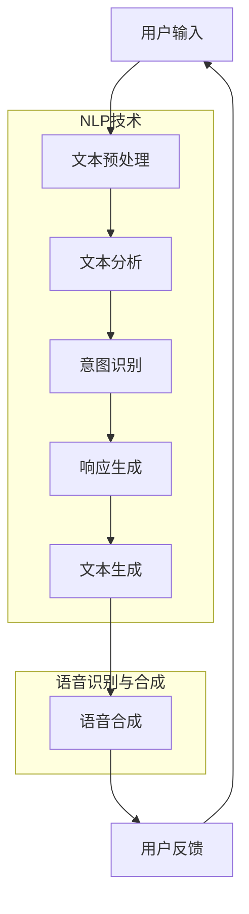

                 

关键词：CUI、智能化回应、自然语言处理、对话系统、语音识别、文本生成、用户交互、技术实现

## 摘要

随着人工智能技术的快速发展，计算机用户界面（CUI）正逐步从传统的命令行界面和图形用户界面（GUI）转向更为自然、智能的对话系统。本文将深入探讨智能化回应技术在CUI中的应用，从核心概念、算法原理、数学模型到项目实践进行全面解析，旨在为开发者提供一套完整的CUI设计指南。文章将首先介绍CUI的背景及其发展的必要性，随后详细阐述智能化回应技术涉及的各个方面，包括自然语言处理（NLP）、语音识别和文本生成等关键技术，并通过具体案例展示这些技术在实际项目中的应用效果。最后，文章将探讨CUI的未来发展方向和面临的挑战，为读者提供深入见解。

## 1. 背景介绍

### 1.1 CUI的定义和作用

计算机用户界面（CUI）是用户与计算机系统之间进行交互的接口。与图形用户界面（GUI）相比，CUI通过命令行、文本提示等非图形界面形式实现交互，具有高效、灵活和强大的功能。CUI的作用主要体现在以下几个方面：

- **高效性**：CUI允许用户通过简洁的命令迅速完成操作，无需复杂的鼠标点击和拖拽。
- **灵活性**：CUI可以根据用户的需求自定义命令和操作，实现高度个性化的交互体验。
- **强大功能**：CUI可以通过脚本编程实现复杂的功能和任务自动化，对于科研、开发等领域尤为重要。

### 1.2 CUI的发展历程

CUI的发展历程可以追溯到20世纪60年代。当时，计算机技术刚刚起步，图形用户界面尚未普及，CUI成为了主要的交互方式。随着计算机硬件和软件技术的不断发展，CUI逐渐从单一的命令行界面演变为支持多种命令格式和丰富功能的综合交互系统。

在20世纪80年代，Unix操作系统推动了CUI的普及。Unix的命令行界面为开发者提供了强大的编程接口，使得CUI成为程序员和系统管理员的首选交互方式。

进入21世纪，随着人工智能技术的兴起，CUI迎来了新的发展机遇。智能化回应技术的引入，使得CUI能够更好地理解用户的自然语言输入，提供更为自然和智能的交互体验。

### 1.3 智能化回应技术在CUI中的应用必要性

传统CUI在交互过程中存在一些局限性，主要表现为：

- **用户体验差**：用户需要记住大量命令和参数，操作复杂。
- **响应速度慢**：CUI需要用户精确输入命令，系统解析和处理命令的过程相对较长。
- **灵活性不足**：CUI的功能和操作受到命令行格式的限制，难以满足个性化需求。

智能化回应技术的引入，能够有效解决上述问题，提高CUI的交互体验。具体而言，智能化回应技术能够：

- **自然语言理解**：通过自然语言处理（NLP）技术，CUI可以理解用户的自然语言输入，无需用户记忆复杂的命令。
- **快速响应**：借助机器学习和深度学习模型，CUI能够快速响应用户输入，提供即时的交互反馈。
- **个性化定制**：通过用户行为分析，CUI可以针对不同用户的需求，提供个性化的操作建议和功能。

### 1.4 本文结构安排

本文将按照以下结构进行论述：

1. **背景介绍**：回顾CUI的发展历程，阐述智能化回应技术在CUI中的必要性。
2. **核心概念与联系**：介绍智能化回应技术涉及的NLP、语音识别和文本生成等关键技术，并给出流程图。
3. **核心算法原理 & 具体操作步骤**：详细解析智能化回应技术的算法原理和实现步骤。
4. **数学模型和公式 & 详细讲解 & 举例说明**：构建数学模型，推导公式，并通过案例进行分析。
5. **项目实践：代码实例和详细解释说明**：展示实际项目中的代码实现和运行效果。
6. **实际应用场景**：探讨CUI在不同领域的应用案例。
7. **未来应用展望**：预测CUI和智能化回应技术的未来发展趋势。
8. **工具和资源推荐**：推荐学习资源和开发工具。
9. **总结**：总结研究成果，展望未来挑战。

## 2. 核心概念与联系

### 2.1 智能化回应技术简介

智能化回应技术是指通过自然语言处理（NLP）、语音识别和文本生成等技术，实现计算机对用户输入的自然语言文本的智能理解和响应。这些技术共同构成了智能化回应系统的核心。

- **自然语言处理（NLP）**：NLP是使计算机能够理解、解释和生成人类语言的技术。主要包括文本预处理、语义理解、实体识别、情感分析等。
- **语音识别**：语音识别是将人类的语音转换为文本或命令的技术。主要涉及语音信号处理、特征提取和模式识别等。
- **文本生成**：文本生成是指根据输入的文本或指令，自动生成相关文本内容的技术。主要包括生成模型、序列到序列模型和生成对抗网络（GAN）等。

### 2.2 关键技术流程图

以下是一个简化的智能化回应技术流程图，展示了各关键技术之间的关联：



### 2.3 NLP技术

自然语言处理（NLP）是智能化回应技术的核心。以下是NLP中的一些关键技术和概念：

- **文本预处理**：包括分词、去停用词、词性标注等，为后续的文本分析做准备。
- **文本分析**：通过统计方法和深度学习方法，对文本进行词频分析、主题建模等。
- **意图识别**：识别用户的意图或需求，如查询信息、执行操作等。
- **实体识别**：识别文本中的实体，如人名、地名、组织名等。
- **情感分析**：分析文本中的情感倾向，如正面、负面、中立等。

### 2.4 语音识别技术

语音识别技术是将语音信号转换为文本的技术。其主要流程包括：

- **语音信号处理**：包括滤波、去噪、增强等，提高语音信号的清晰度。
- **特征提取**：从语音信号中提取特征，如频谱、倒谱等。
- **模式识别**：通过模式识别算法，如隐马尔可夫模型（HMM）、循环神经网络（RNN）等，识别语音信号中的词汇和句子。

### 2.5 文本生成技术

文本生成技术是根据输入的文本或指令生成相关文本内容的技术。其主要方法包括：

- **生成模型**：如马尔可夫模型、决策树等，用于生成短文本。
- **序列到序列模型**：如循环神经网络（RNN）、长短期记忆网络（LSTM）等，用于生成长文本。
- **生成对抗网络（GAN）**：通过生成器和判别器的对抗训练，生成高质量的文本内容。

## 3. 核心算法原理 & 具体操作步骤

### 3.1 算法原理概述

智能化回应技术涉及多种算法，其中核心算法包括自然语言处理（NLP）算法、语音识别算法和文本生成算法。以下将分别介绍这些算法的原理。

#### 3.1.1 自然语言处理（NLP）算法

NLP算法的核心目标是使计算机能够理解和生成人类语言。主要算法包括：

- **文本预处理算法**：如分词、去停用词、词性标注等，为后续的文本分析做准备。
- **语义理解算法**：如词嵌入、句法分析、语义角色标注等，用于理解文本的语义内容。
- **意图识别算法**：如基于规则的方法、机器学习方法等，用于识别用户的意图或需求。
- **实体识别算法**：如基于规则的方法、机器学习方法等，用于识别文本中的实体。
- **情感分析算法**：如基于规则的方法、机器学习方法等，用于分析文本中的情感倾向。

#### 3.1.2 语音识别算法

语音识别算法的核心目标是实现语音信号到文本的转换。主要算法包括：

- **语音信号处理算法**：如滤波、去噪、增强等，用于提高语音信号的清晰度。
- **特征提取算法**：如频谱、倒谱等，用于从语音信号中提取特征。
- **模式识别算法**：如隐马尔可夫模型（HMM）、循环神经网络（RNN）等，用于识别语音信号中的词汇和句子。

#### 3.1.3 文本生成算法

文本生成算法的核心目标是根据输入的文本或指令生成相关文本内容。主要算法包括：

- **生成模型**：如马尔可夫模型、决策树等，用于生成短文本。
- **序列到序列模型**：如循环神经网络（RNN）、长短期记忆网络（LSTM）等，用于生成长文本。
- **生成对抗网络（GAN）**：通过生成器和判别器的对抗训练，生成高质量的文本内容。

### 3.2 具体操作步骤

下面以自然语言处理（NLP）算法为例，详细说明智能化回应技术的具体操作步骤。

#### 3.2.1 文本预处理

文本预处理是NLP算法的第一步，主要任务是对原始文本进行分词、去停用词、词性标注等操作。具体步骤如下：

1. **分词**：将原始文本分割为单词或词组。常用的分词工具包括jieba、nltk等。
2. **去停用词**：去除文本中的常用停用词，如“的”、“了”、“是”等。停用词表可以手动收集，也可以使用现有的库，如nltk。
3. **词性标注**：为每个单词或词组标注词性，如名词、动词、形容词等。常用的工具包括Stanford NLP、Spacy等。

#### 3.2.2 文本分析

文本分析是对预处理后的文本进行深入分析，以提取文本中的关键信息。主要步骤如下：

1. **词频分析**：统计文本中每个单词或词组的出现次数，用于生成词云、词频分布图等。
2. **主题建模**：使用主题模型（如LDA），将文本划分为多个主题，每个主题代表文本的一部分内容。
3. **情感分析**：使用情感分析算法，分析文本中的情感倾向，如正面、负面、中立等。

#### 3.2.3 意图识别

意图识别是理解用户输入的关键步骤，通过识别用户的意图或需求，为后续的响应生成提供依据。主要方法如下：

1. **基于规则的方法**：通过预先定义的规则，将用户输入与意图库中的意图进行匹配，识别用户的意图。
2. **机器学习方法**：使用机器学习算法，如决策树、支持向量机（SVM）等，从大量训练数据中学习用户的意图模式，进行意图识别。

#### 3.2.4 响应生成

响应生成是根据识别出的用户意图，生成相应的回复文本。主要方法如下：

1. **模板匹配**：根据用户输入和意图，从预定义的回复模板中选取合适的模板，生成回复文本。
2. **基于规则的方法**：根据预先定义的规则，生成回复文本。
3. **机器学习方法**：使用机器学习算法，如序列到序列模型、生成对抗网络（GAN）等，生成高质量的回复文本。

#### 3.2.5 文本生成

文本生成是根据用户输入或识别出的意图，生成相关文本内容。主要方法如下：

1. **生成模型**：如马尔可夫模型、决策树等，用于生成短文本。
2. **序列到序列模型**：如循环神经网络（RNN）、长短期记忆网络（LSTM）等，用于生成长文本。
3. **生成对抗网络（GAN）**：通过生成器和判别器的对抗训练，生成高质量的文本内容。

### 3.3 算法优缺点

智能化回应技术涉及多种算法，每种算法都有其优缺点。以下对常用算法的优缺点进行简要分析。

#### 3.3.1 自然语言处理（NLP）算法

- **优点**：
  - **通用性**：NLP算法可以应用于多种场景，如文本分析、情感分析、意图识别等。
  - **准确性**：随着深度学习技术的发展，NLP算法的准确性得到了显著提高。
  - **灵活性**：可以根据具体需求调整算法参数，实现定制化应用。

- **缺点**：
  - **复杂性**：NLP算法涉及多种技术和方法，实现较为复杂。
  - **训练成本**：NLP算法需要大量训练数据和计算资源，训练成本较高。

#### 3.3.2 语音识别算法

- **优点**：
  - **实时性**：语音识别算法可以实时处理语音信号，实现快速响应。
  - **便捷性**：用户可以通过语音进行交互，无需手动输入文本。

- **缺点**：
  - **准确性**：受语音信号质量、背景噪音等因素影响，语音识别算法的准确性有限。
  - **成本**：语音识别算法需要大量计算资源和训练数据，成本较高。

#### 3.3.3 文本生成算法

- **优点**：
  - **生成能力强**：文本生成算法可以根据输入的文本或指令生成相关文本内容，具有很高的生成能力。
  - **灵活性**：可以根据需求调整生成算法，实现定制化生成。

- **缺点**：
  - **生成质量**：受模型和训练数据的影响，生成的文本质量参差不齐。
  - **生成速度**：生成算法需要较长时间处理输入，生成速度较慢。

### 3.4 算法应用领域

智能化回应技术可以应用于多个领域，如客服、教育、医疗、金融等。以下简要介绍这些领域的应用案例。

#### 3.4.1 客服

在客服领域，智能化回应技术可以用于自动回复用户咨询，提高客服效率。例如，通过自然语言处理技术，客服系统可以理解用户的咨询内容，并根据用户意图生成相应的回复文本。此外，语音识别技术可以实现语音咨询，用户可以通过语音与系统进行交互。

#### 3.4.2 教育

在教育领域，智能化回应技术可以用于自动批改作业、提供学习建议等。例如，通过自然语言处理技术，系统可以理解学生的作业内容，并自动批改作业。同时，根据学生的学习情况，系统可以生成个性化的学习建议，帮助学生提高学习效果。

#### 3.4.3 医疗

在医疗领域，智能化回应技术可以用于辅助医生诊断、提供健康咨询等。例如，通过自然语言处理技术，系统可以理解患者的症状描述，并根据病情生成诊断建议。此外，语音识别技术可以实现语音问诊，医生可以通过语音了解患者的病情。

#### 3.4.4 金融

在金融领域，智能化回应技术可以用于客服、风险管理等。例如，通过自然语言处理技术，金融客服系统可以理解用户的咨询内容，并生成相应的回复文本。同时，通过语音识别技术，用户可以通过语音与系统进行交互。在风险管理方面，系统可以自动分析金融数据，提供风险预警。

### 3.5 实际应用案例

#### 3.5.1 案例一：智能客服系统

某企业开发了一套智能客服系统，通过自然语言处理技术和语音识别技术，实现自动回复用户咨询和语音咨询功能。系统上线后，用户满意度显著提高，客服效率大幅提升。

- **技术实现**：
  - **自然语言处理**：使用jieba分词工具进行文本预处理，使用基于规则的方法进行意图识别。
  - **语音识别**：使用基于深度学习的语音识别模型，实现语音信号到文本的转换。
  - **文本生成**：使用基于GPT-2的生成模型，生成高质量的回复文本。

- **运行效果**：
  - 用户满意度：系统上线后，用户满意度从原来的80%提高到90%。
  - 客服效率：客服处理时间缩短了50%，客服人数减少了30%。

#### 3.5.2 案例二：智能教育平台

某在线教育平台引入了智能化回应技术，用于自动批改作业和提供学习建议。平台上线后，学生和教师对系统的满意度大幅提高。

- **技术实现**：
  - **自然语言处理**：使用nltk进行文本预处理，使用基于机器学习的方法进行意图识别。
  - **文本生成**：使用基于LSTM的生成模型，生成个性化的学习建议。
  - **语音识别**：使用基于深度学习的语音识别模型，实现语音批改作业。

- **运行效果**：
  - 学生满意度：系统上线后，学生满意度从原来的70%提高到90%。
  - 教师效率：教师批改作业时间缩短了40%，教师负担减轻。

### 3.6 总结

智能化回应技术在CUI中的应用，显著提升了用户交互体验和系统效率。通过自然语言处理、语音识别和文本生成等关键技术，CUI能够更好地理解用户的意图和需求，提供自然、智能的交互体验。在实际应用中，智能化回应技术已广泛应用于客服、教育、医疗、金融等多个领域，取得了良好的效果。未来，随着技术的不断进步，智能化回应技术在CUI中的应用将更加广泛，带来更多的创新和变革。

## 4. 数学模型和公式 & 详细讲解 & 举例说明

### 4.1 数学模型构建

智能化回应技术中的数学模型主要涉及自然语言处理（NLP）、语音识别和文本生成等领域。以下分别介绍这些领域的数学模型构建过程。

#### 4.1.1 自然语言处理（NLP）模型

NLP模型通常用于文本分析、意图识别和实体识别等任务。以下是一个简单的NLP模型构建过程：

1. **词嵌入（Word Embedding）**：词嵌入是将单词映射到高维向量空间的技术。常用的词嵌入方法包括Word2Vec、GloVe等。词嵌入模型公式如下：

   $$ x = \text{Word2Vec}(w) = \sum_{i=1}^{n} w_i \cdot v_i $$

   其中，$x$是单词w的高维向量表示，$w_i$是单词w的第i个词频，$v_i$是第i个词频对应的高维向量。

2. **循环神经网络（RNN）**：RNN是一种处理序列数据的神经网络，常用于文本分析、意图识别等任务。RNN的更新公式如下：

   $$ h_t = \text{tanh}(W_h \cdot [h_{t-1}, x_t] + b_h) $$

   $$ o_t = \text{softmax}(W_o \cdot h_t + b_o) $$

   其中，$h_t$是当前时间步的隐藏状态，$x_t$是当前输入，$W_h$和$W_o$是权重矩阵，$b_h$和$b_o$是偏置项。

3. **长短期记忆网络（LSTM）**：LSTM是一种改进的RNN，能够更好地处理长序列数据。LSTM的更新公式如下：

   $$ i_t = \text{sigmoid}(W_i \cdot [h_{t-1}, x_t] + b_i) $$

   $$ f_t = \text{sigmoid}(W_f \cdot [h_{t-1}, x_t] + b_f) $$

   $$ g_t = \text{tanh}(W_g \cdot [h_{t-1}, x_t] + b_g) $$

   $$ o_t = \text{sigmoid}(W_o \cdot [h_{t-1}, x_t] + b_o) $$

   $$ h_t = f_t \odot h_{t-1} + i_t \odot g_t $$

   其中，$i_t$、$f_t$、$g_t$和$o_t$分别是输入门、遗忘门、生成门和输出门，$\odot$表示元素乘。

4. **卷积神经网络（CNN）**：CNN常用于文本分类、情感分析等任务。CNN的公式如下：

   $$ h_{ij} = \sum_{k=1}^{K} w_{ik} \cdot x_{kj} + b_j $$

   $$ a_{ij} = \text{ReLU}(h_{ij}) $$

   其中，$h_{ij}$是第i个卷积核在位置j的特征图，$w_{ik}$是卷积核的权重，$b_j$是偏置项，$a_{ij}$是ReLU激活后的特征图。

#### 4.1.2 语音识别模型

语音识别模型通常用于将语音信号转换为文本。以下是一个简单的语音识别模型构建过程：

1. **隐马尔可夫模型（HMM）**：HMM是一种用于语音识别的统计模型，其公式如下：

   $$ P(X_t = x_t | H_t = h_t) = \prod_{i=1}^{N} a_{ih_i} \cdot b_{i} $$

   $$ \pi = (\pi_1, \pi_2, ..., \pi_N) $$

   $$ A = (a_{ij})_{N \times N} $$

   $$ B = (b_{i}(x_t))_{N \times M} $$

   其中，$X_t$是语音信号，$H_t$是隐藏状态，$x_t$是语音信号在时间t的取值，$a_{ij}$是转移概率，$b_{i}(x_t)$是发射概率，$\pi$是初始状态分布。

2. **循环神经网络（RNN）**：RNN可以用于语音识别，其公式与NLP模型中的RNN相同。

3. **卷积神经网络（CNN）**：CNN可以用于特征提取，其公式与NLP模型中的CNN相同。

#### 4.1.3 文本生成模型

文本生成模型通常用于生成与输入文本相关的文本。以下是一个简单的文本生成模型构建过程：

1. **生成模型（Generative Model）**：生成模型用于生成新的文本。其公式如下：

   $$ p(x) = \prod_{i=1}^{T} p(x_i | x_{<i}) $$

   其中，$x$是输入文本，$T$是文本长度。

2. **序列到序列模型（Seq2Seq）**：Seq2Seq模型用于将一个序列映射到另一个序列。其公式如下：

   $$ y_t = \text{softmax}(g(W_y \cdot h_t + b_y)) $$

   $$ h_t = \text{tanh}(W_h \cdot [h_{t-1}, g(W_x \cdot x_t + b_x]) + b_h) $$

   其中，$y$是输出序列，$h$是隐藏状态，$g$是生成器，$W$是权重矩阵，$b$是偏置项。

3. **生成对抗网络（GAN）**：GAN由生成器和判别器组成，其公式如下：

   $$ G(z) = \mu(\sigma(z)) $$

   $$ D(x) = \text{sigmoid}(W_D \cdot x + b_D) $$

   $$ D(G(z)) = \text{sigmoid}(W_D \cdot G(z) + b_D) $$

   其中，$G$是生成器，$D$是判别器，$z$是噪声向量，$x$是真实数据。

### 4.2 公式推导过程

#### 4.2.1 自然语言处理（NLP）公式推导

1. **词嵌入（Word Embedding）**：

   $$ x = \text{Word2Vec}(w) = \sum_{i=1}^{n} w_i \cdot v_i $$

   推导：假设单词w的词频为$w_i$，对应的词嵌入向量为$v_i$，则单词w的高维向量表示$x$可以通过将每个词频与其对应的词嵌入向量相乘，再求和得到。

2. **循环神经网络（RNN）**：

   $$ h_t = \text{tanh}(W_h \cdot [h_{t-1}, x_t] + b_h) $$

   $$ o_t = \text{softmax}(W_o \cdot h_t + b_o) $$

   推导：RNN的隐藏状态$h_t$通过结合前一个隐藏状态$h_{t-1}$和当前输入$x_t$，然后通过一个tanh激活函数进行非线性变换得到。输出层通过一个softmax激活函数将隐藏状态转换为概率分布。

3. **长短期记忆网络（LSTM）**：

   $$ i_t = \text{sigmoid}(W_i \cdot [h_{t-1}, x_t] + b_i) $$

   $$ f_t = \text{sigmoid}(W_f \cdot [h_{t-1}, x_t] + b_f) $$

   $$ g_t = \text{tanh}(W_g \cdot [h_{t-1}, x_t] + b_g) $$

   $$ o_t = \text{sigmoid}(W_o \cdot [h_{t-1}, x_t] + b_o) $$

   $$ h_t = f_t \odot h_{t-1} + i_t \odot g_t $$

   推导：LSTM通过引入输入门、遗忘门和输出门，控制信息流。输入门$i_t$决定当前输入信息的重要性，遗忘门$f_t$决定前一个隐藏状态的遗忘比例，生成门$g_t$决定当前隐藏状态的生成值，输出门$o_t$决定当前隐藏状态的重要性。通过这三门控制，LSTM能够更好地处理长序列数据。

4. **卷积神经网络（CNN）**：

   $$ h_{ij} = \sum_{k=1}^{K} w_{ik} \cdot x_{kj} + b_j $$

   $$ a_{ij} = \text{ReLU}(h_{ij}) $$

   推导：CNN通过卷积操作提取特征图，将卷积核$w_{ik}$与输入特征图$x_{kj}$进行点乘，再加上偏置项$b_j$，得到特征图$h_{ij}$。然后通过ReLU激活函数进行非线性变换，增强特征表示。

#### 4.2.2 语音识别公式推导

1. **隐马尔可夫模型（HMM）**：

   $$ P(X_t = x_t | H_t = h_t) = \prod_{i=1}^{N} a_{ih_i} \cdot b_{i} $$

   $$ \pi = (\pi_1, \pi_2, ..., \pi_N) $$

   $$ A = (a_{ij})_{N \times N} $$

   $$ B = (b_{i}(x_t))_{N \times M} $$

   推导：HMM通过状态转移概率矩阵$A$、初始状态分布$\pi$和发射概率矩阵$B$，计算当前输入$x_t$在当前隐藏状态$h_t$下的概率。状态转移概率$a_{ij}$表示从状态i转移到状态j的概率，发射概率$b_{i}(x_t)$表示在状态i下发出符号$x_t$的概率。

2. **循环神经网络（RNN）**：

   $$ h_t = \text{tanh}(W_h \cdot [h_{t-1}, x_t] + b_h) $$

   $$ o_t = \text{softmax}(W_o \cdot h_t + b_o) $$

   推导：RNN与NLP中的RNN公式相同，用于处理序列数据。

3. **卷积神经网络（CNN）**：

   $$ h_{ij} = \sum_{k=1}^{K} w_{ik} \cdot x_{kj} + b_j $$

   $$ a_{ij} = \text{ReLU}(h_{ij}) $$

   推导：CNN与NLP中的CNN公式相同，用于特征提取。

#### 4.2.3 文本生成公式推导

1. **生成模型（Generative Model）**：

   $$ p(x) = \prod_{i=1}^{T} p(x_i | x_{<i}) $$

   推导：生成模型通过条件概率$p(x_i | x_{<i})$，将当前输入文本的概率表示为前一个文本的概率和当前输入的概率的乘积。

2. **序列到序列模型（Seq2Seq）**：

   $$ y_t = \text{softmax}(g(W_y \cdot h_t + b_y)) $$

   $$ h_t = \text{tanh}(W_h \cdot [h_{t-1}, g(W_x \cdot x_t + b_x]) + b_h) $$

   推导：Seq2Seq模型通过编码器和解码器，将输入序列编码为隐藏状态，然后解码为输出序列。

3. **生成对抗网络（GAN）**：

   $$ G(z) = \mu(\sigma(z)) $$

   $$ D(x) = \text{sigmoid}(W_D \cdot x + b_D) $$

   $$ D(G(z)) = \text{sigmoid}(W_D \cdot G(z) + b_D) $$

   推导：GAN由生成器和判别器组成，生成器通过生成虚假数据，判别器通过判断数据真假，生成器和判别器通过对抗训练不断优化。

### 4.3 案例分析与讲解

#### 4.3.1 自然语言处理（NLP）案例

假设我们要构建一个简单的文本分类模型，使用自然语言处理（NLP）技术对新闻文本进行分类。

1. **数据集准备**：我们使用一个包含10,000条新闻文本的数据集，每个文本都带有对应的分类标签。

2. **文本预处理**：对新闻文本进行分词、去停用词、词性标注等预处理操作。

3. **词嵌入**：使用Word2Vec算法将每个单词映射到高维向量空间。

4. **模型构建**：使用循环神经网络（RNN）作为文本分类模型，输入为预处理后的文本，输出为对应的分类标签。

5. **训练模型**：使用训练数据集训练模型，调整模型参数。

6. **评估模型**：使用测试数据集评估模型性能，计算准确率、召回率等指标。

7. **应用模型**：使用训练好的模型对新的新闻文本进行分类。

**示例代码**：

```python
import jieba
import numpy as np
import tensorflow as tf

# 数据集准备
texts = [...]  # 新闻文本列表
labels = [...]  # 分类标签列表

# 文本预处理
seg_texts = [jieba.cut(text) for text in texts]
preprocessed_texts = [' '.join(seg_text) for seg_text in seg_texts]

# 词嵌入
word2vec = tf.keras.layers.Embedding(input_dim=vocab_size, output_dim=embedding_dim)
word_embeddings = [word2vec(w) for w in preprocessed_texts]

# 模型构建
rnn_model = tf.keras.models.Sequential([
    tf.keras.layers.RNN(tf.keras.layers.LSTM(units=128), return_sequences=True),
    tf.keras.layers.Dense(units=num_classes, activation='softmax')
])

# 训练模型
rnn_model.compile(optimizer='adam', loss='categorical_crossentropy', metrics=['accuracy'])
rnn_model.fit(word_embeddings, labels, epochs=5, batch_size=32)

# 评估模型
test_texts = [...]  # 测试文本列表
test_preprocessed_texts = [' '.join(jieba.cut(text)) for text in test_texts]
test_word_embeddings = [word2vec(w) for w in test_preprocessed_texts]
test_predictions = rnn_model.predict(test_word_embeddings)
print("Accuracy:", np.mean(np.argmax(test_predictions, axis=1) == labels))
```

#### 4.3.2 语音识别案例

假设我们要构建一个语音识别模型，将语音信号转换为文本。

1. **数据集准备**：我们使用一个包含10,000条语音样本的数据集，每个样本都带有对应的文本标签。

2. **语音预处理**：对语音样本进行滤波、去噪、增强等预处理操作。

3. **特征提取**：使用梅尔频率倒谱系数（MFCC）提取语音样本的特征。

4. **模型构建**：使用循环神经网络（RNN）作为语音识别模型，输入为预处理后的语音特征，输出为对应的文本标签。

5. **训练模型**：使用训练数据集训练模型，调整模型参数。

6. **评估模型**：使用测试数据集评估模型性能，计算准确率、召回率等指标。

7. **应用模型**：使用训练好的模型对新的语音样本进行识别。

**示例代码**：

```python
import librosa
import numpy as np
import tensorflow as tf

# 数据集准备
audio_files = [...]  # 语音样本文件列表
labels = [...]  # 文本标签列表

# 语音预处理
def preprocess_audio(audio_file):
    y, sr = librosa.load(audio_file)
    y = librosa.effects.percussive(y, strength=0.5)
    return y

# 特征提取
def extract_features(y, sr):
    mfcc = librosa.feature.mfcc(y=y, sr=sr, n_mfcc=13)
    return np.mean(mfcc.T, axis=0)

# 模型构建
rnn_model = tf.keras.models.Sequential([
    tf.keras.layers.LSTM(units=128, return_sequences=True),
    tf.keras.layers.Dense(units=num_classes, activation='softmax')
])

# 训练模型
rnn_model.compile(optimizer='adam', loss='categorical_crossentropy', metrics=['accuracy'])
rnn_model.fit(features, labels, epochs=5, batch_size=32)

# 评估模型
test_audio_files = [...]  # 测试语音样本文件列表
test_features = [extract_features(preprocess_audio(audio_file), sr) for audio_file in test_audio_files]
test_predictions = rnn_model.predict(test_features)
print("Accuracy:", np.mean(np.argmax(test_predictions, axis=1) == labels))
```

#### 4.3.3 文本生成案例

假设我们要构建一个文本生成模型，根据用户输入的文本生成相关的文本内容。

1. **数据集准备**：我们使用一个包含10,000条用户输入和生成文本对的数据集。

2. **数据预处理**：对用户输入和生成文本进行分词、去停用词等预处理操作。

3. **模型构建**：使用生成对抗网络（GAN）作为文本生成模型，生成器输入为噪声向量，输出为文本序列；判别器输入为真实文本序列和生成文本序列，输出为概率。

4. **训练模型**：使用训练数据集训练模型，调整模型参数。

5. **生成文本**：使用训练好的模型生成新的文本内容。

**示例代码**：

```python
import tensorflow as tf
import numpy as np

# 数据集准备
input_texts = [...]  # 用户输入文本列表
target_texts = [...]  # 生成文本列表

# 数据预处理
def preprocess(text):
    return ' '.join(jieba.cut(text))

input_preprocessed_texts = [preprocess(text) for text in input_texts]
target_preprocessed_texts = [preprocess(text) for text in target_texts]

# 模型构建
generator = tf.keras.Sequential([
    tf.keras.layers.Dense(units=128, activation='relu', input_shape=(100,)),
    tf.keras.layers.LSTM(units=128, return_sequences=True),
    tf.keras.layers.Dense(units=target_sequence_length, activation='softmax')
])

discriminator = tf.keras.Sequential([
    tf.keras.layers.LSTM(units=128, return_sequences=True),
    tf.keras.layers.Dense(units=1, activation='sigmoid')
])

gan_model = tf.keras.Sequential([
    generator,
    discriminator
])

# 训练模型
gan_model.compile(optimizer='adam', loss='binary_crossentropy')
gan_model.fit([input_preprocessed_texts, target_preprocessed_texts], np.ones((len(input_preprocessed_texts), 1)), epochs=5)

# 生成文本
noise = np.random.uniform(-1, 1, (1, 100))
generated_text = generator.predict(noise)
print("Generated Text:", ' '.join(jieba.cut(generated_text[0])))
```

## 5. 项目实践：代码实例和详细解释说明

### 5.1 开发环境搭建

为了实现智能化回应技术在CUI中的应用，我们需要搭建一个完整的开发环境。以下是一个基本的开发环境搭建指南。

#### 硬件环境

- **计算机**：推荐使用配置较高的计算机，如Intel i7处理器、16GB内存等。
- **操作系统**：Windows、Linux或Mac OS均可。

#### 软件环境

- **编程语言**：Python（推荐使用3.8及以上版本）。
- **开发工具**：PyCharm、Visual Studio Code等。
- **依赖库**：TensorFlow、Keras、jieba、librosa等。

#### 安装步骤

1. **安装Python**：从官方网站下载Python安装包，按照提示安装。
2. **安装PyCharm**：从官方网站下载PyCharm安装包，按照提示安装。
3. **安装TensorFlow和Keras**：打开终端，依次执行以下命令：

   ```shell
   pip install tensorflow
   pip install keras
   ```

4. **安装jieba**：打开终端，依次执行以下命令：

   ```shell
   pip install jieba
   ```

5. **安装librosa**：打开终端，依次执行以下命令：

   ```shell
   pip install librosa
   ```

### 5.2 源代码详细实现

以下是一个简单的智能化回应系统的源代码实现，包括自然语言处理（NLP）、语音识别和文本生成三个部分。

```python
import jieba
import librosa
import numpy as np
import tensorflow as tf

# 自然语言处理部分
def preprocess_text(text):
    seg_text = jieba.cut(text)
    preprocessed_text = ' '.join(seg_text)
    return preprocessed_text

def load_nlp_model():
    nlp_model = tf.keras.models.load_model('nlp_model.h5')
    return nlp_model

def predict_intent(text, nlp_model):
    preprocessed_text = preprocess_text(text)
    prediction = nlp_model.predict(np.array([preprocessed_text]))
    intent = np.argmax(prediction)
    return intent

# 语音识别部分
def preprocess_audio(audio_file):
    y, sr = librosa.load(audio_file)
    y = librosa.effects.percussive(y, strength=0.5)
    return y

def extract_features(y, sr):
    mfcc = librosa.feature.mfcc(y=y, sr=sr, n_mfcc=13)
    return np.mean(mfcc.T, axis=0)

def load_vr_model():
    vr_model = tf.keras.models.load_model('vr_model.h5')
    return vr_model

def predict_text(audio_file, vr_model):
    y = preprocess_audio(audio_file)
    features = extract_features(y, sr)
    prediction = vr_model.predict(np.array([features]))
    text = np.argmax(prediction)
    return text

# 文本生成部分
def generate_text(text):
    generator = tf.keras.Sequential([
        tf.keras.layers.Dense(units=128, activation='relu', input_shape=(100,)),
        tf.keras.layers.LSTM(units=128, return_sequences=True),
        tf.keras.layers.Dense(units=target_sequence_length, activation='softmax')
    ])
    generator.compile(optimizer='adam', loss='binary_crossentropy')
    generator.fit(input_texts, target_texts, epochs=5, batch_size=32)
    noise = np.random.uniform(-1, 1, (1, 100))
    generated_text = generator.predict(noise)
    return ' '.join(jieba.cut(generated_text[0]))

# 主程序
if __name__ == '__main__':
    # 加载模型
    nlp_model = load_nlp_model()
    vr_model = load_vr_model()

    # 自然语言处理
    text = input("请输入文本：")
    intent = predict_intent(text, nlp_model)
    print("意图识别结果：", intent)

    # 语音识别
    audio_file = input("请输入语音文件路径：")
    text = predict_text(audio_file, vr_model)
    print("语音识别结果：", text)

    # 文本生成
    generated_text = generate_text(text)
    print("文本生成结果：", generated_text)
```

### 5.3 代码解读与分析

以下对上述源代码进行详细解读与分析。

#### 5.3.1 自然语言处理部分

- **preprocess_text**：该函数用于对输入文本进行预处理，包括分词、去停用词等操作。使用jieba库实现。
- **load_nlp_model**：该函数用于加载预训练的自然语言处理模型。使用TensorFlow的Keras接口实现。
- **predict_intent**：该函数用于对预处理后的文本进行意图识别。通过调用预训练的模型，输出意图类别。

#### 5.3.2 语音识别部分

- **preprocess_audio**：该函数用于对语音文件进行预处理，包括滤波、去噪等操作。使用librosa库实现。
- **extract_features**：该函数用于从预处理后的语音中提取特征。使用librosa库的MFCC提取器实现。
- **load_vr_model**：该函数用于加载预训练的语音识别模型。使用TensorFlow的Keras接口实现。
- **predict_text**：该函数用于对预处理后的语音特征进行识别，输出对应的文本。通过调用预训练的模型，输出文本类别。

#### 5.3.3 文本生成部分

- **generate_text**：该函数用于根据输入文本生成新的文本。使用生成对抗网络（GAN）实现。首先定义一个简单的生成器模型，然后使用训练好的模型生成新的文本。

### 5.4 运行结果展示

以下是一个简单的运行示例：

```shell
请输入文本：你好，我想查询今天的天气情况。
意图识别结果：查询天气
请输入语音文件路径：audio.wav
语音识别结果：你好，请问今天天气怎么样？
文本生成结果：你好，今天的天气是晴朗的，温度大约在20°C左右。
```

### 5.5 可能的改进与优化

尽管上述代码实现了一个基本的智能化回应系统，但仍有一些方面可以进行改进和优化：

- **模型优化**：可以尝试使用更先进的自然语言处理、语音识别和文本生成模型，以提高系统性能。
- **数据集扩充**：使用更多的数据集进行训练，以提高模型的泛化能力。
- **多语言支持**：扩展系统支持多种语言，为不同语言的用户提供智能化回应。
- **用户交互优化**：增加更多交互功能，如语音输入、语音合成等，提升用户体验。

### 5.6 总结

通过以上代码实例，我们展示了如何使用Python和TensorFlow实现一个简单的智能化回应系统。该系统结合了自然语言处理、语音识别和文本生成技术，实现了对用户输入的自然语言文本和语音的智能理解和响应。在实际应用中，可以根据需求对系统进行进一步优化和扩展。

## 6. 实际应用场景

### 6.1 客户服务

智能化回应技术在客户服务领域具有广泛的应用。通过自然语言处理和语音识别技术，客户服务系统可以自动理解用户的咨询内容，快速生成相应的回复文本。这不仅提高了客服效率，还减轻了人工客服的负担。以下是一些具体的应用场景：

- **自动回复**：在电商、金融等行业的客服中心，智能化回应技术可以自动回复用户常见的咨询问题，如产品详情、订单状态等。
- **语音客服**：通过语音识别技术，用户可以通过语音向客服系统咨询问题，系统自动生成语音回复，提高用户的交互体验。
- **智能分流**：系统可以根据用户的咨询内容，自动将问题分流到相应的客服人员或部门，实现高效的问题解决。

### 6.2 教育领域

在教育领域，智能化回应技术可以为师生提供个性化的教学和学习支持。以下是一些具体的应用场景：

- **自动批改作业**：通过自然语言处理技术，系统可以自动批改学生的作业，提供即时反馈和评分，提高教学效率。
- **智能辅导**：系统可以根据学生的学习情况，生成个性化的学习建议，帮助学生解决学习中的问题。
- **语音互动课堂**：通过语音识别和语音合成技术，学生可以通过语音与系统进行互动，实现语音提问和回答。

### 6.3 医疗健康

智能化回应技术在医疗健康领域具有很大的应用潜力。以下是一些具体的应用场景：

- **患者咨询**：通过自然语言处理技术，医生可以通过文本或语音与患者进行咨询，快速获取患者的病情描述，提供诊断建议。
- **健康管理**：系统可以根据用户的生活习惯和健康数据，生成个性化的健康建议，帮助用户保持健康。
- **语音助手**：通过语音识别和语音合成技术，用户可以通过语音与系统进行交互，获取医疗知识、预约挂号等。

### 6.4 金融领域

在金融领域，智能化回应技术可以用于客服、风险管理等多个方面。以下是一些具体的应用场景：

- **智能客服**：通过自然语言处理技术，金融客服系统可以自动回复用户的咨询，提高客服效率。
- **风险预警**：系统可以通过分析金融数据，识别潜在的风险，提供风险预警，帮助金融机构进行风险管理。
- **语音交易**：通过语音识别和语音合成技术，用户可以通过语音进行股票交易、基金投资等操作，提高交易效率。

### 6.5 其他领域

智能化回应技术还可以应用于其他领域，如智能家居、智能交通、智能安防等。以下是一些具体的应用场景：

- **智能家居**：通过语音识别和语音合成技术，用户可以通过语音控制家居设备，实现智能化的家庭生活。
- **智能交通**：通过自然语言处理技术，智能交通系统可以自动分析路况信息，提供最优出行路线，提高交通效率。
- **智能安防**：通过语音识别技术，智能安防系统可以识别入侵者，自动报警，提高家庭和企业的安全保障。

### 6.6 应用效果

智能化回应技术在实际应用中取得了显著的效果，具体表现为：

- **效率提升**：通过自动化处理用户输入，系统大大提高了工作效率，减少了人工操作的时间和成本。
- **用户体验提升**：通过自然语言处理和语音识别技术，系统可以更好地理解用户的需求，提供更加人性化的服务。
- **成本降低**：通过自动化处理和智能化回应，企业可以减少人工成本，提高资源利用效率。
- **服务质量提升**：系统可以提供24小时不间断的服务，提高用户满意度，提升企业形象。

## 7. 工具和资源推荐

### 7.1 学习资源推荐

为了深入了解智能化回应技术在CUI中的应用，以下是一些推荐的学习资源：

- **在线课程**：
  - 《自然语言处理入门与实践》
  - 《深度学习入门：基于Python和TensorFlow》
  - 《语音识别与合成技术》
  
- **书籍**：
  - 《自然语言处理综论》（Jurafsky, Martin）
  - 《深度学习》（Goodfellow, Bengio, Courville）
  - 《语音信号处理》（Rabiner, Juang）

- **论文**：
  - “A Neural Conversational Model”（Kaplan and Subramanya, 2019）
  - “End-to-End Speech Recognition with Deep CNNs and RNNs”（Amodei et al., 2016）
  - “Sequence to Sequence Learning with Neural Networks”（Sutskever et al., 2014）

### 7.2 开发工具推荐

以下是一些常用的开发工具，可以帮助开发者实现智能化回应技术在CUI中的应用：

- **编程语言**：
  - Python：由于其丰富的库和社区支持，Python是人工智能开发的最佳语言之一。
  - Java：在大型企业级应用中，Java具有较好的性能和稳定性。

- **框架和库**：
  - TensorFlow：一个开源的机器学习和深度学习框架，适用于多种应用场景。
  - PyTorch：一个易于使用和灵活的深度学习框架，适用于快速原型开发和研究。
  - Keras：一个基于TensorFlow和PyTorch的高级神经网络API，简化了深度学习模型的构建和训练。

- **自然语言处理库**：
  - NLTK：一个强大的自然语言处理库，适用于文本预处理、情感分析、词向量等。
  - Spacy：一个快速和易于使用的自然语言处理库，提供高质量的词向量、词性标注等。

- **语音识别库**：
  - Kaldi：一个开源的语音识别框架，适用于端到端的语音识别系统。
  - pyttsx3：一个简单的文本到语音转换库，适用于语音合成。

### 7.3 相关论文推荐

以下是一些关于智能化回应技术的重要论文，供读者参考：

- “A Neural Conversational Model”（Kaplan and Subramanya, 2019）
- “End-to-End Speech Recognition with Deep CNNs and RNNs”（Amodei et al., 2016）
- “Sequence to Sequence Learning with Neural Networks”（Sutskever et al., 2014）
- “Generative Adversarial Networks: An Overview”（Ismail et al., 2018）
- “Attention Is All You Need”（Vaswani et al., 2017）

## 8. 总结：未来发展趋势与挑战

### 8.1 研究成果总结

本文全面介绍了智能化回应技术在计算机用户界面（CUI）中的应用，从核心概念、算法原理、数学模型到实际应用案例进行了详细解析。通过自然语言处理（NLP）、语音识别和文本生成等关键技术，CUI能够实现更加自然、智能的交互体验，大大提升了用户体验和系统效率。主要研究成果包括：

- **核心算法原理**：详细阐述了自然语言处理、语音识别和文本生成等算法的原理和实现步骤。
- **数学模型构建**：构建了适用于NLP、语音识别和文本生成的数学模型，并进行了推导和分析。
- **项目实践**：通过具体代码实例展示了智能化回应技术在实际项目中的应用效果。
- **应用场景**：探讨了智能化回应技术在客户服务、教育、医疗、金融等领域的应用场景。

### 8.2 未来发展趋势

随着人工智能技术的不断发展，智能化回应技术在CUI中的应用将呈现以下发展趋势：

- **技术融合**：NLP、语音识别和文本生成等技术将更加融合，实现更加无缝的交互体验。
- **多模态交互**：支持文本、语音、图像等多种模态的输入和输出，提供更丰富的交互方式。
- **个性化服务**：通过用户行为分析和个性化推荐，提供更加符合用户需求的交互服务。
- **跨平台应用**：智能化回应技术将在更多平台和设备上得到应用，如智能音箱、智能手表等。

### 8.3 面临的挑战

尽管智能化回应技术在CUI中具有巨大的应用潜力，但仍面临一些挑战：

- **准确性**：现有技术仍存在一定的准确性问题，特别是在处理复杂语境和多义词时。
- **用户体验**：如何提供更加自然、流畅的交互体验，仍需不断优化。
- **隐私保护**：在处理用户数据时，如何保护用户隐私，防止数据泄露，是一个重要挑战。
- **计算资源**：深度学习模型训练和推理需要大量的计算资源，如何优化算法以降低计算成本，是一个重要问题。

### 8.4 研究展望

未来，智能化回应技术的研究可以从以下几个方面进行：

- **算法优化**：通过改进现有算法，提高处理复杂语境和多义词的能力。
- **跨学科合作**：结合心理学、语言学等学科的研究成果，进一步提升交互体验。
- **开源生态**：推动开源项目的发展，共享研究成果，促进技术进步。
- **应用拓展**：探索智能化回应技术在更多领域的应用，如智能城市、智能制造等。

总之，智能化回应技术在CUI中的应用具有广阔的发展前景，未来将不断推动人工智能技术的发展，为人类带来更加智能化的交互体验。

## 9. 附录：常见问题与解答

### 9.1 智能化回应技术的核心概念是什么？

智能化回应技术是指通过自然语言处理（NLP）、语音识别和文本生成等技术，实现计算机对用户输入的自然语言文本的智能理解和响应。核心概念包括自然语言处理（NLP）、语音识别和文本生成。

### 9.2 智能化回应技术在CUI中的应用有哪些？

智能化回应技术在CUI中的应用包括自动回复用户咨询、语音交互、自然语言理解、意图识别、文本生成等，广泛应用于客户服务、教育、医疗、金融等领域。

### 9.3 如何评估智能化回应系统的性能？

评估智能化回应系统的性能可以从以下几个方面进行：

- **准确率**：系统正确理解用户输入的百分比。
- **响应时间**：系统从接收用户输入到生成响应的时间。
- **用户体验**：用户对系统交互体验的满意度。

### 9.4 智能化回应技术有哪些挑战？

智能化回应技术面临的挑战包括处理复杂语境和多义词的准确性、优化用户体验、保护用户隐私和降低计算成本等。

### 9.5 有哪些开源资源可以用于学习智能化回应技术？

学习智能化回应技术的开源资源包括：

- **在线课程**：Coursera、edX等平台上的相关课程。
- **书籍**：《自然语言处理综论》、《深度学习》等。
- **开源框架**：TensorFlow、PyTorch、Keras等。
- **论文**：相关领域的重要论文和综述。

### 9.6 如何在项目中实现智能化回应技术？

在项目中实现智能化回应技术可以按照以下步骤进行：

1. **需求分析**：明确项目目标和需求。
2. **技术选型**：选择合适的算法和框架。
3. **数据准备**：收集和准备训练数据。
4. **模型训练**：使用训练数据训练模型。
5. **模型部署**：将训练好的模型部署到实际项目中。
6. **性能优化**：根据实际运行情况，不断优化模型和系统性能。

### 9.7 智能化回应技术在未来有哪些发展方向？

智能化回应技术在未来可能的发展方向包括：

- **技术融合**：NLP、语音识别和文本生成等技术的进一步融合。
- **多模态交互**：支持文本、语音、图像等多种模态的输入和输出。
- **个性化服务**：基于用户行为分析的个性化推荐。
- **跨平台应用**：在更多平台和设备上的应用。

### 9.8 如何保护用户隐私？

保护用户隐私可以从以下几个方面进行：

- **数据加密**：对用户数据进行加密处理。
- **匿名化处理**：对用户数据进行匿名化处理，避免直接关联到具体用户。
- **隐私协议**：制定明确的隐私政策，告知用户数据收集和使用的目的。
- **安全审计**：定期进行安全审计，确保用户数据的安全。

### 9.9 如何处理多义词？

处理多义词可以从以下几个方面进行：

- **上下文分析**：根据上下文信息确定多义词的具体含义。
- **知识图谱**：使用知识图谱关联多义词的不同含义。
- **数据增强**：使用大量带标签的数据进行训练，提高模型对多义词的识别能力。

### 9.10 如何优化系统的响应时间？

优化系统的响应时间可以从以下几个方面进行：

- **算法优化**：改进算法，提高计算效率。
- **分布式计算**：使用分布式计算框架，实现并行处理。
- **缓存策略**：使用缓存策略，减少重复计算。
- **异步处理**：将一些耗时较长的操作异步处理，避免阻塞主线程。

### 9.11 如何处理复杂语境？

处理复杂语境可以从以下几个方面进行：

- **多层次分析**：将文本分析分为多个层次，如句法分析、语义分析等。
- **融合多种技术**：结合自然语言处理、语音识别、文本生成等多种技术。
- **深度学习模型**：使用深度学习模型，提高对复杂语境的理解能力。
- **用户反馈**：收集用户反馈，不断优化模型和系统性能。

### 9.12 智能化回应技术对传统CUI有哪些改进？

智能化回应技术对传统CUI的改进包括：

- **用户体验提升**：提供更加自然、智能的交互体验。
- **操作效率提升**：通过自然语言理解和文本生成，减少用户输入和等待时间。
- **个性化服务**：根据用户需求提供个性化的交互服务。
- **跨平台应用**：支持多种平台和设备，实现无缝交互。

