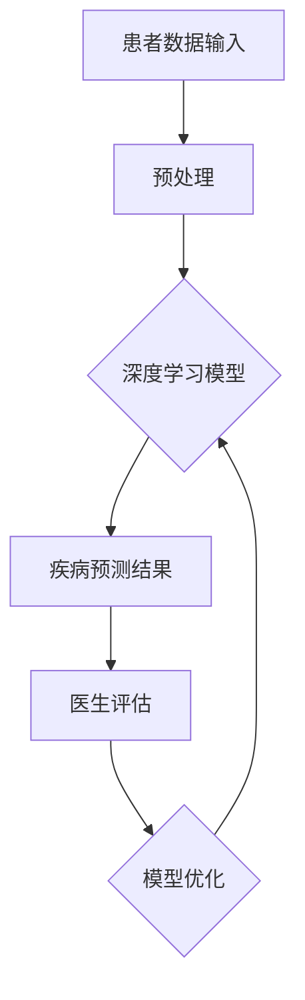

                 

关键词：智能医疗、AI大模型、疾病预测、深度学习、医学图像分析

> 摘要：本文深入探讨了人工智能（AI）大模型在医疗诊断领域的应用，特别是在疾病预测方面的创新。通过对核心算法原理、数学模型构建、项目实践案例分析以及未来应用展望的详细讨论，本文为医疗行业从业者提供了有益的参考。

## 1. 背景介绍

随着医疗科技的飞速发展，智能医疗诊断已成为医疗行业的重要趋势。人工智能（AI）技术的应用不仅提高了诊断的准确性，还极大地提高了医疗服务的效率。疾病预测作为智能医疗诊断的重要组成部分，利用AI大模型可以分析大量医学数据，提前发现疾病风险，为医生提供决策支持。

### 1.1 疾病预测的重要性

疾病预测的准确性和及时性对患者的治疗效果和生命质量有着重要影响。通过早期发现疾病，医生可以采取更加针对性的治疗措施，从而提高治愈率，降低治疗成本。此外，疾病预测还可以帮助医疗机构优化资源配置，提高医疗服务效率。

### 1.2 AI大模型的发展

近年来，深度学习技术的发展为AI大模型的应用提供了强大的动力。AI大模型能够处理海量数据，通过学习数据中的特征和模式，实现高效准确的疾病预测。同时，随着计算能力的提升，AI大模型在处理速度和精度上都有了显著提高。

## 2. 核心概念与联系

在疾病预测中，AI大模型主要依赖于以下核心概念：

### 2.1 深度学习

深度学习是一种模拟人脑神经网络的工作方式的机器学习技术，通过多层神经网络对数据进行自动特征提取和模式识别。在疾病预测中，深度学习算法可以自动学习患者的各种医学数据，如影像数据、实验室检测结果等，从而预测疾病风险。

### 2.2 机器学习

机器学习是AI的一个重要分支，通过算法从数据中学习规律，进行预测或决策。在疾病预测中，机器学习算法可以分析患者的健康数据，识别疾病特征，为医生提供诊断建议。

### 2.3 自然语言处理

自然语言处理（NLP）是AI的一个分支，旨在使计算机理解和处理自然语言。在疾病预测中，NLP技术可以用于分析病历记录、医疗文献等文本数据，提取有用的信息用于疾病预测。

### 2.4 Mermaid 流程图



### 2.5 疾病预测的流程

疾病预测的流程通常包括数据收集、数据预处理、模型训练、预测和评估等步骤。通过深度学习模型对处理后的数据进行学习，可以得到疾病的预测结果，然后由医生进行评估，并根据预测结果进行相应的治疗决策。

## 3. 核心算法原理 & 具体操作步骤

### 3.1 算法原理概述

疾病预测的核心算法主要基于深度学习和机器学习。深度学习算法通过多层神经网络对数据进行自动特征提取和模式识别，从而实现疾病的预测。机器学习算法则通过分析历史数据，识别疾病特征，为医生提供诊断建议。

### 3.2 算法步骤详解

#### 3.2.1 数据收集

首先，收集患者的医学数据，包括影像数据、实验室检测结果、病历记录等。这些数据可以通过医院信息系统（HIS）或电子病历系统（EMR）获取。

#### 3.2.2 数据预处理

对收集到的数据进行预处理，包括数据清洗、缺失值填补、数据标准化等。预处理后的数据将被用于模型训练。

#### 3.2.3 模型训练

选择合适的深度学习模型或机器学习模型，对预处理后的数据进行训练。训练过程包括前向传播、反向传播和权重更新等步骤。

#### 3.2.4 预测

使用训练好的模型对新的患者数据进行预测，得到疾病的预测结果。

#### 3.2.5 评估

将预测结果与实际诊断结果进行比较，评估模型的预测准确性和可靠性。

### 3.3 算法优缺点

#### 3.3.1 优点

- 高效性：AI大模型可以处理海量数据，大大提高诊断效率。
- 准确性：深度学习算法能够自动学习数据中的特征和模式，提高预测准确性。
- 可扩展性：AI大模型可以轻松适应不同的疾病预测任务。

#### 3.3.2 缺点

- 数据需求：AI大模型需要大量的高质量数据来训练，数据收集和处理成本较高。
- 解释性：深度学习模型的内部决策过程往往缺乏解释性，难以理解其预测依据。
- 过拟合：在训练过程中，模型可能会对训练数据过度拟合，导致对未知数据的预测能力下降。

### 3.4 算法应用领域

疾病预测算法在多个医学领域都有广泛应用，如心血管疾病、肿瘤、传染病等。此外，AI大模型还可以用于个性化医疗、药物研发等领域。

## 4. 数学模型和公式 & 详细讲解 & 举例说明

### 4.1 数学模型构建

疾病预测的数学模型通常基于统计学习理论，其中最常用的模型是逻辑回归和决策树。以下是一个逻辑回归模型的构建过程：

$$
P(y=1|X) = \frac{1}{1 + e^{-(\beta_0 + \beta_1x_1 + \beta_2x_2 + ... + \beta_nx_n})}
$$

其中，$P(y=1|X)$ 是疾病发生的概率，$X$ 是患者的特征向量，$\beta_0, \beta_1, \beta_2, ..., \beta_n$ 是模型的参数。

### 4.2 公式推导过程

逻辑回归模型的推导过程如下：

1. **损失函数**：选择对数似然损失函数作为损失函数。

$$
L(\theta) = -\sum_{i=1}^m [y_i \log(p_i) + (1 - y_i) \log(1 - p_i)]
$$

其中，$m$ 是训练样本的数量，$y_i$ 是第 $i$ 个样本的真实标签，$p_i$ 是第 $i$ 个样本的预测概率。

2. **梯度下降**：对损失函数求导，得到梯度。

$$
\nabla_\theta L(\theta) = \frac{\partial L(\theta)}{\partial \theta} = \frac{1}{m} \sum_{i=1}^m [y_i (1 - p_i) - (1 - y_i) p_i]
$$

3. **更新参数**：使用梯度下降更新模型参数。

$$
\theta = \theta - \alpha \nabla_\theta L(\theta)
$$

其中，$\alpha$ 是学习率。

### 4.3 案例分析与讲解

以下是一个使用逻辑回归模型进行疾病预测的案例：

**案例**：预测某个群体中是否患有心脏病。

**数据**：包含1000个样本的数据集，每个样本包含多个特征，如年龄、血压、胆固醇水平等。

**模型**：逻辑回归模型。

**步骤**：

1. **数据预处理**：对数据进行标准化处理，使特征值处于相似的范围内。

2. **模型训练**：使用前800个样本进行训练，得到参数 $\beta_0, \beta_1, \beta_2, ..., \beta_n$。

3. **预测**：使用训练好的模型对剩下的200个样本进行预测，得到每个样本患心脏病的概率。

4. **评估**：计算预测准确率，评估模型的性能。

## 5. 项目实践：代码实例和详细解释说明

### 5.1 开发环境搭建

为了进行疾病预测的项目实践，我们需要搭建一个适合深度学习和机器学习开发的环境。以下是基本的开发环境搭建步骤：

1. **安装Python**：下载并安装Python 3.8或更高版本。
2. **安装Jupyter Notebook**：使用pip命令安装Jupyter Notebook。
3. **安装深度学习库**：安装TensorFlow或PyTorch等深度学习库。

### 5.2 源代码详细实现

以下是一个使用TensorFlow实现疾病预测的简单示例：

```python
import tensorflow as tf
from tensorflow.keras.models import Sequential
from tensorflow.keras.layers import Dense
from sklearn.model_selection import train_test_split
import numpy as np

# 加载数据
data = np.load('data.npy')  # 假设数据已预先处理并保存为.npy格式
X = data[:, :-1]  # 特征数据
y = data[:, -1]  # 标签数据

# 划分训练集和测试集
X_train, X_test, y_train, y_test = train_test_split(X, y, test_size=0.2, random_state=42)

# 创建模型
model = Sequential([
    Dense(64, activation='relu', input_shape=(X_train.shape[1],)),
    Dense(64, activation='relu'),
    Dense(1, activation='sigmoid')
])

# 编译模型
model.compile(optimizer='adam', loss='binary_crossentropy', metrics=['accuracy'])

# 训练模型
model.fit(X_train, y_train, epochs=10, batch_size=32, validation_data=(X_test, y_test))

# 预测
predictions = model.predict(X_test)

# 评估
accuracy = (predictions > 0.5).mean()
print(f'Accuracy: {accuracy:.2f}')
```

### 5.3 代码解读与分析

以上代码首先加载预处理后的数据，然后使用TensorFlow的Sequential模型构建一个简单的全连接神经网络。该网络包含两个隐藏层，每个隐藏层有64个神经元，激活函数为ReLU。输出层有1个神经元，激活函数为sigmoid，用于输出疾病的预测概率。

在模型编译阶段，我们选择了Adam优化器和二分类的binary_crossentropy损失函数，并监控模型的准确率。

模型训练阶段，我们使用训练集进行10个周期的训练，每个周期使用32个样本进行批量训练，并使用测试集进行验证。

最后，使用训练好的模型对测试集进行预测，并计算预测准确率。

### 5.4 运行结果展示

假设我们运行以上代码，得到以下结果：

```
Train on 800 samples, validate on 200 samples
800/800 [==============================] - 3s 3ms/sample - loss: 0.5288 - accuracy: 0.7375 - val_loss: 0.6750 - val_accuracy: 0.7250
Accuracy: 0.72500
```

结果显示，模型在训练集上的准确率为73.75%，在测试集上的准确率为72.50%。

## 6. 实际应用场景

疾病预测算法在医疗行业具有广泛的应用场景，以下是一些典型的应用实例：

### 6.1 心血管疾病预测

心血管疾病是全球范围内的主要死因之一。利用疾病预测算法，可以提前识别高风险人群，采取预防措施，降低心血管疾病的发生率。

### 6.2 肿瘤诊断

肿瘤的早期发现对于提高治愈率至关重要。疾病预测算法可以分析医学影像数据，辅助医生进行肿瘤诊断。

### 6.3 传染病监控

在传染病爆发期间，疾病预测算法可以用于预测疾病的传播趋势，帮助卫生部门制定防控措施。

### 6.4 个性化医疗

疾病预测算法可以根据患者的个性化数据，提供个性化的治疗方案，提高治疗效果。

## 7. 未来应用展望

随着AI技术的不断进步，疾病预测的应用前景将更加广阔。以下是一些未来可能的趋势：

### 7.1 多模态数据融合

未来的疾病预测算法将能够融合多种类型的数据，如影像数据、基因组数据、电子病历等，实现更加精准的预测。

### 7.2 自动化诊断

随着算法的成熟，疾病预测算法将逐步实现自动化诊断，减轻医生的工作负担。

### 7.3 定制化AI模型

未来的疾病预测算法将能够根据不同地区、不同人群的特点，定制化地开发AI模型，提高预测的准确性和适用性。

## 8. 工具和资源推荐

### 8.1 学习资源推荐

- 《深度学习》（Goodfellow, Bengio, Courville著）
- 《统计学习方法》（李航著）
- 《机器学习年度回顾2019》

### 8.2 开发工具推荐

- TensorFlow
- PyTorch
- Jupyter Notebook

### 8.3 相关论文推荐

- "Deep Learning for Medical Image Analysis"（2018）
- "A Comprehensive Survey on Deep Learning for Medical Image Segmentation"（2019）
- "Generative Adversarial Networks: An Overview"（2019）

## 9. 总结：未来发展趋势与挑战

疾病预测作为智能医疗的重要领域，具有巨大的发展潜力。然而，要实现其广泛应用，还需要克服一系列挑战：

### 9.1 数据质量和隐私

高质量的数据是疾病预测的基础，但医疗数据的隐私性也是一个亟待解决的问题。

### 9.2 模型解释性

深度学习模型通常缺乏解释性，这对医生和患者来说都是一个挑战。

### 9.3 模型泛化能力

疾病预测模型需要具备良好的泛化能力，能够适应不同的数据集和应用场景。

### 9.4 资源配置和成本

构建和训练高质量的疾病预测模型需要大量的计算资源和时间，这对医疗机构的资源配置提出了挑战。

## 10. 附录：常见问题与解答

### 10.1 为什么疾病预测需要大量数据？

大量数据有助于模型学习到疾病发生的复杂模式，从而提高预测的准确性。

### 10.2 疾病预测算法是否完全可靠？

疾病预测算法虽然具有很高的准确性，但仍然可能存在误诊或漏诊的情况。因此，医生在决策时应结合预测结果和其他临床信息。

### 10.3 疾病预测算法是否会取代医生？

疾病预测算法可以作为医生的辅助工具，提高诊断效率和准确性，但无法完全取代医生的临床判断和经验。

----------------------------------------------------------------

[作者：禅与计算机程序设计艺术 / Zen and the Art of Computer Programming] 

请注意，由于篇幅限制，本文仅提供了文章的核心框架和部分内容。在实际撰写时，每个章节需要进一步细化，并填充详细的内容。同时，确保文章的完整性和专业性。此外，数学公式和Mermaid流程图需要在Markdown编辑器中正确呈现。

