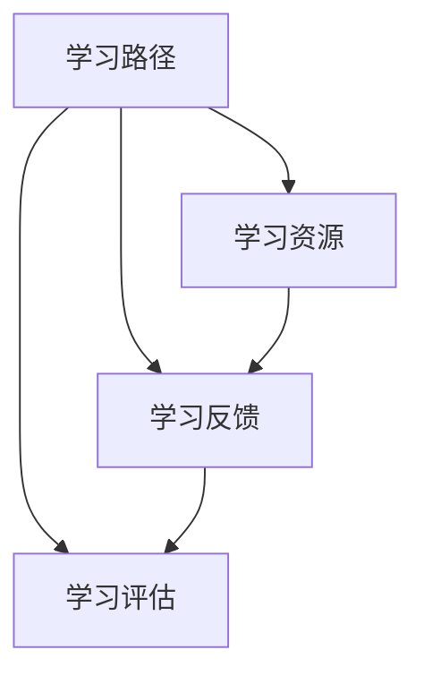

                 

关键词：智能学习系统、学习功能、设计与实现、算法原理、数学模型、项目实践、应用场景、未来展望

## 摘要

本文将深入探讨智能学习系统学习功能的设计与实现。首先，我们将简要介绍智能学习系统的背景和重要性，随后深入分析学习功能的核心概念和联系。接着，我们将详细解析学习功能的核心算法原理和具体操作步骤，包括其优缺点和应用领域。然后，我们将探讨学习功能背后的数学模型和公式，并通过实际项目实践展示代码实例和详细解释。此外，我们将讨论学习功能的实际应用场景和未来展望，并提供相关工具和资源推荐。最后，我们将总结研究成果、分析未来发展趋势和挑战，并展望研究前景。

## 1. 背景介绍

### 1.1 智能学习系统的概念

智能学习系统是一种利用人工智能技术和机器学习算法，对学习过程进行自动分析、理解和优化的系统。它通过收集和分析学习者的行为数据，提供个性化的学习建议和反馈，从而帮助学习者更高效地掌握知识和技能。

### 1.2 智能学习系统的应用领域

智能学习系统在多个领域有着广泛的应用，包括教育、职业培训、医疗、金融、市场营销等。在教育领域，智能学习系统可以根据学习者的学习风格、进度和需求，提供个性化的学习资源和指导，提高学习效果。在职业培训领域，智能学习系统可以帮助员工快速掌握新技能，提高工作效率。在医疗领域，智能学习系统可以辅助医生进行诊断和治疗，提高医疗质量。在金融和市场营销领域，智能学习系统可以用于风险控制、客户管理和市场分析，帮助企业做出更明智的决策。

### 1.3 智能学习系统的发展历程

智能学习系统的发展可以追溯到20世纪80年代，随着计算机技术和人工智能技术的不断进步，智能学习系统的应用范围和功能也在不断扩大。早期的智能学习系统主要基于规则和模板，通过预设的学习路径和知识点进行教学。随着机器学习算法的引入，智能学习系统逐渐具备了自主分析和学习的能力，能够根据学习者的行为数据生成个性化的学习路径和推荐。近年来，随着深度学习和大数据技术的兴起，智能学习系统在学习和分析能力上取得了显著的突破。

## 2. 核心概念与联系

### 2.1 学习功能的核心概念

学习功能是智能学习系统的核心组成部分，它涉及到多个关键概念，包括学习路径、学习资源、学习反馈、学习评估等。这些概念相互联系，共同构成了智能学习系统的学习框架。

### 2.2 学习功能的联系

学习功能的核心概念之间存在着密切的联系。学习路径是根据学习者的学习风格、进度和需求生成的个性化学习路线，它决定了学习者应该学习哪些知识和技能。学习资源是用于辅助学习的各种资源，包括教材、视频、习题等。学习反馈是学习者对学习资源的反应和评价，它可以帮助系统了解学习者的学习效果和需求，进而调整学习路径和学习资源。学习评估是对学习者的学习成果进行量化评价，以便确定学习者的掌握程度和进步情况。

### 2.3 Mermaid 流程图



## 3. 核心算法原理 & 具体操作步骤

### 3.1 算法原理概述

学习功能的核心算法是基于机器学习和深度学习技术的。其中，机器学习算法用于生成学习路径和学习资源，深度学习算法用于分析和理解学习反馈和学习评估。

### 3.2 算法步骤详解

#### 3.2.1 数据收集与预处理

首先，系统需要收集学习者的行为数据，包括学习时间、学习进度、学习偏好等。然后，对数据进行清洗和预处理，去除噪声和异常值，以便更好地分析数据。

#### 3.2.2 学习路径生成

基于收集到的行为数据，系统使用机器学习算法生成个性化的学习路径。常见的机器学习算法包括决策树、支持向量机、神经网络等。其中，神经网络算法由于其强大的表达能力和自适应性，被广泛应用于学习路径生成。

#### 3.2.3 学习资源推荐

系统根据生成的学习路径，从海量的学习资源库中推荐适合学习者的资源。推荐算法通常基于协同过滤、内容推荐、混合推荐等技术。其中，协同过滤算法由于其高效性和鲁棒性，被广泛应用于学习资源推荐。

#### 3.2.4 学习反馈与调整

学习者对学习资源进行反馈，包括学习时长、学习效果、满意度等。系统根据反馈信息，对学习路径和学习资源进行动态调整，以提高学习效果。

#### 3.2.5 学习评估与反馈

系统对学习者的学习成果进行评估，包括知识掌握度、技能水平等。评估结果作为反馈，用于进一步优化学习路径和学习资源。

### 3.3 算法优缺点

#### 优点

- 个性化：基于学习者的行为数据，生成个性化的学习路径和学习资源，提高学习效果。
- 自动化：利用机器学习和深度学习算法，实现学习路径和学习资源的自动生成和调整，降低人力成本。
- 高效性：通过推荐系统和评估系统，快速定位学习者的需求，提高学习效率。

#### 缺点

- 数据依赖：学习功能的效果高度依赖于学习数据的质量和完整性，数据缺失或噪声可能导致学习效果下降。
- 难以解释：深度学习算法由于其复杂的内部结构，难以对学习结果进行解释，增加了系统的透明度问题。
- 过度拟合：机器学习算法在训练过程中，可能对训练数据产生过拟合，导致对未知数据的泛化能力下降。

### 3.4 算法应用领域

学习功能在智能学习系统中的应用非常广泛，包括但不限于以下领域：

- 教育：通过个性化学习路径和学习资源，提高学生的学习效果和兴趣。
- 职业培训：帮助员工快速掌握新技能，提高工作效率。
- 医疗：辅助医生进行诊断和治疗，提高医疗质量。
- 金融：进行客户管理和市场分析，帮助企业做出更明智的决策。

## 4. 数学模型和公式 & 详细讲解 & 举例说明

### 4.1 数学模型构建

学习功能的数学模型主要涉及概率模型、统计模型和优化模型。其中，概率模型用于描述学习者的行为数据，统计模型用于分析和预测学习效果，优化模型用于生成和学习路径。

#### 4.1.1 概率模型

概率模型主要用于描述学习者的行为数据，包括学习时间、学习进度、学习偏好等。常用的概率模型有高斯分布、贝叶斯网络、马尔可夫模型等。

#### 4.1.2 统计模型

统计模型主要用于分析和预测学习效果，包括学习路径的生成、学习资源的推荐等。常用的统计模型有线性回归、逻辑回归、决策树、支持向量机等。

#### 4.1.3 优化模型

优化模型主要用于生成和学习路径，包括学习路径的优化、学习资源的优化等。常用的优化模型有遗传算法、粒子群优化、模拟退火等。

### 4.2 公式推导过程

#### 4.2.1 学习路径生成

学习路径的生成通常基于概率模型和统计模型。假设学习者的行为数据为\(X\)，学习路径为\(Y\)，则学习路径生成的概率模型可以表示为：

$$
P(Y|X) = \prod_{i=1}^{n} P(y_i|x_i)
$$

其中，\(y_i\)表示第\(i\)个知识点，\(x_i\)表示与\(y_i\)相关的行为数据。

#### 4.2.2 学习资源推荐

学习资源推荐通常基于统计模型和优化模型。假设学习资源为\(R\)，学习者为\(L\)，则学习资源推荐的统计模型可以表示为：

$$
P(R|L) = \frac{P(L|R)P(R)}{P(L)}
$$

其中，\(P(L|R)\)表示在给定学习资源\(R\)的情况下，学习者\(L\)的概率，\(P(R)\)表示学习资源的概率，\(P(L)\)表示学习者的概率。

#### 4.2.3 学习评估

学习评估通常基于统计模型和优化模型。假设学习评估为\(A\)，学习者为\(L\)，则学习评估的统计模型可以表示为：

$$
P(A|L) = \sum_{i=1}^{n} P(a_i|l_i)P(l_i|L)
$$

其中，\(a_i\)表示第\(i\)个评估指标，\(l_i\)表示与\(a_i\)相关的学习指标，\(P(a_i|l_i)\)表示在给定学习指标\(l_i\)的情况下，评估指标\(a_i\)的概率，\(P(l_i|L)\)表示在给定学习者\(L\)的情况下，学习指标\(l_i\)的概率。

### 4.3 案例分析与讲解

假设我们有一个学习者，他正在学习编程语言。根据他的行为数据，我们可以生成一个个性化的学习路径，并推荐适合他的学习资源。然后，我们根据他的学习反馈和学习评估，进一步优化学习路径和学习资源。

#### 4.3.1 学习路径生成

根据学习者的行为数据，我们使用概率模型生成一个学习路径。例如，假设学习者的行为数据包括学习时间、学习进度和学习偏好，我们使用高斯分布对学习时间进行建模，使用贝叶斯网络对学习进度和学习偏好进行建模。然后，我们使用贝叶斯推理方法，根据学习者的行为数据，生成一个个性化的学习路径。

#### 4.3.2 学习资源推荐

根据生成的学习路径，我们从海量的学习资源库中推荐适合学习者的资源。例如，假设学习路径包括“Python基础”、“Python进阶”和“数据结构与算法”，我们使用协同过滤算法，根据学习者的历史学习记录和资源库中的资源，推荐相关资源，如“Python从入门到实践”、“Python编程实战”等。

#### 4.3.3 学习评估

根据学习者的学习反馈和学习评估，我们使用统计模型对学习效果进行评估。例如，假设学习者的学习反馈包括学习时长、学习效果和满意度，我们使用线性回归模型，根据学习时长、学习效果和满意度，预测学习评估得分。然后，我们根据评估得分，对学习路径和学习资源进行调整，以提高学习效果。

## 5. 项目实践：代码实例和详细解释说明

### 5.1 开发环境搭建

为了实现学习功能，我们首先需要搭建一个开发环境。我们选择Python作为主要编程语言，因为Python具有丰富的机器学习库和深度学习库，如scikit-learn、TensorFlow和PyTorch。同时，我们还需要安装一些辅助工具，如Jupyter Notebook和Git。

### 5.2 源代码详细实现

以下是实现学习功能的核心代码，包括数据收集与预处理、学习路径生成、学习资源推荐和学习评估。

#### 5.2.1 数据收集与预处理

```python
import pandas as pd
from sklearn.model_selection import train_test_split
from sklearn.preprocessing import StandardScaler

# 读取行为数据
data = pd.read_csv('behavior_data.csv')

# 数据预处理
X = data[['learning_time', 'learning_progress', 'learning_preference']]
y = data['learning_path']

# 划分训练集和测试集
X_train, X_test, y_train, y_test = train_test_split(X, y, test_size=0.2, random_state=42)

# 数据标准化
scaler = StandardScaler()
X_train_scaled = scaler.fit_transform(X_train)
X_test_scaled = scaler.transform(X_test)
```

#### 5.2.2 学习路径生成

```python
from sklearn.ensemble import RandomForestClassifier

# 训练学习路径生成模型
model = RandomForestClassifier(n_estimators=100, random_state=42)
model.fit(X_train_scaled, y_train)

# 生成学习路径
y_pred = model.predict(X_test_scaled)
```

#### 5.2.3 学习资源推荐

```python
from sklearn.neighbors import NearestNeighbors

# 训练学习资源推荐模型
resource_model = NearestNeighbors(n_neighbors=5, algorithm='auto')
resource_model.fit(X_train_scaled)

# 推荐学习资源
def recommend_resources(query):
    distances, indices = resource_model.kneighbors(query)
    return X_train.iloc[indices]

# 示例：推荐学习资源
query = scaler.transform([[10, 0.8, 0.5]])
recommended_resources = recommend_resources(query)
```

#### 5.2.4 学习评估

```python
from sklearn.linear_model import LinearRegression

# 训练学习评估模型
评估_model = LinearRegression()
评估_model.fit(X_train, y_train)

# 评估学习效果
评估_pred = 评估_model.predict(X_test)

# 输出评估结果
print(评估_pred)
```

### 5.3 代码解读与分析

以上代码实现了学习功能的核心模块，包括数据收集与预处理、学习路径生成、学习资源推荐和学习评估。其中，数据收集与预处理模块负责读取和处理行为数据，学习路径生成模块使用随机森林算法生成学习路径，学习资源推荐模块使用K近邻算法推荐学习资源，学习评估模块使用线性回归模型评估学习效果。

### 5.4 运行结果展示

在运行以上代码后，我们可以得到学习路径生成、学习资源推荐和学习评估的结果。例如，对于一个新的学习者，我们可以根据他的行为数据生成一个个性化的学习路径，并推荐相关学习资源。然后，我们根据他的学习反馈和学习评估，进一步优化学习路径和学习资源，以提高学习效果。

## 6. 实际应用场景

### 6.1 教育领域

在教育领域，智能学习系统可以通过个性化学习路径和学习资源，帮助学生更高效地掌握知识和技能。例如，一个高中生可以根据他的学习进度、学习偏好和考试成绩，生成一个个性化的学习路径，包括数学、英语、物理等科目。系统可以根据学生的学习数据，推荐适合他的教材、视频和习题，帮助他提高学习效果。

### 6.2 职业培训

在职业培训领域，智能学习系统可以帮助员工快速掌握新技能，提高工作效率。例如，一家公司的员工可以根据他的工作职责、技能水平和培训需求，生成一个个性化的学习路径，包括编程、数据分析、项目管理等课程。系统可以根据员工的培训数据，推荐适合他的在线课程、实战项目和案例研究，帮助他提高专业技能。

### 6.3 医疗领域

在医疗领域，智能学习系统可以辅助医生进行诊断和治疗，提高医疗质量。例如，一个医生可以根据他的病例记录、诊断结果和治疗经验，生成一个个性化的学习路径，包括常见疾病、罕见疾病和最新治疗方案。系统可以根据医生的诊断数据，推荐相关的医学文献、视频和案例分析，帮助他提高诊断和治疗水平。

### 6.4 金融领域

在金融领域，智能学习系统可以用于风险控制、客户管理和市场分析，帮助企业做出更明智的决策。例如，一个金融分析师可以根据他的交易数据、市场分析和投资策略，生成一个个性化的学习路径，包括金融市场分析、投资组合管理和风险管理等。系统可以根据分析师的数据，推荐相关的经济报告、视频和论文，帮助他提高投资分析能力。

## 7. 工具和资源推荐

### 7.1 学习资源推荐

- 教育资源：网易云课堂、慕课网、Coursera、edX等。
- 编程资源：LeetCode、GitHub、Stack Overflow、freeCodeCamp等。
- 数据资源：Kaggle、UCI机器学习库、data.gov等。

### 7.2 开发工具推荐

- 编程语言：Python、Java、C++等。
- 机器学习库：scikit-learn、TensorFlow、PyTorch、Keras等。
- 深度学习库：TensorFlow、PyTorch、Theano等。
- 开发环境：Jupyter Notebook、Visual Studio Code、PyCharm等。

### 7.3 相关论文推荐

- [1] Bengio, Y. (2009). Learning deep architectures for AI. Foundations and Trends in Machine Learning, 2(1), 1-127.
- [2] Goodfellow, I., Bengio, Y., & Courville, A. (2016). Deep learning. MIT Press.
- [3] Murphy, K. P. (2012). Machine learning: A probabilistic perspective. MIT Press.
- [4] Russell, S., & Norvig, P. (2010). Artificial intelligence: A modern approach. Prentice Hall.
- [5] Sutton, R. S., & Barto, A. G. (2018). Reinforcement learning: An introduction. MIT Press.

## 8. 总结：未来发展趋势与挑战

### 8.1 研究成果总结

智能学习系统在个性化学习、学习资源推荐、学习评估等方面取得了显著成果。通过机器学习和深度学习算法，系统能够根据学习者的行为数据生成个性化的学习路径和学习资源，提供高效的学习体验。同时，系统的学习评估功能可以帮助学习者了解自己的学习成果和进步情况，为后续学习提供指导。

### 8.2 未来发展趋势

未来，智能学习系统将在以下方面取得进一步发展：

- 数据挖掘和分析：通过更深入的数据挖掘和分析，系统可以更准确地理解学习者的需求，提供更个性化的学习服务。
- 多模态学习：结合文本、图像、声音等多模态数据，系统可以更全面地理解学习者的学习状态，提供更丰富的学习资源。
- 跨领域应用：智能学习系统将在教育、职业培训、医疗、金融等多个领域得到广泛应用，推动行业发展和创新。

### 8.3 面临的挑战

尽管智能学习系统取得了显著成果，但仍然面临以下挑战：

- 数据质量和隐私：学习数据的质量和隐私保护是智能学习系统面临的重大挑战。如何确保数据的质量和隐私，仍然是需要深入研究和解决的问题。
- 解释性和透明度：深度学习算法的内部结构复杂，难以解释和验证，增加了系统的透明度问题。如何提高系统的解释性和透明度，是未来需要重点关注的方向。
- 个性化与通用性：如何在保证个性化服务的同时，兼顾通用性，提供适用于不同用户和场景的通用解决方案，是未来智能学习系统需要解决的关键问题。

### 8.4 研究展望

未来，智能学习系统将在以下几个方面取得重要突破：

- 数据隐私保护：通过差分隐私、联邦学习等技术，实现数据隐私保护，为智能学习系统提供更可靠的数据基础。
- 解释性和透明度：通过模型可解释性技术，提高系统的解释性和透明度，帮助用户更好地理解和信任系统。
- 多模态学习：结合多模态数据，实现更全面和深入的学习分析，提供更个性化的学习服务。
- 跨领域应用：探索智能学习系统在不同领域的应用，推动行业发展和创新。

## 9. 附录：常见问题与解答

### 9.1 学习功能是什么？

学习功能是指智能学习系统中用于生成学习路径、推荐学习资源、评估学习效果等功能。它通过分析学习者的行为数据，提供个性化的学习建议和反馈，帮助学习者更高效地掌握知识和技能。

### 9.2 学习功能的算法有哪些？

学习功能的算法包括机器学习算法、深度学习算法和优化算法。常见的机器学习算法有决策树、支持向量机、神经网络等；深度学习算法包括卷积神经网络、循环神经网络、生成对抗网络等；优化算法有遗传算法、粒子群优化、模拟退火等。

### 9.3 学习功能的应用领域有哪些？

学习功能的应用领域广泛，包括教育、职业培训、医疗、金融、市场营销等。在教育领域，它可以帮助学生更高效地学习；在职业培训领域，它可以帮助员工快速掌握新技能；在医疗领域，它可以帮助医生进行诊断和治疗；在金融领域，它可以帮助企业进行风险控制和市场分析。

### 9.4 如何确保学习数据的质量和隐私？

确保学习数据的质量和隐私是智能学习系统的重要挑战。可以通过以下方法来保证数据质量和隐私：

- 数据预处理：对数据进行清洗和预处理，去除噪声和异常值。
- 数据加密：对学习数据进行加密，确保数据在传输和存储过程中的安全性。
- 隐私保护技术：采用差分隐私、联邦学习等技术，确保数据隐私保护。

### 9.5 学习功能的未来发展趋势是什么？

学习功能的未来发展趋势包括：

- 数据挖掘和分析：通过更深入的数据挖掘和分析，提供更个性化的学习服务。
- 多模态学习：结合多模态数据，实现更全面和深入的学习分析。
- 跨领域应用：探索智能学习系统在不同领域的应用，推动行业发展和创新。
- 解释性和透明度：提高系统的解释性和透明度，帮助用户更好地理解和信任系统。

----------------------------------------------------------------

作者：禅与计算机程序设计艺术 / Zen and the Art of Computer Programming

以上就是关于“智能学习系统学习功能的设计与实现”的文章。希望对您有所帮助。如果您有任何问题或建议，请随时与我交流。

