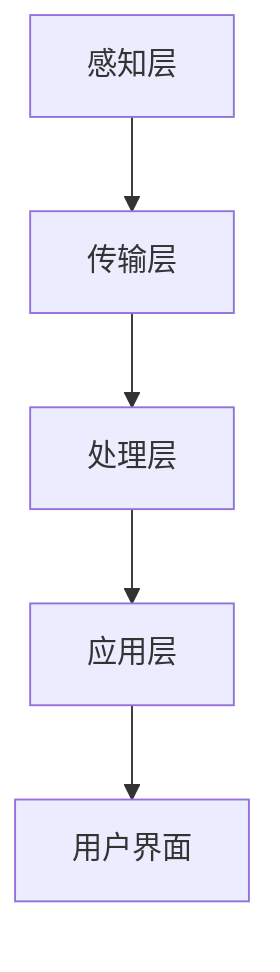

                 

关键词：智能家居，物联网，创业，生活方式，技术趋势

> 摘要：随着物联网技术的飞速发展，智能家居行业正迅速崛起，成为未来生活方式的重要组成部分。本文将深入探讨智能家居创业的现状、核心概念、技术原理、应用案例以及未来的发展趋势，旨在为读者提供一个全面的理解和实用的指导。

## 1. 背景介绍

在过去的几十年中，信息技术经历了从计算机到互联网，再到移动互联网的演变。如今，物联网（IoT）成为了新一轮科技革命和产业变革的关键驱动因素。智能家居作为物联网的一个重要应用领域，正以前所未有的速度发展壮大。

### 物联网的崛起

物联网是通过将各种物理设备、传感器、软件和网络连接起来，实现信息的收集、传输和处理。这一概念最早可以追溯到1999年，当时凯斯西储大学的研究人员将一个袜子的传感器连接到互联网，从而实现了对袜子的实时监控。随着无线通信技术和微电子技术的进步，物联网技术逐渐成熟，应用范围也越来越广泛。

### 智能家居的定义

智能家居是指利用物联网技术和家居设备进行智能化的连接和控制，从而为用户提供更加便捷、舒适、安全的居住环境。智能家居系统通常包括智能照明、智能安防、智能温控、智能家电等多个方面。

### 智能家居的兴起

近年来，智能家居行业呈现出了爆发式增长。根据市场研究公司的数据，全球智能家居市场规模预计将在未来几年内达到数千亿美元。智能家居的兴起，不仅满足了人们对于便捷生活的需求，也推动了相关技术的发展。

## 2. 核心概念与联系

### 智能家居的核心概念

智能家居的核心概念主要包括以下几个方面：

1. **物联网**：智能家居系统的基础是物联网技术，它通过将各种家居设备连接起来，实现数据的收集和共享。
2. **传感器**：传感器是智能家居系统的感知器官，用于检测环境变化，并将信息传递给系统。
3. **控制器**：控制器是智能家居系统的“大脑”，负责接收传感器数据，做出决策并控制家居设备的运行。
4. **用户界面**：用户界面是用户与智能家居系统交互的入口，可以通过智能手机、平板电脑等设备进行操作。
5. **数据分析**：数据分析是智能家居系统的“智慧”，通过对用户行为数据的分析，系统可以提供更加个性化的服务。

### 智能家居的架构

智能家居系统通常包括以下几个层级：

1. **感知层**：包括各种传感器，如温度传感器、湿度传感器、光敏传感器等。
2. **传输层**：包括网络通信模块，如Wi-Fi、蓝牙、Zigbee等，用于传输传感器数据。
3. **处理层**：包括控制器和服务器，用于处理传感器数据，做出决策并控制家居设备的运行。
4. **应用层**：包括用户界面和应用软件，用于用户与系统的交互。

### Mermaid 流程图

以下是一个智能家居系统的 Mermaid 流程图：



## 3. 核心算法原理 & 具体操作步骤

### 3.1 算法原理概述

智能家居系统的核心算法主要包括以下几个方面：

1. **数据采集与预处理**：通过传感器收集环境数据，并对数据进行预处理，如滤波、去噪等。
2. **数据融合与决策**：将多个传感器的数据融合起来，形成一个完整的环境模型，并根据模型做出决策。
3. **控制执行**：根据决策结果，控制家居设备的运行，如调整温度、开关灯光等。

### 3.2 算法步骤详解

1. **数据采集**：通过传感器采集环境数据，如温度、湿度、光照强度等。
2. **数据预处理**：对采集到的数据进行分析，去除噪声和异常值，并进行归一化处理。
3. **数据融合**：将多个传感器的数据融合成一个整体，形成一个完整的环境模型。
4. **决策制定**：根据环境模型，制定控制策略，如调整空调温度、打开或关闭灯光等。
5. **控制执行**：执行决策结果，控制家居设备的运行。

### 3.3 算法优缺点

**优点**：
- 提高生活质量：通过智能家居系统，用户可以享受到更加便捷、舒适的生活。
- 节能环保：智能家居系统可以根据环境变化自动调整设备运行状态，从而实现节能环保。
- 提高安全性：智能家居系统可以提供实时监控和报警功能，提高家居安全。

**缺点**：
- 隐私泄露风险：智能家居系统需要收集大量的用户数据，这可能引发隐私泄露的风险。
- 系统稳定性问题：智能家居系统涉及到多种设备和技术，可能存在稳定性问题。
- 安全漏洞：智能家居系统可能存在安全漏洞，导致黑客攻击。

### 3.4 算法应用领域

智能家居算法主要应用在以下几个方面：

1. **家居环境控制**：如温度控制、湿度控制、光照控制等。
2. **家居安全监控**：如入侵报警、火灾报警、煤气泄露报警等。
3. **家居设备管理**：如家电控制、家电预约等。
4. **家居健康监测**：如睡眠监测、运动监测等。

## 4. 数学模型和公式 & 详细讲解 & 举例说明

### 4.1 数学模型构建

智能家居系统的数学模型主要包括以下几个部分：

1. **传感器模型**：用于描述传感器的输出与实际环境之间的关系。
2. **控制器模型**：用于描述控制器的输入与输出之间的关系。
3. **用户模型**：用于描述用户的偏好和行为模式。

### 4.2 公式推导过程

以下是一个简单的传感器模型的推导过程：

假设传感器的输出 \( y \) 与实际环境 \( x \) 成线性关系，即：

\[ y = ax + b \]

其中，\( a \) 和 \( b \) 是常数。

通过对传感器输出数据进行线性回归分析，可以估计出 \( a \) 和 \( b \) 的值，从而建立传感器模型。

### 4.3 案例分析与讲解

假设我们需要建立一个温度传感器模型，用于预测室内温度。

1. **数据采集**：通过温度传感器采集一段时间内的室内温度数据。
2. **数据预处理**：对采集到的温度数据进行清洗，去除异常值和噪声。
3. **线性回归分析**：使用线性回归算法，对温度数据进行拟合，得到温度传感器模型。

假设拟合结果为：

\[ y = 0.8x + 10 \]

其中，\( y \) 是传感器输出，\( x \) 是实际温度。

通过这个模型，我们可以预测未来一段时间内的室内温度。

## 5. 项目实践：代码实例和详细解释说明

### 5.1 开发环境搭建

在搭建智能家居项目开发环境时，我们通常需要以下几个工具：

- **编程语言**：Python 是智能家居开发中最常用的编程语言之一。
- **开发环境**：PyCharm、VSCode 等。
- **传感器模块**：如 DHT11 温湿度传感器、HC-SR501 人体红外传感器等。
- **控制器模块**：如 Raspberry Pi、Arduino 等。
- **网络模块**：如 Wi-Fi 模块、蓝牙模块等。

### 5.2 源代码详细实现

以下是一个简单的智能家居项目的 Python 代码实例：

```python
import time
import serial
import requests

# 传感器初始化
ser = serial.Serial('/dev/ttyUSB0', 9600)

# 控制器初始化
rpi = RaspberryPi()

while True:
    # 读取传感器数据
    data = ser.readline()
    temp, hum = data.split(',')
    
    # 数据预处理
    temp = float(temp)
    hum = float(hum)
    
    # 发送数据到服务器
    url = 'http://example.com/smart-home'
    payload = {
        'temp': temp,
        'hum': hum
    }
    requests.post(url, data=payload)
    
    # 控制空调温度
    if temp > 30:
        rpi.control_aircon('cool')
    else:
        rpi.control_aircon('heat')
    
    # 控制灯光
    if hum < 40:
        rpi.control_light('on')
    else:
        rpi.control_light('off')
    
    time.sleep(60)
```

### 5.3 代码解读与分析

这段代码首先初始化了传感器和控制器模块，然后进入一个无限循环，每隔 60 秒读取一次传感器数据，并将数据发送到服务器。根据接收到的温度和湿度数据，代码会控制空调和灯光的开关。

### 5.4 运行结果展示

在运行这段代码后，我们可以通过服务器获取传感器数据，并根据数据控制空调和灯光的开关。

## 6. 实际应用场景

### 6.1 家庭环境

智能家居在家庭环境中有着广泛的应用。例如，用户可以通过手机或智能音箱控制家中的灯光、空调、窗帘等设备，实现远程控制和自动化操作。

### 6.2 商业空间

智能家居在商业空间中的应用也非常广泛。例如，在酒店、办公室、商场等地方，通过智能家居系统可以实现自动化的环境控制、安全监控、能耗管理等。

### 6.3 物流与仓储

智能家居在物流与仓储领域的应用主要体现在环境监控和设备管理。例如，通过传感器实时监控仓库内的温度、湿度等环境参数，确保货物存储的安全。

### 6.4 健康医疗

智能家居在健康医疗领域的应用主要体现在健康监测和远程医疗。例如，通过智能设备监测患者的血压、心率等生理参数，实现健康数据的实时监控。

## 7. 工具和资源推荐

### 7.1 学习资源推荐

1. **《物联网技术应用》**：介绍了物联网的基本概念、技术和应用。
2. **《智能家居设计与应用》**：详细讲解了智能家居的设计原则和实现方法。
3. **《Python 编程：从入门到实践》**：适合初学者学习和掌握 Python 编程。

### 7.2 开发工具推荐

1. **Raspberry Pi**：一款低成本、高性能的微型计算机，适合智能家居项目开发。
2. **Arduino**：一款开源的嵌入式开发平台，适用于各种智能家居设备开发。
3. **VSCode**：一款强大的代码编辑器，支持多种编程语言。

### 7.3 相关论文推荐

1. **《智能家居系统架构设计与实现》**：详细介绍了智能家居系统的架构设计和实现方法。
2. **《基于物联网的智能家居安全研究》**：探讨了智能家居系统的安全问题和解决方案。

## 8. 总结：未来发展趋势与挑战

### 8.1 研究成果总结

智能家居领域的研究成果主要集中在以下几个方面：

- **技术进步**：物联网技术、人工智能技术、传感器技术的不断进步，为智能家居的发展提供了强大的技术支持。
- **应用拓展**：智能家居的应用场景越来越广泛，从家庭、商业空间到物流、医疗等各个领域都有所涉及。
- **商业模式创新**：随着智能家居市场的不断扩大，各种商业模式不断创新，如智能家居套餐、智能家居租赁等。

### 8.2 未来发展趋势

智能家居的未来发展趋势主要包括以下几个方面：

- **智能化水平提升**：随着人工智能技术的不断发展，智能家居系统的智能化水平将不断提升，提供更加个性化的服务。
- **跨界融合**：智能家居与其他行业的融合将进一步加深，如智慧城市建设、智慧农业等。
- **生态构建**：智能家居企业将致力于构建完整的智能家居生态，提供从硬件到软件、从设备到服务的全方位解决方案。

### 8.3 面临的挑战

智能家居在发展过程中也面临一些挑战：

- **隐私保护**：智能家居系统需要收集大量的用户数据，隐私保护成为一个重要问题。
- **系统稳定性**：智能家居系统涉及到多种设备和技术，系统稳定性是一个挑战。
- **安全漏洞**：智能家居系统可能存在安全漏洞，需要加强安全防护。

### 8.4 研究展望

未来的智能家居研究将聚焦于以下几个方面：

- **隐私保护技术**：研究更加有效的隐私保护技术，确保用户数据的安全。
- **智能决策算法**：研究更加智能的决策算法，提高智能家居系统的智能化水平。
- **跨平台兼容性**：研究跨平台的智能家居解决方案，提高系统的兼容性和稳定性。

## 9. 附录：常见问题与解答

### 9.1 智能家居系统如何保障用户隐私？

智能家居系统可以通过以下几种方式保障用户隐私：

- **数据加密**：对用户数据进行加密处理，确保数据在传输和存储过程中的安全性。
- **匿名化处理**：对用户数据进行匿名化处理，去除个人身份信息，降低隐私泄露的风险。
- **用户权限管理**：通过用户权限管理，控制数据访问权限，确保只有授权用户可以访问用户数据。

### 9.2 智能家居系统如何保证系统稳定性？

智能家居系统可以通过以下几种方式保证系统稳定性：

- **模块化设计**：采用模块化设计，将系统划分为多个模块，每个模块独立运行，降低故障风险。
- **冗余设计**：在关键部分采用冗余设计，如备用电源、备用传感器等，提高系统的可靠性。
- **实时监控与预警**：通过实时监控和预警机制，及时发现并处理系统故障，确保系统稳定运行。

### 9.3 智能家居系统如何应对安全漏洞？

智能家居系统可以通过以下几种方式应对安全漏洞：

- **安全防护措施**：采用防火墙、入侵检测等安全防护措施，防止黑客攻击。
- **定期更新与升级**：定期更新和升级系统软件，修复已知漏洞，提高系统的安全性。
- **用户教育**：加强用户教育，提高用户的安全意识，避免因用户操作不当导致的安全漏洞。

## 作者署名

本文作者：禅与计算机程序设计艺术 / Zen and the Art of Computer Programming

通过以上内容，我们可以看到智能家居行业正面临着巨大的机遇和挑战。作为创业者和技术专家，我们需要把握这一趋势，不断创新和突破，为用户带来更加智能、便捷、安全的居住体验。同时，我们也要关注隐私保护、系统稳定性和安全漏洞等问题，确保智能家居系统的可持续发展。

随着物联网技术的不断进步，智能家居行业将继续保持高速发展，成为未来生活方式的重要组成部分。让我们共同期待智能家居带来的美好未来！
----------------------------------------------------------------


