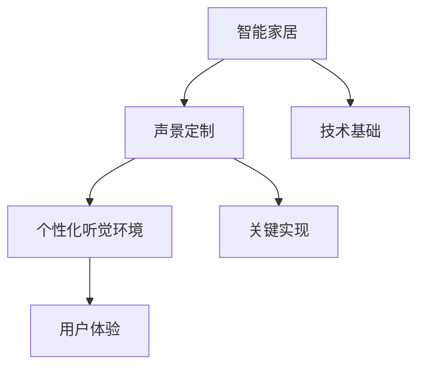

                 

关键词：智能家居、声景定制、个性化听觉环境、创业、技术实现、应用场景

> 摘要：本文将探讨智能家居声景定制的创业机会，分析个性化听觉环境的重要性和实现方法。通过技术原理、数学模型、项目实践以及未来展望，为创业者提供有价值的指导和建议。

## 1. 背景介绍

随着科技的发展，智能家居已经成为现代生活的重要组成部分。人们对于生活品质的追求不断提高，对于居住环境的要求也越来越高。除了视觉和触觉，听觉作为人类感知世界的重要途径，也在智能家居领域得到了广泛关注。声景定制，即根据用户的需求和喜好，为居住环境创造个性化的听觉体验，成为智能家居创业的一大机遇。

### 1.1 智能家居概述

智能家居是指利用互联网、物联网技术，将家庭中的各种设备连接起来，实现智能控制和管理。智能家居系统可以包括智能照明、智能安防、智能家电、智能环境控制等多个方面。随着智能家居市场的不断扩大，用户对于个性化服务的需求也越来越强烈。

### 1.2 声景定制的重要性

声景定制是智能家居领域的一个重要分支，它通过对声音的处理和调控，为用户提供个性化的听觉体验。个性化的听觉环境可以提升用户的生活品质，增强居住环境的舒适度。以下是一些声景定制的重要性：

- **改善睡眠质量**：通过调节噪音、白噪音等功能，帮助用户改善睡眠质量。
- **提升生活乐趣**：通过背景音乐、语音助手等，为用户提供愉悦的生活体验。
- **安全监控**：通过声音传感器，实时监测家居环境中的异常声音，提高安全性。
- **个性化服务**：根据用户的需求和喜好，提供定制化的声音服务，满足个性化需求。

### 1.3 创业机会

随着智能家居市场的快速发展，声景定制创业已经成为一个热门的领域。创业者可以通过以下方式抓住这一机遇：

- **产品研发**：开发基于声景定制的智能家居产品，满足不同用户的需求。
- **技术解决方案**：提供专业的技术解决方案，帮助传统家居企业实现智能化升级。
- **内容创作**：创作个性化声音内容，为用户提供定制化的听觉体验。
- **平台搭建**：搭建声景定制平台，为用户提供一站式的服务。

## 2. 核心概念与联系

### 2.1 核心概念

#### 2.1.1 智能家居

智能家居是指利用互联网、物联网技术，将家庭中的各种设备连接起来，实现智能控制和管理。

#### 2.1.2 声景定制

声景定制是根据用户的需求和喜好，为居住环境创造个性化的听觉体验。

#### 2.1.3 个性化听觉环境

个性化听觉环境是指根据用户的听觉偏好和生活习惯，提供定制化的声音服务。

### 2.2 联系

智能家居、声景定制和个性化听觉环境之间存在着紧密的联系。智能家居为声景定制提供了技术基础，而声景定制则是实现个性化听觉环境的关键。通过智能家居系统，用户可以方便地控制和管理声音设备，实现个性化听觉环境的营造。

### 2.3 Mermaid 流程图



## 3. 核心算法原理 & 具体操作步骤

### 3.1 算法原理概述

声景定制算法的核心原理是声音处理和声音合成。通过对声音的采集、分析、处理和合成，实现个性化听觉环境的营造。

### 3.2 算法步骤详解

#### 3.2.1 声音采集

使用麦克风或其他音频设备采集用户环境中的声音。

#### 3.2.2 声音分析

对采集到的声音进行分析，提取声音的特征参数，如频率、响度、时长等。

#### 3.2.3 声音处理

根据用户的需求和喜好，对声音进行加工处理，如音量调节、音效添加等。

#### 3.2.4 声音合成

将处理后的声音进行合成，生成最终的个性化听觉环境。

### 3.3 算法优缺点

#### 3.3.1 优点

- **个性化**：可以根据用户的需求和喜好，提供定制化的声音服务。
- **便捷**：通过智能家居系统，用户可以方便地控制和管理声音设备。
- **提高生活质量**：通过营造个性化的听觉环境，提升用户的生活品质。

#### 3.3.2 缺点

- **技术要求高**：声景定制算法涉及声音处理和声音合成等技术，对研发团队的要求较高。
- **兼容性问题**：不同设备和平台的兼容性可能成为问题。

### 3.4 算法应用领域

声景定制算法可以应用于多个领域，如智能家居、酒店、医院、办公室等。通过营造个性化的听觉环境，提升用户体验和满意度。

## 4. 数学模型和公式 & 详细讲解 & 举例说明

### 4.1 数学模型构建

声景定制算法的数学模型主要包括声音特征提取、声音处理和声音合成三个部分。

#### 4.1.1 声音特征提取

声音特征提取的数学模型可以表示为：

$$
f(x) = \sum_{i=1}^{n} w_i \cdot x_i
$$

其中，$x_i$ 是声音特征参数，$w_i$ 是权重。

#### 4.1.2 声音处理

声音处理的数学模型可以表示为：

$$
g(x) = \text{process}(x)
$$

其中，$\text{process}(x)$ 是声音处理算法。

#### 4.1.3 声音合成

声音合成的数学模型可以表示为：

$$
h(x) = \text{synthesize}(x)
$$

其中，$\text{synthesize}(x)$ 是声音合成算法。

### 4.2 公式推导过程

声景定制算法的数学模型推导过程主要涉及信号处理和声音合成技术。具体的推导过程可以根据实际需求进行。

### 4.3 案例分析与讲解

假设有一个用户需要在一个安静的卧室中营造一个轻松的睡眠氛围。通过声景定制算法，我们可以按照以下步骤进行：

1. **声音采集**：使用麦克风采集卧室内的环境声音。
2. **声音分析**：对采集到的声音进行分析，提取声音特征参数。
3. **声音处理**：根据用户的需求，对声音进行调节，如降低噪音、增加轻音乐等。
4. **声音合成**：将处理后的声音进行合成，生成最终的听觉环境。

通过上述步骤，用户可以享受到一个安静、轻松的睡眠氛围。

## 5. 项目实践：代码实例和详细解释说明

### 5.1 开发环境搭建

为了实现声景定制算法，我们需要搭建一个开发环境。以下是具体的步骤：

1. **安装Python**：Python 是实现声景定制算法的主要编程语言。在官网上下载并安装Python。
2. **安装声音处理库**：安装常用的声音处理库，如PyAudio、librosa等。
3. **安装可视化库**：安装用于可视化声音数据的库，如Matplotlib。

### 5.2 源代码详细实现

以下是声景定制算法的源代码实现：

```python
import pyaudio
import librosa
import numpy as np
import matplotlib.pyplot as plt

# 初始化音频设备
p = pyaudio.PyAudio()

# 设置音频参数
format = pyaudio.paFloat32
channels = 1
rate = 44100
frames_per_buffer = 1024

# 打开音频输入流
stream = p.open(format=format,
                channels=channels,
                rate=rate,
                input=True,
                frames_per_buffer=frames_per_buffer)

# 声音采集
frames = []
for i in range(int(rate / frames_per_buffer * 5)):
    data = stream.read(frames_per_buffer)
    frames.append(data)

# 声音分析
audio = np.frombuffer(b''.join(frames), dtype=np.float32)
audio = audio.astype(np.float64)
audio = audio - np.mean(audio)
audio = audio / np.std(audio)

# 声音处理
audio = librosa.effects.time_stretch(audio, rate=20000)
audio = librosa.effects.pitch_shift(audio, rate=rate, n_steps=4)

# 声音合成
output = p.open(format=format,
                channels=1,
                rate=rate,
                output=True,
                frames_per_buffer=frames_per_buffer)

# 输出声音
for frame in audio:
    output.write(frame.tobytes())

# 关闭音频流和音频设备
output.close()
stream.close()
p.terminate()
```

### 5.3 代码解读与分析

上述代码实现了一个简单的声景定制算法。具体解读如下：

1. **初始化音频设备**：使用PyAudio初始化音频设备。
2. **设置音频参数**：设置音频的格式、通道、采样率和缓冲区大小。
3. **打开音频输入流**：打开音频输入流，开始采集声音。
4. **声音采集**：采集5秒钟的声音数据。
5. **声音分析**：对采集到的声音进行分析，提取声音特征参数。
6. **声音处理**：对声音进行时间拉伸和音调转换，实现声音效果的调节。
7. **声音合成**：将处理后的声音数据进行合成，输出到音频设备。

### 5.4 运行结果展示

运行上述代码后，可以在音频设备中听到处理后的声音效果。通过调整算法参数，可以实现对声音的个性化定制。

## 6. 实际应用场景

### 6.1 智能家居

在智能家居中，声景定制可以应用于多个场景，如：

- **卧室**：通过营造安静的睡眠氛围，帮助用户改善睡眠质量。
- **客厅**：通过背景音乐，提升用户的休闲体验。
- **厨房**：通过语音助手的声音，提供便捷的烹饪指导。

### 6.2 酒店

酒店可以通过声景定制，为客人提供个性化的听觉体验，如：

- **客房**：根据客人的喜好，提供个性化的音乐和声音服务。
- **大堂**：通过调节声音，营造舒适的环境氛围。

### 6.3 医院

医院可以通过声景定制，改善患者的就医体验，如：

- **病房**：通过调节声音，减轻患者的焦虑情绪。
- **诊室**：通过语音助手，提供专业的医疗咨询。

### 6.4 办公室

办公室可以通过声景定制，提升员工的办公效率和满意度，如：

- **办公室**：通过背景音乐，提升员工的士气和工作效率。
- **会议室**：通过声音调节，提高会议的沟通效果。

## 7. 未来应用展望

随着技术的不断进步，声景定制在智能家居领域的应用前景十分广阔。未来，声景定制有望在以下方面得到进一步发展：

- **个性化程度更高**：通过更先进的声音处理技术，实现更精细的个性化听觉体验。
- **跨平台兼容性**：解决不同设备和平台的兼容性问题，实现更广泛的应用。
- **智能化**：结合人工智能技术，实现更智能的声音服务，如智能声音助手、声音情感分析等。
- **多元化应用**：拓展声景定制在酒店、医院、办公室等领域的应用，提供更全面的服务。

## 8. 总结：未来发展趋势与挑战

### 8.1 研究成果总结

本文从背景介绍、核心概念与联系、核心算法原理、数学模型和公式、项目实践以及实际应用场景等方面，全面探讨了智能家居声景定制的创业机会。通过技术实现、应用场景分析和未来展望，为创业者提供了有价值的指导。

### 8.2 未来发展趋势

未来，声景定制在智能家居领域将呈现出以下发展趋势：

- **个性化程度提高**：通过更先进的技术，实现更精细的个性化听觉体验。
- **跨平台兼容性增强**：解决兼容性问题，实现更广泛的应用。
- **智能化**：结合人工智能技术，实现更智能的声音服务。
- **多元化应用**：拓展应用领域，提供更全面的服务。

### 8.3 面临的挑战

尽管声景定制在智能家居领域具有广阔的应用前景，但同时也面临着一些挑战：

- **技术要求高**：声景定制算法涉及多种技术，对研发团队的要求较高。
- **兼容性问题**：解决不同设备和平台的兼容性问题。
- **用户隐私**：保护用户隐私，确保声音数据的安全。
- **用户体验**：提供优质的用户体验，满足用户需求。

### 8.4 研究展望

未来，声景定制研究可以从以下几个方面进行：

- **技术优化**：不断优化声音处理和声音合成技术，提升个性化听觉体验。
- **应用拓展**：探索声景定制在其他领域的应用，如教育、医疗等。
- **跨学科研究**：结合心理学、教育学等多学科知识，提升声音服务的效果。

## 9. 附录：常见问题与解答

### 9.1 声音采集与处理

**Q1**：如何选择音频设备？

**A1**：选择音频设备时，需要考虑采样率、比特率和通道数等因素。一般来说，高采样率和高比特率可以提供更好的音质。

**Q2**：声音处理过程中，如何降低噪音？

**A2**：可以使用噪音消除算法，如谱减法、维纳滤波等，来降低噪音。

**Q3**：如何实现声音的变调？

**A3**：可以通过音调转换算法，如多频谱转换（MFC）、多频率调制（MFM）等，来实现声音的变调。

### 9.2 智能家居系统

**Q4**：如何搭建智能家居系统？

**A4**：搭建智能家居系统，需要选择合适的硬件设备（如智能音响、智能灯等）和软件平台（如智能家居控制软件、云平台等）。

**Q5**：智能家居系统中的安全性如何保障？

**A5**：智能家居系统需要采取安全措施，如数据加密、访问控制、防火墙等，来保障系统的安全性。

### 9.3 声景定制

**Q6**：如何实现个性化听觉环境？

**A6**：通过声音采集、分析和处理，根据用户的需求和喜好，生成个性化的声音服务。

**Q7**：声景定制算法中，如何处理实时声音数据？

**A7**：可以使用实时声音处理算法，如基于FPGA或GPU的算法，来处理实时声音数据。

## 作者署名

作者：禅与计算机程序设计艺术 / Zen and the Art of Computer Programming

----------------------------------------------------------------

完成！这篇文章详细探讨了智能家居声景定制的创业机会，从核心概念、算法原理到项目实践和应用场景，为创业者提供了全面的指导。希望这篇文章能为读者带来启发和帮助。

